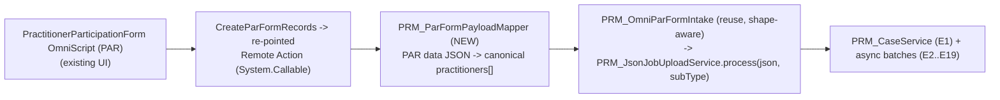
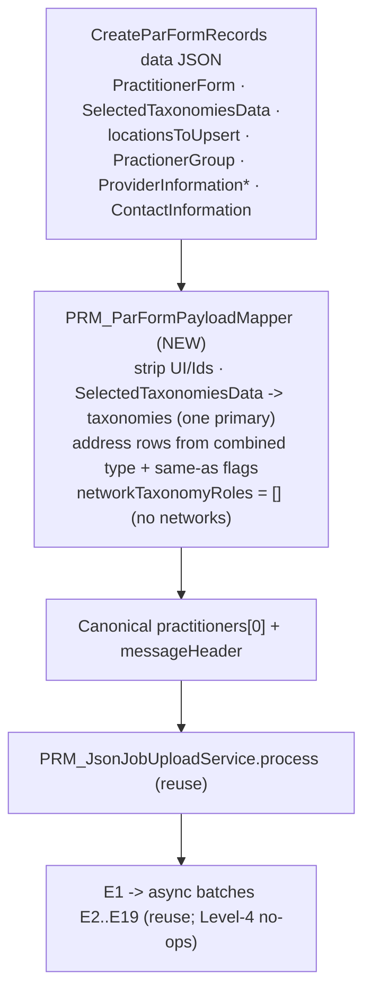

# PractitionerParticipationForm (PAR) OmniScript → Canonical — Conversion Plan (HLD + Analysis)

> **Purpose:** define how the **`PractitionerParticipationForm`** OmniScript (Type `PRMLDV`, SubType `PractitionerParticipationFormLDV`, id `0jNOv000000JrmzMAC`) — whose final **`CreateParFormRecords`** element creates records today — is routed through the **existing async pipeline** by mapping its data JSON to the **frozen canonical** message (`{ messageHeader, practitioners[] }`) that `PRM_JsonJobUploadService` → `PRM_CaseService` + the async batches already consume.
> **Model:** same approach as `PRM_OmniScript_To_Canonical_Payload_Design.md` (the `PRM_PractitionerCreation` / `IP_RecordCreation` design). Grounded on a **real** `CreateParFormRecords` payload (Pok Kim / EMPLOYER'S COLLECTIVE, `IsPARFlow: true`).
> **Headline finding:** the async **pipeline and all services (E1–E19) are reused as‑is — NO new service is needed**. The only new component is a **mapper for this OmniScript's data‑JSON shape**, which is *different* from the `IP_RecordCreation` shape the current `PRM_OmniPayloadMapper` handles.

---

## 1. The core insight — a THIRD source shape

We now have three OmniScripts feeding the same canonical pipeline, each with a different `elementName` and a different JSON shape:

| OmniScript | Final element | Source shape | Mapper |
| --- | --- | --- | --- |
| `PRM_PractitionerCreation` (Delegated) | `IP_RecordCreation` | `RecordsToUpdate` + `locationsToUpsert` + `PractionerGroup` + `practitionerTaxNtwk` | **`PRM_OmniPayloadMapper`** (built) |
| IBC form (`0jNOv000000Jt5d`) | `CreateAsyncRecordCreationTask` | `RecordsToUpdate` (subset, existing‑PL by Id, no NPI) | `PRM_OmniPayloadMapper` (handled via IBC branch) |
| **`PractitionerParticipationForm` (PAR)** | **`CreateParFormRecords`** | **`PractitionerForm` block + `locationsToUpsert` + `PractionerGroup` + `SelectedTaxonomiesData` + `ProviderInformation*` + `ContactInformation`** — **no `RecordsToUpdate`, no networks** | **NEW (this plan)** |

**Consequence:** `PRM_OmniPayloadMapper.toCanonical` reads everything out of `RecordsToUpdate.*`. This PAR payload has **no `RecordsToUpdate`** — the practitioner lives under the **`PractitionerForm`** block, taxonomies under **`SelectedTaxonomiesData`**, contact under **`ContactInformation`**, etc. So the existing mapper cannot parse it; a **new mapper (or a shape‑detecting branch)** is required. Everything downstream of the canonical is unchanged.

---

## 2. Where the converter lives (HLD)

- **New:** `PRM_ParFormPayloadMapper` — pure transform (no SOQL/DML) for the `PractitionerForm`/`SelectedTaxonomiesData`/`ContactInformation` shape.
- **Reuse:** `PRM_OmniParFormIntake` (the `Callable`), extended to **detect the shape** (presence of `PractitionerForm` vs `RecordsToUpdate`) and dispatch to the right mapper; then hand the canonical JSON to `PRM_JsonJobUploadService.process(...)`.
- **Reuse (unchanged):** the whole async framework — `PRM_CaseService` (E1), `PRM_PractitionerBatch` (E2/E5/E6/E7/E8/E10/E11/E16/E19), `PRM_PracticeLocationAndGroupBatch` (E3/E13), `PRM_PLRelatedBatch` (E14/E15), `PRM_Level4Batch` (E18/E23). **No service changes.**
- **Cutover:** re‑point `CreateParFormRecords` to a Remote Action → `PRM_OmniParFormIntake` (`Callable`, `global`, per the managed‑OmniStudio contract we already established). Rollback = re‑point back.

---

## 3. Source anatomy — the `CreateParFormRecords` data JSON

| Node | Holds | Maps to (canonical) |
| --- | --- | --- |
| `PractitionerForm` (block) | practitioner identity + specialty + degree + license + CAQH + additional specialties + provider role + FormType + FHNaticCaseNumber + CorporateReceiptDate | most of `practitioner.*` (§5) |
| `SelectedTaxonomiesData[]` | every selected taxonomy: `{ Id, Name, TaxonomyCode, PRM_TaxonomyClassification__c, PRM_TaxonomyGrouping__c }` | `practitioner.taxonomies[]` (authoritative code+name source) |
| `locationsToUpsert[]` | rich location(s) + multi‑address + `CareTaxxonomyData` (same shape as the Delegated design) | `groups[].locations[].addresses[]` |
| `PractionerGroup.GroupInformation` | one group: `GroupNPI`, `GroupTaxId`, name, `GroupPracticeType`, additional specialties | `practitioner.groups[]` (group envelope) |
| `ProviderInformationLanguageSpoken` | languages (`eng`) | `practitioner.languages[]` |
| `ProviderInformationAffirmingCategory` | affirming categories (practitioner‑level) | `location.affirmingCareCategory` (fan‑out) |
| `ProviderInformation` / `…PersonalPronouns` | race / hispanic / cultural / pronouns | **no canonical home (dropped — G5)** |
| `ContactInformation.PrimaryContact` | contact role/name/phone/email/FormCompletedBy | `providerInformation` / contact (E10) |
| `ReviewSubmit` | display summary of everything | **drop** (UI summary) |
| `TaxonomyToProviderType[]`, `StandardizedAddress`, `AddressVariablesList`, `requestData`, review/error/UI flags | reference + UI scaffolding | **drop** |

> **No `practitionerTaxNtwk` / networks** (`IsPARFlow: true`). So `networkTaxonomyRoles[]` is **empty** and Level‑4 (E18/E23) naturally **no‑ops** — nothing to build.

---

## 4. Target anatomy (recap)

`messageHeader` + `practitioners[]`, each: identity/demographics → `education[]`, `licenses[]`, `taxonomies[]`, `languages[]`, `infoCodes[]` → `groups[]` → `locations[]` (`addresses[]`, `networkTaxonomyRoles[]`). Authoritative field names per `docs/sampleInputs/PractitionerCreation/*.json`.

---

## 5. Field‑by‑field mapping (PAR source → canonical)

Legend: `copy` · `fmt` (reformat) · `derive` · `split`/`join` · `drop` · **GAP**.

### 5.1 Header (synthesized)
| Target | Source | Transform |
| --- | --- | --- |
| `messageHeader.sourceSystem` | — | `"OmniScript:PractitionerParticipationForm"` |
| `messageHeader.messageId` | `omniScriptId` + now | derive |
| `messageHeader.messageType` | `"PractitionerCreation"` | const |
| `messageHeader.generatedDateTime` | now | ISO‑8601 |

### 5.2 Identity & demographics (`PractitionerForm`)
| Target `practitioner.*` | Source | Transform |
| --- | --- | --- |
| `formType` | `PractitionerForm.FormType` (`"IBC"`) | copy |
| `corpReceiptDate` | `PractitionerForm.CorporateReceiptDate` (`07/29/2026`) | copy (already US) |
| `externalCaseNumber` | `PractitionerForm.FHNaticCaseNumber` (`"345"`) | copy |
| `effectiveFromDate` / `effectiveToDate` | ⚠️ not in `PractitionerForm` — confirm source (participation date / today) | derive |
| `firstName`/`middleName`/`lastName`/`suffix` | `PractitionerForm.PractitionerFirstName/MiddleName/LastName/Suffix` | copy |
| `dateOfBirth` | `PractitionerForm.PractitionerDOB` (`07/16/1982`) | copy |
| `gender` | `PractitionerForm.PractitionerGender` (`"Female"`) | copy (already a label) |
| `email` | `PractitionerForm.PractitionerEmail` | copy |
| `individualNpi` | `PractitionerForm.PractitionerIndividualNPI` (`1073549937`) | copy — **NPI present** (Delegated‑style keying, not the IBC no‑NPI case) |
| `caqhNumber` | `PractitionerForm.CAQHValue` / `PractitionerCAQHID` (`16174545`) | `String.valueOf` |
| `primarySpecialty` | `PractitionerForm.ProviderSpecialty-Block.Name` / `ProviderSpecialtyFormula` (`"Acupuncturist"`) | copy |
| `practitionerType` | `PractitionerForm.PractitionerType-Block.PractitionerType` (`"Acupuncturist"`) | copy (a **name** here, not an Id — better than the Delegated shape) |

### 5.3 Taxonomies (`SelectedTaxonomiesData[]` + `ProviderSpecialty-Block`)
Prefer **`SelectedTaxonomiesData[]`** — it already carries `{ TaxonomyCode, Name }` for every taxonomy. Primary = the `ProviderSpecialty-Block.TaxonomyCode` (`171100000X`). Emit `taxonomies[] = [{ careTaxonomyCode, isPrimarySpecialty }]`, exactly one primary, de‑duped by code.

### 5.4 Licenses (`PractitionerForm.AddLicenseBlock`)
Single object here → `licenses[] = [{ licenseNumber: PractitionerLicenseNumber, licenseState: PractitionerState }]`. (No DEA/CDS block in this payload; support one if it appears.)

### 5.5 Education (`PractitionerForm.PractitionerDegree-Block`) — **GAP**
Only the **degree** (`PractitionerDegree` / `DegreeCode`) is present — **no institution, no graduation dates**. E6 (`PRM_EducationService`) master‑data‑gates on **institution** being present in `PRM_Institution__c`, so with no institution it would **skip** PersonEducation. **Decision:** is PersonEducation expected for the PAR form? If yes, the OS must supply an institution; if no, accept that PAR creates no education row.

### 5.6 Info codes — none
No `InfoCodeIds` / `selectedInfoCodes` in this payload → `infoCodes[]` empty, no location `selectedInfoCodes`. (If the PAR form later carries them, the existing E8 handles both codes and Ids.)

### 5.7 Languages (`ProviderInformationLanguageSpoken`)
`languages[] = [{ value, shareInDir:true }]` from `LangaugesSpoken RecordCreation` (`value = "eng"`), fallback `LangaugesSpokenAPI`.

### 5.8 Provider‑information screens
- `location.affirmingCareCategory` ← `ProviderInformationAffirmingCategory.AffirmingCareCategory` (practitioner‑level → **fan out** to each location).
- Pronouns / race / cultural / hispanic (`ProviderInformation`, `…PersonalPronouns`) → **no canonical home → dropped (G5)** (same as the Delegated design).

### 5.9 Groups (`PractionerGroup.GroupInformation`)
| Target `groups[]` | Source | Transform |
| --- | --- | --- |
| `taxId` | `GroupInformation.GroupTaxId` (`"116489969"`) | copy (9‑digit) |
| `groupName` | `GroupInformation.GroupTypeAhead-Block.GroupTypeAhead` / `SelectedAccountName` (`"EMPLOYER'S COLLECTIVE"`) | copy |
| `groupNpi` | `GroupInformation.GroupNPI` (`1164899696`) | copy (join key to locations) |
| `addToAllLocations` | `GroupInformation.FormulaAdditionalLocationsSelected` (`false`) | derive |
| `locations[]` | `locationsToUpsert[].Locations[]` where `ExistingGroupNPI == GroupNPI` | fold (§5.10) |

### 5.10 Locations (`locationsToUpsert[].Locations[]`) — same shape as the Delegated design
`locationNpi` ← `ExistingGroupNPI` (group/org NPI — G9), `practiceName` ← `Name`, `doingBusinessAsName`, `primaryPracticeLoc` (`PrimaryPracticeLoc`), telehealth flags, `capabilitiesAtLocation` (`"American Sign Language"`), `addresses[]` (§5.11), `networkTaxonomyRoles[]` = **[]** (no networks in PAR). CareTaxxonomyData present but the practitioner taxonomies come from `SelectedTaxonomiesData` (§5.3).

### 5.11 Addresses (`locationsToUpsert[].Locations[].Addresses[]`)
Combined `AddressType "Primary;Mailing;Billing"` + `MailingAddressSameAsPrimary`/`BillingAddressSameAsPrimary` (both `true` here) → emit `Primary` + `Mailing` + `Billing` rows (replicated). Trust `locationsToUpsert` `State` (`"DE"`) over the display `"Delaware"`. Same Δ5 rule as the Delegated design.

---

## 6. Reuse analysis — what's covered vs. what's new

**Fully reused (no change):**
- **Async framework**: `PRM_AsyncOrchestrator`, `PRM_JsonJobUploadService`, all four batches, and services **E1–E19**. The canonical they consume is unchanged.
- Every target record the PAR form needs already has a service:

| Record | Service | Covered? |
| --- | --- | --- |
| Account / Case / Case Manager | E1 | ✅ |
| HealthcareProvider / NPI / Identifier / Taxonomy | E2 | ✅ |
| BusinessLicense | E5 | ✅ |
| PersonEducation | E6 | ⚠️ needs institution (§5.5) |
| ContactProfile | E10 | ✅ |
| PersonLanguage | E11 | ✅ |
| Group Account / EIN / HealthcareProvider | E3 | ✅ |
| Location / Address / HealthcareFacility | E13 | ✅ |
| HealthcarePractitionerFacility (PLA/PPA) | E14 | ✅ |
| ProviderFeature (AssistiveAid from `CapabilitiesAtLocation`, AffirmingCareCategory) | E15 | ✅ |
| Level‑4 (HealthcareFacilityNetwork) | E18/E23 | ✅ no‑ops (no networks) |
| CMA / CDM | E19 / E16 | ✅ |

**New (this plan):**
1. **`PRM_ParFormPayloadMapper`** — maps the `PractitionerForm`/`SelectedTaxonomiesData`/`ContactInformation` shape → canonical. (Or add a shape‑detecting second entry point to `PRM_OmniPayloadMapper` — see §9.)
2. **`PRM_OmniParFormIntake` (small change)** — detect shape (`PractitionerForm` vs `RecordsToUpdate`) and dispatch to the right mapper; derive Sub Type.
3. **`PRM_AsyncJobConfig__mdt`** — reuse the existing "Practitioner Creation" **Delegated** steps (no new steps needed; networks just no‑op). No new config unless a distinct "PAR" Sub Type is desired (§7).

> **No new service is required.** The gap is purely a **source‑shape mapper**.

---

## 7. Process / Sub‑Type routing (decision)

This payload has an **NPI**, a group, locations, taxonomies, and a license — i.e., the **full Delegated‑style record set** minus networks. Options:
1. **Route to `Practitioner Creation` / Sub Type `Delegated`** (recommended): reuses the 4 existing steps; Level‑4 (seq 4) finds no networks and no‑ops. Simplest, zero new config.
2. **New Sub Type `PAR`** (or use the existing `PROCESS_PAR = 'PAR'` process): only if PAR must run a *different* step subset than Delegated. Given the record set matches Delegated (sans networks), this adds config for no functional gain — defer unless required.

The intake wrapper sets the Sub Type; default remains **Delegated**.

---

## 8. Gaps & decisions

| # | Gap | Detail | Options |
| --- | --- | --- | --- |
| P1 | **effective dates** | `PractitionerForm` has no `effectiveFrom/To`. | derive (participation date / today), or confirm the OS field. |
| P2 | **education has no institution/dates** | only degree present → E6 skips PersonEducation (institution master‑data gate). | accept no education for PAR, or have the OS supply institution. |
| P3 | **provider‑info (pronouns/race/cultural/hispanic)** | no canonical home. | drop (G5) — languages + affirming DO map. |
| P4 | **`locationNpi` grain** | only the group/org NPI (`ExistingGroupNPI`) exists per location. | accept group NPI as `locationNpi` (same as Delegated design G9). |
| P5 | **networks absent** | `IsPARFlow` → no `practitionerTaxNtwk`. | none — Level‑4 no‑ops. Confirm PAR never has networks. |
| P6 | **Sub Type** | PAR vs Delegated (§7). | route Delegated (recommended). |

---

## 9. Recommended build shape

- **Mapper:** `PRM_ParFormPayloadMapper.toCanonical(Map<String,Object> data)` returning the canonical map — mirrors `PRM_OmniPayloadMapper` structure with per‑node sub‑builders (`buildPractitioner` from `PractitionerForm`, `buildTaxonomies` from `SelectedTaxonomiesData`, `buildGroupsAndLocations` from `PractionerGroup` + `locationsToUpsert`, `buildAddresses`, `buildLanguages`, `synthHeader`). Share the small helpers (`toUsDate`, `splitSemicolon`, address‑split, `asList`/`asMap`) — consider extracting them to a common util both mappers use.
  - *Alternative:* one entry point on `PRM_OmniPayloadMapper` that **detects the shape** (`data.containsKey('PractitionerForm')` → PAR branch; `containsKey('RecordsToUpdate')` → existing branch). Either is fine; a separate class keeps each shape readable.
- **Intake:** `PRM_OmniParFormIntake.call(...)` — detect shape, pick mapper, `process(canonicalJson, 'Practitioner Creation', fileName, subType)`; return `{ jobId, ... }`.
- **Remote Action:** re‑point `CreateParFormRecords` → `PRM_OmniParFormIntake` (`global`, `System.Callable`), sending the OmniScript data JSON.
- **Tests:** feed THIS real payload (save it as `docs/reference/practitionerParticipationForm_OmniJSON.json`) → assert the canonical (identity, 4 taxonomies with one primary, single license, group→location→3 address rows, languages, empty networks) + a round‑trip through `PRM_JsonJobUploadService`.

---

## 10. Conversion flow (end to end)

> **Mental model:** *new mapper for a new source shape → reuse the entire pipeline.* No new service; the only real functional gaps are education‑institution (P2) and effective dates (P1).

---

## 11. Residual checks (before build)
- Confirm the **`CreateParFormRecords`** element's current target (Remote Action vs Integration Procedure) and exactly which records/objects the current IP creates, to validate the §6 coverage table (org‑query was pending on a tooling hiccup at authoring time).
- Confirm **effective dates** source (P1) and whether **institution** is (or should be) captured (P2).
- Confirm PAR **never** carries networks (P5).
- Confirm the desired **Sub Type** routing (§7).
