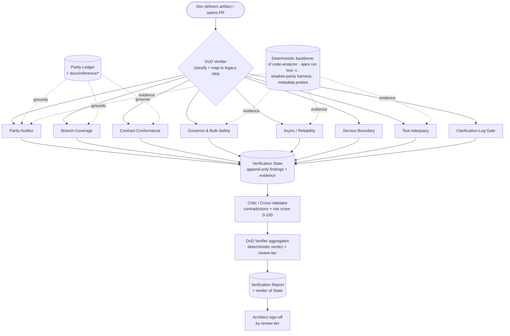
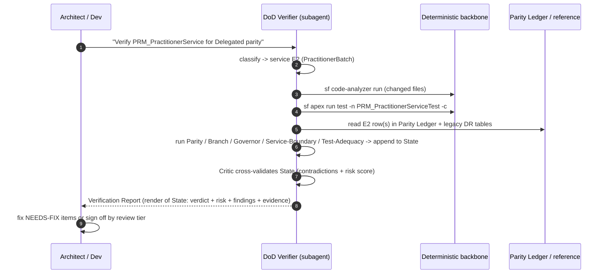

# 00 — Architecture

> The build-verification layer is a **hybrid agentic system**: a deterministic backbone (Salesforce
> CLI / Apex / metadata checks that cannot be argued with) wrapped by LLM reasoning agents that
> interpret the evidence against the **legacy guided-flow business functionality**. Every verdict is
> grounded in a tool result or a cited line in [`docs/reference/`](../reference/) — never in LLM opinion.

---

## 1. Design principles

These mirror the guardrails proven in the IBXQA `AgenticAI` work, adapted from *deciding about
providers* to *verifying delivered code*:

1. **Deterministic before LLM.** If a check can be expressed as a command (`sf code-analyzer run`,
   `sf apex run test --code-coverage`, a SOQL count, a metadata grep), it runs as a command first.
   The LLM only interprets, correlates, and explains — it never *replaces* a determinable fact.
2. **Grounded against the legacy spec.** "It looks right" is not a pass. Every parity claim cites a
   row in the [Parity Ledger](02_Parity_Ledger.md), which itself cites the legacy DataRaptor → object
   tables in [`PRM_PractitionerCreationContainer_Process.md`](../reference/PRM_PractitionerCreationContainer_Process.md)
   and the step/object/DML tables in [`PRM_PractitionerCreation_Apex_Service_Flow.md`](../reference/PRM_PractitionerCreation_Apex_Service_Flow.md).
3. **Honor the golden source-of-truth hierarchy** ([`CLAUDE.md`](../../CLAUDE.md) §0): live org metadata
   > Epic A schema > Implementation Plan > TDD > Epic guides > `docs/reference/*`. An agent that finds
   a delivery contradicting a higher source **flags it; it does not silently accept it**.
4. **Respect the Clarification Log.** Open items (CL-6, CL-11, CL-13, CL-15) are *blockers*, not
   nuisances. An agent never "resolves" an open CL on the developer's behalf — it returns `BLOCKED`
   with the owner who must sign off.
5. **One artifact in, one report out.** Each verification run produces a single
   **Verification Report** with a verdict and an append-only evidence trail (the doc-based analog of
   the `PRM_AgentDecision__c` audit object).
6. **Reviewer-augmenting, not reviewer-replacing.** The final verdict is advisory; an architect signs
   off. The agent's job is to make that sign-off fast and consistent.

---

## 2. Layered model

```
L0  Trigger        Dev delivers a class/batch/LWC/metadata, OR opens a PR
L1  Router         DoD Verifier — classifies the artifact, selects the agent subset, sequences runs
L2  Verifiers      8 verification agents (Parity, Branch, Contract, Governor, Async,
                   Service-Boundary, Test-Adequacy, Clarification-Log Gate)
L2.5 Critic        Critic / Cross-Validator — reads ALL verifier findings off the shared state,
                   detects contradictions BETWEEN agents, computes the numeric risk score
L3  Grounding      Parity Ledger (legacy->target map) + docs/reference/* + Epic_E field maps
L4  Backbone       Deterministic tools: sf code-analyzer, sf apex run test --code-coverage,
                   shadow-mode parity harness, metadata/SOQL probes, the existing .cursor skills
S   State          Verification State — the shared, append-only object every layer reads/writes (§4.5)
L5  Output         Verification Report (markdown) = a deterministic render of the State -> sign-off
```

Each agent is a **thin reasoning layer over a deterministic check.** The intelligence is in
*routing* (which checks apply to this artifact), *correlation* (does the delivered service actually
create every object the legacy DR created for that step), *cross-validation* (does one agent's finding
contradict another's — the **Critic**'s job), and *explanation* (a reviewer-readable report with
citations).

> This structure mirrors the proven reference agents (see [`05_Reference_Agent_Audit.md`](05_Reference_Agent_Audit.md)):
> specialists → **Critic (cross-validate + numeric risk score)** → decision, all accumulating into a
> shared append-only state — the same shape as the Senior Mortgage Underwriting system's
> `UnderwritingState` + `reasoning_chain`.

---

## 3. How an "agent" is realized in Cursor

There is no separate runtime to stand up. Each agent is composed from primitives the org already uses
(see [`.cursor/skills/README.md`](../../.cursor/skills/README.md)):

| Primitive | Role in a verification agent | Example |
|-----------|------------------------------|---------|
| **Rule** (`.cursor/rules/*.mdc`) | Always-on / glob-scoped invariants the agent enforces while reviewing a file | extend [`prm-service-class-boundaries.mdc`](../../.cursor/rules/prm-service-class-boundaries.mdc) with parity + bulk-safety rules |
| **Skill** (`.cursor/skills/<name>/SKILL.md`) | The agent's reusable instruction set + which deterministic commands to run, auto-invoked by description | a new `verifying-practitioner-parity` skill; reuse `running-code-analyzer`, `running-apex-tests`, `analyzing-omnistudio-dependencies`, `debugging-apex-logs` |
| **Subagent prompt** (Cursor Task) | The orchestration prompt that runs the agent against a target and emits the report | the **DoD Verifier** prompt; a PR-scoped **code-review** subagent that runs the roster against a diff |
| **Reference doc** (this folder) | The grounding corpus the agent reads (the "RAG corpus" equivalent) | the [Parity Ledger](02_Parity_Ledger.md) |
| **Deterministic backbone** | The CLI/Apex evidence the verdict rests on | `sf code-analyzer run`, `sf apex run test -c`, the G4 shadow harness |

> **Why not Agentforce?** These agents read source code, run the Salesforce CLI, and diff against repo
> metadata — work that lives in the IDE/PR loop, not in a provider-facing org runtime. The IBXQA
> `AgenticAI` Agentforce stack is the right home for *business* agents; the build-verification layer is
> the right home for *engineering* agents. They share discipline, not infrastructure.

---

## 4. The DoD Verifier (router / orchestrator)

The DoD Verifier is the single entry point. It:

1. **Classifies** the delivered artifact(s):
   - `PRM_*Service.cls` → a domain service (E1–E19).
   - `PRM_*Batch.cls` → one of the five batch classes.
   - `PRM_AsyncOrchestrator` / trigger / `*CleanupBatch` → async-framework (Epic C).
   - `*Selector.cls` → read layer (Epic D).
   - `prm*` LWC → UI (Epic C5 progress, or intake).
   - `objects/`, `customMetadata/`, `permissionsets/` → schema (Epic A).
   - `PractitionerCreationPayloadValidator` / IP wrapper → intake (Epic F).
2. **Resolves the Epic-E mapping** for a service/batch (which step in the legacy flow it corresponds
   to) from [Plan §8.1](../implementation-plan/PRM_Implementation_Plan.md) and the [Parity Ledger](02_Parity_Ledger.md).
3. **Selects the agent subset** (see the routing matrix in [`01_Agent_Catalog.md`](01_Agent_Catalog.md) §"Routing").
4. **Runs deterministic checks first**, then the LLM reasoning agents over the evidence — each writes
   its findings into the shared **Verification State** (§4.5).
5. **Invokes the Critic** ([`01_Agent_Catalog.md`](01_Agent_Catalog.md) Agent 9) to **cross-validate
   findings across agents** (catching contradictions a per-agent check cannot — e.g. a parity PASS with
   no test asserting that record) and to compute the numeric **risk score (0–100)**.
6. **Aggregates** into one report with a single verdict. The verdict is **deterministic** (no LLM math):
   any `BLOCKED` → `BLOCKED`; else any unresolved Critic contradiction or any `NEEDS-FIX` → `NEEDS-FIX`;
   else `PASS`. The risk score sets the **review tier** (auto-accept / architect review / owner-block).



### 4.5 Verification State (the shared, append-only object)

Every layer reads from and appends to **one** state object the DoD Verifier seeds at the start of a run.
It is the doc/JSON analog of the mortgage system's `UnderwritingState` + `Annotated[list, operator.add]`
`reasoning_chain`. The Critic (Agent 9) reads it to find cross-agent contradictions; the Verification
Report (§6) is a **deterministic render** of it — nothing in the report is re-narrated by the LLM.

```
VerificationState:
  # routing (set by the DoD Verifier)
  artifact            # file(s) under review
  resolved_step       # E# · batch · IBC/Delegated (Parity Ledger row)
  agents_selected     # the routed subset

  # per-agent findings (each agent appends; never overwrites)
  parity_findings     # {object, expected, actual, status, ledger_citation}[]
  branch_findings
  contract_findings
  governor_findings
  async_findings
  boundary_findings
  test_findings
  cl_findings

  # evidence (deterministic — what each verdict rests on)
  evidence[]          # {tool, command, output_ref, citation}

  # Critic output (Agent 9)
  contradictions[]    # {between, description, resolved}  cross-agent conflicts
  risk_score          # 0-100, weighted from findings

  # decision (deterministic render)
  reasoning_chain[]   # append-only, ordered: one line per agent/critic step
  verdict             # PASS | NEEDS-FIX | BLOCKED
  review_tier         # auto | architect | owner-block   (from risk_score + verdict)
  signoff             # reviewer + date (filled by the human)
```

**Append-only rule.** Agents add findings and `reasoning_chain` lines; they never edit another agent's
findings. This makes the trail reproducible and gives the Critic a complete, ordered picture — and it is
why the report can be rendered deterministically rather than re-summarized.

---

## 5. Run flows

### 5.1 In-IDE (single delivery)



### 5.2 On PR (diff-scoped, headless-friendly)

A `code-review` subagent runs the **same roster** against `git diff <base>...HEAD`, scoped to changed
`force-app` files. It posts the consolidated report as a PR comment and sets a non-blocking advisory
status. (The deterministic backbone — Code Analyzer + Apex tests — already runs on the org's deploy
gate; the agents add the *parity + branch + contract + async* reasoning the gate cannot express.)

> The form factor was chosen as Cursor-native (in-IDE + PR subagent). If/when the team wants a fully
> headless CI gate, the same skills/commands run from `cursor-agent`/CI; that is out of scope for this
> deliverable but the backbone commands in [`04_Adoption_Playbook.md`](04_Adoption_Playbook.md) are
> CI-ready as-is.

---

## 6. The Verification Report (audit artifact)

Every run writes one markdown report (template in [`04_Adoption_Playbook.md`](04_Adoption_Playbook.md)
§"Report template"). It is a **deterministic render of the Verification State** (§4.5) — the doc-based
equivalent of the IBXQA `PRM_AgentDecision__c` audit object — append-only, queryable by reviewers, and
the record an architect signs.

Each report captures: the artifact + resolved legacy step, the agent roster run, per-agent verdict +
evidence (tool output excerpts + Parity Ledger citations), the **Critic's contradictions + risk score**,
the aggregate verdict + **review tier**, open CL blockers, and the reviewer sign-off line. Suggested
home: `docs/build-verification/reports/<artifact>_<date>.md` (git-tracked so the trail travels with the
code).

---

## 7. Trust & failure modes (how the agents avoid being wrong)

| Failure mode | Mitigation |
|--------------|------------|
| LLM hallucinates a "passing" parity claim | Parity claims must cite a Parity Ledger row + a legacy DR; an uncited object/field claim is auto-demoted to `NEEDS-FIX` (manual check) |
| Field-level parity asserted before maps exist | If the service's DR→object field map is still "inferred" (CL-11), the Parity Auditor caps its verdict at object-level and returns `BLOCKED` on field parity |
| Naming traps (PPL, HCPFN, CDM) | Encoded as explicit "do-not-expect / expect-instead" rows in the Parity Ledger so a naive name-match cannot pass or fail incorrectly |
| Response "parity" misread as byte-for-byte | Contract Conformance is told the model is async-only; it verifies the *new* immediate contract + *eventual record* parity, not legacy synchronous response shape |
| Stale legacy reference | The legacy spec is "active version only"; agents reconcile against active OmniStudio metadata via `analyzing-omnistudio-dependencies` before trusting a reference table |
| Open CL silently resolved | Clarification-Log Gate runs on every artifact and hard-blocks divergence from open CL items |
| One agent passes but contradicts another (e.g. parity PASS with no test asserting that record) | The Critic (Agent 9) cross-validates findings across agents off the shared State and raises a `contradiction`; an unresolved contradiction demotes the verdict to `NEEDS-FIX` |
| Verdict drifts because the LLM "summarized" the result | The verdict + risk score are computed **deterministically** from the State; the LLM only writes the explanation prose, never the math |
