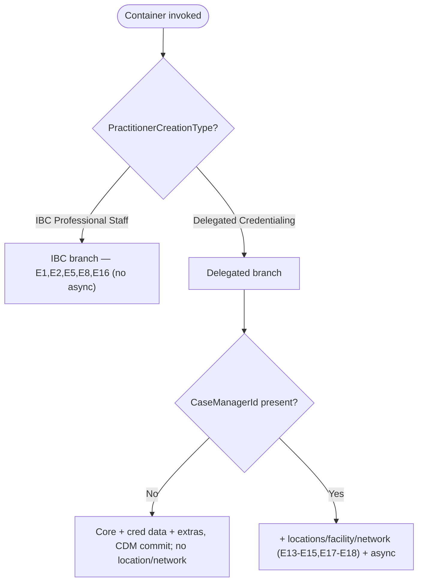

# 02 — Parity Ledger

> The machine-checkable map the **Parity Auditor** reads. It pins each step of the **current Practitioner
> Creation guided flow** (legacy OmniStudio IP/DataRaptor) to the objects/fields it creates and to the
> **new** service/batch that must reproduce that result. It also encodes the parity *nuances* every
> reviewer gets wrong.
>
> **Authority:** grounded to the active-version legacy behavior in
> [`PRM_PractitionerCreationContainer_Process.md`](../reference/PRM_PractitionerCreationContainer_Process.md) §4–§5
> and [`PRM_PractitionerCreation_Apex_Service_Flow.md`](../reference/PRM_PractitionerCreation_Apex_Service_Flow.md),
> mapped to the target services in [`PRM_Implementation_Plan.md`](../implementation-plan/PRM_Implementation_Plan.md) §8.
> Per the golden hierarchy, **live org metadata wins** over this ledger; reconcile against the active
> OmniStudio version (`analyzing-omnistudio-dependencies`) before trusting a row.
>
> ⚠️ Field-level columns are **object-level until CL-11 is closed.** Where a target field is still
> "inferred" the Parity Auditor certifies the object only and returns `BLOCKED` on field parity. Fill
> the field-detail per service from `Epic_E_Practitioner_Services*.md` as each map is signed off.
>
> **Sibling:** this ledger covers *records created*. For *payloads rejected* — the eligibility / "must /
> can-only" rules (duplicate practitioner, already-credentialed, NPI must exist, practice-location-known,
> effective-date) — see [`02b_Validation_Rule_Ledger.md`](02b_Validation_Rule_Ledger.md).

---

## 1. Legacy active versions (the "current" flow being replicated)

| Layer | Active version | Role |
|-------|----------------|------|
| Container | `PRM_PractitionerCreationContainer_Procedure_6` | Router; branches on `PractitionerCreationType`; `TryCatchBlock` (`rollbackOnError=true`) |
| IBC child | `PRM_PractitionerCreation_Procedure_3` | IBC Professional Staff branch |
| Delegated child | `PRM_DelegatedPractitionerCreation_Procedure_7` | Delegated Credentialing branch |
| Provider screen | `PRM_DelegatedCreateProviderScreenRecords_1` | Contact profile + person language |
| Address logic | `PRM_AddressLogicContainer_English_6` | Delegated post-processing (only if `CaseManagerId`) |
| Address writer | `PRM_PractitionerAddressCreation_5` | Heaviest IP — facility/address/network |
| Existing primary | `PRM_ExistingPrimaryPracticeLocationLogicDelg_3` | Dedup/update existing primary practice |

OmniScript entry: `PRM_PractitionerCreation_English_*` → IP Action `IP_RecordCreation`
(`integrationProcedureKey=PRM_PractitionerCreationContainer`, `remoteTimeout=30000`).

---

## 2. Branch map (verified by the Branch-Coverage agent)

- **IBC Professional Staff** (lean, no async): E1 Case, E2 Practitioner, E5 License, E8 InfoCode,
  E16 CDM. Links to existing facilities only.
- **Delegated Credentialing** (full): adds E3 Group, E6 Education, E7 BoardCert, E9 File, E10 Contact,
  E11 Language, and — **only when `CaseManagerId` present** — E13–E15 location/facility + E17/E18 async
  network. `isExistingNPI=true` → deltas only.

---

## 3. Step → object → new owner ledger (Delegated, full path)

Legend: **Op** I=insert U=update. **New owner** = target service (Plan §8.1) inside its batch.

| # | Legacy step / DataRaptor(s) | Objects (legacy) | Op | New owner (service · batch) | Notes / parity gate |
|---|------------------------------|------------------|----|------------------------------|---------------------|
| 0 | `DRPAccountCaseCaseManagerCreation` / `PRMDRCreateCaseCaseManagerAndAccount` | `Account` (Practitioner), `Case`, `IndividualApplication` (= Case Manager) | I×3 | **E1 `PRM_CaseService`** · *sync intake* | IA **is** the Case Manager; circular FK → insert + back-link updates; bulk over `applications[]`, one per practitioner |
| 1 | `DRPHCProviderHCProviderTaxonomyAndBusineessLicense`, `DRPHCPNPIBoardCretIdentifier` | `HealthcareProvider`, `HealthcareProviderNpi`, `Identifier`, `HealthcareProviderTaxonomy` | I | **E2 `PRM_PractitionerService`** · PractitionerBatch | E4 Taxonomy **merged into E2**; name normalized via `PRM_FormSubUtility.NameNormalize` (legacy `RA_TitleCase`/`PRM_OmniUtils.titleCase`) |
| 2 | `PRMPostGroupPractitionerCreation` / `DRCreateGroupRecords` | `Account` (Group/Vendor), `Identifier`, `HealthcareProviderNpi`, `HealthcareProvider` (group side) | I×4 | **E3 `PRM_GroupService`** · PracticeLocationAndGroupBatch | Delegated only |
| 3 | (taxonomy pipeline) `DRExtractTaxonomyData`→`DRTTaxonomyData`; persisted with step 1 | `HealthcareProviderTaxonomy` | I | **E2** (fused) | Transform DRs are in-memory only — no object parity |
| 4 | `DRTransformDelegatedBusinessLicense`→`LA_MergeBusinessLicense`→ HCP/License post | `BusinessLicense` | I | **E5 `PRM_LicenseService`** · PractitionerBatch | unified `businessLicenses[]` (DEA/CDS + SBRD) |
| 5 | `TransformAddEducation`→`DRPCreateEducation` | `PersonEducation` | I | **E6 `PRM_EducationService`** · PractitionerBatch | Delegated only |
| 6 | `DRPHCPNPIBoardCretIdentifier` (board cert portion) | `BoardCertification` | I | **E7 `PRM_BoardCertificationService`** · PractitionerBatch | upsert by `BoardName`; runs after E2 |
| 7 | `RA_GetInfoCodesList`→`DRPCreateInfoCodeAssignments` *(gated)* | `PRM_InfoCodeAssignment__c` (practitioner-grain) | I | **E8 `PRM_InfoCodeService`** · PractitionerBatch | only if info codes present |
| 8 | `SV_AdditionalNodesToFileData`→`DRCreateIdentiferAndDocument` *(gated)* | `Identifier` (Document RT), `ContentDocumentLink` | I×2 | **E9 `PRM_FileService`** · PracticeLocationAndGroupBatch | only if `FileData` present |
| 9 | `DRPCreateContactProfileRecords` (provider screen sub-IP) | **`ContactProfile`** *(not `Contact`)* | I | **E10 `PRM_ContactService`** · PractitionerBatch | ⚠ target is `ContactProfile`; legacy reference text says "Contact" — see §6 trap |
| 10 | `DRTransformPersonLanguage`→`DRCreatePersonLanguage` *(gated)* | `PersonLanguage` | I | **E11 `PRM_LanguageService`** · PractitionerBatch | only if languages present |
| 11 | (NPI create/update helper) `PRM_OmniUtils.updateExistignHCPNPI` | `HealthcareProviderNpi` | I/U | **E12 `PRM_HealthcareProviderNpiService`** · PracticeLocationAndGroupBatch | reusable create/update |
| 12 | `PRMDRCreatePractitioner*AddressRecords*Delg` (loop × NPI scenarios) | `Location`, `Address`, `HealthcareFacility` | I/U | **E13 `PRM_HealthcareFacilityCreationService`** ⚡ · PracticeLocationAndGroupBatch | only if `CaseManagerId`; invokes E14 + E15; legacy `AddressService` is **not** a separate sync service now |
| 13 | `DRPCreateHealthcarePractitionerFacilityDelg`, `DRPCreateHCPFForPractitionerPracAffiliationDelg`, `PRMDRCreatePPLForPPADelg`, `PRMUpdatePracticeToPractitionerDelg` | `HealthcarePractitionerFacility` (RT PractitionerLocationAffiliation / PractitionerPracticeAffiliation) | I/U | **E14 `PRM_HPFService`** (sub-service `PractionerPracticeLocationService`) · PLRelatedBatch | ⚠ **PPL = `HealthcarePractitionerFacility`** (CL-2) — there is no `PractitionerPracticeLocation` object |
| 14 | `PRMDRCreatePracProviderFeatureACC`, `PRMDRCreateProviderFeatureAssitiveAids`, ACC transforms | `PRM_ProviderFeature__c` (ACC + Assistive Aids) | I | **E15 `PRM_ProviderFeatureService`** · PLRelatedBatch | plan note: **Assistive Aids only**, RT `PRM_AssistiveAid`, create+update |
| 15 | `PRMLoadInfoCodeAssigned`, `PRMLoadInfoCodeAssignedPracFacilities` | `PRM_InfoCodeAssignment__c` (facility-grain) | I | **E8** (facility-grain path) | gated by addresses present |
| 16 | `PRMDRCreatePractitionerFacilityNetwork`, `PRMDRCreatePracHealthCareFacilityNetworkForGroup`, `PRMDRPracCreateHCFacilityNetworkRecordNewGroup` | `HealthcareFacilityNetwork` (RT `PRM_FacilityNw` / `PRM_FacilityTx`) | I | **E17 `PRM_HealthcareFacilityNetworkService`** ⚡ · PLRelatedBatch | ⚠ **no `HealthcarePractitionerFacilityNetwork`** (CL-3) — see §6 trap |
| 17 | Level-4 network (Practitioner × PracticeLocation × Taxonomy × Role × Network) | `HealthcareFacilityNetwork` (RT `PRM_FacilityPractitionerTxNw`) | I | **E18 `PRM_Level4RecordCreationService`** · Level4RecordCreationBatch | high-volume; batch |
| 18 | `PRMDRCheckIfPracticeToPractitionerExist` + existing-primary update DRs (`PRM_ExistingPrimaryPracticeLocationLogicDelg` v3) | `HealthcareFacility`, `HealthcarePractitionerFacility` (linkage updates) | I/U | folded into **E13/E14** existing-primary path | dedup/update rather than create |
| 19 | `PRMDRCreateCDM`/`PRMDRPCDMCaseManagerLink`, `PRMDRCreateCDMForPractitioner`, `PRMDRPCaseDataManager`, existing-primary CDM update | `PRM_CaseDataManager__c` | I **or** U ×1 | **E16 `PRM_CaseDataManagerService`** · PractitionerBatch | ⚠ legacy writes CDM **3–4×**; new = **one coalesced** write — see §6 trap |
| 20 | (junction to Case Manager, where a CMA RT exists) | `PRM_CaseManagerAssociation__c` (14 RTs) | I/U | **E19 `PRM_CMAService`** (common; invoked by batches) | idempotent **pre-check** dedup; subset of objects only (Education/BoardCert/InfoCode/NPI/File/Contact/Language have **no** CMA RT) |
| async | `EnqueueNetworkCreation` (`PRM_OmniProcessUtils`→`PRM_NetworkCreationHelper`→`PRM_IfcLoader`) | network records, off-transaction | I | **E17/E18 inside the async chain** (`PRM_AsyncOrchestrator` → batches) | replaces fire-and-forget Queueable; now tracked via `PRM_AsyncJob__c`/`PRM_AsyncJobDetails__c` |

⚡ = high-leverage / load-test priority.

---

## 4. IBC branch ledger (lean path)

| Legacy step | Objects | New owner |
|-------------|---------|-----------|
| `DRPAccountCaseCaseManagerCreation` | `Account`, `Case`, `IndividualApplication` | E1 `PRM_CaseService` (sync intake) |
| `DRPHCProviderHCProviderTaxonomyAndBusineessLicense` | `HealthcareProvider`, `HealthcareProviderTaxonomy`, `BusinessLicense` | E2 + E5 |
| `DRPCreateInfoCodeAssignments` *(gated)* | `PRM_InfoCodeAssignment__c` | E8 |
| `DRPPractionerPracticeLocations` | `HealthcarePractitionerFacility` (+ links to existing facility) | E14 (IBC path) |
| `PRMDRCreateCDM` + `PRMDRCreateCDMForPractitioner` | `PRM_CaseDataManager__c` | E16 (one coalesced write) |

IBC creates **no** group, education, board cert, file, contact, language, address, or network records,
and runs **no async**. (Legacy IBC also had **no validator** — the new model validates both branches
synchronously pre-enqueue; the Branch-Coverage + Contract agents treat added IBC validation as an
intended improvement, not a parity break.)

---

## 5. Object inventory (the full Delegated set the Parity Auditor checks for)

`Account` (Practitioner + Group) · `Case` · `IndividualApplication` · `HealthcareProvider`
(practitioner + group) · `HealthcareProviderNpi` (practitioner + group) · `Identifier` (practitioner,
group, file) · `HealthcareProviderTaxonomy` · `BusinessLicense` · `PersonEducation` ·
`BoardCertification` · `PRM_InfoCodeAssignment__c` (practitioner + facility grain) · `ContentDocumentLink`
· `ContactProfile` · `PersonLanguage` · `Location` · `Address` · `HealthcareFacility` ·
`HealthcarePractitionerFacility` · `PRM_ProviderFeature__c` · `PRM_CaseDataManager__c` ·
`HealthcareFacilityNetwork` · `PRM_CaseManagerAssociation__c` · async tracking
(`PRM_AsyncJob__c` / `PRM_AsyncJobDetails__c` / `PRM_AsyncJobRecords__c`).

---

## 6. Parity nuances (the traps — encoded so naive checks can't pass/fail wrongly)

These are the things a literal name-match against the legacy reference gets **wrong**. The Parity
Auditor must apply each rule.

1. **PPL is not an object (CL-2).** "PractitionerPracticeLocation" / "PPL" in legacy DR names
   (`PRMDRCreatePPLForPPADelg`) maps to **`HealthcarePractitionerFacility`** records. *Expect HCPF; do
   not expect a `PractitionerPracticeLocation` object.* A delivery that invents a `PractitionerPracticeLocation__c`
   is a **NEEDS-FIX**.
2. **HCPFN does not exist (CL-3).** Legacy reference tables and `PRMDRCreatePractitionerFacilityNetwork`
   mention `HealthcarePractitionerFacilityNetwork`. The target async creates **`HealthcareFacilityNetwork`
   only**. *Do not require HCPFN; flag any attempt to create it.*
3. **CDM coalescing.** Legacy writes `PRM_CaseDataManager__c` **3–4 times** in one transaction
   (`PRMDRCreateCDM`, `PRMDRCreateCDMForPractitioner`, `PRMDRPCaseDataManager`, existing-primary update)
   → `UNABLE_TO_LOCK_ROW` risk (P3). New = **one** coalesced INSERT/UPDATE. *Assert the final field
   state (all counters present), never the write count; more than one CDM DML per object type is a
   NEEDS-FIX, not parity.*
4. **`ContactProfile`, not `Contact`.** E10 writes `ContactProfile`; the legacy reference prose says
   "Contact." *Expect `ContactProfile`.*
5. **Response contract changed (async-only).** Legacy returned `PractitionerScreenRecordIds`,
   `GroupRecordIds`, `CaseManagerId`, etc. **synchronously**. New intake returns `{ success, AsyncJobId }`
   immediately and creates the heavy records asynchronously. *Parity is verified on the **resulting
   records** (shadow mode, G4), not on a synchronous response payload.* See [Audit §2](03_Plan_Audit_Findings.md).
6. **Transaction model changed.** Legacy = single transaction, `rollbackOnError=true` (all-or-nothing).
   New = per-batch transactions, **halt-on-failure, no compensating rollback** (completed batches'
   records persist; manual retry resumes). *A partial failure yields a **different end-state** than
   legacy by design; do not flag "records remain after a later failure" as a parity break — see the
   partial-failure expectations in [Audit §2](03_Plan_Audit_Findings.md).*
7. **Transforms create nothing.** Legacy DR Transforms / List Merges / Set Values / Turbo-reads
   (`DRTTaxonomyData`, `LA_MergeBusinessLicense`, `DRExtractTaxonomyData`, …) are in-memory or read-only.
   *They have no object parity; do not look for a service that "implements" them.*
8. **Misleading legacy element names.** IBC v3 `RA_GetInfoCodesList` / `RA_GetRecordTypeList` actually
   call `convertToListSobjects` (pure list-shaping), not data fetches. *No parity object; map to in-service
   list shaping / `PRM_FormSubUtility`.*
9. **CMA is a subset.** Only objects with a CMA record type get a `PRM_CaseManagerAssociation__c` row
   (14 RTs). *Education / BoardCert / InfoCode / NPI / File / Contact / Language have none — do not flag
   their absence from CMA as missing parity.*
10. **`GroupRelatedBatch` is unassigned (CL-15).** No legacy step is mapped to it yet. *Any delivery
    targeting `GroupRelatedBatch` is `BLOCKED` until the mapping lands.*

---

## 7. How the Parity Auditor uses this ledger

1. Resolve the delivered class → step row(s) (§3 / §4).
2. Extract the SObjects the delivered class touches (deterministic static scan).
3. Compare to the row's expected object set, applying every §6 rule.
4. Classify each object `matched / missing / extra / renamed-by-CL`.
5. If the field map is signed off (CL-11 closed for that service), descend to field level using the
   `Epic_E_Practitioner_Services*.md` map; else cap at object-level + `BLOCKED` on fields.
6. Emit findings with citations to this ledger row + the underlying legacy DR table.
