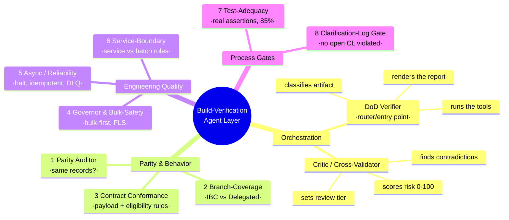
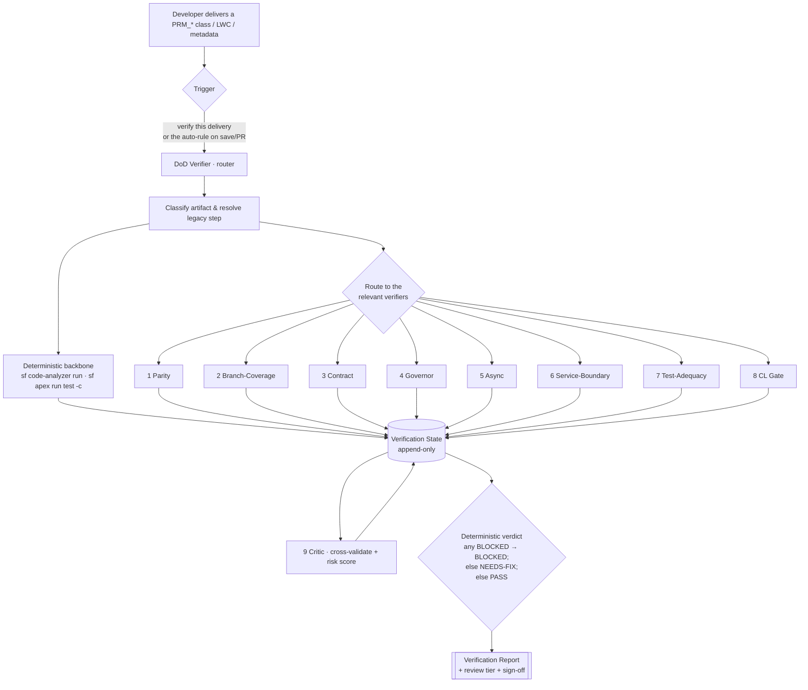

# 07 — Agents Glossary & Walkthrough (start here)

> A plain-language tour of the **build-verification agent layer**: what each agent does, when it runs, and
> how the team uses it. This is the "read me first" companion to the detailed
> [Agent Catalog](01_Agent_Catalog.md) and [Architecture](00_Architecture.md).

---

## The one-paragraph mental model

A developer rebuilds a piece of the Practitioner Creation flow (an Apex **service**, a **batch**, an **LWC**,
or **metadata**). Instead of a reviewer manually checking it against the old OmniStudio flow, they ask Cursor
to **"verify this Practitioner Creation delivery."** One **router** agent (the DoD Verifier) figures out what
was delivered, runs the deterministic tools (Code Analyzer + Apex tests), dispatches a handful of **specialist
verifier** agents that each check one concern, then a **Critic** looks across all their findings for
contradictions and scores the risk. The output is a single **Verification Report** with a verdict —
`PASS` / `NEEDS-FIX` / `BLOCKED` — that an architect signs off. The verdict is computed by a fixed rule, never
"decided" by the AI.

---

## Mind map — the 10 agents at a glance

---

## Run flow — when each agent fires

**Always run:** DoD Verifier (router), Test-Adequacy + CL Gate (for any code), and the Critic (last).
**Conditionally run:** the rest, based on what the artifact is (see the routing table below).

---

## Quick reference — what / when / fails when

| # | Agent | Proves (the question it answers) | Runs when the delivery is… | Typical NEEDS-FIX / BLOCK trigger |
|---|-------|----------------------------------|----------------------------|-----------------------------------|
| 10 | **DoD Verifier** *(router)* | "Is this delivery done, end-to-end?" | **Always** — it's the entry point | n/a (aggregates the others) |
| 1 | **Parity Auditor** | "Does it create the **same objects/fields/record types** as legacy?" | Service, batch, selector, metadata | Missing/extra object, wrong RT; **BLOCKED** if field map unsigned (CL-11) |
| 2 | **Branch-Coverage** | "Does it branch **IBC vs Delegated** and honor the sub-gates exactly?" | Service, batch, validator | Delegated-only object created on IBC; a gate missing/inverted |
| 3 | **Contract Conformance** | "Does the **payload + response** conform, and are **eligibility rules** ported server-side?" | Validator, intake LWC | Lossy payload; **BLOCKED** if an R-E1–R-E3 duplicate/already-credentialed gate is absent |
| 4 | **Governor & Bulk-Safety** | "Is it **bulk-first** and within governor/FLS budgets?" | Any Apex | SOQL/DML in a loop, >1 DML per object, missing `WITH USER_MODE`, budget breach |
| 5 | **Async / Reliability** | "Does it **halt-on-failure, stay idempotent, use the DLQ**, no savepoint?" | Batch, orchestrator, trigger | Chain continues past failure, duplicate-prone write, whole-submission rollback |
| 6 | **Service-Boundary** | "Is the **service a pure transformer** and the **batch the context provider**?" | `PRM_*Service` | Self-context SOQL or cross-object correlation inside the service |
| 7 | **Test-Adequacy** | "Do the tests **assert real outcomes** across bulk/negative paths, ≥85%?" | Any code | <85%, no bulk/negative path, `SeeAllData`, assertion-free happy-path |
| 8 | **Clarification-Log Gate** | "Does it contradict an **open decision** or use a stale name?" | Any artifact | Open-CL contradiction (**BLOCKED**); stale object name; rebuilt-not-reused |
| 9 | **Critic / Cross-Validator** | "Do the agents **agree with each other**, and how risky is this?" | **Always**, last | An unresolved cross-agent contradiction demotes the verdict to ≥ NEEDS-FIX |

> Full routing detail (which verifiers fire for `Service` vs `Batch` vs `Selector` vs `LWC` vs `metadata`) is
> the matrix in [`01_Agent_Catalog.md`](01_Agent_Catalog.md#routing-matrix-which-agents-run-for-which-delivery).

---

## The agents in plain language

### Orchestration

**DoD Verifier — the router (Agent 10).** The single front door. You only ever talk to this one. It classifies
your file, maps it to the legacy step it must match, runs the tools, calls the specialists and the Critic, and
prints **one** report. It does **not** judge code itself — it assembles everyone else's findings and applies
the fixed verdict rule.

**Critic / Cross-Validator (Agent 9).** The adversarial reviewer that runs *after* everyone else and reads the
**whole** picture. A single verifier only sees its own lane; the Critic catches conflicts *between* lanes
(e.g. "Parity says this object is created, but no test asserts it") and turns the findings into a **0–100 risk
score** that sets the review tier. It never overturns a verdict — it raises flags and a score.

### Parity & behavior (does it do what the old flow did?)

**1 · Parity Auditor.** The heart of the layer. Proves the rebuild writes the **same records** — same objects,
same record types, same fields — as the legacy DataRaptor chain for that step. Object parity can pass while
**field** parity stays `BLOCKED` until the field map is signed off (CL-11).

**2 · Branch-Coverage.** Proves the two business paths — **IBC Professional Staff** vs **Delegated
Credentialing** — and their sub-gates (case manager → location/facility/network, file pipeline, languages,
existing-NPI delta) behave exactly like legacy.

**3 · Contract Conformance.** Proves the request/response shape matches the contract **and** that the
**eligibility rules** (the "a practitioner can only join a delegated practice location," "no duplicate
NPI," "not already being credentialed" rules in [`02b_Validation_Rule_Ledger.md`](02b_Validation_Rule_Ledger.md))
are re-implemented **server-side** — because today they live only in the OmniScript UI.

### Engineering quality (is it built right for the new framework?)

**4 · Governor & Bulk-Safety.** Mostly deterministic. Runs Code Analyzer + a perf harness to prove bulk-first
(one DML per object type, nothing in loops), FLS/user-mode, and per-batch governor budgets.

**5 · Async / Reliability.** Proves the async-framework contract: the chain **halts on first failure**,
re-runs are **idempotent**, failures land in the **DLQ**, and there's **no whole-submission savepoint**
(legacy's synchronous rollback is intentionally not reproduced).

**6 · Service-Boundary.** Enforces the existing `prm-service-class-boundaries` rule — a **service** is a
generic in-memory transformer; the **batch** supplies all context. No self-context SOQL inside a service.

### Process gates (is it safe to accept?)

**7 · Test-Adequacy.** Proves the tests **assert outcomes** (right records/fields per the Parity Ledger),
across bulk(200)/single/empty/negative paths, ≥85% — not just compile-coverage.

**8 · Clarification-Log Gate.** Stops a delivery that silently resolves or contradicts an **open** decision in
the Clarification Log, uses a stale object name, or rebuilds something it should have reused.

---

## When do they run? (the three triggers)

1. **You ask** — say *"verify this Practitioner Creation delivery"* in Cursor, or name the skill
   `verifying-practitioner-build`. This is the normal path.
2. **The auto-rule nudges you** — [`.cursor/rules/prm-build-verification.mdc`](../../.cursor/rules/prm-build-verification.mdc)
   fires when you touch a `PRM_*Service` / `PRM_*Batch` / `PRM_*Selector` / `PractitionerCreationPayloadValidator`
   / `prm*` LWC, and offers the flow before commit/PR.
3. **On a PR** — the same router runs in PR context and posts the report as the review (see
   [`00_Architecture.md`](00_Architecture.md) run flows).

Within a run, the **order** is fixed: router → backbone tools → routed verifiers → Critic → report.

---

## How the team uses them — three everyday scenarios

**A developer, before committing.** Finish the `PRM_FooService`, then ask *"verify this delivery."* Get the
report, clear the `NEEDS-FIX` items (the report cites file:line + the legacy expectation), re-run until `PASS`
or a `BLOCKED` you can't clear alone (e.g. an unsigned field map) — then hand off.

**An architect, on a PR.** Read the rendered report instead of re-deriving parity by hand. Check the **Critic
contradictions** table and the **risk score**: `0–20` auto-accept, `21–60` you review, `61–100` is an
owner-block needing a decision. Sign the report's sign-off row.

**A lead, investigating a regression.** The reports are an **append-only audit trail** — each cites a Ledger
row, a `docs/reference/` line, or a tool output. Trace any past verdict back to its evidence.

See the [pilot report](reports/2026-06-28_PRM_PractitionerService_E2.md) and its
[developer fix summary](reports/2026-06-28_PRM_PractitionerService_E2_DEV_FIX_SUMMARY.md) for a worked example.

---

## Glossary of key terms

| Term | What it means here |
|------|--------------------|
| **Agent / verifier** | A Cursor **skill** (LLM reasoning) wrapped around a **deterministic check**. Not an autonomous bot — it runs when invoked and cites evidence. |
| **DoD Verifier** | The router/orchestrator skill (`verifying-practitioner-build`); the only entry point. "DoD" = Definition of Done. |
| **Critic** | The cross-validation agent that runs last, finds inter-agent contradictions, and computes the risk score. |
| **Deterministic backbone** | The non-AI tools every run leans on: `sf code-analyzer run` (PMD/SFGE) and `sf apex run test --code-coverage`. Evidence, not opinion. |
| **Verification State** | The shared, **append-only** object every agent writes findings + a `reasoning_chain` into; the report is a render of it. Schema in [`00_Architecture.md` §4.5](00_Architecture.md). |
| **Verdict** | `PASS` / `NEEDS-FIX` / `BLOCKED`, computed by a **fixed rule** (any BLOCKED → BLOCKED; else any unresolved contradiction or NEEDS-FIX → NEEDS-FIX; else PASS). The LLM never decides it. |
| **Risk score / review tier** | Critic's 0–100 score → `0–20 auto-accept`, `21–60 architect review`, `61–100 owner-block`. |
| **Parity** | "Does the rebuild produce the same data result as the legacy guided flow?" — object-level and field-level. |
| **Parity Ledger** | [`02_Parity_Ledger.md`](02_Parity_Ledger.md) — the machine-checkable legacy→target map (step → DR/IP → objects/fields → new service/batch). Ground truth for *what records must result*. |
| **Validation / Eligibility Rule Ledger** | [`02b_Validation_Rule_Ledger.md`](02b_Validation_Rule_Ledger.md) — the "must-have / can-only" rules (duplicate NPI, already-credentialed, delegated practice-location, dates, required fields). Ground truth for *what payloads must be rejected*. |
| **IBC vs Delegated** | The two business branches: **IBC Professional Staff** and **Delegated Credentialing** (`PractitionerCreationType`). |
| **CL / Clarification Log** | The running list of open decisions in [`CLAUDE.md`](../../CLAUDE.md). An open CL item can `BLOCK` a delivery (e.g. **CL-11** field-map sign-off, **CL-15** batch↔service assignment). |
| **DLQ** | Dead-letter queue — `PRM_FailedRecordStaging__c`, where async failures are logged for resumable retry. |
| **Eval harness** | [`06_Agent_Eval_Harness.md`](06_Agent_Eval_Harness.md) — how we test the **agents themselves** on labeled good/seeded-defect cases; calibrates when a check is allowed to *block* vs. stay advisory. |
| **Active-version rule** | Always ground the legacy side in the **active** OmniStudio version (reconcile via `analyzing-omnistudio-dependencies`) before trusting a reference table. |

---

## Where to go next

- Detailed per-agent spec → [`01_Agent_Catalog.md`](01_Agent_Catalog.md)
- Architecture, State schema, run flows → [`00_Architecture.md`](00_Architecture.md)
- Day-to-day usage, invocation phrases, report template → [`04_Adoption_Playbook.md`](04_Adoption_Playbook.md)
- The skills themselves → [`.cursor/skills/verifying-*`](../../.cursor/skills/)
