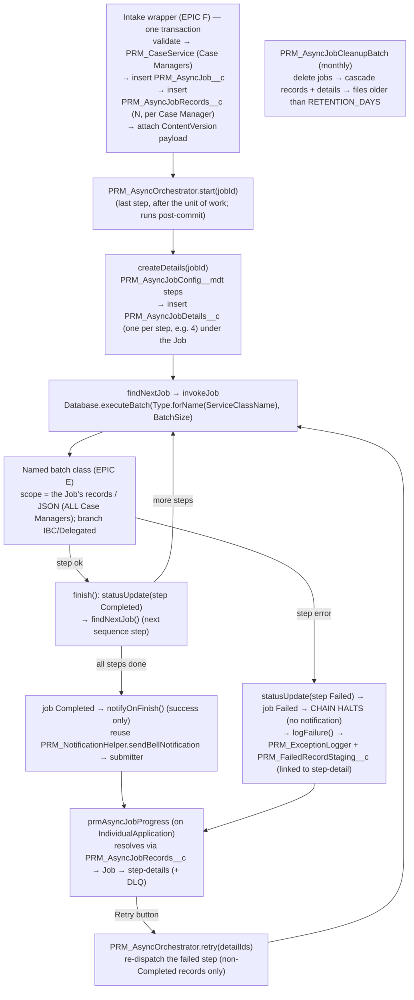

# Epic C — Async Framework (Implementation Guide)

> **Parent:** `PRM_IBC_HighVolume_TDD.md` (§11.4) · `PRM_Implementation_Plan.md` (EPIC C)
> **Goal:** build the **net-new, metadata-driven asynchronous execution framework** that runs **all** high-volume record creation off the OmniStudio path. The intake wrapper (EPIC F), **in one transaction**, creates the Case Managers + parent `PRM_AsyncJob__c` + per–Case-Manager `PRM_AsyncJobRecords__c` (N) + the ContentVersion payload, then **calls `PRM_AsyncOrchestrator.start(jobId)`** (kickoff is **after** the unit of work — see **C0.1 F-1**; not the insert trigger) → `createDetails` builds **one `PRM_AsyncJobDetails__c` per `PRM_AsyncJobConfig__mdt` step (e.g. 4), as a child of the Job** → **invokes the named batch class for each step directly** (`Database.executeBatch`); each step's batch reads the Job's JSON and **processes all Case Managers together** → on finish chains the next sequence step (**halts the chain on failure**, job → `Failed`) → notifies the submitter **on completion only** → stages step failures to the DLQ (linked to the step-detail). A monthly scheduled batch purges old jobs + their files.

> **⚠ Validation applied:** this guide was reviewed end-to-end; see **C0.1 — Architecture & implementation validation** for findings (incl. the kickoff race **F-1**) and resolutions. The C2/C3 code below reflects those resolutions.
> **Estimate:** ~12.0 engineer-days · **Depends on:** EPIC A (objects/metadata/permission set), EPIC B (`PRM_ServiceBase`, `params`-map contract). · **Blocks:** EPIC E (batch classes + services), EPIC F (intake wrapper that inserts jobs).

> **🔄 Revision — async-only model (read before the sections below):** there is **no synchronous orchestrator**. Two things in this guide change:
> 1. **Dispatch is direct to named batch classes.** `PRM_AsyncOrchestrator.invokeJob` calls `Database.executeBatch(<batchClass>, batchSize)` where `<batchClass>` is resolved via `Type.forName(cfg.PRM_ServiceClassName__c)` — `PRM_ServiceClassName__c` now holds a **batch class name** (one of `PractitionerBatch`, `PracticeLocationAndGroupBatch`, `GroupRelatedBatch`, `PLRelatedBatch`, `Level4RecordCreationBatch`). The generic **`PRM_AsyncQueueable` / `PRM_AsyncBatch` + `PRM_ServiceBase`-worker pattern in §C4 is superseded** — the five batch classes (built in EPIC E) are themselves the executors and call their services internally, branching IBC vs Delegated. They call back `PRM_AsyncOrchestrator.findNextJob` in `finish()`.
> 2. **Chaining halts on failure.** `findNextJob` advances only while the prior step is `Completed`; a `Failed` step stops the chain (later steps never run). Manual `retry` re-runs the failed step and resumes from there. Completed steps' records remain (no compensating rollback).
> Also: `PRM_AsyncJob__c` **no longer has `PRM_CaseManager__c`** (Case Managers live on the new `PRM_AsyncJobRecords__c`), so snippets reading `job.PRM_CaseManager__c` must read from `PRM_AsyncJobRecords__c` instead. The §C3/§C4 code below is retained as a structural reference — apply these revisions when implementing.

> **Authoritative schema:** the object/field definitions in `**Epic_A_Environment_Setup.md`** are canonical for this epic (incl. the new `PRM_AsyncJobRecords__c` and the removed parent `PRM_CaseManager__c`). This guide does **not** redefine them — it consumes them. Where the parent TDD/plan still use the unprefixed `Async_Job__c` names, the `PRM_`-prefixed names from Epic A win.

---

## C0. Prerequisites & conventions

- **Depends on EPIC A deployed (two M-D children of the Job: `PRM_AsyncJob__c` → `PRM_AsyncJobRecords__c` *and* `PRM_AsyncJob__c` → `PRM_AsyncJobDetails__c`):** `PRM_AsyncJob__c` (no `PRM_CaseManager__c`), **`PRM_AsyncJobRecords__c`** (per Case Manager; `PRM_AsyncJob__c` M-D + `PRM_CaseManager__c`), `PRM_AsyncJobDetails__c` (per batch step; `PRM_AsyncJob__c` M-D + `PRM_Sequence__c`/`PRM_Mode__c`/`PRM_BatchSize__c`/`PRM_Status__c`), `PRM_AsyncJobConfig__mdt` (`PRM_ServiceClassName__c` = batch class name), the `PRM_AsyncJobDetails__c` lookup added to `PRM_FailedRecordStaging__c`, and the `PRM_AsyncJob_Access` permission set.
- **Depends on EPIC B:** `PRM_ServiceBase` (the batch classes call services that implement the EPIC B `execute(params)` contract). The intake wrapper that inserts jobs is EPIC F.
- **Grounded org conventions (follow exactly):**
  - **No dispatch trigger in this epic** (Pattern A — C2): kickoff is `PRM_AsyncOrchestrator.start(jobId)` called by the EPIC F wrapper after the unit of work. *(If any future trigger is added for other automation, follow the org one-liner-delegates-to-handler + `PRM_TriggerBypassPermission` convention.)*
  - **Logging:** `PRM_ExceptionLogger.logException(...)` / `logExceptionReturnId(...)` — signature: `(processName, integrationType, severityLevel, stackTrace, errorMessage, exceptionType, lineNumber, correlationId, errorCode, sourceSystem, targetSystem, payload)`.
  - **DLQ:** `PRM_FailedRecordStaging__c` fields (existing): `PRM_Status__c`, `PRM_RetryCount__c`, `PRM_RequestPayload__c`, `PRM_ErrorMessage__c`, `PRM_ExceptionLog__c`, `PRM_LastRetriedAt__c`, `PRM_ParentRecordId__c`, `PRM_TargetObject__c`, `PRM_SourceFlow__c`, `PRM_CaseManager__c` + new `PRM_AsyncJobDetails__c` (Epic A A4).
  - Classes `PRM_`-prefixed, `with sharing` unless a system context is required (executors run `without sharing` only if the processor needs it — default `with sharing`); one class per file; ≥ 85% coverage; test class named `<Class>Test`.

---

## C0.1 · Architecture & implementation validation

> This design was reviewed end-to-end (transaction order, data integrity, scalability, edge cases). All **findings F-1…F-21 are resolved, assigned (EPIC E/F), or accepted trade-offs** and are recorded in the **Validation log at the end of this guide (§C11)**. The sections below already reflect those resolutions.

---

## Component & data-flow overview *(per the validation in §C11)*




---

## C1 · Objects, seed config & Custom Notification Type — *1.0 d*

Schema is owned by **Epic A** — do not recreate it here. EPIC C adds the **runtime configuration** the framework reads:

1. **Seed `PRM_AsyncJobConfig__mdt` rows** for the pilot process — **one per batch step** (sequenced). `PRM_ServiceClassName__c` now holds the **batch class name** (the five EPIC E batch classes); deploy these rows when EPIC E lands. Order **confirmed** (hosted-service mapping in Plan §8.1; `GroupRelatedBatch` services still TBD — CL-15).

  | `PRM_ProcessName__c` | `PRM_Sequence__c` | `PRM_ServiceClassName__c` (batch class) | `PRM_ServiceContext__c` | `PRM_Mode__c` | `PRM_BatchSize__c` |
  | --- | --- | --- | --- | --- | --- |
  | `Practitioner Creation` | `1` | `PractitionerBatch` | Person Account + practitioner child records (HCP · NPI · Identifier · Taxonomy · License · InfoCode) | `Batch` | `1` |
  | `Practitioner Creation` | `2` | `PracticeLocationAndGroupBatch` | Group · NPI · Practice Location · Location · Addresses & affiliations | `Batch` | `1` |
  | `Practitioner Creation` | `4` | `PLRelatedBatch` | Practice-Location-related records | `Batch` | `1` |
  | `Practitioner Creation` | `5` | `Level4RecordCreationBatch` | Level-4 HealthcareFacilityNetwork (Practitioner × PL × Taxonomy × Role × Network) | `Batch` | `1` |

  **Four rows** (matches Epic A A7; `GroupRelatedBatch`, sequence 3, is **omitted for now** — CL-15). These define the **ordered batch pipeline** that `PRM_AsyncOrchestrator` chains by `PRM_Sequence__c` (each `finish()` dispatches the next; **halt-on-failure**). `findNextJob` orders by `PRM_Sequence__c` and does **not** assume contiguous numbering (gap at 3). Field definitions are authoritative in **Epic A §A3**; the per-batch EPIC E service mapping is in **Plan §8.1**.

  > **Batch size — `PRM_BatchSize__c = 1` for now** (per Epic A OQ-9); to be **re-tuned via LDV load testing before go-live** (governor headroom differs per batch by its record graph). Seed the measured values then.

2. **Custom Notification Type** `PRM_AsyncJobNotification` (new declarative metadata — `customNotificationTypes/PRM_AsyncJobNotification.notiftype-meta.xml`):
  ```xml
   <?xml version="1.0" encoding="UTF-8"?>
   <CustomNotificationType xmlns="http://soap.sforce.com/2006/04/metadata">
       <customNotifTypeName>PRM_AsyncJobNotification</customNotifTypeName>
       <desktop>true</desktop>
       <mobile>true</mobile>
       <title>Async Job</title>
   </CustomNotificationType>
  ```
  > No Custom Notification Types exist in the repo today — this introduces the `customNotificationTypes/` folder. (Belongs logically in Epic A; included here because the mechanism was decided in this epic.)
  >
  > **Sending is delegated to the existing org class `PRM_NotificationHelper`** (`sendBellNotification(userId, queueName, notificationName, title, bodyMessage, targetId)`) — it resolves this Custom Notification Type by DeveloperName, sends to a user **or** a queue's members, and logs failures via `PRM_ExceptionLogger`. EPIC C only **creates the Custom Notification Type** + calls the helper; no new notification Apex is written.

**Acceptance:** config row deployable; notification type deployable and visible in Setup.

---

## C2 · Kickoff — `PRM_AsyncOrchestrator.start(jobId)` — *0.5 d*

> **🔄 Pattern A (ratified). No dispatch trigger is built.** Per F-1, the parent after-insert trigger cannot be the dispatcher (at parent-insert time the `PRM_AsyncJobRecords__c` M-D children and the ContentVersion payload don't exist yet). Kickoff is an **explicit call after the full unit of work**, so dispatch is deferred to post-commit.

The EPIC F intake wrapper, in **one transaction**, creates the Case Managers → the job → the records → the payload file, then calls `PRM_AsyncOrchestrator.start(jobId)` as its **final step**:

```apex
// PRM_AsyncOrchestrator — entry point called by the EPIC F intake wrapper
// AFTER Case Managers + job + records + ContentVersion are all in place.
public void start(Id jobId) {
    createDetails(jobId);   // build per-step details (under the Job)
    findNextJob(jobId);     // dispatch the first sequence step (batch runs post-commit)
}
```

Because Apex Batch/Queueable enqueued during a transaction **begins only after that transaction commits**, the first batch sees the fully-persisted Case Managers, records, and payload — no race. **`start()` lives on `PRM_AsyncOrchestrator` (C3)** — there is no `PRM_AsyncJobTrigger`/`PRM_AsyncJobTriggerHandler`/setup-Queueable in this build.

> **Rejected alternative (Pattern B, for reference only):** an after-insert trigger enqueuing a post-commit `PRM_AsyncJobSetupQueueable`. Gives "insert → framework reacts" decoupling, but Pattern A was chosen for determinism (the producer owns ordering). Revisit only if a non-EPIC-F producer ever needs insert-driven dispatch.

**Acceptance:** no setup/dispatch occurs before the records + payload are committed; the EPIC F wrapper's final step is `start(jobId)`, which builds the per-step details (under the Job) and dispatches step 1; no dispatch trigger exists.

---

## C3 · `PRM_AsyncOrchestrator` — *4.0 d*

Central controller. Operates **per job** (one submission = one job); bulk-safe **within a job** (collections, one DML per object type). No business logic — that lives in the EPIC E batch classes/services.

**Method write-up *(revised per C0.1 F-2/F-3/F-4/F-10)*:**

- `**start(Id jobId)**` — entry point called by the EPIC F wrapper after the unit of work. Calls `createDetails` then `findNextJob`. *(No trigger — Pattern A.)*
- `**createDetails(Id jobId)**` — reads the `PRM_AsyncJobConfig__mdt` steps for the job's `PRM_ProcessName__c` (ordered by `PRM_Sequence__c`) and inserts **one `PRM_AsyncJobDetails__c` per step**, **parented by the Job** (`PRM_AsyncJob__c`), seeding `PRM_ProcessName__c`/`PRM_Mode__c`/`PRM_BatchSize__c`/`PRM_Sequence__c` and `PRM_Status__c = 'Queued'`. No `PRM_CaseManager__c` on the detail (a step processes all Case Managers). Zero config rows → fail the job (F-13).
- `**findNextJob(Id jobId)**` — selects the next `Queued` step-detail (lowest `PRM_Sequence__c`) and dispatches it. If a step is `Failed` → **halt**: set the **job `Failed`** (status only — **no notification**, per decision) and return. When all steps are `Completed` → set the job `Completed` and `notifyOnFinish` (success notification only).
- `**invokeJob(PRM_AsyncJobDetails__c step)**` — sets the **job `Running`** (first dispatch) and the step `Running`, resolves the **batch class** `Type.forName(cfg.PRM_ServiceClassName__c)`, validates it implements `Database.Batchable` (per `PRM_Mode__c`; F-5), and runs `Database.executeBatch(batchable, (Integer) step.PRM_BatchSize__c)` **directly** (no Flex-Queue depth-guard for the pilot — see F-6). If the Flex Queue is full the `executeBatch` call throws → handled as a step failure (`logFailure` → step `Failed`), recoverable via manual per-step **Retry** (C5). The batch's scope = the Job's `PRM_AsyncJobRecords__c`/JSON (all Case Managers).
- `**statusUpdate(Id recordId, String status, String errorMessage)**` — central status setter for a step-detail **or** the parent job (the job rollup is driven by `findNextJob`/`invokeJob` per F-3).
- `**retry(List<Id> detailIds)**` — manual, uncapped, LWC-initiated. Flips the given `Failed` **step-details** back to `Queued`, resets the **job** off `Failed` (→ `Running`), then calls `findNextJob` to resume; the batch is idempotent (skips Case Managers already created — F-9).
- `**jsonFileParser(Id jobId)**` — locates the job's **single** payload `ContentVersion` by its known `Title` (one file per job — F-8), reads & deserializes it; called **inside the batch `start()`** (post-commit), never in a trigger.
- `**logFailure(PRM_AsyncJobDetails__c detail, Exception e, String payload)**` — logs via the existing `PRM_ExceptionLogger`, then creates a `PRM_FailedRecordStaging__c` (DLQ) row **linked to the step-detail** (`PRM_AsyncJobDetails__c`) with the error/exception-log/payload. **`PRM_CaseManager__c` is NOT populated** — the DLQ is associated with the step-detail; the Job (and its `PRM_AsyncJobRecords__c` Case Managers) are reachable from there if needed.
- `**notifyOnFinish(Id jobId)**` — **success only.** Reuses `PRM_NotificationHelper.sendBellNotification(...)` to send the `PRM_AsyncJobNotification` Custom Notification to the **submitter** (`recipientFor(job)` = `CreatedById`, F-11). No inline `Messaging.CustomNotification`; the helper resolves the Custom Notification Type and logs send failures.
- `**configForStep` / `recipientFor` / `payloadTitle**` — private helpers (cached config lookup by ProcessName+Sequence, recipient, payload file title).
Keep the public methods terse and avoid repeated SOQL.

```apex
public with sharing class PRM_AsyncOrchestrator {

    // --- entry (Pattern A: called by the EPIC F wrapper as its last step, after the unit of work) ---
    public void start(Id jobId) {
        createDetails(jobId);
        findNextJob(jobId);
    }

    // 1. createDetails: ONE detail per config STEP → parented by the JOB (e.g. 4 step-details)
    public void createDetails(Id jobId) {
        PRM_AsyncJob__c job = [SELECT Id, PRM_ProcessName__c FROM PRM_AsyncJob__c WHERE Id = :jobId];
        List<PRM_AsyncJobConfig__mdt> cfgs = [
            SELECT PRM_ServiceClassName__c, PRM_Mode__c, PRM_BatchSize__c, PRM_Sequence__c, PRM_ProcessName__c
            FROM PRM_AsyncJobConfig__mdt
            WHERE PRM_ProcessName__c = :job.PRM_ProcessName__c
            ORDER BY PRM_Sequence__c ASC];
        if (cfgs.isEmpty()) {                                                            // F-13: config error, not silent complete
            statusUpdate(jobId, 'Failed', 'No PRM_AsyncJobConfig__mdt rows for ' + job.PRM_ProcessName__c);
            return;                                                                       // job Failed (no notification; failures aren't notified)
        }
        List<PRM_AsyncJobDetails__c> steps = new List<PRM_AsyncJobDetails__c>();
        for (PRM_AsyncJobConfig__mdt c : cfgs) {
            steps.add(new PRM_AsyncJobDetails__c(
                PRM_AsyncJob__c    = job.Id,                          // M-D parent = the Job
                PRM_ProcessName__c = c.PRM_ProcessName__c,
                PRM_Mode__c        = c.PRM_Mode__c,
                PRM_BatchSize__c   = (Integer) c.PRM_BatchSize__c,
                PRM_Sequence__c    = c.PRM_Sequence__c,
                PRM_Status__c      = 'Queued'));
        }
        insert steps;
    }

    // 2. findNextJob: chain the step-details by Sequence (halt-on-failure)
    public void findNextJob(Id jobId) {
        List<PRM_AsyncJobDetails__c> steps = [
            SELECT Id, PRM_AsyncJob__c, PRM_Sequence__c, PRM_Status__c, PRM_ProcessName__c, PRM_Mode__c, PRM_BatchSize__c
            FROM PRM_AsyncJobDetails__c
            WHERE PRM_AsyncJob__c = :jobId
            ORDER BY PRM_Sequence__c ASC];
        for (PRM_AsyncJobDetails__c s : steps) {
            if (s.PRM_Status__c == 'Failed')  { statusUpdate(jobId, 'Failed', null); return; }  // halt: job Failed (no notification)
            if (s.PRM_Status__c == 'Running') { return; }            // a step is in flight
            if (s.PRM_Status__c == 'Queued')  { invokeJob(s); return; }
        }
        // no Queued/Running/Failed remain → all Completed
        statusUpdate(jobId, 'Completed', null);
        notifyOnFinish(jobId);                                       // success notification only
    }

    // 3. invokeJob: dispatch the STEP's batch once for the whole job (direct — no flex-queue guard for the pilot, F-6)
    public void invokeJob(PRM_AsyncJobDetails__c step) {
        // batch class name lives on the MDT config, resolved by ProcessName + Sequence
        PRM_AsyncJobConfig__mdt cfg = configForStep(step.PRM_ProcessName__c, step.PRM_Sequence__c);
        Type t = Type.forName(cfg.PRM_ServiceClassName__c);
        if (t == null) { statusUpdate(step.Id, 'Failed', 'Batch class not found: ' + cfg.PRM_ServiceClassName__c);
                         statusUpdate(step.PRM_AsyncJob__c, 'Failed', null); return; }          // systemic failure → job Failed
        statusUpdate(step.PRM_AsyncJob__c, 'Running', null);          // job → Running on first dispatch
        statusUpdate(step.Id, 'Running', null);
        // F-5: pilot is all Batch; validate the type is Database.Batchable before casting
        Database.executeBatch((Database.Batchable<SObject>) t.newInstance(), (Integer) step.PRM_BatchSize__c);
    }

    // 4. statusUpdate: set a step-detail OR the parent job status (+ optional error)
    public void statusUpdate(Id recordId, String status, String errorMessage) { /* update the SObject */ }

    // 5. retry: MANUAL only — reset the failed STEP(s) + job, then resume (idempotent batch skips created Case Managers)
    public void retry(List<Id> detailIds) {
        List<PRM_AsyncJobDetails__c> failed = [
            SELECT Id, PRM_AsyncJob__c FROM PRM_AsyncJobDetails__c
            WHERE Id IN :detailIds AND PRM_Status__c = 'Failed'];
        Set<Id> jobIds = new Set<Id>();
        for (PRM_AsyncJobDetails__c s : failed) { statusUpdate(s.Id, 'Queued', null); jobIds.add(s.PRM_AsyncJob__c); }
        for (Id jobId : jobIds) { statusUpdate(jobId, 'Running', null); findNextJob(jobId); }  // reset job off Failed, resume
    }

    // 6. jsonFileParser: read the job's SINGLE payload ContentVersion (by known Title) → payload (F-8)
    //    Called from the batch start() (post-commit), never a trigger. Enforce one payload file per job.
    public Object jsonFileParser(Id jobId) {
        Set<Id> cdIds = new Map<Id, ContentDocumentLink>([
            SELECT ContentDocumentId FROM ContentDocumentLink WHERE LinkedEntityId = :jobId]).keySet();
        ContentVersion cv = [SELECT VersionData FROM ContentVersion
                             WHERE ContentDocumentId IN :cdIds AND IsLatest = true
                               AND Title = :payloadTitle(jobId) LIMIT 1];   // deterministic single file
        return JSON.deserializeUntyped(cv.VersionData.toString());
    }

    // 7. logFailure: existing logger → staging (DLQ). DLQ row is linked to the step-detail (NOT a Case Manager);
    //    the Job + its PRM_AsyncJobRecords__c (Case Managers) are reachable from the detail if needed.
    public void logFailure(PRM_AsyncJobDetails__c detail, Exception e, String payload) {
        String logId = PRM_ExceptionLogger.logExceptionReturnId(
            detail.PRM_ProcessName__c, 'Async', 'Error',
            e.getStackTraceString(), e.getMessage(), e.getTypeName(),
            e.getLineNumber(), String.valueOf(detail.PRM_AsyncJob__c),
            null, 'Salesforce', null, payload);
        insert new PRM_FailedRecordStaging__c(
            PRM_AsyncJobDetails__c = detail.Id,                 // association → step → Job → Case Manager records
            PRM_SourceFlow__c      = detail.PRM_ProcessName__c, // staging has PRM_SourceFlow__c (no PRM_ProcessName__c)
            PRM_Status__c          = 'Failed',
            PRM_ErrorMessage__c    = e.getMessage(),
            PRM_ExceptionLog__c    = logId,
            PRM_RequestPayload__c  = payload);                  // PRM_CaseManager__c intentionally NOT populated
    }

    // 8. notifyOnFinish: SUCCESS only — REUSE PRM_NotificationHelper (no inline Messaging.CustomNotification)
    public void notifyOnFinish(Id jobId) {
        PRM_AsyncJob__c job = [SELECT Id, CreatedById FROM PRM_AsyncJob__c WHERE Id = :jobId];
        PRM_NotificationHelper.sendBellNotification(
            String.valueOf(recipientFor(job)),                // userId = submitter (F-11)
            null,                                             // queueName
            'PRM_AsyncJobNotification',                       // Custom Notification Type DeveloperName
            'Async Job Completed',                            // title
            'Your submission has finished processing.',       // body
            String.valueOf(jobId));                           // targetId
    }

    // private helpers (illustrative): configForStep · payloadTitle · recipientFor
    PRM_AsyncJobConfig__mdt configForStep(String processName, Decimal sequence) { /* cached query by ProcessName+Sequence */ return null; }
    String payloadTitle(Id jobId) { /* deterministic single-file title, e.g. 'PRM_AsyncJob_' + jobName + '_Payload' */ return null; }
    Id recipientFor(PRM_AsyncJob__c job) { return job.CreatedById; } // F-11 — confirm recipient policy
}
```

**Acceptance:** `start()` runs only after the unit of work (no pre-commit dispatch); `createDetails` builds **one step-detail per MDT row, parented by the Job**; `findNextJob` chains the steps with **halt-on-failure** and correct job rollup; `invokeJob` dispatches the named batch class directly (a full Flex Queue surfaces as a retryable step failure — F-6); `retry` re-dispatches the failed step idempotently; `jsonFileParser` round-trips the single payload file; `logFailure` creates a `PRM_FailedRecordStaging__c` linked to the **step-detail** + a `PRM_ExceptionLog__c` (no `PRM_CaseManager__c`); on failure the job is set `Failed` with **no notification**; `notifyOnFinish` fires only on completion (success), to the submitter.

---

## C4 · Batch-class contract (built in EPIC E) — *contract only*

> The five named batch classes (`PractitionerBatch` … `Level4RecordCreationBatch`) are **built in EPIC E**; Epic C defines only the **contract** they honour so `PRM_AsyncOrchestrator` can dispatch and chain them. (The earlier generic `PRM_AsyncQueueable`/`PRM_AsyncBatch` worker pattern is **removed** — `invokeJob` runs the named `Database.Batchable` class directly.)

Each batch class (`Database.Batchable<…>, Database.Stateful`) must:
- **`start(bc)`** — read the Job's single payload `ContentVersion` **once** (F-18) and return an **`Iterable`** of per-practitioner payloads (each carrying its Case Manager Id per F-14), **or** a `QueryLocator` over the Job's `PRM_AsyncJobRecords__c`. Hold the step-detail Id + counters in `Stateful` members.
- **`execute(bc, scope)`** — call the EPIC E service **once per chunk** (bulk-first, F-17): `params = { jobId, processName, payloads: List<…>, caseManagerIds: List<Id> }`; the service does one bulk DML per object type and returns a response map. Branch IBC/Delegated internally; on any failure record it via `PRM_AsyncOrchestrator.logFailure(stepDetail, e, payload)` → a DLQ row **linked to the step-detail** (no `PRM_CaseManager__c`).
- **Response map convention** — `success` (Boolean, required); on failure `error`/`message` (String); optional `recordsProcessed` (Integer).
- **`finish(bc)`** — per **F-19**: first `statusUpdate(stepDetailId, Completed|Failed)` (any failure → `Failed`, F-15a), **then** `PRM_AsyncOrchestrator.findNextJob(jobId)` — which dispatches the next step, or on a `Failed` step sets the job `Failed` (no notification), or on all‑Completed sets the job `Completed` and sends the success notification.
- **Idempotent** (F-9) — a re-run skips already-created Case Managers (External-Id upserts + status guards).

**Acceptance:** each batch resolves and runs via `PRM_AsyncOrchestrator.invokeJob` (`Type.forName` → `Database.executeBatch`); processes all the Job's Case Managers per chunk; on any failure → step `Failed` + DLQ + halt; on success → step `Completed` + chains; unknown/non-Batchable class → guarded failure (no NPE / mis-cast).

---

## C5 · `prmAsyncJobProgress` LWC + Apex controller — *2.5 d*

- **Host:** `IndividualApplication` record page (= Case Manager). Lightning App Builder component; `@api recordId` = the IA Id.
- **Apex controller** `PRM_AsyncJobProgressController` (`with sharing`):
  - `@AuraEnabled(cacheable=true) getProgress(Id caseManagerId)` → **F-12 query path:** `PRM_AsyncJobRecords__c WHERE PRM_CaseManager__c = :caseManagerId` → the parent `PRM_AsyncJob__c` → its `PRM_AsyncJobDetails__c` **step** rows (run/step status) + any `PRM_FailedRecordStaging__c` linked to those step-details (errors). Shaped as a progress DTO (step counts, per-step error, retriable flag = `PRM_Status__c == 'Failed'`). *(`PRM_CaseManager__c` is on the record, not the job/detail/DLQ.)*
  - `@AuraEnabled retryFailed(List<Id> detailIds)` → calls `new PRM_AsyncOrchestrator().retry(detailIds)`; returns refreshed progress.
- **LWC behaviour:**
  - on load → `getProgress`; render an overall progress bar + a datatable of the job's **step rows** (`PRM_AsyncJobDetails__c`: Batch/Process, Status badge, Error).
  - **Refresh** button → `refreshApex(this.wiredProgress)` (no streaming — finish alerts arrive via the Custom Notification bell).
  - **Retry** button on the `Failed` step row (no bulk button; no retry cap) → `retryFailed(stepDetailId)`. **Restarts the entire failed batch step** (e.g. if `PractitionerBatch` failed, it restarts `PractitionerBatch`): `PRM_AsyncOrchestrator.retry` resets that `PRM_AsyncJobDetails__c` step to `Queued`, resets the job off `Failed`, and re-dispatches the step's batch — which **re-runs all the job's Case Managers** and is **idempotent** (skips already-created records), then the chain resumes. Then `refreshApex`.
- **Exposure:** `prmAsyncJobProgress.js-meta.xml` targets `lightning__RecordPage`, restricted to the `IndividualApplication` object.

**Acceptance:** component renders the job's step status for the IA; per-step errors visible; **Retry restarts the entire failed batch step** (via `PRM_AsyncOrchestrator.retry` on the `PRM_AsyncJobDetails__c` step), the batch re-runs all Case Managers idempotently, the chain resumes, and the new status shows after refresh.

### C5.1 · Mockup screen (SLDS reference design)

The interactive SLDS reference for this component is `**prmAsyncJobProgress_Mockup.html`** (open in a browser — the Failed / Queued / Completed / Running tabs are clickable). Static preview of the **All-Jobs** view:


**What the screen shows (and how it maps to the build):**

- **Page header** — context (`IndividualApplication` = Case Manager + parent `PRM_AsyncJob__c`) with a **Refresh** action. *(No bulk retry — Retry is a per-row action on the failed step.)*
- **Summary dashboard** — Total / Completed / Failed / Queued / Running counts + **Success Rate** and last-refresh timestamp; an overall multi-segment progress bar.
- **Tabs** — `All Jobs · Failed · Queued · Completed · Running`, each a filtered view of the child `PRM_AsyncJobDetails__c` rows.
- **Grid columns** — Job Name/Type (`PRM_ProcessName__c` + `PRM_Mode__c`), Job ID (auto-number), **Status** color-coded badge (green/red/orange/blue), Triggered By (`CreatedBy`), **Sequence** (`PRM_AsyncJobConfig__mdt.PRM_Sequence__c`), Last Update, row actions (View / **Retry** for failed).
- **Section views** — Failed (error summary + per-row Retry), Queued (queue position / scheduled / ETA), Completed (completion time / duration / records), Running (records progress).

> **Schema caveat (carried from the mockup footer):** `Queue Position`, `Estimated/Scheduled Execution`, `Duration`, and `Records` are **not** in the current schema — they're either computed or need new fields. Confirm scope before building those columns (see C9). Everything else maps to existing fields.

#### Build tasks (implementation-ready)

**Bundle / file layout**

```
force-app/main/default/
├─ lwc/prmAsyncJobProgress/
│  ├─ prmAsyncJobProgress.js
│  ├─ prmAsyncJobProgress.html
│  ├─ prmAsyncJobProgress.css
│  └─ prmAsyncJobProgress.js-meta.xml
└─ classes/
   ├─ PRM_AsyncJobProgressController.cls        (+ .cls-meta.xml)
   └─ PRM_AsyncJobProgressControllerTest.cls
```

**SLDS / base-component mapping** (build with base components, not hand-rolled HTML, to inherit SLDS for free):


| Mockup element          | Build with                                                                                                                |
| ----------------------- | ------------------------------------------------------------------------------------------------------------------------- |
| Page header + actions   | `lightning-card` (custom header slot) or `lightning-page-header` markup; `lightning-button` (Refresh) |
| Summary stat cards      | SLDS grid (`slds-grid slds-wrap` / `slds-col`) of small `lightning-card`s with colored accent                             |
| Overall progress bar    | `lightning-progress-bar` (or a custom multi-segment SLDS bar)                                                             |
| Tabs                    | `lightning-tabset` + `lightning-tab` (All / Failed / Queued / Completed / Running) with a count `lightning-badge`         |
| Job grids               | `lightning-datatable` (custom `cellAttributes` for the status badge + row-action column)                                  |
| Status badge            | custom cell / `lightning-badge` with status-driven SLDS theme class + `lightning-icon`                                    |
| Row + header actions    | `lightning-button` / `lightning-button-icon`; datatable `onrowaction`                                                     |
| Loading / empty / error | `lightning-spinner`, `lightning-icon` empty-state, inline error                                                           |
| Toasts                  | `ShowToastEvent` (retry success/failure)                                                                                  |


**Task list**


| #   | Task                                   | Deliverable / detail                                                                                                                                                                                                                                                                                                                     | Est (d) |
| --- | -------------------------------------- | ---------------------------------------------------------------------------------------------------------------------------------------------------------------------------------------------------------------------------------------------------------------------------------------------------------------------------------------- | ------- |
| T1  | Apex `getProgress(Id caseManagerId)`   | `@AuraEnabled(cacheable=true)`. **F-12:** `PRM_AsyncJobRecords__c WHERE PRM_CaseManager__c = :caseManagerId` → child `PRM_AsyncJobDetails__c` → parent `PRM_AsyncJob__c`. Enforce CRUD/FLS (`with sharing`, `WITH SECURITY_ENFORCED`). Return a `ProgressDTO`.                                                                                                        | 0.5     |
| T2  | DTO wrapper(s)                         | `ProgressDTO { Integer total, completed, failed, queued, running; Decimal successRate; Datetime lastRefresh; List<JobRow> rows; }` and `JobRow { Id detailId; String name, jobId, type, status, triggeredBy; Integer sequence; Datetime lastUpdate; String error; Boolean retriable; }`. `successRate = completed / (completed+failed)`. | 0.3     |
| T3  | Apex `retryFailed(List<Id> detailIds)` | `@AuraEnabled`; delegates to `new PRM_AsyncOrchestrator().retry(detailIds)`; returns the refreshed `ProgressDTO`.                                                                                                                                                                                                                        | 0.2     |
| T4  | LWC scaffold + meta                    | Bundle + `js-meta.xml` targeting `lightning__RecordPage`, restricted to `IndividualApplication`. `@api recordId`. Wire `getProgress({ caseManagerId: '$recordId' })` to `wiredProgress`.                                                                                                                                                 | 0.2     |
| T5  | Summary dashboard                      | Stat cards (Total / Completed / Failed / Queued / Running / Success Rate) + last-refresh timestamp + overall multi-segment progress bar, all driven by `ProgressDTO`.                                                                                                                                                                    | 0.3     |
| T6  | Tabs + filtered grids                  | `lightning-tabset` with five tabs; each tab a `lightning-datatable` filtered by status (All shows everything). Count badges from the DTO.                                                                                                                                                                                                | 0.4     |
| T7  | Status badges + icons                  | Status→theme map (Completed=success/green, Failed=error/red, Queued=warning/orange, Running=info/blue) with matching `lightning-icon`; custom datatable cell.                                                                                                                                                                            | 0.2     |
| T8  | Actions                                | Header **Refresh** → `refreshApex(this.wiredProgress)`; row **Retry** (only when `retriable`) → `retryFailed(stepDetailId)` and **View** (`NavigationMixin` to the detail record) via `onrowaction`. Toast on result, then `refreshApex`. *(No bulk retry.)*                                                                  | 0.3     |
| T9  | Pagination + states                    | Client-side pagination (page size ~10) for large grids; spinner while loading; empty-state when no jobs; inline error on Apex failure.                                                                                                                                                                                                   | 0.2     |
| T10 | Responsive CSS                         | `prmAsyncJobProgress.css` — SLDS grid so stat cards reflow (6→3→2) and tables scroll on tablet widths.                                                                                                                                                                                                                                   | 0.1     |
| T11 | Permission wiring                      | Add `PRM_AsyncJobProgressController` Apex class access to the `PRM_AsyncJob_Access` permission set (Epic A A5).                                                                                                                                                                                                                          | 0.1     |
| T12 | Tests                                  | Jest: render, wire data, tab filtering, retry calls Apex + refresh, empty/error states. Apex: `getProgress` counts/successRate, FLS, `retryFailed` delegates to orchestrator (≥ 85%).                                                                                                                                                    | 0.4     |


> **Total ≈ 2.5 d** — consistent with the C5 estimate. Columns flagged in the schema caveat (Queue Position / ETA / Scheduled / Duration / Records) are **excluded** from T1/T2 until the fields are confirmed in C9; the mockup shows them as the target end-state.

> **Notification:** the LWC does **not** subscribe to a stream — finish alerts arrive via the `PRM_AsyncJobNotification` Custom Notification (C3). The user re-opens / **Refresh**es to see the latest, matching the manual-refresh decision.

---

## C6 · `PRM_AsyncJobCleanupBatch` + scheduler — *1.5 d*

- **Class:** `global class PRM_AsyncJobCleanupBatch implements Database.Batchable<SObject>, Schedulable` (mirrors the existing `PRM_DeleteExceptionLogBatch` pattern).
- **Retention is externally configurable** (F-21 — replaces the old hardcoded constant). The batch reads the threshold from config at runtime with a **safe default of 90** if unset/blank.
- `**start`:** `SELECT Id FROM PRM_AsyncJob__c WHERE CreatedDate < LAST_N_DAYS:retentionDays AND PRM_Status__c IN ('Completed','Failed')` where `retentionDays = configuredRetention()` (see below).
- `**execute`:** delete the parent jobs — Master-Detail **cascade-deletes** `PRM_AsyncJobDetails__c` **and** `PRM_AsyncJobRecords__c`; also delete the linked `ContentDocument`s (collect `ContentDocumentId` via `ContentDocumentLink` for the job Ids, then `delete` the `ContentDocument`s).
- `**finish`:** optional summary log.
- `**schedulable.execute`** → `Database.executeBatch(new PRM_AsyncJobCleanupBatch(), 200)`.
- **Schedule:** monthly — `System.schedule('PRM Async Job Cleanup', '0 0 2 1 * ?', new PRM_AsyncJobCleanupBatch())` (2 AM on the 1st). Document the CRON in the deploy runbook.

#### Retention configuration — recommendation (F-21)

> **Goal:** change the retention window **without a code change/deploy**, with a deployable default and per-environment override.

| Option | How it works | Pros | Cons | Verdict |
| --- | --- | --- | --- | --- |
| **A. Custom Metadata Type** `PRM_AsyncJobSetting__mdt` with `PRM_RetentionDays__c` (Number), one default record `Default` | `PRM_AsyncJobSetting__mdt.getInstance('Default').PRM_RetentionDays__c` | Deployable **versioned default**; editable in Setup → Custom Metadata records; **cached** (no SOQL); consistent with the framework's existing CMDT (`PRM_AsyncJobConfig__mdt`); test-overridable | Value edits in prod are a metadata change (governed) | **✅ Recommended** — matches the metadata-driven framework; one home for future async settings (e.g. sweeper interval, flex-queue cap) |
| **B. Hierarchy Custom Setting** `PRM_AsyncJobSettings__c` with `PRM_RetentionDays__c` | `PRM_AsyncJobSettings__c.getOrgDefaults()` | Admin-editable at **runtime** (no deploy); per-profile/user overrides; cached | Not versioned/source-controlled by default; per-profile granularity is unnecessary here | Good alternative if ops must tune live without any metadata deploy |
| **C. Custom Label** | `Label.PRM_AsyncJobRetentionDays` | Simple | Strings only (parse), awkward for numbers, deploy to change | ✗ not ideal for a numeric operational knob |

**Decision: Option A — Custom Metadata Type `PRM_AsyncJobSetting__mdt`** (ratified). It fits the metadata-driven design, is cached, ships a deployable default, is editable in Setup, and is a home for future framework knobs (sweeper cadence F-16, flex-queue cap F-6).

**C6 builds this CMDT + record** (kept with the cleanup batch that consumes it, per decision):

| Component | Spec |
| --- | --- |
| **CMDT** `PRM_AsyncJobSetting__mdt` | `objects/PRM_AsyncJobSetting__mdt/PRM_AsyncJobSetting__mdt.object-meta.xml` · Label "Async Job Setting" · `<visibility>Public</visibility>` |
| **Field** `PRM_RetentionDays__c` | Number(4,0) on the CMDT; cleanup retention window in days |
| **Record** `Default` | `customMetadata/PRM_AsyncJobSetting.Default.md-meta.xml` with `PRM_RetentionDays__c = 90` |

```apex
// PRM_AsyncJobCleanupBatch
@TestVisible static final Integer DEFAULT_RETENTION_DAYS = 90;
@TestVisible static Integer configuredRetention() {
    PRM_AsyncJobSetting__mdt s = PRM_AsyncJobSetting__mdt.getInstance('Default');
    return (s != null && s.PRM_RetentionDays__c != null)
        ? (Integer) s.PRM_RetentionDays__c
        : DEFAULT_RETENTION_DAYS;          // safe fallback if the record/field is missing
}
```

The batch's `start()` uses `configuredRetention()`; changing the window is a **Setup edit on the `Default` record** (no code change/deploy). *(If live admin edits with zero deploy are later preferred, swap to a hierarchy Custom Setting — Option B.)*

> Deleting `ContentDocument` removes the file for all links; safe here because each payload file belongs to exactly one job. Confirm no other entity links the same file.

**Acceptance:** `PRM_AsyncJobSetting__mdt` + `PRM_RetentionDays__c` + the `Default` record (=90) deploy; jobs + details + records + JSON files older than the **configured** retention are purged; staging (`PRM_FailedRecordStaging__c`) is **not** deleted (separate retention); the threshold is changeable by editing the `Default` record (no code change), defaulting to 90; schedulable registered.

---

## C7 · Build order, dependencies & effort

```
C1 Objects/config/notif  →  C3 PRM_AsyncOrchestrator (incl. C2 start() kickoff)  →  C4 batch-class contract  →  C5 LWC + controller  →  C6 Cleanup batch (+ retention CMDT)
```

- C1 needs EPIC A deployed. C3 includes the `start()` kickoff (C2 — no dispatch trigger, Pattern A). C5 needs C3 (`retry`) + the step status it renders. C6 is independent of C3–C5 (objects only).
- **C6b `PRM_AsyncJobSweeper` is deferred to a future enhancement (OQ-C6)** — not built for the pilot. Stranded/stuck steps are recovered **manually** via the per-step Retry button (C5). See F-16.
- The **batch classes** named in `PRM_ServiceClassName__c` are **EPIC E** — C4 is the **contract** only; wire the real seed-config class names when E lands.


| Task                                                 | Est (d)  |
| ---------------------------------------------------- | -------- |
| C1 · Objects, seed config & Custom Notification Type | 1.0      |
| C2 · `start()` kickoff (no trigger — Pattern A)      | 0.5      |
| C3 · `PRM_AsyncOrchestrator`                         | 4.0      |
| C4 · Batch-class contract (classes built in EPIC E)  | 0.5      |
| C5 · `prmAsyncJobProgress` LWC + controller          | 2.5      |
| C6 · `PRM_AsyncJobCleanupBatch` + retention CMDT + scheduler | 1.5 |
| ~~C6b · `PRM_AsyncJobSweeper`~~ *(deferred enhancement — OQ-C6)* | — |
| **EPIC C total**                                     | **~10.0** |


---

## C8 · Testing strategy


| Area            | Coverage                                                                                                                                                                                                                                                           |
| --------------- | ------------------------------------------------------------------------------------------------------------------------------------------------------------------------------------------------------------------------------------------------------------------ |
| Kickoff/ordering (F-1) | `start(jobId)` runs **after** records + payload exist; assert the first batch only runs post-commit (`Test.startTest`/`stopTest`) and sees the records/file; no dispatch trigger fires on job insert |
| Orchestrator    | `createDetails` builds **one step-detail per MDT row, parented by the Job** (e.g. 4); `findNextJob` chains by `PRM_Sequence__c`, **halts on Failed** → job `Failed` (no notification); job → `Running` on first dispatch; sequence gaps (1,2,4,5) handled; zero-config → job Failed; `retry` resets the failed step + job and resumes; `jsonFileParser` single-file-by-Title round-trip; `logFailure` step-detail-linked staging + exception log (no `PRM_CaseManager__c`); `notifyOnFinish` success-only, to the submitter |
| Batch classes (contract) | `start()` parses the Job JSON once → per-practitioner `Iterable` (F-14/F-18); `execute()` calls the service **once per chunk** (bulk, F-17); **any failure → step `Failed` → halt (F-15a)**, recorded in the DLQ (linked to the step-detail); `finish()` sets step status **then** `findNextJob` (F-19); unknown/non-Batchable class → guarded failure; idempotent re-run skips already-created Case Managers |
| Failure semantics (F-15) | **option (a):** any failure in a step → step `Failed` → job `Failed` → chain halts (no notification); DLQ row linked to the step-detail; `retry` re-runs the failed step and resumes |
| LWC controller  | `getProgress` shape; `retryFailed` re-enqueues failed children; FLS/CRUD enforced (`with sharing`)                                                                                                                                                                 |
| Cleanup batch   | only `Completed`/`Failed` older than `RETENTION_DAYS` deleted; cascade removes details; files deleted; schedulable registers                                                                                                                                       |


- Use a `Test`-only `PRM_ServiceBase` stub subclass (success + throwing variants) so EPIC C is testable **without** EPIC E.

---

## C9 · Git strategy

> Follows the canonical branch model in **Epic A §A8**: `master` (release line) ← `main` (integration) ← short-lived `epic-c/<component>` branches; PR into `main`, squash-merge, promote `main` → `master` at the epic milestone + tag.

### Epic C branches (`epic-c/<component>`)

| Branch | Scope |
| --- | --- |
| `epic-c/objects-seed-config` | C1 — seed `PRM_AsyncJobConfig__mdt` rows + `PRM_AsyncJobNotification` Custom Notification Type |
| `epic-c/async-orchestrator` | C2 + C3 — `PRM_AsyncOrchestrator` incl. `start()` kickoff (no trigger — Pattern A) |
| `epic-c/async-batch-contract` | C4 — batch-class dispatch contract (classes themselves are EPIC E) |
| `epic-c/async-progress-lwc` | C5 — `prmAsyncJobProgress` LWC + controller |
| `epic-c/async-cleanup-batch` | C6 — `PRM_AsyncJobCleanupBatch` + `PRM_AsyncJobSetting__mdt` (retention) + scheduler |

### Sequencing & dependencies

- **Depends on:** EPIC A (objects/config/permission set) and EPIC B (`PRM_ServiceBase`, `params` contract) merged to `main` first.
- **Internal order:** C1 → C2/C3 → C4 are sequential (each builds on the prior); C5 needs C3 (`retry`) + the step status it renders; C6 is independent (objects only). Branch/merge in that order so the shared `PRM_AsyncOrchestrator` stays single-owner (no parallel edits). *(C6b sweeper deferred — OQ-C6.)*
- **Blocks:** EPIC E (the five batch classes named in `PRM_ServiceClassName__c`) and EPIC F (the intake wrapper that calls `start(jobId)`) — branch those only after C3/C4 land on `main`.
- **Commit convention:** prefix with the C-task id — e.g. `[C3] PRM_AsyncOrchestrator findNextJob chaining`, `[C5] prmAsyncJobProgress retry action`.
- **Evidence:** per Epic A §A7, attach the Test Evidence Report (Apex + LWC coverage + UI screenshots of the progress LWC) on each `epic-c/*` PR; human sign-off before the `main` → `master` promotion.

---

## C10 · Open items


| Ref                                             | Item                                                                                                                                                                     | Status / Action                                                          |
| ----------------------------------------------- | ------------------------------------------------------------------------------------------------------------------------------------------------------------------------ | ----------------------------------------------------------------------- |
| CL-6 *(resolved)*                               | High-volume async target + dispatch mode                                                                                                                                | **Resolved:** target = `HealthcareFacilityNetwork`. Mode per worker — **E13/E17 = Queueable, E18 = Batch**. `NetworkMember`/`NetworkMemberChunk` = roster-sync framework, **not reused** (CL-1/G-1). |
| Processor class names *(resolved)*              | `PRM_ServiceClassName__c` worker classes (EPIC E now scoped)                                                                                                            | **Resolved:** seed **3 rows** under `Practitioner Creation` → `PRM_HealthcareFacilityCreationService` (E13), `PRM_HealthcareFacilityNetworkService` (E17), `PRM_Level4RecordCreationService` (E18). See Epic A A7. |
| Correlation id *(resolved)*                     | `correlationId` source for `logFailure`                                                                                                                                 | **Resolved (B6):** async = parent **`PRM_AsyncJob__c.Id`**; sync = case / IndividualApplication id. |
| Staging field *(resolved)*                      | DLQ write field for the process name                                                                                                                                    | **Resolved:** `PRM_FailedRecordStaging__c` has only **`PRM_SourceFlow__c`** (Epic A A4) — write that; no `PRM_ProcessName__c` on staging. (C3 snippet fixed.) |
| Kickoff race (F-1) *(resolved)*                 | Parent after-insert trigger dispatched before records/payload existed                                                                                                   | **Resolved:** dispatch moved **after the unit of work** — `start(jobId)` (Pattern A) or a post-commit setup Queueable (Pattern B); async runs post-commit. See C0.1 F-1 / C2. |
| Detail granularity (F-2/F-3) *(resolved)*       | Details parent + per-job vs per-record steps                                                                                                                            | **Resolved (confirmed model):** `PRM_AsyncJobDetails__c` = **one per MDT step, M-D child of the Job** (e.g. 4); `PRM_AsyncJobRecords__c` (per CM) is a **sibling** child; a step batch processes **all** Case Managers; step failures → DLQ (linked to the step-detail). `findNextJob` chains the step-details, halt-on-failure. **Epic A updated** (Details moved under the Job). See §C11 F-2/F-3 / C3. |
| Generic executors (F-4) *(resolved)*            | `PRM_AsyncQueueable`/`PRM_AsyncBatch` worker pattern superseded                                                                                                         | **Resolved:** `invokeJob` runs the named batch class directly; generic executors not built. C4 retained as contract only. |
| Flex Queue back-pressure (F-6) *(accepted trade-off)* | Cross-job concurrency vs the 5-active / 100-holding batch limits                                                                                                  | **Accepted trade-off:** sequential per-job chain (concurrency 1/job). For the pilot `invokeJob` dispatches **directly** (no depth-guard); a full Flex Queue surfaces as a retryable step failure (manual Retry). Depth-guard + sweeper are a future enhancement (F-16/OQ-C6). |
| Payload file (F-8) *(resolved — EPIC F)*        | Who creates the Job's JSON payload file                                                                                                                                 | **Resolved:** the **caller (EPIC F) creates the single payload `ContentVersion` before `start(jobId)`**; Epic C only reads it (inside the batch). |
| Batch scope + JSON↔CM key (F-14) *(EPIC E)*     | How each batch chunks work and maps a chunk to the JSON                                                                                                                 | **Decided:** owned by the **EPIC E batch class** implementation (scope + JSON↔CM correlation); Epic C fixes only the C4 contract. |
| Step-failure semantics (F-15) *(resolved)*      | One CM's failure: halt the chain vs isolate to DLQ                                                                                                                      | **Resolved → option (a): any failure halts the whole job's chain** (job `Failed`, no notification; keeps retry simple — re-run the failed step). DLQ row linked to the step-detail. |
| Deferred-dispatch sweeper (F-16) *(deferred — OQ-C6)*   | Flex-queue back-pressure leaves a step `Queued` with nothing to resume it; stuck `Running` after outages                                                                  | **Entire `PRM_AsyncJobSweeper` (C6b) deferred to a future enhancement (OQ-C6).** Pilot does not build it; stranded/stuck steps are recovered **manually** via per-step Retry (C5). `invokeJob` dispatches directly (no depth-guard) — Eng (future) |
| Per-chunk service call (F-17) *(resolved)*      | Legacy `params` passed a single `caseManagerId`                                                                                                                          | **Resolved:** batch calls the service once per chunk with `payloads`/`caseManagerIds` collections (bulk-first). C4 updated. |
| Notification recipient (F-11) *(resolved)*      | A job spans many Case Managers                                                                                                                                          | **Resolved → notify the submitter** (`CreatedById`) once per job **on completion (success) only**; failures are not notified (LWC shows status). |
| Retention config (F-21) *(resolved)*            | `RETENTION_DAYS` was a hardcoded constant                                                                                                                               | **Ratified → `PRM_AsyncJobSetting__mdt.PRM_RetentionDays__c`** (`Default` = 90, fallback 90). **CMDT + field + record built in C6.** See C6. |
| Cleanup cascade (F-20) *(resolved)*             | Job delete must cascade both child objects                                                                                                                              | **Resolved:** M-D cascade removes both `PRM_AsyncJobDetails__c` and `PRM_AsyncJobRecords__c`; payload `ContentDocument`s deleted explicitly. |
| Custom Notification Type home *(open)*          | `PRM_AsyncJobNotification` is declarative — logically belongs in Epic A but defined here                                                                                 | Reconcile when consolidating declarative metadata — Eng                 |


---

> **Reconciliation note:** the parent TDD (§11.4) and `PRM_Implementation_Plan.md` describe the finish notification as "Platform Event / Notification" and retry as automatic (`re-invoke up to MAX_RETRIES`). This guide ratifies **Custom Notification Type** + **manual retry** per the latest decisions. Update the parent docs when convenient (scoped out of this child doc).

---

## C11 · Validation log — findings F-1…F-21 (closed / assigned)

> End-to-end architecture + implementation review of this design against the ratified async-only model: `PRM_AsyncJob__c` with **two M-D children (siblings)** — `PRM_AsyncJobRecords__c` (per Case Manager) and `PRM_AsyncJobDetails__c` (per batch step). Each finding states the issue, the resolution, and the justification. All are **resolved**, **assigned** (EPIC E/F), or an **accepted trade-off** — none open.

### F-1 — Premature dispatch from the parent after-insert trigger *(the reported race; CRITICAL — resolved)*

- **Issue.** The original design kicks off processing from the `PRM_AsyncJob__c` **after-insert** trigger, which runs **during the parent insert DML**. But `PRM_AsyncJobRecords__c` (per-practitioner children carrying `PRM_CaseManager__c`) are **Master-Detail children inserted *after* the parent** (M-D requires the parent Id first), and the **ContentVersion payload file is linked after** the job too. So at trigger time the records and the payload **do not exist yet** — `createDetails` (which must hang details under records) and `jsonFileParser` (which reads the file) have nothing to read. The Case Manager link lives on the not-yet-inserted records, so the trigger cannot rely on it.
- **Clarification on "committed".** Within the single intake transaction, async work cannot run mid-transaction: **Apex Batch/Queueable enqueued during a transaction begins only after that transaction commits.** So if dispatch is *deferred to post-commit*, the Case Managers, records, and file (all created earlier in the same transaction) are guaranteed present when the batch runs. The defect is specifically **doing setup/dispatch synchronously at parent-insert time**, before the unit of work is complete.
- **Resolution (Pattern A — ratified).** Do **not** create details or dispatch from the parent insert, and **build no dispatch trigger**. The EPIC F intake wrapper completes the full unit of work in one transaction — validate → `PRM_CaseService` (Case Managers) → insert `PRM_AsyncJob__c` → insert `PRM_AsyncJobRecords__c` → attach ContentVersion — and **as its last step calls `PRM_AsyncOrchestrator.start(jobId)`**, which builds the details and enqueues the first batch step. The batch runs post-commit with everything persisted. *(A trigger-driven post-commit setup Queueable was considered and rejected — see C2.)*
- **Why robust.** Dispatch is deferred to **after commit**, eliminating dependence on intra-transaction insert order and parent-trigger timing. **Invariant:** the Case Managers, job, records, and payload file are all created in **one intake transaction**; dispatch never happens before that transaction commits.
- **Consequence.** There is **no `PRM_AsyncJobTrigger`/`PRM_AsyncJobTriggerHandler`** in this build; the original `onJobInserted` synchronous `createDetails`+`findNextJob` is replaced by `start()` (see revised C2/C3).

### F-2 — `createDetails` wrote to the wrong parent / a removed field *(CRITICAL — resolved)*

- **Issue.** The original `createDetails` read `job.PRM_CaseManager__c` (removed from the Job) when building details.
- **Resolution (applied).** Per the ratified model, `PRM_AsyncJobDetails__c` is an **M-D child of the Job** (sibling of `PRM_AsyncJobRecords__c`), **one per `PRM_AsyncJobConfig__mdt` step (e.g. 4)** — not per record. `createDetails(jobId)` reads the config rows for the job's `PRM_ProcessName__c` and inserts **one detail per step**, parented by `PRM_AsyncJob__c`, seeding `PRM_Sequence__c`/`PRM_Mode__c`/`PRM_BatchSize__c`. The detail has **no `PRM_CaseManager__c`** (a step processes all Case Managers). See revised C3.

### F-3 — Chain granularity: per-job steps; Case Managers processed together *(resolved + documented)*

- **Model (confirmed).** One submission → **1 `PRM_AsyncJob__c`** + **N `PRM_AsyncJobRecords__c`** (per Case Manager, correlation/progress) + **~4 `PRM_AsyncJobDetails__c`** (per MDT step). Each step's batch reads the Job's JSON and **processes all N Case Managers together** in one batch run.
- **Resolution (applied).** `findNextJob` chains the **step-details** (≤ a handful per job) by `PRM_Sequence__c`: dispatch the next `Queued` step; on its `finish()` mark the step `Completed` (or `Failed` → **halt**); when all steps `Completed` → job `Completed`. Job rollup follows the step-details.
- **Failure recording.** A step failure is recorded in the DLQ (`PRM_FailedRecordStaging__c`) **linked to the step-detail** (`PRM_AsyncJobDetails__c`) — **`PRM_CaseManager__c` is not populated**; the Job and its `PRM_AsyncJobRecords__c` (Case Managers) are reachable from the step-detail if ever needed. *(If explicit per-CM status is later required, add `PRM_Status__c` to `PRM_AsyncJobRecords__c` — out of scope; the object is the two documented fields + Name.)*
- **Justification.** Step-level chaining keeps the orchestration simple and the detail volume tiny (≈ steps per job, not steps × practitioners); failures are visible via the DLQ (linked to the step-detail) + the Job's records correlation.

### F-4 — Stale generic-executor code (`PRM_AsyncQueueable`/`PRM_AsyncBatch`) *(resolved)*

- **Issue.** `invokeJob` still constructs `PRM_AsyncBatch`/`PRM_AsyncQueueable` and the C4 worker pattern, which the async-only revision superseded.
- **Resolution (applied).** `invokeJob` resolves the **named batch class** via `Type.forName(cfg.PRM_ServiceClassName__c)` and calls `Database.executeBatch(batchable, batchSize)`. The generic executor classes are **not built**; C4 is retained only as the `params`/response contract the batch classes honour internally.

### F-5 — `PRM_Mode__c` vs Batch-only pilot *(documented)*

- **Issue.** `invokeJob` branches on `PRM_Mode__c` (`Queueable`/`Batch`), but the five pilot classes are all `Database.Batchable`; a `Queueable`-mode value would mis-cast.
- **Resolution.** Keep the field for future flexibility, but for the pilot **all rows are `Batch`**; `invokeJob` must validate the resolved type implements the interface matching `PRM_Mode__c` and stage a clear failure otherwise (no silent mis-cast).

### F-6 — Flex Queue concurrency / back-pressure *(accepted trade-off)*

- **Issue.** Only **5 batch jobs** may be active/queued for processing per org; the **Apex Flex Queue holds up to 100** in `Holding`. Many concurrent submissions each dispatch a batch chain.
- **Decision (accepted trade-off).** Each job runs **one batch at a time** (sequential chain), so per-job concurrency is 1; cross-job concurrency is bounded by the platform Flex Queue. This limit is **accepted as a known trade-off** for the pilot. For the pilot `invokeJob` dispatches **directly with no depth-guard**; if the Flex Queue is full, `executeBatch` throws and is handled as a step failure (recoverable via manual Retry, C5). The optional depth-guard + sweeper for graceful deferral are a **future enhancement** (F-16 / OQ-C6).

### F-7 — `executeBatch` from trigger/queueable context *(resolved by F-1)*

- With F-1, `Database.executeBatch` is called from `start()` (normal Apex). It is **never** called directly in a trigger body, avoiding the "cannot call executeBatch from this context" pitfall.

### F-8 — Payload file creation is the caller's responsibility *(RESOLVED — owned by EPIC F)*

- **Decision.** The **caller (EPIC F intake wrapper) creates the single payload `ContentVersion` on the Job before calling `start(jobId)`** — it is part of the unit of work, not an Epic C concern. Epic C only **reads** it (inside the batch, F-18). The reader assumes exactly one payload file per job; the deterministic single-file guarantee is the caller's contract. The cleanup batch deletes that file with the job.

### F-9 — Idempotency & at-least-once *(documented)*

- **Issue.** A batch can be re-run (platform retry or manual retry); without guards it duplicates records.
- **Resolution.** Each batch must be **idempotent**: skip Case Managers already created; create child records via **External-Id upserts**; gate on step status. Manual `retry` re-runs the failed step (see F-10).

### F-10 — `retry` semantics under per-step batches *(resolved)*

- **Issue.** The original `retry(detailIds)` re-invoked per detail, but execution is per **step batch**.
- **Resolution.** `retry` flips the failed **step-detail(s)** back to `Queued`, **re-dispatches that step's batch** (idempotent — F-9), and on success resumes `findNextJob`. Uncapped, manual, LWC-initiated.

### F-11 — `notifyOnFinish` recipient *(RESOLVED: the submitter; success only)*

- **Decision.** Notify the **submitter (`PRM_AsyncJob__c.CreatedById`) once per job on completion (success)** — **failures are not notified** (the LWC shows the `Failed` status + Retry). `recipientFor(job)` returns `CreatedById`; `notifyOnFinish(jobId)` sends one `PRM_AsyncJobNotification` via `PRM_NotificationHelper`.

### F-12 — LWC `getProgress` query path *(resolved)*

- **Issue.** `getProgress(caseManagerId)` filtered "by `PRM_CaseManager__c`", but that field is only on `PRM_AsyncJobRecords__c` now.
- **Resolution.** `getProgress` queries `PRM_AsyncJobRecords__c WHERE PRM_CaseManager__c = :recordId`, then the parent `PRM_AsyncJob__c` and its `PRM_AsyncJobDetails__c` steps (+ DLQ rows linked to those step-details). See revised C5.

### F-13 — Edge cases *(documented)*

- **Empty submission** (zero practitioners → zero records): EPIC F's validator must reject empty submissions pre-enqueue.
- **Sequence gaps** (`GroupRelatedBatch` omitted → 1,2,4,5): `findNextJob` orders by `PRM_Sequence__c` and must **not assume contiguous numbering**.
- **Zero config rows** for a `ProcessName`: treat as a configuration error → fail the job with a clear message (don't silently complete).

### F-14 — Batch scope / iteration unit & JSON↔Case-Manager correlation *(assigned — EPIC E)*

- **Resolution (decided).** Part of each batch class's implementation (EPIC E) — the batch defines its `start()` scope and the JSON↔Case-Manager correlation it needs. Epic C fixes only the **contract** (C4); the correlation key/JSON shape is settled with the EPIC E batch + the F1 payload model.

### F-15 — Step-failure semantics *(RESOLVED: option (a), strict halt)*

- **Decision.** **Any failure within a step → the step is `Failed` → the job is `Failed` → the chain halts (no notification).** Chosen because it keeps **retry simple**: re-run the failed step (idempotent) and resume. A single bad practitioner blocks the rest until retried; the DLQ row is **linked to the step-detail** (not a Case Manager).

### F-16 — Deferred dispatch must not strand a step *(deferred — sweeper is a future enhancement, OQ-C6)*

- **Decision (OQ-C6).** The **entire `PRM_AsyncJobSweeper` (C6b) is deferred to a future enhancement** — it is **not built for the pilot**. Both of its intended functions are out of pilot scope:
  - **Back-pressure resume** (a `Queued` step with no `Running` step) — avoided by removing the `invokeJob` depth-guard: the pilot dispatches batches **directly**, so a full Flex Queue surfaces as a step failure rather than a stranded `Queued` step (F-6).
  - **Stuck-`Running` recovery** (a batch that died without calling `finish()`) — needs a "stuck" timeout threshold; deferred.
- **Pilot coverage:** any stranded or stuck step is recovered **manually** via the per-step **Retry** button in the progress LWC (C5), which re-dispatches the failed step idempotently.

### F-17 — Batch ↔ service call is per-chunk (bulk) *(resolved; C4)*

- **Resolution.** Each `execute(scope)` calls the EPIC E service **once per chunk** with collections: `params = { jobId, processName, payloads, caseManagerIds }`; one bulk DML per object type (bulk-first).

### F-18 — JSON is read inside the batch *(RESOLVED)*

- **Decision.** The JSON read/parse happens **inside the batch class** (`start()`), once. `PRM_AsyncOrchestrator.jsonFileParser` remains a shared helper, but ownership of the read is the batch's (`Database.Stateful`).

### F-19 — `finish()` ordering when chaining *(directive)*

- **Rule.** In `finish()`: **(1)** `statusUpdate(thisStepDetailId, Completed|Failed)` **then (2)** `PRM_AsyncOrchestrator.findNextJob(jobId)` — set status first, or the orchestrator sees the step `Running` and the chain stalls.

### F-20 — Cleanup cascade spans both child objects *(resolved)*

- **Resolution.** `PRM_AsyncJobCleanupBatch` deletes the Jobs; M-D cascade removes **both** `PRM_AsyncJobDetails__c` and `PRM_AsyncJobRecords__c`; payload `ContentDocument`s deleted explicitly.

### F-21 — `RETENTION_DAYS` externally configurable *(RESOLVED — Option A)*

- **Resolution.** Retention reads from **`PRM_AsyncJobSetting__mdt.PRM_RetentionDays__c`** (`Default` = 90, fallback 90). CMDT object + field + record **built in C6**.

