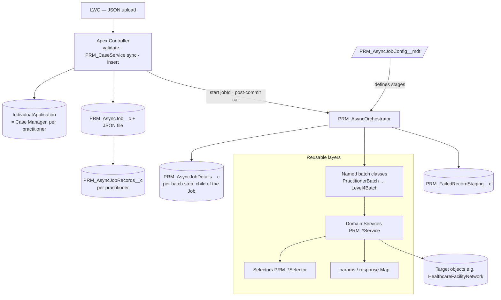
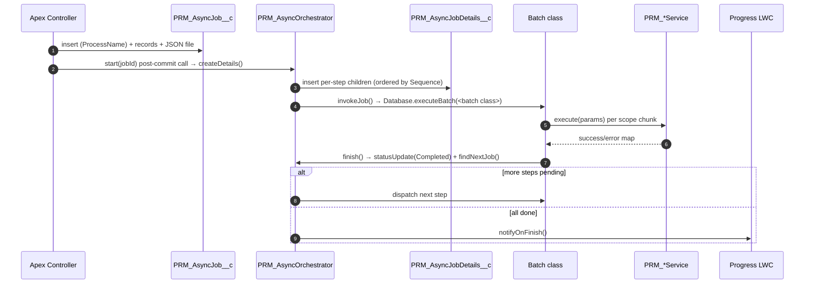
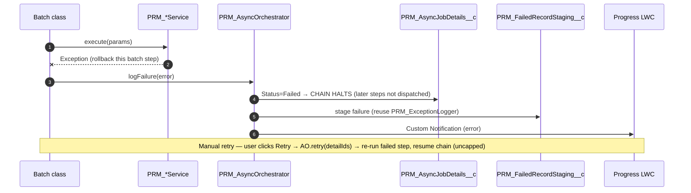
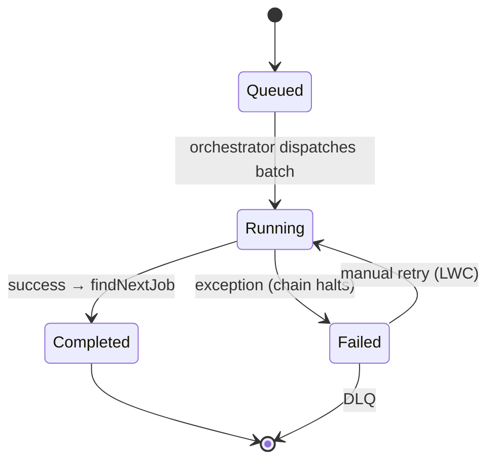

# IBC High Volume Design — Technical Design Document (TDD)

> **Platform:** Salesforce (Apex, OmniStudio IPs/DataRaptors, Custom Notifications, Custom Metadata, Async Apex)
> **Intent:** Define a **reusable record-creation framework** (layered Apex services + a metadata-driven async engine) for PRM forms. **Practitioner Creation Form is the first/pilot conversion** through this design; the remaining forms (PAR Form, PDM Manual Update, Ancillary, etc.) are converted later and **reuse the same services, selectors, and async framework**.
> **Related:** `PRM_Implementation_Plan.md` (Practitioner Creation build plan — source of truth for §11), `PRM_PractitionerCreation_Architecture_Overview.md` + `PRM_PractitionerCreation_ServiceFlow_Architecture.md` (target service-flow), `PRM_Apex_Reference_Implementation.md`, `PRM_PractitionerCreation_Apex_Service_Flow.md` (legacy parity), `PRM_Service_JSON_Contracts.md`.

> **Vocabulary note:** this is a Salesforce-native system. Generic terms map to platform primitives — *broker/queue → `PRM_AsyncJob__c` / `PRM_AsyncJobDetails__c` / `PRM_AsyncJobRecords__c` + Apex Flex Queue*, *DLQ → `PRM_FailedRecordStaging__c`*, *topic/routing → `ProcessName` + Custom Metadata*, *finish notification → Custom Notification (`PRM_AsyncJobNotification`)*. No external infrastructure is introduced.

> **Execution model (async-only):** intake is an **LWC bulk upload of a JSON file (multiple practitioners per submission)**, handled by an **`@AuraEnabled` Apex controller** that **validates synchronously → calls `PRM_CaseService` (the "Case Manager Service") to create one Case Manager (`IndividualApplication`) per practitioner → inserts one `PRM_AsyncJob__c` (with the JSON as a ContentVersion file) + one `PRM_AsyncJobRecords__c` per practitioner → calls `PRM_AsyncOrchestrator.start(jobId)` (post-commit) → returns**. The legacy **OmniScript** form coexists (may migrate to the same path later); **CSV upload is deferred** (not in pilot scope). There is **no synchronous orchestrator of record creation** and no cross-submission rollback. All record creation runs through **four concrete batch classes** — `PractitionerBatch` (E20), `PracticeLocationAndGroupBatch` (E21), `PLRelatedBatch` (E22), `Level4Batch` (E23) — each wrapping its EPIC E service(s) and branching **IBC vs Delegated internally**. `PRM_AsyncOrchestrator` sequences the batches from `PRM_AsyncJobConfig__mdt` (`PRM_Sequence__c`) and **invokes them directly** (the chain is kicked off by the `start(jobId)` **method call**, not an insert trigger); it **halts on first failure** (later batches don't run; completed records remain — no compensating rollback; **manual retry resumes from the failed batch**). Authoritative schema: `Epic_A_Environment_Setup.md`; service flow: `PRM_PractitionerCreation_ServiceFlow_Architecture.md`; batch↔service mapping: `PRM_Implementation_Plan.md` §8.1.

---

## 1. Executive Summary

### 1.1 Problem statement

Currently, the IBX utilizes OmniScripts, Integration Procedures (IPs), and DataMapper Loads to manage record ingestion and orchestration. Although this declarative design pattern is highly configurable, it experiences severe performance degradation under peak loads and high-volume data processing—specifically when scaling to include more records, locations, or groups within the guided flow

### 1.2 Business goals

- **One reusable framework**, not per-form rewrites — convert Practitioner Creation first, then reuse for all PRM forms.
- **Reliability:** **per-batch** transactional isolation with a **halt-on-failure** chain (a failed batch stops the remaining batches; completed batches' records persist — no compensating rollback). *(Revised: the original goal was all-or-nothing synchronous writes; the async-only model trades that whole-submission atomicity for governor-safe scale + durable, resumable recovery.)*
- **Scale:** absorb high-volume submissions without governor failures (every step runs async on a fresh governor budget).
- **Observability & recovery:** every job/step tracked, retryable (manual, resumes from the failed batch), and visible per Case Manager.
- **Maintainability:** testable Apex replacing fragile DR chains.

---

## 2. Background & Context

### 2.1 Current system overview

- **UI:** OmniScripts collect form data; an IP wrapper persists records via chained DataRaptors.
- **Pattern (all forms):** parent IP → multiple sub-IPs → many DR Extract/Transform/Load steps writing standard Health Cloud + PRM custom objects.
- **Pilot (Practitioner Creation):** `PRM_PractitionerCreationContainer` **v6** → **3 sub-IPs** — `PRM_PractitionerCreation` (base / IBC Professional Staff), `PRM_DelegatedPractitionerCreation` (Delegated Credentialing), `PRM_AddressLogicContainer` (locations/facilities). The orchestrator branches on `PractitionerCreationType`.

### 2.2 Existing challenges (common to all forms)

- **Governor limits** from per-record DR loops + transform chaining (CPU/DML/SOQL/heap).
- **No transaction control** — incremental commits leave orphans on failure.
- **Shared-record contention** — e.g. the Case Data Manager record is written by **both** creation sub-IPs (`PRMDRCreateCDMForPractitioner` / `PRMDRPCDMCaseManagerLink`) → `UNABLE_TO_LOCK_ROW`.
- **No durable/trackable async** for heavy work (e.g. `HealthcareFacilityNetwork` creation).
- **Low maintainability/testability** — logic scattered across dozens of DRs.

### 2.3 Business drivers

- Provider-network growth → larger submissions.
- Onboarding SLA pressure + cost of manual remediation.
- Need to modernize **once** and apply across the form portfolio.

---

## 3. Core Problems


| #   | Problem                                  | Root cause                                         | Impact                                                | Why DR/IP is insufficient                    |
| --- | ---------------------------------------- | -------------------------------------------------- | ----------------------------------------------------- | -------------------------------------------- |
| P1  | Governor-limit exhaustion on high volume | Synchronous per-record DR loops + transform chains | Hard failures on large rosters; unpredictable ceiling | DRs can't defer/bulk/chain on a fresh budget |
| P2  | Non-transactional partial writes         | No orchestration-level savepoint                   | Orphaned records; data-integrity risk                 | DR rollback is per-step, not cross-step      |
| P3  | Shared-record (CDM) contention           | Each DR independently writes the shared record     | Lock errors under concurrency; retries                | No shared in-memory state to coalesce writes |
| P4  | No durable async / job tracking          | Fire-and-forget; no job record/status/retry        | Silent network-creation failures; no recovery         | AsyncApexJob alone isn't business-trackable  |
| P5  | Maintainability & testability            | Logic spread across cryptic DRs                    | Slow, risky changes; no CI coverage                   | DRs are effectively untestable               |


---

## 4. High-Level Design (HLD)

A **layered, bulk-first Apex architecture** fronted by an **LWC + Apex controller** intake (OmniScript coexists), plus a **metadata-driven async engine** shared by all forms. There is no synchronous orchestrator of record creation: the intake controller validates + inserts the job + calls `start(jobId)`, and the async engine sequences the batch classes (each owns its step's transaction/branching and wraps the domain services).

| Layer                                   | Responsibility                                                                                                                                    | Reuse                   |
| --------------------------------------- | ------------------------------------------------------------------------------------------------------------------------------------------------- | ----------------------- |
| **L0 Transport**                        | **LWC (JSON upload) → `@AuraEnabled` Apex controller** → **validate (sync) → `PRM_CaseService` → insert `PRM_AsyncJob__c` → call `start(jobId)` → return** (OmniScript coexists; CSV deferred) | per form (config)       |
| **L1 Batch classes**                    | **Four** concrete `Database.Batchable` classes; each **branches** (IBC vs Delegated) internally, owns its step's DML, and wraps its domain service(s) | per form (config-named) |
| **L2 Domain services** (`PRM_*Service`) | Build + **one bulk DML per object type**; SOQL-free (context batch-injected); carry state via the `params`/response map                            | **shared across forms** |
| **L3 Selectors** (`PRM_*Selector`)      | All SOQL, bulk-safe, typed                                                                                                                        | **shared**              |
| **L4 Utilities**                        | `PRM_FormSubUtility` (`NameNormalize`, `recordTypeId`, `computeHcfExternalId`, `cmaFieldSets`) + abstract `PRM_ServiceBase`                        | **shared**              |
| **Async engine**                        | `PRM_AsyncJob__c` → `PRM_AsyncOrchestrator.start(jobId)` (post-commit method call) → `PRM_AsyncJobRecords__c` (per practitioner) → `PRM_AsyncJobDetails__c` (per batch step) → **directly invokes the named batch classes** (sequenced, halt-on-failure); DLQ; LWC; cleanup | **shared (generic)**    |


**Reuse model:** a new form = new payload type + validator + a set of batch classes (config-named) that **sequence existing services**, plus a new `ProcessName` + config rows. Practitioner Creation proves the framework; subsequent forms reuse ~70–90%.

---

## 5. Architecture & Design Diagrams

### 5.1 Context (form-agnostic)

```mermaid
flowchart LR
    U([Case Manager / Provider Ops]):::a
    UI[LWC — JSON upload<br/>OmniScript form coexists]:::ui
    CTRL[Apex Controller<br/>validate · PRM_CaseService · insert job · start jobId]:::s
    ASYNC[Async Engine<br/>PRM_AsyncJob__c plane]:::y
    BATCH[Batch classes → Domain Services]:::s
    DB[(PRM / Health Cloud Data)]:::d
    MON[Progress + Retry LWC]:::ui
    U-->UI-->CTRL-->DB
    CTRL-->ASYNC-->BATCH-->DB
    U-->MON-->ASYNC
    classDef a fill:#2563eb,color:#fff; classDef ui fill:#0ea5e9,color:#fff;
    classDef s fill:#6366f1,color:#fff; classDef y fill:#f59e0b,color:#111; classDef d fill:#10b981,color:#fff;
```


### 5.2 High-level architecture




### 5.3 Submission sequence (async-only)

```mermaid
sequenceDiagram
    autonumber
    participant U as LWC (JSON upload)
    participant CT as Apex Controller
    participant CS as PRM_CaseService
    participant JOB as PRM_AsyncJob__c
    participant AO as PRM_AsyncOrchestrator
    participant BAT as Batch classes
    U->>CT: submit(JSON — N practitioners)
    CT->>CT: validate (fail-fast; nothing enqueued on error)
    CT->>CS: create Case Manager per practitioner (sync)
    CS-->>CT: Case Manager Ids (IndividualApplication)
    CT->>JOB: insert job (+ JSON file) + PRM_AsyncJobRecords__c per practitioner
    CT->>AO: start(jobId) — post-commit method call (not a trigger) → createDetails()
    CT-->>U: {success, AsyncJobId}
    loop stages 1–4 in PRM_Sequence__c order (halt-on-failure)
        AO->>BAT: Database.executeBatch(<batch class>)
        BAT-->>AO: finish() → statusUpdate → findNextJob
    end
    Note over AO: all Completed → notifyOnFinish · any Failed → DLQ + chain halts (manual retry resumes)
```


---

## 6. Async Processing Framework Design

The async engine is a **metadata-driven, durable job pipeline** — generic across forms; a form only contributes a `ProcessName` + a set of config-named batch classes.

### 6.1 Building blocks


| Concern        | Realization                                                                                                                                                                                                                |
| -------------- | -------------------------------------------------------------------------------------------------------------------------------------------------------------------------------------------------------------------------- |
| Durable queue  | `PRM_AsyncJob__c` (run) with **two M-D children (siblings):** `PRM_AsyncJobRecords__c` (per Case Manager; `PRM_AsyncJob__c`, `PRM_CaseManager__c`) and `PRM_AsyncJobDetails__c` (per batch step) + Apex Flex Queue                  |
| Routing/config | `PRM_ProcessName__c` → `PRM_AsyncJobConfig__mdt` (`PRM_ProcessName__c` (picklist), `PRM_ServiceClassName__c` (**batch class** name — `Type.forName`), `PRM_Mode__c`, `PRM_BatchSize__c`, `PRM_Sequence__c`) |
| Producer       | **LWC (JSON upload) + `@AuraEnabled` Apex controller**: validate (sync) → call `PRM_CaseService` (sync; one Case Manager/`IndividualApplication` per practitioner) → insert `PRM_AsyncJob__c` (+ ContentVersion payload) + one `PRM_AsyncJobRecords__c` per practitioner (seeded with the returned Case Manager Ids) → call `PRM_AsyncOrchestrator.start(jobId)` |
| Dispatch       | Apex controller calls **`PRM_AsyncOrchestrator.start(jobId)` (post-commit method call — not a trigger)** → `createDetails()` → **directly invokes the named batch class** for each step                                     |
| Consumer       | The **four** concrete batch classes (`PractitionerBatch` E20, `PracticeLocationAndGroupBatch` E21, `PLRelatedBatch` E22, `Level4Batch` E23) — each wraps its EPIC E service(s); branch IBC/Delegated inside                 |
| Notification   | **Custom Notification** (`PRM_AsyncJobNotification`) on finish; LWC loads on render + manual Refresh (no streaming)                                                                                                        |
| DLQ            | `PRM_FailedRecordStaging__c` *(existing — reused)* + new `PRM_AsyncJobDetails__c` lookup                                                                                                                                   |
| Payload/result | `**ContentVersion` JSON file on `PRM_AsyncJob__c` — always a file (no `PRM_InputJson__c`/`PRM_Response__c` fields)**; read/written via `jsonFileParser`                                                                    |


> Object/field schema is authoritative in `**Epic_A_Environment_Setup.md`** (objects, picklists, Master-Detail, OWD Private, permission set).

> **Decision (CL-1, closed):** the org has an existing async pattern (`PRM_AsyncProcess__c` + `PRM_AsyncProcessRecordSyncEvent__e` + `NetworkMember`/`NetworkMemberChunk` + roster-sync batch handlers). **We are not reusing it** — this design builds the dedicated `PRM_AsyncJob__c` / `PRM_AsyncJobDetails__c` framework (per-child status, retry, DLQ, chaining, LWC, metadata routing). The existing pattern remains in place for its current roster-sync purpose.

### 6.2 `PRM_AsyncOrchestrator` responsibilities

`createDetails` (fan out per-step children from metadata) · `invokeJob` (**`Database.executeBatch` of the named batch class** from `PRM_ServiceClassName__c`, sized by `PRM_BatchSize__c`) · `findNextJob` (sequential chaining by `PRM_Sequence__c`; **halts the chain on a `Failed` step**) · `statusUpdate` · `retry` (**manual**, from the LWC — re-runs the `Failed` step and resumes the chain, **uncapped**) · `jsonFileParser` (reads/writes the `ContentVersion` payload file) · `logFailure` (reuse `PRM_ExceptionLogger` → DLQ) · `notifyOnFinish` (Custom Notification `PRM_AsyncJobNotification`).

### 6.3 Guarantees & policies

- **Delivery:** at-least-once; **idempotency** via External-Id upserts + status guards (a `Completed` step is never reprocessed).
- **Ordering:** per-job **strictly sequential** (by `PRM_Sequence__c`) — and **halt-on-failure**: a `Failed` step stops the chain so later batches never run on incomplete prerequisites; cross-job concurrent up to flex-queue limits.
- **Retry:** **manual** from the LWC (`PRM_AsyncOrchestrator.retry`), **uncapped** — re-runs the `Failed` step and **resumes the chain from there** (no automatic retry/backoff). Records from already-`Completed` steps remain (no compensating rollback); the failed step stays `Failed` + DLQ until a user retries.
- **Back-pressure:** before dispatch, check Flex Queue depth (cap 100) → defer for large fan-outs.
- **Eventual consistency:** Case Manager(s) created sync at intake; the rest converges in seconds–minutes; LWC shows in-progress.
- **Circuit breaker:** manual disable (no auto circuit-breaker in v1) halts a `ProcessName` without losing queued work.
- **Recovery:** failed step → DLQ → **manual retry** (resumes the chain from the failed step). No automatic retry/backoff in v1. *(A scheduled sweeper for stuck/stranded jobs is a **deferred future enhancement** — Epic C OQ-C6; the pilot relies on manual retry.)*

### 6.4 Async sequence — happy path




### 6.5 Async sequence — failure → retry → DLQ




### 6.6 Job lifecycle




---

## 7. Scalability Design

- **Horizontal:** **Batch Apex** (each batch step = a fresh governor budget; `start/execute/finish` chunked) sequenced by `PRM_AsyncOrchestrator`; concurrency bounded by the Flex Queue (100).
- **Chunking:** `PRM_BatchSize__c` (per config row) tunes per-transaction CPU/DML.
- **Caching:** cached RecordType lookups; selector reuse within a run via the request `params` map.
- **Capacity tiers** (all Batch; `PRM_BatchSize__c` tunes the chunk):


| Tier       | Volume       | Notes                                |
| ---------- | ------------ | ------------------------------------ |
| Typical    | ≤ 5K records | ~200/chunk                           |
| Large      | 5K–50K       | many chunks per batch step           |
| Roster-max | > 50K        | smaller `PRM_BatchSize__c` if needed |


---

## 8. Reliability & Resiliency

- **Intake atomicity (sync):** validation + `PRM_CaseService` (Case Manager creation) + job/records insert happen in the synchronous intake transaction — if any of that fails, nothing is enqueued (no orphan job). *(There is no whole-submission rollback across the async batches — see below.)*
- **Batch isolation + halt-on-failure:** each batch step is its own transaction; a failed step stops the chain so later batches never run on incomplete prerequisites. Records from already-`Completed` steps **remain** (no compensating rollback).
- **Recovery:** failed step → DLQ staging → **manual retry** that resumes the chain from the failed step. *(Automated **sweeper** for stuck/queued jobs is a **deferred future enhancement** — Epic C OQ-C6.)*
- **HA:** no single sync transaction gates the heavy work; degraded mode = jobs queue and drain.
- **DR/Backup:** jobs + records + payload (JSON files) are durable rows; standard Salesforce backup; DLQ retained for replay.

---

## 9. Observability & Monitoring

- **Metrics:** job counts by `PRM_Status__c`/`PRM_ProcessName__c`, retry rate, DLQ rate, time-to-complete, Flex Queue depth.
- **Logging:** `PRM_ExceptionLogger` → existing `PRM_ExceptionLog__c` (and/or `PRM_ExceptionLogEvent__e` platform event) (validation vs runtime), correlated by `PRM_AsyncJob__c.Id`.
- **Tracing:** `PRM_AsyncJob__c.Id` propagated to children, logs, and the finish Custom Notification.
- **Dashboards:** reports on Failed/Pending/Completed; per-Case-Manager LWC view.
- **Alerting:** DLQ growth, stuck `Running` > timeout, success rate < SLO.
- **SLOs (proposed):** sync success ≥ 99.5%; ≥ 99% jobs complete < 15 min (typical); post-retry terminal failure ≤ 0.5%.
- **Runbooks:** stuck job → manual re-enqueue via per-step Retry *(automated sweeper deferred — OQ-C6)* · DLQ spike → inspect staging, fix, retry · flex queue full → step fails → manual Retry once capacity frees.

---

## 10. Risks & Mitigations


| #   | Risk                                          | Impact | Probability | Mitigation                                                     | Owner         |
| --- | --------------------------------------------- | ------ | ----------- | -------------------------------------------------------------- | ------------- |
| R1  | DR→object field mappings differ from inferred | High   | Medium      | Schema spike sign-off before build (EPIC A)                    | Tech Lead     |
| R2  | Flex Queue (100) saturation at peak           | High   | Medium      | Back-pressure guard; Batch mode; throttled enqueue             | Platform Arch |
| R3  | Async partial success vs sync core            | Medium | Medium      | Retry + DLQ + LWC retry; clear in-progress UI                  | Eng           |
| R4  | Large payload exceeds Long Text               | Medium | Medium      | JSON file (`ContentVersion`) + `jsonFileParser`                | Eng           |
| R5  | Non-idempotent reprocessing → duplicates      | High   | Low         | External-Id upserts + status guards                            | Eng           |
| R6  | Cutover regression vs legacy contract         | High   | Medium      | Shadow-mode parity; LWC channel additive — rollback = disable LWC upload, OmniScript/legacy path remains | QA + Eng      |
| R7  | OmniStudio→Apex skills gap                    | Medium | Medium      | Reference impl + pairing + reviews                             | Eng Mgr       |
| R8  | Branch complexity (IBC vs Delegated) untested | Medium | Medium      | Branch-specific integration + shadow parity (both)             | QA + Eng      |


---

## 11. Implementation Plan

**`PRM_Implementation_Plan.md` is the source of truth** for the build plan — per-epic task tables, the batch↔service mapping (§8.1), effort, and the data-model appendix. This section is a **summary only**; the detailed tables are not duplicated here. Practitioner Creation is delivered first; EPICs **B (Foundation), C (Async framework), D (Selectors) are shared** and reused by every subsequent form (PAR, PDM, …).


### 11.1 Delivery phases (EPICs)


| EPIC                                | Theme                                                                                                                                          | Output                                          |
| ----------------------------------- | --------------------------------------------------------------------------------------------------------------------------------------------- | ----------------------------------------------- |
| **A — Environment**                 | Async objects (`PRM_AsyncJob__c`, `PRM_AsyncJobDetails__c`, `PRM_AsyncJobRecords__c`) + `PRM_AsyncJobConfig__mdt` + permission set             | Deployable scaffolding                          |
| **B — Foundation**                  | `PRM_FormSubUtility` (`NameNormalize`) + abstract base `PRM_ServiceBase` *(no `PRM_OrchestratorBase` — async-only)*                            | Reusable scaffolding (shared by later flows)    |
| **C — Async framework**             | The three async objects, Custom Metadata, trigger, `PRM_AsyncOrchestrator` (invokes the **named batch classes** directly), LWC progress/retry, cleanup batch | Metadata-driven async execution + monitoring    |
| **D — Selectors**                   | 5 selectors (reuse/extend existing — CL-8)                                                                                                     | Read layer                                      |
| **E — Services + batch classes**    | **E1 `PRM_CaseService` at sync intake**; **E2–E18** grouped under the **four** batch classes (mapping: Plan §8.1); cross-cutting **E19 CMA**   | Business logic + async execution units          |
| **F — Validation & intake**         | Typed payload model + `PractitionerCreationPayloadValidator` (sync) + **LWC bulk-upload UI + `@AuraEnabled` Apex controller** (validate → `PRM_CaseService` → insert job → `start(jobId)`); OmniScript coexists, CSV deferred | Intake wired end-to-end                         |
| **G — Testing**                     | Unit, integration, performance, shadow-mode parity                                                                                            | Quality gates                                   |


### 11.2 Effort summary (provisional)

| EPIC | Est (engineer-days) |
| ---- | ------------------- |
| A — Environment | 1.0 |
| B — Foundation | 2.0 |
| C — Async framework | 12.5 |
| D — Selectors (reuse) | 3.0 |
| E — Services + 4 batch classes | 23.0+ |
| F — Validation & intake *(shrunk)* | ~6.5 |
| G — Testing | 10.5 |
| **Total** | **~60 engineer-days** *(provisional — re-baseline w/ CL-15, CL-13)* |


### 11.3 Rollout & migration

- **Rollout:** the **LWC bulk-upload channel is additive** — enable it after shadow-mode parity validates both branches in lower environments; the legacy **OmniScript/IP path remains available** as fallback. Rollback = **disable the LWC upload** (users continue on OmniScript) — no IP re-point needed for the new channel.
- **Migration:** flow-level (no historical data migration); shadow-mode parity (both IBC + Delegated) → enable LWC upload → deprecate the legacy IP/sub-IPs once the OmniScript path is migrated to the same async pipeline (later).
- **Subsequent forms:** PAR, PDM, Ancillary, etc. reuse B/C/D + most services → only a new validator, intake wrapper, form-specific services, and a new `ProcessName` + batch classes are required, so incremental cost is far lower than the pilot's.

### 11.4 EPIC E — service catalog

Every service **extends `PRM_ServiceBase`** and implements `**execute(Map<String,Object>) : Map<String,Object>**` — the batch injects `**flow**` + the per-practitioner context/Ids (services are **SOQL-free**). Each service builds records in memory and **does one bulk DML per object type** (FK/dependency order; back-link updates where needed); reads go through the EPIC D selectors; formula logic (record types via cached describe, dates, gating) is computed in-service. **Grounded field maps + per-service/per-batch specs:** `Epic_E_Practitioner_Services.md` (Part 1 — intake E1 + PractitionerBatch: E2·E5·E6·E7·E8·E10·E11·E19·E16), `Epic_E_Practitioner_Services_Part2.md` (Part 2 — PracticeLocationAndGroupBatch: E3·E13[E12 folded]·E9), and `Epic_E_Practitioner_Services_Part3.md` (Part 3 — PLRelatedBatch E14·E15 + Level4Batch E18; **E17 dropped** — trigger side-effect of E18). Batch designs: E20/E21/E22/E23 under `epic-e-services/**`.


> **🔄 E1 runs at synchronous intake.** `PRM_CaseService` (the "Case Manager Service") is **not** hosted in a batch — the **Apex controller** calls it synchronously (one Case Manager/`IndividualApplication` **per practitioner**) before inserting the job, and seeds `PRM_AsyncJobRecords__c` with the returned Ids. **E2–E18** run inside the **four** batch classes (mapping below; mirrors Plan §8.1).

**Batch ↔ service mapping (CL-15 resolved)** — sequenced by `PRM_AsyncJobConfig__mdt.PRM_Sequence__c`, halt-on-failure; each batch branches IBC vs Delegated internally. **E19 (CMA) + E16 (CDM)** are cross-cutting (run in each stage that creates records):

| Seq | Batch (class) | Services |
|---|---|---|
| — | *(sync intake)* | **E1** `PRM_CaseService` — one Case Manager per practitioner |
| 1 | `PractitionerBatch` (E20) | E2 · E5 · E6 · E7 · E8 · E10 · E11 · **E19** · **E16** |
| 2 | `PracticeLocationAndGroupBatch` (E21) | E3 · E13 (**E12 folded in**) · E8 (facility) · E19 · E16 · *(E9 pending)* |
| 3 | `PLRelatedBatch` (E22) | E14 (+ `PractionerPracticeLocationService` builder) · E15 · E19 · E16 |
| 4 | `Level4Batch` (E23) | E18 *(→ HFN trigger creates `PRM_FacilityNw` + `PRM_FacilityTx`)* |

> **GroupRelatedBatch removed** (no defined scope) — the pipeline is four contiguous stages. **E17 dropped** — the facility-grain network/taxonomy is a trigger side-effect of E18's Level-4 insert.

| Task   | Service                                             | Branch   | Writes                                                                                                                             | Est |
| ------ | --------------------------------------------------- | -------- | ---------------------------------------------------------------------------------------------------------------------------------- | --- |
| E1     | `PRM_CaseService` *(sync intake — Case Manager Service, BULK)* | BOTH | Account · Case · IndividualApplication (= Case Manager) — circular FK: insert + 2 back-link updates; **bulk: one call per submission over an `applications[]` array (one Case Manager per practitioner), one bulk DML per object type**       | 2.5 |
| E2     | `PRM_PractitionerService`                           | BOTH     | HealthcareProvider · HealthcareProviderNpi · Identifier · **HealthcareProviderTaxonomy** *(E4 merged in)*                          | 2.5 |
| E3     | `PRM_GroupService`                                  | DEL      | Account(Vendor) · Identifier · HealthcareProviderNpi · HealthcareProvider *(`PRMPostGroupPractitionerCreation`)*                   | 1.5 |
| ~~E4~~ | ~~`PRM_TaxonomyService`~~                           | —        | **merged into E2** (fused HCP+Taxonomy+License DR)                                                                                 | —   |
| E5     | `PRM_LicenseService`                                | BOTH     | BusinessLicense *(unified `businessLicenses[]`; DEA/CDS + SBRD)*                                                                   | 0.5 |
| E6     | `PRM_EducationService`                              | DEL      | PersonEducation                                                                                                                    | 0.5 |
| E7     | `PRM_BoardCertificationService`                     | DEL      | BoardCertification *(upsert by `BoardName`; runs after E2)*                                                                        | 0.5 |
| E8     | `PRM_InfoCodeService`                               | BOTH     | `PRM_InfoCodeAssignment__c`                                                                                                        | 1.5 |
| E9     | `PRM_FileService`                                   | DEL      | Identifier (Document RT) · ContentDocumentLink                                                                                     | 1.0 |
| E10    | `PRM_ContactService`                                | DEL      | **ContactProfile** *(not Contact)*                                                                                                 | 1.0 |
| E11    | `PRM_LanguageService`                               | DEL      | PersonLanguage                                                                                                                     | 0.5 |
| ~~E12~~ | ~~`PRM_HealthcareProviderNpiService`~~             | —        | **folded into E13** (E13 owns the location NPI)                                                                                    | —   |
| E13    | `PRM_HealthcareFacilityCreationService` *(in-batch, seq 2)* | BOTH | Location · Address · HealthcareFacility · HealthcareProviderNpi *(E12 folded)* — HCF trigger adds Location-NPI history + `PRM_ExternalId__c`; does **not** invoke E14/E15 | 3.0 |
| E14    | `PRM_HPFService` *(single service, both RTs)*       | BOTH     | HealthcarePractitionerFacility — RT `PRM_PractitionerLocationAffiliation` (PLA) **+** `PRM_PractitionerPracticeAffiliation` (PPA)   | 1.5 |
| E15    | `PRM_ProviderFeatureService` *(both RTs)*           | BOTH     | `PRM_ProviderFeature__c` — RT `PRM_AssistiveAid` **+ `PRM_AffirmingCareCategory` (ACC)**; per-location; Id-based update-in-place    | 1.5 |
| E16    | `PRM_CaseDataManagerService` *(cross-cutting; last)* | BOTH    | `PRM_CaseDataManager__c` — one manifest per Case Manager; **batch-supplied outcome tokens** (one INSERT + one UPDATE)              | 1.5 |
| ~~E17~~ | ~~`PRM_HealthcareFacilityNetworkService`~~         | —        | **dropped** — `PRM_FacilityNw` + `PRM_FacilityTx` are a trigger side-effect of E18's Level-4 insert                                | —   |
| E18    | `PRM_Level4RecordCreationService` *(in `Level4Batch` E23)* | BOTH | HealthcareFacilityNetwork *(RT `PRM_FacilityPractitionerTxNw`)* — HFN trigger cascades `PRM_FacilityNw` + `PRM_FacilityTx`          | 2.0 |
| E19    | `PRM_CMAService` *(cross-cutting)*                  | BOTH     | `PRM_CaseManagerAssociation__c` — links each created record to its Case Manager (per record type)                                  | —   |


⚡ = high-leverage / load-test priority · *(async)* / *(batch)* = runs inside a `Database.Batchable` batch class (EPIC C dispatch).

> **IBC vs Delegated:** the **IBC** branch uses E1, E2, E5, E8, E16 (+ E19) (links to existing facilities). The **Delegated** branch adds E3, E6, E9, E13–E15 and the **Level-4 network service E18** (locations/facility/network only when group/new-location data is present). Each batch class applies this branch logic internally.
>
> **Removed / changed vs prior revision:** `PRM_TaxonomyService` (E4) → **merged into E2**; `PRM_HealthcareProviderNpiService` (E12) → **folded into E13**; `PRM_HealthcareFacilityNetworkService` (E17) → **dropped** (trigger side-effect of E18); `PRM_ExistingPrimaryPracticeService` → removed; `PRM_AddressService` → replaced by `PRM_HealthcareFacilityCreationService` (E13). **Updated:** E14 (both affiliation RTs), E15 (AssistiveAid + ACC), E16 (outcome-token model), E18 (`HealthcareFacilityNetwork` Level-4). **Added:** E19 `PRM_CMAService`. **GroupRelatedBatch removed.**

> Effort, rollout, and the batch↔service mapping are in §11.2–§11.3 above and `PRM_Implementation_Plan.md` (§8.1).

---

## 12. Clarification Log

> Open items that are **unclear, incomplete, or unsupported** by the metadata / documented requirements. Each must be resolved **before its dependent epic** (object/field maps are confirmed per-service in EPIC E's definition of done). *No design decision below should be treated as final until the owner signs off.*


| ID               | Item / question                                 | Why it's open (evidence)                                                                                                                                                                                        | Impact                                                                                                              | Recommendation                                                                                                                                                                                                                           | Owner                     |
| ---------------- | ----------------------------------------------- | --------------------------------------------------------------------------------------------------------------------------------------------------------------------------------------------------------------- | ------------------------------------------------------------------------------------------------------------------- | ---------------------------------------------------------------------------------------------------------------------------------------------------------------------------------------------------------------------------------------- | ------------------------- |
| CL-1 *(CLOSED)*  | Reuse existing async infra vs build new?        | Org has `PRM_AsyncProcess__c`, `PRM_AsyncProcessRecordSyncEvent__e`, `NetworkMember(Chunk)`, roster-sync batches.                                                                                               | —                                                                                                                   | **Decision: build new** `PRM_AsyncJob__c`/`PRM_AsyncJobDetails__c`; **not reusing `PRM_AsyncProcess__c`**. Existing pattern stays for roster-sync.                                                                                       | Platform Arch             |
| CL-2             | `PractitionerPracticeLocation` object           | **Does not exist** in `objects/`; legacy `PRMDRCreatePPLForPPA` writes `**HealthcarePractitionerFacility`**.                                                                                                    | Service writes + DML counts wrong if treated as a distinct object.                                                  | Drop PPL as a separate object; "PPL" = HCPF records. *(applied in §11.6 E13)*                                                                                                                                                            | Tech Lead                 |
| CL-3             | `HealthcarePractitionerFacilityNetwork` (HCPFN) | **Does not exist**; referenced in `PRM_PractitionerCreation_Apex_Service_Flow.md` step 17.                                                                                                                      | Async scope overstated.                                                                                             | Async creates `HealthcareFacilityNetwork` only (grounded to `PRMDRPracCreateHCFacilityNetwork…`). Correct the service-flow doc.                                                                                                          | Tech Lead                 |
| CL-4             | ~~Feature-flag object~~ *(CLOSED)*              | Decision: **no feature-flag object**; the LWC upload channel is **additive** (enable/disable at rollout).                                                                                                        | —                                                                                                                   | Removed A2; rollback = **disable the LWC upload** (OmniScript/legacy path remains).                                                                                                                                                     | Tech Lead                 |
| CL-5             | Exception-log target                            | Real objects are `PRM_ExceptionLog__c` + `PRM_ExceptionLogEvent__e`; docs used `PRM_Exception_Log__c`.                                                                                                          | Logger implementation.                                                                                              | Use real names. *(applied in §9 / §11.3)*                                                                                                                                                                                                | Eng                       |
| CL-6             | High-volume target object(s)                    | `NetworkMember` / `NetworkMemberChunk` exist (imply chunked network-membership processing); docs assume `HealthcareFacilityNetwork` only.                                                                       | Async processor design + volume/sizing tiers.                                                                       | Confirm (before EPIC C/E) whether the heavy work is HCFN only or also `NetworkMember(Chunk)`.                                                                                                                                            | Platform Arch             |
| CL-7             | New custom objects/MDT                          | `PRM_AsyncJob__c`, `PRM_AsyncJobDetails__c`, `PRM_AsyncJobConfig__mdt` are **all new** (not in org).                                                                                                            | EPIC A/C scope; naming governance.                                                                                  | Net-new **approved** (CL-1 closed: build new); validate naming standards.                                                                                                                                                                | Platform Arch             |
| CL-8             | Selectors already exist                         | `PRM_AddressSelector`, `PractitionerDetailsSelector`, `PRM_UpdateDirectorySelector`, `PRM_NCPDP_Selector` exist in `classes/`.                                                                                  | EPIC D scope/effort.                                                                                                | Reuse/extend existing selectors; only build genuinely missing ones. *(applied in §11.5 D2/D3)*                                                                                                                                           | Eng                       |
| CL-9             | Legacy validator reuse                          | `PRM_PractitionerCreationValidator.cls` exists.                                                                                                                                                                 | F1 scope.                                                                                                           | Port/refactor its rules into `PractitionerCreationPayloadValidator`; don't author from scratch.                                                                                                                                          | Eng                       |
| CL-10            | SOQL/perf targets                               | `PRM_PractitionerCreation_Apex_Service_Flow.md` gives DML (~12 IBC / ~22–28 Delegated) but **no SOQL** figure.                                                                                                  | G3 acceptance thresholds.                                                                                           | Measure in the POC; set SOQL target from baseline (the §11 doc's "≤ 40" is provisional).                                                                                                                                                 | Eng                       |
| CL-11            | Field-level DR→object mappings                  | DRs are now in source (`omniDataTransforms/`) but per-field maps not yet extracted.                                                                                                                             | Every service's record builders + parity.                                                                           | Extract each DR's `<outputObjectName>` + field maps and sign off **per service during EPIC E** (and before its tests).                                                                                                                   | Tech Lead                 |
| CL-12 *(CLOSED)* | Processor resolution                            | `PRM_ProcessName__c` became a picklist, so no class name to resolve.                                                                                                                                            | —                                                                                                                   | **Resolved:** added `PRM_ServiceClassName__c` (Text) to `PRM_AsyncJobConfig__mdt`; the dispatcher does `Type.forName(PRM_ServiceClassName__c)` to instantiate the `PRM_ServiceBase` worker (no separate `PRM_AsyncProcessor` interface). | Tech Lead                 |
| CL-13            | Removed Foundation classes                      | EPIC B keeps `PRM_FormSubUtility` (`NameNormalize`) + the abstract base `PRM_ServiceBase` only (`PRM_OrchestratorBase` removed — async-only; `toSObjectList` removed); `PRM_ExceptionLogger`, `PRM_ValidationException`, `PRM_PayloadValidator`, `PRM_RecordTypes` not in B. | Referenced by EPIC C (logging), F (validation), E (`PRM_RecordTypes`) — homes per CL-13 resolution. | `PRM_ExceptionLogger` reuse existing; **RecordType lookup = general `PRM_FormSubUtility.recordTypeId(...)`** (not a separate `PRM_RecordTypeUtil`); validation classes→EPIC F. | Platform Arch / Tech Lead |
| CL-14 *(ratified)* | **Async-only execution model**                | Decision to remove the synchronous orchestrator and run everything through **four** named batch classes sequenced by Custom Metadata; new `PRM_AsyncJobRecords__c`; `PRM_AsyncJob__c.PRM_CaseManager__c` removed; `PRM_ServiceClassName__c` now = batch class name; halt-on-failure chain. | EPIC E reorg, EPIC F shrink, EPIC C dispatches batches directly; whole-submission atomicity dropped. | **Ratified.** Schema settled: M-D chain `PRM_AsyncJob__c` → `PRM_AsyncJobRecords__c` (only `PRM_AsyncJob__c` + `PRM_CaseManager__c`) → `PRM_AsyncJobDetails__c`; Case Manager reached via the parent record (dropped from Details). Batch↔service mapping in Plan §8.1 (four contiguous stages; GroupRelatedBatch removed). | Platform Arch / Tech Lead |
| CL-15 *(resolved)* | Batch↔service mapping                   | Mapping + sequence finalized in **Plan §8.1** / the service-flow docs. Four contiguous stages: `PractitionerBatch (E20) → PracticeLocationAndGroupBatch (E21) → PLRelatedBatch (E22) → Level4Batch (E23)`. E1 = sync intake. | EPIC E reorganization + `PRM_AsyncJobConfig__mdt` seed sequence.                                                   | **Resolved.** `GroupRelatedBatch` **removed** (no scope); **E17 dropped** (trigger side-effect of E18); **E12 folded into E13**; `PractionerPracticeLocationService` = internal builder in E14 `PRM_HPFService`. | Tech Lead                 |
| CL-16 *(ratified)* | **LWC bulk-upload intake**                    | Intake is an **LWC JSON-file upload → `@AuraEnabled` Apex controller** (fully synchronous: validate → `PRM_CaseService` → insert job → `start(jobId)`); OmniScript coexists. | L0 transport + EPIC F; §4/§5/§6.                                       | **Ratified.** Controller replaces the IP-wrapper role for the new channel; async kicked off by a **method call** (`start(jobId)`), **not** an insert trigger. | Tech Lead                 |
| CL-17 *(open)*     | **CSV upload deferred**                       | Only JSON upload in the pilot; CSV→canonical-JSON mapping (nested groups/locations/networkTaxonomyRoles) not designed. | Intake scope.                                                        | Defer CSV; revisit column template + parser (LWC vs Apex) post-pilot. | BA                        |
| CL-18 *(open)*     | **Sync-intake ceiling**                       | Fully-synchronous controller runs validate + `PRM_CaseService` + job insert in one transaction. | Governor limits on very large uploads.                              | POC the max practitioners/upload; consider an async parse/staging step if the ceiling is hit. | Eng                       |


---

## 13. Gaps, Conflicts & Evidence-Based Recommendations


| #                | Finding                                                                                                                                                          | Evidence (metadata)                                                                                                             | Severity                | Recommendation                                                                                                                      |
| ---------------- | ---------------------------------------------------------------------------------------------------------------------------------------------------------------- | ------------------------------------------------------------------------------------------------------------------------------- | ----------------------- | ----------------------------------------------------------------------------------------------------------------------------------- |
| G-1 *(resolved)* | **Parallel async frameworks.** A separate async pattern (`PRM_AsyncProcess__c` + Platform Event + chunk objects) already exists.                                 | `objects/PRM_AsyncProcess__c`, `PRM_AsyncProcessRecordSyncEvent__e`, `NetworkMember(Chunk)`; `classes/PRM_*RosterRecordsSync`*. | High                    | **Decision: build new** (`PRM_AsyncJob__c`), **not reuse** `PRM_AsyncProcess__c`. Document the divergence rationale for governance. |
| G-2              | **Phantom objects in docs.** `PractitionerPracticeLocation` and `HCPFN` are written as targets but don't exist.                                                  | `objects/` sweep; `PRMDRCreatePPLForPPA → HealthcarePractitionerFacility`.                                                      | Medium                  | Corrected in TDD; fix the service-flow doc and any DML-count tables.                                                                |
| G-3              | **Wrong custom-object/setting names.** `PRM_Exception_Log__c`, `PRM_FeatureFlags__c` not in org.                                                                 | `objects/PRM_ExceptionLog__c`, `PRM_ExceptionLogEvent__e`, `PRM_FeatureConfigurationSettings__c`.                               | Medium                  | Use real names (applied).                                                                                                           |
| G-4              | **Rebuild vs reuse selectors.** EPIC D assumed all-new selectors.                                                                                                | `classes/PRM_AddressSelector`, `PractitionerDetailsSelector`.                                                                   | Medium                  | Reuse/extend; EPIC D effort reduced.                                                                                                |
| G-5              | **Network target ambiguity.** "High volume" may center on `NetworkMember`/`NetworkMemberChunk`, not just HCFN — which would change the async processor + sizing. | `NetworkMember`, `NetworkMemberChunk` objects; `DFX_Level4PrimaryTaxonomyFlagUpdateBatch`.                                      | High                    | Resolve CL-6 before EPIC C; the chunk object suggests a proven chunking pattern to reuse.                                           |
| G-6              | **CDM contention quantified.** `PRMDRCreateCDMForPractitioner` + `PRMDRPCDMCaseManagerLink` run in both creation sub-IPs.                                        | `PRM_PractitionerCreation_Procedure_3`, `PRM_DelegatedPractitionerCreation_Procedure_7`.                                        | Low (already addressed) | Single `PRM_CaseDataManagerService.commit()` — design is correct; keep.                                                             |
| G-7              | **Validator already exists.** F1 should port, not invent.                                                                                                        | `classes/PRM_PractitionerCreationValidator.cls`.                                                                                | Low                     | Port rules; preserve parity.                                                                                                        |
| G-8              | **DR field maps unverified.** All `*__c` field-level writes still inferred.                                                                                      | DRs present but not field-extracted.                                                                                            | Medium                  | Per-service field-map sign-off is a hard gate within EPIC E (CL-11).                                                                |


**Net effect on the plan:** the async reuse question (CL-1/G-1) is **closed — build new** (`PRM_AsyncJob__c`), not reusing `PRM_AsyncProcess__c`; EPIC D effort is reduced (selector reuse, G-4); the schema-verification spike is **removed** — DR field maps + object questions (CL-2/3/6/11) are resolved per-service inside EPIC E (with the Clarification Log tracking owners); the feature flag is **removed** (hard cutover); F1 ports an existing validator. None of these are assumptions — each is backed by the cited metadata.