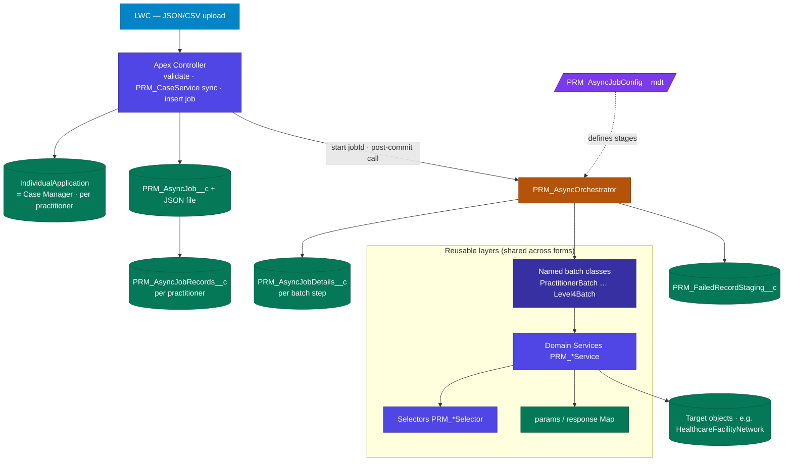
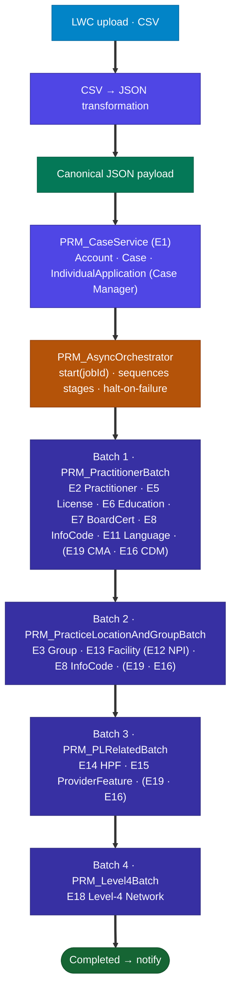
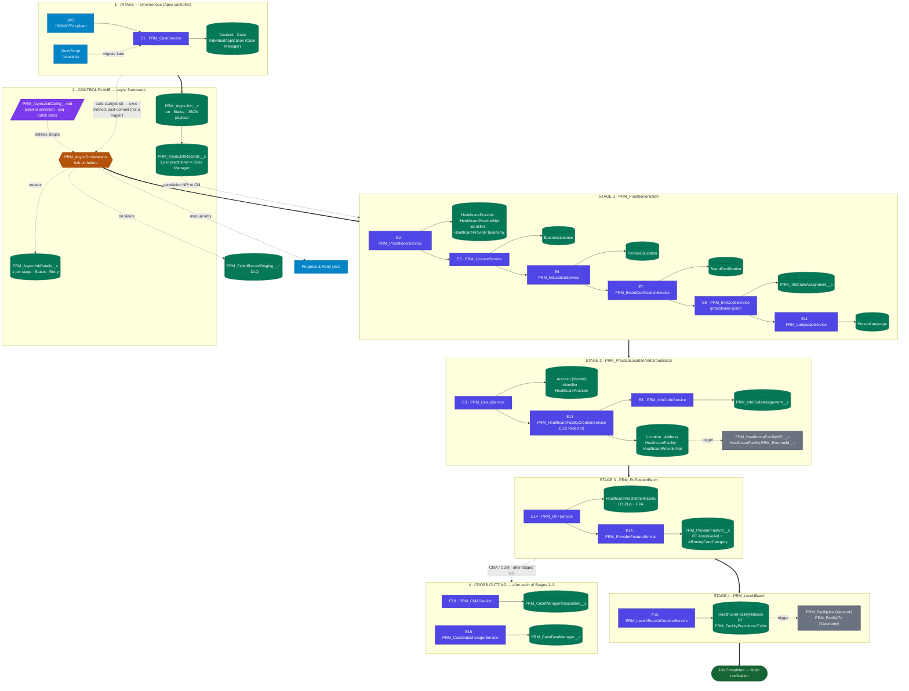

# Practitioner Creation — Architecture Overview

**Audience:** Engineering / Architecture · **Purpose:** explain the target Practitioner Creation process architecture end-to-end.
**Related detail:** `PRM_PractitionerCreation_ServiceFlow_Architecture.md` (full flows) · `PRM_IBC_HighVolume_TDD.md` (framework) · `epic-e-services/**` (per-service & per-batch specs).

---

## 1. Summary

A user uploads a **JSON file containing many practitioners** through a **Lightning Web Component (LWC)**. An **Apex controller** synchronously validates the payload, creates one **Case Manager** (`IndividualApplication`) per practitioner, stores the payload as a **`ContentVersion`**, and inserts one **`PRM_AsyncJob__c`** (with one **`PRM_AsyncJobRecords__c`** per practitioner). All heavy record creation then runs **asynchronously** through a **metadata-driven, halt-on-failure chain of four Batch-Apex stages**, each wrapping bulk-first, idempotent Apex **services** — replacing the legacy OmniStudio DataRaptor chains. The existing **OmniScript** form continues to operate and may migrate onto the same pipeline later.

---

## 2. Framework architecture (reusable async engine)

> The practitioner flow (§3) runs on a **generic, reusable framework**. A new form contributes only a payload/validator + config-named batch classes and reuses the same services, selectors, and async engine (~70–90% reuse). *(Adapted from `PRM_IBC_HighVolume_TDD.md` §4 / §5.)*

### 2.1 Layered design (HLD)

| Layer | Responsibility | Reuse |
|---|---|---|
| **L0 Transport** | **LWC (JSON/CSV upload) → Apex controller** — validate (sync) → `PRM_CaseService` (create Case Managers) → insert `PRM_AsyncJob__c` → call `start(jobId)` → return. *(Legacy OmniScript/IP coexists.)* | per form |
| **L1 Batch classes** | Four concrete `Database.Batchable` classes; each wraps its domain service(s) | per form (config-named) |
| **L2 Domain services** (`PRM_*Service`) | Build records + **one bulk DML per object type**; SOQL-free; carry state via the `params`/response map | **shared across forms** |
| **L3 Selectors** (`PRM_*Selector`) | All SOQL — bulk-safe, typed, zero DML | **shared** |
| **L4 Utilities** | `PRM_FormSubUtility` (`NameNormalize`, `recordTypeId`, `computeHcfExternalId`, `cmaFieldSets`) + abstract `PRM_ServiceBase` | **shared** |
| **Async engine** | `PRM_AsyncJob__c` → `PRM_AsyncOrchestrator.start(jobId)` (post-commit method call) → `PRM_AsyncJobRecords__c` (per practitioner) + `PRM_AsyncJobDetails__c` (per stage) → **directly invokes the named batch classes** (sequenced, halt-on-failure); DLQ; LWC; cleanup | **shared (generic)** |

### 2.2 High-level architecture



### 2.3 Submission sequence (async-only)

```mermaid
sequenceDiagram
    autonumber
    participant U as LWC (JSON/CSV upload)
    participant CT as Apex Controller
    participant CS as PRM_CaseService (E1)
    participant JOB as PRM_AsyncJob__c
    participant AO as PRM_AsyncOrchestrator
    participant BAT as Batch classes
    U->>CT: submit(JSON — N practitioners)
    CT->>CT: validate (fail-fast; nothing enqueued on error)
    CT->>CS: create Case Manager per practitioner (sync)
    CS-->>CT: Case Manager Ids (IndividualApplication)
    CT->>JOB: insert job (+ JSON ContentVersion) + PRM_AsyncJobRecords__c per practitioner
    CT->>AO: start(jobId) — post-commit method call (not a trigger)
    CT-->>U: { success, asyncJobId }
    AO->>AO: createDetails() from PRM_AsyncJobConfig__mdt
    loop stages 1–4 by PRM_Sequence__c (halt-on-failure)
        AO->>BAT: Database.executeBatch(<batch class>)
        BAT-->>AO: finish() → statusUpdate → findNextJob
    end
    Note over AO: all Completed → notifyOnFinish · any Failed → DLQ + chain halts (manual retry)
```

---

## 3. Process flow & system diagram

### 3.1 Process flow (high-level)

> End-to-end flow at a glance: **LWC upload → (CSV→JSON) → `PRM_CaseService` → `PRM_AsyncOrchestrator` → the four batch stages** (minimal service list per batch).



*Note: **GroupRelatedBatch was removed**, so there are **four** batch stages (not five).*

---

### 3.2 System diagram (detailed)

> Each **service is its own box** (blue) with the **object(s) it writes** beside it (green). Stages are swimlanes in execution order; grey boxes are **trigger side-effects**. The **CONTROL PLANE** shows the async framework objects: `PRM_AsyncJobConfig__mdt` (purple, defines the stages), `PRM_AsyncJob__c` (the run + JSON payload), `PRM_AsyncJobRecords__c` (one per practitioner = Case Manager, the correlation key), and `PRM_AsyncJobDetails__c` (per-stage status). Field details + sample records in §9.

> **How to read it:** follow the **bold arrows** = the execution path (top → bottom). **Dotted arrows** = reference relationships (config, correlation, status, failures). Blue = service · green = object · purple = config · grey = trigger side-effect.



*E10 `PRM_ContactService` (ContactProfile) is not shown in this diagram. **E9 `PRM_FileService`** (Identifier Document · ContentDocumentLink) is **not yet assigned to a batch** — see §10.*

---

## 4. Pipeline stages — services and objects written

### Intake (synchronous)
| Service | Writes |
|---|---|
| **E1 · `PRM_CaseService`** | `Account` (Person) · `Case` · `IndividualApplication` (**Case Manager**) — one set per practitioner |

### Stage 1 — `PRM_PractitionerBatch` (the practitioner core)
| Service | Writes |
|---|---|
| **E2 · `PRM_PractitionerService`** | `HealthcareProvider` · `HealthcareProviderNpi` · `Identifier` · `HealthcareProviderTaxonomy` |
| **E5 · `PRM_LicenseService`** | `BusinessLicense` |
| **E6 · `PRM_EducationService`** | `PersonEducation` |
| **E7 · `PRM_BoardCertificationService`** | `BoardCertification` |
| **E8 · `PRM_InfoCodeService`** (practitioner-grain) | `PRM_InfoCodeAssignment__c` |
| **E11 · `PRM_LanguageService`** | `PersonLanguage` |
| **E19 · `PRM_CMAService`** *(cross-cutting)* | `PRM_CaseManagerAssociation__c` |
| **E16 · `PRM_CaseDataManagerService`** *(cross-cutting, last)* | `PRM_CaseDataManager__c` |

*E10 `PRM_ContactService` (`ContactProfile`) is not shown in the pipeline diagram.*

### Stage 2 — `PRM_PracticeLocationAndGroupBatch` (group + location graph)
| Service | Writes |
|---|---|
| **E3 · `PRM_GroupService`** | `Account` (Vendor/Group) · `Identifier` · `HealthcareProvider` |
| **E13 · `PRM_HealthcareFacilityCreationService`** *(E12 NPI folded in)* | `Location` · `Address` · `HealthcareFacility` · `HealthcareProviderNpi` (location) |
| **E8 · `PRM_InfoCodeService`** (facility-grain) | `PRM_InfoCodeAssignment__c` |
| E19 / E16 *(cross-cutting)* | `PRM_CaseManagerAssociation__c` · `PRM_CaseDataManager__c` |

*E9 `PRM_FileService` (Identifier Document · ContentDocumentLink) is **not yet assigned to a batch** — see §10.*

*Trigger side-effect on `HealthcareFacility` insert: `PRM_HealthcareFacilityNPI__c` (Location-NPI history) + `HealthcareFacility.PRM_ExternalId__c`.*

### Stage 3 — `PRM_PLRelatedBatch` (affiliations + features)
| Service | Writes |
|---|---|
| **E14 · `PRM_HPFService`** | `HealthcarePractitionerFacility` — RT `PRM_PractitionerLocationAffiliation` (PLA) **and** `PRM_PractitionerPracticeAffiliation` (PPA) |
| **E15 · `PRM_ProviderFeatureService`** | `PRM_ProviderFeature__c` — RT `PRM_AssistiveAid` **and** `PRM_AffirmingCareCategory` |
| E19 / E16 *(cross-cutting)* | `PRM_CaseManagerAssociation__c` · `PRM_CaseDataManager__c` |

### Stage 4 — `PRM_Level4Batch` (Level-4 network)
| Service | Writes |
|---|---|
| **E18 · `PRM_Level4RecordCreationService`** | `HealthcareFacilityNetwork` — RT `PRM_FacilityPractitionerTxNw` (Practitioner × Location × Taxonomy × Network × Role) |

*Trigger side-effect on that insert: `HealthcareFacilityNetwork` RT `PRM_FacilityNw` (Practice-Location Network) + `PRM_FacilityTx` (Practice-Location Taxonomy). Stage 4 does not run CMA/CDM.*

---

## 5. Cross-cutting services

| Service | Object | Role |
|---|---|---|
| **E19 · `PRM_CMAService`** | `PRM_CaseManagerAssociation__c` | Links each created record to its Case Manager, per record type (invoked once per stage). |
| **E16 · `PRM_CaseDataManagerService`** | `PRM_CaseDataManager__c` | One manifest per Case Manager; records which record types were created / failed (batch outcome tokens). |

---

## 6. Branching (IBC vs Delegated)

Each batch applies the branch internally based on `PractitionerCreationType`:

| Branch | Services engaged |
|---|---|
| **IBC Professional Staff** (lean; links existing facilities) | E1 · E2 · E5 · E8 · E16 (+ E19) |
| **Delegated Credentialing** (full) | IBC set **+** E3 · E6 · E9 · E13 · E14 · E15 · E18 (groups, education, files, locations, affiliations, features, Level-4 network) |

---

## 7. Design principles

- **Asynchronous & governor-safe** — each stage is an independent Batch transaction on a fresh limit budget; there is no single synchronous mega-transaction.
- **Bulk-first services** — build in memory, then **one bulk DML per object type**; no SOQL/DML in loops.
- **Batch-injected, SOQL-free services** — the batch resolves all context/IDs once in `start()` and injects them; services contain no correlation queries.
- **Idempotent (retry-safe)** — every service dedupes on a stable key: `PRM_RecordKey__c` (NPI-anchored), object external IDs (`HealthCloudGA__SourceSystemId__c`, `HealthcareFacility.PRM_ExternalId__c`, `HealthcareFacilityNetwork.SourceSystemIdentifier`), or existence pre-checks (CMA, CDM, affiliations, features).
- **Halt-on-failure with manual retry** — a failed stage stops the chain; completed records remain (no rollback); the user retries from the failed stage via the progress LWC; failures are captured in the DLQ.
- **Trigger-owned side-effects** — the HealthcareFacility and HealthcareFacilityNetwork triggers create dependent rows (Location-NPI history, facility-grain Network/Taxonomy), so those are not separate services.
- **Reusable framework** — a new form supplies a payload/validator and config-named batches that sequence the same shared services and async engine (~70–90% reuse).

---

## 8. Reference — service → primary objects

| # | Service | Primary object(s) | Stage |
|---|---|---|---|
| E1 | `PRM_CaseService` | Account · Case · IndividualApplication | Intake |
| E2 | `PRM_PractitionerService` | HealthcareProvider · HealthcareProviderNpi · Identifier · HealthcareProviderTaxonomy | 1 |
| E5 | `PRM_LicenseService` | BusinessLicense | 1 |
| E6 | `PRM_EducationService` | PersonEducation | 1 |
| E3 | `PRM_GroupService` | Account (Vendor) · Identifier · HealthcareProvider | 2 |
| E13 | `PRM_HealthcareFacilityCreationService` | Location · Address · HealthcareFacility · HealthcareProviderNpi | 2 |
| E7 | `PRM_BoardCertificationService` | BoardCertification | 1 |
| E8 | `PRM_InfoCodeService` | PRM_InfoCodeAssignment__c | 1 / 2 |
| E11 | `PRM_LanguageService` | PersonLanguage | 1 |
| E14 | `PRM_HPFService` | HealthcarePractitionerFacility (PLA + PPA) | 3 |
| E15 | `PRM_ProviderFeatureService` | PRM_ProviderFeature__c (AssistiveAid + ACC) | 3 |
| E18 | `PRM_Level4RecordCreationService` | HealthcareFacilityNetwork (Practitioner-level) | 4 |
| E19 | `PRM_CMAService` | PRM_CaseManagerAssociation__c | all |
| E16 | `PRM_CaseDataManagerService` | PRM_CaseDataManager__c | all |
| E9 | `PRM_FileService` | Identifier (Document) · ContentDocumentLink | **pending — not yet assigned** |
| E10 | `PRM_ContactService` | ContactProfile | 1 (not shown in diagram) |

---

## 9. Async control objects — how the pipeline is driven

Four objects (schema authoritative in `Epic_A_Environment_Setup.md`) drive the whole flow.

### 9.1 `PRM_AsyncJobConfig__mdt` — the pipeline definition (Custom Metadata)
One row per stage, per `ProcessName`. `PRM_AsyncOrchestrator` reads these to know **what to run, in what order, how** (`PRM_ServiceClassName__c` resolved via `Type.forName(...)`). Add/reorder a stage = add/edit a row (no code change).

| DeveloperName | PRM_ProcessName__c | PRM_ServiceClassName__c | PRM_Mode__c | PRM_Sequence__c | PRM_BatchSize__c |
|---|---|---|---|---|---|
| PractitionerCreation_1 | Practitioner Creation | `PRM_PractitionerBatch` | Batch | 1 | 10 |
| PractitionerCreation_2 | Practitioner Creation | `PRM_PracticeLocationAndGroupBatch` | Batch | 2 | 1 |
| PractitionerCreation_3 | Practitioner Creation | `PRM_PLRelatedBatch` | Batch | 3 | 1 |
| PractitionerCreation_4 | Practitioner Creation | `PRM_Level4Batch` | Batch | 4 | 1 |

### 9.2 `PRM_AsyncJob__c` — one per submission (the run)
Auto Number `AJ-{0000000}`, OWD Private. The uploaded JSON is stored as a **ContentVersion** on this record (read by each batch via `jsonFileParser`).

| Field | Example | Meaning |
|---|---|---|
| `Name` | AJ-0000042 | run id — correlation key across children, logs, notification |
| `PRM_ProcessName__c` | Practitioner Creation | routing key → selects the §9.1 config rows |
| `PRM_Status__c` | Queued → Running → Completed / Failed | overall run status |

### 9.3 `PRM_AsyncJobRecords__c` — one per practitioner (= per Case Manager)
Master-Detail to the Job (`AJR-{0000000}`). **Seeded at intake** with the Case Manager Ids returned by E1.

| Field | Example | Meaning |
|---|---|---|
| `PRM_AsyncJob__c` | AJ-0000042 | parent run |
| `PRM_CaseManager__c` | 0P8… (IndividualApplication) | the practitioner's Case Manager — the correlation key every batch uses (NPI → CM → accountId/practitionerId) |

> Per-Case-Manager failures land in the DLQ; the progress LWC shows status per Case Manager.

### 9.4 `PRM_AsyncJobDetails__c` — one per stage (the step tracker)
Master-Detail to the Job (`AJD-{0000000}`). Created by the orchestrator from the config rows.

| Field | Example | Meaning |
|---|---|---|
| `PRM_Sequence__c` | 1…4 | step order (drives chaining + halt-on-failure) |
| `PRM_Status__c` | Queued → Running → Completed / Failed | per-step status |
| `PRM_Mode__c` / `PRM_BatchSize__c` | Batch / 1 | dispatch settings for the step |
| `PRM_RetryCount__c` | 0 | manual-retry counter |

### 9.5 Worked example — one submission of 2 practitioners
1. LWC uploads JSON (2 practitioners) → controller validates → **E1** creates 2 Case Managers.
2. Insert `PRM_AsyncJob__c` **AJ-0000042** (`Queued`) + **2** `PRM_AsyncJobRecords__c` (one per Case Manager) + the JSON ContentVersion.
3. Orchestrator reads the 4 config rows → creates **4** `PRM_AsyncJobDetails__c` (seq 1–4, `Queued`).
4. Runs **seq 1** (`PRM_PractitionerBatch`, BatchSize 10 → both practitioners in one chunk) → `Completed` → **seq 2** (BatchSize 1 → one practitioner per chunk) → **seq 3** → **seq 4**.
5. All `Completed` → Job `Completed` → finish notification. Any step `Failed` → Job `Failed`, **chain halts**, DLQ row created, user retries that step from the LWC.

---

## 10. Notes

- **JSON/CSV upload** via LWC — CSV is converted to canonical JSON during intake.
- **GroupRelatedBatch removed** — the pipeline is four contiguous stages.
- **E9 `PRM_FileService` is not yet assigned to a batch** — it exists in the Epic E service catalog but has no per-batch design (not wired in `PRM_PracticeLocationAndGroupBatch`); pending a decision on where document creation runs.
- **Metadata-driven order** — `PRM_AsyncJobConfig__mdt` (`PRM_Sequence__c`) controls stage sequence; stages can be added or reordered without code changes.
- **Removed / changed vs earlier design:** E4 merged into E2 · E12 folded into E13 · E17 dropped (trigger side-effect) · E14 now both affiliation RTs · E15 now Assistive Aids + Affirming Care · E16 now outcome-token driven · E19 CMA added.
