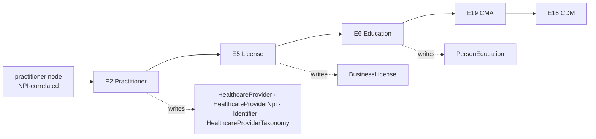
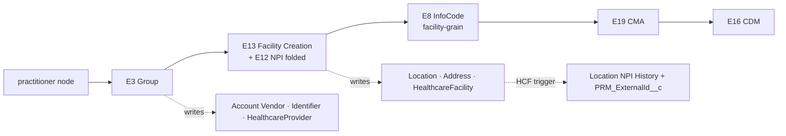
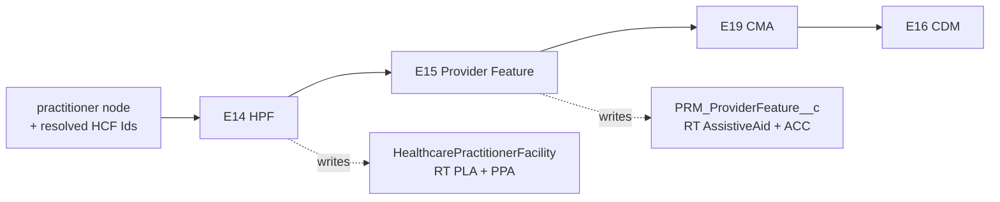
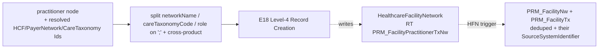

# Practitioner Creation — Target Service-Flow Architecture

> **Scope:** the **as-designed** end-to-end record-creation flow for **Practitioner Creation** on the new async framework — intake through Level-4 network creation. This is the *target* (Apex + metadata-driven async) flow, superseding the legacy OmniStudio chain in `docs/reference/PRM_PractitionerCreation_Apex_Service_Flow.md`.
> **Companion docs:** `PRM_IBC_HighVolume_TDD.md` (framework TDD), `PRM_Implementation_Plan.md` (§8.1 mapping), `Epic_C_Async_Framework.md` (orchestrator), `Epic_E_Practitioner_Services*.md` + `epic-e-services/**` (per-service + per-batch specs).
> **Grounding:** every service/RT/field/trigger below is org-validated (IBXDEV01) or DR-grounded per the linked service docs. **Nothing here is assumed** — open items are called out in §10.

---

## 1. Intake (synchronous) — two entry points

Practitioner Creation now has **two coexisting intake channels**, both producing the same `PRM_AsyncJob__c`:

| Channel | Use | Status |
|---|---|---|
| **LWC bulk upload** (`@AuraEnabled` Apex controller) | Upload a **JSON** file (multiple practitioners per submission). **CSV deferred** (not in pilot scope). | **new (this design)** |
| **OmniScript form + IP wrapper** | Existing single-flow entry | **stays as-is** (may migrate to the same async path later) |

**LWC intake sequence (fully synchronous, one transaction):**

```mermaid
sequenceDiagram
    autonumber
    participant U as User (Provider Ops)
    participant LWC as LWC (file upload)
    participant CTRL as Apex Controller (@AuraEnabled)
    participant VAL as PayloadValidator
    participant E1 as PRM_CaseService (E1)
    participant JOB as PRM_AsyncJob__c
    participant AO as PRM_AsyncOrchestrator
    U->>LWC: upload JSON (N practitioners)
    LWC->>CTRL: submit(file)
    CTRL->>CTRL: parse JSON → applications[]
    CTRL->>VAL: validate (fail-fast; nothing enqueued on error)
    CTRL->>E1: create Case Manager per practitioner (Account · Case · IndividualApplication)
    E1-->>CTRL: caseManagerIds (one per practitioner)
    CTRL->>JOB: insert PRM_AsyncJob__c (+ JSON as ContentVersion) + PRM_AsyncJobRecords__c per practitioner
    CTRL-->>LWC: { success, asyncJobId }
    JOB->>AO: (post-commit) PRM_AsyncOrchestrator.start(jobId)
    Note over AO: heavy record creation runs async (§3)
```

**Intake responsibilities (controller, sync):**
1. **Parse** the uploaded JSON → `applications[]` (canonical practitioner payload).
2. **Validate** synchronously (`PractitionerCreationPayloadValidator`, ported from `PRM_PractitionerCreationValidator`) — fail-fast; nothing is enqueued on error.
3. **E1 `PRM_CaseService`** (bulk): create **Account + Case + IndividualApplication** (= Case Manager) **per practitioner** — one bulk DML per object type + two back-link updates (circular FK).
4. **Insert** one `PRM_AsyncJob__c` (`ProcessName='Practitioner Creation'`) + the JSON as a **ContentVersion** payload + one `PRM_AsyncJobRecords__c` per practitioner (seeded with the Case Manager Id).
5. **Return** `{ success, asyncJobId }`. After commit, `PRM_AsyncOrchestrator.start(jobId)` kicks off the async chain.

> **⚠ Sync-intake limit note (§10 OQ-1):** with a fully synchronous controller, very large uploads run E1 + job insert in one transaction. Validate the upper bound (rows/practitioners) in the POC; an async parse/staging step is a **future option** if the sync ceiling is hit.

---

## 2. Async pipeline overview (halt-on-failure)

`PRM_AsyncOrchestrator` reads `PRM_AsyncJobConfig__mdt` (ordered by `PRM_Sequence__c`) and **invokes each batch class directly**; the chain **halts on the first failure** (later batches don't run; completed records remain; **manual retry resumes from the failed batch**).

```mermaid
flowchart TB
    JOB[(PRM_AsyncJob__c + JSON file)] --> REC[(PRM_AsyncJobRecords__c<br/>per practitioner = per Case Manager)]
    JOB --> AO[PRM_AsyncOrchestrator]
    AO --> DET[(PRM_AsyncJobDetails__c<br/>per batch step)]
    AO --> S1[seq 1 · PractitionerBatch E20]
    S1 --> S2[seq 2 · PracticeLocationAndGroupBatch E21]
    S2 --> S3[seq 3 · PLRelatedBatch E22]
    S3 --> S4[seq 4 · Level4RecordCreationBatch — PRM_Level4Batch E23]
    AO --> DLQ[(PRM_FailedRecordStaging__c — DLQ)]
    classDef b fill:#6366f1,color:#fff; class S1,S2,S3,S4 b;
```

**Batch conventions (all five):** constructor `(Id jobId, Id stepDetailId)`; `Database.Batchable<Object>, Database.Stateful`; **iteration unit = the practitioner node**; **NPI correlation** over `PRM_AsyncJobRecords__c` → `{accountId, practitionerId, caseManagerId}`; SOQL-free services (context batch-injected, per `prm-service-class-boundaries`); `finish()` → `statusUpdate` → `findNextJob`. Case Manager ↔ practitioner is **1:1**.

| Seq | Batch (class) | Grain / BatchSize | Services invoked (in order) |
|---|---|---|---|
| — | *(sync intake)* | per submission | **E1** `PRM_CaseService` |
| 1 | **PractitionerBatch** (`PRM_PractitionerBatch`, E20) | per practitioner · up to ~10 | **E2 → E5 → E6 → E19 (CMA) → E16 (CDM)** *(E7/E8/E10/E11 deferred — §8)* |
| 2 | **PracticeLocationAndGroupBatch** (`PRM_PracticeLocationAndGroupBatch`, E21) | per practitioner · **1** | **E3 → E13 (E12 folded) → E8 (facility) → E19 → E16** |
| 3 | **PLRelatedBatch** (`PRM_PLRelatedBatch`, E22) | per practitioner · **1** | **E14 → E15 → E19 → E16** *(E17 dropped)* |
| 4 | **Level4RecordCreationBatch** (`PRM_Level4Batch`, E23) | per practitioner · **1** | **E18** *(→ HFN trigger cascades FacilityNw + FacilityTx)* |

> **GroupRelatedBatch removed** — it had no defined scope; the pipeline is four contiguous stages.

---

## 3. Per-batch service flows

### 3.1 seq 1 — PractitionerBatch (E20) · the practitioner core



- **E2 `PRM_PractitionerService`** — HealthcareProvider, HealthcareProviderNpi, Identifier, HealthcareProviderTaxonomy *(E4 taxonomy merged in)*. Idempotency = **NPI-anchored `PRM_RecordKey__c`** upsert.
- **E5 `PRM_LicenseService`** (gated) — BusinessLicense; NPI-anchored `PRM_RecordKey__c`.
- **E6 `PRM_EducationService`** (gated) — PersonEducation; batch resolves `degreeId`/`institutionId` (by `PRM_DegreeCode__c` / Name) and injects them.
- **E19 `PRM_CMAService`** — one aggregated call: CMA rows for E2 (Identifier, Taxonomy) + E5 (BusinessLicense). *(Practitioner CMA created by E1 at intake.)*
- **E16 `PRM_CaseDataManagerService`** — runs **last**; one CDM manifest per Case Manager from **batch-supplied outcome tokens** `{created[], failed[]}` (always emits `PersonAccount`).
- **Deferred (until payload carries the data):** E7 BoardCertification, E8 (practitioner-grain) InfoCode, E10 ContactProfile, E11 Language.

### 3.2 seq 2 — PracticeLocationAndGroupBatch (E21) · group + location graph



- **E3 `PRM_GroupService`** — group/vendor Account (`HealthCloudGA__SourceSystemId__c = {taxId}-{groupName}`), Identifier (`PRM_RecordKey__c`), HealthcareProvider. **Must also set `Account.SourceSystemIdentifier`** (feeds the HCF composite — §5).
- **E13 `PRM_HealthcareFacilityCreationService`** — Location, Address, HealthcareFacility (E12 location-NPI logic folded in). **Gated on the HCF not already existing** (composite `PRM_ExternalId__c` pre-check via the shared `computeHcfExternalId` helper). ⚡ **HCF trigger** auto-creates the Location NPI History + populates `PRM_ExternalId__c`.
- **E8 `PRM_InfoCodeService`** (facility-grain, gated on `selectedInfoCodes`).
- **E19 CMA** — Vendor, Identifier, PracticeLocation, Practice_Location_Address. **E16 CDM** — group/location tokens.

### 3.3 seq 3 — PLRelatedBatch (E22) · affiliations + features



- Resolves each location's **HealthcareFacility Id** via the shared **`computeHcfExternalId`** + bulk query (§5).
- **E14 `PRM_HPFService`** — single service, **both RTs**: **PLA** (`PRM_PractitionerLocationAffiliation`, facility-linked, one per practitioner×location) + **PPA** (`PRM_PractitionerPracticeAffiliation`, Account-linked, facility blank, one per practitioner×group). Idempotency = pre-check natural key → insert misses.
- **E15 `PRM_ProviderFeatureService`** — single service, **two RTs**: **AssistiveAid** (`capabilitiesAtLocation`, label→code) + **AffirmingCareCategory / ACC** (`affirmingCareCategory`). Per-location; Id-based update-in-place.
- **E19 CMA** — `Practitioner_Practice_Location` (E14) + `Provider_Feature` (E15). **E16 CDM** — `HealthCarePractitionerFacility`, `ProviderFeature`.
- **E17 dropped** — the facility-grain network/taxonomy is a **trigger side-effect of seq 4** (see §3.4).

### 3.4 seq 4 — Level4RecordCreationBatch (PRM_Level4Batch, E23) · Level-4 network



- Batch resolves HCF Ids (`computeHcfExternalId`), `HealthcarePayerNetwork` Ids (by name), `CareTaxonomy` Ids (by code), and correlates `isPrimarySpecialty` from `practitioner.taxonomies[]`. **Splits `networkName`/`careTaxonomyCode`/`role` on `;` + cross-product** → one atomic row per combination.
- **E18 `PRM_Level4RecordCreationService`** — creates **only** the Level-4 `HealthcareFacilityNetwork` (RT `PRM_FacilityPractitionerTxNw`). Idempotency = deterministic Unique **`SourceSystemIdentifier = {practitionerId}_{healthcareFacilityId}_{payerNetworkId}_{careTaxonomyCode}_{role}`** + pre-check.
- ⚡ **HFN trigger** (`PRM_HealthcareFacilityNetworkTrigger`) cascades **`PRM_FacilityNw`** (Practice Location Network) + **`PRM_FacilityTx`** (Practice Location Taxonomy) — the former "E17" — and sets *their* `SourceSystemIdentifier`. Batch runs **bulk-context OFF** so the trigger fires; **BatchSize=1** to keep the cascade within governor limits.
- **No CMA/CDM** for this batch (decided).

---

## 4. Cross-cutting services

| Service | Object | Invoked by | Purpose |
|---|---|---|---|
| **E19 `PRM_CMAService`** | `PRM_CaseManagerAssociation__c` | E20, E21, E22 (aggregated, one call per chunk) | Junction linking each created record → its Case Manager, per record type. Idempotency = existence pre-check `(CaseManager + RT + primary lookup)`. RT→field-set map on `PRM_FormSubUtility.cmaFieldSets()`. |
| **E16 `PRM_CaseDataManagerService`** | `PRM_CaseDataManager__c` | E20 (insert), E21/E22 (update) | One manifest per Case Manager; batch-supplied **outcome tokens** (`created[]`→flag, `failed[]`→`*Exception__c`). Insert defaults 64 booleans false; later batches update only their flags. Identity = `PRM_CaseManager__c` (createable-only → split insert/update). |

> **Not CMA/CDM-tracked:** E18/E23 Level-4 records (decided). CMA RT `Practitioner_at_Practice_Location_Taxonomy_and_Network` remains defined but unused for now.

---

## 5. Shared utilities & reference-data resolution

- **`PRM_FormSubUtility.recordTypeId(SObjectType, devName)`** — cached RT-by-DeveloperName (replaces legacy `QUERY(...)`; **no** separate `PRM_RecordTypeUtil`).
- **`PRM_FormSubUtility.computeHcfExternalId(...)`** — the **single source of truth** for `HealthcareFacility.PRM_ExternalId__c` (the trigger's `populatePRMExternalId` composite: `Account.SourceSystemIdentifier - PRM_NpiId__c - PRM_PracticeClassification__c - addr1 - addr2 - zip - phone`). Used by **E13 (create/gate)** and **E22/E23 (lookup)** so the strings never drift. *(Requires E3 to populate `Account.SourceSystemIdentifier`.)*
- **`PRM_FormSubUtility.NameNormalize(...)`** — person-name title-casing.
- **`PRM_FormSubUtility.cmaFieldSets()`** — CMA RT → {primary, contextual} lookup map (E19).
- **NPI correlation** — each batch resolves `{accountId, practitionerId, caseManagerId}` from `PRM_AsyncJobRecords__c` by `individualNpi` (1:1 CM↔practitioner).

---

## 6. Idempotency summary (retry re-runs the whole chain)

| Service | Object(s) | Idempotency key / mechanism |
|---|---|---|
| E1 | Account/Case/IndividualApplication | intake-time (existing-NPI path via `id`); sync |
| E2 | HCP / HCPNpi / Identifier / Taxonomy | **`PRM_RecordKey__c`** (NPI-anchored, `_` delimiter) upsert; HCPNpi pre-check on `Npi` |
| E3 | Account(Vendor) / Identifier / HCP | Account `HealthCloudGA__SourceSystemId__c = {taxId}-{groupName}`; Identifier/HCP `PRM_RecordKey__c` |
| E5/E6/E7/E8/E10/E11 | license/edu/etc. | `PRM_RecordKey__c` (NPI-anchored) |
| E13 | Location/Address/HealthcareFacility | pre-check `HealthcareFacility.PRM_ExternalId__c` (composite via `computeHcfExternalId`); create only if new |
| E14 | HealthcarePractitionerFacility | pre-check PLA `(PractitionerId+HealthcareFacilityId+RT)` / PPA `(PractitionerId+AccountId+RT)` → insert misses |
| E15 | PRM_ProviderFeature__c | pre-check `(PRM_HealthcareFacility__c + RecordTypeId)` → update-in-place / insert |
| E16 | PRM_CaseDataManager__c | existence by `PRM_CaseManager__c` (one per CM) |
| E19 | PRM_CaseManagerAssociation__c | existence `(CaseManager + RT + primary lookup)` |
| E18 | HealthcareFacilityNetwork (TxNw) | Unique `SourceSystemIdentifier = {practitionerId}_{hfId}_{payerNetworkId}_{careTaxonomyCode}_{role}` + pre-check |

---

## 7. Trigger side-effects (owned by triggers, not services)

| Trigger | Fires on | Auto-creates / sets |
|---|---|---|
| `PRM_HCFacilityTriggerHelper` (HealthcareFacility) | E13 HCF insert | `PRM_HealthcareFacilityNPI__c` (Location NPI History) + `HealthcareFacility.PRM_ExternalId__c` |
| `PRM_HealthcareFacilityNetworkTrigger` → `PRM_HCFacilityNetworkTriggerHelper` (HealthcareFacilityNetwork) | E18 TxNw insert | `PRM_FacilityNw` + `PRM_FacilityTx` (deduped) + *their* `SourceSystemIdentifier` |

> Batches must run with **bulk-context OFF** (`PRM_TriggerContextControl.inBulkContext()` = false) where they rely on these cascades (E13, E18).

---

## 8. Service catalog — current state (removed / updated / added)

| # | Service | Status | Note |
|---|---|---|---|
| E1 | `PRM_CaseService` | **sync intake** | called by the LWC controller (+ OmniScript) |
| E2 | `PRM_PractitionerService` | active (seq 1) | E4 taxonomy merged in |
| E3 | `PRM_GroupService` | active (seq 2) | must set `Account.SourceSystemIdentifier` |
| ~~E4~~ | ~~`PRM_TaxonomyService`~~ | **removed** | merged into E2 |
| E5 | `PRM_LicenseService` | active (seq 1) | |
| E6 | `PRM_EducationService` | active (seq 1, gated) | batch resolves degree/institution Ids |
| E7 | `PRM_BoardCertificationService` | **deferred** | until payload carries `boardCertifications` |
| E8 | `PRM_InfoCodeService` | seq 1 (deferred) / seq 2 (facility) | practitioner-grain deferred; facility-grain in E21 |
| E9 | `PRM_FileService` | seq 2 (gated) | |
| E10 | `PRM_ContactService` | **deferred** | ContactProfile (not Contact) |
| E11 | `PRM_LanguageService` | **deferred** | ISO-code mapping |
| ~~E12~~ | ~~`PRM_HealthcareProviderNpiService`~~ | **folded into E13** | no separate service |
| E13 | `PRM_HealthcareFacilityCreationService` | active (seq 2) | in-batch (not async worker); does **not** invoke E14/E15 |
| E14 | `PRM_HPFService` | active (seq 3) | **single service, both RTs** (PLA + PPA) |
| E15 | `PRM_ProviderFeatureService` | active (seq 3) | **AssistiveAid + ACC** (was AsstAid-only) |
| E16 | `PRM_CaseDataManagerService` | active (all batches) | **outcome-token** model (was payload-presence) |
| ~~E17~~ | ~~`PRM_HealthcareFacilityNetworkService`~~ | **dropped** | trigger side-effect of E18 |
| E18 | `PRM_Level4RecordCreationService` | active (seq 4) | `HealthcareFacilityNetwork` RT `PRM_FacilityPractitionerTxNw` |
| E19 | `PRM_CMAService` | **added** (cross-cutting) | CMA junctions |
| E20 | `PRM_PractitionerBatch` | batch (seq 1) | |
| E21 | `PRM_PracticeLocationAndGroupBatch` | batch (seq 2) | |
| E22 | `PRM_PLRelatedBatch` | batch (seq 3) | |
| E23 | `PRM_Level4Batch` | batch (seq 4) | renamed from `PRM_Level4RecordCreationBatch` |

---

## 9. Failure & recovery

- **Intake (sync):** validation + E1 + job/records insert in one transaction — any failure ⇒ nothing enqueued (no orphan job).
- **Async chain:** each batch step = its own transaction; **halt-on-failure** — a `Failed` step stops the chain; completed steps' records **remain** (no compensating rollback). Failures → `PRM_FailedRecordStaging__c` (DLQ) + `PRM_ExceptionLogger`.
- **CDM records exceptions** — E16 sets `*Exception__c` for failed types so the manifest reflects partial success.
- **Retry:** **manual** from the progress LWC — re-runs the `Failed` step and **resumes** the chain (uncapped). Idempotent services (§6) make retry safe.

---

## 10. Open items (tracked)

- **OQ-1 — Sync-intake ceiling.** Fully-synchronous LWC intake (A3): validate the max practitioners/rows per upload before governor limits bite; async parse/staging is a future option.
- **OQ-2 — CSV support (deferred, A4).** CSV→canonical-JSON mapping (column template, nested groups/locations/networkTaxonomyRoles) — out of scope for the pilot.
- **OQ-4 — E3 `Account.SourceSystemIdentifier`.** Required for the shared `computeHcfExternalId` composite (E13/E22/E23).
- **OQ-5 — Deferred services** (E7/E8-practitioner/E10/E11) pending payload fields.
- **OQ-6 — Bulk-context guarantee** for E13/E18 (triggers must fire).
- **Per-service open items** live in each `epic-e-services/**` doc + execution plan.

---

> **Next:** fold these flows + the LWC intake into `PRM_IBC_HighVolume_TDD.md` (§4 layers, §5 diagrams, §6.1 producer, §11.4 catalog + mapping, §12 CL, §13) and `PRM_Implementation_Plan.md` §8.1.
