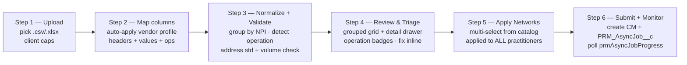
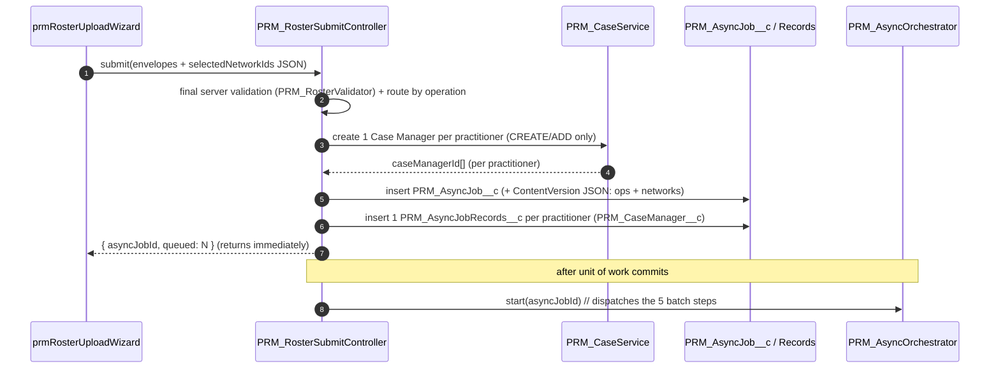
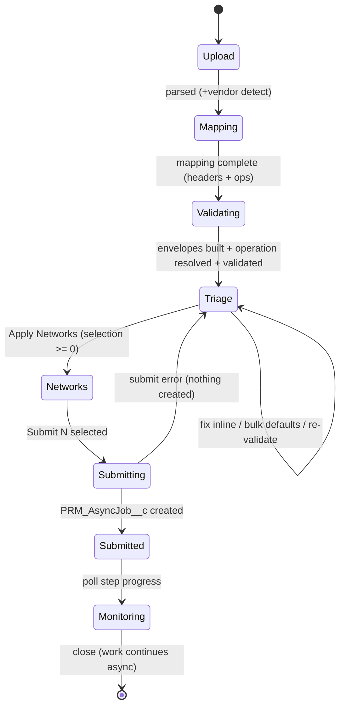

# Practitioner Roster Upload UI — End-to-End Design Plan

> **Status:** DESIGN (UI). Companion mockup: [`prmRosterUpload_Mockup.html`](prmRosterUpload_Mockup.html) (open in a browser; the wizard steps and triage tabs are clickable).
>
> **What this is:** the front-end design for ingesting **delegated practitioner vendor rosters** (Excel/CSV, many vendor layouts) and submitting them into the **async framework** described in this folder. The UI is a multi-step **wizard modal**: Upload → Map → Validate → Review/Triage → **Apply Networks** → Submit/Monitor.
>
> **A roster is not always "create".** Grounding against three real vendor files (Jeffcare, NovaCare, Cooper — §0) shows rosters carry **mixed operations**: create a new practitioner/group/location, **add** an existing practitioner to a location, **remove/terminate** an existing practitioner from a group/location, or **add to all** of a vendor's locations. The flow therefore models a **per-practitioner / per-location operation type** (§2A), not a single create path.
>
> **Two global, post-upload decisions** (not per-practitioner): (1) **network selection** — pick N networks from the catalog and apply them to **every** practitioner in the file (§6A); (2) confirmation of **ADD_TO_ALL_LOCATIONS volume** before fan-out (§5.3).
>
> **Backend (confirmed):** Submit does **not** loop the OmniStudio IP. It validates, calls `PRM_CaseService` to create one Case Manager (`IndividualApplication`) per practitioner (create/add operations), inserts **one `PRM_AsyncJob__c`** + **one `PRM_AsyncJobRecords__c` per practitioner** + a ContentVersion JSON payload (carrying each practitioner's operation + selected networks), and returns immediately. The five batch classes (`PractitionerBatch`, `PracticeLocationAndGroupBatch`, `GroupRelatedBatch`, `PLRelatedBatch`, `Level4RecordCreationBatch`) do the heavy work; progress is monitored via [`prmAsyncJobProgress`](../../requirements/Enhancements/practitionerCreation/prmAsyncJobProgress_Mockup.html) (Epic C5).

> **Companion / source docs:**
> - [`Epic_C_Async_Framework.md`](Epic_C_Async_Framework.md) — the async engine (`PRM_AsyncOrchestrator`, `prmAsyncJobProgress`, retry/halt-on-failure).
> - [`Epic_A_Environment_Setup.md`](Epic_A_Environment_Setup.md) — `PRM_AsyncJob__c` / `PRM_AsyncJobRecords__c` / `PRM_AsyncJobDetails__c` schema.
> - [`../../requirements/Enhancements/practitionerCreation/PractitionerCreation_FileUpload_DesignPlan.md`](../../requirements/Enhancements/practitionerCreation/PractitionerCreation_FileUpload_DesignPlan.md) — the canonical intake envelope (§5), vendor-mapping model, field mapping, and parsing decision. **This UI doc is the visual layer over that contract.**
> - `CLAUDE.md` (repo root) — the async-only execution model and object hierarchy.

---

## 0. Design grounding — three real vendor files

The design is grounded in **three** real delegated rosters that are deliberately different in shape and intent:

| File | Shape | Distinct practitioners | Dominant operation(s) | What it proves |
|---|---|---|---|---|
| **Jeffcare** (`...JUP.MAHC.vRad...xlsx`) | 97 cols × 64 rows | **17** (1 has **24** locations) | **Create** new practitioner / new group / add new location (`Comments` directive) | Wide+tall; must collapse to one row/practitioner + nested Locations sub-grid. |
| **NovaCare** (`...NovaCare IBC Providers...xlsx`) | 29 cols × 7 rows | **7** (all PT, taxonomy `225100000X`) | **Add to all locations** — every row = `ADD TO ALL LOCATIONS` for Group NPI `1043219934`, TIN `23-2736153` | A simple file can still explode in volume: one sentinel fans out to **all** the vendor's existing locations (§5.3). |
| **Cooper** (`Cooper_Enroll_Amerihealth...xlsx`) | 155 cols × 107 rows | **26** | **Mixed maintenance:** `add to location` ×54 / `remove from location` ×44 (+ data-quality flags) | A roster is **add AND remove**, against **existing** records referenced by internal IDs — not just create. |

### 0.1 Operation directives observed (drive §2A)
| File | Directive column(s) | Distinct values |
|---|---|---|
| Jeffcare | `Comments` | `Create new provider and link to group location #N` · `Create new provider, Add new address and link provider` · `Link provider to group location #N` · `Add new address and Link provider` |
| NovaCare | `Office Practice Name` adj. cell | `ADD TO ALL LOCATIONS` |
| Cooper | `IBX Comments` + `COMMENTS` | `add to location` / `remove from location` (+ `not listed at npi/address/location` data-quality flags); `add to the Group NPI <npi>` / `remove from group npi <npi>` (± `/ add|remove ... TIN <tin>`) |

> **Cooper reference IDs:** Cooper carries IBX **internal** identifiers — `Practitioner PIE` (10000…), `Practice Location` (30000…), `Vendor` (20000…) — or the sentinel **`create record`**. Add/remove rows point at *existing* records by these IDs; only `create record` rows go through the full creation chain. The adapter must treat these IDs as the resolution key (no NPI lookup needed when an ID is present).

### 0.2 Resolved org schema (verified in `ibx-dev`)
| Concept | Object | Key fields |
|---|---|---|
| Location | `HealthcareFacility` | `PRM_NpiId__r.Npi` (group NPI) |
| Practitioner↔location affiliation | `HealthcarePractitionerFacility` (HCPF) | `PractitionerId`, `HealthcareFacilityId`, **`TerminationRequestedById`** (← supports **remove/term**), `PRM_CaseManager__c` |
| Network membership | `HealthcareFacilityNetwork` (HFN) | `PayerNetworkId`, `PractitionerFacilityId`, `HealthcareFacilityId`, `PractitionerId`, `ProviderNetworkTierId`, `PRM_CaseManager__c` |
| Network catalog (the picker source) | `HealthcarePayerNetwork` | `Name` — **136 rows** in `ibx-dev` (e.g. "AmeriHealth HMO", "Independence PPO Medicare") |

**Headline:** at 100 practitioners with Jeffcare-like multiplicity a flat sheet is 400–600+ rows × ~100 columns. The UI MUST collapse to **one row per practitioner** with drill-in detail, and must surface **operation type** and **selected networks** as first-class concepts. These decisions drive the rest of this design.

---

## 1. UI surface & launch

- **Surface:** a **wizard modal** (`lightning-modal`, size `large` / full-width) hosted by an LWC `prmRosterUploadWizard`.
- **Launch points:**
  - A button **"Upload Roster"** on a PRM app page / Provider Network Management home.
  - A list-view / utility-bar action for credentialing operations.
- **Gating:** permission set `PRM_DelegatedRosterUpload` + a feature flag (custom permission `PRM_RosterUploadEnabled`). Delegated-only in v1.
- **Persistence across steps:** wizard state is held in the host component (`@track state`); the file is parsed client-side and never leaves the browser until Submit. PHI/PII (DOB, Medicare #, license #) is cleared on close/navigate-away.

---

## 2. The wizard flow



A persistent **progress indicator** (`lightning-progress-indicator`, path variant) sits at the top of the modal showing the **6** steps. Footer has **Back / Cancel** (left) and the primary action (right) whose label changes per step (`Next` → `Validate` → `Review` → `Apply Networks` → `Submit N Practitioners`).

---

## 2A. Operation-type model (the cross-cutting concept)

Every practitioner — and within a practitioner, every location row — carries an **operation** resolved from the vendor's directive column(s) via the mapping profile's `operationRules`. The operation determines validation, UI affordances, and backend routing.

| Operation | Source directive (examples) | What it means | Backend routing | Needs CM? |
|---|---|---|---|---|
| `CREATE` | "Create new provider…", Cooper `create record` | New practitioner + (optionally) new group/location | Full creation chain: `PRM_CaseService` → `PractitionerBatch` → … | Yes |
| `ADD_TO_LOCATION` | "Link provider to group location #N", Cooper "add to location" | Existing practitioner gains an affiliation at an existing/new location | `PracticeLocationAndGroupBatch` / `PLRelatedBatch` (affiliation only) | Yes (or reuse existing) |
| `ADD_TO_ALL_LOCATIONS` | NovaCare "ADD TO ALL LOCATIONS" | Affiliate practitioner to **every** active location of a vendor (group NPI + TIN) | Resolve location set (§5.3) → fan out as `ADD_TO_LOCATION` per facility | Yes |
| `REMOVE_FROM_LOCATION` / `TERM` | Cooper "remove from location", "remove from group npi <npi>" | End the practitioner's affiliation (and its network memberships) at a group/location | Set `HealthcarePractitionerFacility.TerminationRequestedBy` + termination date; end-date related `HealthcareFacilityNetwork` | No (operates on existing) |

**Resolution order per row:**
1. If a vendor reference ID is present (Cooper `Practitioner PIE` / `Practice Location` / `Vendor`, and not `create record`) → operate on that **existing** record.
2. Else resolve by NPI/TIN (vendor de-dup via `PRM_IPUtility`), and if no active match for an add → treat as `CREATE`.
3. The directive column maps the verb (add vs remove vs create).

**UI consequences:** the triage grid shows an **Operation** column + filter; remove/term rows are visually distinct (red accent) and **skip** the create-only fieldsets; the Networks step (§6A) applies only to `CREATE`/`ADD*` operations (removes ignore it). Mixed-operation files (Cooper) are fully supported in one upload.

---

## 3. Step 1 — Upload

**Goal:** get the file into the browser, parse it, detect the vendor.

| Element | Detail |
|---|---|
| Drop zone | `lightning-file-upload`-style drag/drop + "Browse" (custom; we parse client-side, not via `ContentDocument` yet). Accept `.csv`, `.xlsx`, `.xls`. |
| Template links | "Download IBX Roster Template" (CSV + XLSX) — the zero-mapping fast path. |
| Client caps | ≤ **200 practitioners** (post-grouping) / ≤ **5 MB** / **first sheet only**. Enforced before parse; over-cap → blocking inline error. |
| Parse | CSV → PapaParse; native XLSX → pinned SheetJS CE from a Static Resource (see PractitionerCreation_FileUpload_DesignPlan.md §7). Parsing shows a spinner ("Reading <filename>…"). |
| Sheet picker | If a workbook has multiple sheets, show a `lightning-combobox` to choose; default = first non-empty. |
| Vendor detect | After parse, hash the header row and match against `PRM_VendorRosterMapping__mdt` signatures. Show a banner: **"Recognized vendor: Jeffcare/JUP — mapping profile will auto-apply"** or **"New layout — you'll map columns next"**. |

**States:** Idle → Reading → Parsed (preview first 5 rows in a read-only mini-table) → error (bad file / over cap / empty sheet).

**Exit criteria:** a parsed 2-D array (`headers[]`, `rows[][]`), `detectedVendorProfile` (or null), and `sourceFileMeta`.

---

## 4. Step 2 — Map columns (per-vendor mapping UI)

**Goal:** translate arbitrary vendor headers → canonical fields. Heterogeneity becomes a one-time-per-vendor config task.

- **Known vendor (profile found):** the mapping is pre-filled and the step is shown **collapsed/confirm-only** ("18 of 18 columns mapped from saved profile — Review or Continue"). Zero-touch unless the analyst expands it.
- **New vendor:** the mapper LWC `prmRosterColumnMapper` renders a two-column matcher:

```
┌ Vendor column ───────────┐   ┌ Canonical field ─────────────────────────┐
│ "Prov First"             │ → │ Practitioner ▸ First Name        [combo]  │
│ "Provider NPI #"         │ → │ NPI ▸ Individual NPI             [combo]  │
│ "Comments"               │ → │ Locations ▸ Action directive    [combo]  │
│ "PA Medical License #"   │ → │ Licenses ▸ License # (PA, Medical)[combo]│
│ … (unmapped highlighted) │   │ … "Do not import" option available        │
└──────────────────────────┘   └───────────────────────────────────────────┘
```

| Sub-feature | Detail |
|---|---|
| Auto-suggest | Fuzzy header match proposes the canonical target; analyst confirms/overrides. |
| Value rules | Per field: Gender `M`→`Male`/`F`→`Female`; date format; blank-token list (e.g. `"No BSPA number found"`→null). Edited in a small "Rules" popover per mapped field. |
| Structure rules | How the file encodes N locations: `ONE_ROW_PER_LOCATION` (Jeffcare), `WIDE_COLUMNS`, `ADD_TO_ALL_LOCATIONS` (NovaCare), `SINGLE`. The directive vocabulary is captured here. |
| **Operation rules** | Map the vendor's directive column(s) → operation (§2A): which phrases mean `CREATE` / `ADD_TO_LOCATION` / `ADD_TO_ALL_LOCATIONS` / `REMOVE_FROM_LOCATION`. Cooper needs **two** directive columns mapped (`IBX Comments` for the verb, `COMMENTS` for the group-NPI/TIN target). |
| **Reference-ID rules** | Mark which columns are IBX internal IDs (Cooper `Practitioner PIE` / `Practice Location` / `Vendor`) and the `create record` sentinel. When present, the row resolves to existing records by ID instead of NPI lookup. |
| Defaults | Constant fields the vendor never supplies (e.g. `FormType`, `PractitionerCreationType = Delegated Credentialing`). |
| Save profile | **"Save mapping as profile"** → persists to `PRM_VendorRosterMapping__mdt` (or business-editable custom object). Auto-applies on every future upload of that layout. |
| Unmapped guard | Required-but-unmapped canonical fields **and** an unmapped operation/structure rule block "Continue" with a clear list. |

**Exit criteria:** a complete mapping (`headerAliases`, `valueRules`, `structureRules`, `operationRules`, `referenceIdRules`, `defaults`).

---

## 5. Step 3 — Normalize + Validate

**Goal:** turn mapped rows into the **canonical envelope per practitioner**, resolve the **operation**, then check them. No records are created here.

1. **Group** source rows by **Individual NPI** (or vendor reference ID). 64 Jeffcare rows → 17 practitioner envelopes; each practitioner's multiple rows become its `Locations[]` (each location carrying its own operation).
2. **Resolve operation** per row/location (§2A) from the directive + reference-ID rules.
3. **Normalize** (deterministic, testable): trim, title-case names, gender map, multi-format date parse, phone format, NPI/Tax-ID digit checks, BSPA blanking, info-code split.
4. **Build envelope** (`PRM_RosterEnvelopeBuilder`) matching the IP contract in PractitionerCreation_FileUpload_DesignPlan.md §5 (`RecordsToUpdate`, `PractionerGroup`, `locationsToUpsert`), now tagged with `operation` per practitioner/location.
5. **Validate** — two tiers:
   - **Client (instant):** required present, NPI 10-digit, dates parseable, gender in set, tax-id format, **duplicate NPI within file**, directive→operation resolvable.
   - **Server (`PRM_RosterValidator`, bulk):** existing-account dedup (`PRM_ExistingAccountService`), taxonomy resolves (`CareTaxonomy`), vendor/group resolves (`PRM_IPUtility`), effective-date rules (`PRM_PractitionerCreationValidator`), **address standardization + existing-location match** (§5.2), **`ADD_TO_ALL_LOCATIONS` volume resolution** (§5.3), and for remove/term: confirm the target affiliation actually exists.

This step shows a **progress/spinner** with a live count ("Validating 17 practitioners…") then auto-advances to Step 4. Each practitioner gets a roll-up severity: **Ready / Warning / Error**.

### 5.2 Address standardization & existing-location match (server-side — answers the Jeffcare question)

**Where:** the **Apex/server layer, not the UI.** The UI never standardizes addresses or queries facilities directly; it only renders the per-location outcome returned by `PRM_RosterValidator`. Rationale: Precisely is a governed callout (batch limits, keys), facility matching is bulk SOQL, and both must be testable and reused by the async batches — none of that belongs in client JS.

**How (inside `PRM_RosterValidator`, bulk, during Step 3):**
1. For every location address in the file, call **`PRM_AddressValidationService`** (Precisely, batchable) to produce a **standardized** address (normalized line/city/state/ZIP+4). Respect Precisely batch limits; chunk if needed.
2. Resolve the vendor/group (`PRM_IPUtility.VendorAndHCFWithNPI` / `…WithTaxId`) and pull its existing locations.
3. **Match** each standardized address against existing `HealthcareFacility` for that vendor (standardized-address equality, then NPI+TIN+ZIP fallback). Classify each location as:
   - **Matched existing** → reuse the facility Id (no new location created; affiliation only).
   - **New address** → will create a new `HealthcareFacility` (the "Add new address" directive).
   - **Ambiguous** → warning; analyst confirms in triage.
4. Return per-location `{standardizedAddress, matchStatus, facilityId?}`.

**UI surface:** each row in the Locations sub-grid (§6.2 FS9) shows a badge — **Matched** / **New address** / **Ambiguous** — plus the standardized address as a tooltip/secondary line. This is display-only; the decision logic is server-side.

> The same standardization runs again (idempotently) inside `PracticeLocationAndGroupBatch` at creation time, so a stale match from validation cannot create a duplicate.

### 5.3 `ADD_TO_ALL_LOCATIONS` volume check (answers the NovaCare question)

When a practitioner's operation is `ADD_TO_ALL_LOCATIONS` (NovaCare), the fan-out size is unknown from the file alone. `PRM_RosterValidator` resolves it **server-side** and returns the count so the analyst sees the blast radius **before** submit:

```sql
-- Locations for the group (NovaCare: Group NPI 1043219934, TIN 23-2736153)
SELECT COUNT() FROM HealthcareFacility
WHERE PRM_NpiId__r.Npi = :groupNpi            -- + TIN/active filters as available

-- (or, reuse the existing Apex helper)
PRM_IPUtility.VendorPracLocations(groupNpi, taxId)
```

The triage row for that practitioner shows **"Add to all locations → N facilities"** (e.g. *"7 practitioners × N locations = M affiliations"*), and a banner warns if `practitioners × locations` would exceed a configured threshold so the analyst can split the file. (In `ibx-dev` the NovaCare prod group NPI returns 0 — production data isn't loaded — but the query pattern is what the validator uses.)

---

## 6. Step 4 — Review & Triage (the heart of the UI)

This is the answer to *"100 practitioners — showing all fields is UI-heavy."* We use a **grouped master-detail** layout.

### 6.1 Master: grouped triage grid (one row per practitioner)

```
Status tabs:    [ All 17 ] [ Errors 3 ] [ Warnings 5 ] [ Ready 9 ]          🔍 search
Operation tabs: [ Create 11 ] [ Add 4 ] [ Add-to-all 0 ] [ Remove/Term 2 ]

┌─┬──────────┬──────────────┬──────────────────┬──────────────┬────────────┬──────┬──────┬──────────┐
│☑│ Status   │ Operation    │ Practitioner     │ Individual NPI│ Specialty  │ Locs │ Iss. │ Action   │
├─┼──────────┼──────────────┼──────────────────┼──────────────┼────────────┼──────┼──────┼──────────┤
│☑│ ● Error  │ ＋ Create    │ Aarti Agarwal    │ 1144883521   │ ENT        │  3   │ 2    │ Review ▸ │
│☑│ ▲ Warning│ ＋ Create    │ Jessica De Sabato│ 1639675168   │ Radiology  │ 24   │ 1    │ Review ▸ │
│☑│ ✓ Ready  │ ⇄ Add        │ Michael Kimball  │ 1306160338   │ Surgery    │  1   │ 0    │ Review ▸ │
│☑│ ✓ Ready  │ ✖ Remove/Term│ Thomas Grookett  │ 1033356027   │ Int. Med   │  2   │ 0    │ Review ▸ │
└─┴──────────┴──────────────┴──────────────────┴──────────────┴────────────┴──────┴──────┴──────────┘
                                       [ Showing 1–17 of 17 ]  ‹ 1 ›
```

A second **Operation** tab row filters by `CREATE` / `ADD` / `ADD_TO_ALL` / `REMOVE_TERM` (Cooper's mixed file lands rows in multiple buckets). Remove/Term rows render with a red accent and a leaner detail drawer (no create-only fieldsets).

| Column | Source |
|---|---|
| Select | bulk-action checkbox |
| Status | roll-up severity badge (Error / Warning / Ready) — same badge styling as `prmAsyncJobProgress` |
| Operation | resolved operation (§2A): Create / Add / Add-to-all / Remove-Term — icon + label |
| Practitioner | First + Last (title-cased) |
| Individual NPI | `HCPNPI` |
| Specialty | primary `HCPTaxonomy.Name` |
| Locs | count of `Locations[]` (links into the detail's Locations sub-grid) |
| Issues | count of validation messages |
| Action | "Review ▸" opens the detail drawer |

- **Paginated/virtualized** (`lightning-datatable` or custom) for 100+; tabs mirror `prmAsyncJobProgress` (All / Errors / Warnings / Ready).
- **Bulk edit:** select rows → "Apply defaults" applies shared values (Form Type, Effective From/To, Credentialing Committee) across the selection — the antidote to per-row tedium.
- **NPI link-vs-create:** when the server finds an existing match, the row exposes a first-class control (Create new ⟷ Link to existing); default = create new unless an active match exists.

### 6.2 Detail: per-practitioner drawer (accordion fieldsets)

Clicking "Review ▸" slides in a drawer (right) / or full-width detail for narrow screens. Fields are organized into **collapsible fieldset accordions**. **Progressive disclosure rules:**

- Sections with an error/warning **auto-expand**; clean sections start **collapsed**.
- A **"Show all fields"** toggle reveals empty optional fields (hidden by default to cut noise).
- Required-but-missing fields are **always shown and highlighted** regardless of toggle.
- A sticky header shows name + NPI + status + "Issues (N)" jump list.

**The 10 fieldsets** (field → canonical envelope path → Excel column):

#### FS1 · Practitioner Identity
| Field | Envelope path | Excel column |
|---|---|---|
| First Name | `RecordsToUpdate.PractionerDetails.FirstName` | First Name |
| Middle Name | `…PractionerDetails.MiddleName` | MI |
| Last Name | `…PractionerDetails.LastName` | Last Name |
| Suffix | `…PractionerDetails.Suffix` | Suffix |
| Title / Degree | `…PractionerDetails` (display) | Title |
| DOB | `…PractionerDetails.DOB` | DOB |
| Gender Identity | `…PractionerDetails.PersonGenderIdentity` | Gender (M→Male/F→Female) |
| Email | `…PractionerDetails.PersonEmail` | (vendor/optional) |
| Provider Role | `…PractionerDetails.PRM_ProviderRole__c` | PCP/SPC |

#### FS2 · NPI, Specialties & Taxonomy
| Field | Envelope path | Excel column |
|---|---|---|
| Individual NPI | `RecordsToUpdate.HCPNPI` | Provider NPI # |
| Provider BSPA | (vendor ref) | Provider BSPA |
| IBC Provider # | (vendor ref) | IBC Prov # |
| Primary Taxonomy | `RecordsToUpdate.HCPTaxonomy` (Id + "Name - Code") | Specialty |
| Additional Specialties | `RecordsToUpdate.AdditionalSpecialties[]` / `practitionerTaxNtwk[]` | Specialty (per-location) |
| Provider Type | `RecordsToUpdate.ProviderType` | (Title-derived / default) |

#### FS3 · Licenses & DEA/CDS (multi-state → arrays)
Rendered as a sub-table; one row per license/registration, with **State** + **Type** columns so the multi-state Jeffcare layout collapses cleanly.

| Field | Envelope path | Excel column |
|---|---|---|
| License # / State / Type / Exp | `RecordsToUpdate.AddLicenseBlock[]` | PA Medical License # / Exp; PA Dental License # / Exp; NJ Medical License # / Exp |
| DEA/CDS # / State / Type | `RecordsToUpdate.AddDEACDSBlock[]` | PA DEA # / Exp; NJ DEA # / Exp; NJ CDS # / Exp |

#### FS4 · Board Certifications
| Field | Envelope path | Excel column |
|---|---|---|
| Cert Name / Type / Issue / Exp | `RecordsToUpdate.AddBoardCertificationBlock[]` | Board Certified 1/2, Board Specialty 1/2, Board Issue Date, Board Exp |

#### FS5 · Education & Training (sub-table)
| Field | Envelope path | Excel column |
|---|---|---|
| Degrees / Schools / Grad | `RecordsToUpdate.AddEducation[]` | Medical School/Degree/Graduation Date; Dental School…; University… |
| Internship / Residency / Fellowship | `RecordsToUpdate.AddEducation[]` (type-coded) | Internship 1/2, Residency 1/2, Fellowship 1/2 (+ Position/From/To) |
| Primary Affiliation Hospital | (display / provider info) | Primary Affiliation Hospital, PRIMTOP |

#### FS6 · Identifiers
| Field | Envelope path | Excel column |
|---|---|---|
| Medicare Number | `RecordsToUpdate.Identifiers[Type=Medicare Number]` | (vendor/optional) |
| FHNatic Case # | `RecordsToUpdate.IndividualApplication.PRM_FHNaticCaseNumber__c` | (vendor/optional) |

#### FS7 · Provider Information (rarely in file → defaults/post-upload)
| Field | Envelope path |
|---|---|
| Race / Cultural / Hispanic / Affirming / Languages / Pronouns | `RecordsToUpdate.ProviderInformation*` |

#### FS8 · Group / Vendor
| Field | Envelope path | Excel column |
|---|---|---|
| Group NPI | `PractionerGroup.GroupNPI` | Group NPI # |
| Group BSPA | (vendor ref) | Group BSPA |
| Tax ID | `PractionerGroup.GroupTaxId` | Tax ID # |
| Address Group Name | (location grouping) | Address Group Name |

#### FS9 · Locations (nested sub-grid — the multi-row collapse)
The N source rows for this practitioner render as a sub-grid. Each location row carries its **operation** (from the directive) and its **address-match status** (from §5.2).

| Sub-column | Envelope path | Excel column |
|---|---|---|
| Operation | `Locations[].operation` | Comments / IBX Comments (`Create`/`Add`/`Remove`) |
| Address match | `Locations[].matchStatus` (server, §5.2) | — (Matched / New address / Ambiguous badge) |
| Action | `Locations[].action` | Comments (`Create…`/`Link…`/`Add new address…`) |
| Effective Date | `Locations[].effectiveDate` | Effective Date |
| Address / Suite | `Locations[].address` | Address, Bldg./Suite/Floor |
| City / State / Zip | `Locations[].city/state/zip` | City, State, Zip Code |
| Phone / Fax | `Locations[].phone/fax` | Phone, Fax |
| Accessibility / Transit / Age Limits | `Locations[].*` | Handicapped Accessible, Public Transportation Access, Age Limits |
| Billing | `Locations[].billing*` | Billing Name/Address/City State Zip/Office Phone |
| Dept / Section · Specialty · PCP/SPC | `Locations[].*` | Department/Section, Specialty, PCP/SPC |

#### FS10 · Application / Case (system-set — read-only)
| Field | Envelope path | Excel column |
|---|---|---|
| Corporate Receipt Date | `IndividualApplication.PRM_CorporateReceiptDate__c` | (Email Rec. / vendor) |
| Form Type | `IndividualApplication.PRM_FormType__c` | default |
| Effective From / To | `RecordsToUpdate.EffectiveFrom` / `EffectiveTo` | Effective Date / IBC Confirmed Eff Date |
| Initial Cred / Next Recred | (display) | Initial Credentialing Date, Next Recredentialing Date |
| Credentialing Committee | (display) | Credentialing Committee |
| Application/Case defaults | `IndividualApplication.*` / `Case.*` | system-set (Status, RecordType, Stage, Type) |

> System-set values (`PRM_CredentialingStatus__c`, Case/IA defaults, `AppliedDate`, `IsRecordActive`) are stamped by the builder/IP and are **read-only** in the UI.

### 6.3 Inline editing & issue resolution
- Cells with issues show an inline error icon + message; fix inline → severity re-evaluates live.
- "Issues (N)" jump list in the drawer header navigates field-to-field.
- Edits are deterministic-revalidated client-side; server re-validation re-runs on demand ("Re-validate").

**Exit criteria:** at least one **Ready** practitioner selected; the primary button reads **"Apply Networks"** (advances to Step 5). Error rows are excluded from submit but remain for fixing.

---

## 6A. Step 5 — Apply Networks (global, not per-practitioner)

**Goal (the requested capability):** let the analyst pick the **networks** to enroll once, and apply that selection to **every** practitioner in the file. This is a **global** choice — you do **not** pick networks per practitioner.

| Element | Detail |
|---|---|
| Source catalog | `HealthcarePayerNetwork` (verified: **136** records in `ibx-dev`, e.g. "AmeriHealth HMO", "Independence PPO Medicare", "Amerihealth PPO"). |
| Picker | A **dual-listbox / multi-select** (`lightning-dual-listbox`) — search the catalog, move chosen networks to "Selected". E.g. select 10 → applied to all 14 submitting practitioners. |
| Scope note | A persistent banner: **"These N networks will be applied to all M practitioners (CREATE + ADD operations). Remove/Term rows are excluded."** |
| Optional per-network attrs | If business needs tier/contract, expose `ProviderNetworkTier` / effective date per selected network (v1 may default these). |
| Saved presets | Optionally save a named network set (e.g. "AmeriHealth standard 10") to reapply on future uploads — mirrors the mapping-profile pattern. |

**What it produces:** the wizard stamps `selectedNetworkIds[]` (+ optional tier/effective) onto the submission. The async chain (`PLRelatedBatch` → E17 FacilityNetwork / E18) creates one **`HealthcareFacilityNetwork`** per **practitioner × facility × selected network** (`PayerNetworkId` = each selected network, `PractitionerFacilityId` = the created/affiliated HCPF). This is the high-volume target already in the framework (CLAUDE.md A7) — so volume guidance from §5.3 compounds here (practitioners × locations × networks); show the projected total.

**Operation interaction:**
- `CREATE` / `ADD_TO_LOCATION` / `ADD_TO_ALL_LOCATIONS` → networks applied.
- `REMOVE_FROM_LOCATION` / `TERM` → networks **ignored** (those rows end existing memberships instead).

**Exit criteria:** zero or more networks selected (zero allowed with a confirm — "No networks selected; affiliations created without network membership"). Primary button → **"Submit N Practitioners"**.

---

## 7. Step 6 — Submit + Monitor (async checks)

### 7.1 What Submit does (sync, fast)


**Routing by operation (§2A):** the submission JSON carries each practitioner/location `operation` + the global `selectedNetworkIds`. The batch chain branches: `CREATE`/`ADD*` flow through creation + affiliation + `HealthcareFacilityNetwork` (one per practitioner × facility × selected network); `REMOVE_FROM_LOCATION`/`TERM` instead set `HealthcarePractitionerFacility.TerminationRequestedBy` + end-date the related `HealthcareFacilityNetwork` (no CM, no network add). Mixed files run all branches in one job.

The modal flips to a **Submitted panel**: success banner, **Async Job** link (`AJ-…`), queued count broken down by operation (created / added / removed), the selected-network count, and a per-practitioner mini-list with each new **Case Manager** (`IA-…`) link.

### 7.2 In-wizard progress panel
A compact monitor inside Step 6 (subset of `prmAsyncJobProgress`):
- Overall multi-segment progress bar (Completed / Running / Failed / Queued) for the job's **batch steps** (`PRM_AsyncJobDetails__c`).
- Status tabs (All / Failed / Queued / Completed / Running).
- **Manual Refresh** (`refreshApex`) — no streaming; finish arrives via the `PRM_AsyncJobNotification` Custom Notification bell.
- **Retry** on a failed step → `PRM_AsyncOrchestrator.retry(detailIds)` (manual, uncapped, resumes the chain from the failed step; halt-on-failure semantics).

### 7.3 Full monitoring surface
The full [`prmAsyncJobProgress`](Epic_C_Async_Framework.md) component lives on each **`IndividualApplication`** record page (Epic C5). It resolves `PRM_AsyncJobRecords__c WHERE PRM_CaseManager__c = :recordId` → parent Job → step details (+ DLQ errors).

> **Schema note / small addition:** the existing `PRM_AsyncJobProgressController.getProgress` is keyed by **`caseManagerId`**. The in-wizard panel needs an **`AsyncJobId`-keyed** overload (`getProgressByJob(Id asyncJobId)`) returning the same `ProgressDTO` for the whole roster submission. This is the only backend addition this UI requires; flag for Epic C.

---

## 8. UI state model



---

## 9. Component & config inventory

**New LWC**
| Component | Role |
|---|---|
| `prmRosterUploadWizard` | Modal host; owns wizard state + step routing (6 steps). |
| `prmRosterUpload` | Step 1 file pick + client parse + vendor detect. |
| `prmRosterColumnMapper` | Step 2 mapping UI (headers + values + **operation/structure/reference-ID rules**); save profile. |
| `prmRosterGrid` | Step 4 grouped triage grid (one row/practitioner) + status & **operation** tabs + bulk. |
| `prmRosterDetail` | Step 4 detail drawer with accordion fieldsets + Locations sub-grid (operation + address-match badges). |
| `prmRosterNetworkPicker` | **Step 5** global network multi-select (`HealthcarePayerNetwork`) applied to all practitioners. |
| `prmRosterSubmitMonitor` | Step 6 submitted panel + compact progress (or embed `prmAsyncJobProgress`). |

**New / reused Apex**
| Class | Role |
|---|---|
| `PRM_RosterEnvelopeBuilder` | Mapped rows → canonical envelope per practitioner, tagged with `operation` per practitioner/location. |
| `PRM_RosterValidator` | Deterministic bulk validation incl. **address standardization** (`PRM_AddressValidationService`) + existing-facility match (§5.2) and **`ADD_TO_ALL_LOCATIONS` volume** (§5.3); reuses `PRM_ExistingAccountService`, `PRM_PractitionerCreationValidator`, `PRM_IPUtility`. |
| `PRM_RosterNetworkController` | `getNetworks()` → `HealthcarePayerNetwork` catalog for the picker (cacheable, FLS-enforced). |
| `PRM_RosterSubmitController` | `submit(envelopes, selectedNetworkIds)`: validate → route by operation → `PRM_CaseService` (CREATE/ADD) → insert `PRM_AsyncJob__c`/`PRM_AsyncJobRecords__c` + JSON → `PRM_AsyncOrchestrator.start`. |
| `PRM_AsyncJobProgressController` | **Add** `getProgressByJob(Id asyncJobId)` for the in-wizard panel. |

**Config / metadata**
- `PRM_VendorRosterMapping__mdt` (or business-editable custom object) — per-vendor mapping profiles (now incl. operation/reference-ID rules).
- Static Resources: `PRM_RosterTemplateCSV` (+ XLSX), optional pinned `PRM_SheetJS`.
- Permission set `PRM_DelegatedRosterUpload` (+ read on `HealthcarePayerNetwork` / write on `HealthcareFacilityNetwork`, `HealthcarePractitionerFacility`) + feature flag custom permission.

---

## 10. Accessibility & responsive
- Semantic `<fieldset>`/`<legend>` per accordion section; `aria-expanded` on accordion toggles; `aria-label` on icon-only actions; status conveyed by **icon + text**, not color alone.
- Keyboard: full tab order through grid → drawer → fieldsets; `Esc` closes drawer (not the modal).
- Responsive: drawer becomes a full-screen detail on tablet/phone; stat/summary cards reflow 6→3→2; tables scroll horizontally (mirrors `prmAsyncJobProgress.css`).

## 11. Security
| Concern | Mitigation |
|---|---|
| FLS/CRUD | Controllers `with sharing`, `WITH USER_MODE`/`SECURITY_ENFORCED`; reuse services that already enforce access. |
| File DoS | Client caps (200 practitioners / 5 MB / first sheet). |
| SheetJS prototype pollution | Pinned patched CDN build only (Static Resource). |
| PHI/PII | Held in client state only for the session; cleared on close; no third-party calls in v1. |
| Access | Permission set + feature flag; delegated-only. |

## 12. Open items (carry to build)
1. `getProgressByJob(Id asyncJobId)` controller addition (Epic C).
2. Required-vs-defaulted column set per business (esp. Provider Info, Board Certs, DEA/CDS).
3. NPI link-vs-create default policy + who may override.
4. Native XLSX at launch vs CSV-template-only v1 (recommend CSV-only v1; SheetJS behind a flag).
5. Per-practitioner supporting documents (`FileData`) — deferred to the Case Manager post-creation in v1.
6. **Remove/Term semantics:** confirm the exact term contract — `HealthcarePractitionerFacility.TerminationRequestedBy` + which date/status field; whether related `HealthcareFacilityNetwork` rows are deleted vs end-dated; and whether remove requires the same approval as create. The five-batch chain may need a dedicated remove/term step or a branch inside `PLRelatedBatch`.
7. **Network selection scope:** confirm networks are truly global per upload (not per group/operation), default tier/contract values, and whether `ProviderNetworkTier`/effective dates are needed in v1.
8. **`ADD_TO_ALL_LOCATIONS` threshold:** the practitioners × locations × networks ceiling that triggers a "split the file" warning (governor/volume sizing).
9. **Address-match confidence:** the standardized-address equality rule + the ambiguous-match threshold that forces analyst confirmation (§5.2).
