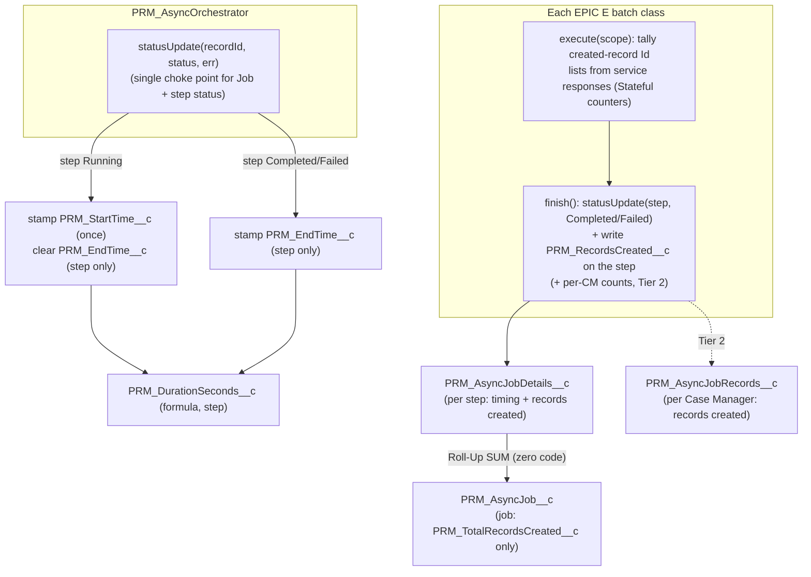
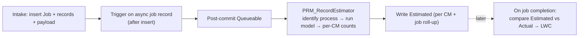

# Epic G — Telemetry Info (Implementation Guide)

> **Parent:** `PRM_IBC_HighVolume_TDD.md` (§9 Observability & Monitoring) · `Epic_C_Async_Framework.md` · `Epic_A_Environment_Setup.md` (authoritative schema)
> **Goal:** add **lightweight, additive telemetry** to the async framework — **records created** (Job / step / Case Manager) and **batch processing time** (**per step**) — captured at points that already exist so the change to the built pipeline is minimal. Fills the TDD §9 gap ("time-to-complete", per-step counts) that the current metadata does **not** carry.
>
> **Kept simple (scope decision):** batch processing time is tracked **at the step grain only** (`PRM_AsyncJobDetails__c`). The job-level timing fields (`PRM_StartTime__c`/`PRM_EndTime__c`/`PRM_DurationSeconds__c` on `PRM_AsyncJob__c`) are **out of scope** — a job's elapsed time can be read from its steps' timestamps when needed. Job level keeps only the `PRM_TotalRecordsCreated__c` roll-up.
> **Estimate:** ~2.0 engineer-days (Tier 1, incl. dashboard LWC) · +0.5 d (Tier 2 per-Case-Manager) · **Depends on:** Epic A (async objects), Epic C (`PRM_AsyncOrchestrator` + `prmAsyncJobProgress` LWC), Epic E (the four batch classes). · **Blocks:** nothing (purely additive).

> **⚠ Scope guard:** this is **telemetry only**. It does **not** change the halt-on-failure chain, idempotency, DLQ semantics, notifications, or the intake contract. Every new field is nullable and every code touch is additive. If any part would alter execution semantics, stop and re-scope.

> **Design principle — capture where the transition already happens.** Two facts make this cheap:
>
> 1. Every step status transition flows through the single method `PRM_AsyncOrchestrator.statusUpdate(Id, String, String)` → stamp step timing there once (job-level timing is out of scope — see the scope decision above).
> 2. Each batch already builds the **created-record Id lists** from its service responses and already knows the `caseManagerId` per node → tally counts with a few lines.
>
> Plus `PRM_AsyncJobDetails__c` is **Master-Detail** to `PRM_AsyncJob__c`, so the job-level record total is a **Roll-Up Summary (zero code)**.

---


## ET0 · Prerequisites & conventions

- **Depends on Epic A deployed** — `PRM_AsyncJob__c`, `PRM_AsyncJobDetails__c` (M-D child of the Job), `PRM_AsyncJobRecords__c` (per Case Manager, M-D child of the Job), `PRM_AsyncJob_Access` permission set.
- **Depends on Epic C** — `PRM_AsyncOrchestrator.statusUpdate` is the central status setter for both the Job and each step (`force-app/main/default/classes/PRM_AsyncOrchestrator.cls`, `statusUpdate(Id, String, String)`).
- **Depends on Epic E** — the four batch classes (`PRM_PractitionerBatch`, `PRM_PracticeLocationAndGroupBatch`, `PRM_PLRelatedBatch`, `PRM_Level4Batch`), all `Database.Batchable<Object>, Database.Stateful` with a uniform `finish()` that calls `statusUpdate(stepDetailId, ...)` then `findNextJob(jobId)`.
- **Grounded conventions (follow exactly):**
  - `PRM_`-prefixed fields; `with sharing`; ≥ 85% coverage; test class `<Class>Test`.
  - No new SOQL/DML in loops; one bulk DML per object type; telemetry writes piggy-back on the status update / `finish()` DML already occurring.
  - New fields are **nullable** with clear descriptions; formula fields treat blanks as blank (null while running).

---


## Summary —  fields & code touch-points

**New fields on** `PRM_AsyncJobDetails__c` **(per step):**

- `PRM_StartTime__c` (DateTime) — stamped when the step goes Running.
- `PRM_EndTime__c` (DateTime) — stamped when the step reaches Completed/Failed.
- `PRM_DurationSeconds__c` (Formula, Number) — `(EndTime - StartTime) * 86400`.
- `PRM_RecordsCreated__c` (Number) — records this step created.

**New field on** `PRM_AsyncJob__c` **(job level):**

- `PRM_TotalRecordsCreated__c` (Roll-Up Summary, SUM of `PRM_AsyncJobDetails__c.PRM_RecordsCreated__c`) — zero code.

> Job-level timing fields (`PRM_StartTime__c` / `PRM_EndTime__c` / `PRM_DurationSeconds__c`) are **not** added — out of scope to keep it simple.

**New field on** `PRM_AsyncJobRecords__c` **(per Case Manager) — Tier 2, optional:**

- `PRM_RecordsCreated__c` (Number) — records created for this Case Manager across all steps.

**Code touch-points (kept intentionally small):**

- `PRM_AsyncOrchestrator.statusUpdate()` — the ONLY mandatory code change (~10 lines). **On the step-detail only** (`PRM_AsyncJobDetails__c`): on Running set `PRM_StartTime__c` (once) and clear `PRM_EndTime__c`; on Completed/Failed set `PRM_EndTime__c`. This delivers all per-step "batch processing time" telemetry. (Job records skip timing — guard on the SObjectType.)
- Record counts (Tier 1 = job/step): a new tiny helper `PRM_AsyncTelemetry` with one method the batch calls once in `finish()`. Each of the 4 batches (`PRM_PractitionerBatch`, `PRM_PracticeLocationAndGroupBatch`, `PRM_PLRelatedBatch`, `PRM_Level4Batch`) adds a stateful counter incremented in `execute()` from the service responses it already has, then writes `PRM_RecordsCreated__c` on the step in `finish()`. Job total is the Roll-Up (no code).
- Record counts (Tier 2 = per Case Manager): same accumulator but keyed by `caseManagerId` (`Map<Id,Integer>`), written to each `PRM_AsyncJobRecords__c` row in `finish()`. This is the only part that adds meaningful batch churn.
- Dashboard LWC (`prmAsyncJobProgress` + `PRM_AsyncJobProgressController`): surface the `PRM_AsyncJobDetails__c` telemetry columns (Duration + Records) per step and the `PRM_AsyncJob__c.PRM_TotalRecordsCreated__c` roll-up as a summary stat (ET6).

---


## Capture-point overview




**Grain mapping**

- `PRM_AsyncJob__c` = whole submission (job level).
- `PRM_AsyncJobDetails__c` = one batch step (natural home for "batch processing time").
- `PRM_AsyncJobRecords__c` = one Case Manager.

> **Note on batch processing time vs Case Manager.** A batch step processes **all** Case Managers together in one run, so **per-step timing** is the meaningful grain; **per-CM timing is not** (no per-CM transaction boundary), and **job-level timing is out of scope** (derive from steps if ever needed). Per Case Manager we track **records created**, not time.

---


## ET1 · Schema additions — *0.5 d*

All fields are `PRM_`-prefixed, nullable, and reportable. Definitions below are the canonical spec for this epic.

### ET1.1 · `PRM_AsyncJobDetails__c` (per step)


| Field                    | Type                  | Notes                                                                                                                                      |
| ------------------------ | --------------------- | ------------------------------------------------------------------------------------------------------------------------------------------ |
| `PRM_StartTime__c`       | DateTime              | Stamped when the step first goes `Running`.                                                                                                |
| `PRM_EndTime__c`         | DateTime              | Stamped when the step reaches `Completed`/`Failed`; cleared on re-run (retry).                                                             |
| `PRM_DurationSeconds__c` | Formula (Number 18,2) | `IF(OR(ISBLANK(PRM_StartTime__c),ISBLANK(PRM_EndTime__c)), null, (PRM_EndTime__c - PRM_StartTime__c) * 24 * 60 * 60)`. Null while running. |
| `PRM_RecordsCreated__c`  | Number (9,0)          | Records this step created (set in `finish()`).                                                                                             |


### ET1.2 · `PRM_AsyncJob__c` (job level)


| Field                        | Type                  | Notes                                                                                                                                |
| ---------------------------- | --------------------- | ------------------------------------------------------------------------------------------------------------------------------------ |
| `PRM_TotalRecordsCreated__c` | **Roll-Up Summary**   | `SUM(PRM_AsyncJobDetails__c.PRM_RecordsCreated__c)`. **Zero code** — `PRM_AsyncJobDetails__c` is Master-Detail to `PRM_AsyncJob__c`. |

> **Job-level timing fields are out of scope (kept simple).** `PRM_StartTime__c` / `PRM_EndTime__c` / `PRM_DurationSeconds__c` are **not** added to `PRM_AsyncJob__c`. Per-step timing (ET1.1) is sufficient; a job's elapsed time can be derived from `MIN(step.PRM_StartTime__c)` / `MAX(step.PRM_EndTime__c)` in a report if ever needed.


Example roll-up field metadata:

```xml
<?xml version="1.0" encoding="UTF-8"?>
<CustomField xmlns="http://soap.sforce.com/2006/04/metadata">
    <fullName>PRM_TotalRecordsCreated__c</fullName>
    <label>Total Records Created</label>
    <summaryForeignKey>PRM_AsyncJobDetails__c.PRM_AsyncJob__c</summaryForeignKey>
    <summaryOperation>sum</summaryOperation>
    <summarizedField>PRM_AsyncJobDetails__c.PRM_RecordsCreated__c</summarizedField>
    <type>Summary</type>
</CustomField>
```


### ET1.3 · `PRM_AsyncJobRecords__c` (per Case Manager) — Tier 2 (optional)


| Field                   | Type         | Notes                                                                                      |
| ----------------------- | ------------ | ------------------------------------------------------------------------------------------ |
| `PRM_RecordsCreated__c` | Number (9,0) | Records created for this Case Manager across all steps (see ET4 for the retry-safe write). |


**Acceptance:** all fields deploy; the roll-up populates automatically from step counts; the step formula duration renders on `PRM_AsyncJobDetails__c`; no job-level timing fields added; no existing field/behaviour changes.

---


## ET2 · Timing instrumentation — `PRM_AsyncOrchestrator.statusUpdate` — *0.25 d*

The **only mandatory Apex change**, and it covers all per-step "batch processing time" telemetry. Timing is stamped **only for the step-detail** (`PRM_AsyncJobDetails__c`) — a `SObjectType` guard skips job records (which no longer carry timing fields), so calling `statusUpdate` on a Job Id is unaffected.

Current method (`PRM_AsyncOrchestrator.cls`):

```apex
public void statusUpdate(Id recordId, String status, String errorMessage) {
    SObject rec = recordId.getSObjectType().newSObject(recordId);
    rec.put('PRM_Status__c', status);
    update rec;
}
```

Proposed (additive):

```apex
public void statusUpdate(Id recordId, String status, String errorMessage) {
    SObject rec = recordId.getSObjectType().newSObject(recordId);
    rec.put('PRM_Status__c', status);

    // Timing telemetry is captured on the step-detail ONLY (job-level timing is out of scope).
    if (recordId.getSObjectType() == PRM_AsyncJobDetails__c.SObjectType) {
        if (status == STATUS_RUNNING) {
            rec.put('PRM_EndTime__c', null);              // clear on (re)start so duration reflects the live run
            if (startTimeOf(recordId) == null) {          // keep the original start across retries
                rec.put('PRM_StartTime__c', Datetime.now());
            }
        } else if (status == STATUS_COMPLETED || status == STATUS_FAILED) {
            rec.put('PRM_EndTime__c', Datetime.now());
        }
    }
    update rec;
}

// Reads the step's current StartTime so a retry keeps the original start instead of overwriting it.
private Datetime startTimeOf(Id recordId) {
    PRM_AsyncJobDetails__c existing = [
        SELECT PRM_StartTime__c FROM PRM_AsyncJobDetails__c WHERE Id = :recordId LIMIT 1];
    return existing.PRM_StartTime__c;
}
```

**Notes / trade-offs**

- The extra `startTimeOf` SOQL runs **only on a step's** `Running` **transition** (a handful per job), never inside a per-record loop — well within budget.
- A step goes `Running` once on dispatch (and again on retry). The guard keeps the **original** `PRM_StartTime__c`; `PRM_EndTime__c` is cleared on (re)start and re-stamped at terminal.
- On **retry**, the step returns to `Running` → `PRM_EndTime__c` cleared, original `PRM_StartTime__c` retained (duration = full elapsed incl. the retry gap). To reset the clock instead, drop the `startTimeOf` guard for the retried step — see ET9-2.

**Acceptance:** step start/end stamped on Running/terminal; `PRM_DurationSeconds__c` computes on the step; calling `statusUpdate` on a Job Id sets only status (no timing); no change to status semantics.

---


## ET3 · Record-count tally (Job / step) — *0.5 d*

Each batch already computes the created-record Id lists per service response (e.g. `PRM_PractitionerBatch` reads `identifierIds`, `taxonomyIds`, `businessLicenseIds`, `personEducationIds`, `boardCertificationIds`, `infoCodeAssignmentIds`, `personLanguageIds`, `healthcareProviderId`, `contactProfileId`). We sum those into a `Database.Stateful` counter and write it in `finish()`. Job total is the roll-up (ET1.2) — no code.

### ET3.1 · Shared helper `PRM_AsyncTelemetry`

Keeps per-batch edits to ~2–3 lines and centralises counting rules (so "what counts as a created record" lives in one place).

```apex
public with sharing class PRM_AsyncTelemetry {

    // Sum the number of Ids across a set of service-response maps (each map = one practitioner result).
    // idKeys = the response keys that carry created-record Ids (single Id or List<Id>).
    public static Integer countCreated(Map<String, Object> serviceResponse, Set<String> idKeys) {
        Integer total = 0;
        if (serviceResponse == null) { return 0; }
        Object results = serviceResponse.get('practitioners');
        if (!(results instanceof List<Object>)) { return 0; }
        for (Object node : (List<Object>) results) {
            Map<String, Object> result = (Map<String, Object>) node;
            for (String key : idKeys) {
                Object value = result.get(key);
                if (value instanceof List<Id>)       { total += ((List<Id>) value).size(); }
                else if (value instanceof List<Object>) { total += ((List<Object>) value).size(); }
                else if (value != null)              { total += 1; }
            }
        }
        return total;
    }

    // Persist the step's record count (called from finish()). Nullable, additive.
    public static void writeStepCount(Id stepDetailId, Integer recordsCreated) {
        update new PRM_AsyncJobDetails__c(
            Id = stepDetailId,
            PRM_RecordsCreated__c = recordsCreated);
    }
}
```


### ET3.2 · Per-batch edit (each of the 4 batches)

Add a stateful counter, increment it in `execute()` from the responses the batch already has, and flush it in `finish()`.

```apex
// ── stateful ──
private Integer recordsCreated = 0;

// ── inside execute(), after the service calls the batch already makes ──
recordsCreated += PRM_AsyncTelemetry.countCreated(
    e2Response,
    new Set<String>{'healthcareProviderId','identifierIds','taxonomyIds'});
recordsCreated += PRM_AsyncTelemetry.countCreated(
    e5Response, new Set<String>{'businessLicenseIds'});
// ...one line per service response whose created Ids should count...

// ── inside finish(), alongside the existing statusUpdate + findNextJob ──
public void finish(Database.BatchableContext bc) {
    PRM_AsyncOrchestrator orchestrator = new PRM_AsyncOrchestrator();
    orchestrator.statusUpdate(stepDetailId,
        anyFailure ? PRM_Constants.STATUS_FAILED : PRM_Constants.STATUS_COMPLETED, firstError);
    PRM_AsyncTelemetry.writeStepCount(stepDetailId, recordsCreated);   // <-- added
    orchestrator.findNextJob(jobId);
}
```

> **Which keys count?** Recommend counting only records the step **creates** (the E2/E5/E6/E7/E8/E10/E11 outputs, the seq-2 facilities, the seq-4 PL-related, the seq-5 `HealthcareFacilityNetwork`). Exclude linking/manifest writes (CMA, CDM) and status updates so the number reads as "business records created", not "DML rows". The exact key list per batch is a small sign-off item (ET9-1).

**Retry note:** `finish()` **sets** (not increments) the step count each run, so re-running a step is idempotent for the step count and the job roll-up. Good.

**Acceptance:** each step's `PRM_RecordsCreated__c` reflects the records it created; the job's `PRM_TotalRecordsCreated__c` roll-up equals the sum; a retried step overwrites its own count (no drift in the roll-up).

---


## ET4 · Per-Case-Manager counts (Tier 2, optional) — *0.5 d*

Same tally, keyed by `caseManagerId` (which every batch already stamps on each node), written to the job's `PRM_AsyncJobRecords__c` rows.

```apex
// ── stateful ──
private Map<Id, Integer> createdByCaseManager = new Map<Id, Integer>();

// increment per practitioner result using result.get('caseManagerId')/node caseManagerId
// (accumulate in execute() the same way as recordsCreated, but per CM key)

// ── finish(): read-modify-write is retry-UNSAFE across steps; recompute instead ──
```

**Retry idempotency — the one real caveat.** Multiple steps contribute to the same Case Manager, so a naive `field += thisStep` double-counts when a step is retried. Two safe options:

- **Option A (recommended, retry-safe):** derive the per-CM total from the per-step counts already stored, rather than incrementing on `PRM_AsyncJobRecords__c` directly. E.g. keep a per-CM breakdown on the step (a small JSON/child) or recompute in a light "finalize" when the job completes. More faithful, slightly more work.
- **Option B (simplest):** write the per-CM total only from the step that owns the Case Manager's primary records (seq 1 `PRM_PractitionerBatch`), accepting that later-step records for that CM aren't counted per-CM (they still count in the job total). Lowest cost; document the semantic.

> If per-CM counts aren't required for the first cut, **defer Tier 2** — Tier 1 already answers "records created" (job + step) and "batch processing time".

**Acceptance (if built):** each `PRM_AsyncJobRecords__c` shows a stable records-created count that does not drift on retry.

---


## ET4A · Record-count estimation — estimated vs actual (new requirement)

**Requirement:** for a given practitioner/job, **estimate** the number of records that will be created up front (by scanning the canonical payload), then at the end **compare** the estimate with the **actual** records created and surface the comparison to the user. This is additional telemetry on top of the actual-count tally (ET3/ET4).

### ET4A.1 · Governing rules

1. **Same counted set on both sides.** Estimate and actual **must** count the identical object-type set at the same grain (the ET9-1 contract). Otherwise variance is meaningless. Report **per object type**, not a single number, so divergence is explainable.
2. **The estimate is an UPPER BOUND ("planned, all-new").** The pipeline is idempotent and reuses existing records (existing group, existing NPI/HCP, existing primary practice location; IBC *links* an existing practice location). So **actual ≤ estimate is normal** — negative variance = reuse (fine); **positive variance (actual > estimate) is the red flag** to surface/investigate.
3. **Never a transaction-wide DML total.** In a Health Cloud org `Limits.getDmlRows()` is polluted by managed-package/flow/rollup/sharing DML and conflates create vs update — do **not** use it. Count by explicit object type only (below), so unrelated platform DML is excluded by construction.

### ET4A.2 · Where / when

- **Estimate:** synchronously **at intake**, right after mapping to canonical (works for both the OmniScript-mapper and CSV paths), **per practitioner (per Case Manager)**, summed to the job. One in-memory pass — O(nodes); the challenge is model correctness/maintenance, not performance.
- **Actual:** the ET3/ET4 counters **+** a scoped trigger-cascade count (see ET4A.4).
- **Compare:** at job completion (`findNextJob` → all Completed), compute per-object variance, persist, and surface.

### ET4A.3 · How to build the estimator — 4 options

All four use the **same cardinality model + the same actual mechanism** (service-response inserts **+** scoped trigger-cascade count, per ET4A.4); they differ only in **where the estimate logic lives / how it's invoked**. Ranked best-first:

| Rank | Option | How the estimate logic lives / is invoked | Drift risk | Verdict |
|---|---|---|---|---|
| **1** | **A. Standalone `PRM_RecordEstimator`, called explicitly at intake** | The intake wrapper calls the estimator right after mapping to canonical; one in-memory scan → per-object-type counts (branch-aware). Trigger cascades are their own labeled rows (calculated where the fan-out is a fixed ratio; measured where it depends on existing data). | Medium — contain with a golden test (estimate == actual on the all-new sample). | ✅ **Recommended v1** — simplest + deterministic (producer owns ordering). |
| **2** | **D. Same estimator, but trigger-invoked (event-driven)** | A trigger on the async job record → post-commit Queueable → `PRM_RecordEstimator`, which **identifies the process (`PRM_ProcessName__c`)** and runs that process's model. Decoupled from intake → fires for **any** producer (OmniScript mapper, CSV, external). | Medium (same model as A) **+ timing risk** — payload/records must exist first → must run **post-commit** (Epic C Pattern-A / F-1 lesson). | Choose over A only if **event-driven decoupling across many producers** is required; costs a trigger to own (bypass-permission + handler). |
| **3** | **B. Shared "record-plan" (dry-run from the build code)** | Estimate = in-memory plan counts produced by the services themselves (single source of truth); trigger cascades still need their own rows. | ~Zero for service-created; unchanged for trigger-created. | Best long-term (no drift) but **invasive** (build/persist split + dry-run pass) → **v2** if drift maintenance hurts. |
| **4** | **C. Metadata rules `PRM_RecordEstimateRule__mdt`** | Declarative payload-path → object × multiplier for the simple 1:1 rules. | Low for 1:1; combinatorial (level-4 HFN), CMA subset, and cascades still in code. | **Hybrid only** — CMDT for simple rules, code for the hard ones. |

> **The real choice is A vs D** — "explicit intake call" vs "DML-trigger invocation" (mirrors Epic C's Pattern A vs B / C0.1 F-1). Both run the identical math; A is deterministic, D is decoupled but must fire post-commit. The **process-dispatch** idea (switch on `PRM_ProcessName__c`, apply the matching cardinality model) is worth adopting in **any** option so the estimator is reusable across processes (Practitioner Creation, PAR, …). **B** and **C** are structural variants of *where the rules live*, not *when it runs*.

#### Option D (rank 2) — trigger-invoked, event-driven estimator (process flow)



> Fire the estimator **post-commit** (trigger → Queueable) so the payload/records exist before it reads them (Epic C F-1). Trade-off vs Option A: an extra async hop + a trigger to own, for firing automatically for every producer.

### ET4A.4 · Counting actual (including trigger-created records)

Some records are created by **triggers**, not by a service's own DML, so they never appear in the service response — e.g. the level-4 `HealthcareFacilityNetwork` insert cascades to facility-grain `PRM_FacilityNw`/`PRM_FacilityTx` (this is why E17 was dropped — it's a trigger side-effect of E18); also `PRM_HCFacilityTriggerHelper` and any others.

Assemble **actual** per object type from two scoped sources only:

1. **Service-created inserts** — the Id lists the services already return.
2. **Relevant trigger-created records** — for known cascade objects, either:
   - **calculated** from a fixed fan-out ratio (deterministic), or
   - **measured** via a bounded aggregate re-query filtered to **the parent Ids inserted this run** (scopes to this practitioner/run, excludes background DML), e.g. `SELECT COUNT(Id), RecordType.DeveloperName FROM HealthcareFacilityNetwork WHERE <parent> IN :thisRunIds GROUP BY RecordType.DeveloperName`.

Use *calculated* where the fan-out is a fixed ratio; use *scoped re-query* where the trigger dedupes against existing data (so the ratio isn't a pure function of the payload).

### ET4A.5 · Conclusion (recommended)

Go **Option A** for v1:

1. **Estimator** = a standalone `PRM_RecordEstimator` that scans the canonical payload once, branch-aware (Delegated full vs IBC lean), producing a per-object-type map grounded in the Parity Ledger — with **explicit labeled rows for trigger cascades** (calculated where the fan-out is fixed; else measured).
2. **Actual** = `service-response inserts` + `scoped cascade count` (ET4A.4). **No `Limits.getDmlRows()`.**
3. **Same counted set on both sides** (ET9-1), so per-object variance is meaningful.
4. **Golden regression test** asserting `estimate == actual` on the canonical samples (all-new scenario) — this keeps the standalone estimator from drifting as services/triggers change.
5. Treat the estimate as an **upper bound** (planned/all-new).

**Prereq:** a quick **trigger inventory** across the four batches (HFN cascade is the main one; confirm `PRM_HCFacilityTriggerHelper` and any others) so the cascade rows are complete.

### ET4A.6 · Data model + surfacing

- `PRM_AsyncJobRecords__c.PRM_EstimatedRecords__c` (per CM); `PRM_AsyncJob__c.PRM_EstimatedTotalRecords__c`; a variance formula (`Actual − Estimated`). Optional per-object-type breakdown stored as a small JSON (long text / ContentVersion) for the detailed view.
- LWC (Epic G dashboard): an **Estimated vs Actual** panel — total + a per-object table with variance, shown at job completion; highlight positive variance.

### ET4A.7 · Effort

~**+4–5 d** on top of the base telemetry (estimator + cardinality model + fields + compare-at-finish + LWC panel + golden tests). So telemetry **with** estimate-vs-actual ≈ **9–10 d** total. Migrate toward Option B later only if estimator drift-maintenance becomes a burden.

### ET4A.8 · Estimator structure (router + per-process estimators)

`PRM_RecordEstimator` is a thin **router**; the cardinality math lives in **per-process estimator classes** behind a common interface — so adding a process is one metadata row + one class, with no change to the router.

- **`PRM_RecordEstimator`** (router) — reads `PRM_ProcessName__c`, resolves the per-process estimator, calls it, and writes the results (`PRM_EstimatedRecords__c` per CM + job roll-up). **No cardinality math itself.**
- **`PRM_IRecordEstimator`** (contract):
  ```apex
  public interface PRM_IRecordEstimator {
      // per-Case-Manager, per-object-type counts for the payload
      Map<Id, Map<String, Integer>> estimate(Object payload, List<PRM_AsyncJobRecords__c> caseManagers);
  }
  ```
- **`PRM_PractitionerCreationEstimator implements PRM_IRecordEstimator`** — owns the Practitioner-Creation cardinality model, branches **IBC vs Delegated**, and emits the **trigger-cascade rows**. PAR / future processes plug in as sibling classes.

**Resolution — metadata-driven (mirror `PRM_IAsyncBatch`).** Don't hardcode a `switch`: store the estimator class name in metadata (a field on `PRM_AsyncJobConfig__mdt`, or a small `PRM_RecordEstimateConfig__mdt`) and resolve via `Type.forName(...)` → cast to `PRM_IRecordEstimator`. Adding a process = **add a metadata row + one class**, zero core change. (A `switch` is acceptable for v1 as long as the interface stays, keeping it swappable.)

**Reuse:** the per-process estimator is also the home for the **"trigger-cascade calculated" rule** used on the *actual* side (ET4A.4), so a process's cardinality knowledge lives in **one** class feeding both the estimate and the actual-reconciliation cascade line — keeping the ET9-1 "same counted set" contract easy to honor.

> Naming: `PRM_`-prefixed and spelled "Practitioner" → **`PRM_PractitionerCreationEstimator`**.

---


## ET5 · Permissions (FLS) — *0.1 d*

Add read (and edit where system-written) FLS for the new fields to `PRM_AsyncJob_Access` (`force-app/main/default/permissionsets/PRM_AsyncJob_Access.permissionset-meta.xml`):

- `PRM_AsyncJobDetails__c`: `PRM_StartTime__c`, `PRM_EndTime__c`, `PRM_DurationSeconds__c` (read-only formula), `PRM_RecordsCreated__c`.
- `PRM_AsyncJob__c`: `PRM_TotalRecordsCreated__c` (read-only roll-up).
- `PRM_AsyncJobRecords__c` (Tier 2): `PRM_RecordsCreated__c`.

> Formula and roll-up fields are read-only — grant `readable` only (no `editable`).

**Acceptance:** assigned users can read the telemetry fields on all three objects and in reports.

---


## ET6 · Dashboard LWC surfacing (`prmAsyncJobProgress`) — *0.5 d*

Surface the new telemetry in the existing monitor: **per-step columns** from `PRM_AsyncJobDetails__c` (duration + records created) in the table, and the **job-level `PRM_AsyncJob__c.PRM_TotalRecordsCreated__c`** in the summary dashboard. This closes the "Duration" / "Records" columns the mockup already reserved (`Epic_C_Async_Framework.md` §C5.1 schema caveat) — now that the fields exist, they become real.

Existing files: `force-app/main/default/classes/PRM_AsyncJobProgressController.cls`, `force-app/main/default/lwc/prmAsyncJobProgress/{js,html,css}`.

### ET6.1 · Controller `PRM_AsyncJobProgressController`

1. **Extend the step SOQL in `buildProgress`** to select the new step fields + the job roll-up:

```apex
List<PRM_AsyncJobDetails__c> steps = [
    SELECT Id, Name, PRM_AsyncJob__c, PRM_ProcessName__c, PRM_Mode__c, PRM_Sequence__c,
           PRM_Status__c, LastModifiedDate, PRM_AsyncJob__r.CreatedBy.Name,
           PRM_DurationSeconds__c, PRM_RecordsCreated__c,          // <-- new (per step)
           PRM_AsyncJob__r.PRM_TotalRecordsCreated__c              // <-- new (job roll-up)
    FROM PRM_AsyncJobDetails__c
    WHERE PRM_AsyncJob__c IN :jobIds
    ORDER BY PRM_Sequence__c ASC
];
```

2. **`JobRow`** — add:

```apex
@AuraEnabled public Decimal durationSeconds;
@AuraEnabled public Integer recordsCreated;
```
and in the row loop: `row.durationSeconds = s.PRM_DurationSeconds__c; row.recordsCreated = (s.PRM_RecordsCreated__c == null) ? null : (Integer) s.PRM_RecordsCreated__c;`

3. **`ProgressDTO`** — add a job-level total (summed across the **distinct** jobs the CM maps to, since a Case Manager can, in principle, have more than one job):

```apex
@AuraEnabled public Integer totalRecordsCreated = 0;
```
Accumulate once per distinct `PRM_AsyncJob__c` while iterating the steps (guard with a `Set<Id> seenJobs` so a multi-step job's roll-up isn't added per step).

> FLS: the new fields are added to `PRM_AsyncJob_Access` (ET5); the controller stays `with sharing`. Keep the existing "only show the DLQ error while `Failed`" rule unchanged.

### ET6.2 · LWC `prmAsyncJobProgress.js`

- **`summary` getter** — include `totalRecordsCreated` (default 0) in the fallback object so the new stat card binds safely when there's no data.
- **`rows` getter** — pass through `durationSeconds` and `recordsCreated` (already spreads `...r`, so they flow through; add display formatting if desired, e.g. round duration to 1 decimal).

### ET6.3 · LWC `prmAsyncJobProgress.html`

- **Summary dashboard** — add a stat card for job-level total records created:

```html
<div class="stat records">
    <div class="stat-label">Records Created</div>
    <div class="stat-num">{summary.totalRecordsCreated}</div>
    <div class="stat-foot">this job</div>
</div>
```

- **Table** — add two columns (header + cell), e.g. after `Sequence`:

```html
<!-- thead -->
<th>Duration (s)</th>
<th>Records</th>

<!-- tbody, inside the row template -->
<td class="muted">{row.durationSeconds}</td>
<td>{row.recordsCreated}</td>
```

- Optional: `prmAsyncJobProgress.css` — a small accent color for the new `.stat.records` card, consistent with the existing stat cards.

### ET6.4 · Tests (Jest + Apex)

- **Apex** (`PRM_AsyncJobProgressControllerTest`): assert `JobRow.durationSeconds`/`recordsCreated` map from the step fields and `ProgressDTO.totalRecordsCreated` sums distinct jobs' roll-ups (not per step).
- **Jest** (`prmAsyncJobProgress.test.js`): assert the Records-Created stat card renders `summary.totalRecordsCreated` and the table shows the two new columns.

**Acceptance:** the monitor shows per-step Duration + Records columns and a job-level Records-Created summary stat, driven by the new fields; existing columns/behaviour (status, retry, error) unchanged; FLS enforced.

### Out of scope (still)

- **Reports/dashboards** — avg `PRM_DurationSeconds__c` by `PRM_ProcessName__c`, records-created distribution, step-duration breakdown (all reportable once ET1/ET5 land; no build needed).
- **Per-Case-Manager records column** — depends on Tier 2 (ET4); add only if ET4 is built.

---


## ET7 · Build order & effort

```
ET1 fields (details + job + roll-up)  →  ET2 statusUpdate timing  →  ET3 batch record-count tally (+ PRM_AsyncTelemetry)  →  ET5 permissions  →  ET6 dashboard LWC  →  (optional) ET4 per-CM counts
```


| Task                                                                 | Est (d)  |
| -------------------------------------------------------------------- | -------- |
| ET1 · Schema (step timing + `PRM_RecordsCreated__c` + job roll-up)   | 0.5      |
| ET2 · `statusUpdate` timing hook                                     | 0.25     |
| ET3 · `PRM_AsyncTelemetry` + 4 batch edits (job/step counts)         | 0.5      |
| ET5 · Permission-set FLS                                             | 0.1      |
| ET6 · Dashboard LWC + controller (columns + total-records stat)      | 0.5      |
| ET8 · Tests                                                          | 0.15     |
| **Tier 1 total**                                                     | **~2.0** |
| ET4 · Per-Case-Manager counts (optional)                             | +0.5     |


---


## ET8 · Testing strategy


| Area                   | Coverage                                                                                                                                                                                                                                                                                                                       |
| ---------------------- | ------------------------------------------------------------------------------------------------------------------------------------------------------------------------------------------------------------------------------------------------------------------------------------------------------------------------------ |
| Timing (ET2)           | On a **step** detail: `statusUpdate(step, 'Running', …)` stamps `PRM_StartTime__c` once and clears `PRM_EndTime__c`; a second `Running` does not move the start; `Completed`/`Failed` stamps `PRM_EndTime__c`; `PRM_DurationSeconds__c` non-null and ≥ 0 after terminal; null while running. On a **Job** Id, `statusUpdate` sets status only (no timing fields touched). |
| Retry timing           | after `retry`, the step returns to `Running` (EndTime cleared, StartTime retained), then to terminal with a fresh EndTime.                                                                                                                                                                                                  |
| Step counts (ET3)      | `PRM_AsyncTelemetry.countCreated` sums single-Id + `List<Id>` keys and ignores nulls/missing; `finish()` writes `PRM_RecordsCreated__c`; the job `PRM_TotalRecordsCreated__c` roll-up equals the sum of steps; a retried step overwrites (no roll-up drift).                                                                   |
| Per-CM (ET4, if built) | per-CM count stable across a step retry (no double count).                                                                                                                                                                                                                                                                     |
| Regression             | existing `PRM_AsyncOrchestratorTest`, batch tests, `PRM_AsyncJobProgressControllerTest`, and the `prmAsyncJobProgress` Jest suite still pass (telemetry is additive; existing status/retry assertions unaffected). Dashboard-LWC test detail is in ET6.4.                                                                                                                                                                                       |


- Reuse the existing `PRM_AsyncOrchestratorStubBatch` seam for orchestrator-level timing tests; extend the batch tests for count assertions.
- Real outcome assertions (values), not "no exception"; ≥ 85% coverage on `PRM_AsyncTelemetry` and the modified `statusUpdate`.

---


## ET9 · Open items / decisions for sign-off


| Ref   | Item                                                                                                                                                                                               | Recommendation                                                                                       |
| ----- | -------------------------------------------------------------------------------------------------------------------------------------------------------------------------------------------------- | ---------------------------------------------------------------------------------------------------- |
| ET9-1 | **Which response keys count as "records created"** per batch (include business records; exclude CMA/CDM link/manifest + status writes).                                                            | Sign off a short per-batch key list before writing tests (parity with the Epic E service responses). |
| ET9-2 | **Retry timing semantics** — cumulative elapsed (keep original StartTime) vs reset clock on retry.                                                                                                 | Default: keep original StartTime (cumulative). Flip only if per-attempt timing is wanted.            |
| ET9-3 | **Tier 2 per-CM counts** — build now or defer; if built, Option A (retry-safe recompute) vs Option B (seq-1 only).                                                                                 | Defer unless the per-CM breakdown is required; if required, Option A.                                |
| ET9-4 | **Count source** — precise Id-list tally (ET3) vs `Limits.getDmlRows()` proxy (~2 lines/batch, conflates create+update, no per-CM).                                                                | Use the Id-list tally (needed for per-CM and for a clean "created" number).                          |
| ET9-5 | **Job-level timing fields dropped (kept simple).** `PRM_StartTime__c` / `PRM_EndTime__c` / `PRM_DurationSeconds__c` are **not** added to `PRM_AsyncJob__c` (any earlier draft files have been removed).                       | Resolved — out of scope. Derive job elapsed from step timestamps if ever needed.                     |
| ET9-6 | **Number field scale** — `PRM_RecordsCreated__c` precision/scale (9,0 proposed) and duration (18,2).                                                                                               | Confirm sizes are adequate for LDV runs.                                                             |


---


## ET10 · Files touched (summary)

**New metadata**

- `objects/PRM_AsyncJobDetails__c/fields/PRM_StartTime__c.field-meta.xml`
- `objects/PRM_AsyncJobDetails__c/fields/PRM_EndTime__c.field-meta.xml`
- `objects/PRM_AsyncJobDetails__c/fields/PRM_DurationSeconds__c.field-meta.xml`
- `objects/PRM_AsyncJobDetails__c/fields/PRM_RecordsCreated__c.field-meta.xml`
- `objects/PRM_AsyncJob__c/fields/PRM_TotalRecordsCreated__c.field-meta.xml` *(roll-up)*
- `objects/PRM_AsyncJobRecords__c/fields/PRM_RecordsCreated__c.field-meta.xml` *(Tier 2, optional)*
- `classes/PRM_AsyncTelemetry.cls` (+ `PRM_AsyncTelemetryTest.cls`)

**Modified**

- `classes/PRM_AsyncOrchestrator.cls` — `statusUpdate` timing hook (+ `startTimeOf` helper).
- `classes/PRM_PractitionerBatch.cls`, `PRM_PracticeLocationAndGroupBatch.cls`, `PRM_PLRelatedBatch.cls`, `PRM_Level4Batch.cls` — stateful counter + `finish()` write (~3 lines each).
- `permissionsets/PRM_AsyncJob_Access.permissionset-meta.xml` — FLS for the new fields.
- `classes/PRM_AsyncJobProgressController.cls` (+ `...Test.cls`) — extend step SOQL (duration, records created, job roll-up), add `JobRow.durationSeconds`/`recordsCreated` + `ProgressDTO.totalRecordsCreated` (ET6.1).
- `lwc/prmAsyncJobProgress/prmAsyncJobProgress.js` / `.html` / `.css` (+ `__tests__/prmAsyncJobProgress.test.js`) — Records-Created summary stat + Duration/Records table columns (ET6.2–ET6.4).

