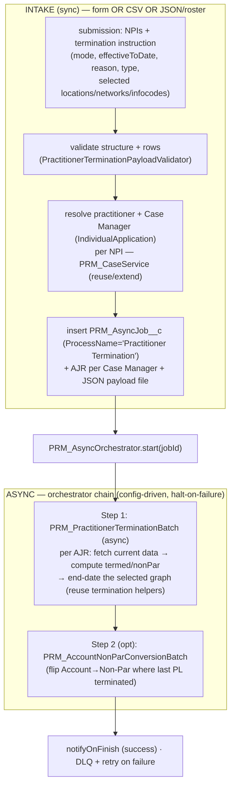

# Practitioner Termination — Async-Framework Design

> **Purpose.** Analyse the existing `PractitionerTerminationForm` OmniScript (and its backend), then design how to run **Practitioner Termination through the new asynchronous framework** (Epic C: `PRM_AsyncJob__c` + `PRM_AsyncOrchestrator`) — the same engine built for Practitioner Creation — so termination can run **bulk / high-volume** (CSV + JSON/roster + form) with durable job tracking, DLQ, and resumable retry.
>
> **Status.** DESIGN / for discussion. No code changed. Grounded on `IBXDEV01` metadata retrieved **2026‑07‑31**: the `PractitionerTerminationForm` OmniScript (active **v31**), its Integration Procedures + DataRaptors, and the existing termination Apex batches. Raw retrieval artifacts are in [`docs/reference/termination-retrieval/`](../../reference/termination-retrieval/) (form element dump, IP element dump, and six retrieved Apex classes).
>
> **One-line answer to "can we reuse a batch?"** The **async framework reuses as-is**; the **Creation batches do NOT** (they *create*; termination *end-dates/updates*); but the org **already has dedicated termination batches + helpers** (`PRM_FullPractitionerTerminationBatch`, `PRM_PractitionerTerminationBatch`, `PRM_PracticeLocationTerminationBatch`, `…RecredBatch`, and their `…BatchHelper`s) whose **write logic we reuse** — we only re-wrap it in the framework's batch contract.

---

## 1. What the form does today (as-built)

### 1.1 Entry point & component map

```
OmniScript  PractitionerTerminationForm  (PRM / English, active v31)  — one practitioner per submission (guided flow)
  └─ 9 Steps: Search → Practitioner Info → Terminate Practice Locations → PL Summary
              → Terminate Assigned Networks/Panel → Terminate Info Codes → Terminate Practitioner → Error screens
  └─ Sub-OmniScript: FileUploadOS  (supporting documents)
  └─ Navigate Action: to Case
```

The form is a **single-practitioner, synchronous guided flow**. The user searches a practitioner by NPI, the form loads their current participation graph, the user selects **what to terminate** (whole practitioner, specific practice locations, specific networks/panels, or info codes) and an **effective-to date / reason / type**, then submits.

### 1.2 Backend call graph (read → compute → write)

| Phase | Component (Type) | Role |
|---|---|---|
| **Read** | `PRM_FetchPracTermDataUtility.FetchDataForPractitionerNPI` / `…FromAccount` (Remote Action) | fetch practitioner by NPI (from home page or from an Account context) |
| **Read** | IP `PRM_GetPractitionerTerminationData` (v4) | extract the practitioner's practice locations, networks, addresses, info-codes, taxonomies; **splits Delegated vs Non-Delegated** PLs & networks |
| **Read** | IP `PRM_GetPractitionerPracticeLocations` | list/filter the practitioner's practice locations for selection |
| **Compute** | IP `PRM_CheckIfAccountBecomingNonPar` (v8, called ×4) → `PRM_ProcessPractitionerTermUtility.{FullTermination, PracticeLocationTermination, PracticeLocationNetworkTermination}` | shape the selected data into `termed/nonPar` facility lists and **decide whether terminating the last participating location flips the Account to Non-Par** |
| **Write** | IP `PRM_PractitionerTerminationRecordsUpdateParent` (v1) → IP `PRM_PractitionerTerminationRecordsUpdate` (v26) | the **write dispatcher** — Try/Catch wrapper → mode-branched record updates |
| **Write** | helper IPs `PractitionerFullTerminationHelper`, `PractitionerPracticeLocationTerminationHelper`, `PractitionerPracLocNetworkTerminationHelper`, `PractitionerIFCTerminationHelper` | one helper per termination mode; each runs DataRaptor Extract → Transform → **Post** (write) |
| **Write (Apex)** | Remote Action → `PRM_PractitionerTerminationUtility` (`Callable`) → `Database.executeBatch(…, 1)` | **already offloads to Apex batches** (see §1.4) |

### 1.3 The four termination "modes" (branches)

The write dispatcher (`…RecordsUpdate` v26) is branched by conditional blocks — the user's selection decides which run:

| Mode | Helper IP | What it terminates |
|---|---|---|
| **Full Termination** | `PractitionerFullTerminationHelper` | the whole practitioner — all facilities, networks, info codes, board certs, admitting privileges, NPI/provider, Account→Non-Par |
| **Practice Location Termination** (partial) | `PractitionerPracticeLocationTerminationHelper` | selected practice location(s) + their associations/addresses/networks |
| ~~**PL Network / Panel Termination** (partial)~~ *(out of scope — v1)* | ~~`PractitionerPracLocNetworkTerminationHelper`~~ | ~~selected network/panel assignments at a location~~ |
| **Info Code Termination** | `PractitionerIFCTerminationHelper` | selected practitioner info codes / program participation |

There is also a **Recredentialing variant** (`PractitionerTerminationRecredForm`, IP `…RecordsRecredUpdate` → `PRM_FullPracTerminationRecredBatch`) — treat as **out of scope for v1** of the async move (note it, don't build it first).

### 1.4 Objects & fields written (parity map — from the DataRaptor Post bundles)

Termination = **stamping effective-to/end dates + status** (and Non-Par conversion) across the *same* object graph Creation builds:

| DataRaptor Post bundle | Target (object) | Effect |
|---|---|---|
| `PRMDRUpdateHCPNPPI` | HealthcareProvider / NPI | end-date the provider NPI participation |
| `PRMDRPHCProviderHCTxnHCNPI` | HealthcareProvider · HC Transaction · HC NPI | full-termination provider graph end-date |
| `PRMDRUPracLocAndAddress` | Practice Location + Address | end-date location & address |
| `PRMDRUPracLocAssociations` | Practice-location associations | end-date associations |
| `PRMDRUPracLocNetPracticeToPractitoner` | PL Network (practice→practitioner) | end-date network membership |
| `PRMDRUpsertPartialNetworkTermination` | Network/panel assignment | partial network termination |
| `PRMDRPTerminateHealthCareFacilityNetworks` | **HealthcareFacilityNetwork** (the Level‑4 objects Creation builds) | terminate facility-network |
| `PRMDRUIFCAndProgramParticipation` | Info Code Assignment · Program Participation | end-date info-code/program participation |
| `PRMDRPUpsertInfoCodeAndIA` | Info Code · IndividualApplication | full-termination info-code + Case Manager |
| `PRMDRPAccountBoardCertIdentifier` | Board Cert · Identifier | end-date board cert |
| `PRMDRPUpsertAdmPrivilidges` | Admitting Privileges | end-date privileges |
| `PRMDRUNNonParAccount` | Account | **convert Account to Non-Par** when last participating location terminates |
| `PRMUpdatePDMManualOnCaseManager` | IndividualApplication (Case Manager) | set PDM-Manual flag |
| `PRMDRPCaseCaseManager` / `PRMUpdateCaseRecord` | Case + Case Manager | create/update the termination Case |
| `PRMDRCreateIdentiferAndDocument` | Identifier + ContentDocument | notes / supporting documents |

> **Note:** the DataRaptor write logic is **already ported to Apex** inside the termination batch helpers (§1.4 writes happen in both the IP-DR path *and* the Apex batch path depending on mode). For the async move we consume the **Apex** path, so there is **no OmniStudio at runtime**.

### 1.5 Existing Apex batches (already in the org)

`PRM_PractitionerTerminationUtility` (a `Callable`, invoked from the form's Remote Action) already does `Database.executeBatch(batch, 1)`:

| Callable action | Batch launched | Purpose |
|---|---|---|
| `FullPractitionerTerminationBatch` | `PRM_FullPractitionerTerminationBatch` (+ `PRM_PractitionerTerminationBatchHelper`, `PRM_AccountTerminationBatchHelper`) | full termination |
| `PractitionerTerminationBatch` | `PRM_PractitionerTerminationBatch` (+ helpers, `PRM_PracLocTermHelper`) | practice-location / network / partial termination |
| `FullPractitionerTerminationBatchRecred` | `PRM_FullPracTerminationRecredBatch` | recred-time full termination |
| `RCATTerminationBatch` | `PRM_RCATProcessingController` | RCAT (separate program) |

Related: `PRM_PracticeLocationTerminationBatch`, `PRM_PracticeLocationTerminationPDMBatch`, `PRM_ManualUpdatePracLocTerminationBatch`, `PRM_FullPracTermForFacilityBatch`, `PRM_ProcessPractitionerTermHelper`, `PRM_FetchPracTermDataHelper`, `PRM_PracLocTermUtility`.

### 1.6 Why this doesn't scale (the problem to fix)

| # | Current behaviour | Limitation |
|---|---|---|
| T1 | **One practitioner per form submission**; `executeBatch(scope=1)` | no bulk / roster termination path |
| T2 | Batch **launched from a Remote Action inside the sync IP** | violates "don't `executeBatch` from sync/trigger context"; fragile under load |
| T3 | **No durable job record** — `AsyncApexJob` only | not business-trackable; no per-Case-Manager status |
| T4 | **No DLQ / no resumable retry** — Try/Catch in the IP only | a failure isn't staged or replayable step-by-step |
| T5 | **Data selection is UI-driven** (user picks locations/networks on screen) | bulk needs the selection to come from the **file**, and the fetch/compute (currently IP DataRaptors + `ProcessPractitionerTermUtility`) to run **server-side per practitioner** |

---

## 2. Target — Practitioner Termination on the async framework

### 2.1 Reuse the Epic C engine verbatim

The framework is process-agnostic. Termination adds **one new `PRM_ProcessName__c` value = `Practitioner Termination`** and reuses everything else:

| Framework piece | Reuse for termination |
|---|---|
| `PRM_AsyncJob__c` (+ `PRM_AsyncJobRecords__c` per Case Manager, `PRM_AsyncJobDetails__c` per step) | **as-is** — one Job per submission, one AJR per practitioner |
| `PRM_AsyncOrchestrator` (`createDetails`, `findNextJob`, halt-on-failure, `retry`, `statusUpdate`, `logFailure`, `notifyOnFinish`, `jsonFileParser`) | **as-is** |
| `PRM_AsyncBatchBase` / `PRM_IAsyncBatch` contract | **as-is** — new termination batches extend it |
| `PRM_AsyncJobConfig__mdt` | **new rows** for `Practitioner Termination` (one per step) |
| `PRM_FailedRecordStaging__c` (DLQ) + retry LWC + Custom Notification | **as-is** |
| CSV intake (`prmCsvJobUpload` + `PRM_CSVConversionBatch`) / JSON-roster (`PRM_JsonJobUploadService`) | **reused**, with a **termination template/mapper** (new) |

### 2.2 Target flow



### 2.3 Canonical termination payload (per practitioner)

The file/envelope must carry the **instruction** (bulk has no on-screen selection):

```json
{ "messageHeader": { "messageType": "PractitionerTermination", "sourceSystem": "CsvUpload|Roster|Form" },
  "practitioners": [{
    "individualNpi": "1234567890",
    "terminationMode": "Full | PracticeLocation | InfoCode",   // Network — out of scope (v1)
    "effectiveToDate": "MM/DD/YYYY",
    "terminationReason": "…",
    "terminationType": "…",
    "targets": {                       // omitted/empty for Full
      "practiceLocationNpis": ["…"],   // for PracticeLocation mode
      // "networks": ["…"],            // Network mode — out of scope (v1)
      "infoCodes": ["…"]               // for InfoCode mode
    }
  }]
}
```

> Because the batch (not a UI) must know *what* to end-date, the **read + compute** currently done by `PRM_GetPractitionerTerminationData` + `PRM_CheckIfAccountBecomingNonPar` moves **inside the termination batch/service** (reusing `PRM_FetchPracTermDataHelper` + `PRM_ProcessPractitionerTermHelper`).

---

## 3. Reuse analysis (the explicit ask)

### 3.1 Can we reuse a **Creation** batch? — No.

| Creation batch | Why it can't be reused for termination |
|---|---|
| `PRM_PractitionerBatch`, `PRM_PracticeLocationAndGroupBatch`, `PRM_PLRelatedBatch`, `PRM_Level4Batch` | They **insert/build** the provider graph (bulk `insert`, External-Id upserts). Termination **updates end-dates/status** on *existing* records and can flip Account→Non-Par. Opposite DML intent, different selectors, different idempotency keys. |

The **shared abstraction we DO reuse** from Creation is the **pattern**: `PRM_AsyncBatchBase` subclass whose scope is the Job's `PRM_AsyncJobRecords__c` (one per Case Manager), thin batch delegating writes to a service, `finish()` → `findNextJob`.

### 3.2 Can we reuse an existing **Termination** batch? — Yes, its logic.

| Existing asset | Reuse verdict | How |
|---|---|---|
| `PRM_PractitionerTerminationBatchHelper` (64 KB), `PRM_AccountTerminationBatchHelper`, `PRM_PracLocTermHelper` | **Reuse as the service layer** | these hold the actual end-date/Non-Par write logic (already ported off DataRaptors). Call them from the new framework batch. |
| `PRM_FetchPracTermDataHelper`, `PRM_ProcessPractitionerTermHelper` | **Reuse** for the in-batch **read + compute** (replaces the IP DataRaptor extracts + `CheckIfAccountBecomingNonPar`). |
| `PRM_FullPractitionerTerminationBatch`, `PRM_PractitionerTerminationBatch`, `PRM_PracticeLocationTerminationBatch` | **Refactor, don't reuse the shell** | they implement `Database.Batchable<sObject>, Database.Stateful` (not `PRM_IAsyncBatch`), take constructor args, and run `scope=1` per practitioner. Keep the **helper calls**, drop the standalone Batchable shell in favour of a framework batch. |
| `PRM_PractitionerTerminationUtility` (Callable) | **Retire from the async path** | its `executeBatch(…,1)` kickoff is replaced by `PRM_AsyncOrchestrator` dispatch. (Leave it in place for the legacy form until cutover.) |

### 3.3 Recommended construction

Add **one new framework batch** (mirroring `PRM_PractitionerBatch`), branching by `terminationMode`, delegating to the reused helpers:

```
PRM_PractitionerTerminationBatch (extends PRM_AsyncBatchBase)   [NEW — thin]
  start()        → iterate PRM_AsyncJobRecords__c (Case Managers) for the Job; read payload via jsonFileParser
  processScope() → per practitioner:
                     PRM_FetchPracTermDataHelper      → load current participation graph
                     PRM_ProcessPractitionerTermHelper → compute termed/nonPar sets + Non-Par decision
                     branch on terminationMode:
                       Full         → PRM_PractitionerTerminationBatchHelper.fullTerminate(...)
                       PracticeLoc  → …practiceLocationTerminate(...)
                       // Network   → …networkTerminate(...)   // out of scope (v1)
                       InfoCode     → …infoCodeTerminate(...)
                     (one bulk DML per object type — the helpers already batch)
  finish()       → PRM_AsyncBatchBase: statusUpdate → findNextJob (halt-on-failure, DLQ, retry)
```

Optionally a **Step 2** `PRM_AccountNonParConversionBatch` if Non-Par conversion is better isolated as its own resumable step (it spans Accounts, not Case Managers). Provisional config:

| Seq | ProcessName | ServiceClassName (batch) | Mode | BatchSize |
|---|---|---|---|---|
| 1 | Practitioner Termination | `PRM_PractitionerTerminationBatch` | Batch | 1–50 (validate; helpers currently assume scope 1) |
| 2 | Practitioner Termination | `PRM_AccountNonParConversionBatch` | Batch | 200 |

> ⚠️ The existing helpers were written for **scope = 1**. Confirm they are **bulk-safe** before raising `PRM_BatchSize__c`; if not, keep scope 1 initially (still durable/retryable via the framework) and bulk-harden as a follow-up (governor review — see Risks).

---

## 4. Intake specifics

- **Form (single):** re-point the OmniScript's final submit from the Remote Action (`PRM_PractitionerTerminationUtility`) to the new intake wrapper → `PRM_AsyncJob__c`. The form already produces the mode + effectiveTo + selected targets; map those into one payload practitioner.
- **CSV:** new template + mapper (`PRM_CSV*TerminationMapper`) on the existing `prmCsvJobUpload` pipeline — columns for NPI, mode, effective-to, reason, type, and target locations/info-codes (~~networks~~ — Network mode out of scope v1). Reuse the positional-layout + validate + convert engine.
- **JSON/roster:** `PRM_JsonJobUploadService` already routes by `messageType`; add `PractitionerTermination` as a supported template.
- **Validation (pre-enqueue):** `PractitionerTerminationPayloadValidator` — NPI present & 10-digit, mode ∈ enum (`Full` / `PracticeLocation` / `InfoCode` — ~~`Network`~~ out of scope v1), effective-to a valid/allowed date, and mode-specific targets present (e.g. PracticeLocation mode needs ≥1 location).

---

## 5. Data model / config additions

| Item | Change |
|---|---|
| `PRM_ProcessName__c` picklist (on `PRM_AsyncJob__c` + `PRM_AsyncJobDetails__c` + config) | add value **`Practitioner Termination`** |
| `PRM_AsyncJobConfig__mdt` | add row(s) for the termination step(s) (§3.3) |
| `PRM_Constants` | add `PROCESS_PRACTITIONER_TERMINATION`, `MESSAGE_TYPE_PRACTITIONER_TERMINATION`, termination-mode + reason/type constants |
| Case creation | reuse `PRM_CaseService` to resolve/attach the **termination Case + Case Manager** per practitioner (confirm RT/flow for termination Cases) |
| Permission set | grant the termination batch classes + tab access on the reused `PRM_AsyncJob_Access` |

---

## 6. Open questions / decisions

1. **Bulk-safety of the existing helpers** — are `PRM_PractitionerTerminationBatchHelper` / `PRM_AccountTerminationBatchHelper` safe at scope > 1, or must we start at scope 1 and bulk-harden?
2. **Scope of v1** — all four modes, or start with **Full Termination** (highest value, simplest instruction) and add partial modes next? Recred variant deferred?
3. **Case model** — does bulk termination create a **new Case per practitioner** (like the form) via `PRM_CaseService`, or attach to an existing one? What Case record type / flow for termination?
4. **Non-Par conversion** — keep it inline in the termination batch (per practitioner) or isolate as its own step/batch (it aggregates at the Account grain across practitioners)?
5. **Source of the "what to terminate"** — for CSV/roster, confirm the instruction columns (mode + targets) and whether "terminate everything effective X" (Full) is the primary bulk use case.
6. **Effective-date / future-dating rules** — the org has `PRM_FutureDatedProcBatchSchTermination`; do bulk terminations support future effective-to dates (scheduled) or immediate only?
7. **Supporting docs / QC notes** (form has `FileUploadOS`) — captured in bulk or out of scope (mirror the MU-10 decision from CSV creation)?
8. **Cutover** — hard cutover of the form's submit to the async intake (rollback = re-point to `PRM_PractitionerTerminationUtility`), matching the Creation CL-4 pattern.

---

## 7. Risks

| # | Risk | Mitigation |
|---|---|---|
| RT‑1 | Existing helpers assume **scope 1 / single practitioner** — not bulk-safe | start scope 1 (still durable via framework); bulk-harden with a governor review before raising batch size |
| RT‑2 | Termination touches a **large graph** (provider, PLs, networks, info codes, board certs, privileges, Account, Case) — governor pressure per practitioner | keep one bulk DML per object type in the helpers; scope tuning; per-step isolation |
| RT‑3 | **Non-Par conversion** aggregates at Account grain but batch scope is per-Case-Manager | isolate as a dedicated step 2 (Account-grain) so it's computed once per Account |
| RT‑4 | **Parity** with the guided flow's mode branching + Non-Par decision | shadow-mode compare records produced by the form vs the async path for each mode before cutover |
| RT‑5 | **Idempotent retry** — re-running a terminated step must not double-end-date or re-flip Non-Par | status-guard + "already terminated (effective-to set)" checks in the helpers |
| RT‑6 | **Recred + RCAT** variants share code paths | keep them out of v1 scope; don't disturb their existing (legacy) invocation |

---

## 8. Appendix — retrieved artifact inventory

Under [`docs/reference/termination-retrieval/`](../../reference/termination-retrieval/):

- `form_elements.json` — all 155 elements of `PractitionerTerminationForm` v31 (steps, IP/Remote actions, set-values).
- `ip_elements.json` — elements of the 9 writer/helper/read IPs (DataRaptor bundles, chained IPs, remote actions).
- `apex-classes/` — 6 retrieved Apex classes: `PRM_PractitionerTerminationUtility`, `PRM_ProcessPractitionerTermUtility`, `PRM_FullPractitionerTerminationBatch`, `PRM_PractitionerTerminationBatch`, `PRM_PracticeLocationTerminationBatch`, `PRM_FetchPracTermDataUtility`.

> Full backend for reference (not retrieved, names captured): IPs `PRM_PractitionerTerminationRecordsUpdate(Parent)`, `PractitionerFull/PracticeLocation/PracLocNetwork/IFC TerminationHelper`, `PRM_GetPractitionerTerminationData`, `PRM_CheckIfAccountBecomingNonPar`; helpers `PRM_PractitionerTerminationBatchHelper`, `PRM_AccountTerminationBatchHelper`, `PRM_FetchPracTermDataHelper`, `PRM_ProcessPractitionerTermHelper`, `PRM_PracLocTermHelper`; and DataRaptor bundles listed in §1.4.
