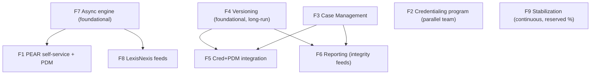

# 2027 Priorities — Grounded ROM (TDD-based Re-Estimation): Summary

**Date:** July 29, 2026
**Why this exists:** The first-pass ROM (`requirements/PRM_2027_Priorities_ROM_Estimation.md`) reused FY2025 calibration anchors that were **materially under-estimated**. This re-estimation is done **feature-by-feature**, each grounded in a codebase/doc audit + a high-level TDD, with scope confirmed via clarifying questions. **Unit: developer-days (baseline + AI-assisted).** One TDD+estimation doc per feature in this folder.

> **AI-assisted multipliers** (repo-calibrated): Apex/service ~3x, triggers ~2.5x, tests ~4x, OmniStudio ~1.5x, LWC ~3x, integration/E2E ~1.1x, UAT ~1x. All figures are **effort days**.

---

## 1. Per-feature grounded totals

| # | Feature | Baseline dev-days | AI-assisted dev-days | T-shirt | Confidence | Doc |
|---|---|---:|---:|:--:|:--:|---|
| 1 | PDM efficiency + PEAR self-service | 84–107 | 59–73 | XL | Med | `Feature1_PDM_PEAR_TDD_Estimation.md` |
| 2 | Credentialing (5-flow tiles + CAQH docs + Agentic) | 322–421 | 211–281 | XXL | Tile High / CAQH Low-Med / Agentic Med-Low | `Feature2_Credentialing_TDD_Estimation.md` |
| 3 | Enhanced Case Management | 68–100 | 47–68 | L–XL | Med | `Feature3_CaseManagement_TDD_Estimation.md` |
| 4 | Full Data Versioning (all objects) | 475–490 | 220–270 | XXL | Med (HIGH risk) | `Feature4_DataVersioning_TDD_Estimation.md` |
| 5 | Cred+PDM Integration (net-new) | 50–75 | 34–52 | L | Med | `Feature5_CredPDMIntegration_TDD_Estimation.md` |
| 6 | Inventory + Reporting | 61–110 | 44–74 | L (XL if many feeds) | Low-Med | `Feature6_InventoryReporting_TDD_Estimation.md` |
| 7 | Mass Data Loads (engine + 7+ ops) | 187–263 | 123–172 | XXL | Med | `Feature7_MassDataLoads_TDD_Estimation.md` |
| 8 | Lexis Nexis + Compliance | 117–185 | 82–134 | XL | LN Med / Compliance Low | `Feature8_LexisNexis_Compliance_TDD_Estimation.md` |
| 9 | Stabilization / Tech Debt (envelope) | 230–400 | 170–320 | L–XL | Med | `Feature9_Stabilization_TechDebt_TDD_Estimation.md` |

*(F5 shown net-of-overlap; gross 73–106 / 49–74. F9 shown as recommended reserved envelope; known backlog floor 94–171 / 59–108.)*

---

## 2. Grand total (grounded)

| | Baseline dev-days | AI-assisted dev-days |
|---|---:|---:|
| **Sum (F5 net-new + F9 envelope)** | **~1,594–2,151** | **~990–1,444** |
| Sum (F9 = known backlog floor instead of envelope) | ~1,458–1,922 | ~879–1,232 |

**In team terms** (~230 productive dev-days/dev-year): the AI-assisted program is **~4.3–6.3 developer-years**. Delivering all nine in 2027 implies **~5–7 senior devs (AI-assisted) working the full year**, and even then Features 2, 4, and 7 alone are three concurrent multi-quarter programs.

### Contrast with the FY2025-anchored first pass
The original ROM summed the nine to roughly **~600–1,100 story points**. The grounded re-estimate is **~1.6–2.7× higher** on the big-ticket items — driven almost entirely by work the anchors omitted:
- **F2:** all-5-flow tile redesign (~122 AI-days) + **real CAQH document retrieval** + Agentic foundation — not one feature, a program.
- **F4:** the version state-machine (version-down/up, back-date, natural-key error-out) across **~30 objects** with a 501-class/1,338-DR regression surface.
- **F7:** the async **engine build** (designed-not-built) + 7+ mass operations, not just refactoring existing flows.
- **F8:** the LexisNexis **termination cascade** (Full/Non-Par/Last-Man-Standing) is a large hidden chunk.
- Mandatory-but-invisible work everywhere: external-submission **QC routing**, **community security/FLS**, **shadow parity/UAT**, **integration testing** — none AI-compressible.

---

## 3. Double-counting / overlap map (read before summing)

These features share foundations — **do not sum naively**:

| Shared foundation | Primary owner | Also consumed by |
|---|---|---|
| Async/bulk engine (`PRM_AsyncJob__c`) | **F7** | F1 (PEAR QC intake), F5 |
| External-submission QC routing (Case/CM/CDM + CMA) | **F1 / F7** | F3, F5, F8 |
| Versioned/effective-dated write model | **F4** | F5 (no re-entry), F6 (history feeds), F8 (termination) |
| Analyst worklists / routing | **F3** | F5 (shared views), F6 (leadership inventory) |
| Field-history data source | **F4** | F6 (integrity feeds) |

F5 is booked **net-new**; F9 excludes items owned by F3/F4/F7. Even so, sequencing F7→F1, F4→(F5/F6/F8), F3→(F5/F6) will save real effort.

---

## 4. Recommended sequencing (foundations first)

- **Q1:** stand up F7 async engine + start F4 architecture + F3; keep F9 continuous.
- **Q2–Q3:** F1 + F8 on the engine; F4 object tiers; F2 tiles (parallel team); F5/F6 as F3/F4 land.
- **Q4:** cutover/parity, Agentic pilots (post F2 foundation), compliance build (post spike).

---

## 5. Key open questions carried forward (per feature)
- **F2:** confirm CAQH **document** API entitlement; all-5-flows in one year needs parallel teams.
- **F4:** resolve the 7 business pre-conditions + final object list/natural keys; phased vs single-year.
- **F5:** confirm cred tracks (ReCred/Initial/PAR) + outcome→PDM matrix.
- **F6:** run the integrity-feed discovery inventory (count unknown).
- **F7:** confirm the exact 7+ mass-operation list.
- **F8:** define the compliance mandate(s) + deadline.
- **F9:** confirm reserved % (15–20% proposed) and the double-count boundary.

---

*Each feature doc contains its own audit, high-level TDD, grounded work-breakdown, risks, and open questions. This summary is the roll-up; the feature docs are authoritative for detail.*
