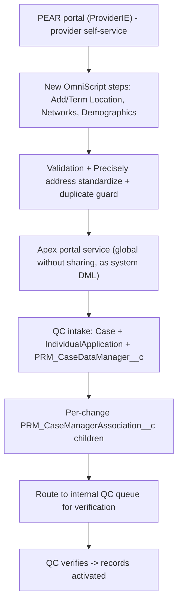

# Feature 1 — Streamline & Enhance PDM (Internal Efficiency + PEAR Portal): High-Level TDD & Estimation

**Date:** July 29, 2026
**Priority:** 2027 #1 — *Streamline and Enhance Provider Data Management Capabilities*
**Scope (confirmed with business):**
- **Balanced** internal + external delivery.
- **PEAR portal:** expose **more self-service maintenance** (add/terminate practice locations, network changes, demographics) **beyond** today's Attestation-only capability, for **Ancillary and Professional** providers.
- **Internal PDM:** **reduce admin tickets** by letting PDM/reviewers **self-serve simple field edits** instead of filing tickets for an admin to make the change.
- **Estimate unit:** developer-days (baseline + AI-assisted), story-point range secondary.

> **Estimation method (applies to all 2027 feature docs).** Baseline = a competent Salesforce dev without heavy AI leverage. AI-assisted = senior dev + Cursor at the repo's calibrated multipliers (`Provider_Data_Versioning_Estimation.md` §"AI + Senior Dev Productivity Model"): Apex/service ~3x, triggers ~2.5x, tests ~4x, **OmniStudio/OmniScript ~1.5x** (manual publish), LWC ~3x, **integration/E2E ~1.1x**, **UAT/business ~1x (not compressible)**. All figures are **effort days**, not calendar days.

---

## 1. Current State (audited, grounded)

### 1.1 PEAR external portal — Attestation only

The PEAR provider portal (`ProviderIE` Experience Cloud site; "PDM Portal User" community license; CSP `PEAR.cspTrustedSite`) exposes **exactly one write flow**:

| Asset | Detail |
|---|---|
| `PRM_AttestationFlow_English` (v19 active) | Practice-location attestation + General Office Info (age range, walk-ins, parking, email, EMR, website, hours), contact methods, assistive aids, on-site staff, telehealth info code, languages, ePrescribe toggle |
| `PRM_UpdateAttestationData(Parent)` IP → 6 DataRaptors | Write path (`PRMDRUpdatePracLocData`, `PRMDRUpsertContactMethod`, `PRMUpdateAssistiveAids`, `PRMUpdateInfoCodeAssignments`, `PRMDRUpdateEPrescribeOnPracLoc`, `PRMDRUpsertPractitionerLanguage`) |
| `PRM_AttestationProviderServiceUtility` / `...Helper` (Apex, `global without sharing`, DML `as system`) | Remote-action write path; preserves community user as `CreatedById` (audit attribution verified) |
| Read-only IPs | `AttestationProviderLocationSearch`, `GetContactDetailsForAttestation`, `GetPractitionerDetailsForAttestation` |

**Key facts** (from [PEAR_Portal_Field_Audit_Report.md](requirements/PEAR/PEAR_Portal_Field_Audit_Report.md)):
- There is **no** portal capability today for add/term location, network changes, or broad demographics maintenance — attestation only.
- Community-user audit attribution works; **5 FHT gaps** exist; HCPF is at ~21 tracked fields (near limit).
- The portal path does **no** QC routing — attestation writes directly to production records (verified after-the-fact via history).

### 1.2 Internal PDM maintenance — synchronous OmniStudio flows

| Asset | Notes |
|---|---|
| `PRM_PDMManualUpdate_English` (→ v26), `PRM_PDMManualUpdatePractitioner_English` (→ v19), Vendor/VendorAccount/HCFAssociations variants | The PDM change surface: add/remove practitioner, networks, taxonomy, COI (office info), terminate PL, program participation, etc. |
| Write chain | `PRM_PDMRecordsCreationParent` → `PRM_PDMRecordsCreationHelper` (76 elements) → DataRaptors upserting `HealthcareFacility`, `Address`, `HealthcarePractitionerFacility` (HCPF), `HealthcareFacilityNetwork` (HFN), `HealthcareProviderTaxonomy` (HPT); Case + `IndividualApplication` + `PRM_CaseDataManager__c` for QC |
| Known rework drivers | Synchronous IP chains hit governor limits at volume ([PRM_HighVolume_Processing_SK_Estimation.md](requirements/PRM_HighVolume_Processing_SK_Estimation.md)); COI address trigger false-positives ([PDM_Address_Error_Analysis.md](requirements/PDM%20Flows/PDM_Address_Error_Analysis.md)); simple field changes today go through an **admin ticket** rather than self-service |

### 1.3 Reusable primitives (do not rebuild)

- QC-case creation DataRaptors: `PRMDRCreateCaseCaseManagerBundleExist`, `PRMCreateCaseDatamanager`.
- Per-change tracking object: **`PRM_CaseManagerAssociation__c`** + builder `PRM_CaseManagerAssociationAddressBuilder` (the "one QC case tracks each change as a child" primitive).
- Address standardization: Precisely via `PRM_AddressValidationService` / `addressValidationModal`.
- LWC: `prmEnhancedDatatable`, `prmGenericConfirmModal`, `prmNotesCapture`, `prmAddressUtils`; logging `PRM_ExceptionLogger`.

---

## 2. Gap Analysis (what the 2027 scope needs)

| # | Capability | Exists? | Gap |
|---|---|---|---|
| G1 | PEAR self-service: **add** practice location | No | New portal flow + write path + **QC routing** |
| G2 | PEAR self-service: **terminate** practice location | No | New portal flow + term logic + QC routing |
| G3 | PEAR self-service: **network** add/remove | No | New portal capability over HFN + QC routing |
| G4 | PEAR self-service: **demographics** maintenance | Partial (attestation has some) | Broaden editable demographics + QC routing |
| G5 | **QC routing framework for external submissions** | No (attestation writes direct) | Provider portal edits must land as a QC case, not direct writes |
| G6 | Community **security/FLS** for the new writable objects/fields | Partial | New profile/permset FLS + sharing for each added object |
| G7 | Internal PDM **self-serve simple field edits** (kill admin tickets) | No | Inline edit + guardrails + role model in PDM flows |
| G8 | FHT gaps + audit for new writable fields | 5 gaps today | Enable FHT; verify attribution for new fields |

---

## 3. High-Level TDD

### 3.1 Architecture principles
- **External edits are proposals, not direct writes.** Every PEAR self-service maintenance submission creates a **QC case** (`Case` + `IndividualApplication` + `PRM_CaseDataManager__c`) with **per-change `PRM_CaseManagerAssociation__c`** children, routed to internal QC for after-the-fact verification — reusing the MassAddressUpdate model rather than the direct-write attestation model.
- **Reuse the OmniStudio-first stack** (portal flows as OmniScripts/IP/DR) for consistency with the existing `AttestationFlow`, with Apex service helpers where DML/branching is complex. (The aspirational `PRM_BaseService` framework does **not** exist — confirmed in `PNM_MassAddressUpdate_FullStack_Architecture.md`.)
- **Community context:** `global without sharing` service + `as system` DML preserving the SSO user as `CreatedById` (established attestation pattern); explicit FLS/permset per new field.

### 3.2 Part A — PEAR portal self-service expansion

**Components:**
- **A1. QC intake framework for portal submissions** — one Case/CaseManager per submission + per-change CMA children; reuse `PRMDRCreateCaseCaseManagerBundleExist`, `PRMCreateCaseDatamanager`, `PRM_CaseManagerAssociationAddressBuilder`. *(Central, reused by A2–A5.)*
- **A2. Add Practice Location** portal flow — search/select group, capture address (Precisely), taxonomy, initial networks; QC route.
- **A3. Terminate Practice Location** portal flow — select location, reason, effective date; QC route with term validation.
- **A4. Network add/remove** portal capability over HFN (per location/role/network); QC route.
- **A5. Demographics maintenance** — broaden editable practitioner/location demographics beyond attestation; QC route.
- **A6. Community security** — profile/permission-set FLS + sharing for each newly writable object/field.
- **A7. Guardrails** — duplicate prevention, effective-date/overlap handling (avoid the COI address-trigger false-positive class), portal UX/accessibility for new screens.
- **A8. FHT** — enable tracking on new writable fields; verify community attribution.

### 3.3 Part B — Internal PDM self-serve simple field edits (reduce admin tickets)

- **B0. Discovery** — quantify the top admin-ticket field-edit categories (which fields/objects drive the ticket volume) to bound scope.
- **B1. Inline edit** in `PRM_PDMManualUpdate_English` / `PRM_PDMManualUpdatePractitioner_English` for the simple field set (demographics, contact info, simple attributes) — convert display elements to editable inputs + DR update paths (edit-in-OmniScript precedent and cost in [PRM_CredFlows_EditCapability_Estimation.md](requirements/PRM_CredFlows_EditCapability_Estimation.md)).
- **B2. Guardrails + audit** — validation, who-edited-what history, avoid COI address false-positive trigger.
- **B3. Role/permission model** — which roles may self-serve which edits (vs. still route to QC).

### 3.4 Cross-cutting risks
- **R1 (High):** External self-service that writes provider directory data is compliance-sensitive; QC routing + audit are mandatory, not optional — drives the QC-intake framework (A1) as the critical path.
- **R2 (Med):** Community FLS/sharing sprawl across many new fields/objects.
- **R3 (Med):** OmniStudio manual publish per change (not AI-compressible); large existing flows are fragile.
- **R4 (Med):** Effective-date/overlap trigger false-positives (documented) if new write paths reuse the COI DataRaptor pattern.
- **R5 (Low-Med):** Scope of "simple field edits" (B) can creep into full edit capability (which is Feature 2 / cred-flow territory).

---

## 4. Estimation (grounded work breakdown, developer-days)

### 4.1 Part A — PEAR portal self-service expansion

| Component | Baseline | AI-assisted | Notes |
|---|---:|---:|---|
| A1. QC intake framework for portal submissions (Case/CM/CDM + per-change CMA) | 8–10 | 5–6 | Reuses existing DR/CMA primitives; central to A2–A5 |
| A2. Add Practice Location portal flow (OS + IP/DR + Apex + QC route) | 10–13 | 6–8 | New flow; address+taxonomy+networks |
| A3. Terminate Practice Location portal flow | 6–8 | 4–5 | Term validation + QC route |
| A4. Network add/remove portal capability (HFN) | 8–10 | 5–6 | Per location/role/network |
| A5. Demographics maintenance (broaden beyond attestation) | 5–7 | 4–5 | Extend editable set + QC route |
| A6. Community security (FLS/permset/sharing across new objects) | 4–5 | 3 | Per-field community perms |
| A7. Guardrails (dup prevention, effective-date/overlap, portal UX/a11y) | 5–7 | 3–4 | Avoid COI trigger false-positives |
| A8. FHT enablement + attribution verification | 1 | 1 | Metadata-only |
| **Part A build sub-total** | **47–61** | **31–38** | |
| A-Test. Unit + integration + community E2E | 10–13 | 7–9 | E2E in community context barely compresses |
| A-UAT. Business + provider-rep UAT | 5–6 | 5–6 | Not compressible |
| **Part A total** | **62–80** | **43–53** | |

### 4.2 Part B — Internal PDM self-serve simple field edits

| Component | Baseline | AI-assisted | Notes |
|---|---:|---:|---|
| B0. Discovery — top admin-ticket edit categories | 2 | 2 | Bounds scope; analysis, not build |
| B1. Inline edit in 2 PDM flows for simple fields | 8–11 | 5–7 | Edit-in-OmniScript precedent (CredFlows Option A) |
| B2. Guardrails + audit (avoid COI trigger issue) | 3–4 | 2–3 | |
| B3. Role/permission model | 2 | 2 | |
| **Part B build sub-total** | **15–19** | **11–14** | |
| B-Test. Unit + integration | 4–5 | 2–3 | |
| B-UAT. Business UAT | 3 | 3 | Not compressible |
| **Part B total** | **22–27** | **16–20** | |

### 4.3 Feature 1 total

| | Baseline dev-days | AI-assisted dev-days |
|---|---:|---:|
| Part A — PEAR self-service | 62–80 | 43–53 |
| Part B — PDM self-serve edits | 22–27 | 16–20 |
| **Feature 1 total** | **84–107** | **59–73** |

- **Story-point secondary (for continuity with FY2025 ROM):** ≈ **85–110 pts** — materially **above** the coarse ROM anchor (55–100) once the mandatory external-QC-routing framework and community security are grounded in. This confirms the FY2025-anchor concern.
- **T-shirt: XL.**
- **Confidence: Medium** (Part A High-confidence on structure; Part B depends on B0 discovery of ticket categories).
- **Calendar (2 devs, AI-assisted):** ~**59–73 effort-days / ~2 ≈ 7–9 weeks of build**, realistically **~3–4 months** end-to-end including UAT and OmniStudio publish cycles.

---

## 5. Assumptions, Dependencies, Open Questions

**Assumptions**
- External self-service edits **must** route through QC (verify-after-the-fact), not write directly to directory records.
- "Simple field edits" (Part B) is a **bounded** set determined by B0 discovery — not full record edit capability.
- Portal stays OmniStudio-based for consistency with `AttestationFlow`.

**Dependencies**
- Overlaps **Feature 7 (Mass Data Loads)** async framework and **Feature 3 (Case Management)** QC routing — align the QC-intake framework (A1) with those to avoid duplicate builds.
- FHT limits on HCPF (~21 fields) may constrain adding more tracked fields (Feature 4 territory).

**Open questions (for grooming)**
- Which **Ancillary** self-service surfaces belong on PEAR vs. staying internal? (Ancillary today is internal cred/assessment flows.)
- Exact list of demographics fields editable by providers vs. QC-only.
- Should Part A build on the new async framework (Feature 7) or ship on the existing synchronous pattern first?

---

*Grounding references:* `requirements/PEAR/PEAR_Portal_Field_Audit_Report.md`, `requirements/PEAR/PEAR_WebsiteReadOnly_BugFix.md`, `requirements/PDM Flows/PDM_Address_Error_Analysis.md`, `requirements/Enhancements/PNM_MassAddressUpdate_FullStack_Architecture.md`, `requirements/PRM_HighVolume_Processing_SK_Estimation.md`, `requirements/PRM_CredFlows_EditCapability_Estimation.md`; metadata under `force-app/main/default/omniScripts/`, `.../classes/PRM_AttestationProviderServiceUtility.cls`.
