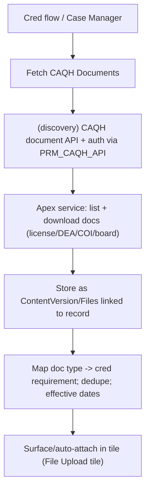

# Feature 2 — Credentialing Enhancements (Tile Redesign + CAQH Documents + Agentic AI): High-Level TDD & Estimation

**Date:** July 29, 2026
**Priority:** 2027 #2 — *Credentialing Enhancements*
**Scope (confirmed with business):** all three sub-programs are in 2027 scope:
- **Tile redesign:** **all 5 credentialing flows** (full redesign, ~55 tiles).
- **CAQH:** retrieve **actual document files** (license / DEA / malpractice COI PDFs) from CAQH and attach to the record.
- **Agentic AI:** **Phase 0 foundation + 1–2 Tier-1 pilot agents** (PSV Copilot, Bulk Validation).
- **Estimate unit:** developer-days (baseline + AI-assisted), story-point range secondary.

> Estimation method per the shared note in `Feature1_PDM_PEAR_TDD_Estimation.md` §method.

---

## 1. Current State (audited, grounded)

### 1.1 Tile redesign — POC deployed, full build planned
Per [Component_Tracker.md](requirements/ReDesignCredFlows/Component_Tracker.md):
- **Deployed (POC, single-user demo, qa-sandbox):** `prmCredTileBoard`, `prmCredTileCard`, `prmCredTileProgress`, plus `prmCaqhProfile` viewer.
- **Architecture ratified:** App Review + Initial Cred PSV merged into one **17-tile "Initial Credentialing Review"** flow; downstream Re-Cred PSV, Initial Cred QC, Re-Cred PSV QC, PDA QC remain separate and **wrap** the combined components.
- **Planned / NOT built:** `PRM_VerificationSession__c` + `PRM_VerificationTileStatus__c` (pause/resume + per-tile status), most tile editors (Education, Work History, Malpractice, File Upload, Final Submit), `prm_qcWrapper` for QC/PDA flows.
- **Full-build reference estimate:** [MASTER_Development_Plan_Credentialing_LWC_Redesign.md](requirements/ReDesignCredFlows/MASTER_Development_Plan_Credentialing_LWC_Redesign.md) → **~122 AI-assisted dev-days**, 5 flows, ~55–59 tiles; [PRM_CredFlows_EditCapability_Estimation.md](requirements/PRM_CredFlows_EditCapability_Estimation.md) Option B corroborates (~122.5 AI-assisted days, incl. tests/UAT). Legacy OmniScripts replaced: `PRM_InitialCredentialAppReview_English`, `PRM_PrimarySourceVerificationReview_English` (v47, 186+ elements), `PRM_ReCredUpdate_English`, `PRM_RecredQC_English`, `PRM_InitialCredPDAQC_English`.

### 1.2 CAQH — profile *data* viewer exists; document *files* do not
- `PRM_CaqhProfileController` reuses the **live CAQH callout** `PRM_AppReviewCaseAssembler.fetchCaqh()` (IP `PRM_ValidateCAQHAppReviewParent`, named credential `PRM_CAQH_API`) to render ~20 read-only **profile data** sections.
- There is **no** capability to retrieve CAQH **document files** (the actual PDFs: state license, DEA, malpractice COI, board cert) and attach them to the Salesforce record. This is net-new and depends on the CAQH **document** API surface (discovery required).

### 1.3 Agentic AI — strategy + roadmap, nothing in production
- [00_Strategy](requirements/AgenticAI/00_Strategy_AgenticAI_for_Credentialing_PDM.md) + [03_Roadmap_Sequencing](requirements/AgenticAI/03_Roadmap_Sequencing.md): **Phase 0 foundation** (~6 wks) = Einstein Trust Layer config (PHI/NPI/DEA/license redaction), `PRM_AgentDecision__c` + `PRM_AgentDecisionStep__c` audit objects (fields already scaffolded in `force-app`), RAG corpus (NCQA + IBX policy), MCP wrappers (NPPES/OIG-LEIE/SAM), eval harness in CI. Then Tier-1 agents: **PSV Review Copilot (M)**, **Bulk Practitioner Validation (M)**, Initial Cred Triage (XL, shadow).
- Mandatory gates: shadow mode ≥60 days before any decision-influencing agent; eval-first.

---

## 2. Gap Analysis

| # | Capability | Exists? | Gap |
|---|---|---|---|
| G1 | Tile framework (board/card/progress) | POC deployed | Productionize; single-user guard removed; real config |
| G2 | Session persistence / pause-resume / per-tile status | No | Build `PRM_VerificationSession__c` + `PRM_VerificationTileStatus__c` + controller |
| G3 | Tile editors for all sections across 5 flows | Partial (2 reuse existing) | Build ~50 tile editors incl. arrays (education/license/etc.) |
| G4 | QC/PDA wrapper flows | No | `prm_qcWrapper` + 3 QC/PDA flows |
| G5 | Parity + cutover from legacy OmniScripts | No | Shadow parity for all 5 flows |
| G6 | CAQH **document file** retrieval + attach | No | New callout to CAQH doc API + Files storage + doc-type mapping |
| G7 | Agentic platform (Trust Layer, audit, RAG, MCP, eval) | Scaffolded objects only | Build Phase 0 foundation |
| G8 | Pilot agents (PSV Copilot, Bulk Validation) | No | Build + eval + shadow/pilot |

---

## 3. High-Level TDD

### 3.1 Tile redesign (all 5 flows)
- **Shared framework, built once:** `prm_verificationDashboard`, `prm_progressHeader`, `prm_verificationTile`, `prm_verificationModal`, `prm_navigationFooter`, `prm_qcWrapper` (per master plan §2), plus session objects `PRM_VerificationSession__c` / `PRM_VerificationTileStatus__c` and a thin `PRM_VerificationSessionController`.
- **Per-tile editors** save independently to Salesforce (≤~200KB/tile) — eliminates the 4MB "Save for Later" failure; edit-capable by design.
- **QC flows wrap** the combined flow's components (read-only PSV + editable QC).
- **Cutover:** shadow-mode parity per flow, opt-in "Try New Experience", rollback = keep OmniScripts live.

### 3.2 CAQH document retrieval

- Extend the existing named credential / CAQH integration; store retrieved PDFs as `ContentVersion` linked to the practitioner/case; map document types to credentialing requirements; dedupe against already-attached docs; audit.
- **Dependency risk:** requires CAQH's document/attachment API (distinct from the profile API already used) — a discovery spike gates the build estimate.

### 3.3 Agentic AI (Phase 0 + 2 pilots)
- **Phase 0:** Trust Layer redaction rules; `PRM_AgentDecision__c`/`Step__c` audit + reporting; RAG corpus (NCQA + IBX policy) into Data Cloud vector store; MCP wrappers for NPPES/OIG-LEIE/SAM; `sf agent test` eval harness in CI.
- **Pilot 1 — PSV Review Copilot:** LWC-embedded writer+critic that drafts PSV notes grounded in policy; analyst accepts/edits; runs in pilot for ≤5 analysts / 2 specialties.
- **Pilot 2 — Bulk Practitioner Validation:** tool-calling agent that validates bulk practitioner rows and ranks exceptions; behind feature flag.
- Both gated by eval thresholds + shadow mode.

### 3.4 Risks
- **R1 (High):** Full 5-flow tile redesign is a large multi-quarter parallel program; cutover/parity risk on the 186+ element PSV flow.
- **R2 (High):** CAQH **document** API availability/entitlement is unverified — the single biggest unknown in the CAQH line.
- **R3 (Med-High):** Agentic AI compliance gates (PHI redaction, 60-day shadow) extend calendar and cannot be compressed by AI tooling.
- **R4 (Med):** OmniStudio→LWC parity for arrays (education/license/address) is the historically expensive part.

---

## 4. Estimation (developer-days)

### 4.1 Tile redesign — all 5 flows

| Component | Baseline | AI-assisted | Notes |
|---|---:|---:|---|
| Shared framework + session objects + controller | 35–45 | 20–26 | Built once; POC accelerates |
| Combined Initial Cred Review flow (17 tiles) | 60–75 | 34–42 | Largest; arrays are the cost |
| Re-Cred PSV flow (reuse-heavy) | 22–28 | 13–16 | |
| Initial Cred QC + Re-Cred PSV QC (wrappers) | 28–35 | 16–20 | `prm_qcWrapper` + 2 flows |
| PDA QC flow | 25–32 | 15–19 | Least reuse |
| Parity + shadow cutover (all flows) | 30–40 | 22–30 | E2E/UAT barely compress |
| **Tile sub-total** | **200–255** | **120–153** | Master plan anchor ~122 AI-days |

### 4.2 CAQH document retrieval

| Component | Baseline | AI-assisted | Notes |
|---|---:|---:|---|
| Discovery spike — CAQH document API + auth/entitlement | 4–6 | 4–6 | **Gates the rest**; not compressible |
| Document fetch service (list/download, named cred) | 9–13 | 6–9 | |
| Files storage + doc-type → cred-requirement mapping + dedupe | 7–10 | 4–6 | |
| Surface/auto-attach in tile + effective-date/audit | 5–7 | 3–5 | |
| Security + error handling + tests + UAT | 8–10 | 5–7 | |
| **CAQH docs sub-total** | **33–46** | **22–33** | Confidence Low-Med (API dependency) |

### 4.3 Agentic AI — Phase 0 + 2 pilots

| Component | Baseline | AI-assisted | Notes |
|---|---:|---:|---|
| Phase 0 foundation (Trust Layer, audit objects+reporting, RAG corpus, MCP wrappers, eval harness) | 32–42 | 24–32 | Novel work; limited AI compression |
| Pilot 1 — PSV Review Copilot (agent + LWC + eval + shadow) | 26–35 | 19–26 | |
| Pilot 2 — Bulk Practitioner Validation (agent + eval) | 18–25 | 13–19 | Mostly tool-calling |
| Shadow-mode tuning + eval iteration (effort during pilot) | 8–12 | 8–12 | Human eval; not compressible |
| Compliance review + UAT | 5–6 | 5–6 | Not compressible |
| **Agentic sub-total** | **89–120** | **69–95** | Confidence Med-Low |

### 4.4 Feature 2 total

| Sub-program | Baseline dev-days | AI-assisted dev-days |
|---|---:|---:|
| Tile redesign (5 flows) | 200–255 | 120–153 |
| CAQH document retrieval | 33–46 | 22–33 |
| Agentic AI (Phase 0 + 2 pilots) | 89–120 | 69–95 |
| **Feature 2 total** | **322–421** | **211–281** |

- **Story-point secondary:** ≈ **320–420 pts** — well **above** the coarse ROM (195–315) once all-5-flows + real CAQH docs + Agentic foundation are grounded.
- **T-shirt: XXL** (this is a multi-team, multi-quarter *program*, not a single feature).
- **Confidence:** Tile **High** · CAQH docs **Low-Med** (API dependency) · Agentic **Med-Low**.
- **Calendar:** requires **parallel teams** across the year (e.g., 1 team on tiles, 1 on CAQH+Agentic). At ~211–281 AI-assisted effort-days, a single 3-dev team ≈ full year; 2 parallel teams ≈ ~2 quarters for the bulk.

---

## 5. Assumptions, Dependencies, Open Questions

**Assumptions**
- Tile redesign is the ratified replacement for legacy OmniScripts (not additive edit capability).
- CAQH exposes a document/attachment API accessible via the existing `PRM_CAQH_API` entitlement (to be confirmed by the spike).
- Agentic AI in 2027 = foundation + 2 supervised pilots, not autonomous decisions.

**Dependencies**
- Agentic pilots depend on Phase 0 foundation first (hard gate).
- File Upload tile (tile redesign) is the natural landing spot for CAQH-retrieved documents — sequence CAQH after that tile.
- Overlaps **Feature 5 (Cred+PDM integration)** and **Feature 4 (audit/history)**.

**Open questions (for grooming)**
- Confirm CAQH **document** API entitlement + which document types are retrievable.
- All-5-flows in one year is aggressive — confirm parallel-team funding, or phase QC/PDA flows to H2.
- Which pilot agent ships first (PSV Copilot recommended, no decision authority).

---

*Grounding references:* `requirements/ReDesignCredFlows/Component_Tracker.md`, `.../MASTER_Development_Plan_Credentialing_LWC_Redesign.md`, `requirements/PRM_CredFlows_EditCapability_Estimation.md`, `requirements/AgenticAI/00_Strategy_AgenticAI_for_Credentialing_PDM.md`, `.../03_Roadmap_Sequencing.md`; deployed POC components in `force-app/main/default/lwc/` (`prmCredTileBoard`, `prmCaqhProfile`) and `.../classes/PRM_CaqhProfileController.cls`.
