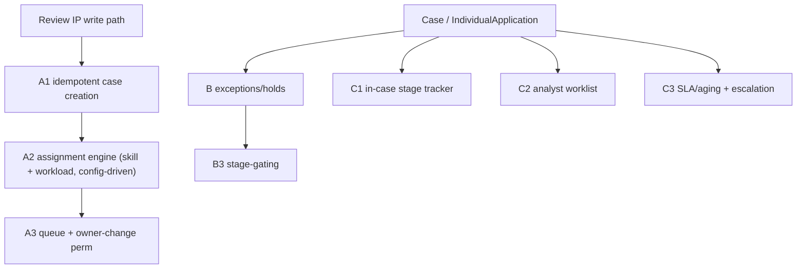

# Feature 3 — Enhanced Case Management: High-Level TDD & Estimation

**Date:** July 29, 2026
**Priority:** 2027 #3 — *Enhanced Case Management Functionality*
**Scope (confirmed with business):**
- **Work routing:** ALL — smarter/configurable assignment (skill + workload) **and** fix the duplicate-case/round-robin defects **and** queue/owner-change permission model.
- **Issue tracking:** track **exceptions/holds/blockers** on a case (why it's stuck).
- **Workflow visibility:** in-case stage tracker + analyst worklists + SLA/aging alerts **here**; pure reports/dashboards stay in **Feature 6**.
- **Estimate unit:** developer-days (baseline + AI-assisted), story-point range secondary.

> Estimation method per the shared note in `Feature1_PDM_PEAR_TDD_Estimation.md` §method.

---

## 1. Current State (audited, grounded)

- The "case" is the standard `Case` object (e.g. `Type = QC Review`) linked to `IndividualApplication` (Case Manager). Lifecycle on `IndividualApplication.PRM_Stage__c` (`Application Received → Application Review → QC Review → Sent To PDA → Case Complete → Complete`), `Status`, `PRM_DenialReason__c`, `PRM_CaseManagerAge__c`.
- **Routing = round-robin queue assignment**, invoked from the review IPs (`PRM_ReviewPSVCaseRecordsUpdate`, `PRM_ReviewParCaseRecordsUpdate`, `PRM_ReviewRecredCaseRecordsUpdate`, `PRM_DataUpdationforHAPACCommitteeReview`).
- **Known defect:** duplicate `QC Review` cases — two INSERTs seconds apart, double round-robin, orphaned case; **71 IAs** affected in QA ([Duplicate_QC_Cases_RootCause_Analysis.md](requirements/Duplicate_QC_Cases_RootCause_Analysis.md)).
- **Owner-change control:** custom permission `PRM_RestrictUsertochangeCaseManagerOwner` + validation rule `PRM_RestrictUserToChangeTheOwner`, currently only granted via the heavy `PRM_NetworkManagementQC` set — a lightweight decoupled permission set is already storied ([Permission_Set_Case_Manager_Owner_Change.md](requirements/Permission_Set_Case_Manager_Owner_Change.md)).
- **No** exception/hold tracking, **no** in-case visual stage tracker, **no** analyst worklist, **no** SLA/aging alerting exist today.

---

## 2. Gap Analysis

| # | Capability | Exists? | Gap |
|---|---|---|---|
| G1 | Duplicate-case prevention (idempotent case creation) | No (defect) | Idempotency guard on QC case insert |
| G2 | Smart/configurable assignment (skill + workload) | No (round-robin only) | Assignment engine + config metadata |
| G3 | Queue restructuring + lightweight owner-change perm set | Partial (storied) | Decouple perm; queue model |
| G4 | Exception/hold tracking on cases | No | Data model + UI + stage-gating |
| G5 | In-case visual stage tracker/timeline | No | LWC on record |
| G6 | Analyst worklist / my-queue with status + aging | No | LWC + selector |
| G7 | SLA / aging alerts + escalation | No | Aging calc + scheduled alerts/notifications |

---

## 3. High-Level TDD

### 3.1 Work routing (all)
- **A1. Idempotent case creation** — guard against duplicate QC case inserts (dedupe key on `PRM_CaseManager__c` + `Type` + open-status; `FOR UPDATE`/upsert-by-external-id pattern) invoked from the review IP write path.
- **A2. Assignment engine** — config-driven (Custom Metadata: routing rules by record type / stage / specialty), Apex assignment service supporting **skill-based** and **workload-balanced** distribution (query open-case counts per owner), replacing bare round-robin. Called from the same IP hooks.
- **A3. Queue + permission model** — restructure queues; build the lightweight `PRM_CaseManagerOwnerChange` permission set decoupled from `PRM_NetworkManagementQC`.

### 3.2 Issue tracking (exceptions/holds/blockers)
- **B1. Data model** — `PRM_CaseException__c` (or fields on Case): category/reason, raised-by, raised-on, resolved-by/on, status; related to Case/IA.
- **B2. UI** — raise/resolve exception from the case; surface active holds prominently.
- **B3. Stage-gating** — optionally block stage progression while an unresolved blocking hold exists; feed aging/visibility.

### 3.3 Workflow visibility
- **C1. In-case stage tracker** — LWC path/timeline showing `PRM_Stage__c` progression + active holds + age.
- **C2. Analyst worklist** — "my queue"/"team queue" LWC (status, stage, age, holds), backed by a selector; actionable (open/reassign).
- **C3. SLA/aging + escalation** — aging thresholds per stage (Custom Metadata), scheduled evaluation, Custom Notification/email escalation on breach.

### 3.4 Risks
- **R1 (Med):** Assignment engine touches the shared review IP write path used by multiple flows — regression surface across PSV/PAR/ReCred/Committee.
- **R2 (Med):** Duplicate-case root cause may be a double-fire in the IP/trigger chain; fix must be verified end-to-end.
- **R3 (Low-Med):** Overlap with Feature 6 (reporting) and Feature 5 (cross-team routing) — keep boundaries clean.

---

## 4. Estimation (developer-days)

### 4.1 Work routing

| Component | Baseline | AI-assisted | Notes |
|---|---:|---:|---|
| A1. Idempotent case creation (dedupe guard) | 4–6 | 3–4 | Fixes 71-IA defect class |
| A2. Assignment engine (skill + workload, config metadata) | 12–18 | 8–12 | Replaces round-robin; called from shared IP hooks |
| A3. Queue restructuring + lightweight owner-change perm set | 5–8 | 4–6 | |
| **Routing sub-total** | **21–32** | **15–22** | |

### 4.2 Issue tracking (holds)

| Component | Baseline | AI-assisted | Notes |
|---|---:|---:|---|
| B1. Exception/hold data model | 4–6 | 3–4 | Object/fields + relationships |
| B2. Raise/resolve UI + surface on case | 6–9 | 4–6 | LWC |
| B3. Stage-gating on active hold | 4–6 | 3–4 | |
| **Issue-tracking sub-total** | **14–21** | **10–14** | |

### 4.3 Workflow visibility

| Component | Baseline | AI-assisted | Notes |
|---|---:|---:|---|
| C1. In-case stage tracker/timeline LWC | 6–9 | 4–6 | |
| C2. Analyst worklist / my-queue LWC + selector | 8–12 | 5–8 | |
| C3. SLA/aging calc + scheduled escalation/notifications | 7–10 | 5–7 | |
| **Visibility sub-total** | **21–31** | **14–21** | |

### 4.4 Testing / UAT

| Component | Baseline | AI-assisted | Notes |
|---|---:|---:|---|
| Unit + integration (regression across review IPs) | 8–11 | 4–6 | |
| UAT (ops teams) | 4–5 | 4–5 | Not compressible |
| **Test sub-total** | **12–16** | **8–11** | |

### 4.5 Feature 3 total

| Area | Baseline dev-days | AI-assisted dev-days |
|---|---:|---:|
| Work routing | 21–32 | 15–22 |
| Issue tracking (holds) | 14–21 | 10–14 |
| Workflow visibility | 21–31 | 14–21 |
| Testing / UAT | 12–16 | 8–11 |
| **Feature 3 total** | **68–100** | **47–68** |

- **Story-point secondary:** ≈ **70–100 pts** — above the coarse ROM (40–70) once the assignment engine + holds model + SLA tooling are grounded.
- **T-shirt: L–XL.**
- **Confidence: Medium.**
- **Calendar (2 devs, AI-assisted):** ~**47–68 effort-days / 2 ≈ 5–7 weeks build**, ~2–3 months end-to-end with UAT.

---

## 5. Assumptions, Dependencies, Open Questions

**Assumptions**
- Built on the existing `Case` + `IndividualApplication` model; assignment engine augments (not fully replaces) queue infrastructure.
- Reports/dashboards are Feature 6; this feature delivers operational UI (tracker/worklist/alerts).

**Dependencies**
- Assignment engine hooks the shared review IPs — coordinate with Feature 2 (cred flows) and Feature 5 (cross-team routing).
- SLA/aging fields may feed Feature 6 reports.

**Open questions (for grooming)**
- Skill-based routing needs a skills model (per user/queue) — does one exist or is it net-new?
- Is exception/hold a new object (`PRM_CaseException__c`) or fields on Case/IA? (assumed new object)
- Escalation channel: Custom Notification, email, or both?

---

*Grounding references:* `requirements/Duplicate_QC_Cases_RootCause_Analysis.md`, `requirements/Permission_Set_Case_Manager_Owner_Change.md`, `requirements/PNC_Reports_Dashboard_UserStory.md`; review IPs `PRM_ReviewPSVCaseRecordsUpdate` / `PRM_ReviewParCaseRecordsUpdate` / `PRM_ReviewRecredCaseRecordsUpdate`; custom permission `PRM_RestrictUsertochangeCaseManagerOwner`.
