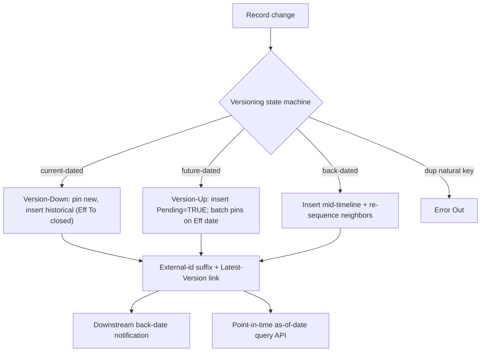

# Feature 4 — Full Provider Data Versioning / Change History / Audit: High-Level TDD & Estimation

**Date:** July 29, 2026
**Priority:** 2027 #4 — *Data Versioning / Change History / Audit Logging*
**Scope (confirmed with business):**
- **FULL effective-dated versioning** across **all provider objects in use** (~30 objects — per the *Provider Modeling Notes* workbook, all grains: practitioner, facility, address, network, contract hierarchy, program, taxonomy, etc.).
- **All drivers:** compliance/audit ("who changed what, when") **+** point-in-time reconstruction ("as of a date") **+** future-/back-dated effective changes.
- **Estimate unit:** developer-days (baseline + AI-assisted), story-point range secondary.

> Estimation method per the shared note in `Feature1_PDM_PEAR_TDD_Estimation.md` §method. This feature already has a dedicated, deep estimate — [Provider_Data_Versioning_Estimation.md](requirements/Provider_Data_Versioning_Estimation.md) — which this doc reconciles into ROM dev-days and grounds against the confirmed version scenarios.

---

## 1. Current State (audited, grounded)

- **Field History Tracking** is broadly enabled but is audit-only (18-month retention, 20-field/custom-object cap, no reconstruction).
- A **partial future-dated system** exists: `PRM_FutureDatedProcessing__c` + `PRM_FutureDatedProcessingBatchHandler` — in-place effective-date **activation** for ~8 objects. It does **not** do version-down, external-id suffixing, latest-version linkage, back-dating, or overlap prevention (gap table in the estimation doc §2).
- Several objects already carry `PRM_EffectiveFrom__c/PRM_EffectiveTo__c/PRM_Active__c` fields (Account, HCF, HFN, org-affiliation levels) — partial scaffolding, not a versioning engine.
- **Regression surface (measured):** ~501 Apex classes, 417 IPs, 1,338 DataRaptors, 57 OmniScripts reference these objects.

### 1.1 Confirmed versioning state machine (from the *Version Scenarios* workbook)
The business model is a **pinned-current** design (grounded in the linked sheet):
- The **current** record keeps a **stable Salesforce Id** and a **stable external key** (e.g. `NPI1234567`); historical versions get **suffixed external ids** (`NPI1234567_Jan1_Feb5…`) and a **Latest Version** lookup back to the pinned record, `Active=FALSE`.
- **Update / Version-Down:** on change, pin the new values on the current record and **insert a historical copy** for the prior state with `Eff From/To` closed.
- **Future-dated / Version-Up:** insert a **pending** future record (`Pending=TRUE`); on the effective date the batch **pins** it and closes the prior version.
- **Back-dated:** insert a version **into the middle** of the timeline and **re-sequence** neighbors' `Eff To` (hardest case).
- **Natural-key uniqueness → Error Out:** duplicate uniqueness keys are rejected (Natural Keys criteria).
- **Multi-type Address** (Primary/Mailing/Billing) splits on a per-type effective change.

---

## 2. Gap Analysis (from the estimation doc §2)

Full-build items (❌ today): Version-Down, external-id suffix management, Latest-Version reference, explicit Pending boolean, **back-dated** handling, overlap-prevention validation, action-restriction during pending window, downstream back-date notification, Version-Up UI workflow, and **~22 additional objects** beyond the ~8 the FDP batch covers.

---

## 3. High-Level TDD

### 3.1 Architecture
- **`PRM_VersioningService`** core: `versionDown()`, `versionUp()`, `pinCurrent()`, `setExternalIdSuffix()`, `closePriorVersion()`, `preventOverlap()`, applied uniformly per object.
- **State machine** implementing the four scenarios (simple update, future, back-date, error-out) with **natural-key** uniqueness enforcement.
- **Extend** `PRM_FutureDatedProcessingBatchHandler` for pending→pinned activation (Process 3) rather than replace.
- **Per-object integration:** trigger/handler + selector + service wiring + test factory, generated from the first (Account) pattern.
- **Point-in-time query API** (as-of-date reconstruction across related objects) for reporting/compliance.
- **Downstream notification** on back-dated changes (BCBSA/roster consumers).

### 3.2 Object tiers (~30 objects, from estimation doc §1)
- **Tier 1 (7):** Account, HealthcareProvider, HealthcareProviderNpi, HealthcarePractitionerFacility, HealthcareFacility, IndividualApplication (hardest — 63 IPs/57 OmniScripts), HealthcareFacilityNetwork.
- **Tier 2 (12):** L1/L2/L3 Org Affiliations + Practitioner Roles, ProgramParticipation, ContractHierarchy, HealthcareFacilityAssociation, HealthcareFacilityBundle, ProviderFeature, InfoCodeAssignment.
- **Tier 3 (~12+):** Identifier (licenses/DEA), BoardCertification, Taxonomy, Specialty, Address/Location, ContactPoint*, Person Language/Education/Employment, Ancillary Assessment, Degree/Institution, ProviderTypeAssignment.

### 3.3 Risks (estimation doc §HIGH)
- **R1 (High):** Architectural complexity (back-dating + overlap + pending-window locking) — AI does **not** remove this.
- **R2 (High):** Massive regression surface (501 classes / 417 IPs / 1,338 DRs / 57 OmniScripts) touching Health Cloud managed-package objects.
- **R3 (High):** `IndividualApplication` versioning during active credentialing needs lock semantics — senior-architect gated.
- **R4 (High):** **7 business pre-conditions** must be resolved before Phase 1 (human-gated, not tool-gated).
- **R5 (Med):** OmniStudio publish + UAT + BCBSA/CAQH integration testing are non-compressible bottlenecks.

---

## 4. Estimation (developer-days; reconciled from the existing estimate)

The dedicated estimate: **97.5 baseline dev-weeks → 44–54 AI-assisted dev-weeks** (~2×). Converted at 5 dev-days/week:

| Phase | Baseline dev-days | AI-assisted dev-days | Notes |
|---|---:|---:|---|
| Phase 1 — Architecture & framework (`PRM_VersioningService`, schema on 30 objects, FDP extend, back-date handler) | ~50 | ~25 | 7 business pre-conditions gate the start |
| Phase 2 — Tier 1 objects (7, incl. IndividualApplication) | ~105 | ~53 | First object (Account) costliest; pattern amortizes |
| Phase 2 — Tier 2 objects (12) | ~85 | ~40 | Org affiliations, roles, contract hierarchy |
| Phase 2 — Tier 3 objects (~12+) | ~90 | ~42 | Licenses/board/taxonomy/address/demographics |
| Phase 3 — Point-in-time query API + downstream notification | ~35 | ~18 | As-of-date reconstruction; BCBSA/roster notify |
| Phase 4 — Data migration (existing records → versioned model) | ~35 | ~15 | AI generates batch + loader manifests |
| Phase 5 — Regression + integration + UAT (incl. BCBSA/CAQH live) | ~75 | ~62 | Barely compresses; live-system gated |
| **Feature 4 total** | **~475–490** | **~220–270** | Matches 97.5 / 44–54 dev-weeks |

- **Story-point secondary:** ≈ **440–490 pts** — **an order of magnitude above** any coarse ROM anchor; this is the single largest engineering program in the 2027 list alongside Feature 2.
- **T-shirt: XXL.**
- **Confidence: Medium** on the range (deep prior estimate) / **HIGH risk** on execution.
- **Calendar:** per the estimation doc — **6 senior devs + Cursor → 5–7 months**; **4 senior devs + Cursor → 8–10 months**. Realistically a **full-year, dedicated-team** program.

> **Critical pre-condition (unchanged):** `PRM_FutureDatedProcessing__c` must be refactored first, and the 7 business decisions resolved, before Phase 1 build starts.

---

## 5. Assumptions, Dependencies, Open Questions

**Assumptions**
- "All objects in use" ≈ the ~30 provider objects enumerated in the estimation doc §1 / the modeling workbook (config/log/staging objects excluded).
- Pinned-current model with suffixed-external-id historical versions (per the confirmed *Version Scenarios*), not a separate `__History` object per object.

**Dependencies**
- **Blocks/entangles everything:** versioning changes the write path used by Features 1, 3, 5, 6, 7 — sequencing must treat this as a foundational program, not a parallel feature.
- BCBSA/roster downstream consumers must handle back-dated notifications.
- Natural-key definitions (workbook "Natural Keys" tabs) must be finalized to drive error-out.

**Open questions (for grooming)**
- Resolve the **7 business pre-conditions** (estimation doc §6) — e.g. definition of "downstream notification", lock rules during active credentialing.
- Confirm the final object list + natural keys from the workbook (multiple "Natural Keys" iterations exist — May/Sep/Oct).
- Is a phased rollout acceptable (Tier 1 in 2027, Tier 2/3 later) to de-risk, or is full coverage a single-year mandate?

---

*Grounding references:* `requirements/Provider_Data_Versioning_Estimation.md` (full WBS + risk), Google Sheet *Provider Modeling Notes Illustrations Helper* → tabs *Version Scenarios*, *Versioning and Error Out*, *Natural Keys*; existing `PRM_FutureDatedProcessing__c` + `PRM_FutureDatedProcessingBatchHandler`.
