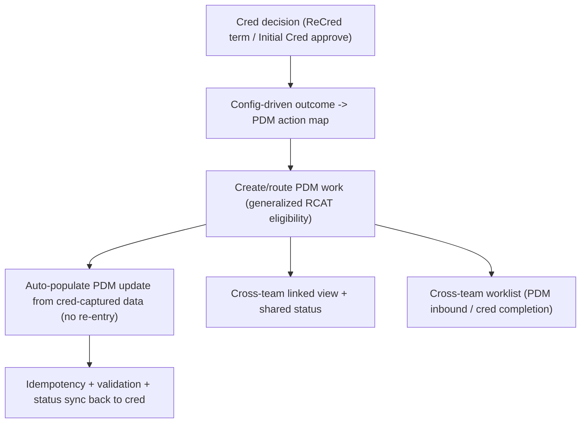

# Feature 5 — Integrate Credentialing & PDM: High-Level TDD & Estimation

**Date:** July 29, 2026
**Priority:** 2027 #5 — *Credentialing & PDM Integration Enhancements*
**Scope (confirmed with business):**
- **All three goals:** automated cred→PDM **handoff** + **shared cross-team views** + **unified data model** (eliminate dual entry).
- **Direction:** **one-way** cred → PDM (decisions/terms push to PDM work).
- **Tracks:** not specified by business → **proposed scope: Re-Cred (extend existing RCAT) + Initial Cred**, with **PAR as a stretch** (see §5).
- **Estimate unit:** developer-days (baseline + AI-assisted), story-point range secondary.

> Estimation method per the shared note in `Feature1_PDM_PEAR_TDD_Estimation.md` §method. **This feature overlaps Features 3 and 4 heavily — §4.5 gives both a gross and a de-duplicated "net-new" number.**

---

## 1. Current State (audited, grounded)

- **PDM-side actioning = RCAT (Recred Updates):** `PRM_ReviewRCAT_English` OmniScript + `PRM_RCATProcessingService`. It selects Case Managers by `Status='Pending Closure' AND PRM_RecredTerm__c=true AND RecordType=ReCredentialing` — **not** by stage ([ReCred_PSV_to_RCAT_DirectPush_Guide.md](requirements/ReCred_PSV_to_RCAT_DirectPush_Guide.md)).
- **Existing cred→PDM handoff is narrow:** a ReCred "direct-push" (PSV → Final Development → RCAT), plus `PRM_UpdateCaseManagerBatch` ("no CAQH access this month → RCAT") automation. **Initial Cred and PAR have no equivalent PDM handoff.**
- **Routing glue:** PNC (Provider Network Contract) + RCAT location-repoint patterns ([RCAT_RecredUpdates_PNC_LocationRepoint_UserStory.md](requirements/RCAT_RecredUpdates_PNC_LocationRepoint_UserStory.md), [PRM_PNC_Analysis.md](requirements/PRM_PNC_Analysis.md)).
- **No** cross-team shared views/worklists; **no** unified auto-populate — cred-captured data is re-keyed by PDM today.

---

## 2. Gap Analysis

| # | Capability | Exists? | Gap |
|---|---|---|---|
| G1 | Generalized cred-outcome → PDM-work handoff | Narrow (ReCred term only) | Config-driven mapping of cred outcome → PDM action |
| G2 | Initial Cred → PDM handoff | No | New handoff path + PDM work creation |
| G3 | Idempotent/status-synced handoff | Partial | Dedupe + status sync back to cred |
| G4 | Cross-team linked-record view + status sharing | No | LWC linking cred case ↔ PDM work |
| G5 | Cross-team worklist (incoming handoffs / completions) | No | LWC + selector |
| G6 | Unified model / auto-populate (no re-entry) | No | Cred data → PDM update mapping + validation |

---

## 3. High-Level TDD

- **A. Handoff engine:** generalize RCAT eligibility into a config-driven "cred outcome → PDM action" map (Custom Metadata), so decisions from ReCred **and** Initial Cred create the right PDM work item; idempotent creation + status sync back to the cred case.
- **B. Shared views:** LWC linking the cred Case Manager to the resulting PDM work with shared status; a cross-team worklist (PDM sees inbound handoffs, cred sees PDM completion).
- **C. Unified data / no re-entry:** map cred-captured fields (demographics, licenses, term reasons) into the PDM update so PDM doesn't re-key; conflict/dup validation on apply.

### 3.1 Risks
- **R1 (High):** **Cross-team process definition** is a business decision (who owns what, when a handoff fires) — not AI-compressible; gates the build.
- **R2 (High – accounting):** **Double-counting** with Feature 3 (routing/worklists) and Feature 4 (unified/versioned data model). Net-new must be scoped to avoid paying twice.
- **R3 (Med):** Touches the shared cred write path + RCAT service — regression surface across ReCred/Initial flows.

---

## 4. Estimation (developer-days)

### 4.1 Handoff engine

| Component | Baseline | AI-assisted | Notes |
|---|---:|---:|---|
| A1. Generalize handoff (config-driven outcome→PDM map) | 12–18 | 8–12 | Extends RCAT eligibility |
| A2. Initial Cred → PDM handoff path | 10–15 | 6–10 | Net-new track |
| A3. Idempotency + status sync back to cred | 5–7 | 3–5 | Overlaps F3 dedupe |
| **Handoff sub-total** | **27–40** | **17–27** | |

### 4.2 Shared cross-team views

| Component | Baseline | AI-assisted | Notes |
|---|---:|---:|---|
| B1. Linked-record view + shared status LWC | 8–12 | 5–8 | |
| B2. Cross-team worklist LWC + selector | 8–11 | 5–7 | Overlaps F3 worklist |
| **Views sub-total** | **16–23** | **10–15** | |

### 4.3 Unified data / no re-entry

| Component | Baseline | AI-assisted | Notes |
|---|---:|---:|---|
| C1. Cred→PDM field mapping + auto-populate | 10–15 | 6–10 | Overlaps F4 model work |
| C2. Conflict/dup validation on apply | 4–6 | 3–4 | |
| **Unified sub-total** | **14–21** | **9–14** | |

### 4.4 Discovery + testing/UAT

| Component | Baseline | AI-assisted | Notes |
|---|---:|---:|---|
| Cross-team process-definition spike | 3–4 | 3–4 | Human-gated |
| Unit + integration (regression across cred + RCAT) | 7–10 | 4–6 | |
| Cross-team UAT | 6–8 | 6–8 | Not compressible |
| **Discovery+test sub-total** | **16–22** | **13–18** | |

### 4.5 Feature 5 total (gross vs. net-of-overlap)

| View | Baseline dev-days | AI-assisted dev-days |
|---|---:|---:|
| **Gross** (all workstreams) | **73–106** | **49–74** |
| **Net-new for F5** (after removing overlap billed to F3 routing/worklist + F4 unified model) | **~50–75** | **~34–52** |

- **Story-point secondary:** gross ≈ **75–105 pts**; **net-new ≈ 50–75 pts** — the coarse ROM (40–80) understated the gross but is close to **net-new**. Recommend booking **net-new** to avoid double-count.
- **T-shirt: L** (net-new).
- **Confidence: Medium** (Med-Low on track scope until confirmed).
- **Calendar (2 devs, AI-assisted, net-new):** ~**34–52 effort-days / 2 ≈ 4–5 weeks build**, ~2 months with cross-team UAT. **Sequence after** Feature 2 (cred direction) and alongside Feature 3.

---

## 5. Assumptions, Dependencies, Open Questions

**Assumptions**
- One-way cred→PDM (no reverse re-verification trigger in 2027).
- Proposed track scope: **Re-Cred + Initial Cred**; **PAR is a stretch** (+~12–18 baseline / ~8–12 AI-assisted dev-days if added).
- Built on the existing RCAT/PNC plumbing, not a new integration bus (both teams in PIE).

**Dependencies**
- **Feature 3** provides the routing/worklist substrate — build shared views on top, don't duplicate.
- **Feature 4** provides the unified/versioned model — the "no re-entry" mapping should consume it.
- **Feature 2** must set cred-flow direction first (tiles change the capture surface).

**Open questions (for grooming)**
- Confirm tracks (Re-Cred / Initial / PAR) and the exact cred-outcome → PDM-action matrix.
- Which PDM work object receives Initial-Cred handoffs (RCAT is ReCred-shaped today)?
- Ownership/SLA for handed-off work (ties to Feature 3 routing).

---

*Grounding references:* `requirements/ReCred_PSV_to_RCAT_DirectPush_Guide.md`, `requirements/RCAT_RecredUpdates_PNC_LocationRepoint_UserStory.md`, `requirements/PRM_PNC_Analysis.md`; `PRM_ReviewRCAT_English` / `PRM_RCATProcessingService` / `PRM_UpdateCaseManagerBatch`.
