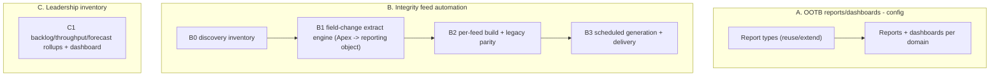

# Feature 6 — Inventory Management & Reporting: High-Level TDD & Estimation

**Date:** July 29, 2026
**Priority:** 2027 #6 — *Inventory Management & Reporting Enhancements*
**Scope (confirmed with business):**
- **All three:** OOTB reports/dashboards **+** integrity/operational **feed automation** (replace manual Excel feeds) **+** work-**inventory** management views.
- **Integrity feed count:** **unknown → discovery inventory required** (the main effort driver; estimate below assumes ~4–8 feeds with a sensitivity note).
- **Inventory views:** proposed as a **separate leadership/capacity layer** (backlog, throughput, forecasting) **on top of** Feature 3's analyst worklists (base worklists booked to F3).
- **Estimate unit:** developer-days (baseline + AI-assisted), story-point range secondary.

> Estimation method per the shared note in `Feature1_PDM_PEAR_TDD_Estimation.md` §method.

---

## 1. Current State (audited, grounded)

- **OOTB reporting is config, not code.** [PNC_Reports_Dashboard_UserStory.md](requirements/PNC_Reports_Dashboard_UserStory.md): the PNC report/dashboard set (by stage, opened/closed/denied, denials, aging, bypass-vs-regular, by owner) is built on the existing `PRM_CaseManagerReportType` (base `IndividualApplication`) — **no Apex/OmniStudio** for most; occasional custom report type (`Case_Manager_with_Accounts`).
- **Integrity reporting is the hard part.** [IntegrityReporting_InitialCredReview_BusinessOverview.md](requirements/Reporting/IntegrityReporting_InitialCredReview_BusinessOverview.md): replaces a **manual Excel feed** with a Salesforce-native export — 18 columns, **one row per tracked field change** (App Review/PSV events + admin events). Field History isn't directly reportable in that shape → needs an **extract mechanism** (Apex → reporting object, or scheduled export).
- **Work-inventory** worklists/aging overlap Feature 3; a leadership backlog/throughput view does not exist.

---

## 2. Gap Analysis

| # | Capability | Exists? | Gap |
|---|---|---|---|
| G1 | Standard report set + dashboards across domains (PNC/cred/PDM/ancillary) | Partial (PNC done as pattern) | Extend to other domains; some custom report types |
| G2 | Feed inventory (what manual feeds exist + mappings) | No | Discovery inventory |
| G3 | Field-change-granularity extract engine | No | Apex extract → reporting object (one row per change) |
| G4 | Per-feed Salesforce-native builds + legacy parity | No (1 mapped) | Build + validate each feed |
| G5 | Scheduled generation + delivery | Partial (report subscriptions) | Automate export/delivery |
| G6 | Leadership inventory (backlog/throughput/forecast) | No | Rollups + dashboard on top of F3 |

---

## 3. High-Level TDD

- **A. OOTB:** reuse `PRM_CaseManagerReportType`; add custom report types where cross-object joins are needed; build report set + dashboards per domain.
- **B. Integrity automation:** discovery inventory of manual feeds → a **field-change extract engine** (Apex batch reading Field History / tracked changes into a queryable reporting object shaped "one row per change") → per-feed report builds validated against the legacy Excel → scheduled generation + delivery.
- **C. Leadership inventory:** aging/backlog/throughput rollups (scheduled) + a capacity/forecast dashboard layered on Feature 3's worklist data.

### 3.1 Risks
- **R1 (Med-High):** Integrity feed **count + complexity unknown** — dominates the estimate; discovery gates it.
- **R2 (Med):** Field-history-to-report shaping (one-row-per-change) is non-trivial; FHT retention limits may force a reporting object.
- **R3 (Low-Med):** Overlap with Feature 3 (worklists) and Feature 4 (history data source) — keep boundaries clean.

---

## 4. Estimation (developer-days)

### 4.1 OOTB reports & dashboards

| Component | Baseline | AI-assisted | Notes |
|---|---:|---:|---|
| A1. Report types (extend/create where joins needed) | 3–5 | 3–4 | Config; limited AI leverage |
| A2. Report set + dashboards across domains | 8–14 | 6–10 | Config-heavy |
| **OOTB sub-total** | **11–19** | **9–14** | |

### 4.2 Integrity/operational feed automation (assumes ~4–8 feeds)

| Component | Baseline | AI-assisted | Notes |
|---|---:|---:|---|
| B0. Discovery inventory + column mappings | 4–6 | 4–5 | Gates the rest |
| B1. Field-change extract engine (Apex → reporting object) | 12–18 | 8–12 | Reusable across feeds |
| B2. Per-feed build + legacy parity (~4–8 feeds) | 16–40 | 10–24 | ~3–5 base / ~2–3 AI per feed |
| B3. Scheduled generation + delivery | 4–6 | 3–4 | |
| **Integrity sub-total** | **36–70** | **25–45** | Sensitive to feed count |

### 4.3 Leadership inventory

| Component | Baseline | AI-assisted | Notes |
|---|---:|---:|---|
| C1. Backlog/throughput/forecast rollups + dashboard | 8–12 | 5–8 | On top of F3 worklists |
| **Inventory sub-total** | **8–12** | **5–8** | |

### 4.4 Testing / UAT

| Component | Baseline | AI-assisted | Notes |
|---|---:|---:|---|
| Report parity validation + UAT | 6–9 | 5–7 | Parity vs legacy Excel not compressible |

### 4.5 Feature 6 total

| Area | Baseline dev-days | AI-assisted dev-days |
|---|---:|---:|
| OOTB reports/dashboards | 11–19 | 9–14 |
| Integrity feed automation (~4–8 feeds) | 36–70 | 25–45 |
| Leadership inventory | 8–12 | 5–8 |
| Testing / UAT | 6–9 | 5–7 |
| **Feature 6 total** | **61–110** | **44–74** |

- **Feed-count sensitivity:** at 1–2 feeds subtract ~15 baseline/~10 AI; at 10+ feeds add ~20 baseline/~12 AI.
- **Story-point secondary:** ≈ **60–110 pts** — above the coarse ROM (30–60) once integrity-feed automation (not just OOTB dashboards) is grounded.
- **T-shirt: L** (XL if many integrity feeds).
- **Confidence: Low-Med** (feed count unknown) → **run B0 discovery first to firm this up.**
- **Calendar (2 devs, AI-assisted):** ~**44–74 effort-days / 2 ≈ 5–8 weeks build**, ~2–3 months with parity UAT.

---

## 5. Assumptions, Dependencies, Open Questions

**Assumptions**
- Most dashboards are OOTB config; only integrity feeds and the extract engine need code.
- Field-change feeds source from Field History / tracked changes (or Feature 4's versioned history if delivered).
- Base analyst worklists are Feature 3; only the leadership inventory layer is booked here.

**Dependencies**
- **Feature 4** (history/versioning) is the ideal data source for field-change feeds — sequence after or design the extract to consume it.
- **Feature 3** worklist data feeds the leadership inventory rollups.

**Open questions (for grooming)**
- Run the **feed discovery inventory (B0)** — exact count + which need field-change granularity vs summary.
- Delivery mechanism: report subscription, scheduled file export, or downstream system?
- Confirm the leadership inventory is wanted separately from F3 worklists.

---

*Grounding references:* `requirements/PNC_Reports_Dashboard_UserStory.md`, `requirements/Reporting/IntegrityReporting_InitialCredReview_BusinessOverview.md`; report type `PRM_CaseManagerReportType`, base object `IndividualApplication`.
