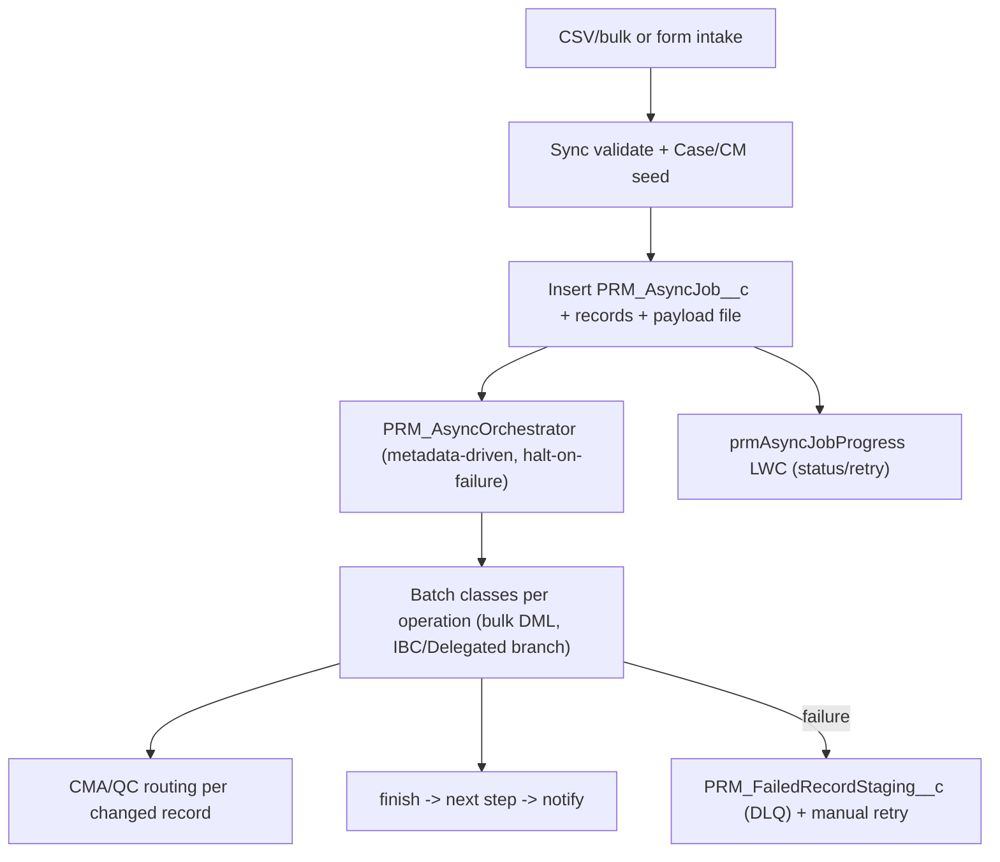

# Feature 7 — Mass Data Loads (Async Engine + Bulk Operations): High-Level TDD & Estimation

**Date:** July 29, 2026
**Priority:** 2027 #7 — *Mass Data Load Capabilities*
**Scope (confirmed with business):**
- **Build the reusable async/bulk engine** (the designed-not-built `PRM_AsyncJob__c` framework) **and add mass operations on top of it**.
- **Refactor the 3 existing high-volume flows** onto the engine.
- **Many (7+) distinct mass operations / object domains** (address, demographics, network, term, taxonomy, program, contract, …).
- **Estimate unit:** developer-days (baseline + AI-assisted), story-point range secondary.

> Estimation method per the shared note in `Feature1_PDM_PEAR_TDD_Estimation.md` §method. **This is a foundational program — the engine is reused by Feature 1 (PEAR QC intake), Feature 5, and others.**

---

## 1. Current State (audited, grounded)

- **Reusable async engine = designed, not built.** `CLAUDE.md` specifies the full `PRM_AsyncJob__c` framework (Epics A–G): metadata-driven async (`PRM_AsyncJobConfig__mdt`), orchestrator (`PRM_AsyncOrchestrator`), five batch classes, `PRM_AsyncJobDetails__c`/`PRM_AsyncJobRecords__c`, DLQ (`PRM_FailedRecordStaging__c`), progress LWC, cleanup batch. Pilot (framework + Practitioner Creation) budgeted at **~60 engineer-days**. `force-app` is an **empty scaffold** for it. It natively supports **CSV upload (N records per submission)**.
- **3 high-volume flows need async refactor** ([PRM_HighVolume_Processing_SK_Estimation.md](requirements/PRM_HighVolume_Processing_SK_Estimation.md)): Practitioner Creation, PDM Manual Practitioner, PDM Manual Practice Location — synchronous IP chains creating 6–15 objects/txn, hitting governor/UI limits. Estimate **36 baseline / 18–22 AI-assisted dev-days** (includes some infra that the engine now absorbs).
- **One mass operation fully architected:** mass address update ([PNM_MassAddressUpdate_FullStack_Architecture.md](requirements/Enhancements/PNM_MassAddressUpdate_FullStack_Architecture.md)) — Tax-ID/NPI fan-out, CMA-based QC, bulk write, capitated-bundle handling.

---

## 2. Gap Analysis

| # | Capability | Exists? | Gap |
|---|---|---|---|
| G1 | Async engine (job/orchestrator/batch/DLQ/retry/LWC) | Designed only | Full build (Epics A–G core) |
| G2 | CSV/bulk intake (validate → enqueue → async apply) | Designed only | Build intake wrapper + validator |
| G3 | Refactor 3 existing high-volume flows onto engine | No | Move to async batch execution |
| G4 | Mass operations (7+): address/demog/network/term/taxonomy/program/contract | 1 architected | Build validators + batch services + QC routing per op |
| G5 | Progress/monitoring + retry UX | Designed only | Build LWC + DLQ/retry |

---

## 3. High-Level TDD

- **A. Engine (Epics A–D + F core):** async objects + config MDT (A), foundation base classes (B), orchestrator + batch base + LWC + cleanup (C), selectors (D), intake wrapper + payload validator (F).
- **B. Refactor 3 flows:** re-point the 3 high-volume OmniScript/IP flows to validate-then-enqueue; move record creation into batch services on the engine.
- **C. Mass operations (7+):** per operation = typed payload + validator + batch service(s) (one bulk DML per object type) + QC/CMA routing + tests. Mass address is the reference implementation; others amortize off it.
- **D. Ops/monitoring:** progress LWC, DLQ, manual retry (resume from failed step), cleanup.

### 3.1 Risks
- **R1 (Med-High):** Foundational build with many consumers — engine design must be right before ops pile on.
- **R2 (Med-High):** 7+ ops each carry their own field-map sign-off (CL-11 pattern) + QC routing + parity — **op count dominates effort**.
- **R3 (Med):** Governor/perf validation per batch step (CL-10); idempotency/dedupe on retry (R5).
- **R4 (Med):** Overlap with Feature 1 (PEAR QC intake), Feature 4 (versioned writes), Feature 5 — sequence engine first.

---

## 4. Estimation (developer-days)

### 4.1 Async engine (Epics A–D + F core)

| Component | Baseline | AI-assisted | Notes |
|---|---:|---:|---|
| A. Async objects + config MDT + permset | 6–8 | 4–5 | |
| B. Foundation base classes (utility, service base) | 6–8 | 4–5 | |
| C. Orchestrator + batch base + progress LWC + DLQ/retry + cleanup | 22–28 | 14–18 | Largest engine piece |
| D. Selectors (reuse/extend) | 6–9 | 4–6 | |
| F. Intake wrapper + payload validator + CSV parse | 10–14 | 6–9 | |
| Engine tests (framework-level, ≥85%) | 8–11 | 4–6 | |
| **Engine sub-total** | **58–78** | **36–49** | |

### 4.2 Refactor 3 high-volume flows (on the engine)

| Component | Baseline | AI-assisted | Notes |
|---|---:|---:|---|
| Practitioner Creation + PDM Practitioner + PDM Practice Location → batch services | 24–32 | 14–19 | Cheaper than Story-K's 36 since engine absorbs infra |
| **Refactor sub-total** | **24–32** | **14–19** | |

### 4.3 Mass operations (7+)

| Component | Baseline | AI-assisted | Notes |
|---|---:|---:|---|
| Op 1 — mass address (architected reference impl) | 20–28 | 13–18 | Fan-out + CMA/QC + bundle |
| Ops 2–7 — demographics/network/term/taxonomy/program/contract (~6 @ 10–15 base / 7–10 AI) | 60–90 | 42–60 | Amortize off op 1 |
| **Mass-ops sub-total (7 ops)** | **80–118** | **55–78** | +~12 base/~8 AI per extra op |

### 4.4 Testing / UAT

| Component | Baseline | AI-assisted | Notes |
|---|---:|---:|---|
| Integration + perf (per-batch governor) + shadow parity + UAT | 25–35 | 18–26 | Perf/parity barely compress |

### 4.5 Feature 7 total

| Area | Baseline dev-days | AI-assisted dev-days |
|---|---:|---:|
| Async engine | 58–78 | 36–49 |
| Refactor 3 flows | 24–32 | 14–19 |
| Mass operations (7+) | 80–118 | 55–78 |
| Testing / UAT | 25–35 | 18–26 |
| **Feature 7 total** | **187–263** | **123–172** |

- **Op-count sensitivity:** each mass operation beyond 7 adds ~**12 baseline / ~8 AI-assisted** dev-days.
- **Story-point secondary:** ≈ **185–260 pts** — far above any coarse anchor; this is a foundational multi-quarter program.
- **T-shirt: XXL.**
- **Confidence: Medium** (Low-Med on the 7+ op count — firm up the op list).
- **Calendar:** engine first (blocking), then ops in parallel. With 3 devs AI-assisted, ~**123–172 effort-days ≈ 2–3 quarters**.

---

## 5. Assumptions, Dependencies, Open Questions

**Assumptions**
- Engine = the `CLAUDE.md` `PRM_AsyncJob__c` design (halt-on-failure, metadata-driven, CSV intake).
- Each mass op routes through QC/CMA (consistent with Feature 1 external-submission model).
- "7+" ops confirmed; op list to be finalized (address is the anchor).

**Dependencies**
- **Foundational for Feature 1** (PEAR QC intake), **Feature 5** (handoff at volume), and should align with **Feature 4** (versioned writes).
- Resolve open async clarifications in `CLAUDE.md` (CL-6 async target scope, CL-11 field maps per op, CL-15 batch↔service mapping).

**Open questions (for grooming)**
- Confirm the **exact mass-operation list** (7+) and their object domains + QC rules.
- Do mass ops write through Feature 4's versioning engine (if delivered) or the current model?
- Volume tiers per op (drives Batch vs Queueable sizing).

---

*Grounding references:* `CLAUDE.md` (async framework Epics A–G), `requirements/PRM_HighVolume_Processing_SK_Estimation.md`, `requirements/Enhancements/PNM_MassAddressUpdate_FullStack_Architecture.md`; `docs/implementation-plan/*` (Epic A/C/E).
