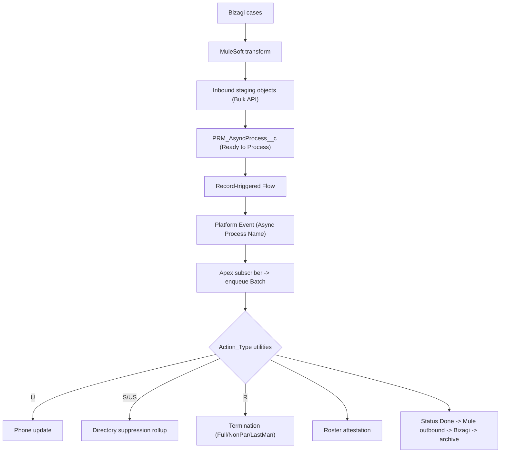

# Feature 8 — Lexis Nexis Integration + Compliance: High-Level TDD & Estimation

**Date:** July 29, 2026
**Priority:** 2027 #8 — *Lexis Nexis Integration & Compliance Mandates*
**Scope (confirmed with business):**
- **Lexis Nexis:** build per the provided **LexisNexis Integration Design** (Google Doc) — inbound data feed replacing/extending VEDA (phone update, directory suppression, practitioner termination, roster attestation).
- **Compliance:** **unknown** → **discovery spike + reserved capacity envelope** (Low confidence).
- **Estimate unit:** developer-days (baseline + AI-assisted), story-point range secondary.

> Estimation method per the shared note in `Feature1_PDM_PEAR_TDD_Estimation.md` §method.

---

## 1. Current State (audited, grounded)

**From the LexisNexis Integration Design doc + modeling workbook (LexisNexis tab):**
- **Purpose:** validate Practitioner & Practice-Location data. IBX sends provider/claims feeds out (via **DART → VEDA/LexisNexis**); LexisNexis returns recommendations via **Bizagi → MuleSoft → Salesforce**. Reuses the **existing SF↔DART** integration outbound.
- **Architecture (inbound):** MuleSoft transforms Bizagi cases → **inbound staging objects** (Bulk API) → creates a **`PRM_AsyncProcess__c`** record (status → "Ready to Process") → **record-triggered Flow** publishes a **Platform Event** (`PRM_Async_Process_Name__c`) → **Apex subscriber** enqueues a **Batch** → utilities process by `Action_Type` → status → "Done" → Mule fetches results → transforms back to Bizagi (outbound) → archive staging. **This is the existing `PRM_AsyncProcess__c` roster-sync pattern (NOT the new `PRM_AsyncJob__c` framework of Feature 7).**
- **Four action types + roster:**
  1. **Phone Number Update ("U")** — US 1169206 — update Address `PRM_Phone__c` (Primary/Practice + Billing/Mailing when shared) + future-dated; soft-term + recreate `PRM_ContactMethod__c`; external-id rules; Source Case Number + FHT.
  2. **Directory Suppression/Un-suppression ("S"/"US")** — US 1154663 — flip `PRM_IsDirectoryPrint__c` on HFN (`PRM_FacilityPractitionerTxNw`) with **PLT/PPLTN rollup** logic (last-practitioner → location-level).
  3. **Practitioner Terminations ("R")** — **the hard one** — Full vs Non-Par vs **Last-Man-Standing** cascade term across ~15 object types (Practitioner, HCP, taxonomy, NPI, Identifier, board cert, provider feature, info code, HCPF, PL summary, associations, bundles, program participation…), primary-location reassignment, future-dated handling, directory suppression, close open case manager.
  4. **Roster Attestation File Upload** — US 1169207 — staging → batch updates `HealthcarePractitionerFacility.PRM_AttestationDate__c/By__c`.
- **Existing GUS stories** (1169205/06/07, 1154663) indicate this is specced/backlogged; assume **not yet built** (no LexisNexis Apex/batch in `force-app`).
- **Compliance:** **no mandate spec** in the repo (CBSA/CMS/NCQA unspecified).

---

## 2. Gap Analysis

| # | Capability | Exists? | Gap |
|---|---|---|---|
| G1 | Inbound staging objects + Async Process + platform event + flow + subscriber + batch scaffold | Pattern exists (`PRM_AsyncProcess__c`) | Wire LexisNexis-specific staging + config |
| G2 | Phone Number Update utility | No | Build ("U") |
| G3 | Directory Suppression/Un-suppression utility | No | Build ("S"/"US") with rollup |
| G4 | Practitioner Termination utility | No | Build ("R") — Full/Non-Par/Last-Man-Standing |
| G5 | Roster Attestation upload | No | Build |
| G6 | Outbound-to-Bizagi support + archival | No | SF-side result exposure + archive |
| G7 | Compliance mandate(s) | No spec | Discovery + reserved build |

---

## 3. High-Level TDD

- **Utility-based approach** (per doc): shared utilities across Guided Flow / Batch / Integration for reuse + consistency; robust error handling + `PRM_ExceptionLogger`.
- **No reconciliation** of stale data (explicit assumption); latest-case-wins; one action type per case.
- **Source Case Number** field + FHT added on Address, ContactMethod, HCF, HFN, Account.

### 3.1 Risks
- **R1 (High):** **Practitioner Termination cascade** (Full/Non-Par/Last-Man-Standing across ~15 objects + primary reassignment + future-dated) is genuinely complex and error-prone — dominant risk.
- **R2 (Med-High):** Multi-system integration testing (Mule/Bizagi/DART/VEDA) is live-system gated, not AI-compressible.
- **R3 (Med):** Interaction with future-dated processing (Feature 4) and address trigger overlap logic (documented false-positive class).
- **R4 (High – compliance):** Compliance is undefined — cannot estimate a build, only a spike + reserved envelope.

---

## 4. Estimation (developer-days)

### 4.1 Lexis Nexis integration (grounded in the design doc)

| Component | Baseline | AI-assisted | Notes |
|---|---:|---:|---|
| Inbound staging + Async Process + platform event + flow + subscriber + batch scaffold | 12–18 | 8–12 | Reuses `PRM_AsyncProcess__c` pattern |
| Utility "U" — Phone Number Update (address + contact method + future-dated + ext-id) | 8–12 | 5–8 | US 1169206 |
| Utility "S/US" — Directory Suppression rollup (HFN + PLT/PPLTN) | 10–15 | 6–10 | US 1154663 |
| Utility "R" — Practitioner Termination (Full/Non-Par/Last-Man-Standing cascade) | 25–38 | 16–25 | **Hardest**; ~15 objects + primary reassignment |
| Roster Attestation upload (staging + batch + HCPF update) | 8–12 | 5–8 | US 1169207 |
| Outbound-to-Bizagi SF support + archival + Source Case Number/FHT fields | 6–9 | 4–6 | |
| **LN build sub-total** | **69–104** | **44–69** | |
| Unit tests (≥85%) | 10–14 | 5–8 | |
| Integration testing (Mule/Bizagi/DART live) + UAT | 15–22 | 15–22 | Not compressible |
| **LN total** | **94–140** | **64–99** | Confidence Medium (well-specced) |

### 4.2 Compliance (unknown → spike + reserved envelope)

| Component | Baseline | AI-assisted | Notes |
|---|---:|---:|---|
| Compliance discovery spike (identify mandate(s), deadline, scope) | 3–5 | 3–5 | Gates any build |
| Reserved capacity envelope (TBD mandate build) | 20–40 | 15–30 | Placeholder — **Low confidence** |
| **Compliance total** | **23–45** | **18–35** | |

### 4.3 Feature 8 total

| Area | Baseline dev-days | AI-assisted dev-days |
|---|---:|---:|
| Lexis Nexis integration | 94–140 | 64–99 |
| Compliance (spike + reserved) | 23–45 | 18–35 |
| **Feature 8 total** | **117–185** | **82–134** |

- **Story-point secondary:** ≈ **115–185 pts** — far above the earlier Low-confidence coarse anchor, now that the LexisNexis design is grounded (esp. the termination cascade).
- **T-shirt: XL.**
- **Confidence:** Lexis Nexis **Medium** (detailed doc) · Compliance **Low** (undefined).
- **Calendar (2 devs, AI-assisted):** LN ~**64–99 effort-days / 2 ≈ 7–10 weeks build**, ~3 months with integration testing; compliance TBD after spike.

---

## 5. Assumptions, Dependencies, Open Questions

**Assumptions**
- Uses the existing `PRM_AsyncProcess__c` roster-sync async pattern (per the doc), **not** Feature 7's new engine.
- MuleSoft/Bizagi/DART do the transform + outbound; Salesforce owns inbound staging → processing → result exposure.
- No stale-data reconciliation on Salesforce side (explicit design assumption).
- Compliance = a reserved envelope until a mandate is specified.

**Dependencies**
- Termination cascade interacts with **Feature 4** future-dated/versioning — coordinate.
- MuleSoft/Bizagi/DART/VEDA availability for integration testing (external teams).
- The linked spec/mapping sheets (inbound staging, external-id) must be final.

**Open questions (for grooming)**
- **Define the compliance mandate(s)** + deadline (drives the reserved envelope into a real estimate).
- Are US 1169205/06/07 & 1154663 already partially built? (assumed not).
- Confirm VEDA→LexisNexis is a vendor swap on the same pipes vs a new pipeline.

---

*Grounding references:* Google Doc *LexisNexis Integration Design* (US 1169205/1169206/1169207/1154663); modeling workbook *LexisNexis* tab; existing `PRM_AsyncProcess__c` + roster-sync pattern; `PRM_RosterAttestationStaging__c`.
