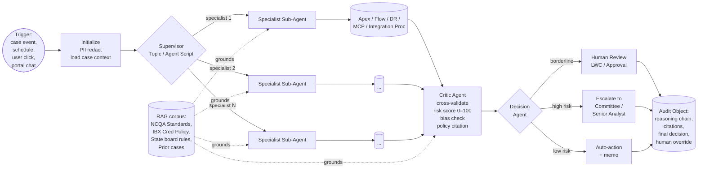
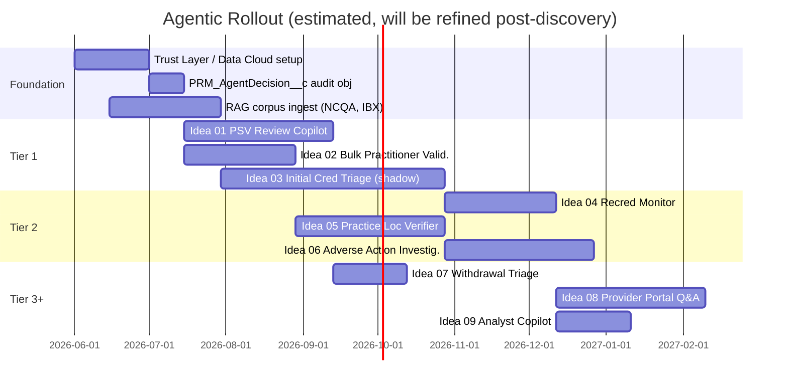

# Strategy: AgenticAI for Credentialing & PDM

**Document Version:** 1.0
**Created:** 2026-05-22
**Vertical:** Provider Network Management (PNM) — Independence Blue Cross (IBX)
**Audience:** PNM leadership, Architecture, Compliance, Credentialing Operations
**Status:** Discovery / proposal

---

## 1. Why now

Three forces converged in the last 6 months:

1. **Salesforce Agentforce reached production maturity** for healthcare workflows — Agent Script (deterministic + LLM hybrid), Einstein Trust Layer (PHI-safe by default), Intelligent Context (low-code unstructured ingestion), and the Atlas Reasoning Engine.
2. **The team has direct hands-on experience** with the underlying patterns. Multi-agent systems with supervisor/critic/decision orchestration, RAG over private policy documents, HITL escalation, and bias detection are no longer research — they are in `~/Documents/AgenticAI/` notebooks the team has already built and tested.
3. **The PDM/Credentialing backlog is dense with high-effort, low-judgment, audit-heavy work** — exactly the workload class where supervised AI agents create the most leverage. PSV, recred chase work, sanction monitoring, address reconciliation, bulk-load validation, withdrawal triage — every one of these is "read documents, apply policy, draft an output, escalate edge cases".

This document proposes how to take those patterns into IBXQA production safely.

---

## 2. The opportunity

Credentialing, recred, and PDM today are bounded by **analyst hours**. Most of an analyst's day is structured work — pull a PSV source, compare to policy, write a note, route the case. The 2–5% of the day that is genuine judgment (committee escalation, nuanced sanction interpretation, borderline education equivalency) is where their expertise actually matters.

| Workload class | % of analyst time today (estimated) | Agent fit |
|----------------|-------------------------------------:|-----------|
| Pulling primary source data (license, OIG, NPDB, NPI) | ~30% | **High** — pure tool-calling |
| Comparing source data to NCQA / IBX policy | ~20% | **High** — RAG + structured comparison |
| Drafting decision memos / case notes | ~15% | **High** — Writer + Critic pattern |
| Cross-validating across multiple sources for conflicts | ~10% | **Medium** — Critic agent excels here |
| Borderline judgment / committee preparation | ~15% | **Low** — agent assists, human decides |
| Provider correspondence / status updates | ~10% | **High** — drafted, analyst signs |

A reasonable starting hypothesis: **40–50% of structured analyst minutes are eligible for agent-drafted output with human review.** The goal is not headcount reduction — it is reducing case cycle time (faster network growth) and freeing analysts to focus on the borderline cases where they are uniquely qualified.

---

## 3. The 9 ideas at a glance

Each is detailed in `ideas/IdeaNN_*.md`. Ranked by recommended build order:

| # | Idea | Tier | Mortgage-notebook analog | Effort | Risk |
|---|------|:---:|---|:---:|:---:|
| 01 | **PSV Review Copilot** (LWC-embedded) | 1 | LinkedIn Multi-Agent Writer + Critic | M | Low |
| 02 | **Bulk Practitioner Validation Agent** | 1 | Financial Analyst tool calls + ranking | M | Low |
| 03 | **Initial Credentialing Triage Agent** | 1 | Senior Mortgage Underwriting (full pattern) | XL | Medium |
| 04 | **Recredentialing Proactive Monitor** | 2 | Autonomous Financial Analyst (proactive) | L | Medium |
| 05 | **Practice-Location Verification Agent** (PDM) | 2 | LexAgent jurisdictional reasoning | L | Low |
| 06 | **Adverse-Action Investigator** | 2 | LexAgent + Critic pattern | L | Medium |
| 07 | **Application Withdrawal Triage Agent** | 3 | LinkedIn Writer (templated drafting) | S | Low |
| 08 | **Provider Portal Q&A Agent** | 3 | Agentforce Service Agent (out-of-the-box) | M | Low |
| 09 | **Credentialing Analyst Copilot** ("ask my book of work") | 4 | Single agent + tools | S | Low |

Effort: S = ≤1 sprint, M = 1–2 sprints, L = 1 quarter, XL = 2+ quarters in shadow mode.

---

## 4. Reference architecture

Every idea in this folder follows the same shape, lifted directly from the mortgage notebook:

**Components in IBXQA terms:**

| Layer | IBXQA implementation |
|-------|----------------------|
| Supervisor / orchestration | Agentforce **Topic** + **Agent Script** |
| Specialist sub-agents | Agentforce **Sub-agents** (or grouped Agent Actions) |
| Tools | **Apex Invocable Actions**, **Flows**, **DataRaptors**, **Integration Procedures**, **MCP servers** |
| RAG corpus | **Salesforce Knowledge** + **Data Cloud Vector DB** (or **Intelligent Context** if licensed) |
| PII / safety | **Einstein Trust Layer** (zero data retention, masking, toxicity) |
| Bias guardrails | Trust Layer + custom **protected-class scanner** for credentialing-specific terms |
| HITL | **LWC** with embedded Agentforce panel, or **Approval Process** |
| Audit | New custom object `PRM_AgentDecision__c` with linked `PRM_AgentDecisionStep__c` lines |
| Test harness | **AiEvaluationDefinition** + `sf agent test run` |

---

## 5. Recommended sequencing

See `03_Roadmap_Sequencing.md` for the full plan. Headline:

---

## 6. Success metrics

Track these on a credentialing operations dashboard from day one (well before any agent ships, so we have a baseline):

**Throughput**
- Median days from "application complete" to "committee decision"
- PSV cycle time (per source, per provider)
- Recred packet send-out hit rate vs. anniversary date

**Quality**
- Re-work rate (cases sent back from committee for missing info)
- Audit finding rate per 100 closed files
- Provider correspondence accuracy (% letters re-issued)

**Agent-specific**
- Agent-to-human agreement rate (in shadow mode and after)
- Override rate (analyst rejects agent draft)
- Citation grounding rate (% agent claims with valid source)
- Bias-flag rate per 1,000 outputs
- Mean time to escalate (agent → human)

**Operational**
- Cost per closed credentialing file (analyst hours + LLM tokens)
- Analyst satisfaction (quarterly survey)
- Provider-portal self-service deflection rate

---

## 7. Risks & mitigations

| Risk | Likelihood | Impact | Mitigation |
|------|:----------:|:------:|------------|
| Hallucinated NCQA citation in a decision memo | Medium | High | Mandatory RAG grounding + Critic agent verifies every citation against retrieved source; reject the response if any citation is not in the retrieved chunk set |
| PHI leak via external LLM call | Low | Critical | Einstein Trust Layer zero data retention; PII redaction layer in Agent Script; quarterly red-team prompt-injection drills |
| Disparate-impact (bias) finding by regulator | Low | Critical | Mortgage-notebook style `detect_bias_signals` + statistical fairness monitoring (disparate-impact ratio per protected class) on the audit object; quarterly fairness report |
| Analyst over-trust ("rubber-stamping" agent drafts) | High | High | UX requires explicit "I reviewed source X" checkbox before signing; sample-audit overrides; agent confidence shown prominently |
| Agent drift after LLM model upgrade | High | Medium | Pinned model version; eval suite (`sf agent test run`) gates every prompt/model change; comparison report against baseline |
| Vendor lock-in to Agentforce | Medium | Low | Agent Script abstracts most logic; Apex actions are reusable; specs in this folder are framework-agnostic |
| NCQA / state regulator pushback on AI-assisted decisions | Medium | High | Engage compliance early; shadow mode with statistical agreement reporting before turning anything autonomous; full reasoning-chain audit trail mandatory |

---

## 8. What success looks like in 12 months

- **PSV Review Copilot** is in production, with >70% analyst-accept rate on first-pass drafts and measurable reduction in PSV cycle time.
- **Bulk Practitioner Validation** has cut the new-practitioner-to-active time by half, with <2% false-positive reject rate.
- **Initial Credentialing Triage** has run in shadow mode for 6 months on every Initial Cred case, with documented agreement metrics presented to the credentialing committee. A pilot scope (e.g., low-risk specialties) is live in **assist mode** (agent recommends, analyst decides).
- **Adverse-Action Investigator** is drafting QC case write-ups for analyst review.
- **Recred Proactive Monitor** is running nightly and feeding a risk-ranked worklist to the recred team.
- The **PRM_AgentDecision__c** audit object holds a complete reasoning chain for every agent action, queryable by compliance and exportable for NCQA audit.
- **Bias / fairness dashboard** has been published to compliance and PNM leadership for two consecutive quarters.

---

## 9. What we are *not* doing

To set expectations clearly:

- **Not** replacing the Credentialing Committee — every committee-eligible case still goes to committee.
- **Not** building a generic LLM chatbot — every agent has a narrowly scoped job, defined tools, and a measurable output.
- **Not** taking on autonomous decision authority for any clinical/network/contractual decision in v1. All decision authority remains with named humans.
- **Not** training custom models — every agent uses Agentforce-supported foundation models with prompts grounded in our RAG corpus.
- **Not** ingesting raw PHI into any non-Salesforce-hosted LLM service.

---

*See `01_Patterns_From_AgenticAI_Notebooks.md` and `02_Notebook_to_Agentforce_Mapping.md` for the technical foundation behind these proposals.*
