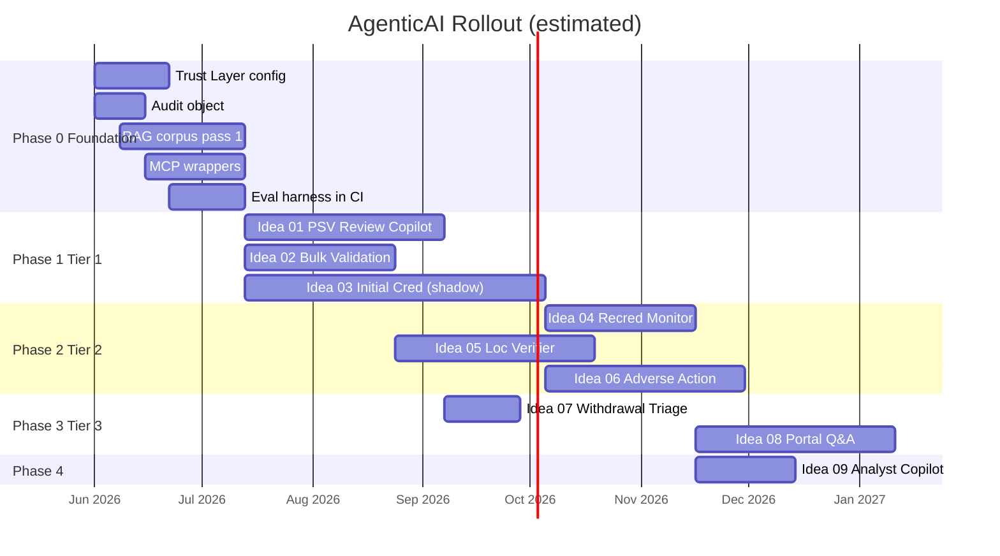

# Roadmap & Sequencing

> Phased delivery plan for the 9 AgenticAI ideas, with dependencies, effort, gates, and kill criteria.

---

## 1. Guiding principles

1. **Foundation before features.** No agent ships until Trust Layer config, RAG corpus ingest, and the `PRM_AgentDecision__c` audit object are live.
2. **Lowest decision authority first.** Drafters and validators (no autonomous decision power) ship before deciders.
3. **Shadow mode is mandatory** for any agent whose output influences a credentialing decision. Minimum 60 days of shadow before shifting to assist mode.
4. **One agent in flight at a time per product engineer** — these systems are subtle; over-parallelizing leads to half-finished agents and broken eval suites.
5. **Eval-first, not prompt-first.** Every agent gets its `AiEvaluationDefinition` checked in before its production prompt is finalized.

---

## 2. Phase 0 — Foundation (~6 weeks)

**Outcome:** A reusable agent platform layer is live in QA. No production-facing agent yet.

| Workstream | Owner | Deliverable | Gate |
|---|---|---|---|
| Trust Layer enablement | Platform Architect | Trust Layer rules configured for PHI, NPI, DEA, license #, SSN. Custom `PRM_BiasScanner` deployed. | Verified by red-team prompt-injection drill |
| `PRM_AgentDecision__c` + `PRM_AgentDecisionStep__c` | Platform Eng | Custom objects + permission sets + reporting views | All fields populated by sample run; SOQL aggregations validated |
| RAG corpus build — Pass 1 | Knowledge Engineering | NCQA 2025 Standards + IBX Credentialing Policy ingested into Data Cloud Vector DB (or Intelligent Context if licensed) | Retrieval recall ≥0.85 on 50 hand-labeled credentialing questions |
| MCP wrapper layer | Integrations | NPPES, OIG/LEIE, SAM.gov MCP servers wrapped (or AgentExchange installs evaluated) | Each MCP returns valid response in <2s p95 from QA |
| Eval harness in CI | DevEx | `sf agent test run` integrated into PR pipeline | A failing eval blocks merge on a sample agent |

**Kill criteria for Phase 0**

- If Trust Layer cannot be configured to redact medical license # or DEA before LLM call → escalate to Salesforce; do not proceed.
- If RAG retrieval recall is <0.7 on the labeled set → corpus chunking strategy needs rework before any agent ships.

---

## 3. Phase 1 — Tier 1 ideas in parallel (~12 weeks)

**Outcome:** Three agents in QA / UAT, with one (PSV Review Copilot) starting a controlled production pilot.

| Idea | Effort | Mode at end of phase | Dependencies |
|------|:-----:|---|---|
| **01: PSV Review Copilot** | M (8 wks) | **Pilot** in production for 2 specialties, ≤5 analysts | Phase 0 + `PSV_Review_LWC_Redesign_Detailed_Design.md` LWC ready |
| **02: Bulk Practitioner Validation Agent** | M (6 wks) | **Pilot** behind a feature flag | Phase 0 + `BulkPractitionerCreation_Mockup.html` LWC ready |
| **03: Initial Credentialing Triage Agent** | XL (12+ wks, parallel) | **Shadow mode** — agent runs but never affects routing | Phase 0; reuses verifier sub-agents that get built here |

**Sequencing inside Phase 1**

1. Idea 01 has no agent decision authority — start it first as the team learns the platform.
2. Idea 02 is mostly tool-calling — second product engineer can take it in parallel.
3. Idea 03's verifier sub-agents (License, Education, Work History, Sanctions, Malpractice) are *the same components* used by Ideas 04 and 05 later. Building them well here pays back for the next 6 months.

**Phase 1 exit gates**

- PSV Review Copilot: ≥70% analyst-accept rate on first-pass drafts; <5% citation-grounding failures; bias-flag rate baseline established.
- Bulk Practitioner Validation: <2% false-positive reject rate against analyst-validated holdout set; <10% false-negative.
- Initial Cred Triage (shadow): ≥80% agreement with committee verdict on closed cases; full reasoning chain captured for every shadow run.

**Kill criteria for Phase 1**

- PSV Copilot analyst-accept rate <40% after 30 days of pilot → pause, root-cause prompt/RAG, restart.
- Initial Cred Triage shadow agreement <60% after 60 days → pause, redesign critic agent.

---

## 4. Phase 2 — Tier 2 expansion (~10 weeks)

**Outcome:** Three more agents live in QA, two of them in production pilot.

| Idea | Effort | Mode | Dependencies |
|---|:-----:|---|---|
| **04: Recredentialing Proactive Monitor** | L (6 wks) | **Pilot** to one recred team | Phase 1 verifier sub-agents (Ideas 03 components) |
| **05: Practice-Location Verification Agent** | L (8 wks) | **Pilot** behind feature flag in `prmAddressGroupManager` | Phase 0 + existing `PRM_AddressValidationService` (Precisely) + `PRM_LocationQueryService` |
| **06: Adverse Action Investigator** | L (8 wks) | **Shadow mode** | Phase 0 + Phase 1 critic-agent pattern |

**Phase 2 exit gates**

- Recred Monitor: produces a risk-ranked worklist nightly; team lead validates ranking quality on first 30 days; recred-anniversary-miss rate trend improves.
- Practice-Location Verifier: <3% false-merge rate on dedup recommendations; analyst time on address reconciliation drops measurably.
- Adverse Action Investigator: shadow agreement with QC analyst write-ups ≥75%; precedent-retrieval relevance ≥0.7.

---

## 5. Phase 3 — Tier 3 (provider-facing & lightweight) (~8 weeks)

| Idea | Effort | Mode |
|---|:-----:|---|
| **07: Application Withdrawal Triage Agent** | S (3 wks) | Production assist mode |
| **08: Provider Portal Q&A Agent** | M (8 wks) | Production with human handoff |

Idea 07 plugs into the live `Nonroutine_ApplicationWithdrawal_UserStory.md` flow once that ships.

Idea 08 uses the standard out-of-the-box Agentforce Service Agent pattern — most of the work is RAG corpus and tool wrapping for "where is my case" queries.

---

## 6. Phase 4 — Internal copilot (~4 weeks)

| Idea | Effort | Mode |
|---|:-----:|---|
| **09: Credentialing Analyst Copilot** | S (4 wks) | Production for credentialing analysts |

Last because it depends on the Phase 0–3 audit data and trained patterns. By Phase 4 the team has a deep library of tools, prompts, and evaluations to reuse.

---

## 7. Cross-phase: continuous improvement loops

These never stop:

- **Weekly bias / fairness review** — pull `PRM_AgentDecision__c` aggregates per agent, look for protected-class disparities, file remediation tickets.
- **Override rate review** — when analysts override an agent's recommendation, capture *why*; feed into prompt updates and eval cases.
- **Eval expansion** — every production override or audit finding becomes a new test case in `AiEvaluationDefinition`.
- **Model upgrade calibration** — each LLM model version refresh requires re-running the full eval suite and a 7-day shadow comparison before promoting.
- **RAG corpus refresh** — quarterly NCQA / IBX policy refresh; immediate refresh on state regulation changes.

---

## 8. Headcount sketch

This is **estimate only** — refine once Phase 0 is sized in detail.

| Role | Phase 0 | Phase 1 | Phase 2 | Phase 3+ |
|---|:-:|:-:|:-:|:-:|
| Salesforce platform engineer (Apex, LWC, OmniStudio) | 1.0 | 2.0 | 2.0 | 1.5 |
| Agentforce specialist (prompts, eval, Agent Script) | 0.5 | 1.0 | 1.0 | 0.5 |
| Knowledge / RAG engineer | 0.5 | 0.5 | 0.5 | 0.25 |
| QA / eval author | 0.25 | 0.5 | 0.5 | 0.25 |
| Compliance liaison | 0.25 | 0.25 | 0.25 | 0.1 |
| Credentialing SME (part-time, embedded) | 0.25 | 0.5 | 0.5 | 0.25 |

---

## 9. Decision log placeholders

Track decisions made during the rollout here (or move to a separate ADR folder if it grows):

- [ ] Agentforce license tier selected
- [ ] Intelligent Context vs. custom Data Cloud Vector DB
- [ ] OIG/LEIE/SAM MCP — buy from AgentExchange vs. build
- [ ] PRM_BiasScanner term list — sign-off by Compliance
- [ ] Shadow-mode minimum duration — 60 days vs 90 days
- [ ] Model pinning policy (which model id, refresh cadence)
- [ ] Provider portal Q&A scope — what topics are out of scope (clinical advice, contractual disputes)

---

## 10. Sequencing visual

---

*Refine quarterly. Hold a Phase-N retrospective before starting Phase-(N+1).*
