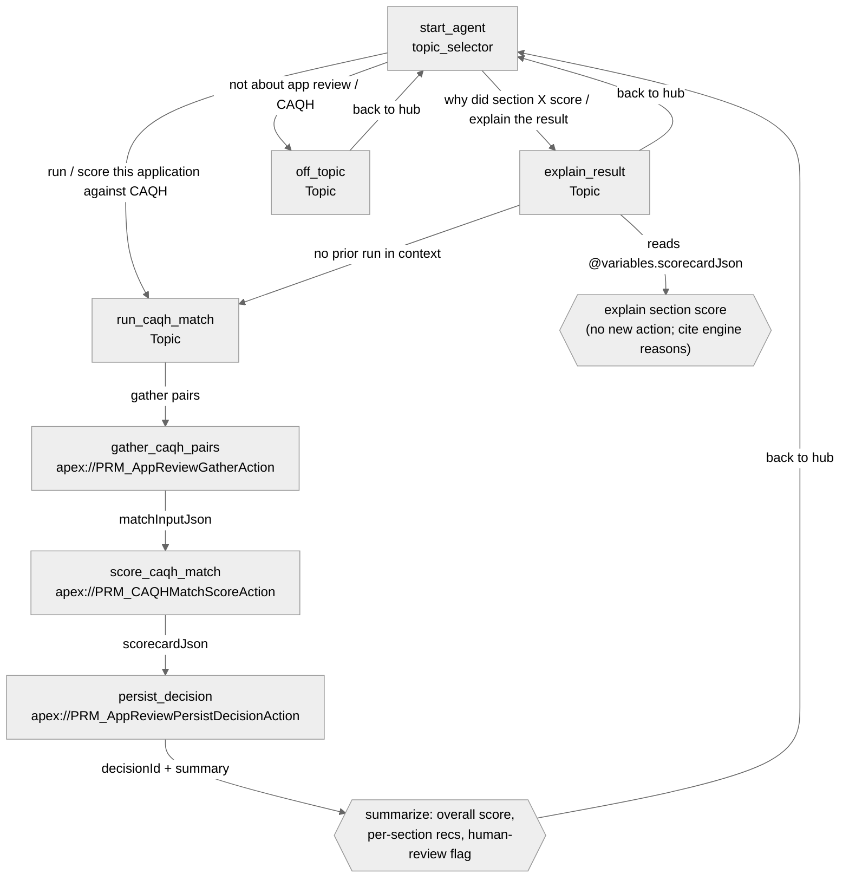

# Agent Spec: PRM_App_Review_CAQH_Match

> Status: **APPROVED 2026-06-11** — numeric strategy: strings + `scorecardJson` only (no numeric action I/O). Trigger: side-panel button (v1).
> Companion design: `requirements/AgenticAI/ideas/Idea10_App_Review_CAQH_Match_Agent.md`

## Purpose & Scope

An **employee** agent for credentialing analysts that, given an initial-credentialing application, validates the application's data against CAQH and returns a 0–100 match scorecard with per-section recommendations, then writes a full audit record. It **assists** — it recommends "Data Looks Good / Review / Missing Information" per section and an overall score; the analyst still makes the verdict. It never sets the attestation/decision on the application itself (v1).

Scope: initial credentialing, individual practitioners, the existing `PRM_InitialCredentialAppReview_English` review sections (License, DEA, Malpractice, Specialty/Board, Education, etc.). Out of scope (v1): recredentialing, ancillary providers, the no‑CAQH/Universal Application path, and writing corrected values back to the application.

## Behavioral Intent

- **Must know before acting:** which Case/application it is reviewing. The agent needs either the assembled review-screen data (`omniDataJson`) or a `caqhId` (+ practitioner form) to run headless. If neither is available, it asks the analyst rather than guessing.
- **Backing logic:** three existing `@InvocableMethod` Apex actions, run as a deterministic chain — **gather → score → persist**. The score is computed by a deterministic, unit‑tested Apex engine (no LLM math), so it is reproducible and audit‑defensible. The LLM's job is routing, explanation, and summarization only.
- **Guardrails:**
  - Off‑topic / non‑credentialing questions → `off_topic`, no actions invoked.
  - The agent presents the engine's numbers verbatim; it must **not** invent or re‑estimate scores.
  - When `humanReviewRequired = True` (a hard‑fail fired or overall < 90), the agent explicitly tells the analyst this needs human review and must not phrase the result as an approval.
  - Every completed run is persisted to `PRM_AgentDecision__c` before the agent reports success.
- **Persists across topics:** `caseId`, `scorecardJson`, `overallScore`, `hasHardFlag`, `decisionId`, `humanReviewRequired` — so the analyst can ask follow‑up "why did License score 72?" questions after a run without re‑executing the chain.

## Topic Map

Architecture: **hub-and-spoke** with a sequential action **chain** inside `run_caqh_match`.

## Variables

- `caseId` (mutable string = "") — the credentialing Case/application under review. Set by: user input or record context. Read by: gather + persist.
- `omniDataJson` (mutable string = "") — assembled review-screen data, when supplied by the side panel/LWC. Set by: user/host context. Read by: gather.
- `caqhId` (mutable string = "") — CAQH provider id for headless mode. Set by: user input. Read by: gather.
- `matchInputJson` (mutable string = "") — aligned App↔CAQH field pairs. Set by: gather. Read by: score.
- `scorecardJson` (mutable string = "") — full deterministic scorecard. Set by: score. Read by: persist + `explain_result`.
- `overallScore` (mutable number = 0) — 0–100 overall match. Set by: score. Read by: summary + gating.
- `hasHardFlag` (mutable boolean = False) — any hard‑fail fired. Set by: score. Read by: summary.
- `humanReviewRequired` (mutable boolean = False) — hard‑flag OR score < 90. Set by: persist. Read by: summary phrasing guardrail.
- `decisionId` (mutable string = "") — persisted `PRM_AgentDecision__c` Id. Set by: persist. Read by: summary.

## Actions & Backing Logic

### gather_caqh_pairs (run_caqh_match topic)

- **Target:** `apex://PRM_AppReviewGatherAction`
- **Backing Status:** EXISTS (built, dry-run validated; not yet deployed)

#### Inputs
| Name | Type | Required | Source |
|------|------|----------|--------|
| omniDataJson | string | No* | `@variables.omniDataJson` |
| caqhId | string | No* | `@variables.caqhId` |
| practitionerFormJson | string | No | host context (headless mode) |
| selectedDegree | string | No | host context |
| caseId | string | No | `@variables.caseId` |

\* One of `omniDataJson` (preferred) or `caqhId` (headless) is required; the action returns a message if neither yields data.

#### Outputs
| Name | Type | Visible to User? | Source | Notes |
|------|------|-------------------|--------|-------|
| matchInputJson | string | No | Computed | Feeds the score action |
| caqhAvailable | boolean | Yes | Computed | If False, tell analyst CAQH returned nothing |
| sectionCount | integer | Yes | Computed | How many sections were aligned |
| caqhProviderJson | string | No | IP (headless) | Raw CAQH provider snapshot |
| message | string | Yes | Computed | Diagnostic when gather is incomplete |

### score_caqh_match (run_caqh_match topic)

- **Target:** `apex://PRM_CAQHMatchScoreAction`
- **Backing Status:** EXISTS

#### Inputs
| Name | Type | Required | Source |
|------|------|----------|--------|
| matchInputJson | string | Yes | `@variables.matchInputJson` (from gather) |
| caseId | string | No | `@variables.caseId` |

#### Outputs
| Name | Type | Visible to User? | Source | Notes |
|------|------|-------------------|--------|-------|
| overallScore | number → **object + complex_data_type_name** | Yes | Engine | See numeric I/O note below |
| hasHardFlag | boolean | Yes | Engine | |
| scoredSectionCount | integer | Yes | Engine | |
| scorecardJson | string | No | Engine | Stored to a variable for persist + explain |
| summary | string | Yes | Engine | Plain-language one-liner |

### persist_decision (run_caqh_match topic)

- **Target:** `apex://PRM_AppReviewPersistDecisionAction`
- **Backing Status:** EXISTS

#### Inputs
| Name | Type | Required | Source |
|------|------|----------|--------|
| scorecardJson | string | Yes | `@variables.scorecardJson` (from score) |
| caseId | string | No | `@variables.caseId` |
| accountId | string | No | host context |
| agentVersion | string | No | literal (e.g. "1.0.0") |
| triggerType | string | No | literal "User" |
| finalDecision | string | No | literal "Assist" |
| summary | string | No | host/LLM memo (optional) |
| latencyMs | number | No | omit in v1 |
| humanReviewerId | string | No | running user |

#### Outputs
| Name | Type | Visible to User? | Source | Notes |
|------|------|-------------------|--------|-------|
| decisionId | string | Yes | Inserted record | Surface as the audit reference |
| stepCount | integer | Yes | Computed | |
| overallScore | number → object | Yes | Echo | |
| humanReviewRequired | boolean | Yes | Computed | Drives summary phrasing guardrail |
| message | string | Yes | Computed | |

## Gating Logic

- `score_caqh_match` available when `@variables.matchInputJson != ""` — never score before a successful gather.
- `persist_decision` available when `@variables.scorecardJson != ""` — never persist before a successful score.
- `explain_result` instructions read `@variables.scorecardJson`; when it is `""`, route the analyst to `run_caqh_match` first instead of fabricating an explanation.

## Numeric I/O note (publish-blocker to handle at build time)

The score/persist actions expose `overallScore` as a numeric (`Decimal`). Per Agent Script rules, **bare `number` action I/O fails at publish** — at build time these must be wrapped as `object` with a `complex_data_type_name`, OR the agent should consume the already-formatted `summary`/`message` strings and treat `scorecardJson` as the structured carrier. Decision to confirm at build: prefer passing the string `summary` to the user and keeping numbers inside `scorecardJson`, avoiding numeric action outputs entirely.

## Architecture Pattern

Hub-and-spoke. `start_agent topic_selector` routes to `run_caqh_match` (the worker), `explain_result` (read-only Q&A over the last scorecard), or `off_topic`. `run_caqh_match` is a deterministic three-action chain with gates so steps cannot run out of order. Each topic transitions back to the hub.

## Agent Configuration

- **developer_name:** `PRM_App_Review_CAQH_Match`
- **agent_label:** `App Review CAQH Match`
- **agent_type:** `AgentforceEmployeeAgent` — used internally by credentialing analysts from a Case record / side panel; no customer-facing channel. (Therefore **no** `default_agent_user`, `connection messaging:`, or MessagingSession variables.)
- **default_agent_user:** N/A (forbidden for employee agents)

## Decisions locked (2026-06-11)

1. **Numeric I/O strategy:** strings + `scorecardJson` only. Actions surface the string `summary`/`message` to the analyst and carry structure in `scorecardJson`; no numeric values cross an action boundary as `number` (sidesteps the publish-blocker).
2. **Trigger (v1):** a **button on the side-panel LWC** launches the agent with `caseId` and (when available) `omniDataJson` already in context — the agent does not have to ask which case. Future: auto-trigger when an App Review case is created.

## Still to confirm before live preview/publish

- **Org enablement** — Einstein Generative AI + Agentforce on in QA. (Employee agents need no `default_agent_user`, but org features must be enabled.)
- **Deploy dependency** — the three Apex actions + audit objects are validated but **not yet deployed**; they must be deployed before live‑action preview.
