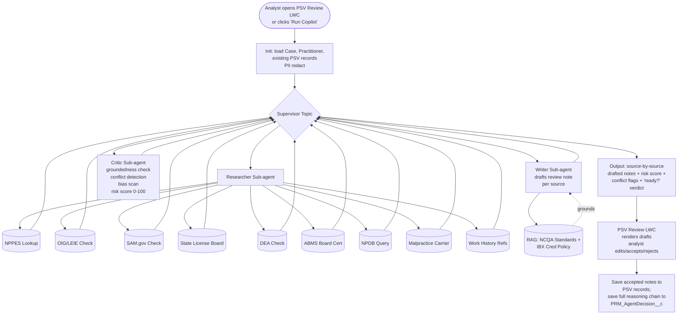

# Idea 01 — PSV Review Copilot (LWC-embedded)

**Tier:** 1 (recommended **first** build)
**Notebook analog:** Multi-Agent LinkedIn Post Creator (Researcher → Writer → Critic → Groundedness)
**Effort:** M (8 weeks)
**Risk:** Low — agent is a *drafter*, not a *decider*. Analyst signs every output.
**Status:** Proposed

---

## 1. Problem

Today, Primary Source Verification is the longest single step in credentialing cycle time. An analyst reviewing a PSV file must:

1. Pull each primary source one at a time (state license boards, OIG/LEIE, SAM.gov, NPDB, NPPES NPI Registry, DEA, ABMS board cert, malpractice insurance, work history references, education verifications).
2. Read each result and compare it manually against NCQA standards and IBX credentialing policy.
3. Type free-form review notes for each source ("license verified, expires 2027-01-15, no actions").
4. Identify and document any conflicts between sources.
5. Decide whether the file is clean enough for committee or needs follow-up.

This is the textbook **Researcher → Writer → Critic** loop from the Multi-Agent LinkedIn notebook, applied to PSV. Most of the work is structured retrieval + drafting; the human judgment is concentrated in conflict resolution and final sign-off.

---

## 2. Goal

Embed an Agentforce panel directly inside the **PSV Review LWC** (already in flight per `requirements/PSV_Review_LWC_Redesign_Detailed_Design.md`) that:

1. **Pulls every PSV source for the practitioner** (Researcher).
2. **Drafts review notes per source** with citations to the retrieved data and to the relevant NCQA/IBX policy passage (Writer).
3. **Self-checks** that every claim in the draft is grounded in a retrieved source — rejects ungrounded claims (Critic).
4. **Highlights conflicts** between sources (e.g., NPI Registry says active, OIG says excluded).
5. **Surfaces a summary risk score** and a "ready for committee?" recommendation.
6. **Lets the analyst edit, accept, or reject** every drafted note before saving. Nothing persists without explicit analyst action.

The agent never decides anything. It drafts and flags. The analyst signs.

---

## 3. Personas

| Persona | What they get |
|---|---|
| Credentialing Analyst (primary user) | Faster file review, less typing, automatic conflict detection, less context-switching across portals |
| Credentialing Manager | Better cycle-time metrics, clearer audit trail, fewer re-work loops |
| Compliance / NCQA auditor | Complete reasoning chain on every PSV review, citations to source documents |

---

## 4. Existing IBXQA components leveraged

| Component | Path | Role |
|---|---|---|
| `prmPSVReview` LWC (redesigned) | `force-app/main/default/lwc/prmPSVReview*` (per `PSV_Review_LWC_Redesign_Detailed_Design.md`) | Host UI; embeds Agentforce panel |
| `PRM_NPPESLookupController` (or new MCP) | TBD | NPPES NPI Registry lookup tool |
| Existing OIG / LEIE / SAM.gov integration (or new MCP) | TBD | Sanctions check tools |
| `PRM_AddressManagementService` | `force-app/main/default/classes/PRM_AddressManagementService.cls` | For practice-location cross-checks during PSV |
| Trust Layer | Org-level | PHI / NPI / DEA redaction |
| `PRM_AgentDecision__c` + `PRM_AgentDecisionStep__c` | (new, see `02_Notebook_to_Agentforce_Mapping.md`) | Audit trail |
| Salesforce Knowledge / Data Cloud Vector | (new RAG corpus) | NCQA Standards + IBX Cred Policy chunked & indexed |

---

## 5. Architecture

### 5.1 Diagram



### 5.2 Sub-agents and prompts

| Sub-agent | Job | Tools | RAG | Output schema |
|---|---|---|---|---|
| **Researcher** | Call every PSV source for the practitioner. Return raw structured data per source. | NPPES, OIG/LEIE, SAM.gov, state board, DEA, ABMS, NPDB, malpractice, work history | None (data gathering only) | `{[sourceName]: {raw, status, fetchedAt}}` |
| **Writer** | For each source, draft a 2–4 sentence review note in IBX house style, citing the source data + applicable NCQA/IBX policy. | None (only LLM + RAG) | NCQA Standards, IBX Cred Policy | `{[sourceName]: {draftNote, citations: [{policyRef, chunkId}]}}` |
| **Critic** | (a) For every claim in every draft note, verify the claim references a fact in `Researcher.output` or a passage in `Writer.citations`. Reject ungrounded claims. (b) Detect cross-source conflicts (e.g., license active vs. OIG excluded). (c) Run bias scan. (d) Compute risk score 0–100. | None | None | `{citationGroundedness: float, conflicts: [...], biasFlags: [...], riskScore: int, readyForCommittee: bool, rationale: string}` |

### 5.3 Risk score formula (initial — calibrate after shadow data)

```
riskScore =
    20  if any source returned 'sanctioned' or 'excluded'
  +  5  per cross-source conflict
  +  5  if license expires in <60 days
  +  5  if NPDB has a settled malpractice claim in last 5 years
  +  3  if work history has a >6 month gap
  + 10  per missing critical source (could not fetch)
  +  3  per missing non-critical source
clamped to [0, 100]
```

Recommendation thresholds (initial):
- `riskScore < 15` → "Looks ready for committee. Analyst review remaining."
- `15 ≤ riskScore < 40` → "Address flagged items, then ready for committee."
- `riskScore ≥ 40` → "Recommend escalation / additional documentation."

The agent **never sets** committee-ready or escalation status — it only displays the recommendation. Analyst makes every call.

---

## 6. UX

### 6.1 Where the agent shows up

Inside the redesigned PSV Review LWC, add a **right-rail panel** ("Copilot") that:

- Shows a "Run Copilot" button at the top of the panel.
- Once run, displays a card per PSV source: source name, raw data summary (collapsible), drafted review note (editable), citations (click to view source chunk), accept/edit/reject buttons.
- Above the source cards, shows a header strip: overall risk score (0–100 with color), conflict count, "ready for committee?" recommendation, citation grounding %.
- Includes an "Open audit trail" link → navigates to the linked `PRM_AgentDecision__c` record.

### 6.2 Analyst interaction model

For each source:
- **Accept** → drafted note copies into the official PSV note field. Tracked in audit object as `accepted=true`.
- **Edit then Accept** → saves the analyst-edited version. Diff captured in audit.
- **Reject** → discards the draft. Analyst types their own. Audit captures the reject + reason.

For the overall recommendation, the analyst still uses the existing PSV LWC controls — Copilot is informational only.

### 6.3 Required UX guardrails (per Strategy doc §7)

- Each source card has an explicit **"I reviewed the source data"** checkbox the analyst must tick before Accept is enabled — prevents rubber-stamping.
- Citations are clickable and show the actual chunk text (not just a reference) — analysts must be able to verify grounding without leaving the screen.
- Bias-flagged sentences are highlighted inline and require explicit confirmation before save.

---

## 7. Trust / compliance considerations

| Concern | Mitigation |
|---|---|
| PHI exposure | Trust Layer redaction before LLM; verify in test traces |
| NCQA citation hallucination | Critic mandates every cited policy passage exists in retrieved chunks; ungrounded → rejected |
| Bias in tone/wording | Trust Layer guardrails + custom `PRM_BiasScanner` for credentialing-specific protected-class terms |
| Analyst over-trust | Required "I reviewed source data" checkbox per card; sample audits |
| Audit retention | `PRM_AgentDecision__c` + `PRM_AgentDecisionStep__c` retained per IBX retention policy |
| Source data freshness | Researcher records `fetchedAt` timestamp per source; UI greys out drafts whose source data is >24h old; analyst can re-run |

---

## 8. KPIs

Baseline must be captured *before* pilot starts. Track for each:

**Throughput**
- Median minutes per PSV file review (today vs. with Copilot)
- PSV files completed per analyst per day

**Quality**
- Citation grounding % (target: ≥98% on Critic-approved drafts)
- Conflict detection precision/recall (against analyst-validated holdout)
- Re-work rate (PSV reviews returned by committee for missing info)

**Adoption**
- Copilot run rate (% of PSV reviews where analyst clicks "Run Copilot")
- Per-source accept rate (target: ≥70% by end of pilot)
- Per-source edit-then-accept rate (track diff complexity)
- Reject rate (target: <15%)

**Trust / fairness**
- Bias-flag rate per 1,000 drafts
- Override-by-protected-attribute analysis (quarterly)

**Cost**
- Tokens per PSV review (input + output)
- $ per PSV review (LLM cost; should be << analyst-minute cost saved)

---

## 9. Test cases (initial seed for `AiEvaluationDefinition`)

| ID | Scenario | Expected Critic output |
|---|---|---|
| PSV-T01 | Clean file, all sources verified, no conflicts | riskScore<15, readyForCommittee=true, 0 conflicts, 0 bias flags |
| PSV-T02 | License active but OIG sanctioned (cross-source conflict) | riskScore≥40, readyForCommittee=false, ≥1 conflict, riskFactor cites OIG |
| PSV-T03 | License expires in 30 days | riskScore 15–40, flagged "license expiring" |
| PSV-T04 | NPDB shows 1 settled malpractice claim 3 yrs ago | riskScore 15–40, drafted note cites NCQA standard; not auto-rejected |
| PSV-T05 | Work history gap of 14 months unexplained | riskScore 15–40, conflict flag "unexplained gap" |
| PSV-T06 | NPPES lookup fails (timeout) | Critic flags "missing critical source"; risk includes the missing-source penalty; UI marks source as "could not fetch — retry" |
| PSV-T07 | Bias-tripping language in draft (e.g., references country of medical education in tone) | biasFlags non-empty; UI requires confirmation |
| PSV-T08 | Drafted note cites NCQA CR-1 §2.3, but retrieved chunks only contain CR-1 §2.1 | Critic rejects, citation grounding <100%, draft regenerated or returned for analyst manual entry |
| PSV-T09 | All sources verified, but state license is NJ and practitioner is in PA — jurisdiction mismatch | conflict flag "license jurisdiction mismatch with practice location" |
| PSV-T10 | Provider has been credentialed by IBX before; prior PSV file exists | Researcher pulls prior file; Writer references "consistent with prior credentialing"; Critic verifies prior-file claim |

Add 1 test case per production override observed during pilot — every disagreement becomes a regression test.

---

## 10. Effort breakdown (8 weeks)

| Sprint | Work |
|---|---|
| 1 | Researcher sub-agent: wrap existing/MCP tools as Apex actions; happy-path Agent Script flow; minimal Writer prompt; render in mock LWC panel |
| 2 | Writer sub-agent: per-source prompts + RAG retrieval; first cut of NCQA + IBX policy chunking; eval cases T01–T05 |
| 3 | Critic sub-agent: groundedness check, conflict detection, risk score; eval cases T06–T10; bias scanner integration |
| 4 | LWC panel UX: per-source cards, accept/edit/reject, citation display, risk header strip; permission set + feature flag |
| 5 | `PRM_AgentDecision__c` end-to-end: every Copilot run produces a complete audit record; reporting dashboard skeleton |
| 6 | UAT with 2 analysts on a copy sandbox; capture all overrides as new eval cases; tune risk thresholds |
| 7 | Pilot prep: feature flag rollout to 5 analysts in 2 specialties; runbooks; analyst training session |
| 8 | Pilot start; daily metric review for first 2 weeks |

---

## 11. Open questions

- [ ] Are all PSV source integrations available as MCP today, or do we need to wrap any new ones?
- [ ] What is the expected throughput per analyst — does the pilot LLM throughput need to be load-tested?
- [ ] Should the Researcher cache per-source data with a TTL, and if so what TTL satisfies NCQA freshness?
- [ ] Does the redesigned PSV Review LWC have the right slot for a right-rail panel, or does the design need a small revision?
- [ ] Compliance sign-off on the bias scanner term list — is there an existing IBX-approved list?
- [ ] Provider-correspondence privacy: if Copilot drafts ever feed letters to providers, is additional disclosure required?

---

## 12. Out of scope (v1)

- Auto-routing the case to committee — analyst always decides.
- Re-credentialing files — pattern is the same but separate eval set; tackle in `Idea04` once Copilot v1 is stable.
- Ancillary providers — same pattern but different source set; sequenced after individual practitioners.
- Drafting committee summaries (separate Writer job; can layer in v2 once base accept rate is healthy).

---

*See `Idea03_Initial_Credentialing_Triage_Agent.md` for the full multi-agent triage that this Copilot is the precursor to.*
