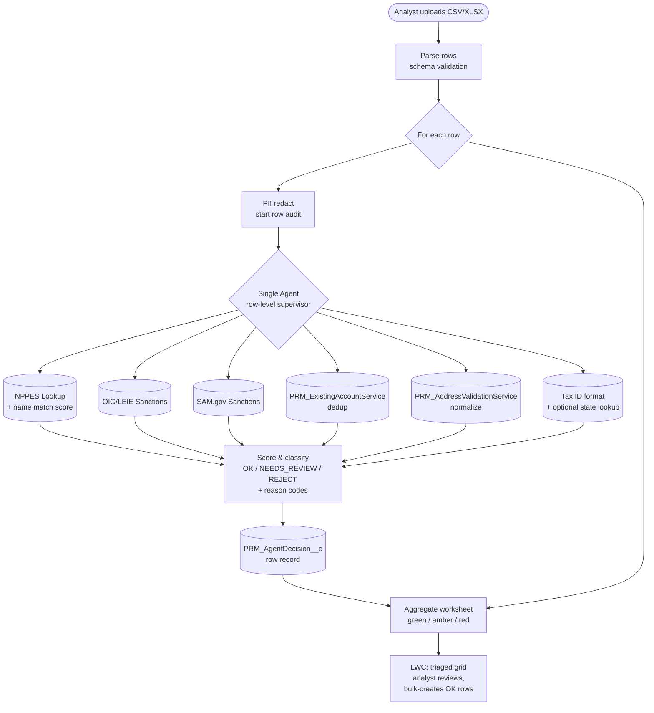

# Idea 02 — Bulk Practitioner Validation Agent

**Tier:** 1
**Notebook analog:** Autonomous Financial Analyst (single agent + tools + per-entity ranking, looped)
**Effort:** M (6 weeks)
**Risk:** Low — agent classifies each row, analyst confirms before any record is created.
**Status:** Proposed

---

## 1. Problem

The team is delivering bulk practitioner creation per `requirements/PractitionerCreationPerformance/US_PractitionerCreation_Complete_Implementation.md` and `Design_BulkPractitionerCreation_LWC.md`. The mockup (`mockups/BulkPractitionerCreation_Mockup.html`) shows a spreadsheet upload flow.

Today, validating each row of an uploaded spreadsheet means an analyst must:

1. Look up each NPI to make sure it's real and matches the typed name.
2. Run sanctions checks (OIG, SAM) for each row.
3. Check if the practitioner already exists in IBX (dedup against `Account` via `PRM_ExistingAccountService`).
4. Normalize tax IDs, license numbers, addresses (via `PRM_AddressValidationService`).
5. Decide which rows are clean to load, which need analyst attention, which to reject outright.

For a 200-row spreadsheet this is hours of manual work, much of it deterministic checking that an agent can do in seconds.

---

## 2. Goal

Pre-flight validator that runs on the uploaded spreadsheet **before** any practitioner records are created, and produces a row-by-row triage:

| Status | Meaning |
|---|---|
| `OK` | All checks pass with high confidence — analyst still confirms but bulk-create is recommended |
| `NEEDS_REVIEW` | At least one check returned a soft fail (e.g., NPI maps to slightly different name, possible duplicate) — analyst reviews row-by-row |
| `REJECT` | Hard fail (e.g., OIG sanctioned, NPI deactivated, missing required field) — agent recommends excluding from bulk load |

The agent never creates records on its own. It produces a categorized worksheet; the analyst clicks "Create selected" to bulk-create the OK / approved-NEEDS_REVIEW rows.

---

## 3. Personas

| Persona | What they get |
|---|---|
| Credentialing Analyst (bulk-load operator) | 200-row file triaged in seconds with reasons; only spends time on flagged rows |
| Delegated-credentialing intake (per `US_DelegatedPractitioner_AddressCreation_BatchRefactor.md`) | Same agent applies to delegated-roster ingestion |
| Compliance | Every row's checks logged in `PRM_AgentDecision__c` for audit |

---

## 4. Existing IBXQA components leveraged

| Component | Path | Role |
|---|---|---|
| `prmBulkPractitionerCreation` LWC | per `Design_BulkPractitionerCreation_LWC.md` | Host UI; pre-validation step lives here |
| `PRM_ExistingAccountService` | `force-app/main/default/classes/PRM_ExistingAccountService.cls` | Account dedup against existing IBX records |
| `PRM_PARProviderSearch` | `force-app/main/default/classes/PRM_PARProviderSearch.cls` | Provider search via PAR system |
| `PRM_AddressValidationService` | `force-app/main/default/classes/PRM_AddressValidationService.cls` | Precisely-based address standardization |
| NPPES NPI Registry MCP | (new or AgentExchange) | NPI realness + name match |
| OIG/LEIE + SAM.gov MCP | (new or AgentExchange) | Sanctions checks |

---

## 5. Architecture

### 5.1 Diagram



### 5.2 Agent shape

This idea is a **single agent looped per row**, not a multi-agent orchestration. Per-row tool-calling, per-row classification, per-row audit. The "Autonomous Financial Analyst" pattern.

| Component | Notes |
|---|---|
| Agent | `BulkPractitionerValidator` |
| Tool calls per row (max) | 6 (above) |
| Concurrency | Process rows in batches of N (e.g. 25) with bounded parallelism — controlled by Apex Queueable + Platform Events |
| LLM use | Light — almost all logic is deterministic tool calls. LLM is used to (a) format the human-readable reason text and (b) reconcile NPI-name fuzzy matches where deterministic match scores are ambiguous |

### 5.3 Per-row classification rules (initial — calibrate from labeled data)

```
Hard fails → REJECT:
  - NPI is invalid or deactivated in NPPES
  - OIG/LEIE active exclusion
  - SAM.gov active exclusion
  - Required field missing (NPI, Name, DOB)
  - Existing Active practitioner record found with same NPI

Soft fails → NEEDS_REVIEW:
  - NPI name match score < 0.85 (fuzzy)
  - Possible duplicate (existing record same name + DOB but different NPI)
  - Address fails Precisely standardization
  - Tax ID format invalid for state
  - License field present but cannot verify state-board match
  - State of practice ≠ state on NPI primary location

Otherwise → OK:
  - All checks pass with high confidence
```

Each row carries a list of reason codes, e.g. `["NPI_NAME_FUZZY_MATCH", "EXISTING_INACTIVE_RECORD"]`. UI maps reason codes → user-readable explanations.

---

## 6. UX

Inside the bulk-creation LWC (per `Design_BulkPractitionerCreation_LWC.md`):

1. After upload + schema validation, a "Validate" button appears.
2. On click, the agent runs over rows; LWC streams progress (X of N rows triaged).
3. Result: a tri-color triaged grid:
   - Green (OK): row count, "Select all OK" checkbox.
   - Amber (NEEDS_REVIEW): expandable per row, shows reason codes, fetched data side-by-side, allows analyst to edit + re-validate.
   - Red (REJECT): expandable per row, shows hard-fail reason, allows analyst to override (with mandatory justification — captured in audit) or remove from batch.
4. "Create selected" button is enabled when at least one row is selected; only checked rows are passed to the existing bulk-create flow.

---

## 7. Trust / compliance

| Concern | Mitigation |
|---|---|
| PHI / PII in spreadsheet | Trust Layer redaction; no LLM call sees raw SSN |
| Wrong reject (false positive) | Soft-fail / hard-fail split; analyst can override REJECT with justification |
| Missed sanction (false negative) | Each row's tool calls and responses persisted; periodic audit sample replays the row through current data sources to verify |
| Audit trail per row | Each row generates one `PRM_AgentDecision__c` linked to the parent batch via a `PRM_BulkBatch__c` (or existing batch object) |
| Data freshness | Per-source `fetchedAt` recorded; if user re-validates, agent re-fetches |

---

## 8. KPIs

**Throughput**
- Median minutes from upload to "Create selected" click (today vs. with agent)
- Rows triaged per minute

**Quality**
- False-positive REJECT rate (target: <2%) — analyst overrides REJECT after manual verification
- False-negative rate (target: <1%) — sampled audits re-run rejected/passed rows
- Hard-fail capture rate (target: 100% on OIG/SAM active exclusions)

**Adoption**
- % of bulk uploads that run validation
- % of bulk-created rows that came through agent triage

**Cost**
- Tokens per row (target: low — most logic is tool calls)
- $ per row vs. analyst-minute cost

---

## 9. Test cases (initial seed)

| ID | Scenario | Expected |
|---|---|---|
| BPV-T01 | Clean row, valid NPI, no sanctions, no existing record | OK |
| BPV-T02 | NPI valid but deactivated in NPPES | REJECT, reason `NPI_DEACTIVATED` |
| BPV-T03 | OIG active exclusion | REJECT, reason `OIG_EXCLUDED` |
| BPV-T04 | SAM active exclusion | REJECT, reason `SAM_EXCLUDED` |
| BPV-T05 | NPI valid but typed name "Robert Smith" vs. NPI name "Roberta Smith" | NEEDS_REVIEW, reason `NPI_NAME_FUZZY_MATCH`, score shown |
| BPV-T06 | Same NPI as existing Active practitioner | REJECT, reason `EXISTING_ACTIVE_NPI` |
| BPV-T07 | Same name+DOB as existing record but different NPI | NEEDS_REVIEW, reason `POSSIBLE_DUPLICATE` |
| BPV-T08 | Missing required field (NPI) | REJECT, reason `MISSING_REQUIRED_FIELD:NPI` |
| BPV-T09 | Address fails Precisely standardization | NEEDS_REVIEW, reason `ADDRESS_NOT_STANDARDIZED` |
| BPV-T10 | NPPES timeout | NEEDS_REVIEW, reason `NPI_LOOKUP_FAILED_RETRY`; allow re-validate |
| BPV-T11 | NPI primary state ≠ practice state | NEEDS_REVIEW, reason `STATE_MISMATCH` |
| BPV-T12 | Existing INACTIVE practitioner same NPI | NEEDS_REVIEW, reason `EXISTING_INACTIVE_RECORD`, link to inactive record |

---

## 10. Effort breakdown (6 weeks)

| Sprint | Work |
|---|---|
| 1 | Tool wrapping: NPPES, OIG/LEIE, SAM as MCP/Apex actions; existing services (`PRM_ExistingAccountService`, `PRM_AddressValidationService`) wired as Agent Actions |
| 2 | Single-agent definition + classification rules; per-row scoring; first 6 eval cases |
| 3 | LWC integration: triaged grid, color coding, per-row expand, override-with-justification UX |
| 4 | Batch concurrency: Apex Queueable runner, Platform Event progress streaming, `PRM_BulkBatch__c` linkage |
| 5 | Eval suite to 12+ cases; UAT with 2 analysts on a sample 50-row file; tune fuzzy thresholds |
| 6 | Pilot behind feature flag for one team; metrics dashboard |

---

## 11. Open questions

- [ ] What is the typical bulk file size — does throughput need explicit batching or is per-row real-time fine?
- [ ] Is there an existing batch object to link rows to, or do we need `PRM_BulkBatch__c`?
- [ ] How does the agent interact with `US_DelegatedPractitioner_AddressCreation_BatchRefactor.md` — is the validation run on intake from the delegated roster, or only on manual upload, or both?
- [ ] Override-of-REJECT policy: who in the org is allowed to override, and what justification text is required?
- [ ] For NPI name fuzzy match, what threshold trips NEEDS_REVIEW vs. REJECT? — start at 0.85 NEEDS_REVIEW, <0.6 REJECT, calibrate with labeled data.

---

## 12. Out of scope (v1)

- Auto-creating practitioners — analyst always confirms.
- Validating non-individual entities (groups, ancillary orgs) — same pattern but different source mix; layer in v2.
- Cross-row reasoning (e.g., "these 3 rows look like the same person 3 times") — flag as duplicates within the batch is in scope, but full deduplication graph is v2.
- Triggering credentialing applications automatically — out of scope; this just creates the practitioner record.

---

*Pairs with `Idea05_Practice_Location_Verification_Agent.md` for the address-graph side of PDM.*
