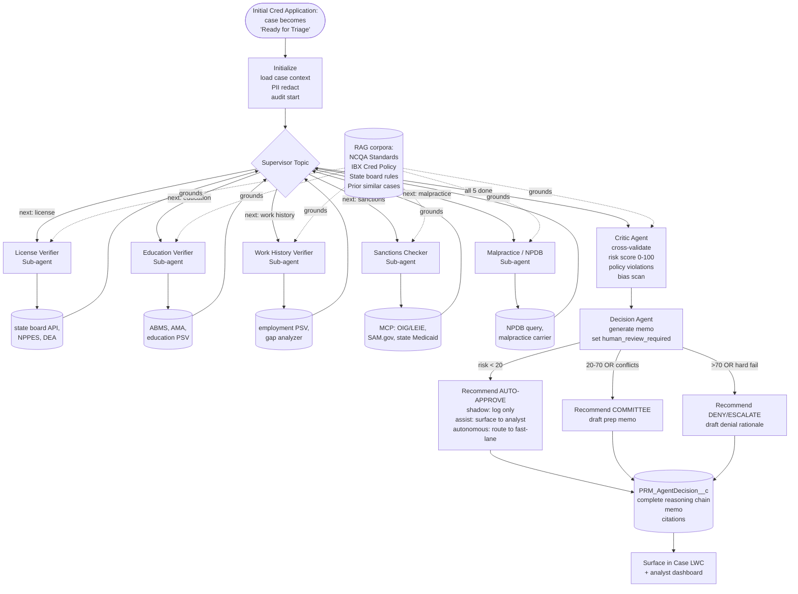

# Idea 03 — Initial Credentialing Triage Agent

**Tier:** 1 (XL effort, ships in **shadow mode** for 60–90 days before any decision authority)
**Notebook analog:** **Senior Mortgage Underwriting System** — direct 1:1 mapping
**Effort:** XL (12+ weeks build; +60–90 days shadow)
**Risk:** Medium — flagship multi-agent system; decision authority gated behind shadow→assist→autonomous progression
**Status:** Proposed

---

## 1. Problem

Initial Credentialing requires triaging every new application across multiple specialist domains:

- License (state board verification, expiration, restrictions, encumbrances)
- Education (medical school, residency, fellowships — verified to source)
- Work history (gaps, terminations, references)
- Sanctions (OIG/LEIE, SAM.gov, state-level Medicaid sanctions)
- Malpractice (NPDB, claim history, current carrier coverage)
- Cross-source consistency (does the license state match practice location? does NPI Registry name match application name?)

Today, an analyst spends hours per file reading sources, drafting notes, and deciding whether the file is clean for committee, needs follow-up, or has a hard fail. Borderline cases queue for committee with inconsistent levels of analyst-prep quality.

The Senior Mortgage Underwriting notebook in `~/Documents/AgenticAI/Senior Mortgage Underwriting System/` shows the exact pattern needed: a supervisor routes the application through 4 specialist analysts, a critic cross-validates, and a decision agent issues APPROVED / CONDITIONAL / REJECTED with a memo. Substitute "underwriting" for "credentialing" and the pattern holds.

---

## 2. Goal

Multi-agent system that, on every Initial Credentialing application:

1. **Initialize** — load case, redact PII, capture audit start.
2. **Specialist sub-agents (5)** — License, Education, Work History, Sanctions, Malpractice — each runs in turn, retrieves relevant policy passages from RAG, calls deterministic tools, and writes a structured analysis.
3. **Critic** — cross-validates all 5 analyses, computes risk score 0–100, lists policy violations, runs bias scan.
4. **Decision** — issues `AUTO-APPROVE` / `COMMITTEE` / `DENY` recommendation with a generated decision memo (mortgage notebook §3.6 + §4.8).
5. **HITL** — humans always sign. Initially the agent is **shadow-mode** (predicts, doesn't route). After ≥80% agreement with the committee verdict over 60+ days, advance to **assist mode** (agent recommends, analyst routes). Autonomous "auto-approve below risk threshold" is gated on a separate exec/compliance approval.
6. **Audit** — full reasoning chain captured in `PRM_AgentDecision__c` + `PRM_AgentDecisionStep__c`.

---

## 3. Personas

| Persona | What they get |
|---|---|
| Credentialing Analyst | A pre-prepped file with risk score, drafted memo, conflict flags, every source already pulled |
| Credentialing Committee | Higher-quality, more consistent file presentations; clear reasoning chain to challenge if needed |
| Credentialing Manager | Cycle time goes down; manageable mix of "fast lane" (low risk) vs. "committee" (high risk) |
| Compliance / NCQA auditor | Reproducible decisions, complete reasoning chain per case, fairness metrics by protected class |

---

## 4. Existing IBXQA components leveraged

Same components as `Idea01_PSV_Review_Copilot.md` (the Researcher-side tools are shared) plus:

| Component | Role |
|---|---|
| OmniScripts for application intake | Existing PRM Initial Cred OmniScripts feed the case data |
| `PRM_PARRequestDenialUtility` / `PRM_CaseManagerDenialUtility` | If/when assist-mode authorizes a deny path, reuse the existing closure/denial cleanup engine |
| Approval Process for committee | The HITL pause for committee is the existing approval flow |
| New `PRM_BiasFairnessReport__c` (or report type) | Weekly fairness aggregation queries `PRM_AgentDecision__c` |

---

## 5. Architecture

### 5.1 Diagram

### 5.2 Sub-agents

| Sub-agent | Job | Tools | RAG | Key output |
|---|---|---|---|---|
| **License Verifier** | Verify state license(s) active, in good standing, no actions/encumbrances; verify DEA if applicable; cross-check NPI primary state | NPPES, state board API per state, DEA | NCQA CR-3, IBX Cred Policy §Licensure | `{licenses: [...], status, expirations, encumbrances, citations}` |
| **Education Verifier** | Verify medical school, residency, fellowships; verify board certification | ABMS, AMA Profile, school PSV | NCQA CR-2, IBX Cred Policy §Education | `{education: [...], boardCert, citations}` |
| **Work History Verifier** | Verify last 5+ years employment continuity; flag gaps; verify references where in scope | Internal employment PSV; gap analyzer | NCQA CR-4, IBX Cred Policy §Work History | `{employment: [...], gaps: [...], citations}` |
| **Sanctions Checker** | OIG/LEIE, SAM.gov, state Medicaid sanctions, Medicare sanctions | OIG/LEIE MCP, SAM.gov MCP, state lookups | NCQA CR-7, IBX Cred Policy §Sanctions | `{sanctions: [...], citations}` |
| **Malpractice / NPDB** | NPDB query, malpractice carrier verification, claim history threshold check | NPDB, carrier callout | NCQA CR-5, IBX Cred Policy §Malpractice | `{npdb, claims: [...], coverage, citations}` |
| **Critic** | Cross-validate all 5; detect contradictions; risk score; bias scan | None | None | `{riskScore, conflicts, policyViolations, biasFlags, recommendation}` |
| **Decision** | Synthesize → memo + recommendation | None | None | `{recommendation, memo, citations}` |

### 5.3 Risk score & routing recommendation (initial — calibrate over shadow)

Same 0–100 scale used in the mortgage notebook + `Idea01_PSV_Review_Copilot.md`. Routing thresholds:

| Risk | Recommendation |
|---|---|
| 0–19 | `AUTO-APPROVE` (shadow logs only; never auto-routes in v1) |
| 20–69 | `COMMITTEE` (with prepped memo) |
| 70–100 or any hard fail (active sanction, license revoked) | `DENY/ESCALATE` |

Hard fails always override the numeric score: any active OIG exclusion → DENY recommendation regardless of score.

---

## 6. Rollout: shadow → assist → autonomous

This is the most important section of the document. The Senior Mortgage Underwriting notebook is illustrative but not regulated — credentialing is. Three phases:

### Phase A — Shadow (60–90 days minimum)

- Agent runs on every Initial Cred application.
- Output saved to `PRM_AgentDecision__c` only — no analyst UI surfacing, no committee impact.
- Compliance + a small analyst panel review weekly samples.
- **Exit criteria to assist mode:**
  - ≥80% agreement with committee verdict on closed cases.
  - Citation grounding ≥95%.
  - Bias flags: no statistically significant disparity by protected class (per quarterly fairness report).
  - Zero hard-fail misses (no case where committee found OIG sanction that agent missed).

### Phase B — Assist (open-ended; default state for v1)

- Agent recommendation surfaced in the case LWC: risk score, memo, conflict flags, "Recommend: COMMITTEE" badge.
- Analyst still routes the case manually. Agent is a heavy-duty preparer, not a router.
- Override rate measured weekly. Each override → eval case.

### Phase C — Autonomous fast-lane (gated by exec + compliance approval)

- Optional, may never happen. If approved, the lowest-risk band (e.g., risk <10, no conflicts, perfect grounding) can be auto-routed to a fast-lane committee batch — committee still rubber-stamps a batch.
- Requires NCQA / state regulator review; not in scope for v1 shipping.

---

## 7. Trust / compliance

| Concern | Mitigation |
|---|---|
| Hallucinated policy citation | Critic mandates every cited NCQA standard / IBX policy passage exists in retrieved chunks. Reject ungrounded responses |
| Disparate impact | Quarterly fairness report queries `PRM_AgentDecision__c` aggregated by protected attributes; statistical significance tests; remediation tickets |
| PHI exposure | Trust Layer redaction; quarterly red-team prompt-injection drills |
| NCQA audit reproducibility | Pinned model version, prompt hashes, RAG chunk ids — every decision is fully replayable from `PRM_AgentDecisionStep__c` |
| Analyst rubber-stamping in assist mode | UI requires analyst to tick "I reviewed the agent's reasoning" before routing; sample audit |
| Source data freshness | Each tool result has `fetchedAt`; agent re-fetches on case re-open after >24h |
| Committee transparency | Memo always shows the risk score, the top citations, and a link to the full reasoning chain |

---

## 8. KPIs

**Throughput**
- Median days application-complete → committee decision (target: -30% by end of assist mode)
- Analyst minutes per file in pre-committee prep (target: -50%)

**Quality**
- Agent-to-committee agreement rate (track entire shadow + assist period)
- Override rate per specialist domain (which sub-agent gets overridden most? — that's where to invest in prompt/RAG improvement)
- Citation grounding %
- Hard-fail capture (target: 100% on any active OIG sanction in the case window)

**Fairness**
- Disparate impact ratio (DIR) per protected attribute, weekly trend
- Override-by-protected-attribute analysis
- Bias-flag rate per 1,000 cases

**Cost**
- Tokens per case (5 specialists + critic + decision)
- $ per case
- Latency p50/p95 (target: end-to-end <60s for happy path)

---

## 9. Test cases (initial seed)

Modeled directly on `mortgage_test_cases.json`:

| ID | Scenario | Expected |
|---|---|---|
| ICT-T01 | Clean: license active, education verified, no gaps, no sanctions, no NPDB | risk<20, COMMITTEE recommendation (until autonomous fast-lane is approved) |
| ICT-T02 | License active, but NPI primary state mismatched | risk 20–40, COMMITTEE, conflict flag `STATE_MISMATCH` |
| ICT-T03 | Active OIG/LEIE exclusion | risk≥70, DENY, hard-fail flag, memo cites OIG |
| ICT-T04 | License expires in 14 days, no renewal evidence | risk 30–60, COMMITTEE, flag `LICENSE_NEAR_EXPIRY` |
| ICT-T05 | NPDB shows 2 settled malpractice claims in last 3 yrs | risk 40–70, COMMITTEE, memo cites IBX malpractice threshold |
| ICT-T06 | 18-month unexplained work-history gap | risk 30–50, COMMITTEE, conflict flag `UNEXPLAINED_GAP` |
| ICT-T07 | Education PSV times out for one institution | risk increased, COMMITTEE, flag `MISSING_PSV:education`, retry suggestion |
| ICT-T08 | Conflict: state board says "active" but DEA shows "expired" | risk 40–70, COMMITTEE, cross-source conflict |
| ICT-T09 | Bias-tripping language detected in critic's free text (specialty-by-region inference) | biasFlags non-empty, response regenerated with bias-clean prompt |
| ICT-T10 | License revoked in another state, currently practicing in third state where active | risk≥70, DENY/ESCALATE, memo cites multi-state license history |
| ICT-T11 | Application is for a re-applicant previously denied 2 years ago | risk 40–70, COMMITTEE, prior-decision context surfaced |
| ICT-T12 | Practitioner is in a high-need specialty in an underserved area, otherwise borderline | DOES NOT lower risk score (network strategy is out of scope for v1); risk and recommendation unchanged |
| ICT-T13 | RAG retrieval returns chunks from wrong jurisdiction | retrieval re-run with explicit jurisdiction filter; if still wrong, escalate to analyst with note |

Add 1 test case per shadow-mode disagreement and per assist-mode override.

---

## 10. Effort breakdown (12+ weeks build)

| Sprints | Work |
|---|---|
| 1–2 | Specialist sub-agents (License, Sanctions) + tools wired; first eval cases ICT-T01..T03 |
| 3–4 | Specialist sub-agents (Education, Work History, Malpractice) + tools wired; eval cases ICT-T04..T07 |
| 5 | Critic agent + risk score + bias scan; eval cases ICT-T08..T09 |
| 6 | Decision agent + memo generation + grounding check on memo; eval ICT-T10..T11 |
| 7 | End-to-end orchestration + Agent Script flow + complete `PRM_AgentDecision__c` capture |
| 8 | Analyst-side LWC view (read-only in shadow): risk score, memo, citations, conflict list, full reasoning chain link |
| 9–10 | Hardening: error handling, retries, source freshness, fallbacks; load testing |
| 11 | Shadow-mode dry-run on a small QA dataset; eval suite to ICT-T13; fairness reporting plumbing |
| 12+ | Shadow start in production; weekly compliance review; tune thresholds and prompts based on disagreements |

---

## 11. Open questions

- [ ] Are state-board APIs available for every state IBX serves? Where they aren't, what is the fallback (manual data entry → tool wrapper)?
- [ ] NCQA position on AI-assisted credentialing — engage early, document responses in this folder.
- [ ] What committee reporting changes are needed to surface "agent recommendation: X, analyst routed to Y" stats?
- [ ] Sub-agent parallelization: mortgage notebook ran sequentially for simplicity; here there's no read dependency between License/Education/Work/Sanctions/Malpractice. Parallel would be ~5× faster. Decide post-Sprint 7.
- [ ] How does this agent interact with `BH_Medical_Dual_Credentialing` cases (per `BH_Medical_Dual_Credentialing_User_Stories.md`)? Probably runs twice (once per credentialing track) — confirm.
- [ ] Should re-credentialing reuse the same agent? Yes (with a different prompt re: continuity) — see `Idea04_Recredentialing_Proactive_Monitor.md`.

---

## 12. Out of scope (v1)

- Network-fit / network-strategy reasoning (specialty by geography / member need). The agent does **not** lower risk for high-need specialties — that's a separate concern routed through network management.
- Ancillary providers (separate source mix; later).
- Re-credentialing (covered by `Idea04`).
- Auto-routing to fast-lane committee (Phase C; gated by exec + compliance approval).

---

*Direct port of the Senior Mortgage Underwriting notebook to credentialing. The verifier sub-agents built here are reused by `Idea04_Recredentialing_Proactive_Monitor.md` and `Idea06_Adverse_Action_Investigator.md`.*
