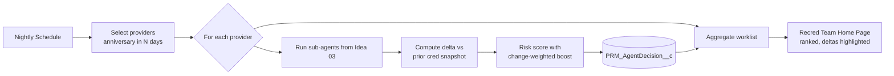

# Idea 04 — Recredentialing Proactive Monitor

**Tier:** 2
**Notebook analog:** Autonomous Financial Analyst (proactive, scheduled, multi-entity ranking)
**Effort:** L (6 weeks, after `Idea03` sub-agents exist)
**Risk:** Medium
**Status:** Sketch

---

## 1. Problem

Re-credentialing is anniversary-driven and currently runs reactively: a packet goes out 4–6 months before the anniversary, the provider returns it, the analyst chases missing pieces, then the file goes through PSV. By the time anything is wrong (license expired, new sanction, settled malpractice claim), we've already burned weeks of cycle time.

There is no proactive scan that says *"these 50 providers, due for recred in the next 90 days, have these new red flags — prioritize them."*

## 2. Goal

Agent runs on a schedule (nightly, then weekly steady-state) and:

1. Selects every provider whose recred anniversary is within N days (configurable, default 90).
2. For each provider, calls the License + Sanctions + Malpractice + NPDB sub-agents from `Idea03`.
3. Compares results to the prior credentialing snapshot — what's new since last cred?
4. Produces a **risk-ranked worklist** (utility-based agent, per the notebook §8 pattern) for the recred team's home page.
5. Pre-fetches updated PSV data so by the time the recred packet goes out, the agent's view of the file is current.

The agent never starts a recred case or sends a packet. It surfaces a prioritized worklist and pre-stages data.

---

## 3. Reuses from `Idea03`

- License Verifier sub-agent
- Sanctions Checker sub-agent
- Malpractice / NPDB sub-agent
- Critic agent (with a slightly different prompt — emphasis on "what changed since last cred")
- `PRM_AgentDecision__c` audit object
- Same RAG corpus (NCQA, IBX policy)

## 4. New components

| Component | Notes |
|---|---|
| `PRM_RecredMonitorBatch` (Apex Queueable + Schedulable) | Nightly job that selects providers in window and dispatches per-provider agent runs |
| `PRM_AgentDecision__c.PRM_TriggerType__c = 'Schedule'` | Distinguish scheduled monitor runs from analyst-triggered runs |
| Worklist LWC on recred-team home page | Sortable by risk score; deltas from prior snapshot highlighted |
| `PRM_RecredSnapshot__c` (or similar) | Prior-cred snapshot for delta comparison |

## 5. Architecture (high level)

## 6. Risk score adjustment vs. `Idea03`

Same base score plus a delta multiplier:

- New OIG sanction since last cred → set hard fail, escalate immediately (don't wait for anniversary)
- New malpractice claim → +20
- License changed states → +10
- Recent encumbrance / restriction → +15

## 7. KPIs

- Recred-anniversary miss rate (target: ↓)
- Median days from packet send to file complete (target: ↓ because data pre-staged)
- # of "surprises" caught early (new sanction discovered before packet send) — agent generates a separate alert
- Worklist accuracy: top-N risk-ranked providers correlate with analyst rating of "actually needed attention"

## 8. Test cases (initial)

| ID | Scenario | Expected |
|---|---|---|
| RPM-T01 | Provider with no changes since last cred | low score, sits at bottom of worklist |
| RPM-T02 | New OIG exclusion since last cred | hard-fail alert, immediate escalation, separate from anniversary worklist |
| RPM-T03 | License moved from NJ to PA | +10 boost, flagged "STATE_CHANGED" |
| RPM-T04 | New NPDB report (settlement) | +20 boost, deltas show prior NPDB count |
| RPM-T05 | License renewed cleanly | minor boost or no change; "verified" badge |

## 9. Open questions

- [ ] Window for monitoring: 90 / 120 / 180 days? Will likely vary by specialty risk.
- [ ] Out-of-cycle alerts (new sanction → alert now, don't wait for anniversary): which channel — Platform Event, Slack, email?
- [ ] Storage of prior-cred snapshot: new object vs. on `PRM_AgentDecision__c` archive.
- [ ] Concurrency limits: how many provider runs per night within Apex governor + LLM rate limits.

## 10. Out of scope (v1)

- Sending the recred packet automatically
- Generating provider correspondence
- Re-credentialing decision authority (still per `Idea03` shadow → assist progression for the recred file itself)

---

*Depends on `Idea03_Initial_Credentialing_Triage_Agent.md` — build after those sub-agents are stable.*
