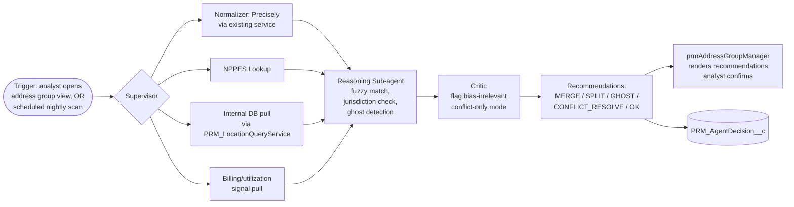

# Idea 05 — Practice-Location Verification Agent (PDM)

**Tier:** 2
**Notebook analog:** Autonomous Financial Analyst (proactive tool calls) + LexAgent (jurisdictional reasoning)
**Effort:** L (8 weeks)
**Risk:** Low
**Status:** Sketch

---

## 1. Problem

Practice-location data in IBXQA is sourced from multiple feeds (provider self-report, NPPES NPI Registry, Precisely standardization, internal DB, group-level rosters). These sources frequently disagree:

- "100 Main St" vs "100 Main Street" vs "100 Main Suite 2"
- NPPES says practitioner is at site A; provider self-report says site B; group roster has both.
- Ghost locations: appear in our DB but no NPI was ever associated, never billed, no member volume.
- Duplicate locations: same physical place, three records.

The address group manager (`prmAddressGroupManager`) and the Phase 5 services (`PRM_AddressManagementService`, `PRM_AddressValidationService`, `PRM_LocationQueryService`) handle the mechanics of grouping and updating. What's missing is the **judgment layer** — given conflicting data, what is the right merge / split / leave-alone decision?

## 2. Goal

An agent that, on demand or on a nightly scan, evaluates conflicting/duplicate location data for a practitioner or group and produces:

- **Merge recommendations** with confidence score (e.g., "Locations L1 and L2 are 0.95 likely the same site")
- **Split recommendations** when one record looks like multiple sites
- **Ghost flags** for never-billed, never-NPI'd phantom locations
- **Conflict resolution** for contested data (which source wins for primary address?)

The agent never updates location records. Recommendations feed the existing `prmAddressGroupManager` LWC where the analyst confirms / overrides.

---

## 3. Existing IBXQA components leveraged

| Component | Path | Role |
|---|---|---|
| `prmAddressGroupManager` LWC | `force-app/main/default/lwc/prmAddressGroupManager` | Host UI; agent recommendations surface here |
| `PRM_AddressValidationService` | `force-app/main/default/classes/PRM_AddressValidationService.cls` | Precisely standardization tool |
| `PRM_AddressManagementService` | `force-app/main/default/classes/PRM_AddressManagementService.cls` | Address read/write surface |
| `PRM_LocationQueryService` | `force-app/main/default/classes/PRM_LocationQueryService.cls` | Practitioner location lookups |
| `PRM_SmartAddressSearch` | `force-app/main/default/classes/PRM_SmartAddressSearch.cls` | NPI/Tax ID based address lookup |
| `prmAddressUtils` | LWC utility | Phone formatting, validation, address normalization |
| NPPES MCP | (new or AgentExchange) | Authoritative NPI primary practice location |

---

## 4. Architecture (high level)

---

## 5. Recommendation types & confidence

| Type | Output | Confidence factors |
|---|---|---|
| `MERGE` | Pair (or N-tuple) of location IDs that should be merged | Address normalization match, NPI overlap, billing overlap, distance, suite-level fuzzy match |
| `SPLIT` | Single location ID that contains records belonging to ≥2 distinct sites | Inconsistent NPI assignments, distance between billing addresses on the same record |
| `GHOST` | Location ID with no NPI, no billing in N years | Time since last activity, no associated NPI |
| `CONFLICT_RESOLVE` | A field-level conflict with a recommended winner and rationale | Source priority (NPPES > Precisely > self-report for primary address — confirm with PDM team) |
| `OK` | No action needed | All sources agree |

Confidence threshold for surfacing recommendations: ≥0.7. Below that, agent stays silent.

---

## 6. KPIs

- Address-reconciliation analyst minutes (target: ↓)
- False-merge rate (target: <3%)
- Ghost-location detection — how many phantom records cleaned up per quarter
- Member-directory accuracy: address mismatch rate vs. provider-confirmed (target: ↓)
- Recommendation accept rate (target: ≥70%)

## 7. Test cases (initial)

| ID | Scenario | Expected |
|---|---|---|
| LV-T01 | "100 Main St" + "100 Main Street" same NPI, same billing | MERGE, confidence ≥0.95 |
| LV-T02 | Two locations at same address, two different NPIs (separate practitioners) | OK (not a merge — different practitioners legitimately at same site) |
| LV-T03 | Location with no NPI, no billing in 3+ years | GHOST |
| LV-T04 | Single location record but billing addresses split across two zip codes | SPLIT |
| LV-T05 | NPPES says "Suite 200", self-report says "Suite 250" | CONFLICT_RESOLVE, source priority documented |
| LV-T06 | Address fails Precisely standardization | flag for analyst manual entry, not GHOST |

## 8. Open questions

- [ ] Source priority for primary address — is NPPES authoritative, or does provider self-report win? (PDM team to confirm.)
- [ ] Threshold for fuzzy-match merge (0.85? 0.9?) — calibrate from labeled data.
- [ ] Ghost criteria: 1 year of inactivity? 3 years? — confirm with PDM ops.
- [ ] How does this interact with `PAR_Form_ExistingRecord_DuplicateErrors_UserStory.md` — is the agent's dedup the same dedup logic, or layered on top?

## 9. Out of scope (v1)

- Auto-merging records — analyst always confirms.
- Group-level provider-network reasoning (which group owns this practice?) — separate concern.
- Real-time location verification at the moment a member calls — pattern fits, but this v1 is offline analyst-tool only.

---

*Pairs with `Idea02_Bulk_Practitioner_Validation_Agent.md`. The address-validation tools wired here are reused there.*
