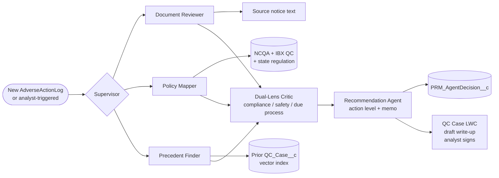

# Idea 06 — Adverse Action Investigator

**Tier:** 2
**Notebook analog:** LexAgent (jurisdictional + precedent) + Senior Mortgage critic/decision pattern
**Effort:** L (8 weeks)
**Risk:** Medium — outputs feed QC case write-ups; shadow first.
**Status:** Sketch

---

## 1. Problem

When a complaint, malpractice settlement, sanction, or member-safety event lands on a provider, a QC analyst must:

1. Read the source notice / event document.
2. Map it to applicable IBX QC policy + NCQA standards + state regulation.
3. Find precedent — how have we handled similar cases in the past? What action level did we land on?
4. Recommend an action level: none / monitor / committee review / restrict / terminate.
5. Draft the QC case write-up.

This is the LexAgent pattern: reason over policy + precedent in plain language, produce a structured recommendation with citations.

---

## 2. Goal

Multi-agent system that, when a triggering event lands (manual or automated):

1. **Document Reviewer sub-agent** — parses the source notice (PDF / text), extracts the salient facts (date, allegations, severity, contested vs. confirmed).
2. **Policy Mapper sub-agent** — RAG-retrieves applicable IBX QC policy + NCQA standards + state regulation.
3. **Precedent Finder sub-agent** — RAG-retrieves prior `QC_Case__c` records with similar fact patterns and their outcomes.
4. **Critic** — flags inconsistencies, surfaces dual-lens analysis (compliance vs. patient-safety vs. due-process — the "DualLens" notebook pattern), runs bias scan.
5. **Recommendation agent** — drafts action level + rationale + draft QC case write-up.
6. Analyst reviews, edits, signs.

---

## 3. Existing IBXQA components leveraged

| Component | Role |
|---|---|
| `QC_Case__c` (or analog) | Existing QC case object — agent generates write-up draft into this |
| Existing AdverseActionLog plumbing (per `AdverseActionLog_DataMapper_vs_Batch_CrossVerification.md`) | Agent does not change loading; reads from same |
| NPDB MCP | If event is NPDB-derived |
| RAG corpora (existing) | NCQA + IBX policy |
| RAG corpus (new) | Prior `QC_Case__c` records — embed periodically |

## 4. Architecture (high level)

---

## 5. Action levels

Same scale as today's QC process:

- `NONE` — no action; documented for record
- `MONITOR` — flag for periodic review
- `COMMITTEE_REVIEW` — Quality Committee formal review
- `RESTRICT` — temporary network restriction pending outcome
- `TERMINATE` — recommend network termination

The agent recommends; the QC committee or designated authority decides.

## 6. KPIs

- QC case prep time (target: ↓)
- Citation grounding %
- Precedent-relevance score (analyst rating of "did the agent find the right prior cases?")
- Action-level agreement rate (agent recommendation vs. committee decision)
- Bias / fairness disparity by protected class

## 7. Test cases (initial)

| ID | Scenario | Expected |
|---|---|---|
| AAI-T01 | Single member complaint, no prior issues, low severity | recommend `MONITOR`, cites IBX QC policy threshold |
| AAI-T02 | Settled malpractice >$500k, complex obstetric case | recommend `COMMITTEE_REVIEW`, cites precedent of similar settlements + IBX threshold |
| AAI-T03 | OIG exclusion notice (active) | recommend `TERMINATE`, hard-fail flag |
| AAI-T04 | State board public action: 30-day suspension | recommend `RESTRICT` for the suspension duration + `COMMITTEE_REVIEW` after |
| AAI-T05 | Allegation contested, no findings yet | recommend `MONITOR` pending resolution; due-process lens flagged |
| AAI-T06 | Citation in agent draft references NCQA standard not in retrieved chunks | rejected by Critic, regenerated |

## 8. Open questions

- [ ] What does the existing QC case object schema look like — what fields does the draft need to write to?
- [ ] Embedding prior `QC_Case__c` records — what fields are PHI-safe to embed, what must be redacted?
- [ ] Due-process lens: legal review of the prompt before shadow — every adverse action affects provider rights.
- [ ] State regulation corpus — start with which states? Probably IBX's primary states (PA, NJ, DE).

## 9. Out of scope (v1)

- Notifying the provider directly — letters drafted only, sent by humans.
- Termination authority — agent never recommends `TERMINATE` autonomously without human committee.
- Cross-provider pattern detection (network-wide) — separate project, possibly interesting v2.

---

*Reuses the Critic pattern from `Idea03_Initial_Credentialing_Triage_Agent.md`. Adopts the LexAgent dual-corpus (policy + precedent) approach from `~/Documents/AgenticAI/RentalAgent/`.*
