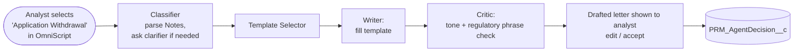

# Idea 07 — Application Withdrawal Triage Agent

**Tier:** 3
**Notebook analog:** Multi-Agent LinkedIn Writer (templated drafting + tone Critic)
**Effort:** S (3 weeks)
**Risk:** Low
**Status:** Sketch — depends on `Nonroutine_ApplicationWithdrawal_UserStory.md` shipping first

---

## 1. Problem

The new "Application Withdrawal" decision path (per `requirements/Nonroutine_ApplicationWithdrawal_UserStory.md`) handles the case where a provider voluntarily withdraws an application before committee verdict. Today the analyst:

1. Identifies *why* the withdrawal is happening (provider request, missing documents stalled, market exit, switched to delegated, dual-cred resolution, etc.).
2. Routes the case (the new dropdown handles this).
3. Drafts a response letter to the provider in the appropriate tone (regret-and-keep-warm, transactional acknowledgment, or strict regulatory-language for delegated transitions).

Step 1 (classification) and step 3 (drafting) are templated and repetitive — agent territory.

## 2. Goal

When the analyst clicks "Application Withdrawal" in the OmniScript:

- Agent classifies the withdrawal reason from the analyst's free-text Notes (or asks a clarifying question).
- Agent drafts the appropriate response letter from a curated template library.
- Critic verifies tone + that any regulatory phrasing required (e.g., for delegated transitions) is present and correct per IBX policy.
- Analyst reviews, edits, signs — letter is sent through existing correspondence channels.

The agent does not close the case or send the letter — the OmniScript flow per `Nonroutine_ApplicationWithdrawal_UserStory.md` handles that.

## 3. Reuses

- Withdrawal-decision OmniScript (`PRM_NonRoutineCommitteeReview_English`) integration point already designed
- `PRM_AgentDecision__c` audit
- Existing letter/correspondence mechanism

## 4. Architecture (high level)

## 5. Withdrawal reason taxonomy (initial)

- `PROVIDER_REQUEST` — pure provider-initiated withdrawal
- `STALLED_MISSING_DOCS` — provider didn't return docs after N reminders
- `MARKET_EXIT` — provider leaving market / region
- `DELEGATED_TRANSITION` — moving to a delegated arrangement
- `DUPLICATE_APPLICATION` — same provider has another active app
- `DUAL_CRED_RESOLUTION` — per `BH_Medical_Dual_Credentialing_*.md` flows
- `OTHER` — free text, agent flags for analyst attention

Each reason maps to one or more letter templates. Letter templates are stored as static resources or Knowledge articles, versioned, with required regulatory phrases marked.

## 6. KPIs

- Letter draft accept rate (target: ≥75%)
- Time to send post-withdrawal-decision (target: ↓)
- Tone consistency (auditor-graded sample)
- Regulatory phrase compliance: 100% of delegated-transition letters contain required phrasing

## 7. Test cases

| ID | Scenario | Expected |
|---|---|---|
| AWT-T01 | Notes: "Provider called to withdraw, moving out of state" | classify `MARKET_EXIT`, regret-and-keep-warm tone |
| AWT-T02 | Notes: "No response after 3 reminders, withdrawing" | classify `STALLED_MISSING_DOCS`, transactional tone |
| AWT-T03 | Notes: "Going delegated through Group X" | classify `DELEGATED_TRANSITION`, regulatory phrasing required |
| AWT-T04 | Ambiguous notes | classifier asks 1 clarifying question |
| AWT-T05 | Drafted letter missing the delegated-transition required phrase | rejected by Critic, regenerated |

## 8. Open questions

- [ ] Where do letter templates live today? (Knowledge? static resources? document content?)
- [ ] Which reasons require legal-team-approved phrasing — get a sign-off list before shipping.
- [ ] Does the OmniScript flow need a new step to invoke the agent, or can it be an LWC component slotted into the existing step?

## 9. Out of scope (v1)

- Sending the letter directly — analyst reviews and triggers the existing send pipeline.
- Cross-application reasoning (e.g., "this is the 3rd withdrawal from Group X this month") — interesting signal but a separate concern.

---

*Smallest-effort idea in the folder; ideal "second easy win" after `Idea01_PSV_Review_Copilot.md`.*
