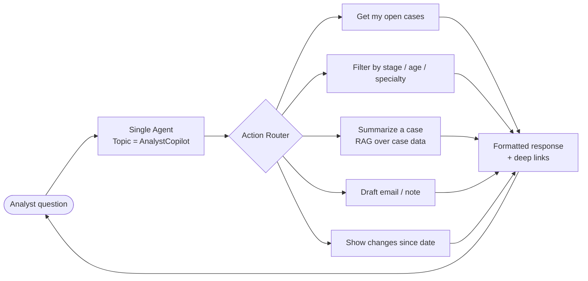

# Idea 09 — Credentialing Analyst Copilot ("Ask my book of work")

**Tier:** 4
**Notebook analog:** Single agent + tools (Autonomous Financial Analyst, simplified)
**Effort:** S (4 weeks)
**Risk:** Low
**Status:** Sketch — last in the rollout because it depends on patterns proven in Phases 1–3

---

## 1. Problem

A credentialing analyst spends meaningful time *finding* their work — which cases are stuck, which are due today, which need follow-up, which providers haven't responded in N days. Reports exist, but the long tail of "show me X" questions ends up as ad-hoc SOQL or Slack pings to a power user.

## 2. Goal

A single Agentforce agent embedded in the analyst's Lightning experience (utility bar, or Slack, or both) that answers natural-language questions about their book of work, by translating to safe, sanctioned SOQL via curated invocable actions.

Examples:

- "Show me my cases stuck in PSV more than 30 days"
- "Which providers in my queue haven't responded to the last 2 reminders?"
- "Summarize this case for me" (when on a record page)
- "Draft a status email to the recruiter for case ABC-123"
- "What changed on this practitioner's file since last week?"

The agent never does an unbounded SOQL. Every question maps to a curated invocable action with bounded inputs.

## 3. Reuses

- All audit infrastructure from prior ideas
- Existing reports / list views (where applicable; agent surfaces them)
- The same Trust Layer config

## 4. Architecture (very simple)

## 5. Curated actions (initial set)

| Action | Inputs | Output |
|---|---|---|
| `GetMyCases` | Stage, age (days), specialty (opt) | Bounded list (max N), with case links |
| `GetMyCasesNotResponded` | days since last reminder | List |
| `SummarizeCase` | Case Id (auto-detected from page context) | Summary including recent activity, missing items, agent recommendations from prior runs |
| `WhatChangedSince` | Case/Practitioner Id, date | Diff narrative |
| `DraftStatusEmail` | Case Id, recipient, tone | Drafted email body |

The agent picks an action and fills its inputs. It cannot run free-form SOQL.

## 6. KPIs

- Time-to-find (analyst self-report on how long it took to surface a piece of info)
- Adoption (DAU / WAU among credentialing analysts)
- Response correctness on a sampled audit (agent matches what a manual SOQL would have returned)
- Email-draft accept rate

## 7. Test cases

| ID | Scenario | Expected |
|---|---|---|
| ACO-T01 | "Show me my cases stuck in PSV more than 30 days" | Calls `GetMyCases(stage=PSV, age=30)`, returns N items |
| ACO-T02 | "Summarize this case" on a case page | Auto-fills Case Id from page context, returns summary |
| ACO-T03 | "Run a query on the database" | Refuses; lists available actions instead |
| ACO-T04 | "Show me everyone's cases" | Refuses (action input bounded to "my") unless analyst is in a leadership role profile |

## 8. Open questions

- [ ] Slack vs Lightning utility bar for v1 — likely both, but pick a primary surface.
- [ ] Bounded SOQL: do we strictly use Apex actions, or is there safe scope for read-only Salesforce Data Cloud SQL?
- [ ] Profile-based scope (e.g., team leads can ask about their team's queues) — define the auth boundary before build.

## 9. Out of scope (v1)

- Free-form SOQL / SQL — the agent only invokes curated actions.
- Cross-team / cross-org queries — bounded to the analyst's own queue and assigned providers.
- Write actions — drafts only; analyst signs / sends.

---

*Last in the rollout because it depends on the audit infrastructure and analyst-trust patterns built in earlier phases. Quickest to ship once those are in place.*
