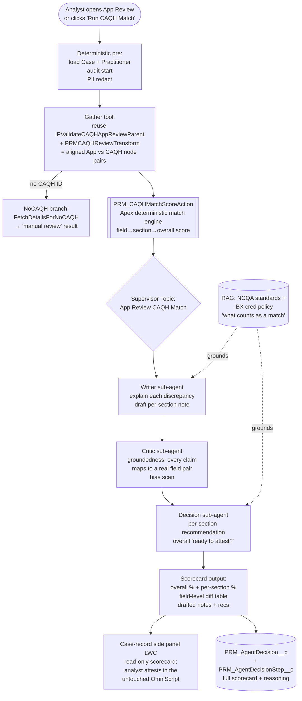

# Idea 10 — Application Review CAQH Match Agent

**Tier:** 1 (high-value, well-bounded; builds on the same machinery the App Review OmniScript already uses)
**Notebook analog:** Multi-Agent **Researcher → Critic (groundedness)** loop + Senior Mortgage Underwriting **field-level cross-validation**
**Effort:** M (8–10 weeks to assist-mode pilot)
**Risk:** Low–Medium — agent **scores and recommends**; the analyst still attests every section. Decision authority stays human.
**Status:** Proposed (technical design)
**Created:** 2026-06-11

---

## 0. Decisions locked (2026-06-11)

| Decision | Choice |
|---|---|
| **Headline score** | A single **overall % match** for the whole application, with per-section + field-level drill-down |
| **Scope (v1)** | **Initial Cred App Review only** (`PRM_InitialCredentialAppReview_English`); recred/PSV/QC reuse comes later |
| **Autonomy (v1)** | **Assist only** — agent scores + recommends; the analyst clicks every attestation Radio. No auto-attest. |
| **Surface** | **Separate side panel on the Case record** — does **not** modify the certified App Review OmniScript |
| **Match rules** | **Rule-based via Custom Metadata** (`PRM_CAQHMatchWeight__mdt`), fully deterministic; NCQA/IBX RAG grounding deferred to a later phase |

These choices keep v1 low-risk: the deterministic engine carries the score, the OmniScript is untouched, and a human attests everything.

---

## 1. Problem

During **Application Review**, an analyst reviews a credentialing application section-by-section and compares each field to the **CAQH** record (CAQH = the provider-maintained source of truth). Today the system:

1. Calls the CAQH API **once** (Integration Procedure `PRM_ValidateCAQHAppReviewParent` → `PRM_ValidateCAQHAppReview`, REST `GET /credentialing` over Named Credential `PRM_CAQH_API` → Mulesoft → CAQH).
2. Reshapes the response with DataRaptor **`PRMCAQHReviewTransform`** into read-only `CAQH*` fields placed **next to** the editable application fields, per section.
3. Asks the analyst to **eyeball** each section and manually pick a Radio — **"Data Looks Good" / "Missing Information"** — plus a free-text note and (sometimes) a denial reason.

**There is no automated comparison, match %, or pass/fail today.** The analyst does every field comparison by eye, across 7–8 sections, for every application. This is exactly the high-volume, low-judgment, audit-heavy work the AgenticAI strategy (`00_Strategy_AgenticAI_for_Credentialing_PDM.md`) targets.

> The data is **already perfectly aligned** for scoring: the DataRaptor places the CAQH value and the application value into paired nodes in the same OmniScript step. We just need an engine that compares the pairs, scores the match, explains discrepancies, and recommends the per-section verdict — leaving the click to the human.

---

## 2. Goal

An Agentforce **Application Review CAQH Match Agent** that, for a given credentialing case/practitioner:

1. **Gathers** the CAQH record and the application record (reusing the *existing* IP + transform — no new CAQH integration).
2. **Compares** every field pair, section by section, using a **deterministic match engine** (Apex) with type-aware normalization (dates, license numbers, names, addresses).
3. **Scores** each field → each section → an **overall match score (0–100)** with a clear breakdown.
4. **Explains** each discrepancy in plain English and **drafts the section note** (Writer).
5. **Self-checks** that every claim is grounded in an actual field pair (Critic — no hallucinated discrepancies).
6. **Recommends** the per-section verdict ("Data Looks Good" vs "Missing Information") and an overall "ready to attest?" signal.
7. **Persists** the full scorecard + reasoning chain to `PRM_AgentDecision__c` for audit.

The analyst reviews the scorecard, edits where needed, and **makes every attestation click**. The agent never sets the verdict in v1.

---

## 3. Scope — which OmniScript steps are CAQH-validated (the agent's surface area)

Parent OmniScript: **`PRM_InitialCredentialAppReview_English` v29**, which embeds sub-OmniScripts `PRM_CredApplicationReviewOSTxnyRole_English` v3 (Specialty) and `PRM_CredApplicationReviewSubOS_English` v4 (the rest).

Every section below already has aligned `CAQH*` ↔ application field pairs produced by `PRMCAQHReviewTransform`. These are the sections the agent scores:

| # | Section (OmniScript step) | CAQH-validated? | App ↔ CAQH field pairs (representative) | Existing attestation field |
|---|---|:---:|---|---|
| 1 | **Specialty / Taxonomy** (`VerifyTaxonomy`, Sub-OS #1) | ✅ Yes | `CareTaxonomy`/`UniversalSpecialty` ↔ `CAQHSpecialtyName`; `IsPrimaryTaxonomy` ↔ `CAQHPrimary`; NUCC code ↔ `CAQHNUCCTaxonomyCode` | `SpecialtyVerification` |
| 2 | **Education** (`VerifyEducation`) | ✅ Yes | `EducationLevelSF` ↔ `CAQHEducationDegree`; `InstitutionName` ↔ `CAQHInstitution`; start/end/completed/status | `EducationVerification` |
| 3 | **State / SBRD License** (`VerifyLicense`) | ✅ Yes | `VerifyLicenseState/Number/Eff/Exp/Class` ↔ `CAQHLicenseIssuingState/Number/IssueDate/ExpirationDate/Type/StatusCode` | `LicenseVerifcation` |
| 4 | **Work History** (`VerifyWorkHistory`) | ✅ Yes | employer/dates/current-flag/address ↔ `CAQHWorkHistory*` | `WorkHistoryVerification` |
| 5 | **DEA** (`VerifyDEAStep`) | ✅ Yes | `DEANumber/State/IssueDate/ExpirationDate` ↔ CAQH `ProviderDEA` | `DEAVerification` |
| 6 | **CDS** (`VerifyCDSStep`) | ✅ Yes | `CDSCertificateNumber/State/Issue/Exp` ↔ CAQH `ProviderCDS` | `CDSVerification` |
| 7 | **Malpractice / Insurance** (`VerifyMalPracticeCoverage`) | ✅ Yes | carrier/type/policy#/dates/coverage amounts/self-insured/locations ↔ `CAQHInsurance*` | `MalpracticeCoverageVerification` |
| 8 | **Board Certification** | ✅ Yes (in transform) | board name/cert date/certified+expires flags ↔ `CAQHBoardCertification*` | (surfaced in PSV/Recred review) |
| — | Practitioner role / demographics header | ❌ Context only | name/account/practice location | none — display only |
| — | **No-CAQH path** (practitioner has no CAQH ID) | ❌ N/A | Universal Application data via `PRM_FetchDetailsForNoCAQH` + `PRMTransAppReviewNoCAQHDetails`; banners tell analyst to review manually | manual |

**Reuse bonus:** `PRM_PrimarySourceVerificationReview_English`, `PRM_RecredQC_English`, `PRM_OffCycleVerification_English`, and `PRM_PNCReview_English` all reuse the **same** `IPValidateCAQHAppReviewParent` + `PRMCAQHReviewTransform` machinery. A match engine built against these node pairs is reusable across **initial cred, recred, PSV, off-cycle, and QC** review flows.

---

## 4. The match scoring model (core of this design)

### 4.1 Field-level match result

Every field pair resolves to one **match status**, each with a numeric contribution:

| Status | Meaning | Default score |
|---|---|:---:|
| `MATCH` | Normalized values equal | 100 |
| `PARTIAL` | Equal after fuzzy/semantic normalization (e.g., "Univ. of Penn" vs "University of Pennsylvania", date within tolerance) | 70 |
| `MISMATCH` | Both present, materially different | 0 |
| `MISSING_IN_APP` | CAQH has it, application doesn't | 0 (flag) |
| `MISSING_IN_CAQH` | Application has it, CAQH doesn't | 30 (informational — CAQH gap, not necessarily an app error) |
| `NOT_VERIFIABLE` | Neither side has the value | excluded from denominator |

### 4.2 Type-aware normalization (deterministic, Apex)

| Field type | Normalization before compare |
|---|---|
| **Dates** (license eff/exp, DEA/CDS, education, work history) | Parse to ISO; `MATCH` if equal; `PARTIAL` if within a configurable tolerance (e.g., ±1 day for format drift). Expired vs active is a *derived* flag, not just equality. |
| **License / DEA / CDS numbers** | Strip spaces/dashes/case; compare canonical form. |
| **Names / institutions / carriers** | Upper + trim + remove punctuation + expand common abbreviations; then string similarity (Jaro-Winkler/Levenshtein). ≥0.92 → `MATCH`, 0.80–0.92 → `PARTIAL`, else `MISMATCH`. |
| **State / status codes** | Map to canonical code set; compare codes, not labels. |
| **Specialty / taxonomy** | Compare NUCC code first (authoritative); fall back to specialty-name similarity. |
| **Addresses** | Normalize via existing `PRM_AddressValidationService` / `prmAddressUtils` patterns; compare components (street/city/state/zip) not raw strings. |
| **Currency (coverage amounts)** | Numeric compare with `UnlimitedCoverage` special-case. |
| **Booleans / flags** (isPrimary, self-insured, current employer) | Direct boolean compare. |

The deterministic engine produces the score. The **LLM only adjudicates the `PARTIAL`/ambiguous bucket** and writes the human-readable explanation — it never invents a number.

### 4.3 Section score and overall score

```
sectionScore   = Σ(fieldScore × fieldWeight) / Σ(fieldWeight)   over verifiable fields
overallScore   = Σ(sectionScore × sectionWeight) / Σ(sectionWeight)
```

- **Field weights** — critical identity/eligibility fields weigh more (license number, license status, DEA number, expiration dates, sanctions-adjacent fields) than soft fields (institution name spelling).
- **Section weights** — configurable via Custom Metadata (`PRM_CAQHMatchWeight__mdt`) so compliance can tune without code.
- **Hard-stop flags override the score** (mirroring the mortgage/triage pattern): e.g., **license expired**, **license status not active**, **DEA expired** → section flagged regardless of numeric match, and overall carries a `HARD_FLAG`.

### 4.3.1 Proposed field weights + hard-fail catalog (CMDT seed)

Stored in `PRM_CAQHMatchWeight__mdt` (one record per section+field). Compliance tunes without code. `SectionWeight` is relative; the engine normalizes to 100.

| Section (weight) | Field | Type | Field weight | Hard-fail rule |
|---|---|---|:---:|---|
| **License / SBRD** (20) | LicenseNumber | IdNumber | 30 | `MISMATCH` |
| | LicenseState | Code | 15 | — |
| | LicenseStatus | Code | 20 | `STATUS_NOT_ACTIVE` |
| | ExpirationDate | Date | 20 | `EXPIRED_IF_PAST` |
| | EffectiveDate | Date | 10 | — |
| | LicenseClass/Type | Code | 5 | — |
| **DEA** (15) | DEANumber | IdNumber | 40 | `MISMATCH` |
| | DEAState | Code | 15 | — |
| | ExpirationDate | Date | 30 | `EXPIRED_IF_PAST` |
| | IssueDate | Date | 15 | — |
| **CDS** (10) | CDSNumber | IdNumber | 40 | `MISMATCH` |
| | CDSState | Code | 15 | — |
| | ExpirationDate | Date | 30 | `EXPIRED_IF_PAST` |
| | IssueDate | Date | 15 | — |
| **Malpractice / Insurance** (15) | InsuranceCarrier | Name | 20 | — |
| | PolicyNumber | IdNumber | 20 | — |
| | EndDate | Date | 20 | `EXPIRED_IF_PAST` |
| | CoverageAmountOccurrence | Currency | 20 | `BELOW_THRESHOLD` |
| | CoverageAmountAggregate | Currency | 15 | `BELOW_THRESHOLD` |
| | SelfInsured | Boolean | 5 | — |
| **Specialty / Taxonomy** (12) | NUCCTaxonomyCode | Code | 50 | `MISMATCH` |
| | SpecialtyName | Name | 35 | — |
| | IsPrimary | Boolean | 15 | — |
| **Education** (12) | Institution | Name | 35 | — |
| | EducationLevel | Code | 30 | — |
| | StartDate / EndDate | Date | 20 | — |
| | Status | Code | 15 | — |
| **Work History** (8) | EmployerName | Name | 35 | — |
| | StartDate / EndDate | Date | 35 | — |
| | CurrentEmployer | Boolean | 15 | — |
| | Address | Address | 15 | — |
| **Board Certification** (8) | BoardName | Name | 40 | — |
| | CertificationDate | Date | 30 | — |
| | BoardCertified | Boolean | 30 | — |

**Hard-fail rules** (`PRM_HardFailRule__c`): `MISMATCH` (any mismatch on this field flags the section), `EXPIRED_IF_PAST` (CAQH date earlier than today), `STATUS_NOT_ACTIVE` (status code not in the active set), `BELOW_THRESHOLD` (numeric below `PRM_HardFailThreshold__c`). A hard flag forces the section recommendation to "Missing Information" regardless of the numeric section score, and sets `HARD_FLAG` on the overall scorecard.

### 4.4 Recommendation thresholds (initial — calibrate during shadow)

| Section score | Recommended verdict |
|---|---|
| ≥ 90 and no hard flag | Suggest **"Data Looks Good"** |
| 60–89 | **Review** — discrepancy list shown; analyst decides |
| < 60 or any hard flag | Suggest **"Missing Information"** + drafted reason |

The agent **pre-selects nothing** in v1; it shows the suggestion as a badge next to the existing Radio. (See §6 rollout.)

---

## 5. Architecture

### 5.1 Diagram



### 5.2 Why deterministic-engine-first (key design decision)

The numeric score comes from **Apex**, not the LLM, because:
- **Reproducibility** — NCQA/audit needs the same inputs → same score, every time. LLM scoring drifts.
- **Defensibility** — "License number `MISMATCH`" is a fact, not a model opinion.
- **Cost/latency** — comparison is cheap; we only spend tokens on explanation + the `PARTIAL` bucket.

The LLM layer adds what Apex can't: judging "is *St. Mary's Hospital* the same as *Saint Marys Med Ctr*", writing the note in IBX house style, and grounding every statement in a real field pair (Critic). This is the Researcher→Writer→Critic pattern from `Idea01`, with the Apex engine as a deterministic Researcher.

### 5.3 Tools / actions

| Tool (Apex Invocable / IP / DR) | New? | Role |
|---|:---:|---|
| `PRM_AppReviewGatherAction` | New (thin) | Invokes existing `PRM_ValidateCAQHAppReviewParent` IP + `PRMCAQHReviewTransform` and returns the aligned App↔CAQH JSON. Reuses, does not replace, the CAQH integration. |
| **`PRM_CAQHMatchScoreAction`** | **New (core)** | Deterministic field→section→overall match engine. Input: aligned pairs + weights. Output: structured scorecard JSON. `callout=false`, fully unit-testable. |
| `PRM_AppReviewPersistDecisionAction` | New | Writes scorecard to `PRM_AgentDecision__c`/`Step__c`; optionally pre-fills draft notes (not the verdict). |
| `PRM_CAQHMatchWeight__mdt` | New (CMDT) | Field/section weights + thresholds + match tolerances, tunable by compliance. |
| `PRM_ValidateCAQHAppReviewParent` (IP) | Existing | CAQH API call — reused as-is. |
| `PRMCAQHReviewTransform` (DR) | Existing | App↔CAQH alignment — reused as-is. |
| `PRM_FetchDetailsForNoCAQH` (IP) | Existing | No-CAQH branch. |
| RAG corpus: NCQA + IBX "what counts as a match" rules | New | Grounds the Writer/Decision rationale (optional in v1; can start rule-based). |

### 5.4 Sub-agents

| Sub-agent | Job | Output |
|---|---|---|
| **Writer** | For each discrepancy from the engine, write a 1–2 sentence plain-English explanation; draft the section note in IBX style. | `{[section]: {note, discrepancies:[{field, app, caqh, status, why}]}}` |
| **Critic** | Verify every discrepancy/explanation references a real field pair from the engine output (no invented mismatches). Bias scan. Recompute grounding %. | `{groundingPct, biasFlags, rejectedClaims}` |
| **Decision** | Per-section recommendation from section score + hard flags; overall "ready to attest?"; final memo. | `{[section]: recommendation, overall, memo}` |

---

## 6. Rollout: shadow → assist (v1 ends here) → autonomous (gated)

Mirrors `Idea03` §6 — credentialing is regulated.

- **Phase A — Shadow (30–60 days):** agent runs on every App Review; scorecard saved to `PRM_AgentDecision__c` only; not shown in the OmniScript. Compliance compares the agent's recommended verdict vs the analyst's actual click. **Exit:** ≥85% agreement, ≥98% citation grounding, zero hard-flag misses.
- **Phase B — Assist (default v1 state):** scorecard + per-section badges shown in a **side panel on the Case record** (the App Review OmniScript is not modified); drafted notes are copyable; **the analyst still clicks the Radio in the OmniScript.** A required **"I reviewed the CAQH comparison"** acknowledgement on the panel (logged to the audit object) discourages rubber-stamping, per Strategy §7.
- **Phase C — Autonomous (out of scope v1; exec + compliance gated):** auto-set "Data Looks Good" only for sections scoring ≥98 with no hard flag, batch-audited.

---

## 7. Trust / compliance

| Concern | Mitigation |
|---|---|
| Hallucinated discrepancy | Score is deterministic Apex; Critic rejects any LLM claim not tied to an engine field pair |
| PHI exposure (NPI/DEA/license #) | Einstein Trust Layer masking; engine runs in Apex (on-platform); only explanations go to the LLM, with identifiers tokenized |
| Score reproducibility for NCQA audit | Pinned model for explanations; **engine is deterministic and unit-tested**; weights/thresholds versioned in CMDT; full scorecard in `PRM_AgentDecisionStep__c` |
| Analyst over-trust | Required "I reviewed" checkbox; agent recommends, never clicks (v1); sample audits |
| CAQH outage / no CAQH ID | Graceful no-CAQH branch → "manual review" result; never blocks the analyst |
| Bias | Trust Layer + `PRM_BiasScanner`; fairness aggregation on `PRM_AgentDecision__c` |

---

## 8. Data model (reuses Strategy audit objects)

Reuse `PRM_AgentDecision__c` / `PRM_AgentDecisionStep__c` (`02_Notebook_to_Agentforce_Mapping.md` §2). App-Review-specific usage:

- `PRM_AgentName__c = "App_Review_CAQH_Match"`, `PRM_RiskScore__c` ← `100 − overallMatchScore` (so "risk" stays consistent with other agents), `PRM_RelatedCase__c` ← PAR case.
- One `PRM_AgentDecisionStep__c` per **section**, with `PRM_OutputJson__c` = the section's field-level diff table and score, and `PRM_StepType__c = "Specialist"`.
- One step `StepName = "MatchEngine"` capturing the full deterministic scorecard JSON (replayable).

---

## 9. KPIs

- **Throughput:** analyst minutes per App Review (target −40%); applications reviewed/analyst/day.
- **Quality:** agent-vs-analyst verdict agreement per section; field-match precision/recall vs an analyst-labeled holdout; re-work rate.
- **Adoption:** "Run CAQH Match" run rate; note accept vs edit-then-accept rate; per-section badge agreement.
- **Trust:** citation grounding %; bias-flag rate; hard-flag capture rate (target 100% on expired license/DEA).
- **Cost:** tokens per review (explanation + PARTIAL bucket only); $/review.

---

## 10. Test cases (seed for `AiEvaluationDefinition`)

| ID | Scenario | Expected |
|---|---|---|
| ARM-T01 | All sections match exactly | overall ≥95, every section "Data Looks Good" |
| ARM-T02 | License number off by formatting only ("AB-1234" vs "AB1234") | license field `MATCH` after normalization |
| ARM-T03 | License **expired** in CAQH | License hard flag, suggest "Missing Information" regardless of other matches |
| ARM-T04 | Institution name abbreviation difference | Education field `PARTIAL`, section still high, note explains |
| ARM-T05 | Specialty NUCC code mismatch | Specialty `MISMATCH`, section < 60 |
| ARM-T06 | DEA present in app, absent in CAQH | `MISSING_IN_CAQH`, informational, not a hard fail |
| ARM-T07 | Work-history employer + dates differ | Work History section flagged, drafted discrepancy note |
| ARM-T08 | Malpractice coverage amount below threshold | hard flag, cites IBX coverage rule |
| ARM-T09 | No CAQH ID for practitioner | no-CAQH branch → "manual review required", no score |
| ARM-T10 | CAQH API error/timeout | graceful error result; analyst proceeds manually; audit logs the failure |
| ARM-T11 | LLM invents a discrepancy not in engine output | Critic rejects; grounding < 100 → regenerate |
| ARM-T12 | Bias-tripping language in a drafted note | biasFlags non-empty; regenerate |

Add one eval per shadow-mode disagreement and per assist-mode override.

---

## 11. Effort breakdown (8–10 weeks → assist pilot)

| Sprint | Work |
|---|---|
| 1 | `PRM_AppReviewGatherAction` (wrap existing IP+DR); confirm aligned node pairs for all 8 sections; fixture JSON from real CAQH responses |
| 2 | **`PRM_CAQHMatchScoreAction`** field/section/overall engine + normalization + `PRM_CAQHMatchWeight__mdt`; unit tests ARM-T01..T08 |
| 3 | Agent definition (Supervisor topic + Writer/Critic/Decision sub-agents); Agent Script flow; grounding check |
| 4 | `PRM_AgentDecision__c` end-to-end capture; eval suite ARM-T01..T12; `sf agent test run` in CI |
| 5 | Case-record **side-panel LWC**: overall % gauge + per-section scorecard, field diff table, copyable drafted notes, "I reviewed" acknowledgement; permission set + feature flag (OmniScript untouched) |
| 6 | Shadow-mode dry run on QA dataset; calibrate weights/thresholds against analyst clicks; fairness plumbing |
| 7 | UAT with 2 analysts; capture overrides as new evals; tune |
| 8 | Shadow start; daily metric review |
| 9–10 | Shadow→assist transition gated on §6 exit criteria; analyst training |

---

## 12. Open questions

**Resolved 2026-06-11** (see §0): headline = overall % match · scope = Initial Cred only · autonomy = assist only · surface = Case-record side panel · match rules = CMDT rule-based.

Still open:

- [ ] **Match tolerances:** who owns the canonical rules for date tolerance, name-similarity thresholds, and "what counts as a match" per field? (Drives the `PRM_CAQHMatchWeight__mdt` defaults.)
- [ ] **Hard-fail catalog:** confirm the list that always forces "Missing Information" (expired/inactive license, expired DEA/CDS, coverage below threshold, sanctions-adjacent).
- [ ] **Field weights:** initial relative weights for critical (license/DEA #, expirations, status) vs soft (institution spelling) fields — start from a proposed table and let compliance tune?
- [ ] **CAQH response fixtures:** can we get a set of de-identified CAQH responses (match, partial, mismatch, no-CAQH, error) to seed evals and the deterministic engine unit tests?
- [ ] **Agentforce enablement:** licenses confirmed present in QA (Agentforce Platform/Developer + Einstein Prompt Templates + Data Cloud). Need Einstein Generative AI + Agents *turned on* and Trust Layer configured — confirm owner.
- [ ] **Side-panel trigger:** auto-run the match when the panel loads on a "Ready for Review" case, or require an explicit "Run CAQH Match" button (cost/latency vs convenience)?

---

## 12.1 Build artifacts scaffolded (2026-06-11)

The deterministic core of this design is scaffolded and **compile-validated** against the QA org (`sf project deploy --dry-run`, all components "Created"):

| Artifact | Path | Purpose |
|---|---|---|
| `PRM_CAQHMatchScoreService` | `force-app/main/default/classes/PRM_CAQHMatchScoreService.cls` | Deterministic field→section→overall match engine: type-aware normalization (date/id/code/name/address/currency/boolean), Levenshtein similarity, hard-fail rules, CMDT-driven config |
| `PRM_CAQHMatchScoreAction` | `force-app/main/default/classes/PRM_CAQHMatchScoreAction.cls` | `@InvocableMethod` wrapper for Agentforce/Flow — takes aligned App↔CAQH pairs as JSON, returns overall score + hard-flag + scorecard JSON + summary |
| `PRM_AppReviewGatherAction` | `force-app/main/default/classes/PRM_AppReviewGatherAction.cls` | **Gather step** — converts the assembled App Review screen data (OmniScript data JSON, or a headless `PRM_ValidateCAQHAppReviewParent` IP fetch) into the engine's match-input payload. Reads `PRM_CAQHPath__c`/`PRM_AppPath__c` from the CMDT to know where each value lives; handles nested Maps + repeating-block Lists |
| `PRM_AppReviewPersistDecisionAction` | `force-app/main/default/classes/PRM_AppReviewPersistDecisionAction.cls` | **Persist step** — `@InvocableMethod` that deserializes the scorecard JSON and writes one `PRM_AgentDecision__c` header (match score, risk = 100−score, human-review gate when hard-flag or score < 90, full scorecard snapshot, hard-flags → policy violations, auto-built HTML memo) plus one `PRM_AgentDecisionStep__c` per section (`StepType=Specialist`, section score + recommendation + section JSON) |
| `PRM_AgentDecision__c` / `PRM_AgentDecisionStep__c` | `force-app/main/default/objects/` | Shared AgenticAI audit objects (per `02_Notebook_to_Agentforce_Mapping.md` §2): header (22 fields) + master-detail step (16 fields). Reusable by every PDM/credentialing agent, not just CAQH Match |
| `PRM_App_Review_CAQH_Match` (Agentforce agent) | `force-app/main/default/aiAuthoringBundles/PRM_App_Review_CAQH_Match/` | **Employee agent** (Agent Script). Hub-and-spoke: `topic_selector` → `run_caqh_match` (deterministic gather → score → persist chain, gated so steps can't run out of order) / `explain_result` (read-only Q&A over the scorecard) / `off_topic`. Numbers stay inside `scorecardJson`; the LLM presents engine output verbatim and is barred from recomputing. `sf agent validate` passes. Spec: `requirements/AgenticAI/PRM_AppReviewCAQHMatch-AgentSpec.md` |
| `PRM_AppReviewMatchController` | `force-app/main/default/classes/PRM_AppReviewMatchController.cls` | `@AuraEnabled` controller for the side panel. `runMatch(caseId, omniDataJson)` drives the SAME gather → score → persist actions and returns a `ScorecardView`; `getLatestDecision(caseId)` reloads the last persisted scorecard. 7 unit tests |
| `prmAppReviewCaqhMatch` (LWC) | `force-app/main/default/lwc/prmAppReviewCaqhMatch/` | Case-record **side panel**: a button runs the match and renders overall score (color-coded), per-section recommendation badges, App-vs-CAQH field-diff tables, hard-fail markers, and a human-review banner. Loads the latest persisted scorecard on open. Exposed on `lightning__RecordPage` (Case) + `lightning__AppPage` |
| `PRM_CAQHMatchScoreServiceTest` / `PRM_AppReviewGatherActionTest` / `PRM_AppReviewPersistDecisionActionTest` | `force-app/main/default/classes/` | 13 + 8 + 8 unit tests (clean match, expired/status/mismatch/below-threshold hard fails, fuzzy name, boolean, not-verifiable exclusion, path resolution variants, gather→score round trip, persist header/steps, human-review gating, custom-summary, bad-JSON, score→persist end-to-end) |
| `PRM_CAQHMatchWeight__mdt` | `force-app/main/default/objects/PRM_CAQHMatchWeight__mdt/` | CMDT type + 13 fields: scoring (weights, field types, hard-fail rules, tolerances) **and** source paths (`PRM_CAQHPath__c`, `PRM_AppPath__c`) so one row is the single source of truth for *how to score* and *where to read* |
| Seed CMDT records (11) | `force-app/main/default/customMetadata/PRM_CAQHMatchWeight.*.md-meta.xml` | Representative License/DEA/Malpractice/Specialty/Education config covering every field type + hard-fail rule, now with real OmniScript node paths |

**Match input contract** (produced upstream by the gather step from `PRMCAQHReviewTransform`):
```json
{ "caseId": "500...", "sections": [
  { "sectionKey": "License", "fields": [
    { "fieldKey": "LicenseNumber", "appValue": "MD-12345", "caqhValue": "MD12345" },
    { "fieldKey": "ExpirationDate", "appValue": "2030-01-15", "caqhValue": "2030-01-15" }
  ]}
]}
```

**Gather contract** (`PRM_AppReviewGatherAction`): preferred input is `omniDataJson` (the assembled review-screen data the OmniScript/LWC already holds); it emits the `matchInputJson` consumed by `PRM_CAQHMatchScoreAction`. A headless mode (`caqhId` + `practitionerFormJson`) invokes the existing `PRM_ValidateCAQHAppReviewParent` IP to fetch the CAQH `Provider` record. The app↔CAQH node paths are validated examples; confirm exact OmniScript field names per section in-org and adjust the CMDT `PRM_CAQHPath__c`/`PRM_AppPath__c` values (no code change needed). CAQH-only sections (Malpractice, Work History, Board Cert) carry a CAQH path but blank app path — they contribute via hard-fail checks, not field matching.

**Persist contract** (`PRM_AppReviewPersistDecisionAction`): input is the `scorecardJson` emitted by `PRM_CAQHMatchScoreAction` plus optional context (`caseId`, `accountId`, `agentVersion`, `triggerType`, `finalDecision`, `summary`, `latencyMs`, `humanReviewerId`). It writes the audit header + per-section steps and returns `{ decisionId, stepCount, overallScore, humanReviewRequired }`. `humanReviewRequired` is true when any hard-fail fired or the overall score is below 90, so the side-panel/HITL gate is driven straight off the persisted record. The deterministic scorecard is stored verbatim in `PRM_AgentSchemaJson__c` for NCQA replay.

**Agent definition** (`PRM_App_Review_CAQH_Match`): built as an Agentforce **employee** agent and `sf agent validate` passes. The Writer→Critic→Decision intent from earlier collapses, for v1, into a single deterministic **gather → score → persist** chain (the engine is the "critic"; the analyst is the "decision") plus an `explain_result` topic for follow-up questions. Per the locked numeric decision, no numbers cross an action boundary — the agent surfaces the engine's `summary`/`scorecardJson` strings and is explicitly barred from recomputing. v1 trigger is a **side-panel button** that launches the agent with `caseId`/`omniDataJson` in context.

**Side panel** (`prmAppReviewCaqhMatch` + `PRM_AppReviewMatchController`): built and dry-run validated (42/42 tests pass, no per-class coverage gaps). For v1 the panel's button drives the deterministic chain directly through an `@AuraEnabled` controller (the same gather → score → persist actions the agent uses) and renders the scorecard, so it delivers value independently of Agentforce enablement. The conversational agent can be wired to the same panel later (a "discuss this result" launch) once published.

**Data sourcing — server-side from the Case (no OmniScript embedding):** the panel is a **plain `LightningElement`** on the Case record page; it does **not** live inside the OmniScript. When the analyst clicks Run, `PRM_AppReviewMatchController.runMatch(caseId, '')` reproduces the OmniScript's load sequence server-side via a new `PRM_AppReviewCaseAssembler`:

```
Case Id
  → PRM_FetchParDetails (ContextId = Case Id)        // PractitionerForm + PractitionerCAQHID (app side)
  → PRM_ValidateCAQHAppReviewParent (CAQHId, PractitionerForm, SelectedDegree, EnableKyruus)  // live CAQH (CAQH side)
  → deep-merged data map (App + CAQH review nodes as siblings, = OmniScript data JSON)
  → gather → score → persist
```

The IP input mapping was lifted from the certified OmniScript element (`extraPayload`: `CAQHId=%PractitionerCAQHID%`, `PractitionerForm=%PractitionerForm%`, `SelectedDegree=%PractitionerForm:PractitionerDegree:PRM_Degree__r:PRM_DegreeCode__c%`). `PRM_FetchParDetails` already takes `ContextId` (the PAR Case) and emits `PractitionerForm`/`PractitionerCAQHID`, so the whole assembly keys off the Case Id alone — no LWC inside the OmniScript, no `omniJsonData`. The assembler **deep-merges** the two IP outputs so a shared node like `VerifyLicense` keeps both the application sub-node and the `CAQH*` sub-node (a naive `putAll` would clobber one side). Two `@TestVisible` seams stub the IPs so unit tests are callout-free.

> Implication: `runMatch` now runs in a **callout-bearing** context (the CAQH parent IP calls CAQH live), which is exactly the analyst's "Run CAQH Match" intent. No-CAQH-ID practitioners short-circuit to a "manual review required" message.
>
> In-org tuning (one pass): the `PRM_CAQHMatchWeight__mdt` `PRM_CAQHPath__c`/`PRM_AppPath__c` values must be confirmed against a **real** merged IP response (capture one in a sandbox) — field names/node nesting are validated examples until then. This is data config, not a code change.

**Id handling is tolerant end-to-end** — a non-Id context no longer blocks the run or the audit write (`safeId()` in both the controller and `PRM_AppReviewPersistDecisionAction`).

**Engine fix surfaced by tests:** `PRM_CAQHMatchWeight__mdt` config loads dropped the `OR` disjunction (Custom Metadata SOQL doesn't support disjunctions) and filter "has at least one path" in Apex instead.

| New artifact | Path | Purpose |
|---|---|---|
| `PRM_AppReviewCaseAssembler` | `force-app/main/default/classes/PRM_AppReviewCaseAssembler.cls` | Reproduces the OmniScript data load from a Case Id (FetchParDetails + CAQH IP), deep-merges to a single `omniDataJson`. `@TestVisible` IP seams; 6 unit tests |

**Validated:** 48/48 tests pass, no per-class coverage gaps, all 68 components compile (`--dry-run`).

**Not yet built** (next steps): the one-pass in-org confirmation of CMDT App/CAQH paths against a real merged response, the `AiEvaluationDefinition` eval suite, and live-action agent preview (needs the Apex + objects deployed and Agentforce enabled in QA). Full CMDT seeding for all 8 sections also remains (the 11 records seed the pattern).

> Deploy note: nothing in this design is in the org yet — every step so far is **dry-run validated only** (`sf project deploy --dry-run`). The CMDT **records** must be deployed *after* (or in the same non-check-only deploy as) the CMDT **type** — dry-running the records together with the type creation triggers a generic `UNKNOWN_EXCEPTION`. A normal `sf project deploy start` (no `--dry-run`) handles both. When ready, deploy the objects + Apex first (runs the tests), then the CMDT records.

---

## 13. Out of scope (v1)

- Auto-setting the attestation Radio (Phase C; exec + compliance gated).
- The no-CAQH / Universal Application path beyond surfacing "manual review required".
- Writing back corrected values to the application (agent flags; analyst fixes).
- Ancillary providers (`PRM_AncillaryCredApplicationReview`) — same pattern, separate eval set, sequence after individual practitioners.
- Replacing or re-architecting the CAQH integration — we reuse `PRM_ValidateCAQHAppReviewParent` + `PRMCAQHReviewTransform` untouched.

---

*Builds directly on `Idea01_PSV_Review_Copilot.md` (Researcher→Writer→Critic), `Idea03_Initial_Credentialing_Triage_Agent.md` (field-level cross-validation + shadow→assist rollout), and the audit/tooling patterns in `02_Notebook_to_Agentforce_Mapping.md`. The deterministic `PRM_CAQHMatchScoreAction` engine is the reusable core across initial-cred, recred, PSV, off-cycle, and QC review flows.*
