# DEV STORY -- Defer Ancillary NPI History `PRM_EffectiveFrom__c` Stamp Until PDA Review / HACAC

> **Type**: Bug fix / Tech debt
> **Priority**: High
> **Effort**: 5 story points (3 for the trigger + flag + 2 for tests + backfill)
> **Dependencies**: None new -- the constants and infrastructure already exist
> **Sibling stories**: P2P EffectiveFrom auto-sync (`requirements/P2P_EffectiveFrom_Fix_DevStory.md`) -- same problem shape, different object pair (P2P / HCPF, not NPI History / HCFNpi)
>
> **Companion docs**:
> - SOQL evidence queries: `requirements/SOQL/2026-06-03_AncillaryNPIHistoryEffectiveFrom.md`
> - Existing band-aid being retired: `force-app/main/default/classes/DFX_ActivateNPILocationHistoryExecutor.cls`
> - HACAC update DR (already correct, becomes authoritative after this fix): `force-app/main/default/omniDataTransforms/PRMUptLocationHistoryNPIForAncillary_1.rpt-meta.xml`

---

## 1. Business Story

**As a** PRM platform engineer
**I want** the Location NPI History (`PRM_HealthcareFacilityNPI__c`) `PRM_EffectiveFrom__c` to remain unstamped at Ancillary form submission and only be populated when PDA Review / HACAC approval runs
**So that** the effective-from date on every newly credentialed location's NPI history reflects the **HACAC decision date** -- not the form-submission date -- and our downstream reporting, claims pre-cert, network-effective-date stamping, and re-credentialing schedules use the correct credentialing window for new ancillary providers.

### Why it matters

Today the trigger `PRM_HCFacilityTriggerHelper.createNPIRecords` eagerly copies `PRM_EffectiveFrom__c` from the parent `HealthCareFacility` (Practice Location) onto the new NPI history row at submission time. The parent HCF is in turn stamped from the OmniScript `PRM_AncillaryProviderForm_English` form's `EffectiveDate` field -- typically "today" when the Ancillary Cred Specialist clicks Submit, which is days-to-weeks ahead of the HACAC committee meeting.

The HACAC update DataRaptor `PRMUptLocationHistoryNPIForAncillary_1` was designed to be the authoritative writer of `PRM_EffectiveFrom__c`. Its formula
`IF(ISBLANK(EffectiveFrom), HACACDecisionDate, EffectiveFrom)` is gated on the field being NULL -- but the trigger always wrote a value at submit, so HACAC silently keeps the submission-time stamp instead of replacing it with `HACACDecisionDate`.

**Net effect for brand-new ancillary locations:**

- Reported "effective from" date = form submit date (typically several weeks before HACAC met)
- Re-credentialing 3-year clock starts from the wrong date
- Pre-effective-date claims silently look "in network" before the committee actually approved
- Existing/recredentialing locations are unaffected (the trigger only fires on HCF insert; the row already exists for them)

The team has already shipped a corrective Data Fix executor (`DFX_ActivateNPILocationHistoryExecutor` line 164-167) that retroactively sets `PRM_EffectiveFrom__c = parent CM's PRM_HACACDecisionDate__c` for `RecordType.Name == 'Ancillary Assessment'`. **That DFX is the band-aid.** This story stops the bug at the source so the band-aid can stop running on a recurring schedule.

### Today's flow (buggy)

```mermaid
flowchart LR
    OS[OmniScript<br/>PRM_AncillaryProviderForm]
    IP[IP PRM_AncillaryFormRecordsCreation_v18]
    DR1[DR PRMDRCreateAncillaryHCFacilityLocationAddress_1]
    HCF[(HealthCareFacility insert<br/>EffFrom = form's EffectiveDate<br/>Pending = true)]
    TRG[Trigger PRM_HCFacilityTriggerHandler.afterInsert]
    HELP[PRM_HCFacilityTriggerHelper.createNPIRecords]
    HFNPI[(NPI History insert<br/>EffFrom = form's EffectiveDate<br/>Pending = true)]
    PDA[IP PRM_AncillaryPDA_Procedure_10]
    DR2[DR PRMUptLocationHistoryNPIForAncillary_1]
    SKIP[ISBLANK formula no-ops<br/>EffFrom unchanged]
    DFX[DFX_ActivateNPILocationHistoryExecutor<br/>after-the-fact corrective batch]

    OS --> IP --> DR1 --> HCF --> TRG --> HELP --> HFNPI
    HFNPI -. weeks later .-> PDA --> DR2 --> SKIP
    SKIP -. ops runs band-aid .-> DFX --> HFNPI
```



### After the fix (correct)

```mermaid
flowchart LR
    OS[OmniScript<br/>PRM_AncillaryProviderForm]
    IP[IP PRM_AncillaryFormRecordsCreation_v18]
    DR1[DR PRMDRCreateAncillaryHCFacilityLocationAddress_1]
    HCF[(HealthCareFacility insert<br/>EffFrom = form's EffectiveDate<br/>Pending = true)]
    TRG[Trigger PRM_HCFacilityTriggerHandler.afterInsert]
    HELP[PRM_HCFacilityTriggerHelper.createNPIRecords<br/>NEW: defer EffFrom for Pending Ancillary]
    HFNPI[(NPI History insert<br/>EffFrom = NULL<br/>Pending = true)]
    PDA[IP PRM_AncillaryPDA_Procedure_10]
    DR2[DR PRMUptLocationHistoryNPIForAncillary_1]
    STAMP[ISBLANK formula fires<br/>EffFrom = HACACDecisionDate]

    OS --> IP --> DR1 --> HCF --> TRG --> HELP --> HFNPI
    HFNPI -. HACAC meets .-> PDA --> DR2 --> STAMP --> HFNPI
```



---

## 2. Decision matrix -- submission outcomes per location type

The decision is made **per `HealthCareFacility` row being inserted** by `PRMDRCreateAncillaryHCFacilityLocationAddress_1`. Today's vs target behaviour differs only in the new-location rows:

| Location state at submit | NPI History row created? | `PRM_EffectiveFrom__c` -- TODAY (buggy) | `PRM_EffectiveFrom__c` -- AFTER FIX | `PRM_EffectiveFrom__c` after HACAC approval (after fix) |
|---|---|---|---|---|
| Existing approved location, reused | No (trigger only fires on HCF insert) | n/a | n/a | unchanged (HACAC update DR no-ops -- row already has a date) |
| New location, existing NPI on the account | Yes | form's EffectiveDate (WRONG) | **null** (correct -- not yet effective) | `HACACDecisionDate` (correct) |
| New location, brand-new NPI | Yes | form's EffectiveDate (WRONG) | **null** (correct -- not yet effective) | `HACACDecisionDate` (correct) |
| Error path (HCF inserted with `PRM_IsErrorRecord__c = true`) | Yes | form's EffectiveDate (legacy) | unchanged (legacy preserved -- error rows out of scope) | n/a (does not advance to HACAC) |
| Non-Ancillary flows (Initial Cred, PDM, Off-cycle, Reinstate) | Yes | form's EffectiveDate | unchanged (these flows feed `LNHEffectiveFrom` themselves -- regression-protected) | n/a (other DRs handle them) |

---

## 3. Acceptance Criteria

### Submission-time behaviour

**AC-1.1 -- New Ancillary location: `PRM_EffectiveFrom__c` is left NULL at submit**

**Given** an Ancillary Cred Specialist submits the Ancillary Provider Form (`PRM_AncillaryProviderForm_English`) for a vendor with a brand-new practice location and the parent CaseManager (`IndividualApplication`) record type is `PRM_AncillaryAssessment` or `PRM_AncillaryReAssessment`,
**When** the IP `PRM_AncillaryFormRecordsCreation_Procedure_18` calls `PRMDRCreateAncillaryHCFacilityLocationAddress_1` and inserts a new `HealthCareFacility` row with `PRM_NpiId__c` populated and `PRM_Pending__c = true`,
**Then** the resulting `PRM_HealthcareFacilityNPI__c` row created by `PRM_HCFacilityTriggerHelper.createNPIRecords` is created with:

- `PRM_EffectiveFrom__c = null`
- `PRM_EffectiveTo__c = parent.PRM_EffectiveTo__c` (preserved as today)
- `PRM_Pending__c = true`
- `PRM_Active__c = false` (must be false because EffectiveFrom is null)
- `PRM_HealthcareFacility__c`, `PRM_HealthcareProviderNPI__c`, `PRM_CaseManager__c` populated as today.

---

**AC-1.2 -- Non-Ancillary flows are not affected**

**Given** any non-Ancillary flow (Initial Cred via PCF, Practice Data Manager updates, Off-cycle, Reinstate, Manual Updates) inserts a new `HealthCareFacility`,
**When** `PRM_HCFacilityTriggerHelper.createNPIRecords` runs,
**Then** `PRM_EffectiveFrom__c` is still copied from the parent HCF as it is today (regression-protected by the parent CM record-type check).

---

**AC-1.3 -- Existing location reuse is untouched**

**Given** the Ancillary form submission re-affiliates an existing Practice Location that already has a `PRM_HealthcareFacilityNPI__c` row,
**When** the IP runs,
**Then** no new NPI history row is created (the trigger does not fire), the existing row's `PRM_EffectiveFrom__c` is unchanged, and the existing row's other fields are unchanged.

---

**AC-1.4 -- Null Case Manager does not blow up the trigger**

**Given** an HCF row is inserted with `PRM_CaseManager__c = null` (rare, but possible via Bulk API or Data Loader),
**When** `createNPIRecords` runs,
**Then** the helper falls back to today's behaviour (eager stamp), no SOQL is wasted, and no `NullPointerException` is logged.

---

### PDA Review / HACAC behaviour

**AC-2.1 -- HACAC stamps the deferred date**

**Given** the NPI history row was created at submit with `PRM_EffectiveFrom__c = null` (per AC-1.1),
**When** the Ancillary Cred Specialist completes PDA Review and HACAC approval runs (`PRM_AncillaryPDA_Procedure_10` calls `PRMUptLocationHistoryNPIForAncillary_1`),
**Then** the row is updated with:

- `PRM_EffectiveFrom__c = HACACDecisionDate`
- `PRM_Active__c = true` (default of the DR is `true`; the trigger handler then refines based on EffFrom <= today)
- `PRM_Pending__c = false`

---

**AC-2.2 -- HACAC does not change pre-existing dates**

**Given** the NPI history row already had a non-null `PRM_EffectiveFrom__c` before HACAC ran (e.g., reinstate, off-cycle, recredentialing on existing location, or any pre-fix legacy row),
**When** HACAC approval runs,
**Then** the existing `PRM_EffectiveFrom__c` is preserved (the formula's else branch is unchanged from today).

---

**AC-2.3 -- End-to-end roundtrip evidence**

**Given** a fresh Ancillary submission completes successfully and HACAC approval is recorded with `HACACDecisionDate = D`,
**When** an admin queries the resulting NPI history row,
**Then** `PRM_EffectiveFrom__c == D`, the row is `PRM_Active__c = true`, `PRM_Pending__c = false`, and there is no row left behind with `PRM_EffectiveFrom__c = <form submit date>` for that NPI/Location pair.

---

### Operational / safety

**AC-3.1 -- Feature flag controls rollout**

**Given** the feature flag `PRM_DeferAncillaryNPIHistEffFrom__c` on `PRM_FeatureConfigurationSettings__c.Default` is **false**,
**When** an Ancillary submission inserts a new HCF,
**Then** the trigger uses today's behaviour (eager stamp) -- no change.

**Given** the flag is **true**,
**When** the same submission runs,
**Then** the trigger uses the new behaviour (defer stamp).

---

**AC-3.2 -- Backfill handles in-flight records**

**Given** there are existing `PRM_HealthcareFacilityNPI__c` rows where:

- `PRM_Pending__c = true`,
- `PRM_EffectiveFrom__c != null`,
- `PRM_IsErrorRecord__c = false`,
- parent `PRM_CaseManager__c` is non-null,
- parent CM RecordType is `PRM_AncillaryAssessment` or `PRM_AncillaryReAssessment`,
- parent CM `PRM_HACACDecisionDate__c` is null (HACAC has not yet run for this CM),

**When** the one-time backfill batch `PRM_BackfillAncillaryNPIHistEffFromBatch` runs (added by this story),
**Then** every such row has `PRM_EffectiveFrom__c` set to **null** and `PRM_Active__c` set to **false**, so the existing HACAC formula will correctly stamp the date when the committee meets.

**And** rows with `PRM_Pending__c = false` (already approved or in error state) are not touched.

**And** the batch supports a `dryRun` mode that logs what it would update without mutating data, so QA / Ops can run it twice (dry then real) before rollout.

---

**AC-3.3 -- Governor-limit safe**

The trigger change adds **at most one SOQL** per trigger fire (to load parent Case Manager RecordTypeIds). Bulk insert of 200 HCFs in a single DML stays well under platform limits.

---

**AC-3.4 -- Ops-readable failure mode**

**Given** the parent CaseManager record-type lookup throws (deleted CM, race condition, FLS denial, etc.),
**When** the trigger runs,
**Then** the helper falls back to today's behaviour (eager stamp) and logs to `PRM_ExceptionLogger.logException` so the row is never missing entirely.

---

**AC-3.5 -- DFX_ActivateNPILocationHistoryExecutor remains usable**

**Given** the existing DFX `DFX_ActivateNPILocationHistoryExecutor` is still scheduled in production at the time this story ships,
**When** new Ancillary submissions land with the fix enabled,
**Then** the DFX query (`PRM_Active__c = FALSE AND PRM_EffectiveFrom__c != NULL`) finds zero new matches, runs to completion, and Ops can decommission it after one full HACAC cycle of clean evidence.

---

## 4. Technical Implementation

### 4.1 New feature-flag field

**File** (new): `force-app/main/default/objects/PRM_FeatureConfigurationSettings__c/fields/PRM_DeferAncillaryNPIHistEffFrom__c.field-meta.xml`

```xml
<?xml version="1.0" encoding="UTF-8"?>
<CustomField xmlns="http://soap.sforce.com/2006/04/metadata">
    <fullName>PRM_DeferAncillaryNPIHistEffFrom__c</fullName>
    <defaultValue>false</defaultValue>
    <description>Master switch for deferring PRM_EffectiveFrom__c stamping on PRM_HealthcareFacilityNPI__c during Ancillary form submission. When TRUE the trigger leaves PRM_EffectiveFrom__c null at insert and HACAC PDA review fills it from PRM_HACACDecisionDate__c.</description>
    <externalId>false</externalId>
    <inlineHelpText>Defer the EffectiveFrom stamp on Ancillary NPI History records to PDA Review / HACAC approval. Leave OFF until the one-time backfill has been run.</inlineHelpText>
    <label>Defer Ancillary NPI History EffectiveFrom</label>
    <trackHistory>false</trackHistory>
    <type>Checkbox</type>
</CustomField>
```

### 4.2 Apex change -- `PRM_HCFacilityTriggerHelper.createNPIRecords`

**File**: `force-app/main/default/classes/PRM_HCFacilityTriggerHelper.cls`

**Current code** (lines 182-206):

```apex
public static void createNPIRecords(List<HealthCareFacility> hcfNewList){
    try {
        List<PRM_HealthcareFacilityNPI__c> npiRecordsToCreate = new List<PRM_HealthcareFacilityNPI__c>();
        if(hcfNewList!=null && !hcfNewList.isEmpty()){
        for (HealthCareFacility facilityRecords:hcfNewList){
            if(facilityRecords.PRM_NpiId__c != null){
                PRM_HealthcareFacilityNPI__c newNpi = new PRM_HealthcareFacilityNPI__c();
                 newNpi.PRM_EffectiveTo__c = facilityRecords.PRM_EffectiveTo__c;
                newNpi.PRM_EffectiveFrom__c= facilityRecords.PRM_EffectiveFrom__c;
                newNpi.PRM_HealthcareFacility__c=facilityRecords.Id;
                newNpi.PRM_HealthcareProviderNPI__c=facilityRecords.PRM_NpiId__c;
                newNpi.PRM_Pending__c=facilityRecords.PRM_Pending__c;
                newNpi.PRM_Active__c= !facilityRecords.PRM_Pending__c && facilityRecords.PRM_EffectiveFrom__c != null && facilityRecords.PRM_EffectiveFrom__c <= Date.today();
                newNpi.PRM_CaseManager__c = facilityRecords.PRM_CaseManager__c;
                npiRecordsToCreate.add(newNpi);
            }
        }
        if(!npiRecordsToCreate.isEmpty()){
            insert as system npiRecordsToCreate;
        }
       }
    } catch (Exception ex) {
        PRM_ExceptionLogger.logException('PRM_HCFacilityTriggerHelper Apex Class','','Error',ex.getStackTraceString(),ex.getMessage(),ex.getTypeName(),ex.getLineNumber(),'',ex.getMessage(),'Salesforce','','');
    }
}
```

**Target code**:

```apex
public static void createNPIRecords(List<HealthCareFacility> hcfNewList){
    try {
        List<PRM_HealthcareFacilityNPI__c> npiRecordsToCreate = new List<PRM_HealthcareFacilityNPI__c>();
        if (hcfNewList == null || hcfNewList.isEmpty()) return;

        // S-XXX -- Determine which parent Case Managers are Ancillary.
        // Single SOQL per trigger fire; trivial cost.
        Boolean deferEnabled  = isDeferAncillaryNPIHistEnabled();
        Set<Id> ancillaryCmIds = deferEnabled
            ? loadAncillaryCmIds(hcfNewList)
            : new Set<Id>();

        for (HealthCareFacility facilityRecords : hcfNewList) {
            if (facilityRecords.PRM_NpiId__c == null) continue;

            // S-XXX -- Defer EffectiveFrom only for Pending HCFs whose parent CM is Ancillary.
            Boolean deferEffFrom = deferEnabled
                && facilityRecords.PRM_Pending__c == true
                && facilityRecords.PRM_CaseManager__c != null
                && ancillaryCmIds.contains(facilityRecords.PRM_CaseManager__c);

            Date effFromForChild = deferEffFrom ? null : facilityRecords.PRM_EffectiveFrom__c;

            PRM_HealthcareFacilityNPI__c newNpi = new PRM_HealthcareFacilityNPI__c();
            newNpi.PRM_EffectiveTo__c          = facilityRecords.PRM_EffectiveTo__c;
            newNpi.PRM_EffectiveFrom__c        = effFromForChild;
            newNpi.PRM_HealthcareFacility__c   = facilityRecords.Id;
            newNpi.PRM_HealthcareProviderNPI__c= facilityRecords.PRM_NpiId__c;
            newNpi.PRM_Pending__c              = facilityRecords.PRM_Pending__c;
            // Active stays gated on EffFrom being non-null AND <= today AND not pending.
            newNpi.PRM_Active__c = !facilityRecords.PRM_Pending__c
                                 && effFromForChild != null
                                 && effFromForChild <= Date.today();
            newNpi.PRM_CaseManager__c          = facilityRecords.PRM_CaseManager__c;
            npiRecordsToCreate.add(newNpi);
        }

        if (!npiRecordsToCreate.isEmpty()) {
            insert as system npiRecordsToCreate;
        }
    } catch (Exception ex) {
        PRM_ExceptionLogger.logException(
            'PRM_HCFacilityTriggerHelper.createNPIRecords','','Error',
            ex.getStackTraceString(), ex.getMessage(), ex.getTypeName(),
            ex.getLineNumber(),'', ex.getMessage(),'Salesforce','','');
    }
}

/* S-XXX -- Feature-flag check with safe default. */
@TestVisible
private static Boolean isDeferAncillaryNPIHistEnabled() {
    try {
        return PRM_Utility.fetchFeatureConfigSettings(
            'Default', 'PRM_DeferAncillaryNPIHistEffFrom__c');
    } catch (Exception ignored) {
        // Missing Default row in a fresh sandbox: keep legacy behaviour.
        return false;
    }
}

/*
 * S-XXX -- Load the subset of in-flight CMs that are Ancillary record types.
 * One SOQL query per trigger fire (capped at 200 ids by platform).
 */
@TestVisible
private static Set<Id> loadAncillaryCmIds(List<HealthCareFacility> hcfNewList) {
    Set<Id> cmIds = new Set<Id>();
    for (HealthCareFacility f : hcfNewList) {
        if (f.PRM_CaseManager__c != null) cmIds.add(f.PRM_CaseManager__c);
    }
    if (cmIds.isEmpty()) return new Set<Id>();

    Set<Id> ancillaryRtIds = new Set<Id>{
        (Id) PRM_GlobalConstant.RECTYPE_ANCILLARYASSESSMENT,
        (Id) PRM_GlobalConstant.RECTYPE_ANCILLARYREASSESSMENT
    };

    Set<Id> result = new Set<Id>();
    for (IndividualApplication ia : [
        SELECT Id, RecordTypeId
        FROM   IndividualApplication
        WHERE  Id IN :cmIds
        WITH   SYSTEM_MODE
    ]) {
        if (ancillaryRtIds.contains(ia.RecordTypeId)) result.add(ia.Id);
    }
    return result;
}
```

> **Note on the cast.** `PRM_GlobalConstant.RECTYPE_ANCILLARYASSESSMENT` and `RECTYPE_ANCILLARYREASSESSMENT` are declared as `String` in the existing constants file (lines 206 and 323) even though the value is `getRecordTypeId()`. The `(Id)` cast is required for the `Set<Id>` literal to compile.

### 4.3 No DataRaptor change required

`PRMUptLocationHistoryNPIForAncillary_1`'s existing formula
`IF(ISBLANK(LocationHistoryNPI:EffectiveFrom), HACACDecisionDate, LocationHistoryNPI:EffectiveFrom)`
is already what we want. Once the trigger leaves `EffectiveFrom = null` at submit, this formula will stamp `HACACDecisionDate` at PDA Review / HACAC.

> **Verify before declaring done**: the deployed version of this DR in QA must be active. The v1 source-control snapshot has `<active>false</active>` because that's how Vlocity exports look; the active version is metadata-API-tracked separately.

### 4.4 Backfill batch -- `PRM_BackfillAncillaryNPIHistEffFromBatch`

**File** (new): `force-app/main/default/classes/PRM_BackfillAncillaryNPIHistEffFromBatch.cls`

```apex
/*
* @ClassName    : PRM_BackfillAncillaryNPIHistEffFromBatch
* @TestClassName: PRM_BackfillAncillaryNPIHistEffFromBatchTest
* @StoryNumber  : S-XXX
* @CreatedOn    : 2026-06-04
* @Description  : One-time backfill -- null out PRM_EffectiveFrom__c on
*                 in-flight Ancillary NPI History rows so the HACAC update
*                 DR (PRMUptLocationHistoryNPIForAncillary_1) can stamp
*                 HACACDecisionDate when the committee meets.
*/
public with sharing class PRM_BackfillAncillaryNPIHistEffFromBatch
        implements Database.Batchable<sObject>, Database.Stateful {

    @TestVisible static Boolean dryRun = false;
    public Integer matched = 0;
    public Integer updated = 0;

    public Database.QueryLocator start(Database.BatchableContext bc) {
        Set<Id> ancRt = new Set<Id>{
            (Id) PRM_GlobalConstant.RECTYPE_ANCILLARYASSESSMENT,
            (Id) PRM_GlobalConstant.RECTYPE_ANCILLARYREASSESSMENT
        };
        return Database.getQueryLocator([
            SELECT Id, PRM_EffectiveFrom__c, PRM_Active__c, PRM_CaseManager__c
            FROM   PRM_HealthcareFacilityNPI__c
            WHERE  PRM_Pending__c        = true
              AND  PRM_EffectiveFrom__c != null
              AND  PRM_IsErrorRecord__c  = false
              AND  PRM_CaseManager__c   != null
              AND  PRM_CaseManager__r.RecordTypeId IN :ancRt
              AND  PRM_CaseManager__r.PRM_HACACDecisionDate__c = null
        ]);
    }

    public void execute(Database.BatchableContext bc,
                        List<PRM_HealthcareFacilityNPI__c> scope) {
        matched += scope.size();
        if (dryRun) return;

        for (PRM_HealthcareFacilityNPI__c r : scope) {
            r.PRM_EffectiveFrom__c = null;
            r.PRM_Active__c        = false;
        }
        Database.SaveResult[] sr = Database.update(scope, false);
        for (Database.SaveResult s : sr) if (s.isSuccess()) updated++;
    }

    public void finish(Database.BatchableContext bc) {
        System.debug('PRM_BackfillAncillaryNPIHistEffFromBatch | matched=' + matched
                   + ' | updated=' + updated + ' | dryRun=' + dryRun);
    }
}
```

**Run order in QA / production**:

1. `PRM_BackfillAncillaryNPIHistEffFromBatch.dryRun = true; Database.executeBatch(new PRM_BackfillAncillaryNPIHistEffFromBatch(), 200);` -- review log, sanity-check the row count.
2. Toggle `PRM_DeferAncillaryNPIHistEffFrom__c = true` on the `Default` setting row.
3. `Database.executeBatch(new PRM_BackfillAncillaryNPIHistEffFromBatch(), 200);` (real run).
4. Verify with the SOQL at §6.

---

## 5. End-to-End Worked Example (brand-new ancillary location)

```text
Initial state
-----------------
Account A (Ancillary vendor)
No HCF, no NPI history rows.

T+0  Ancillary Cred Specialist submits the form
-----------------
PRM_AncillaryFormRecordsCreation_Procedure_18 fires
  -> PRMDRCreateAncillaryHCFacilityLocationAddress_1 INSERT
       HCF { Pending=true, EffectiveFrom=2026-06-04 (form date), NpiId=N1, CaseManagerId=CM-Ancillary }
  -> trigger PRM_HCFacilityTriggerHandler.afterInsert fires
       -> PRM_HCFacilityTriggerHelper.createNPIRecords (NEW LOGIC)
            - flag = TRUE
            - loadAncillaryCmIds([CM-Ancillary]) -> {CM-Ancillary} (RT = PRM_AncillaryAssessment)
            - deferEffFrom = TRUE
            -> INSERT PRM_HealthcareFacilityNPI__c {
                  EffectiveFrom = null,        <-- was 2026-06-04 before the fix
                  EffectiveTo   = null,
                  Pending       = true,
                  Active        = false,
                  HealthcareFacility = HCF.Id,
                  HealthcareProviderNPI = N1,
                  CaseManager   = CM-Ancillary
              }

T+21  HACAC committee approves with decision date 2026-06-25
-----------------
PRM_AncillaryPDA_Procedure_10 runs
  -> PRMUptLocationHistoryNPIForAncillary_1 LOAD
       formula EffectiveDate = IF(ISBLANK(null), 2026-06-25, null) = 2026-06-25
       UPDATE NPI history { EffectiveFrom = 2026-06-25, Active = true, Pending = false }

Final state
-----------------
PRM_HealthcareFacilityNPI__c { EffectiveFrom = 2026-06-25 (correct!), Active = true, Pending = false }
```

### Same trace with the feature flag OFF (regression check)

```text
T+0  ... same submission ...
PRM_HCFacilityTriggerHelper.createNPIRecords
  - flag = FALSE -> deferEnabled = false, ancillaryCmIds = {}
  - deferEffFrom = false (because deferEnabled is false)
  - INSERT NPI history { EffectiveFrom = 2026-06-04, ... }   <-- legacy behaviour preserved
```

---

## 6. Test Plan

### Apex unit tests

| Test class | New method | Assertion |
|---|---|---|
| `PRM_HCFacilityTriggerHelperTest` | `testCreateNPIRecords_DefersForAncillaryPending` | Flag ON, parent CM RT = PRM_AncillaryAssessment, HCF Pending=true -> NPI row's `PRM_EffectiveFrom__c == null`, `PRM_Active__c == false` |
| `PRM_HCFacilityTriggerHelperTest` | `testCreateNPIRecords_DefersForAncillaryReassessmentPending` | Same as above but parent CM RT = PRM_AncillaryReAssessment |
| `PRM_HCFacilityTriggerHelperTest` | `testCreateNPIRecords_StampsForNonAncillary` | Flag ON, parent CM RT = PRM_Initial / PRM_ReCredentialing -> NPI row's `PRM_EffectiveFrom__c == parent.EffFrom` (no regression) |
| `PRM_HCFacilityTriggerHelperTest` | `testCreateNPIRecords_FlagOff_NoChange` | Flag OFF -> today's behaviour preserved for both Ancillary and non-Ancillary |
| `PRM_HCFacilityTriggerHelperTest` | `testCreateNPIRecords_NullCaseManager_DoesNotThrow` | HCF with `PRM_CaseManager__c == null` -> no SOQL wasted, no NPE |
| `PRM_HCFacilityTriggerHelperTest` | `testCreateNPIRecords_FlagOn_NotPending_StampsAsToday` | Flag ON, Ancillary CM, but HCF.Pending=false -> EffFrom is stamped (rare but valid path: future-dated reinstate) |
| `PRM_BackfillAncillaryNPIHistEffFromBatchTest` | `testDryRunDoesNothing` | dryRun=true -> matched > 0, updated == 0, no DML side effects |
| `PRM_BackfillAncillaryNPIHistEffFromBatchTest` | `testRealRunNullsEffFrom` | dryRun=false -> matched == updated, EffFrom set to null on every matched row |
| `PRM_BackfillAncillaryNPIHistEffFromBatchTest` | `testSkipsErrorAndApprovedRows` | Pending=false rows and IsErrorRecord=true rows are not in the query results |
| `PRM_BackfillAncillaryNPIHistEffFromBatchTest` | `testSkipsCMsWithHACACDecisionDate` | Rows whose parent CM already has HACAC decision date are not touched |

### Manual smoke test in QA

1. Toggle `PRM_DeferAncillaryNPIHistEffFrom__c = true` on `Default`.
2. Submit a fresh Ancillary form for a brand-new vendor with one new location and a new NPI.
3. Query the NPI history row:
   ```sql
   SELECT Id, PRM_EffectiveFrom__c, PRM_Pending__c, PRM_Active__c, PRM_CaseManager__c
   FROM   PRM_HealthcareFacilityNPI__c
   WHERE  PRM_HealthcareProviderNPI__r.Npi = '<NPI used>'
   ```
   -> expect `EffectiveFrom = null`, `Pending = true`, `Active = false`.
4. HACAC-approve the case manager (run `scripts/HACACApproveCaseManagers.apex` against this CM, or follow the manual UI path through PSV -> Committee Review -> PDA Update).
5. Re-query the same NPI history row:
   -> expect `EffectiveFrom = <HACAC decision date>`, `Pending = false`, `Active = true`.

---

## 7. Definition of Done

### Code

- [ ] Feature flag field deployed to QA, default `false`
- [ ] `PRM_HCFacilityTriggerHelper.createNPIRecords` updated with the deferral logic + two new private helpers (`isDeferAncillaryNPIHistEnabled`, `loadAncillaryCmIds`)
- [ ] `PRM_BackfillAncillaryNPIHistEffFromBatch` + test class added
- [ ] `npm run lint` clean, `npm run prettier:verify` clean, PMD / Code Analyzer clean

### Tests

- [ ] All new unit tests above pass with >= 90% coverage on the new code
- [ ] `PRM_HCFacilityTriggerHelperTest` regression suite still passes
- [ ] `PRM_HCFNpiTriggerHandlerTest` regression suite still passes
- [ ] Manual QA smoke test in §6 documented in PR description with screenshots / SOQL evidence

### Deployment / Rollout

- [ ] Deployed to QA via `sf project deploy start ...` (see §8)
- [ ] Backfill **dry run** executed in QA -- log captured, row count documented in PR
- [ ] Backfill **real run** executed -- `updated == matched`, no rollbacks
- [ ] Feature flag flipped to TRUE on QA `Default` row
- [ ] Two end-to-end ancillary submissions confirm HACAC stamps the date correctly
- [ ] PR reviewed by 2 engineers (one platform / one PRM domain)

### Documentation

- [ ] This dev story updated with the actual GUS S-XXX number once created
- [ ] `requirements/SOQL/2026-06-03_AncillaryNPIHistoryEffectiveFrom.md` updated with post-fix evidence query
- [ ] DFX_ActivateNPILocationHistoryExecutor scheduled job decommission ticket filed (separate ops story)

---

## 8. Useful CLI Commands

```bash
# Deploy the trigger helper + new batch + new field
sf project deploy start \
  --source-dir force-app/main/default/classes/PRM_HCFacilityTriggerHelper.cls \
  --source-dir force-app/main/default/classes/PRM_BackfillAncillaryNPIHistEffFromBatch.cls \
  --source-dir force-app/main/default/classes/PRM_BackfillAncillaryNPIHistEffFromBatchTest.cls \
  --source-dir force-app/main/default/objects/PRM_FeatureConfigurationSettings__c/fields/PRM_DeferAncillaryNPIHistEffFrom__c.field-meta.xml \
  --target-org qa-sandbox --wait 10

# Run all related tests
sf apex run test \
  --class-names PRM_HCFacilityTriggerHelperTest,PRM_BackfillAncillaryNPIHistEffFromBatchTest,PRM_HCFNpiTriggerHandlerTest \
  --target-org qa-sandbox --result-format human

# Backfill -- dry run (paste into Execute Anonymous or use sf apex run --file)
PRM_BackfillAncillaryNPIHistEffFromBatch.dryRun = true;
Id jobId = Database.executeBatch(new PRM_BackfillAncillaryNPIHistEffFromBatch(), 200);
System.debug('Dry-run batch: ' + jobId);

# Backfill -- real run (after dry run looks clean and flag is ON)
Id jobId = Database.executeBatch(new PRM_BackfillAncillaryNPIHistEffFromBatch(), 200);
System.debug('Real-run batch: ' + jobId);

# Tail logs while smoke-testing
sf apex tail log --target-org qa-sandbox
```

---

## 9. Out of Scope (handled separately)

| Out of scope here | Where it lives |
|---|---|
| Same eager-stamp behaviour on `HealthCareFacility.PRM_EffectiveFrom__c` (the parent row itself) | A larger story -- the parent's EffectiveFrom is consumed by other downstream logic; deferring there has wider blast radius. Track separately. |
| Same eager-stamp gap in non-Ancillary flows (PCF, PDM, Off-cycle) | Those flows use `PRMDRCreateLocNPIHistory` which writes `LNHEffectiveFrom` directly from the form, so the failure mode does not manifest the same way. Validate in a follow-up audit. |
| Update to the OmniScript `PRM_AncillaryProviderForm_English` to remove the `EffectiveDate` input field entirely | Cosmetic -- the UI does not show the field today, but it's still in the JSON. Cleanup story. |
| Decommission of `DFX_ActivateNPILocationHistoryExecutor` scheduled job once new behaviour proves stable | Ops story, separate. |
| Production rollout runbook (after QA soak) | Ops story, separate. |
| Backfill of historic rows that *already* missed their HACAC stamp (parent CM HACAC date is set but row's EffectiveFrom is the form date) | The DFX above already handles those today; no change needed in this story. |

---

## 10. Risks and mitigations

| Risk | Likelihood | Impact | Mitigation |
|---|---|---|---|
| HACAC update DR `PRMUptLocationHistoryNPIForAncillary_1` is later changed to *unconditionally* set EffFrom regardless of blank/non-blank, breaking AC-2.2 (existing dates preserved) | Low | Medium | Add a guard test asserting AC-2.2 in `PRM_AncillaryPDAFlowTest` so future DR edits trip CI. |
| Future flow inserts an HCF in non-Pending state for an Ancillary CM (e.g., admin direct insert), expecting EffFrom to be present | Very low | Low | The fix only defers when `PRM_Pending__c == true`. Non-Pending Ancillary inserts behave as today. |
| Flag is left OFF in production by mistake after deploy | Low | Medium | Include the flag flip step in the rollout runbook DoD checklist; ops smoke-test confirms flag value before declaring story done. |
| Backfill nulls a row that was correctly stamped via a non-form path (e.g., manual data correction via Data Loader) | Very low | Medium | Backfill query filters on `parent CM HACAC date is null` and `PRM_Pending__c = true` -- both must be true. A correctly approved row is excluded from scope. Dry-run output reviewed before real run. |
| Trigger SOQL adds 1 query to every Ancillary submission, contributing to limit pressure on already-heavy IPs | Low | Low | Single SOQL on a small Id set (<= 200). Negligible vs. the 100-query limit; no caching needed. |
