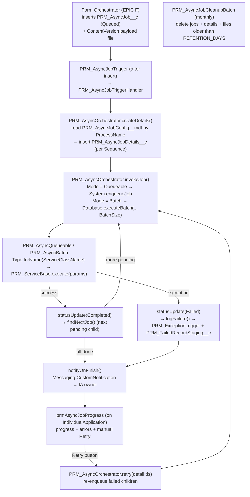

# Epic C — Async Framework (Implementation Guide)

> **Parent:** `PRM_IBC_HighVolume_TDD.md` (§11.4) · `PRM_Implementation_Plan.md` (EPIC C)
> **Goal:** build the **net-new, metadata-driven asynchronous execution framework** that offloads high-volume network/record creation off the synchronous OmniStudio path. Orchestrator inserts a parent `PRM_AsyncJob__c` → an after-insert trigger hands off to `PRM_AsyncOrchestrator` → it creates child `PRM_AsyncJobDetails__c` from Custom Metadata → dispatches them (Queueable/Batch) → chains the next pending child on finish → notifies the Case Manager on completion → stages failures to the DLQ. A monthly scheduled batch purges old jobs + their JSON files.
> **Estimate:** ~12.0 engineer-days · **Depends on:** EPIC A (objects/metadata/permission set), EPIC B (`PRM_OrchestratorBase`, `params`-map contract). · **Blocks:** EPIC E (async processor service), EPIC F (orchestrator that enqueues jobs).

> **Authoritative schema:** the object/field definitions in `**Epic_A_Environment_Setup.md`** are canonical for this epic. This guide does **not** redefine them — it consumes them. Where the parent TDD/plan still use the unprefixed `Async_Job__c` names, the `PRM_`-prefixed names from Epic A win.

---

## C0. Prerequisites & conventions

- **Depends on EPIC A deployed:** `PRM_AsyncJob__c`, `PRM_AsyncJobDetails__c` (Master-Detail child), `PRM_AsyncJobConfig__mdt`, the `PRM_AsyncJobDetails__c` lookup added to `PRM_FailedRecordStaging__c`, and the `PRM_AsyncJob_Access` permission set.
- **Depends on EPIC B:** `PRM_OrchestratorBase` (the form orchestrator that enqueues jobs is EPIC F, but it implements the EPIC B contract).
- **Grounded org conventions (follow exactly):**
  - **Triggers** are one-liners that delegate to a handler and honour the bypass permission:
    ```apex
    trigger PRM_AsyncJobTrigger on PRM_AsyncJob__c (after insert) {
        if (FeatureManagement.checkPermission('PRM_TriggerBypassPermission') == false) {
            new PRM_AsyncJobTriggerHandler().execute();
        }
    }
    ```
    (pattern copied from `PRM_AccountAccountRelationTrigger`.)
  - **Logging:** `PRM_ExceptionLogger.logException(...)` / `logExceptionReturnId(...)` — signature: `(processName, integrationType, severityLevel, stackTrace, errorMessage, exceptionType, lineNumber, correlationId, errorCode, sourceSystem, targetSystem, payload)`.
  - **DLQ:** `PRM_FailedRecordStaging__c` fields (existing): `PRM_Status__c`, `PRM_RetryCount__c`, `PRM_RequestPayload__c`, `PRM_ErrorMessage__c`, `PRM_ExceptionLog__c`, `PRM_LastRetriedAt__c`, `PRM_ParentRecordId__c`, `PRM_TargetObject__c`, `PRM_SourceFlow__c`, `PRM_CaseManager__c` + new `PRM_AsyncJobDetails__c` (Epic A A4).
  - Classes `PRM_`-prefixed, `with sharing` unless a system context is required (executors run `without sharing` only if the processor needs it — default `with sharing`); one class per file; ≥ 85% coverage; test class named `<Class>Test`.

---

## Component & data-flow overview




---

## C1 · Objects, seed config & Custom Notification Type — *1.0 d*

Schema is owned by **Epic A** — do not recreate it here. EPIC C adds the **runtime configuration** the framework reads:

1. **Seed `PRM_AsyncJobConfig__mdt` row** for the pilot process. (The `PRM_ServiceClassName__c` target — the EPIC E processor — may not exist yet; deploy this row when EPIC E lands, or point it at a stub.)

  | Field                     | Value (Practitioner Creation pilot)                                               |
  | ------------------------- | --------------------------------------------------------------------------------- |
  | `Label` / `DeveloperName` | `Practitioner Creation` / `Practitioner_Creation`                                 |
  | `PRM_ProcessName__c`      | `Practitioner Creation`                                                           |
  | `PRM_ServiceClassName__c` | `PRM_Level4RecordCreationService` *(EPIC E — confirm class name, see Open items)* |
  | `PRM_Mode__c`             | `Queueable` *(or `Batch` for very high volume — see CL-6)*                        |
  | `PRM_BatchSize__c`        | `200`                                                                             |
  | `PRM_Sequence__c`         | `1`                                                                               |

2. **Custom Notification Type** `PRM_AsyncJobNotification` (new declarative metadata — `customNotificationTypes/PRM_AsyncJobNotification.notiftype-meta.xml`):
  ```xml
   <?xml version="1.0" encoding="UTF-8"?>
   <CustomNotificationType xmlns="http://soap.sforce.com/2006/04/metadata">
       <customNotifTypeName>PRM_AsyncJobNotification</customNotifTypeName>
       <desktop>true</desktop>
       <mobile>true</mobile>
       <title>Async Job</title>
   </CustomNotificationType>
  ```
  > No Custom Notification Types exist in the repo today — this introduces the `customNotificationTypes/` folder. (Belongs logically in Epic A; included here because the mechanism was decided in this epic.)

**Acceptance:** config row deployable; notification type deployable and visible in Setup.

---

## C2 · `PRM_AsyncJobTrigger` + `PRM_AsyncJobTriggerHandler` — *1.0 d*

- **Trigger:** after-insert on `PRM_AsyncJob__c`, one line delegating to the handler (see C0 pattern). No logic in the trigger body.
- **Handler:** thin; passes the new parent jobs to the orchestrator. Keep it bulk-safe (handle a list of inserted jobs).

```apex
public with sharing class PRM_AsyncJobTriggerHandler {
    public void execute() {
        if (Trigger.isAfter && Trigger.isInsert) {
            new PRM_AsyncOrchestrator().onJobInserted((List<PRM_AsyncJob__c>) Trigger.new);
        }
    }
}
```

```apex
// PRM_AsyncOrchestrator
public void onJobInserted(List<PRM_AsyncJob__c> jobs) {
    for (PRM_AsyncJob__c job : jobs) {
        createDetails(job.Id);     // build children from config
    }
    // dispatch first pending child per job (async — keep trigger txn light)
    for (PRM_AsyncJob__c job : jobs) {
        findNextJob(job.Id);
    }
}
```

> **Governor note:** child creation + the first `System.enqueueJob` happen from an after-insert trigger context. Enqueue is allowed from triggers; if `Mode = Batch`, defer `Database.executeBatch` to a Queueable to avoid the "Database.executeBatch cannot be called from a batch/trigger in certain contexts" pitfall (dispatch via a one-shot Queueable that starts the batch).

**Acceptance:** trigger delegates to handler → orchestrator; child rows created with correct `PRM_Mode__c` / `PRM_Sequence__c`; no logic in trigger body; bulk-safe (200 parent jobs in one insert).

---

## C3 · `PRM_AsyncOrchestrator` — *4.0 d*

Central controller. All methods bulk-safe; no business logic (that's the processor in EPIC E).

**Method write-up:**

- `**onJobInserted(List<PRM_AsyncJob__c>)`** — C2 trigger entry point invoked after parent jobs are inserted.
For each new job it builds the child work items, then dispatches the first pending child per job.
- `**createDetails(Id jobId)**` — reads `PRM_AsyncJobConfig__mdt` rows for the job's `PRM_ProcessName__c` (ordered by `PRM_Sequence__c`).
Inserts one `PRM_AsyncJobDetails__c` per config row, seeding `PRM_Mode__c` / `PRM_BatchSize__c` and `PRM_Status__c = 'Queued'`.
- `**findNextJob(Id jobId)**` — selects the next `Queued` child for the job (by sequence/created date) and dispatches it.
When none remain, it rolls the parent up to `Completed` and fires the finish notification.
- `**invokeJob(PRM_AsyncJobDetails__c detail)**` — marks the child `Running` and dispatches by `PRM_Mode__c`.
`Batch` → `Database.executeBatch(.., PRM_BatchSize__c)`, otherwise `System.enqueueJob`, passing the `PRM_ServiceClassName__c` the executor resolves to a `PRM_ServiceBase`.
- `**statusUpdate(Id recordId, String status, String errorMessage)**` — central status setter for a child or parent record.
Persists the new `PRM_Status__c` (and any error message), keeping all transitions in one place.
- `**retry(List<Id> detailIds)**` — manual retry entry point called from the LWC for `Failed` children (no cap).
Flips them back to `Queued` and re-dispatches each via `invokeJob`.
- `**jsonFileParser(Id jobId)**` — locates the parent job's latest ContentVersion payload file via `ContentDocumentLink`.
Reads and deserializes the JSON so the processor can consume the typed/raw payload.
- `**logFailure(PRM_AsyncJobDetails__c detail, Exception e, String payload)**` — writes the failure to the existing `PRM_ExceptionLogger`.
Then creates a `PRM_FailedRecordStaging__c` (DLQ) row linking the returned exception-log Id, error and payload.
- `**notifyOnFinish(Id jobId, String finalStatus)**` — sends the `PRM_AsyncJobNotification` Custom Notification on completion/failure.
Targets the Case Manager (IA) record and notifies the configured recipient (default: job creator).
- `**configFor` / `notificationTypeId` / `recipientFor**` — private helpers: cached `PRM_AsyncJobConfig__mdt` lookup, Custom Notification Type Id resolution, and recipient resolution.
Keep the public methods terse and avoid repeated SOQL.

```apex
public with sharing class PRM_AsyncOrchestrator {

    // --- C2 entry ---
    public void onJobInserted(List<PRM_AsyncJob__c> jobs) { /* see C2 */ }

    // 1. createDetails: read PRM_AsyncJobConfig__mdt by ProcessName → insert child details
    public void createDetails(Id jobId) {
        PRM_AsyncJob__c job = [SELECT Id, PRM_ProcessName__c, PRM_CaseManager__c
                               FROM PRM_AsyncJob__c WHERE Id = :jobId];
        List<PRM_AsyncJobConfig__mdt> cfgs = [
            SELECT PRM_ProcessName__c, PRM_ServiceClassName__c, PRM_Mode__c,
                   PRM_BatchSize__c, PRM_Sequence__c
            FROM PRM_AsyncJobConfig__mdt
            WHERE PRM_ProcessName__c = :job.PRM_ProcessName__c
            ORDER BY PRM_Sequence__c ASC];
        List<PRM_AsyncJobDetails__c> details = new List<PRM_AsyncJobDetails__c>();
        for (PRM_AsyncJobConfig__mdt c : cfgs) {
            details.add(new PRM_AsyncJobDetails__c(
                PRM_AsyncJob__c     = job.Id,
                PRM_CaseManager__c  = job.PRM_CaseManager__c,
                PRM_ProcessName__c  = c.PRM_ProcessName__c,
                PRM_Mode__c         = c.PRM_Mode__c,
                PRM_BatchSize__c    = (Integer) c.PRM_BatchSize__c,
                PRM_Status__c       = 'Queued'));
        }
        insert details;
    }

    // 2. findNextJob: pick the next Queued child (by Sequence) and dispatch it
    public void findNextJob(Id jobId) {
        List<PRM_AsyncJobDetails__c> next = [
            SELECT Id, PRM_Mode__c, PRM_BatchSize__c, PRM_ProcessName__c
            FROM PRM_AsyncJobDetails__c
            WHERE PRM_AsyncJob__c = :jobId AND PRM_Status__c = 'Queued'
            ORDER BY CreatedDate ASC LIMIT 1];
        if (next.isEmpty()) {
            statusUpdate(jobId, 'Completed', null);   // parent: roll up
            notifyOnFinish(jobId, 'Completed');
            return;
        }
        invokeJob(next[0]);
    }

    // 3. invokeJob: dispatch by Mode (executor resolves the PRM_ServiceBase via config ServiceClassName)
    public void invokeJob(PRM_AsyncJobDetails__c detail) {
        PRM_AsyncJobConfig__mdt cfg = configFor(detail.PRM_ProcessName__c);
        update new PRM_AsyncJobDetails__c(Id = detail.Id, PRM_Status__c = 'Running');
        if (detail.PRM_Mode__c == 'Batch') {
            Database.executeBatch(new PRM_AsyncBatch(detail.Id, cfg.PRM_ServiceClassName__c),
                                  (Integer) detail.PRM_BatchSize__c);
        } else {
            System.enqueueJob(new PRM_AsyncQueueable(detail.Id, cfg.PRM_ServiceClassName__c));
        }
    }

    // 4. statusUpdate: set child/parent status (+ optional error)
    public void statusUpdate(Id recordId, String status, String errorMessage) { /* update SObject */ }

    // 5. retry: MANUAL only (called by the LWC controller) — re-enqueue failed children (no cap)
    public void retry(List<Id> detailIds) {
        List<PRM_AsyncJobDetails__c> retriable = [
            SELECT Id, PRM_Mode__c, PRM_BatchSize__c, PRM_ProcessName__c
            FROM PRM_AsyncJobDetails__c
            WHERE Id IN :detailIds AND PRM_Status__c = 'Failed'];
        for (PRM_AsyncJobDetails__c d : retriable) d.PRM_Status__c = 'Queued';
        update retriable;
        for (PRM_AsyncJobDetails__c d : retriable) invokeJob(d);
    }

    // 6. jsonFileParser: read the parent's ContentVersion payload file → typed/raw payload
    public Object jsonFileParser(Id jobId) {
        Id cdId = [SELECT ContentDocumentId FROM ContentDocumentLink
                   WHERE LinkedEntityId = :jobId ORDER BY SystemModstamp DESC LIMIT 1].ContentDocumentId;
        ContentVersion cv = [SELECT VersionData FROM ContentVersion
                             WHERE ContentDocumentId = :cdId AND IsLatest = true LIMIT 1];
        return JSON.deserializeUntyped(cv.VersionData.toString());
    }

    // 7. logFailure: existing logger → staging (DLQ)
    public void logFailure(PRM_AsyncJobDetails__c detail, Exception e, String payload) {
        String logId = PRM_ExceptionLogger.logExceptionReturnId(
            detail.PRM_ProcessName__c, 'Async', 'Error',
            e.getStackTraceString(), e.getMessage(), e.getTypeName(),
            e.getLineNumber(), String.valueOf(detail.PRM_AsyncJob__c),
            null, 'Salesforce', null, payload);
        insert new PRM_FailedRecordStaging__c(
            PRM_AsyncJobDetails__c = detail.Id,
            PRM_CaseManager__c     = detail.PRM_CaseManager__c,
            PRM_ProcessName__c     = detail.PRM_ProcessName__c, // if present; else PRM_SourceFlow__c
            PRM_SourceFlow__c      = detail.PRM_ProcessName__c,
            PRM_Status__c          = 'Failed',
            PRM_ErrorMessage__c    = e.getMessage(),
            PRM_ExceptionLog__c    = logId,
            PRM_RequestPayload__c  = payload);
    }

    // 8. notifyOnFinish: Custom Notification to the Case Manager (IA) owner
    public void notifyOnFinish(Id jobId, String finalStatus) {
        PRM_AsyncJob__c job = [SELECT Id, CreatedById, PRM_CaseManager__c, PRM_CaseManager__r.OwnerId
                               FROM PRM_AsyncJob__c WHERE Id = :jobId];
        Messaging.CustomNotification n = new Messaging.CustomNotification();
        n.setNotificationTypeId(notificationTypeId());   // SOQL CustomNotificationType by DeveloperName
        n.setTitle('Async Job ' + finalStatus);
        n.setBody('Process completed with status: ' + finalStatus);
        n.setTargetId(job.PRM_CaseManager__c != null ? job.PRM_CaseManager__c : jobId);
        n.send(new Set<String>{ String.valueOf(recipientFor(job)) });
    }

    PRM_AsyncJobConfig__mdt configFor(String processName) { /* cached query */ return null; }
    Id notificationTypeId() { /* SELECT Id FROM CustomNotificationType WHERE DeveloperName = 'PRM_AsyncJobNotification' */ return null; }
    Id recipientFor(PRM_AsyncJob__c job) { return job.CreatedById; } // see Open items
}
```

**Acceptance:** `createDetails` builds children from config in `PRM_Sequence__c` order; `findNextJob`/`invokeJob` chain pending children; `retry` re-enqueues failed children; `jsonFileParser` round-trips the ContentVersion payload; `logFailure` creates a `PRM_FailedRecordStaging__c` linked to a `PRM_ExceptionLog__c`; `notifyOnFinish` fires a Custom Notification.

---

## C4 · Async executors (reuse `PRM_ServiceBase`) — *2.0 d*

> **No dedicated `PRM_AsyncProcessor` interface.** The async worker is just a normal `**PRM_ServiceBase`** subclass (Epic B) built per-form in **EPIC E** — same `execute(Map<String,Object>) : Map<String,Object>` contract as every other service. The executors resolve it from `PRM_ServiceClassName__c`, hand it the work unit in `params`, and read the outcome from the returned map.

- `**params` the executor passes to `execute()`** — `detailId`, `jobId` (parent), `caseManagerId`, `processName`, and `payload` (the parsed ContentVersion JSON from `jsonFileParser`).
- **Response map convention** — `success` (Boolean, required); on failure `error`/`message` (String); optional `recordsProcessed` (Integer).
- **Queueable executor** — `PRM_AsyncQueueable implements Queueable, Database.AllowsCallouts`:
  - resolves the service: `((PRM_ServiceBase) Type.forName(serviceClassName).newInstance())`;
  - calls `execute(params)`; on `success` → `statusUpdate('Completed')` then `findNextJob(parentId)`; otherwise → `statusUpdate('Failed')` + `logFailure()` + `notifyOnFinish('Failed')`.
- **Batch executor** — `PRM_AsyncBatch implements Database.Batchable<SObject>, Database.Stateful` for very large volumes; same resolve/delegate/finalize contract; `finish()` calls `findNextJob`.

```apex
public with sharing class PRM_AsyncQueueable implements Queueable, Database.AllowsCallouts {
    final Id detailId; final String serviceClassName;
    public PRM_AsyncQueueable(Id detailId, String serviceClassName) {
        this.detailId = detailId; this.serviceClassName = serviceClassName;
    }
    public void execute(QueueableContext qc) {
        PRM_AsyncOrchestrator orch = new PRM_AsyncOrchestrator();
        PRM_AsyncJobDetails__c d = [SELECT Id, PRM_AsyncJob__c, PRM_ProcessName__c, PRM_CaseManager__c
                                    FROM PRM_AsyncJobDetails__c WHERE Id = :detailId];
        try {
            Type t = Type.forName(serviceClassName);
            if (t == null) throw new PRM_AsyncException('Service class not found: ' + serviceClassName);
            PRM_ServiceBase svc = (PRM_ServiceBase) t.newInstance();
            Map<String, Object> params = new Map<String, Object>{
                'detailId'      => d.Id,
                'jobId'         => d.PRM_AsyncJob__c,
                'caseManagerId' => d.PRM_CaseManager__c,
                'processName'   => d.PRM_ProcessName__c,
                'payload'       => orch.jsonFileParser(d.PRM_AsyncJob__c)
            };
            Map<String, Object> res = svc.execute(params);
            Boolean ok = res != null && res.get('success') == true;
            orch.statusUpdate(d.Id, ok ? 'Completed' : 'Failed',
                              ok ? null : String.valueOf(res?.get('error')));
            if (!ok) orch.logFailure(d, new PRM_AsyncException(String.valueOf(res?.get('error'))), null);
            orch.findNextJob(d.PRM_AsyncJob__c);
        } catch (Exception e) {
            orch.statusUpdate(d.Id, 'Failed', e.getMessage());
            orch.logFailure(d, e, null);
            orch.notifyOnFinish(d.PRM_AsyncJob__c, 'Failed');
        }
    }
}
```

> `Type.forName(...)` returns `null` for an unknown/inaccessible class — guard it (as above) and stage a clear "service not found" failure rather than NPE.

**Acceptance:** executor resolves the `PRM_ServiceBase` from `PRM_ServiceClassName__c`, calls `execute(params)`, finalizes status from the response map, and chains via `findNextJob`; a failed unit → `PRM_Status__c='Failed'` + a staging row with `PRM_ErrorMessage__c`.

---

## C5 · `prmAsyncJobProgress` LWC + Apex controller — *2.5 d*

- **Host:** `IndividualApplication` record page (= Case Manager). Lightning App Builder component; `@api recordId` = the IA Id.
- **Apex controller** `PRM_AsyncJobProgressController` (`with sharing`):
  - `@AuraEnabled(cacheable=true) getProgress(Id caseManagerId)` → returns parent job(s) + child rows for that IA (query by `PRM_CaseManager__c = :caseManagerId`), shaped as a progress DTO (status, counts, per-child error, retriable flag = `PRM_Status__c == 'Failed'`).
  - `@AuraEnabled retryFailed(List<Id> detailIds)` → calls `new PRM_AsyncOrchestrator().retry(detailIds)`; returns refreshed progress.
- **LWC behaviour:**
  - on load → `getProgress`; render an overall progress bar + a datatable of children (Process, Status badge, Error).
  - **Refresh** button → `refreshApex(this.wiredProgress)` (no streaming — finish alerts arrive via the Custom Notification bell).
  - **Retry** button (row-level + bulk for failed rows) → `retryFailed(detailIds)` → then refresh; shown for `Failed` children (no retry cap).
- **Exposure:** `prmAsyncJobProgress.js-meta.xml` targets `lightning__RecordPage`, restricted to the `IndividualApplication` object.

**Acceptance:** component renders live status for the IA's jobs; errors visible per child; Retry re-runs failed children and reflects the new status after refresh.

### C5.1 · Mockup screen (SLDS reference design)

The interactive SLDS reference for this component is `**prmAsyncJobProgress_Mockup.html`** (open in a browser — the Failed / Queued / Completed / Running tabs are clickable). Static preview of the **All-Jobs** view:


**What the screen shows (and how it maps to the build):**

- **Page header** — context (`IndividualApplication` = Case Manager + parent `PRM_AsyncJob__c`) with **Refresh** and **Retry Failed Jobs** actions.
- **Summary dashboard** — Total / Completed / Failed / Queued / Running counts + **Success Rate** and last-refresh timestamp; an overall multi-segment progress bar.
- **Tabs** — `All Jobs · Failed · Queued · Completed · Running`, each a filtered view of the child `PRM_AsyncJobDetails__c` rows.
- **Grid columns** — Job Name/Type (`PRM_ProcessName__c` + `PRM_Mode__c`), Job ID (auto-number), **Status** color-coded badge (green/red/orange/blue), Triggered By (`CreatedBy`), **Sequence** (`PRM_AsyncJobConfig__mdt.PRM_Sequence__c`), Last Update, row actions (View / **Retry** for failed).
- **Section views** — Failed (error summary + per-row Retry), Queued (queue position / scheduled / ETA), Completed (completion time / duration / records), Running (records progress).

> **Schema caveat (carried from the mockup footer):** `Queue Position`, `Estimated/Scheduled Execution`, `Duration`, and `Records` are **not** in the current schema — they're either computed or need new fields. Confirm scope before building those columns (see C9). Everything else maps to existing fields.

#### Build tasks (implementation-ready)

**Bundle / file layout**

```
force-app/main/default/
├─ lwc/prmAsyncJobProgress/
│  ├─ prmAsyncJobProgress.js
│  ├─ prmAsyncJobProgress.html
│  ├─ prmAsyncJobProgress.css
│  └─ prmAsyncJobProgress.js-meta.xml
└─ classes/
   ├─ PRM_AsyncJobProgressController.cls        (+ .cls-meta.xml)
   └─ PRM_AsyncJobProgressControllerTest.cls
```

**SLDS / base-component mapping** (build with base components, not hand-rolled HTML, to inherit SLDS for free):


| Mockup element          | Build with                                                                                                                |
| ----------------------- | ------------------------------------------------------------------------------------------------------------------------- |
| Page header + actions   | `lightning-card` (custom header slot) or `lightning-page-header` markup; `lightning-button` (Refresh / Retry Failed Jobs) |
| Summary stat cards      | SLDS grid (`slds-grid slds-wrap` / `slds-col`) of small `lightning-card`s with colored accent                             |
| Overall progress bar    | `lightning-progress-bar` (or a custom multi-segment SLDS bar)                                                             |
| Tabs                    | `lightning-tabset` + `lightning-tab` (All / Failed / Queued / Completed / Running) with a count `lightning-badge`         |
| Job grids               | `lightning-datatable` (custom `cellAttributes` for the status badge + row-action column)                                  |
| Status badge            | custom cell / `lightning-badge` with status-driven SLDS theme class + `lightning-icon`                                    |
| Row + header actions    | `lightning-button` / `lightning-button-icon`; datatable `onrowaction`                                                     |
| Loading / empty / error | `lightning-spinner`, `lightning-icon` empty-state, inline error                                                           |
| Toasts                  | `ShowToastEvent` (retry success/failure)                                                                                  |


**Task list**


| #   | Task                                   | Deliverable / detail                                                                                                                                                                                                                                                                                                                     | Est (d) |
| --- | -------------------------------------- | ---------------------------------------------------------------------------------------------------------------------------------------------------------------------------------------------------------------------------------------------------------------------------------------------------------------------------------------- | ------- |
| T1  | Apex `getProgress(Id caseManagerId)`   | `@AuraEnabled(cacheable=true)`. Query parent `PRM_AsyncJob__c` + child `PRM_AsyncJobDetails__c` where `PRM_CaseManager__c = :caseManagerId`. Enforce CRUD/FLS (`with sharing`, `WITH SECURITY_ENFORCED`). Return a `ProgressDTO`.                                                                                                        | 0.5     |
| T2  | DTO wrapper(s)                         | `ProgressDTO { Integer total, completed, failed, queued, running; Decimal successRate; Datetime lastRefresh; List<JobRow> rows; }` and `JobRow { Id detailId; String name, jobId, type, status, triggeredBy; Integer sequence; Datetime lastUpdate; String error; Boolean retriable; }`. `successRate = completed / (completed+failed)`. | 0.3     |
| T3  | Apex `retryFailed(List<Id> detailIds)` | `@AuraEnabled`; delegates to `new PRM_AsyncOrchestrator().retry(detailIds)`; returns the refreshed `ProgressDTO`.                                                                                                                                                                                                                        | 0.2     |
| T4  | LWC scaffold + meta                    | Bundle + `js-meta.xml` targeting `lightning__RecordPage`, restricted to `IndividualApplication`. `@api recordId`. Wire `getProgress({ caseManagerId: '$recordId' })` to `wiredProgress`.                                                                                                                                                 | 0.2     |
| T5  | Summary dashboard                      | Stat cards (Total / Completed / Failed / Queued / Running / Success Rate) + last-refresh timestamp + overall multi-segment progress bar, all driven by `ProgressDTO`.                                                                                                                                                                    | 0.3     |
| T6  | Tabs + filtered grids                  | `lightning-tabset` with five tabs; each tab a `lightning-datatable` filtered by status (All shows everything). Count badges from the DTO.                                                                                                                                                                                                | 0.4     |
| T7  | Status badges + icons                  | Status→theme map (Completed=success/green, Failed=error/red, Queued=warning/orange, Running=info/blue) with matching `lightning-icon`; custom datatable cell.                                                                                                                                                                            | 0.2     |
| T8  | Actions                                | Header **Refresh** → `refreshApex(this.wiredProgress)`; header **Retry Failed Jobs** → `retryFailed(allFailedIds)`; row **Retry** (only when `retriable`) and **View** (`NavigationMixin` to the detail record) via `onrowaction`. Toast on result, then `refreshApex`.                                                                  | 0.3     |
| T9  | Pagination + states                    | Client-side pagination (page size ~10) for large grids; spinner while loading; empty-state when no jobs; inline error on Apex failure.                                                                                                                                                                                                   | 0.2     |
| T10 | Responsive CSS                         | `prmAsyncJobProgress.css` — SLDS grid so stat cards reflow (6→3→2) and tables scroll on tablet widths.                                                                                                                                                                                                                                   | 0.1     |
| T11 | Permission wiring                      | Add `PRM_AsyncJobProgressController` Apex class access to the `PRM_AsyncJob_Access` permission set (Epic A A5).                                                                                                                                                                                                                          | 0.1     |
| T12 | Tests                                  | Jest: render, wire data, tab filtering, retry calls Apex + refresh, empty/error states. Apex: `getProgress` counts/successRate, FLS, `retryFailed` delegates to orchestrator (≥ 85%).                                                                                                                                                    | 0.4     |


> **Total ≈ 2.5 d** — consistent with the C5 estimate. Columns flagged in the schema caveat (Queue Position / ETA / Scheduled / Duration / Records) are **excluded** from T1/T2 until the fields are confirmed in C9; the mockup shows them as the target end-state.

> **Notification:** the LWC does **not** subscribe to a stream — finish alerts arrive via the `PRM_AsyncJobNotification` Custom Notification (C3). The user re-opens / **Refresh**es to see the latest, matching the manual-refresh decision.

---

## C6 · `PRM_AsyncJobCleanupBatch` + scheduler — *1.5 d*

- **Class:** `global class PRM_AsyncJobCleanupBatch implements Database.Batchable<SObject>, Schedulable` (mirrors the existing `PRM_DeleteExceptionLogBatch` pattern).
- **Constant:** `@TestVisible static final Integer RETENTION_DAYS = 90;` (configurable by code change only — Epic A A7 decision).
- `**start`:** `SELECT Id FROM PRM_AsyncJob__c WHERE CreatedDate < LAST_N_DAYS:RETENTION_DAYS AND PRM_Status__c IN ('Completed','Failed')`.
- `**execute`:** delete the parent jobs — Master-Detail **cascade-deletes** `PRM_AsyncJobDetails__c`; also delete the linked `ContentDocument`s (collect `ContentDocumentId` via `ContentDocumentLink` for the job Ids, then `delete` the `ContentDocument`s).
- `**finish`:** optional summary log.
- `**schedulable.execute`** → `Database.executeBatch(new PRM_AsyncJobCleanupBatch(), 200)`.
- **Schedule:** monthly — `System.schedule('PRM Async Job Cleanup', '0 0 2 1 * ?', new PRM_AsyncJobCleanupBatch())` (2 AM on the 1st). Document the CRON in the deploy runbook.

> Deleting `ContentDocument` removes the file for all links; safe here because each payload file belongs to exactly one job. Confirm no other entity links the same file.

**Acceptance:** jobs + details + JSON files older than `RETENTION_DAYS` are purged; staging (`PRM_FailedRecordStaging__c`) is **not** deleted (separate retention); threshold change is a one-line constant edit; schedulable registered.

---

## C7 · Build order, dependencies & effort

```
C1 Objects/config/notif  →  C2 Trigger+handler  →  C3 PRM_AsyncOrchestrator  →  C4 Processor IF + executors  →  C5 LWC + controller  →  C6 Cleanup batch
```

- C1 needs EPIC A deployed. C2→C3→C4 are sequential (each builds on the prior). C5 needs C3 (`retry`) + C4 (status it renders). C6 is independent of C2–C5 (only needs the objects).
- The **worker service** (the `PRM_ServiceBase` subclass named in `PRM_ServiceClassName__c`) is **EPIC E** — C4 only defines the executors; wire the real seed-config class name when E lands.


| Task                                                 | Est (d)  |
| ---------------------------------------------------- | -------- |
| C1 · Objects, seed config & Custom Notification Type | 1.0      |
| C2 · `PRM_AsyncJobTrigger` + handler                 | 1.0      |
| C3 · `PRM_AsyncOrchestrator`                         | 4.0      |
| C4 · Async executors (reuse `PRM_ServiceBase`)       | 2.0      |
| C5 · `prmAsyncJobProgress` LWC + controller          | 2.5      |
| C6 · `PRM_AsyncJobCleanupBatch` + scheduler          | 1.5      |
| **EPIC C total**                                     | **12.0** |


---

## C8 · Testing strategy


| Area            | Coverage                                                                                                                                                                                                                                                           |
| --------------- | ------------------------------------------------------------------------------------------------------------------------------------------------------------------------------------------------------------------------------------------------------------------ |
| Trigger/handler | bulk insert (200 jobs) creates correct children; bypass permission short-circuits                                                                                                                                                                                  |
| Orchestrator    | `createDetails` order by `PRM_Sequence__c`; `findNextJob` chaining; `retry` re-enqueues failed children; `jsonFileParser` round-trip; `logFailure` creates linked staging + exception log; `notifyOnFinish` (assert no exception, use `Test.startTest`/`stopTest`) |
| Executors       | success path finalizes + chains; exception path → Failed + staging; unknown `ServiceClassName` → guarded failure (no NPE)                                                                                                                                          |
| LWC controller  | `getProgress` shape; `retryFailed` re-enqueues failed children; FLS/CRUD enforced (`with sharing`)                                                                                                                                                                 |
| Cleanup batch   | only `Completed`/`Failed` older than `RETENTION_DAYS` deleted; cascade removes details; files deleted; schedulable registers                                                                                                                                       |


- Use a `Test`-only `PRM_ServiceBase` stub subclass (success + throwing variants) so EPIC C is testable **without** EPIC E.

---

## C9 · Open items


| Ref                                             | Item                                                                                                                                                                     | Action / Owner                                                          |
| ----------------------------------------------- | ------------------------------------------------------------------------------------------------------------------------------------------------------------------------ | ----------------------------------------------------------------------- |
| CL-6                                            | High-volume target object (HCFN only vs `NetworkMember`/`NetworkMemberChunk`) drives whether the pilot config `PRM_Mode__c` is `Queueable` or `Batch` and the chunk size | Confirm before EPIC E; adjust the seed config row — Tech Lead           |
| Processor class name                            | Seed `PRM_ServiceClassName__c = PRM_Level4RecordCreationService` is a **placeholder** — the EPIC E class name is not finalized                                           | Confirm when EPIC E is scoped — Eng                                     |
| Notification recipient                          | `notifyOnFinish` targets `job.CreatedById` (submitter). Alternatives: IA owner, or a queue/group                                                                         | Confirm recipient policy — BA/Tech Lead                                 |
| Custom Notification Type home                   | `PRM_AsyncJobNotification` is declarative — logically belongs in Epic A but defined here                                                                                 | Reconcile when consolidating declarative metadata — Eng                 |
| Correlation id                                  | `logFailure` uses the parent job Id as `correlationId`; B6 flags case Id vs async job Id                                                                                 | Confirm during wiring — Eng (B6)                                        |
| Batch-from-trigger                              | If `Mode='Batch'`, start the batch from a one-shot Queueable (not directly in the trigger context)                                                                       | Implement in C2/C3 — Eng                                                |
| `PRM_FailedRecordStaging__c.PRM_ProcessName__c` | Snippet writes both `PRM_ProcessName__c` and `PRM_SourceFlow__c`; staging only has `PRM_SourceFlow__c` (per Epic A field list)                                           | Use `PRM_SourceFlow__c`; drop `PRM_ProcessName__c` if not present — Eng |


---

> **Reconciliation note:** the parent TDD (§11.4) and `PRM_Implementation_Plan.md` describe the finish notification as "Platform Event / Notification" and retry as automatic (`re-invoke up to MAX_RETRIES`). This guide ratifies **Custom Notification Type** + **manual retry** per the latest decisions. Update the parent docs when convenient (scoped out of this child doc).

