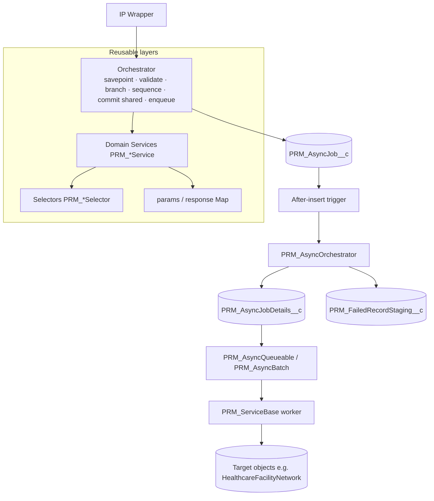
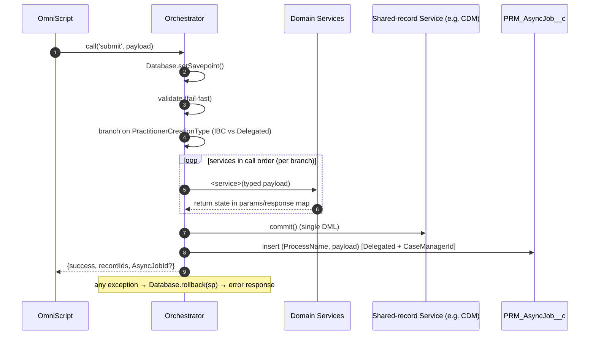
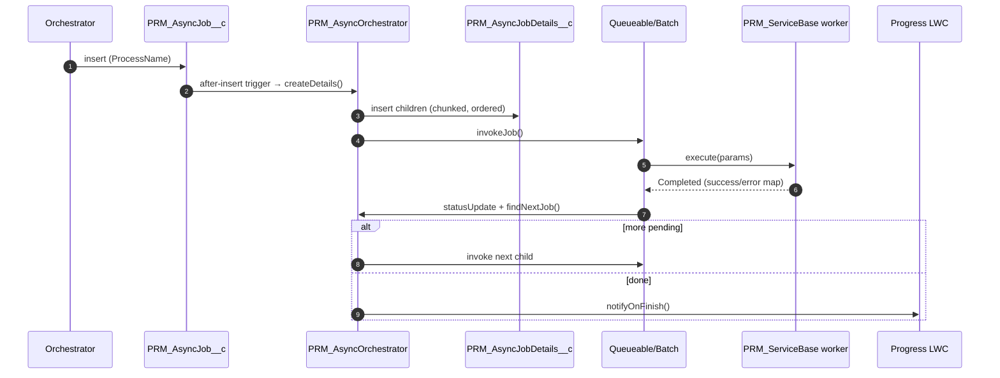
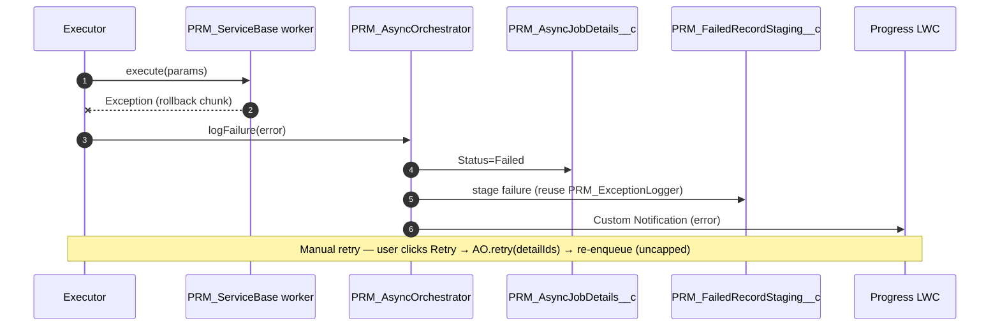
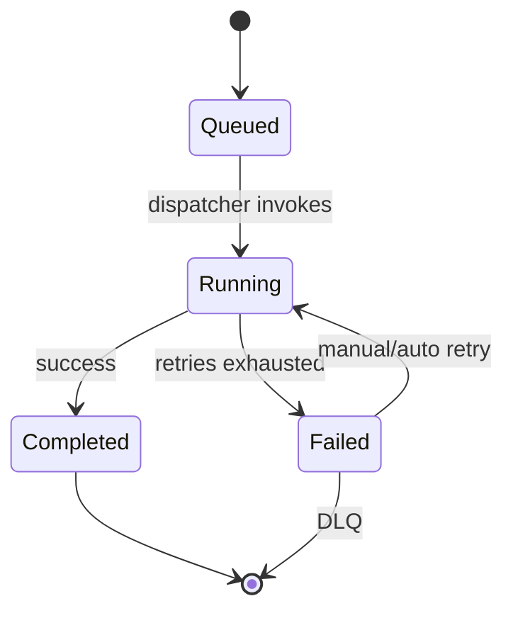

# IBC High Volume Design — Technical Design Document (TDD)

> **Platform:** Salesforce (Apex, OmniStudio IPs/DataRaptors, Custom Notifications, Custom Metadata, Async Apex)
> **Intent:** Define a **reusable record-creation framework** (layered Apex services + a metadata-driven async engine) for PRM forms. **Practitioner Creation Form is the first/pilot conversion** through this design; the remaining forms (PAR Form, PDM Manual Update, Ancillary, etc.) are converted later and **reuse the same services, selectors, and async framework**.
> **Related:** `PRM_Implementation_Plan.md` (Practitioner Creation build plan — source of truth for §11), `PRM_Apex_Reference_Implementation.md`, `PRM_PractitionerCreation_Apex_Service_Flow.md`, `PRM_Service_JSON_Contracts.md`.

> **Vocabulary note:** this is a Salesforce-native system. Generic terms map to platform primitives — *broker/queue → `PRM_AsyncJob__c` / `PRM_AsyncJobDetails__c` + Apex Flex Queue*, *DLQ → `PRM_FailedRecordStaging__c`*, *topic/routing → `ProcessName` + Custom Metadata*, *finish notification → Custom Notification (`PRM_AsyncJobNotification`)*. No external infrastructure is introduced.

---

## 1. Executive Summary

### 1.1 Problem statement

Currently, the IBX utilizes OmniScripts, Integration Procedures (IPs), and DataMapper Loads to manage record ingestion and orchestration. Although this declarative design pattern is highly configurable, it experiences severe performance degradation under peak loads and high-volume data processing—specifically when scaling to include more records, locations, or groups within the guided flow

### 1.2 Business goals

- **One reusable framework**, not per-form rewrites — convert Practitioner Creation first, then reuse for all PRM forms.
- **Reliability:** transactional, all-or-nothing synchronous writes.
- **Scale:** absorb high-volume submissions without governor failures.
- **Observability & recovery:** every async job tracked, retryable, and visible.
- **Maintainability:** testable Apex replacing fragile DR chains.

---

## 2. Background & Context

### 2.1 Current system overview

- **UI:** OmniScripts collect form data; an IP wrapper persists records via chained DataRaptors.
- **Pattern (all forms):** parent IP → multiple sub-IPs → many DR Extract/Transform/Load steps writing standard Health Cloud + PRM custom objects.
- **Pilot (Practitioner Creation):** `PRM_PractitionerCreationContainer` **v6** → **3 sub-IPs** — `PRM_PractitionerCreation` (base / IBC Professional Staff), `PRM_DelegatedPractitionerCreation` (Delegated Credentialing), `PRM_AddressLogicContainer` (locations/facilities). The orchestrator branches on `PractitionerCreationType`.

### 2.2 Existing challenges (common to all forms)

- **Governor limits** from per-record DR loops + transform chaining (CPU/DML/SOQL/heap).
- **No transaction control** — incremental commits leave orphans on failure.
- **Shared-record contention** — e.g. the Case Data Manager record is written by **both** creation sub-IPs (`PRMDRCreateCDMForPractitioner` / `PRMDRPCDMCaseManagerLink`) → `UNABLE_TO_LOCK_ROW`.
- **No durable/trackable async** for heavy work (e.g. `HealthcareFacilityNetwork` creation).
- **Low maintainability/testability** — logic scattered across dozens of DRs.

### 2.3 Business drivers

- Provider-network growth → larger submissions.
- Onboarding SLA pressure + cost of manual remediation.
- Need to modernize **once** and apply across the form portfolio.

---

## 3. Core Problems


| #   | Problem                                  | Root cause                                         | Impact                                                | Why DR/IP is insufficient                    |
| --- | ---------------------------------------- | -------------------------------------------------- | ----------------------------------------------------- | -------------------------------------------- |
| P1  | Governor-limit exhaustion on high volume | Synchronous per-record DR loops + transform chains | Hard failures on large rosters; unpredictable ceiling | DRs can't defer/bulk/chain on a fresh budget |
| P2  | Non-transactional partial writes         | No orchestration-level savepoint                   | Orphaned records; data-integrity risk                 | DR rollback is per-step, not cross-step      |
| P3  | Shared-record (CDM) contention           | Each DR independently writes the shared record     | Lock errors under concurrency; retries                | No shared in-memory state to coalesce writes |
| P4  | No durable async / job tracking          | Fire-and-forget; no job record/status/retry        | Silent network-creation failures; no recovery         | AsyncApexJob alone isn't business-trackable  |
| P5  | Maintainability & testability            | Logic spread across cryptic DRs                    | Slow, risky changes; no CI coverage                   | DRs are effectively untestable               |


---

## 4. High-Level Design (HLD)

A **layered, bulk-first Apex architecture** behind the unchanged OmniScript/IP contract, plus a **metadata-driven async engine** shared by all forms.


| Layer                                   | Responsibility                                                                                                                                    | Reuse                   |
| --------------------------------------- | ------------------------------------------------------------------------------------------------------------------------------------------------- | ----------------------- |
| **L0 Transport**                        | Thin IP wrapper → orchestrator (`Callable`)                                                                                                       | per form (config)       |
| **L1 Orchestrator**                     | Owns transaction (savepoint/rollback), validates, **branches** (IBC vs Delegated), sequences services, commits shared record once, enqueues async | per form                |
| **L2 Domain services** (`PRM_*Service`) | Build + **one bulk DML per object type**; carry state (ids + CDM flags) via the `params`/response map                                             | **shared across forms** |
| **L3 Selectors** (`PRM_*Selector`)      | All SOQL, bulk-safe, typed                                                                                                                        | **shared**              |
| **L4 Utilities**                        | `PRM_FormSubUtility` + abstract base classes (logging/validation per CL-13)                                                                       | **shared**              |
| **Async engine**                        | `PRM_AsyncJob__c` → trigger → `PRM_AsyncOrchestrator` → `PRM_AsyncJobDetails__c` → executors → processors; DLQ; LWC; cleanup                           | **shared (generic)**    |


**Reuse model:** a new form = new payload type + validator + orchestrator that **sequences existing services**, plus (optionally) a new async `ProcessName` + processor. Practitioner Creation proves the framework; subsequent forms reuse ~70–90%.

---

## 5. Architecture & Design Diagrams

### 5.1 Context (form-agnostic)

```mermaid
flowchart LR
    U([Case Manager / Provider Ops]):::a
    OS[OmniScript Form<br/>Practitioner Creation · then others]:::ui
    IP[IP Wrapper - Callable]:::s
    ORC[Form Orchestrator]:::s
    SVC[Reusable Domain Services]:::s
    ASYNC[Async Engine<br/>PRM_AsyncJob__c plane]:::y
    DB[(PRM / Health Cloud Data)]:::d
    LWC[Progress + Retry LWC]:::ui
    U-->OS-->IP-->ORC-->SVC-->DB
    ORC-->ASYNC-->DB
    U-->LWC-->ASYNC
    classDef a fill:#2563eb,color:#fff; classDef ui fill:#0ea5e9,color:#fff;
    classDef s fill:#6366f1,color:#fff; classDef y fill:#f59e0b,color:#111; classDef d fill:#10b981,color:#fff;
```


### 5.2 High-level architecture




### 5.3 Sync submission sequence (generic)




---

## 6. Async Processing Framework Design

The async engine is a **metadata-driven, durable job pipeline** — generic across forms; a form only contributes a `ProcessName` + processor.

### 6.1 Building blocks


| Concern        | Realization                                                                                                                                      |
| -------------- | ------------------------------------------------------------------------------------------------------------------------------------------------ |
| Durable queue  | `PRM_AsyncJob__c` (parent) + `PRM_AsyncJobDetails__c` (**Master-Detail** children) + Apex Flex Queue                                              |
| Routing/config | `PRM_ProcessName__c` → `PRM_AsyncJobConfig__mdt` (`PRM_ProcessName__c` (picklist), `PRM_ServiceClassName__c` (Apex `PRM_ServiceBase` worker class — `Type.forName`), `PRM_Mode__c`, `PRM_BatchSize__c`, `PRM_Sequence__c`) |
| Producer       | Orchestrator inserts `PRM_AsyncJob__c`                                                                                                              |
| Dispatch       | After-insert trigger → `PRM_AsyncOrchestrator`                                                                                                   |
| Consumer       | `PRM_AsyncQueueable` / `PRM_AsyncBatch` → `PRM_ServiceBase.execute(params)` (worker resolved via `PRM_ServiceClassName__c`)                       |
| Notification   | **Custom Notification** (`PRM_AsyncJobNotification`) on finish; LWC loads on render + manual Refresh (no streaming)                               |
| DLQ            | `PRM_FailedRecordStaging__c` *(existing — reused)* + new `PRM_AsyncJobDetails__c` lookup                                                          |
| Payload/result | **`ContentVersion` JSON file on `PRM_AsyncJob__c` — always a file (no `PRM_InputJson__c`/`PRM_Response__c` fields)**; read/written via `jsonFileParser` |

> Object/field schema is authoritative in **`Epic_A_Environment_Setup.md`** (objects, picklists, Master-Detail, OWD Private, permission set).


> **Decision (CL-1, closed):** the org has an existing async pattern (`PRM_AsyncProcess__c` + `PRM_AsyncProcessRecordSyncEvent__e` + `NetworkMember`/`NetworkMemberChunk` + roster-sync batch handlers). **We are not reusing it** — this design builds the dedicated `PRM_AsyncJob__c` / `PRM_AsyncJobDetails__c` framework (per-child status, retry, DLQ, chaining, LWC, metadata routing). The existing pattern remains in place for its current roster-sync purpose.

### 6.2 `PRM_AsyncOrchestrator` responsibilities

`createDetails` (fan out children from metadata) · `invokeJob` (enqueue/Batch by `PRM_Mode__c`) · `findNextJob` (sequential chaining by `PRM_Sequence__c`) · `statusUpdate` · `retry` (**manual**, from the LWC — re-enqueue `Failed` children, **uncapped**) · `jsonFileParser` (reads/writes the `ContentVersion` payload file) · `logFailure` (reuse `PRM_ExceptionLogger` → DLQ) · `notifyOnFinish` (Custom Notification `PRM_AsyncJobNotification`).

### 6.3 Guarantees & policies

- **Delivery:** at-least-once; **idempotency** via External-Id upserts + status guards (a `Completed` child is never reprocessed).
- **Ordering:** per-job sequential (by `PRM_Sequence__c`); cross-job concurrent up to flex-queue limits.
- **Retry:** **manual** from the LWC (`PRM_AsyncOrchestrator.retry`), **uncapped** — re-enqueues `Failed` children; no automatic retry/backoff. Failures stay `Failed` + DLQ until a user retries.
- **Back-pressure:** before enqueue, check Flex Queue depth (cap 100) → defer / switch to Batch for large fan-outs.
- **Eventual consistency:** core sync; heavy work converges in seconds–minutes; LWC shows in-progress.
- **Circuit breaker:** manual disable (no auto circuit-breaker in v1) halts a `ProcessName` without losing queued work.
- **Recovery:** per-chunk savepoint → auto-retry → DLQ → scheduled sweeper re-enqueues stuck `Running` jobs.

### 6.4 Async sequence — happy path




### 6.5 Async sequence — failure → retry → DLQ




### 6.6 Job lifecycle




---

## 7. Scalability Design

- **Horizontal:** Queueable **chaining** (each link = fresh governor budget) for typical volume; **Batch Apex** for very large fan-outs — selected per `PRM_AsyncJobConfig__mdt`. Concurrency bounded by the Flex Queue (100).
- **Chunking:** `PRM_BatchSize__c` tunes per-transaction CPU/DML.
- **Caching:** cached RecordType lookups; selector reuse within a run via the request `params` map.
- **Capacity tiers:**


| Tier       | Volume       | Mode                            |
| ---------- | ------------ | ------------------------------- |
| Typical    | ≤ 5K records | Queueable (chained), ~200/chunk |
| Large      | 5K–50K       | Queueable chained (many chunks) |
| Roster-max | > 50K        | Batch Apex                      |


---

## 8. Reliability & Resiliency

- **No partial writes:** orchestrator savepoint/rollback on the sync path.
- **Fault tolerance:** per-chunk savepoint; failures isolated to a chunk; others continue.
- **Recovery:** auto-retry → DLQ staging → manual retry; **sweeper** re-enqueues stuck/queued jobs after deploys/outages.
- **HA:** no single sync transaction gates heavy work; degraded mode = jobs queue and drain.
- **DR/Backup:** jobs + payload (JSON files) are durable rows; standard Salesforce backup; DLQ retained for replay.

---

## 9. Observability & Monitoring

- **Metrics:** job counts by `PRM_Status__c`/`PRM_ProcessName__c`, retry rate, DLQ rate, time-to-complete, Flex Queue depth.
- **Logging:** `PRM_ExceptionLogger` → existing `PRM_ExceptionLog__c` (and/or `PRM_ExceptionLogEvent__e` platform event) (validation vs runtime), correlated by `PRM_AsyncJob__c.Id`.
- **Tracing:** `PRM_AsyncJob__c.Id` propagated to children, logs, and the finish Custom Notification.
- **Dashboards:** reports on Failed/Pending/Completed; per-Case-Manager LWC view.
- **Alerting:** DLQ growth, stuck `Running` > timeout, success rate < SLO.
- **SLOs (proposed):** sync success ≥ 99.5%; ≥ 99% jobs complete < 15 min (typical); post-retry terminal failure ≤ 0.5%.
- **Runbooks:** stuck job → sweeper/manual re-enqueue · DLQ spike → inspect staging, fix, bulk retry · flex queue full → throttle/switch to Batch.

---

## 10. Risks & Mitigations


| #   | Risk                                          | Impact | Probability | Mitigation                                                     | Owner         |
| --- | --------------------------------------------- | ------ | ----------- | -------------------------------------------------------------- | ------------- |
| R1  | DR→object field mappings differ from inferred | High   | Medium      | Schema spike sign-off before build (EPIC A)                    | Tech Lead     |
| R2  | Flex Queue (100) saturation at peak           | High   | Medium      | Back-pressure guard; Batch mode; throttled enqueue             | Platform Arch |
| R3  | Async partial success vs sync core            | Medium | Medium      | Retry + DLQ + LWC retry; clear in-progress UI                  | Eng           |
| R4  | Large payload exceeds Long Text               | Medium | Medium      | JSON file (`ContentVersion`) + `jsonFileParser`                | Eng           |
| R5  | Non-idempotent reprocessing → duplicates      | High   | Low         | External-Id upserts + status guards                            | Eng           |
| R6  | Cutover regression vs legacy contract         | High   | Medium      | Shadow-mode parity; rollback = re-point IP to legacy (no flag) | QA + Eng      |
| R7  | OmniStudio→Apex skills gap                    | Medium | Medium      | Reference impl + pairing + reviews                             | Eng Mgr       |
| R8  | Branch complexity (IBC vs Delegated) untested | Medium | Medium      | Branch-specific integration + shadow parity (both)             | QA + Eng      |


---

## 11. Implementation Plan

The complete Practitioner Creation build plan is embedded below (mirrors `PRM_Implementation_Plan.md`, the source of truth). Practitioner Creation is delivered first; EPICs **B (Foundation), C (Async framework), D (Selectors) are shared** and reused by every subsequent form (PAR, PDM, …).


### 11.1 Delivery phases (EPICs)


| EPIC                                   | Theme                                                                                                                                    | Output                                             |
| -------------------------------------- | ---------------------------------------------------------------------------------------------------------------------------------------- | -------------------------------------------------- |
| **A — Environment**                    | Async objects, Custom Metadata                                                                                                           | Deployable scaffolding                             |
| **B — Foundation**                     | `PRM_FormSubUtility` + abstract base classes (`PRM_ServiceBase`, `PRM_OrchestratorBase`)                                                 | Reusable scaffolding (shared by later flows)       |
| **C — Async framework**                | `PRM_AsyncJob__c` / `PRM_AsyncJobDetails__c`, Custom Metadata, trigger, `PRM_AsyncOrchestrator`, executors, LWC progress/retry, cleanup batch | Metadata-driven async network offload + monitoring |
| **D — Selectors**                      | 5 selectors (all SOQL)                                                                                                                   | Read layer                                         |
| **E — Practitioner Creation services** | Shared + IBC + Delegated services + async processor                                                                                      | Business logic                                     |
| **F — Orchestration**                  | Typed payload model + validator + branch-aware orchestrator + IP wrapper                                                                 | Flow wired end-to-end                              |
| **G — Testing**                        | Unit, integration, performance, shadow-mode parity                                                                                       | Quality gates                                      |


### 11.2 EPIC A — Environment


| Task                                 | Deliverables                                                                                                                                                                    | Acceptance                                                                       | Est |
| ------------------------------------ | ------------------------------------------------------------------------------------------------------------------------------------------------------------------------------- | -------------------------------------------------------------------------------- | --- |
| A1 · Async custom objects + metadata | Create `PRM_AsyncJob__c`, `PRM_AsyncJobDetails__c`, `PRM_AsyncJobConfig__mdt` (fields per EPIC C); reuse existing `PRM_FailedRecordStaging__c`; add a `PRM Async Job` permission set | Objects deployable; one `PRM_AsyncJobConfig__mdt` row for `Practitioner Creation` | 1.0 |


> Object/field API names + DR→object field maps are confirmed from the in-source `objects/` + `omniDataTransforms/` metadata as each service is built (EPIC E definition of done); the open object/field questions are tracked in the **Clarification Log (§12, CL-2/3/6/11)** rather than as a separate upfront spike.

### 11.3 EPIC B — Foundation

> Build once; reused by all flows. Estimates are engineer-days for design + code + unit tests.


| Task                                             | Deliverables                                                                                                                                                                                                                                                                                                                                                                                         | Acceptance                                                             | Est |
| ------------------------------------------------ | ---------------------------------------------------------------------------------------------------------------------------------------------------------------------------------------------------------------------------------------------------------------------------------------------------------------------------------------------------------------------------------------------------- | ---------------------------------------------------------------------- | --- |
| B1 · `PRM_FormSubUtility` (High Volume utility)  | Common utility/transformation class: `NameNormalize()` (replaces `PRM_OmniUtils.titleCase`), `toSObjectList()` (replaces `PRM_OmniUtils.convertToListSobjects`), + more as services need them | Unit-tested; methods parity-tested vs legacy `PRM_OmniUtils` | 1.0 |
| B2 · `PRM_ServiceBase`                           | Minimal abstract service base (mirrors `PRM_OrchestratorBase`) — `public abstract Map<String,Object> execute(Map<String,Object> params)`. **No `FlowContext`** — shared state (record Ids + context) flows in the `params` map and is returned in the response map | Concrete service implements `execute()` returning a `Map<String,Object>` | 0.5 |
| B3 · `PRM_OrchestratorBase`                      | Minimal abstract base — `public abstract Map<String,Object> run(Map<String,Object> params)` + shared `response`. Each concrete `run()` owns its savepoint, try/catch (validation vs error), and rollback; a thin `Callable.call()` adapter delegates to it | One abstract method; a concrete `run()` proves savepoint/rollback end-to-end | 0.5 |

> The **typed payload model** (`PractitionerCreationPayload` + sub-DTOs) is form-specific and lives in **EPIC F — Orchestration** (alongside the validator/orchestrator that consume it), not in the shared Foundation.


### 11.4 EPIC C — Async framework (network offload)

Flow: **Orchestrator inserts parent `PRM_AsyncJob__c` → after-insert trigger (+ helper) invokes `PRM_AsyncOrchestrator` → creates child `PRM_AsyncJobDetails__c` per Custom Metadata → `InvokeJob` (Queueable/Batch + Batch Size) → executor resolves the `PRM_ServiceBase` worker (via `PRM_ServiceClassName__c`) and calls `execute(params)` → on finish: status update + `FindNextJob` (chain next pending) → when all done: Custom Notification to the Case Manager (LWC) → End. On failure: status `Failed` → log failure (reuse `PRM_ExceptionLogger`) → staging record; retry is manual (LWC, uncapped). Old job records (+ JSON files) are purged by a monthly scheduled batch.**

> **Implementation-ready guide:** `Epic_C_Async_Framework.md` (this section is the summary; the child doc has full code, the SLDS LWC mockup, and the C5 build tasks).


| Task                                               | Deliverables                                                                                                                                                                                                                                                                                                                                                                                                                                                                                                                                                                                                                                                                                                                                                                                                                                                                                                                                                                                                                                                                                  | Acceptance                                                                                                               | Est |
| -------------------------------------------------- | --------------------------------------------------------------------------------------------------------------------------------------------------------------------------------------------------------------------------------------------------------------------------------------------------------------------------------------------------------------------------------------------------------------------------------------------------------------------------------------------------------------------------------------------------------------------------------------------------------------------------------------------------------------------------------------------------------------------------------------------------------------------------------------------------------------------------------------------------------------------------------------------------------------------------------------------------------------------------------------------------------------------------------------------------------------------------------------------- | ------------------------------------------------------------------------------------------------------------------------ | --- |
| C1 · Objects & config                              | `PRM_AsyncJob__c` (parent): `PRM_CaseManager__c` · `PRM_ProcessName__c` · `PRM_Status__c`. `PRM_AsyncJobDetails__c` (child): `PRM_CaseManager__c` · `PRM_AsyncJob__c` (lookup) · `PRM_ProcessName__c` · `PRM_Mode__c` · `PRM_BatchSize__c` · `PRM_Status__c`. `PRM_AsyncJobConfig__mdt`: per `ProcessName` → `PRM_ProcessName__c`, `PRM_ServiceClassName__c`, `PRM_Mode__c`, `PRM_BatchSize__c`, `PRM_Sequence__c`. **Reuse the existing `PRM_FailedRecordStaging__c`** as the DLQ (fields `PRM_Status__c`, `PRM_RetryCount__c`, `PRM_RequestPayload__c`, `PRM_ErrorMessage__c`, `PRM_ExceptionLog__c`, `PRM_ParentRecordId__c`, `PRM_TargetObject__c`, `PRM_SourceFlow__c`, `PRM_CaseManager__c`) — no new staging object. `PRM_AsyncJob__c` / `PRM_AsyncJobDetails__c` are **new** objects (Master-Detail child; `PRM_ProcessName__c` picklist; **no `PRM_RetryCount__c`** on the child — retry is manual/uncapped). Request/result JSON kept as a **ContentVersion file** on the job. **Authoritative object/field schema: `Epic_A_Environment_Setup.md`.** | Objects deployable; `Practitioner Creation` config row present                                                            | 1.5 |
| C2 · `PRM_AsyncJobTrigger` + helper (after insert) | After-insert trigger on `PRM_AsyncJob__c` → thin helper class → invokes `PRM_AsyncOrchestrator` (create child details from Custom Metadata, then dispatch). No logic in the trigger body                                                                                                                                                                                                                                                                                                                                                                                                                                                                                                                                                                                                                                                                                                                                                                                                                                                                                                         | Trigger delegates to helper → orchestrator; child rows created with correct mode / sequence                              | 1.0 |
| C3 · `PRM_AsyncOrchestrator`                       | Central async controller. Methods: `**createDetails`** (create `PRM_AsyncJobDetails__c` based on `PRM_AsyncJobConfig__mdt`) · `**invokeJob**` (`System.enqueueJob()` / `Database.executeBatch(…, PRM_BatchSize__c)` by `PRM_Mode__c`) · `**findNextJob**` (chain the next pending child) · `**statusUpdate**` · `**retry**` (**manual**, from the LWC — re-enqueue `Failed` children, **uncapped**; no `MAX_RETRIES`) · `**jsonFileParser`** (read & parse the JSON file → payload) · `**logFailure**` (**reuse `PRM_ExceptionLogger`** → `PRM_FailedRecordStaging__c`) · `**notifyOnFinish**` (Custom Notification `PRM_AsyncJobNotification`)                                                                                                                                                                                                                                                                                                                                                                                                                                                                                                               | `findNextJob`/`invokeJob` chaining verified; manual `retry` re-enqueues failed children; finish Custom Notification fires; failures staged | 4.0 |
| C4 · Async executors (reuse `PRM_ServiceBase`)     | **No dedicated `PRM_AsyncProcessor` interface** — the worker is a `PRM_ServiceBase` subclass (EPIC B/E). `PRM_AsyncQueueable` / `PRM_AsyncBatch` resolve it (`Type.forName(PRM_ServiceClassName__c)` → `PRM_ServiceBase`), call `execute(params)` (params = `detailId`/`jobId`/`caseManagerId`/`processName`/`payload`), read `success`/`error` from the response map, finalize status, and call back `PRM_AsyncOrchestrator.findNextJob`; failures → `PRM_ExceptionLogger` + staging                                                                                                                                                                                                                                                                                                                                                                                                                                                                                                                                                                                                                                                                                                                                                                                                             | Failed job → `PRM_Status__c = 'Failed'` + detail in staging (`PRM_ErrorMessage__c`)                                           | 2.0 |
| C5 · LWC progress + retry component                | `prmAsyncJobProgress` LWC on the **`IndividualApplication`** (Case Manager) record page: summary dashboard + per-child progress, errors, **Retry** button (re-invokes failed children via `PRM_AsyncOrchestrator.retry`); **loads on render + manual Refresh** (no streaming — finish alert via the Custom Notification). SLDS mockup + full build-task breakdown in `Epic_C_Async_Framework.md` §C5.1                                                                                                                                                                                                                                                                                                                                                                                                                                                                                                                                                                                                                                                                                            | Progress + errors shown; Retry re-runs failed child and reflects new status after refresh                                | 2.5 |
| C6 · Scheduled cleanup batch                       | `PRM_AsyncJobCleanupBatch` (monthly-scheduled) deletes old `PRM_AsyncJob__c` + `PRM_AsyncJobDetails__c` + their JSON files once the **configurable threshold** (Apex constant `RETENTION_DAYS`, default 90) is reached                                                                                                                                                                                                                                                                                                                                                                                                                                                                                                                                                                                                                                                                                                                                                                                                                                                                                            | Records + JSON files older than threshold purged; threshold configurable without code change                             | 1.5 |


### 11.5 EPIC D — Selectors

All SOQL lives here — read-only, typed, bulk-safe.


| Task | Selector                                                                                   | Key methods (inferred)                                                                         | Est |
| ---- | ------------------------------------------------------------------------------------------ | ---------------------------------------------------------------------------------------------- | --- |
| D1   | `PRM_CaseSelector`                                                                         | `getCDMByCaseManager(Id)` · `getCaseById(Id)`                                                  | 0.5 |
| D2   | `PRM_PractitionerSelector` *(existing `PractitionerDetailsSelector` — reuse/extend, CL-8)* | `getByNPI(Set<String>)` · `getProviderById(Id)`                                                | 0.5 |
| D3   | `PRM_AddressSelector` *(EXISTS — reuse/extend)*                                            | `getExistingByFacilityIds(Set<Id>)` · `getExistingByNPISet(Set<String>)` · `getByIds(Set<Id>)` | 0.5 |
| D4   | `PRM_FacilitySelector`                                                                     | `getAffiliationsByFacility(Set<Id>, Id practitionerId)` · `getPrimaryPracFacilities(...)`      | 1.0 |
| D5   | `PRM_TaxonomySelector`                                                                     | `getTaxonomyRefs(Set<String>)`                                                                 | 0.5 |


**Acceptance (all):** read-only, bulk-safe, typed lists; covered by selector tests.

### 11.6 EPIC E — Practitioner Creation services (build in call order)

Each service follows the same definition of done: extends `PRM_ServiceBase` (implements `execute(Map<String,Object>)` → `Map<String,Object>`); accepts the request via the `params` map; builds records in memory then **one bulk DML per object type**; resolves FKs via sequential bulk DML; carries its **CDM completion/exception flag** in the `params`/response map (**no CDM coupling**); reads via the relevant `PRM_*Selector`; unit tests (happy · empty · bulk(N) → single DML/type · rollback).


| Task | Service                              | Method(s)                                                           | Branch                 | Writes                                                                                                                                 | Est |
| ---- | ------------------------------------ | ------------------------------------------------------------------- | ---------------------- | -------------------------------------------------------------------------------------------------------------------------------------- | --- |
| E1   | `PRM_CaseService`                    | `createOrUpdateCase(payload)`                                       | BOTH                   | Account · Case · IndividualApplication (= Case Manager)                                                                                | 2.0 |
| E2   | `PRM_PractitionerService`            | `createNewNPI(payload)`                                             | BOTH                   | HealthcareProvider · HealthcareProviderNpi · Identifier                                                                                | 2.0 |
| E3   | `PRM_GroupService`                   | `createGroup(payload.group)`                                        | DEL                    | Account(group) · Identifier · HealthcareProviderNpi · HealthcareProvider                                                               | 1.5 |
| E4   | `PRM_TaxonomyService`                | `create(taxonomies)`                                                | BOTH                   | HealthcareProviderTaxonomy                                                                                                             | 1.0 |
| E5   | `PRM_LicenseService`                 | `create(licenses)`                                                  | BOTH                   | BusinessLicense                                                                                                                        | 0.5 |
| E6   | `PRM_EducationService`               | `create(education)`                                                 | DEL                    | PersonEducation                                                                                                                        | 0.5 |
| E7   | `PRM_BoardCertificationService`      | `create(boardCerts)`                                                | DEL                    | BoardCertification                                                                                                                     | 0.5 |
| E8   | `PRM_InfoCodeService`                | `createIfPresent(infoCodes)` · `prepareBulkForLocations(addresses)` | BOTH                   | `PRM_InfoCodeAssignment__c`                                                                                                            | 1.5 |
| E9   | `PRM_FileService`                    | `attachToCase(file)`                                                | DEL                    | Identifier · ContentDocumentLink                                                                                                       | 1.0 |
| E10  | `PRM_ContactService`                 | `createProfileForProvider(profile)`                                 | DEL                    | Contact (provider profile)                                                                                                             | 1.0 |
| E11  | `PRM_LanguageService`                | `createIfPresent(languages)`                                        | DEL                    | PersonLanguage                                                                                                                         | 0.5 |
| E12  | `PRM_AddressService` ⚡               | `prepareBulk(locationsToUpsert)` → `List<AddressContext>`           | DEL (if CaseManagerId) | Address (insert + update)                                                                                                              | 2.5 |
| E13  | `PRM_FacilityNetworkService` ⚡       | `createForIBC(payload)` · `prepareFacilities(addresses)`            | BOTH                   | HealthcareFacility · HealthcarePractitionerFacility (legacy "PPL" = HCPF per `PRMDRCreatePPLForPPA`; no separate object) (defers HCFN) | 2.5 |
| E14  | `PRM_ProviderFeatureService`         | `prepareBulk(features, addresses)`                                  | DEL (if CaseManagerId) | `PRM_ProviderFeature__c` (ACC + AA)                                                                                                    | 1.0 |
| E15  | `PRM_ExistingPrimaryPracticeService` | `handleIfPresent(payload)`                                          | DEL                    | HealthcareFacility · HealthcarePractitionerFacility (linkage)                                                                          | 1.5 |
| E16  | `PRM_CaseDataManagerService`         | `commit()`                                                          | BOTH                   | `PRM_CaseDataManager__c` (single coalesced)                                                                                            | 1.5 |
| E17  | `PRM_Level4RecordCreationService` ⚡  | `execute(params)` *(async; `PRM_ServiceBase` worker)*               | DEL                    | HealthcareFacilityNetwork (legacy DR `PRMDRPracCreateHCFacilityNetwork`)                                                               | 2.0 |


⚡ = high-leverage / load-test priority.

> **IBC vs Delegated:** the IBC branch uses E1, E2, E4, E5, E8, E13 (`createForIBC`), E16. The Delegated branch uses E1–E16 (locations sub-block E12–E15 only when `CaseManagerId` is present) + the async E17.

### 11.7 Effort summary


| EPIC                                | Est (engineer-days)     |
| ----------------------------------- | ----------------------- |
| A — Async objects + Custom Metadata | 1.0                     |
| B — Foundation                      | 2.0                     |
| C — Async framework                 | 12.5                    |
| D — Selectors (selector reuse, G-4) | 3.0                     |
| E — Practitioner Creation services  | 24.0                    |
| F — Orchestration (incl. payload model) | 8.5                 |
| G — Testing                         | 10.5                    |
| **Practitioner Creation total**     | **~61.5 engineer-days** *(pending where the removed base classes live — see CL-13)* |


**Rollout:** **hard cutover** (no feature flag) — shadow-mode parity validates both branches in lower environments, then the IP wrapper is re-pointed to the new orchestrator with monitoring gates. Rollback = re-point the IP Remote Action back to the legacy IP (config/deploy).
**Migration:** flow-level cutover (no historical data migration); shadow-mode parity (both IBC + Delegated) → cutover → deprecate legacy IPs/sub-IPs after stable.
**Subsequent forms:** PAR, PDM, Ancillary, etc. reuse B/C/D + most services → only a new validator, orchestrator, form-specific services, and (optional) async `ProcessName`/processor are required, so incremental cost is far lower than the pilot's.

---

## 12. Clarification Log

> Open items that are **unclear, incomplete, or unsupported** by the metadata / documented requirements. Each must be resolved **before its dependent epic** (object/field maps are confirmed per-service in EPIC E's definition of done). *No design decision below should be treated as final until the owner signs off.*


| ID              | Item / question                                 | Why it's open (evidence)                                                                                                                  | Impact                                                             | Recommendation                                                                                                                                | Owner         |
| --------------- | ----------------------------------------------- | ----------------------------------------------------------------------------------------------------------------------------------------- | ------------------------------------------------------------------ | --------------------------------------------------------------------------------------------------------------------------------------------- | ------------- |
| CL-1 *(CLOSED)* | Reuse existing async infra vs build new?        | Org has `PRM_AsyncProcess__c`, `PRM_AsyncProcessRecordSyncEvent__e`, `NetworkMember(Chunk)`, roster-sync batches.                         | —                                                                  | **Decision: build new** `PRM_AsyncJob__c`/`PRM_AsyncJobDetails__c`; **not reusing `PRM_AsyncProcess__c`**. Existing pattern stays for roster-sync. | Platform Arch |
| CL-2            | `PractitionerPracticeLocation` object           | **Does not exist** in `objects/`; legacy `PRMDRCreatePPLForPPA` writes `**HealthcarePractitionerFacility`**.                              | Service writes + DML counts wrong if treated as a distinct object. | Drop PPL as a separate object; "PPL" = HCPF records. *(applied in §11.6 E13)*                                                                 | Tech Lead     |
| CL-3            | `HealthcarePractitionerFacilityNetwork` (HCPFN) | **Does not exist**; referenced in `PRM_PractitionerCreation_Apex_Service_Flow.md` step 17.                                                | Async scope overstated.                                            | Async creates `HealthcareFacilityNetwork` only (grounded to `PRMDRPracCreateHCFacilityNetwork…`). Correct the service-flow doc.               | Tech Lead     |
| CL-4            | ~~Feature-flag object~~ *(CLOSED)*              | Decision: **no feature flag** — hard cutover (re-point IP wrapper).                                                                       | —                                                                  | Removed A2; rollback = re-point IP Remote Action to legacy.                                                                                   | Tech Lead     |
| CL-5            | Exception-log target                            | Real objects are `PRM_ExceptionLog__c` + `PRM_ExceptionLogEvent__e`; docs used `PRM_Exception_Log__c`.                                    | Logger implementation.                                             | Use real names. *(applied in §9 / §11.3)*                                                                                                     | Eng           |
| CL-6            | High-volume target object(s)                    | `NetworkMember` / `NetworkMemberChunk` exist (imply chunked network-membership processing); docs assume `HealthcareFacilityNetwork` only. | Async processor design + volume/sizing tiers.                      | Confirm (before EPIC C/E) whether the heavy work is HCFN only or also `NetworkMember(Chunk)`.                                                 | Platform Arch |
| CL-7            | New custom objects/MDT                           | `PRM_AsyncJob__c`, `PRM_AsyncJobDetails__c`, `PRM_AsyncJobConfig__mdt` are **all new** (not in org).              | EPIC A/C scope; naming governance.                                 | Net-new **approved** (CL-1 closed: build new); validate naming standards.                                                                     | Platform Arch |
| CL-8            | Selectors already exist                         | `PRM_AddressSelector`, `PractitionerDetailsSelector`, `PRM_UpdateDirectorySelector`, `PRM_NCPDP_Selector` exist in `classes/`.            | EPIC D scope/effort.                                               | Reuse/extend existing selectors; only build genuinely missing ones. *(applied in §11.5 D2/D3)*                                                | Eng           |
| CL-9            | Legacy validator reuse                          | `PRM_PractitionerCreationValidator.cls` exists.                                                                                           | F1 scope.                                                          | Port/refactor its rules into `PractitionerCreationPayloadValidator`; don't author from scratch.                                               | Eng           |
| CL-10           | SOQL/perf targets                               | `PRM_PractitionerCreation_Apex_Service_Flow.md` gives DML (~12 IBC / ~22–28 Delegated) but **no SOQL** figure.                            | G3 acceptance thresholds.                                          | Measure in the POC; set SOQL target from baseline (the §11 doc's "≤ 40" is provisional).                                                      | Eng           |
| CL-11           | Field-level DR→object mappings                  | DRs are now in source (`omniDataTransforms/`) but per-field maps not yet extracted.                                                       | Every service's record builders + parity.                          | Extract each DR's `<outputObjectName>` + field maps and sign off **per service during EPIC E** (and before its tests).                        | Tech Lead     |
| CL-12 *(CLOSED)* | Processor resolution                            | `PRM_ProcessName__c` became a picklist, so no class name to resolve. | — | **Resolved:** added `PRM_ServiceClassName__c` (Text) to `PRM_AsyncJobConfig__mdt`; the dispatcher does `Type.forName(PRM_ServiceClassName__c)` to instantiate the `PRM_ServiceBase` worker (no separate `PRM_AsyncProcessor` interface). | Tech Lead |
| CL-13           | Removed Foundation classes                      | EPIC B keeps `PRM_FormSubUtility` + the abstract base classes (`PRM_ServiceBase`, `PRM_OrchestratorBase`); `PRM_ExceptionLogger`, `PRM_ValidationException`, `PRM_PayloadValidator`, `PRM_RecordTypes` removed. | Referenced by EPIC C (logging), F (validation), E (`PRM_RecordTypes`) — no defining home; effort/total understated. | Decide their home: **reuse existing org classes** (e.g. `PRM_Utility`/existing logger) vs **relocate** to the consuming epic; then re-baseline effort. | Platform Arch / Tech Lead |


---

## 13. Gaps, Conflicts & Evidence-Based Recommendations


| #                | Finding                                                                                                                                                          | Evidence (metadata)                                                                                                             | Severity                | Recommendation                                                                                                                   |
| ---------------- | ---------------------------------------------------------------------------------------------------------------------------------------------------------------- | ------------------------------------------------------------------------------------------------------------------------------- | ----------------------- | -------------------------------------------------------------------------------------------------------------------------------- |
| G-1 *(resolved)* | **Parallel async frameworks.** A separate async pattern (`PRM_AsyncProcess__c` + Platform Event + chunk objects) already exists.                                 | `objects/PRM_AsyncProcess__c`, `PRM_AsyncProcessRecordSyncEvent__e`, `NetworkMember(Chunk)`; `classes/PRM_*RosterRecordsSync`*. | High                    | **Decision: build new** (`PRM_AsyncJob__c`), **not reuse** `PRM_AsyncProcess__c`. Document the divergence rationale for governance. |
| G-2              | **Phantom objects in docs.** `PractitionerPracticeLocation` and `HCPFN` are written as targets but don't exist.                                                  | `objects/` sweep; `PRMDRCreatePPLForPPA → HealthcarePractitionerFacility`.                                                      | Medium                  | Corrected in TDD; fix the service-flow doc and any DML-count tables.                                                             |
| G-3              | **Wrong custom-object/setting names.** `PRM_Exception_Log__c`, `PRM_FeatureFlags__c` not in org.                                                                 | `objects/PRM_ExceptionLog__c`, `PRM_ExceptionLogEvent__e`, `PRM_FeatureConfigurationSettings__c`.                               | Medium                  | Use real names (applied).                                                                                                        |
| G-4              | **Rebuild vs reuse selectors.** EPIC D assumed all-new selectors.                                                                                                | `classes/PRM_AddressSelector`, `PractitionerDetailsSelector`.                                                                   | Medium                  | Reuse/extend; EPIC D effort reduced.                                                                                             |
| G-5              | **Network target ambiguity.** "High volume" may center on `NetworkMember`/`NetworkMemberChunk`, not just HCFN — which would change the async processor + sizing. | `NetworkMember`, `NetworkMemberChunk` objects; `DFX_Level4PrimaryTaxonomyFlagUpdateBatch`.                                      | High                    | Resolve CL-6 before EPIC C; the chunk object suggests a proven chunking pattern to reuse.                                        |
| G-6              | **CDM contention quantified.** `PRMDRCreateCDMForPractitioner` + `PRMDRPCDMCaseManagerLink` run in both creation sub-IPs.                                        | `PRM_PractitionerCreation_Procedure_3`, `PRM_DelegatedPractitionerCreation_Procedure_7`.                                        | Low (already addressed) | Single `PRM_CaseDataManagerService.commit()` — design is correct; keep.                                                          |
| G-7              | **Validator already exists.** F1 should port, not invent.                                                                                                        | `classes/PRM_PractitionerCreationValidator.cls`.                                                                                | Low                     | Port rules; preserve parity.                                                                                                     |
| G-8              | **DR field maps unverified.** All `*__c` field-level writes still inferred.                                                                                      | DRs present but not field-extracted.                                                                                            | Medium                  | Per-service field-map sign-off is a hard gate within EPIC E (CL-11).                                                             |


**Net effect on the plan:** the async reuse question (CL-1/G-1) is **closed — build new** (`PRM_AsyncJob__c`), not reusing `PRM_AsyncProcess__c`; EPIC D effort is reduced (selector reuse, G-4); the schema-verification spike is **removed** — DR field maps + object questions (CL-2/3/6/11) are resolved per-service inside EPIC E (with the Clarification Log tracking owners); the feature flag is **removed** (hard cutover); F1 ports an existing validator. None of these are assumptions — each is backed by the cited metadata.