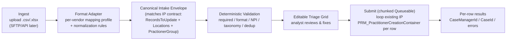

# Delegated Practitioner Creation via Vendor-Roster Upload — Baseline Design Plan

> **Status:** REWRITTEN BASELINE (replaces the 2026-06-11 draft).
> This version is grounded in the *actual* `PRM_PractitionerCreation_English` OmniScript, its record-assembly element `SetRecordValuesForDelegatedCred`, and the live backend Integration Procedure `PRM_PractitionerCreationContainer`. It corrects the original draft, which referenced an Apex service stack that does not exist in this org.

> **Companion / related docs (align — do not duplicate):**
> - `docs/implementation-plan/PRM_RosterUpload_UI_DesignPlan.md` — **the UI layer over this contract**: the wizard-modal screens, grouped master-detail field display (one row per practitioner), fieldsets, and async monitoring. Pairs with the SLDS mockup `docs/implementation-plan/prmRosterUpload_Mockup.html`.
> - `requirements/PractitionerCreationPerformance/Design_BulkPractitionerCreation_LWC.md` — single-practitioner × 50+ locations performance problem + canonical field inventory + bulk-grid LWC.
> - `requirements/PractitionerCreationPerformance/US_DelegatedPractitioner_AddressCreation_BatchRefactor.md` — async batch creation of the address/location chain.
> - `requirements/PractitionerCreationPerformance/US_PractitionerCreation_Complete_Implementation.md`
> - `requirements/AgenticAI/ideas/Idea02_Bulk_Practitioner_Validation_Agent.md` — AI pre-flight validation (NPPES/OIG/SAM/dedup). **Deferred to a later phase here.**
> - Backend architecture proposal: `requirements/Enhancements/PNM_PractitionerCreation_Apex_Service_Architecture.md` (a *future* migration; not built yet).

---

## 0. Executive Summary

**Goal.** Let credentialing operations ingest **delegated practitioner rosters that arrive as Excel/CSV files in many different vendor layouts**, normalize them to a single canonical envelope, validate them, let an analyst review/correct in a grid, and create the records by **reusing the existing, production backend** rather than building a parallel one.

**Two distinct volume problems (do not conflate):**

| Axis | Problem | Owner doc |
|---|---|---|
| **A. One practitioner × 50+ locations** | OmniScript DOM thrash on the address/roles steps | `Design_BulkPractitionerCreation_LWC.md` |
| **B. Many practitioners × many vendor file formats** | Heterogeneous roster ingestion (this doc) | **THIS DOC** |

This plan owns **Axis B**. It feeds the *same* canonical envelope and the *same* backend IP that Axis A uses, so the two converge instead of forking.

**Three corrections vs. the original draft:**
1. **Backend is reuse-the-IP, not a new Apex stack.** The flow's backend is `PRM_PractitionerCreationContainer` (OmniStudio IP). The original draft's `PRM_PractitionerBulkCreationService` + `PRM_GroupAccountService` + `PRM_AccountUpsertHelper` … **do not exist**. We call the existing IP per row via `Omnistudio.IntegrationProcedureService.runIntegrationService(...)` — the pattern already used in `PRM_IntegrationProcedureFlowUtil`.
2. **Format heterogeneity is solved by a per-vendor mapping adapter + a standard template**, not by a single hard-coded 28-column sheet and per-upload manual mapping.
3. **The field set is the full delegated contract** (~30+ fields incl. Medicare #, EffectiveTo, board certs, DEA/CDS, multiple specialties/licenses, provider info, locations), not the 28 sample columns. The original mapping was derived from one sample file and omitted ~15 fields and mis-mapped Gender, Corporate Receipt Date, and a fabricated "NextAppointment".

**No AI in v1** (per decision). The Idea02 validation agent is a named later phase.

---

## 1. Scope

**In scope (v1):**
- Upload a vendor roster file (`.csv`, `.xlsx`, `.xls`) of **delegated** practitioners.
- Map arbitrary vendor headers to the canonical schema using a **saved per-vendor mapping profile** (or a freshly defined one that is then saved for reuse).
- Deterministic normalization + validation.
- Editable triage grid (valid / warning / error per row).
- Submit → create records by looping the **existing** `PRM_PractitionerCreationContainer` IP per practitioner, chunked asynchronously for volume.
- Per-row results with the created Case Manager / Case Ids.

**Out of scope (v1):**
- IBC Professional Staff branch (delegated only first; `SetRecordValuesForProfessionalStaff` differs).
- AI-assisted mapping / AI pre-flight validation (Idea02) — later phase.
- The 50+-locations-per-practitioner UX (owned by Axis A doc); rosters here are assumed ≤ a handful of locations per practitioner, with multi-location rosters handled by the location-block rules in §5.4.
- SFTP/API direct feeds (later phase for top vendors).

---

## 2. Reuse Inventory — Real vs. Proposed

**Real, deployed, reusable (verified in repo):**

| Asset | Type | Role in this plan |
|---|---|---|
| `PRM_PractitionerCreationContainer` (Procedure_1..6) | OmniStudio IP | **The backend.** Branches on `PractitionerCreationType`; delegated path = `PRM_DelegatedPractitionerCreation_Procedure_6`. We call it per row. |
| `Omnistudio.IntegrationProcedureService.runIntegrationService` | Platform API | How we invoke the IP from Apex. Precedent: `PRM_IntegrationProcedureFlowUtil`. |
| `PRM_IPUtility` (`Callable`) | Apex | Vendor/HCF resolution by NPI/TaxId: `VendorAndHCFWithTaxId`, `VendorAndHCFWithNPI`, `VendorPracLocations`, `getCrossRefPracticeByNPI`. Used for vendor de-dup + location cross-ref. |
| `PRM_ExistingAccountService` | Apex | Practitioner dedup against existing IBX `Account`. |
| `PRM_PARProviderSearch` | Apex | Provider search / NPI-based lookup. |
| `PRM_AddressValidationService` | Apex | Precisely address standardization (batchable). |
| `PRM_PractitionerCreationValidator` | Apex | Existing effective-date / business validations to mirror server-side. |
| `SetRecordValuesForDelegatedCred` (OmniScript element) | Config | **Source of truth for the canonical envelope** (`RecordsToUpdate`). |

**Proposed / not yet built (do NOT assume as reuse):**

| Asset | Reality |
|---|---|
| `PRM_PractitionerCreationDispatcherService`, `PRM_GroupAccountService`, `PRM_HCProviderRecordService`, `PRM_AccountUpsertHelper`, `PRM_CaseService`, `PRM_PractitionerCreationCaseDataMgrService`, `PRM_HCPNPIBoardCertService`, `PRM_PersonEducationService` | **Do not exist.** Proposed only in `PNM_PractitionerCreation_Apex_Service_Architecture.md`. If/when that migration ships, the submit step can switch from "call IP" to "call dispatcher" with no change to the ingestion/adapter layers. |
| `prmBulkPractitionerCreation` LWC | Designed (Axis A doc), not built. Reuse its grid/store patterns when built. |
| `groupClassCensusV2`, `clFileUpload` | Managed-package (Insurance) components; **not in this org**. Patterns only, not code. |

---

## 3. Architecture



**Layer responsibilities:**

| Layer | Component | Notes |
|---|---|---|
| Ingest | `prmRosterUpload` LWC | File pick + parse (CSV via PapaParse; XLSX via pinned SheetJS CE — see §7). |
| Adapter | `prmRosterColumnMapper` LWC + `PRM_VendorRosterMapping__mdt` | Auto-applies a saved vendor profile; lets analyst define + save a new one. |
| Canonical | `PRM_RosterEnvelopeBuilder` (Apex) | Builds the exact `RecordsToUpdate`/`Locations`/`PractionerGroup` JSON the IP expects. |
| Validate | `PRM_RosterValidator` (Apex) | Deterministic only; reuses `PRM_ExistingAccountService`, `PRM_PractitionerCreationValidator`, `PRM_IPUtility`. |
| Grid | `prmRosterGrid` + `prmRosterRow` LWC | Triage + inline edit + retry. |
| Submit | `PRM_RosterSubmitController` + `PRM_RosterCreationQueueable` | Loops the IP per row; chunks for volume. |

---

## 4. Handling Heterogeneous Vendor Formats (the core of this design)

The problem is **not** the upload mechanism; it is that every vendor's spreadsheet differs in headers, column order, value coding, and structure. We solve it with three deterministic mechanisms (no AI in v1):

### 4.1 Standard template (preferred path)
- Publish a downloadable IBX roster template (CSV + XLSX) whose columns are the canonical fields in §5.
- Delegated vendors are contractual partners, so operations can *request* the template. Files in template format need **zero mapping**.

### 4.2 Per-vendor saved mapping profile (the differentiator)
- A `PRM_VendorRosterMapping__mdt` (or custom object if business-editable) row per vendor format stores:
  - `headerAliases`: vendor header → canonical field (e.g., `"Prov First"` → `FirstName`).
  - `valueRules`: per-field normalization (e.g., Gender `M`→`Male`; date format `MM/DD/YYYY`; `"No BSPA number found"`→null).
  - `structureRules`: how the vendor encodes multiple locations / specialties / licenses (see §5.4).
  - `defaults`: constant fields the vendor never supplies (e.g., `FormType`).
- **First upload of a new vendor layout:** analyst maps columns once in `prmRosterColumnMapper`; clicking "Save mapping" persists the profile. **Every subsequent upload from that vendor auto-applies it.** Heterogeneity becomes a one-time-per-vendor config task, not a code change.

### 4.3 Deterministic normalization rules
Centralized, testable transforms applied after mapping: trim, title-case names, gender mapping, date parsing (multi-format), phone formatting, tax-ID/NPI digit checks, BSPA blanking. (See §6.)

### 4.4 Future phase (documented, not v1)
- **AI-assisted mapping**: LLM proposes the column mapping + value normalizations for an unknown vendor; analyst confirms once → becomes a saved profile. (Lowers onboarding effort for the long tail.)
- **Idea02 pre-flight validation agent**: NPPES realness, OIG/SAM sanctions, fuzzy dedup.
- **SFTP/API feed** for top vendors by volume.

---

## 5. Canonical Intake Envelope (the IP contract)

This is the exact structure the existing IP consumes, derived verbatim from `SetRecordValuesForDelegatedCred` (`RecordsToUpdate`) plus the `IP_RecordCreation` extra payload (`PractionerGroup`, `locationsToUpsert`, `FileData`, `PractitionerCreationType`). The roster adapter must produce this per practitioner.

```jsonc
{
  "PractitionerCreationType": "Delegated Credentialing",   // constant for this flow
  "RecordsToUpdate": {
    "PractionerDetails": {
      "FirstName": "...", "MiddleName": "...", "LastName": "...", "Suffix": "...",
      "DOB": "YYYY-MM-DD",
      "PersonEmail": "...",
      "PersonGenderIdentity": "...",          // NOTE: GenderIdentity, not PersonGender
      "PRM_ProviderRole__c": "...",
      "PRM_CredentialingStatus__c": "Credentialed"   // system-set
    },
    "HCPNPI": "##########",                    // individual NPI (10 digits)
    "HCPTaxonomy": { "CareTaxonomy": "<CareTaxonomyId>", "Name": "<Specialty> - <Code>" },  // primary
    "AdditionalSpecialties": [ ... ],          // additional specialties (array)
    "practitionerTaxNtwk": [ ... ],            // CareTaxxonomies (per location×taxonomy)
    "AddLicenseBlock": [ { "number","state","type","issued","expiration" } ],   // 1..N
    "AddDEACDSBlock":  [ { "number","state","type" } ],                          // DEA/CDS
    "AddBoardCertificationBlock": [ { "name","type","original","expires","recert" } ],
    "AddEducation": [ { "degree","institution","start","end","completed","primary" } ],
    "Identifiers": [ { "Type": "Medicare Number", "Name": "<MedicareNumber>" } ],
    "EffectiveFrom": "YYYY-MM-DD",
    "EffectiveTo":   "YYYY-MM-DD",             // both captured; drives IsRecordActive
    "InfoCodeIds": [ ... ],                    // SPLIT(DefaultInfoCodeAPI, ';')
    "ProviderInformation": { ... },            // racial/cultural/hispanic identity
    "ProviderInformationAffirmingCategory": [ ... ],
    "ProviderInformationLanguageSpoken": [ ... ],
    "ProviderInformationPersonalPronouns": [ ... ],
    "ProviderType": "<PractitionerTypeId>",
    "IndividualApplication": {
      "ApplicationType": "Individual",
      "Category": "Provider Data Management",
      "RecordType": "PDM Manual Change",
      "Status": "In Progress",
      "PRM_PDMManualUpdateType__c": "Delegated Practitioner",
      "PRM_Stage__c": "Network Management QC",
      "AppliedDate": "<TODAY>",
      "PRM_CorporateReceiptDate__c": "YYYY-MM-DD",   // NOTE: on IndividualApplication, field is *Receipt*
      "PRM_FHNaticCaseNumber__c": "...",
      "PRM_FormType__c": "..."
    },
    "Case": {
      "RecordType": "PRM", "Status": "New",
      "Type": "Network Management QC",
      "PRM_IsRoundRobinLogic__c": true
    },
    "Locations": [ /* see §5.4 */ ]
  },
  "PractionerGroup": { "GroupNPI": "...", "GroupTaxId": "...", "vendorAccountId": "<resolved>" },
  "locationsToUpsert": [ /* HealthcarePractitionerFacility chain — see §5.4 */ ],
  "FileData": [ /* per-practitioner supporting docs (ContentVersion) — see §5.5 */ ]
}
```

System-set values (`PRM_CredentialingStatus__c`, the `Case`/`IndividualApplication` defaults, `AppliedDate`, `IsRecordActive`) are stamped by the builder/IP and must **not** come from the sheet.

### 5.4 Locations are structured, not a single text field
The flow models `Locations`/`locationsToUpsert` as a set of `HealthcarePractitionerFacility` affiliations (Practice Affiliation + Location Affiliation), each with vendor association, address, contact, billing types, patient ages, per-location taxonomies/roles/networks, info codes, and assistive aids (full inventory: `Design_BulkPractitionerCreation_LWC.md` §3.2). A flat roster expresses this via a `structureRules` choice in the vendor profile:

| Encoding | How vendor file represents N locations | Adapter behavior |
|---|---|---|
| `ONE_ROW_PER_LOCATION` | Repeating practitioner identity across rows, one location each; rows grouped by NPI | Group rows by individual NPI → build `Locations[]` |
| `WIDE_COLUMNS` | `Location1_*`, `Location2_*` columns | Pivot wide → `Locations[]` |
| `ADD_TO_ALL_LOCATIONS` (sample's Col 13) | Sentinel string | Resolve all active locations for the vendor via `PRM_IPUtility.VendorPracLocations(npi, taxId)` and fan out |
| `SINGLE` | One location per practitioner | Single-element `Locations[]` |

### 5.5 `FileData` = per-practitioner supporting documents
In the live flow `FileData` is the practitioner's delegation/license documents (ContentVersion + ContentDocumentLink), **not** the roster file. v1 decision: roster upload supports **data only**; supporting documents remain attachable in the Case Manager post-creation (or via a future per-row attachment step). This must be called out to business — a roster alone does not carry per-practitioner PDFs.

---

## 6. Corrected Field Mapping (canonical ⇄ template/sheet)

Legend: ✅ in original 28-col sample · ➕ added (was missing) · ✏️ corrected mapping.

| Canonical field | IP/OmniScript source | Template column | Normalization | vs. original draft |
|---|---|---|---|---|
| `PractionerDetails.FirstName` | `PractitionerFirstName` | First Name | Title-case | ✅ |
| `PractionerDetails.LastName` | `PractitionerLastName` | Last Name | Title-case | ✅ |
| `PractionerDetails.MiddleName` | `PractitionerMiddleName` | Middle Name | Title-case | ✅ |
| `PractionerDetails.Suffix` | `PractitionerSuffix` | Suffix | trim | ➕ |
| `PractionerDetails.DOB` | `PractitionerDOB` | Birth Date | parse date | ✅ |
| `PractionerDetails.PersonGenderIdentity` | `PractitionerGender` | Gender | M→Male, F→Female | ✏️ (was `PersonGender`/`PRM_Gender__c`) |
| `PractionerDetails.PersonEmail` | `PractitionerEmail` | Email | trim/lower | ➕ |
| `PractionerDetails.PRM_ProviderRole__c` | `ProviderRole` | Provider Role | map to picklist | ➕ |
| `HCPNPI` | `PractitionerIndividualNPI` | NPI | 10-digit | ✅ |
| `HCPTaxonomy` (primary) | `PractitionerPrimarySpecialty-Block` | Taxonomy Code | lookup `CareTaxonomy`, store Id + "Name - Code" | ✏️ (link by Id, not bare code) |
| `AdditionalSpecialties[]` / `practitionerTaxNtwk` | `Additional Specialties Array` / `CareTaxxonomies` | Additional Taxonomy Codes (multi) | lookup each | ➕ (flow supports N specialties) |
| `ProviderType` | `PractitionerType-Block` | Practitioner Type | lookup type | ➕ |
| `Identifiers[Medicare Number]` | `MedicareNumber` | Medicare Number | trim | ➕ (entirely missing before) |
| `AddLicenseBlock[]` | `AddLicenseBlock` | License # / State / Issued / Expiration | parse; supports N | ✏️ (was single number+expiry) |
| `AddDEACDSBlock[]` | `AddDEACDSBlock` | DEA/CDS # / State / Type | parse | ➕ |
| `AddBoardCertificationBlock[]` | `AddBoardCertificationBlock` | Board Cert Name/Type/Expires | parse | ➕ (draft hard-coded empty) |
| `AddEducation[]` | `AddEducation` | Med School / Grad Date / Degree | parse | ⚠️ partial before |
| `EffectiveFrom` | `PractitionerEffFromDate` | Effective From | parse date | ✅ |
| `EffectiveTo` | `PractitionerEffToDate` | Effective To | parse date | ➕ (missing before) |
| `IndividualApplication.PRM_CorporateReceiptDate__c` | `PractitionerCorpReceiptDate` | Corporate Receipt Date | parse date | ✏️ (was `Case.PRM_CorporateReceivedDate__c` — wrong object + name) |
| `IndividualApplication.PRM_FHNaticCaseNumber__c` | `PractitionerFHNaticCaseNumber` | FHNatic Case # | trim | ➕ |
| `IndividualApplication.PRM_FormType__c` | `PractitionerFormType` | Form Type | map | ➕ |
| `InfoCodeIds[]` | `DefaultInfoCodeAPI` | Info Codes (`;`-delimited) | split | ➕ |
| `ProviderInformation*` | provider-info steps | Race/Cultural/Hispanic/Affirming/Languages/Pronouns | map | ➕ (all missing before) |
| `PractionerGroup.GroupNPI` | `GroupNPI` | Group NPI | 10-digit | ✅ |
| `PractionerGroup.GroupTaxId` | `GroupTaxId` | Tax ID Number | XX-XXXXXXX | ✅ |
| `Locations[]` | `Locations`/`locationsToUpsert` | per §5.4 structure | per profile | ✏️ (was single "Office Practice Name" + magic Col 13) |
| `FileData[]` | `FileData` | — | n/a v1 | ✏️ (not the roster file) |

**Removed from the model:** `NextAppointment → IndividualApplication.PRM_NextAppointmentDate__c` — this mapping does **not** exist in the delegated contract and appears fabricated from the sample column. If business confirms a real re-cred next-appointment need, add it as a deliberate enhancement with a verified target field.

**Coverage note:** the original 28-column sample covers ~50% of the delegated contract. Vendors will rarely supply provider-information, additional specialties, board certs, DEA/CDS, or per-location detail. The vendor profile's `defaults` + a mandatory **post-upload completion** step (analyst fills gaps in the grid) is required; otherwise rows will be `error`/`warning`.

---

## 7. File Parsing Decision (SheetJS audited)

**Decision:**
- **CSV** (template + many vendor exports) → parse with **PapaParse** (~45KB, MIT, maintained, on npm) or native — no heavyweight dependency.
- **Native `.xlsx`/`.xls`** (unavoidable since adapter-first accepts native vendor files) → **SheetJS Community Edition, version-pinned, loaded from a Static Resource** built from the **official CDN tarball** (`cdn.sheetjs.com`, **not** npm).

**Why (audit of the original "window.XLSX is available" claim):**
- `window.XLSX` / SheetJS is **not present anywhere in this org** (verified). The Insurance census components that expose it are managed-package and absent here. So SheetJS must be *introduced* as a Static Resource regardless.
- The `xlsx` **npm** package is frozen at **0.18.5** and is **vulnerable** (CVE-2023-30533 prototype pollution on *read* — exactly our path; CVE-2024-22363 ReDoS). Fixes (0.19.3+, currently 0.20.x) ship **only** from `cdn.sheetjs.com`.

**Mitigations (mandatory if XLSX is enabled):**
1. Pin a specific CDN build (e.g., `xlsx-0.20.x`) as a Static Resource; record the version + checksum.
2. Load via `loadScript` under Lightning Web Security; re-validate on platform upgrades.
3. Document the Snyk/SCA suppression with justification (CDN build is patched; npm is not).
4. Enforce client caps: ≤ 200 data rows, ≤ 5 MB, first sheet only.

**Cheapest safe path:** prefer the **CSV template** as the default; gate native-XLSX behind the SheetJS static resource as a convenience for vendors who won't convert. This keeps the risky dependency optional.

---

## 8. Backend — Reuse the Existing IP (no new creation stack)

Submit loops the live IP per practitioner. This reuses every default, RecordType, FK chain, and validation the IP already encodes.

```apex
public with sharing class PRM_RosterSubmitController {

    @AuraEnabled
    public static String submitBatch(String envelopesJson) {
        List<Object> envelopes = (List<Object>) JSON.deserializeUntyped(envelopesJson);
        // Chunk and enqueue; each chunk is its own transaction.
        // PRM_RosterCreationQueueable loops rows -> runIntegrationService per row.
        Id jobId = System.enqueueJob(new PRM_RosterCreationQueueable(envelopes, 0));
        return JSON.serialize(new Map<String,Object>{ 'jobId' => jobId, 'queued' => envelopes.size() });
    }

    // Per-row creation — reuses the existing Integration Procedure.
    public static Map<String,Object> createOne(Map<String,Object> envelope) {
        Map<String,Object> output = (Map<String,Object>)
            Omnistudio.IntegrationProcedureService.runIntegrationService(
                'PRM_PractitionerCreationContainer',   // existing IP
                envelope,                               // canonical envelope (§5)
                new Map<String,Object>()
            );
        return output; // contains CaseManagerId + delegated outputs the OS consumes today
    }
}
```

`PRM_RosterCreationQueueable` processes a bounded chunk (e.g., 10–15 rows), captures per-row success/failure, persists a `PRM_AgentDecision__c`/batch-log row, and chains to the next chunk. Because each IP call is effectively its own unit of work, **per-row isolation is natural** — no 50-savepoint anti-pattern.

> **Forward-compatibility:** when the `PNM_PractitionerCreation_Apex_Service_Architecture.md` migration lands, swap `createOne` to call the dispatcher service. The ingestion/adapter/validation/grid layers are unaffected.

---

## 9. Validation (deterministic — no AI in v1)

**Client (immediate):** required fields present, NPI 10-digit, dates parseable, gender in allowed set, tax-ID format, duplicate NPI within the file.

**Server (`PRM_RosterValidator`, bulk):**

| Rule | Check | Reuse | Severity |
|---|---|---|---|
| NPI uniqueness (system) | existing `HealthcareProviderNpi` / `Account` | `PRM_ExistingAccountService` | Warning → link vs. create (analyst decides) |
| Existing practitioner dedup | NPI / name+DOB | `PRM_ExistingAccountService` | Warning |
| Taxonomy resolves | `CareTaxonomy` lookup by code → Id | direct SOQL | Error if unresolved |
| Vendor/group resolves | GroupNPI + TaxId → vendor account | `PRM_IPUtility.VendorAndHCFWithTaxId` / `VendorAndHCFWithNPI` | Info (attach) / Error (ambiguous) |
| Location cross-ref | active locations for vendor | `PRM_IPUtility.VendorPracLocations` | needed for `ADD_TO_ALL_LOCATIONS` |
| Effective dates | From ≤ To; HCPF/HFN constraints | mirror `PRM_PractitionerCreationValidator` | Error |
| Required-per-contract | fields in §5 marked required | builder | Error |

The NPI "link to existing vs. create new" decision is a **first-class branch** (the OmniScript distinguishes via `ExistingHealthCareProviderNPIId`). v1 surfaces it as a per-row choice in the grid; default = create new unless an active match exists.

---

## 10. Transaction & Governor Strategy

Because each practitioner is created by an **independent IP invocation**, the unit of work is one row, not one giant transaction.

| Volume | Strategy |
|---|---|
| 1–5 | Synchronous loop acceptable (still IP-per-row) |
| 6–200 | `PRM_RosterCreationQueueable`, **10–15 rows per chunk**, chained |
| Callout note | The delegated IP may perform callouts (Precisely). Queueable supports callouts; keep chunk size conservative and respect Precisely batch limits via `PRM_AddressValidationService`. |
| Vendor de-dup | Resolve vendor account **once per (GroupNPI+TaxId)** before the loop (via `PRM_IPUtility`) and inject the resolved `vendorAccountId` into each envelope, so the IP attaches rather than re-creates. |

Progress streamed to the grid via Platform Event or `caseManager.status` polling (same pattern as the Axis A submit design).

---

## 11. Error Handling & Retry
- Each chunk captures per-row `{ index, status, caseManagerId/caseId, message }`.
- A row failure is isolated to that row (separate IP call); siblings continue.
- Failed/`warning` rows stay in the grid; analyst fixes inline and clicks **Retry Failed** → re-submits only those rows.
- All attempts logged to a batch-log object (reuse/extend `PRM_AgentDecision__c` per Idea02, or a `PRM_BulkBatch__c`).

---

## 12. Security
| Concern | Mitigation |
|---|---|
| FLS/CRUD | IP runs in its existing security context; Apex controllers `with sharing`; reuse existing services that already enforce access. |
| File DoS | client caps (200 rows / 5MB / first sheet). |
| SheetJS prototype-pollution | pinned patched CDN build only (§7). |
| PHI/PII (DOB, Medicare #, license) | not persisted in client state beyond session; cleared on navigate-away; no third-party calls with raw PII in v1 (no AI). |
| Permission | gate behind a dedicated permission set (e.g., `PRM_DelegatedRosterUpload`) + feature flag. |

---

## 13. Component Inventory (realistic)

**New LWC:** `prmRosterUpload`, `prmRosterColumnMapper`, `prmRosterGrid`, `prmRosterRow`, `prmRosterResults`.

**New Apex:** `PRM_RosterEnvelopeBuilder`, `PRM_RosterValidator`, `PRM_RosterSubmitController`, `PRM_RosterCreationQueueable` (+ tests).

**New config:** `PRM_VendorRosterMapping__mdt` (or custom object), Static Resources `PRM_RosterTemplateCSV` and (optional) `PRM_SheetJS` (pinned CDN build), feature flag.

**Reused (real):** `PRM_PractitionerCreationContainer` IP, `PRM_IPUtility`, `PRM_ExistingAccountService`, `PRM_PARProviderSearch`, `PRM_AddressValidationService`, `PRM_PractitionerCreationValidator`, `Omnistudio.IntegrationProcedureService`.

---

## 14. Phased Rollout
| Phase | Scope |
|---|---|
| 1 | CSV template + parser; mapping profile model + mapper UI; envelope builder; deterministic validation; grid display. |
| 2 | Submit via IP (Queueable), per-row results, retry; vendor de-dup; location structure rules (`SINGLE`, `ONE_ROW_PER_LOCATION`). |
| 3 | Native XLSX (pinned SheetJS), `WIDE_COLUMNS` + `ADD_TO_ALL_LOCATIONS`; perf test (200 rows); UAT; feature flag. |
| 4 (future) | AI-assisted mapping + Idea02 validation agent; SFTP/API feed. |

---

## 15. Acceptance Criteria
| # | Criterion |
|---|---|
| AC1 | Upload CSV/XLSX → rows parse + display. |
| AC2 | Known vendor → mapping profile auto-applies; new vendor → analyst maps once and saves. |
| AC3 | Canonical envelope produced matches the IP contract in §5 (incl. Medicare #, EffectiveTo, board certs, DEA/CDS, additional specialties, provider info). |
| AC4 | Deterministic validation flags per-row valid/warning/error; NPI link-vs-create surfaced. |
| AC5 | Submit creates records by calling `PRM_PractitionerCreationContainer` per row (verified: Account/Case/IA/CDM/HCP/Taxonomy/License/HCPNPI/Education + locations). |
| AC6 | One row's failure does not block others; retry works. |
| AC7 | >5 rows processed via chunked Queueable; progress shown. |
| AC8 | Vendor de-dup: rows sharing GroupNPI+TaxId attach to one vendor. |
| AC9 | Template download matches canonical columns. |
| AC10 | Feature-flagged + permission-gated; delegated-only. |

---

## 16. Open Questions
| # | Question | Status |
|---|---|---|
| 1 | Confirm full set of required-by-business roster columns vs. fields defaulted/filled post-upload (esp. provider-info, board certs, DEA/CDS). | Open — business |
| 2 | Per-practitioner supporting documents (`FileData`): acceptable to defer to Case Manager in v1? | Open — business |
| 3 | NPI match → auto-link vs. always create new: default policy + who may override? | Open |
| 4 | Top vendors/formats to seed mapping profiles for at launch? | Open — business |
| 5 | Real "NextAppointment" requirement, or drop entirely? | Open — business |
| 6 | Native XLSX required at launch, or CSV-template-only for v1? | Open (recommend CSV-only v1) |

## 17. Dependencies
| Dependency | Status | Blocker? |
|---|---|---|
| `PRM_PractitionerCreationContainer` IP | Deployed | No |
| `Omnistudio.IntegrationProcedureService` invocation pattern | In use (`PRM_IntegrationProcedureFlowUtil`) | No |
| `PRM_IPUtility`, `PRM_ExistingAccountService`, `PRM_PARProviderSearch`, `PRM_AddressValidationService`, `PRM_PractitionerCreationValidator` | Deployed | No |
| SheetJS (only if native XLSX) | Must add as pinned Static Resource | Only if XLSX enabled |
| Permission set + feature flag | New | No |
| New Apex service stack (`PNM_PractitionerCreation_Apex_Service_Architecture.md`) | NOT built | **Not required** (we reuse the IP) |

---

## 18. Decision Log — What Changed From the Original Draft & Why
| # | Original draft | Corrected | Reason |
|---|---|---|---|
| 1 | Reuse `PRM_PractitionerBulkCreationService` + 8-class Apex stack ("100% REUSE") | Reuse existing IP `PRM_PractitionerCreationContainer` per row | Those classes do not exist; the IP is the real, hardened backend. |
| 2 | Single hard-coded 28-column sheet + per-upload manual mapping | Standard template + saved per-vendor mapping profiles | Directly solves "many vendor formats"; turns mapping into one-time config. |
| 3 | Gender → `PersonGender`/`PRM_Gender__c` | `PersonGenderIdentity` | Matches `SetRecordValuesForDelegatedCred`. |
| 4 | Corporate Received → `Case.PRM_CorporateReceivedDate__c` | `IndividualApplication.PRM_CorporateReceiptDate__c` | Correct object + field name. |
| 5 | NextAppointment → `IndividualApplication.PRM_NextAppointmentDate__c` | Removed (pending business confirmation) | Not in the delegated contract; appears fabricated. |
| 6 | Board certs hard-coded empty; single license; single taxonomy | Board certs, DEA/CDS, N licenses, N specialties captured | Flow captures all of these. |
| 7 | EffectiveFrom only | EffectiveFrom + EffectiveTo | Flow captures both (drives `IsRecordActive`). |
| 8 | Medicare #, Suffix, Email, ProviderRole, FormType, FHNatic #, InfoCodes, ProviderInformation omitted | Added to canonical envelope | All captured by the delegated flow. |
| 9 | "Office Practice Name" + magic Col 13 for locations | Structured `Locations[]` with profile-driven encoding + `PRM_IPUtility` cross-ref | Locations are a multi-field affiliation chain. |
| 10 | `window.XLSX` assumed available; SheetJS unqualified | SheetJS not in org → pinned CDN Static Resource; prefer CSV/PapaParse | Library absent; npm build vulnerable. |
| 11 | 50-savepoint per-row isolation in one transaction | Per-row IP call = natural isolation; Queueable chunking | Avoids savepoint/limit anti-pattern. |
| 12 | Standalone vs OmniScript "TBD"; ignored sibling work | Aligned to `Design_BulkPractitionerCreation_LWC.md` + Idea02; AI deferred | Consolidates overlapping tracks. |

---

*Rewritten baseline: 2026-06-11. Supersedes the prior draft. Status: DRAFT — pending business answers to §16.*


