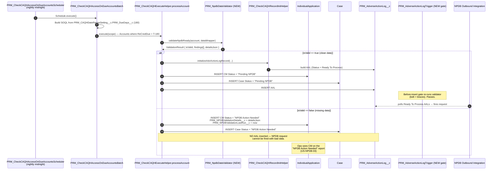
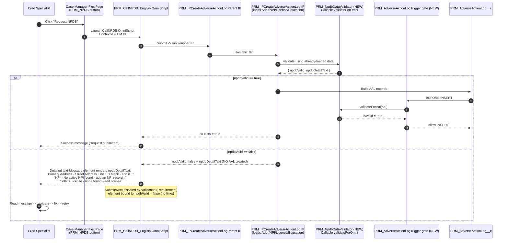
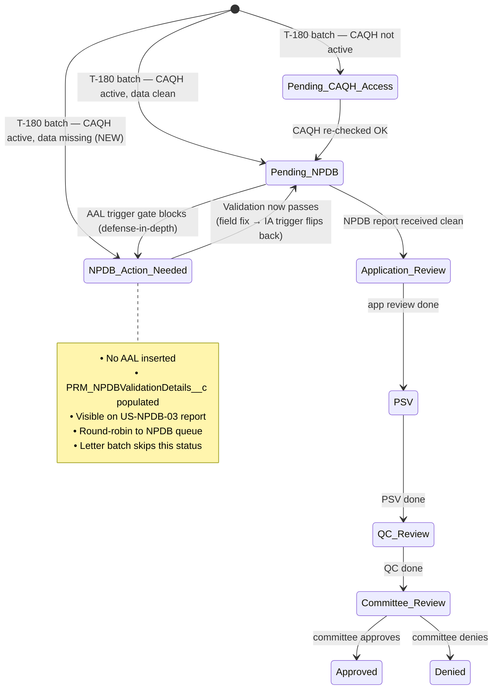
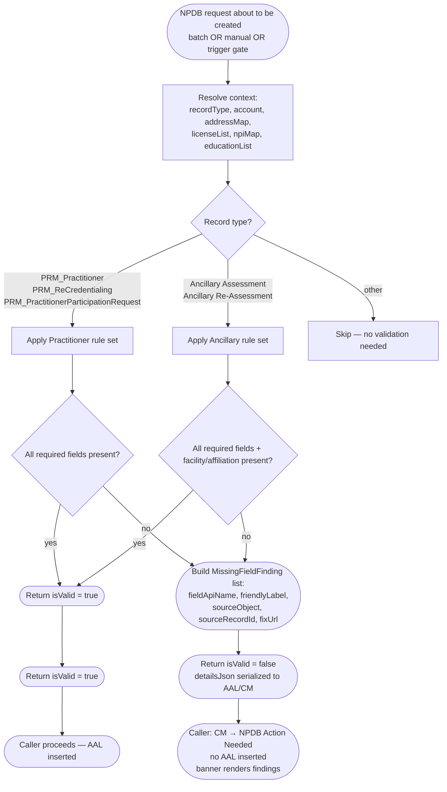

# NPDB Data Validation — Architecture Diagrams

**Companion to:** `00_Overview_NPDB_T180_Validation.md`
**Date:** 2026-06-01
**Updated:** 2026-06-08 — Manual-path design pivot (US-NPDB-02 v4): validation moved into the `PRM_IPCreateAdverseActionLog` IP layer and surfaced via native OmniScript **Message + Validation** elements rendering the validator's link-free `detailText`. Replaces the `prmNpdbValidationBanner` LWC + Fix/Add deep-link approach in §2, §3, and §6.

---

## 1. End-to-end sequence — T-180 batch (automated path)



---

## 2. End-to-end sequence — Manual `Request NPDB` button



> The same pattern — validator IP-action + a detailed text **Message** element + a **Validation** (Requirement) element — is injected into the PSV Review, ReCred QC, Initial Cred App Review, and Cred App Review Complete OmniScripts right before the NPDB Integration Procedure Action, so every manual surface gets the same validation and the same plain-English, link-free message. The Ancillary path additionally renders per-facility findings on the practice-location step via `PRM_GetAncNpdbDetails`.

---

## 3. Component diagram

```mermaid
graph TB
    subgraph Schedulers
        S1[PRM_CheckCAQHAccessOnDueAccountsScheduler]
    end

    subgraph Batches
        B1[PRM_CheckCAQHAccessOnDueAccountsBatch]
        B2[PRM_CreateAdverseActionNpdbBatch]
        B3[PRM_ReinitiateNPDBReport]
    end

    subgraph Apex_Validation_Service [Apex Validation Service NEW]
        V1[PRM_NpdbDataValidator]
        V2[PRM_NpdbDataValidator.FieldRules]
        V3[PRM_NpdbValidationFieldConfig__mdt]
    end

    subgraph Triggers
        T1[PRM_AdverseActionLogTrigger NEW]
        T2[PRM_AdverseActionLogTriggerHandler NEW]
        T3[PRM_IndividualApplicationTrigger<br/>existing — release flip]
    end

    subgraph LWC
        L1[Read-only findings text surface NEW<br/>renders Validation Details, no links]
        L2[pRMPracLocAncNpdb existing]
    end

    subgraph OmniScripts
        O1[PRM_CallNPDB_English]
        O2[PRM_PSVSubOsWSNPDB_English]
        O3[PRM_InitialCredentialAppReview_English]
        O4[PRM_CredentialAppReviewCompleteOS_English]
        O5[PRM_RecredQC_English]
    end

    subgraph IntegrationProcedures
        I1[PRM_IPCreateAdverseActionLogParent]
        I2[PRM_CreateAdverseActionLog_Procedure]
    end

    subgraph Data
        D1[(IndividualApplication<br/>Status + PRM_NPDBValidationDetails__c NEW)]
        D2[(Case<br/>Status)]
        D3[(PRM_AdverseActionLog__c)]
        D4[(Account / Address / NPI / License / Education)]
    end

    S1 --> B1
    B1 --> V1
    B1 --> D1
    B1 --> D2

    O1 --> L1
    O2 --> L1
    O3 --> L1
    O4 --> L1
    O5 --> L1
    L1 -->|@AuraEnabled| V1

    O1 --> I1
    O2 --> I2
    I1 --> B2
    B2 --> T1
    T1 --> T2
    T2 --> V1
    T2 --> D3

    B3 --> T1

    V1 --> V2
    V1 --> V3
    V1 --> D4

    T3 --> D1
```

---

## 4. State diagram — Case Manager Status (with new value)



---

## 5. Validation flow — single decision used by all surfaces



The `PRM_NpdbValidationFieldConfig__mdt` custom metadata stores **which fields are required per `RecordType.DeveloperName`**. That keeps the validator data-driven — adding a new request type only requires a metadata record, not an Apex deploy.

---

## 6. Where the validator gets plugged in (cheat sheet)

| Caller | Hook point | Lines / file |
|--------|-----------|--------------|
| T-180 batch | `PRM_CheckCAQHExecuteHelper.processAccount` — before `createActiveCAQHRecords` | `force-app/main/default/classes/PRM_CheckCAQHExecuteHelper.cls` |
| Manual button OmniScript | Validator IP-action inside `PRM_IPCreateAdverseActionLog` returns `npdbValid` / `npdbDetailText`; OmniScript renders a detailed text **Message** + **Validation** element in `PRM_CallNPDB_English_*` | `force-app/main/default/omniScripts/PRM_CallNPDB_English_*.os-meta.xml`; `PRM_IPCreateAdverseActionLog_Procedure_*` |
| PSV / ReCred QC / Initial Cred OmniScripts | Same validator IP-action + detailed text Message + Validation injected into `PRM_PSVSubOsWSNPDB_English_*`, `PRM_RecredQC_English_*`, `PRM_InitialCredentialAppReview_English_*`, `PRM_CredentialAppReviewCompleteOS_English_*` | OmniScript metadata |
| Server-side safety gate | New `PRM_AdverseActionLogTrigger` (before-insert) → `PRM_AdverseActionLogTriggerHandler.beforeInsert` calls `validator.validateForAal(aal)` | new files |
| Release flip | `PRM_IndividualApplicationTrigger` → `PRM_IndividualApplicationTriggerHandler` (existing) — on field update, if record was in `NPDB Action Needed` and validator now returns `isValid = true`, flip Status to `Pending NPDB` + clear `PRM_NPDBValidationDetails__c` | existing trigger; new handler branch |
