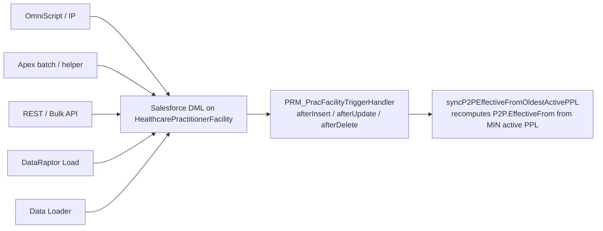

# DEV STORY — P2P `EffectiveFrom` ← Oldest Active PPL (Helper + Trigger Wire-up)

> **Combined development story** for the two implementation work items:
> - **Part A (was S-XXX2)** — Implement `syncP2PEffectiveFromOldestActivePPL` in `PRM_HCPFTriggerHelper.cls`
> - **Part B (was S-XXX3)** — Wire the helper into `PRM_PracFacilityTriggerHandler.cls` with a cascade-suppression guard
>
> This is a single deliverable — Part A produces no behavior change without Part B, and Part B won't compile without Part A. They must ship in the same PR.
>
> **Effort**: 8 story points (5 for the helper, 3 for the wire-up)
> **Type**: Feature
> **Priority**: Highest
> **Dependencies**:
> - Feature-flag field `PRM_FeatureConfigurationSettings__c.PRM_EnableP2PEffectiveFromAutoSync__c` already deployed (separate setup story)
> - `PRM_GlobalConstant.RECTYPEID_PLAFFILIATION` and `PRM_GlobalConstant.RECTYPEID_PRACTITIONERPL` (already exist)
>
> **Companion docs**:
> - Functional & data-model analysis → [`P2P_EffectiveFrom_From_Oldest_Active_PPL_Impact_Analysis.md`](./P2P_EffectiveFrom_From_Oldest_Active_PPL_Impact_Analysis.md)
> - Large-volume governor audit → [`P2P_EffectiveFrom_Fix_LargeVolume_Audit.md`](./P2P_EffectiveFrom_Fix_LargeVolume_Audit.md)

---

## 1. Business Story

**As a** PRM platform engineer
**I want** a centralized Apex helper that recomputes `Practice-to-Practitioner.EffectiveFrom` from the oldest active `Practitioner Practice Location.EffectiveFrom` for the same Group + Practitioner, wired into the central HCPF trigger handler on `afterInsert`, `afterUpdate`, and `afterDelete`
**So that** every existing flow (16 guided flows, batches, OmniScripts, Bulk API loads) inherits the rule automatically without touching individual flows, and so that the helper's own DML doesn't trigger redundant cascade work on the trigger re-fire.

### Why a trigger-only fix (and why both halves must ship together)

The HCPF trigger is the **only** common chokepoint shared by:
- 16 listed guided flows (Account Creation Cross-Ref, PDM Manual Updates, Unlink/Link PL, Terminate COI, Remove/Add Practitioner, Cross-Reference, Practitioner Term, Practice Location Term, Provider Change Request, Practice Location Reinstate, Practitioner Reinstate, Account Reinstate, etc.)
- 8+ Apex batches (`PRM_PracticeLocationTerminationBatch`, `PRM_AccountTerminationBatch`, `PRM_ReinstateVendorAccountBatch`, `PRM_FutureDatedProcessingBatch`, …)
- Direct Bulk API / Data Loader updates from data fixes

Putting the logic anywhere else means duplicating it in N places forever.

---

## 2. The Two Scenarios (Acceptance Criteria, with worked examples)

### Scenario 1 — Termination moves the P2P `EffectiveFrom` to the next oldest PPL

**Setup** (a Practitioner is added to 3 Practice Locations in the same Group, then the oldest is termed):

| Record | EffectiveFrom | IsActive | Notes |
|---|---|---|---|
| PPL #1 (Practice Location 1) | 1/1/2026 | ✓ | |
| PPL #2 (Practice Location 2) | 12/1/2025 | ✓ | |
| PPL #3 (Practice Location 3) | 11/1/2025 | ✓ | **oldest** |
| P2P                          | 11/1/2025 | ✓ | matches oldest PPL today |

**Trigger action** (any one of these — the helper handles all three because they all converge on the HCPF trigger):
1. Practitioner is removed from Practice Location 3 → PPL #3 becomes `IsActive=false`
2. Practice Location 3 is Termed (Full or Non-Par) → all PPLs for that PL become `IsActive=false`, including PPL #3
3. PPL #3 directly is termed → `IsActive=false`

**Expected after the trigger fires**:

| Record | EffectiveFrom | IsActive | Notes |
|---|---|---|---|
| PPL #1 | 1/1/2026 | ✓ | unchanged |
| PPL #2 | 12/1/2025 | ✓ | **now the oldest active** |
| PPL #3 | 11/1/2025 | ✗ | termed |
| P2P    | **12/1/2025** | ✓ | helper moved it from 11/1 → 12/1 |

**Today, without the fix**: P2P stays at 11/1/2025 forever. ❌

### Scenario 2 — Reinstate with a retroactive earlier date moves the P2P `EffectiveFrom` *backwards*

**Continuing from Scenario 1's end state** (P2P now at 12/1/2025 after PPL #3 was termed):

**Trigger action** (any of these):
1. Practitioner is re-added to Practice Location 3 with a retro EffectiveFrom = 11/20/2025
2. Practice Location 3 is Reinstated with EffectiveFrom = 11/20/2025 for the PPL

**Expected after the trigger fires**:

| Record | EffectiveFrom | IsActive | Notes |
|---|---|---|---|
| PPL #1 | 1/1/2026 | ✓ | unchanged |
| PPL #2 | 12/1/2025 | ✓ | unchanged |
| PPL #3 | **11/20/2025** | ✓ | re-added / reinstated with retro date |
| P2P    | **11/20/2025** | ✓ | helper moved it from 12/1 → 11/20 (now the oldest active) |

**Key insight**: the helper must move `EffectiveFrom` in **both directions** — later when the oldest is termed, earlier when a retroactive PPL is added or an older PPL is reinstated.

### Additional acceptance criteria

| # | Given | When | Then |
|---|---|---|---|
| AC3 | All PPLs for the (Group, Practitioner) pair are termed in one DML | The DML completes | P2P.EffectiveFrom is **not** changed (no remaining active PPL to derive from; the existing `EffectiveTo` cascade in `updatePrimaryFlagonExistingPPL` handles termination of the P2P itself) |
| AC4 | The new oldest PPL EffectiveFrom would be > P2P.EffectiveTo | The recompute runs | P2P.EffectiveFrom is **not** changed (guardrail engaged so we never push EffectiveFrom past EffectiveTo) |
| AC5 | `PRM_EnableP2PEffectiveFromAutoSync__c = false` on the `Default` setting | A PPL is termed | Helper returns immediately with no SOQL / no DML |
| AC6 | 1,579 PPLs are updated in one DML (real QA worst case) | The helper runs | Total ≤ 8 SOQL + ≤ 8 DML; no `LimitException` |
| AC7 | 2,500 distinct (Account, Practitioner) keys are involved | Aggregate query runs | Chunked into ≥ 5 queries; no `Too many query rows: 2001` error |
| AC8 | The helper updates 200 P2Ps and the trigger re-fires | The re-fire happens | Helper detects `isP2PRecomputeInProgress=true` and short-circuits; top-of-trigger guard skips the cascade |
| AC9 | The helper throws an unexpected exception | The transaction continues | Failure is logged via `PRM_ExceptionLogger.logException`; the parent termination batch is **not** aborted |
| AC10 | A P2P with `PRM_IsErrorRecord__c = true` would be touched | The recompute runs | The error-state P2P is left alone |
| AC11 | A PPL is deleted (hard delete, rare but real) | `afterDelete` fires | P2P.EffectiveFrom recomputes from the *remaining* active PPLs |
| AC12 | A future-dated PPL is reinstated and the future-dated batch flips it active later | The batch DML fires the trigger | Helper runs and updates P2P with the new oldest EffectiveFrom |

---

---

## 2A. Scope Verification — Why a Trigger-Only Fix Is Sufficient (no DR/IP changes required)

> **Concern raised**: "Are existing DataRaptors and Integration Procedures stamping `EffectiveFrom` themselves? If yes, do we have to go into each one and remove those mappings? That would massively expand scope."
>
> **Verdict**: **No DR/IP changes are required for the fix to work**. The trigger fires on every DML to `HealthcarePractitionerFacility` regardless of who wrote it (Apex, DataRaptor, Integration Procedure, OmniScript, REST API, Bulk API, Data Loader). Anything an existing flow stamps on `EffectiveFrom` is **immediately overwritten** by the helper in the same transaction. Cleanup of the existing writes is optional and tracked separately as Phase 2 (cosmetic).

### 2A.1 The architecture argument



Every path that touches `HealthcarePractitionerFacility` ultimately invokes Salesforce DML. The trigger fires on every DML. Our helper is the **only** authoritative writer of P2P `EffectiveFrom` from the moment the feature flag is flipped on — anything else is a transient value that the trigger overwrites within milliseconds in the same transaction.

### 2A.2 Three things checked to validate this claim

**(a) Are there any `DisableTriggers` flags on the DataRaptors or Integration Procedures?**

Searched all of `force-app/main/default/omniDataTransforms/`, `omniIntegrationProcedures/`, and `omniScripts/` for `DisableTriggers` (case-insensitive). **Zero matches.** OmniStudio's option to bypass Apex triggers is not used anywhere in this codebase.

**(b) Are there any Apex trigger-bypass calls?**

Searched all of `force-app/main/default/classes/` for `setBypass`, `bypassTrigger`, `TriggerHandler.bypass`, and `setActive(false)`. **Zero matches.** No code path turns off the HCPF trigger before doing DML.

**(c) Which DataRaptors actually have an ACTIVE write of `EffectiveFrom` onto `HealthcarePractitionerFacility`?**

Surveyed the 16 DRs with an `<outputFieldName>EffectiveFrom</outputFieldName>` + `<outputObjectName>HealthcarePractitionerFacility</outputObjectName>` pair. Of those, several have the mapping but with `<disabled>true</disabled>` — they don't actually write the field. Here are the ones worth knowing about:

| DataRaptor | Mapping status | What it does | Conflict with trigger? |
|---|---|---|---|
| `PRMUpdatePracticeToPractitioner_1` | **DISABLED** (line 115) | Targets P2P record type (queries `PRM_PractitionerPracticeAffiliation` RT), but the `EffectiveFrom` output is turned off | None |
| `PRMDRCreatePPLForPPA_1` | **DISABLED** (line 101) | Creates PPL records; `EffectiveFrom` mapping is off | None |
| `PRMUpdatePracticeToPractitionerDelg_1` | **ACTIVE** (line 104) | Delegated practitioner P2P update; stamps `EffectiveFrom` from input `EffectiveDate` | Trigger overwrites within same transaction (works correctly, optional cleanup) |
| `PRMDRCreateHCPFForPractitionerPracAffiliation_1` | **ACTIVE** (line 135) | Creates HCPF row from PPA input; passes through `EffectiveFrom` | Trigger overwrites within same transaction (works correctly, optional cleanup) |
| `PRMDRCreatePractitionerNewAddressRecords_1` | **ACTIVE** | Creates HCPF at new pract-address linking | Writes PPL `EffectiveFrom` (the value the trigger READS). **No conflict** |
| `PRMDRPHCPractFacHCFacilityLocationAddress_1` | **ACTIVE** | Creates HCPF for pract-fac with facility-location-address | Writes PPL `EffectiveFrom`. **No conflict** |
| `PRMDRCreatePractitionerAddAddressRecords_1` / `PRMDRCreatePractitionerAddressRecordswithNPI_1` | **ACTIVE** | Same family — PPL create | Writes PPL `EffectiveFrom`. **No conflict** |
| `PRMDRCreateHealthcarePractitionerFacility_1` | **ACTIVE** | Generic HCPF create — likely both PPL and P2P paths | Writes whatever `EffectiveFrom` the caller passed. Trigger will reconcile if it's a P2P |
| `PRMLoadPDMPracFacilities_1` / `PRMLoadPractitionerFacRoleChange_1` / `PRMLoadPractitionerFacilities_1` / `PRMLoadPPLPDM_1` / `PRMLoadPPLRecreddata_1` / `PRMLoadRelatedRecordsForPNC_1` | **ACTIVE** | PDM batch loads | Write PPL `EffectiveFrom`. **No conflict** |
| `PRMDRPPractitionerDataUpdate_1` | **ACTIVE** | PDM pract data update | Could touch P2P; trigger overwrites if so |

**Key reading of the table**: The DRs split into two groups:

- **Group A — PPL writers (the majority)**. These write `EffectiveFrom` on **PPL** rows. The trigger consumes their writes as the *input* to its recompute. **No cleanup needed, ever.** Removing these would actually *break* the trigger because the trigger relies on PPL `EffectiveFrom` being populated.

- **Group B — P2P writers (two active, others disabled)**. `PRMUpdatePracticeToPractitionerDelg_1` and `PRMDRCreateHCPFForPractitionerPracAffiliation_1` actively stamp `EffectiveFrom` on P2P-targeted HCPF rows. The trigger **overwrites** their value within the same transaction. The behavior is correct; the only "cost" is one extra DML pass on the P2P. Phase 2 cleanup makes the trigger the single source of truth and removes the noise.

### 2A.3 The same check on Apex

| Apex file | What it writes | Conflict with trigger? |
|---|---|---|
| `PRM_ReinstateVendorAccountBatchHelper.cls` lines 327-335 (`cls_PracticeToPractitioner`) | Sets P2P `EffectiveFrom = input.EffectiveFrom` on reinstate | Trigger overwrites with `MIN(active PPL.EffectiveFrom)` in the same transaction. **No conflict, optional cleanup.** |
| `PRM_AddNewLocationUtilityHelper.buildAffiliationForExistingFacility` | Inserts P2P with no explicit `EffectiveFrom` (defaults to `null`) | Trigger populates the correct value on the same insert. **Fully reliant on trigger.** |
| `PRM_ManualUpdatesCrossRefBatchHelper.cls` line 175 | Inserts P2P with `EffectiveFrom = effectiveDate` | At insert time this IS the oldest active PPL date. Trigger no-ops. **No cleanup needed.** |
| All test factory data (`PRM_TestDataFactory`, scattered `*Test.cls`) | Various test fixtures | Test-data only; not production paths |

### 2A.4 Integration Procedures

Integration Procedures don't DML directly — they call DataRaptors or Apex Remote Actions. So if the underlying DR/Apex doesn't bypass triggers (verified above), the IP can't bypass triggers either. **Zero IP-level changes required.** The 130+ IPs that reference `EffectiveFrom` in their JSON payloads are just passing the value through to a DR; the actual DML happens in the DR, and that DML fires our trigger.

### 2A.5 Net scope impact

| Before this audit | After this audit |
|---|---|
| **Worry**: "Do we have to modify 16 DRs + 130+ IPs to remove `EffectiveFrom` writes?" | **Reality**: Zero DR / IP / OS / FlexCard / DataMapper changes required. |
| Scope: 8 stories + 16-150 DR/IP cleanup tasks | Scope: 8 stories. Phase 2 cleanup (still optional) is **2 Apex helpers and 2 DR mappings** — about 30 lines of code total, listed in §7 of the Impact Analysis. |
| Risk: every DR/IP edit needs OmniStudio export + retest | Risk: every DR/IP keeps working untouched; trigger silently corrects them. |

**Bottom line**: the dev story below ships exactly the code in §3 (helper) and §4 (wire-up). That's it. The 30 lines of optional Phase 2 cleanup are intentionally *not* in this story — they happen later, only after the trigger has been live in production for at least a week.

### 2A.6 What would actually force scope expansion?

For completeness, here are the only conditions that would force us to touch other components — none of which are present in this codebase:

| Condition | If it were true, we'd need to… | Verified absent? |
|---|---|---|
| A DR sets `vlocity_cmt__DisableTriggers__c = true` (or similar) | Remove that flag from the DR | ✅ No `DisableTriggers` anywhere |
| Apex code calls `PRM_TriggerContextControl.disableBulkContext()` (or similar) before DML | Audit each bypass and decide | ✅ No bypass calls found |
| A DR or IP writes `EffectiveFrom` *after* the trigger has run via a separate `update` call on already-inserted P2Ps that's structured to look identical to a no-op (so the helper sees `EffectiveFrom == EffectiveFrom`) | Add explicit recompute trigger | ✅ Idempotency check in the helper makes this safe regardless |
| The platform Future-Dated Processing batch updates P2P `EffectiveFrom` directly | Recompute in the FD batch | ✅ FD batch updates PPL `IsActive`; the resulting trigger fire flows through our helper |
| A Flow or Process Builder updates P2P `EffectiveFrom` outside Apex | Update the Flow | ✅ No Flow / Process Builder writes on `HealthcarePractitionerFacility.EffectiveFrom` (verified by file-tree scan of `force-app/main/default/flows/` and `workflows/`) |

---

## 3. Part A — Helper Implementation

**File**: `force-app/main/default/classes/PRM_HCPFTriggerHelper.cls`

### 3.1 Update the class header

Add the story tag to the existing header:

```apex
/*
* @ClassName    : PRM_HCPFTriggerHelper
* @TestClassName: PRM_PracFacilityTriggerHandlerTest, PRM_HCPFTriggerHelperTest
* @StoryNumber  : 1137300 ; S-XXX (P2P EffectiveFrom auto-sync)
* @CreatedOn    : April 4, 2025
* @CreatedBy    : IBC
* @Description  : This apex class is used to handle before/after trigger handler logic
*/
```

### 3.2 Add static state and constants (top of class)

Insert these just after the class declaration and before `processAffCareCatEffectiveDates`:

```apex
/* ─────────────────────────────────────────────────────────────────────
 *  S-XXX — Public re-entry / cross-handler flag.  TRUE while our helper
 *  is performing its own DML on P2P rows.  PRM_PracFacilityTriggerHandler
 *  inspects this flag at the very top of afterInsert/Update/Delete and
 *  exits early when every Trigger.new row is a P2P, neutralising the
 *  cascade (updateAccountPNC, futureDatedProcessing, handleConciergeRollup)
 *  for the re-fire that our own DML produces.
 * ───────────────────────────────────────────────────────────────────── */
@TestVisible public static Boolean isP2PRecomputeInProgress = false;

/* Chunk sizes derived from the large-volume audit. Adjust only with care:
 *  - SOQL_CHUNK ≤ 500 keeps aggregate GROUP BY under the 2,000-row cap
 *    AND keeps IN-list size inside Salesforce selectivity heuristics.
 *  - DML_CHUNK = 200 is the standard Salesforce per-DML chunk and limits
 *    the re-fire payload when cascade short-circuit is bypassed.
 */
@TestVisible static Integer SOQL_CHUNK = 500;
@TestVisible static Integer DML_CHUNK  = 200;

/* Tests may flip this to bypass the custom-setting lookup. */
@TestVisible static Boolean featureEnabledOverride = null;
```

### 3.3 Add the entry-point method

Add this as the last public method in the class:

```apex
/*
* @MethodName    : syncP2PEffectiveFromOldestActivePPL
* @Description   : Recomputes P2P.EffectiveFrom from MIN(EffectiveFrom) of
*                  remaining active PPLs for the same (AccountId, PractitionerId).
*                  Wired into PRM_PracFacilityTriggerHandler afterInsert
*                  (oldMap=null, isDelete=false),
*                  afterUpdate (oldMap=Trigger.oldMap, isDelete=false),
*                  afterDelete (oldMap=null, isDelete=true).
* @Params        : changedList — Trigger.new (or oldItems on delete)
*                  oldMap      — Trigger.oldMap (null on insert/delete)
*                  isDelete    — true only when called from afterDelete
* @StoryNumber   : S-XXX
*/
public static void syncP2PEffectiveFromOldestActivePPL(
        List<HealthcarePractitionerFacility> changedList,
        Map<Id, HealthcarePractitionerFacility> oldMap,
        Boolean isDelete) {

    // Re-entry / feature-flag short-circuits — cheap, no SOQL.
    if (isP2PRecomputeInProgress)                       return;
    if (changedList == null || changedList.isEmpty())   return;
    if (!isFeatureEnabled())                            return;

    try {
        Id pplRtId = PRM_GlobalConstant.RECTYPEID_PLAFFILIATION;
        Id p2pRtId = PRM_GlobalConstant.RECTYPEID_PRACTITIONERPL;

        // Step 1. Collect impacted (AccountId, PractitionerId) keys.
        //         Only PPL rows produce keys; P2P rows in the payload (e.g.,
        //         our own re-fire after the cascade guard) never cause a
        //         recompute.
        Set<String> impactedKeys = collectImpactedKeys(changedList, oldMap, isDelete, pplRtId);
        if (impactedKeys.isEmpty()) return;

        // Step 2. For each impacted key, get MIN(EffectiveFrom) of remaining
        //         active PPLs.  Chunked to keep GROUP BY under the 2K cap.
        Map<String, Date> keyToOldestEffFrom =
            queryOldestActivePPLEffectiveFrom(impactedKeys, pplRtId);

        // Step 3. Load matching P2P rows.  Chunked similarly.
        List<HealthcarePractitionerFacility> p2ps = queryP2PRows(impactedKeys, p2pRtId);
        if (p2ps.isEmpty()) return;

        // Step 4. Compute deltas, applying guardrails.
        List<HealthcarePractitionerFacility> toUpdate =
            buildP2PUpdateList(p2ps, keyToOldestEffFrom);
        if (toUpdate.isEmpty()) return;

        // Step 5. DML in 200-row chunks, with re-entry guard set so the
        //         trigger handler can short-circuit on the re-fire.
        isP2PRecomputeInProgress = true;
        try {
            for (Integer i = 0; i < toUpdate.size(); i += DML_CHUNK) {
                Integer end = Math.min(i + DML_CHUNK, toUpdate.size());
                List<HealthcarePractitionerFacility> slice =
                    new List<HealthcarePractitionerFacility>();
                for (Integer j = i; j < end; j++) slice.add(toUpdate.get(j));
                update slice;
            }
        } finally {
            isP2PRecomputeInProgress = false;
        }
    } catch (Exception ex) {
        // Belt-and-suspenders: never let this helper take down the parent
        // termination batch or OmniScript transaction.  Log + carry on.
        PRM_ExceptionLogger.logException(
            'PRM_HCPFTriggerHelper.syncP2PEffectiveFromOldestActivePPL',
            '', 'Error', ex.getStackTraceString(), ex.getMessage(),
            ex.getTypeName(), ex.getLineNumber(), '',
            ex.getMessage(), 'Salesforce', '', '');
        // Ensure guard is cleared on any uncaught path through the DML block.
        isP2PRecomputeInProgress = false;
    }
}
```

### 3.4 Add the four private step helpers

```apex
/* ─── Step 1: change detection on PPL rows only ──────────────────────── */
private static Set<String> collectImpactedKeys(
        List<HealthcarePractitionerFacility> changedList,
        Map<Id, HealthcarePractitionerFacility> oldMap,
        Boolean isDelete,
        Id pplRtId) {
    Set<String> keys = new Set<String>();
    for (HealthcarePractitionerFacility n : changedList) {
        if (n.RecordTypeId != pplRtId) continue;                  // ignore non-PPL rows
        if (n.AccountId == null || n.PractitionerId == null) continue;

        HealthcarePractitionerFacility o =
            (oldMap != null && !isDelete) ? oldMap.get(n.Id) : null;

        // isDelete bypasses the (o == null) early-exit so afterDelete
        // payloads always count as changed.  Without this, the original
        // design's afterDelete path made `changed = false` for every row.
        Boolean changed = isDelete
            || (o == null)
            || n.IsActive             != o.IsActive
            || n.EffectiveFrom        != o.EffectiveFrom
            || n.EffectiveTo          != o.EffectiveTo
            || n.PRM_IsErrorRecord__c != o.PRM_IsErrorRecord__c;
        if (!changed) continue;

        keys.add(n.AccountId + '|' + n.PractitionerId);

        // If the PPL was reparented (PDM Manual Update rare path), recompute
        // BOTH the old and new groupings.
        if (o != null
            && (o.AccountId != n.AccountId || o.PractitionerId != n.PractitionerId)) {
            keys.add(o.AccountId + '|' + o.PractitionerId);
        }
    }
    return keys;
}

/* ─── Step 2: chunked aggregate MIN(EffectiveFrom) ───────────────────── */
private static Map<String, Date> queryOldestActivePPLEffectiveFrom(
        Set<String> impactedKeys, Id pplRtId) {
    Map<String, Date> result = new Map<String, Date>();
    List<String> keyList = new List<String>(impactedKeys);

    for (Integer i = 0; i < keyList.size(); i += SOQL_CHUNK) {
        Integer end = Math.min(i + SOQL_CHUNK, keyList.size());
        Set<Id> acctIds = new Set<Id>();
        Set<Id> pracIds = new Set<Id>();
        for (Integer j = i; j < end; j++) {
            List<String> parts = keyList.get(j).split('\\|');
            acctIds.add(parts[0]);
            pracIds.add(parts[1]);
        }
        for (AggregateResult ar : [
            SELECT AccountId acc, PractitionerId prac, MIN(EffectiveFrom) minEFF
            FROM   HealthcarePractitionerFacility
            WHERE  RecordTypeId        = :pplRtId
              AND  IsActive            = true
              AND  PRM_IsErrorRecord__c = false
              AND  AccountId          IN :acctIds
              AND  PractitionerId     IN :pracIds
            GROUP BY AccountId, PractitionerId
        ]) {
            String key = ((Id)ar.get('acc')) + '|' + ((Id)ar.get('prac'));
            // The query over-fetches: AccountId IN x AND PractitionerId IN y
            // is the Cartesian product, not exact pairs.  Post-filter here.
            if (impactedKeys.contains(key)) {
                result.put(key, (Date)ar.get('minEFF'));
            }
        }
    }
    return result;
}

/* ─── Step 3: chunked P2P load ───────────────────────────────────────── */
private static List<HealthcarePractitionerFacility> queryP2PRows(
        Set<String> impactedKeys, Id p2pRtId) {
    List<HealthcarePractitionerFacility> result =
        new List<HealthcarePractitionerFacility>();
    List<String> keyList = new List<String>(impactedKeys);

    for (Integer i = 0; i < keyList.size(); i += SOQL_CHUNK) {
        Integer end = Math.min(i + SOQL_CHUNK, keyList.size());
        Set<Id> acctIds = new Set<Id>();
        Set<Id> pracIds = new Set<Id>();
        for (Integer j = i; j < end; j++) {
            List<String> parts = keyList.get(j).split('\\|');
            acctIds.add(parts[0]);
            pracIds.add(parts[1]);
        }
        result.addAll([
            SELECT Id, AccountId, PractitionerId,
                   EffectiveFrom, EffectiveTo, IsActive, PRM_IsErrorRecord__c
            FROM   HealthcarePractitionerFacility
            WHERE  RecordTypeId    = :p2pRtId
              AND  AccountId      IN :acctIds
              AND  PractitionerId IN :pracIds
        ]);
    }
    return result;
}

/* ─── Step 4: delta computation with guardrails ──────────────────────── */
private static List<HealthcarePractitionerFacility> buildP2PUpdateList(
        List<HealthcarePractitionerFacility> p2ps,
        Map<String, Date> keyToOldestEffFrom) {

    List<HealthcarePractitionerFacility> toUpdate =
        new List<HealthcarePractitionerFacility>();
    Date today = Date.today();
    for (HealthcarePractitionerFacility p2p : p2ps) {
        String key = p2p.AccountId + '|' + p2p.PractitionerId;
        Date newEffFrom = keyToOldestEffFrom.get(key);

        if (newEffFrom == null)                       continue;  // AC3: no active PPL
        if (p2p.EffectiveFrom == newEffFrom)          continue;  // idempotent
        if (p2p.EffectiveTo != null
            && newEffFrom > p2p.EffectiveTo)          continue;  // AC4: guardrail
        if (p2p.PRM_IsErrorRecord__c == true)         continue;  // AC10: error state

        HealthcarePractitionerFacility u =
            new HealthcarePractitionerFacility(Id = p2p.Id);
        u.EffectiveFrom = newEffFrom;
        // Recompute IsActive consistent with the new EffectiveFrom.
        u.IsActive      = (newEffFrom <= today)
                          && (p2p.EffectiveTo == null || p2p.EffectiveTo > today);
        toUpdate.add(u);
    }
    return toUpdate;
}
```

### 3.5 Add the feature-flag and cascade helpers

```apex
/* ─── Feature flag ───────────────────────────────────────────────────────
 *  Backed by the custom setting PRM_FeatureConfigurationSettings__c,
 *  field PRM_EnableP2PEffectiveFromAutoSync__c on the `Default` row.
 *  Default false during initial rollout → flipped true once the one-time
 *  data backfill (separate story) completes successfully.
 * ───────────────────────────────────────────────────────────────────── */
private static Boolean isFeatureEnabled() {
    if (featureEnabledOverride != null) return featureEnabledOverride;
    try {
        return PRM_Utility.fetchFeatureConfigSettings(
            'Default', 'PRM_EnableP2PEffectiveFromAutoSync__c');
    } catch (Exception ignored) {
        // No `Default` setting row in this org (e.g., fresh sandbox) → off.
        return false;
    }
}

/*
* @MethodName  : allRowsAreP2P
* @Description : Helper consumed by PRM_PracFacilityTriggerHandler's
*                top-of-trigger short-circuit.  Returns true only when every
*                row in the trigger payload is a P2P record.
* @StoryNumber : S-XXX
*/
public static Boolean allRowsAreP2P(List<HealthcarePractitionerFacility> rows) {
    if (rows == null || rows.isEmpty()) return false;
    Id p2pRt = PRM_GlobalConstant.RECTYPEID_PRACTITIONERPL;
    for (HealthcarePractitionerFacility r : rows) {
        if (r.RecordTypeId != p2pRt) return false;
    }
    return true;
}
```

---

## 4. Part B — Trigger Handler Wire-up

**File**: `force-app/main/default/classes/PRM_PracFacilityTriggerHandler.cls`

### 4.1 Update the class header

```apex
/*
* @ClassName    : PRM_PracFacilityTriggerHandler
* @TestClassName: PRM_PracFacilityTriggerHandlerTest
* @StoryNumber  : 943889 ; S-XXX (P2P EffectiveFrom auto-sync)
* @CreatedOn    : 16-May-2024
* @CreatedBy    : Accenture
* @Description  : This apex class is used to handle before/after trigger logic
*/
```

### 4.2 Modify `afterInsert`

Add a top-of-method cascade short-circuit and the new helper call at the bottom. **Existing lines preserved verbatim** between the two new bookends:

```apex
public override void afterInsert(Map<Id, SObject> newItems) {
    // S-XXX — short-circuit when our own DML is re-firing the trigger
    //         on a P2P-only payload.  Skips updateAccountPNC,
    //         futureDatedProcessing, and handleConciergeRollup which would
    //         otherwise do wasted work on a refire they have no business
    //         handling.
    if (PRM_HCPFTriggerHelper.isP2PRecomputeInProgress
        && PRM_HCPFTriggerHelper.allRowsAreP2P(
            (List<HealthcarePractitionerFacility>)newItems.values())) {
        return;
    }

    updateAccountPNC();
    updateActiveLocationsCount();
    updatePrimaryFlagonExistingPPL(newItems, null);
    futureDatedProcessing((List<HealthcarePractitionerFacility>)newItems.values(), null); //1145921
    PRM_HCPFTriggerHelper.handleConciergeRollup(newItems, null); //1413926

    // S-XXX — P2P EffectiveFrom auto-sync
    PRM_HCPFTriggerHelper.syncP2PEffectiveFromOldestActivePPL(
        (List<HealthcarePractitionerFacility>)newItems.values(), null, false);
}
```

### 4.3 Modify `afterUpdate`

```apex
public override void afterUpdate(Map<Id, SObject> newItems, Map<Id, SObject> oldItems) {
    // S-XXX
    if (PRM_HCPFTriggerHelper.isP2PRecomputeInProgress
        && PRM_HCPFTriggerHelper.allRowsAreP2P(
            (List<HealthcarePractitionerFacility>)newItems.values())) {
        return;
    }

    updateAccountPNC();
    updateActiveLocationsCount();
    PRM_GlobalConstant.byPassVal = PRM_GlobalConstant.BOOL_FALSE; //Req#947700
    updatePrimaryFlagonExistingPPL(newItems, oldItems);
    futureDatedProcessing((List<HealthcarePractitionerFacility>)newItems.values(),
                          (Map<Id, HealthcarePractitionerFacility>)oldItems); //1145921
    PRM_HCPFTriggerHelper.processAffCareCatEffectiveDates(
        (List<HealthcarePractitionerFacility>)newItems.values(),
        (Map<Id, HealthcarePractitionerFacility>)oldItems); //1137300
    PRM_HCPFTriggerHelper.handleConciergeRollup(newItems, oldItems); //1413926

    // S-XXX — P2P EffectiveFrom auto-sync
    PRM_HCPFTriggerHelper.syncP2PEffectiveFromOldestActivePPL(
        (List<HealthcarePractitionerFacility>)newItems.values(),
        (Map<Id, HealthcarePractitionerFacility>)oldItems,
        false);
}
```

### 4.4 Modify `afterDelete`

Important: pass `oldMap = null` and `isDelete = true`. Passing the deleted list as both `newList` and `oldMap` (which a previous draft attempted) makes `changed = (o == null)` evaluate to `false` for every row and the helper silently exits — that is the regression covered by AC11.

```apex
public override void afterDelete(Map<Id, SObject> oldItems) {
    // S-XXX
    if (PRM_HCPFTriggerHelper.isP2PRecomputeInProgress
        && PRM_HCPFTriggerHelper.allRowsAreP2P(
            (List<HealthcarePractitionerFacility>)oldItems.values())) {
        return;
    }

    if (!PRM_GlobalConstant.byPassVal) updateActiveLocationsCount();
    PRM_HCPFTriggerHelper.handleConciergeRollup(null, oldItems);

    // S-XXX — pass isDelete=true so every deleted PPL counts as impacted
    PRM_HCPFTriggerHelper.syncP2PEffectiveFromOldestActivePPL(
        (List<HealthcarePractitionerFacility>)oldItems.values(), null, true);
}
```

---

## 5. End-to-End Worked Example (trace through the code for Scenario 1)

Showing what the helper *actually does* when a developer runs Scenario 1 with the feature flag on:

```text
Initial DB state
─────────────────
PPL #1: AcctId=A, PracId=P, EffectiveFrom=2026-01-01, IsActive=true
PPL #2: AcctId=A, PracId=P, EffectiveFrom=2025-12-01, IsActive=true
PPL #3: AcctId=A, PracId=P, EffectiveFrom=2025-11-01, IsActive=true
P2P   : AcctId=A, PracId=P, EffectiveFrom=2025-11-01, IsActive=true

DML fires (e.g., from PRM_PracticeLocationTerminationBatch.execute):
  update [ PPL#3 with IsActive=false, EffectiveTo=2026-05-27 ]

PRM_PracFacilityTriggerHandler.afterUpdate runs
─────────────────
1. isP2PRecomputeInProgress = false → cascade guard does NOT fire
2. updateAccountPNC(), updateActiveLocationsCount(), etc. run normally
3. Reaches:  PRM_HCPFTriggerHelper.syncP2PEffectiveFromOldestActivePPL(
                 [PPL#3], oldMap{PPL#3.Id → PPL#3-before}, false)

syncP2PEffectiveFromOldestActivePPL
─────────────────
Step 1 collectImpactedKeys
  PPL#3.RecordTypeId == RECTYPEID_PLAFFILIATION  ✓
  o = oldMap[PPL#3.Id] = PPL#3 BEFORE (IsActive=true)
  changed = (n.IsActive=false != o.IsActive=true) → true
  keys = { "A|P" }

Step 2 queryOldestActivePPLEffectiveFrom  (1 chunk, 1 SOQL)
  acctIds={A}, pracIds={P}
  AggregateResult:
    AccountId=A, PractitionerId=P, MIN(EffectiveFrom) = 2025-12-01
  keyToOldestEffFrom = { "A|P" → 2025-12-01 }

Step 3 queryP2PRows  (1 chunk, 1 SOQL)
  returns [ P2P ]

Step 4 buildP2PUpdateList
  key = "A|P"
  newEffFrom = 2025-12-01
  p2p.EffectiveFrom (2025-11-01) != 2025-12-01           → proceed
  p2p.EffectiveTo == null OR newEffFrom <= EffectiveTo   → proceed
  PRM_IsErrorRecord__c = false                           → proceed
  toUpdate = [ P2P{ Id, EffectiveFrom=2025-12-01, IsActive=true } ]

Step 5 DML
  isP2PRecomputeInProgress = true
  update [ P2P ]   ← fires trigger AGAIN

  ↳ PRM_PracFacilityTriggerHandler.afterUpdate (RE-FIRE)
      ✓ isP2PRecomputeInProgress = true
      ✓ allRowsAreP2P([P2P]) = true (only record has RecordTypeId = p2pRt)
      → cascade guard FIRES → return immediately
      → updateAccountPNC, futureDatedProcessing, etc. all skipped
      → helper itself sees isP2PRecomputeInProgress and exits

  isP2PRecomputeInProgress = false (finally)

Final DB state
─────────────────
PPL #1: 2026-01-01, IsActive=true
PPL #2: 2025-12-01, IsActive=true  ← unchanged
PPL #3: 2025-11-01, IsActive=false ← termed
P2P   : 2025-12-01, IsActive=true  ← MOVED from 2025-11-01 ✓

Limits consumed by the helper
─────────────────
  2 SOQL (aggregate + P2P load)
  1 DML  (200-row chunked, but only 1 record so 1 chunk)
  Cascade re-fire: 0 SOQL, 0 DML (guard skipped everything)
```

### Same trace for Scenario 2 (the "moves earlier" case)

Starting state matches the end of Scenario 1 (P2P at 12/1, PPL #3 termed). Then the user reinstates PPL #3 with EffectiveFrom=2025-11-20:

```text
DML fires
  update [ PPL#3 with IsActive=true, EffectiveFrom=2025-11-20, EffectiveTo=null ]

syncP2PEffectiveFromOldestActivePPL
─────────────────
Step 1
  changed = true (IsActive false→true AND EffectiveFrom changed)
  keys = { "A|P" }

Step 2  MIN over {PPL#1=01-01, PPL#2=12-01, PPL#3=11-20}
  → 2025-11-20

Step 3  P2P load returns the P2P at 12-01

Step 4
  p2p.EffectiveFrom (2025-12-01) != 2025-11-20           → proceed
  EffectiveTo null                                       → guardrail OK
  toUpdate = [ P2P{ EffectiveFrom=2025-11-20, IsActive=true } ]

Step 5  → P2P now at 2025-11-20 ✓
```

---

## 6. Definition of Done (both parts)

### Code

- [ ] `syncP2PEffectiveFromOldestActivePPL` and all four private helpers added to `PRM_HCPFTriggerHelper.cls`
- [ ] `isP2PRecomputeInProgress`, `SOQL_CHUNK`, `DML_CHUNK`, `featureEnabledOverride` static fields added
- [ ] `allRowsAreP2P` public helper added
- [ ] `isFeatureEnabled` private method added with try/catch around the custom-setting lookup
- [ ] `afterInsert`, `afterUpdate`, `afterDelete` in `PRM_PracFacilityTriggerHandler.cls` updated with both the top-of-method cascade short-circuit AND the new helper call
- [ ] `@StoryNumber` updated in both class headers
- [ ] `npm run lint` clean
- [ ] `npm run prettier:verify` clean
- [ ] Salesforce Code Analyzer / PMD passes

### Tests

- [ ] Existing `PRM_PracFacilityTriggerHandlerTest` still passes (no regressions)
- [ ] New test class `PRM_HCPFTriggerHelperTest` is the subject of a separate test story (not this story) — the helper code shipped here must compile cleanly so that story can begin
- [ ] Manual smoke test in a scratch org with `PRM_HCPFTriggerHelper.featureEnabledOverride = true`:
  - [ ] **Scenario 1**: insert 3 PPLs + 1 P2P matching the table in §2, term the oldest PPL, query the P2P → `EffectiveFrom = 2025-12-01`
  - [ ] **Scenario 2**: continuing from Scenario 1, reinstate PPL #3 with EffectiveFrom = 2025-11-20, query the P2P → `EffectiveFrom = 2025-11-20`
  - [ ] **No-active-PPL guard (AC3)**: term ALL 3 PPLs in one DML, query the P2P → `EffectiveFrom` unchanged (proves the no-active-PPL guardrail)

### Deployment

- [ ] Code deploys cleanly to QA via `sf project deploy start --source-dir force-app/main/default/classes/PRM_HCPFTriggerHelper.cls --source-dir force-app/main/default/classes/PRM_PracFacilityTriggerHandler.cls --target-org qa-sandbox --wait 10`
- [ ] Feature flag is verified OFF in the target org (`PRM_FeatureConfigurationSettings__c.Default.PRM_EnableP2PEffectiveFromAutoSync__c = false`)
- [ ] PR reviewed by 2 engineers (one platform, one PRM domain)

---

## 7. Developer Quick-Reference Notes

> Things the audit caught that are easy to break on the first pass. Worth a 60-second read before opening a PR.

1. **The aggregate query over-fetches by design.** `WHERE AccountId IN :acctIds AND PractitionerId IN :pracIds` filters by the Cartesian product, *not* exact pairs. The `if (impactedKeys.contains(key))` post-filter inside `queryOldestActivePPLEffectiveFrom` is **mandatory** — without it the helper writes wrong values to unrelated keys.

2. **`isP2PRecomputeInProgress` is `public`, not `private`.** The trigger handler reads it across class boundaries.

3. **`afterDelete` MUST pass `isDelete = true`.** The first draft of this design passed the deleted list as both `newList` and `oldMap`, which made `changed = (o == null) || n.X != o.X` evaluate to `false` for every row → helper silently no-ops. AC11 is the regression test.

4. **Don't move the feature-flag check inside the `try` block.** `try/catch` exists to log unexpected failures — feature-flag-off is an *expected* exit and should not produce an `ExceptionLog` row.

5. **`SOQL_CHUNK = 500`, not larger.** The aggregate `GROUP BY` cap is 2,000 rows (NOT 50,000 like normal SOQL). Even with 500 chunks of (Account, Practitioner) keys you can land at ~500 grouped rows comfortably under 2K. Anything larger risks the cliff.

6. **`DML_CHUNK = 200` matches Salesforce trigger batch size**, so the re-fire payload mirrors what other handlers expect. The cascade short-circuit also lets each chunk re-fire cheaply.

7. **Don't add the short-circuit to `beforeInsert/beforeUpdate/beforeDelete`.** The helper does no DML in the before-phase, so the trigger doesn't re-fire those events. Adding the check there would just be dead code.

8. **Use `update slice;` (all-or-nothing), not `Database.update(slice, false)`.** The live trigger must surface errors to the calling OmniScript / batch — the backfill (separate story) uses partial-commit semantics, but the live trigger does not.

---

## 8. Useful CLI Commands

```bash
# Deploy both files together
sf project deploy start \
  --source-dir force-app/main/default/classes/PRM_HCPFTriggerHelper.cls \
  --source-dir force-app/main/default/classes/PRM_PracFacilityTriggerHandler.cls \
  --target-org qa-sandbox --wait 10

# Run the existing handler test class to confirm no regressions
sf apex run test \
  --class-names PRM_PracFacilityTriggerHandlerTest \
  --target-org qa-sandbox \
  --result-format human

# Anonymous Apex smoke-test for Scenario 1 in a scratch org
# (paste into the Developer Console > Execute Anonymous)
PRM_HCPFTriggerHelper.featureEnabledOverride = true;
// ... arrange records as in §2 Scenario 1 ...
// ... act: update PPL#3 to IsActive=false ...
// ... assert: P2P.EffectiveFrom == Date.newInstance(2025, 12, 1) ...

# Tail logs while smoke-testing
sf apex tail log --target-org qa-sandbox
```

---

## 9. Out of Scope (handled by separate stories)

| Out of scope here | Handled by |
|---|---|
| Feature-flag custom-setting field creation | Setup story (separate) |
| `PRM_HCPFTriggerHelperTest` (20 test methods) | Test story (separate) |
| One-time data backfill of 230 K rows | Backfill story (separate) |
| Retiring redundant manual `EffectiveFrom` writes in `PRM_ReinstateVendorAccountBatchHelper` etc. | Phase 2 cleanup story (separate) |
| Production rollout runbook | Ops story (separate) |
| Flipping the feature flag on | Ops story (separate) |
