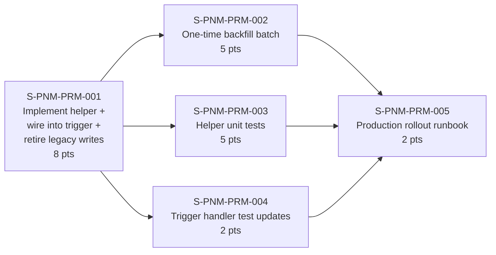
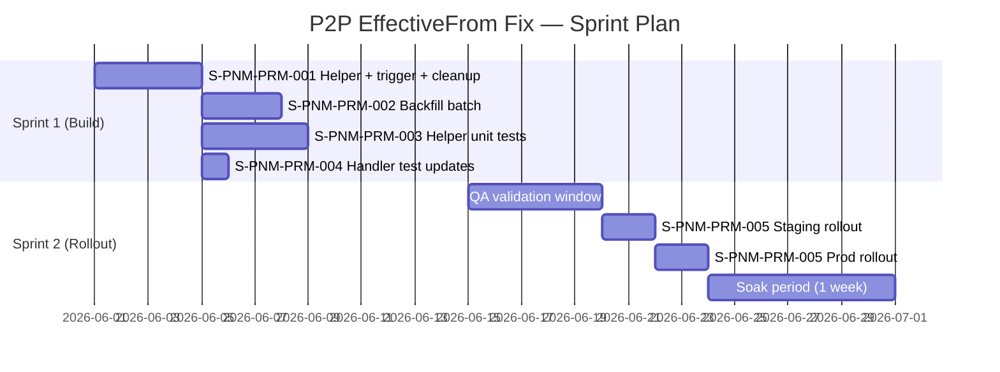

# P2P `EffectiveFrom` ← Oldest Active PPL — User Stories & Developer Guide

> **Epic**: Keep `Practice-to-Practitioner.EffectiveFrom` in sync with the oldest active `Practitioner Practice Location.EffectiveFrom` for the same Group + Practitioner, across every guided flow, batch, and Bulk API path.
>
> **Companion docs**:
> - Functional & data-model analysis → [`P2P_EffectiveFrom_From_Oldest_Active_PPL_Impact_Analysis.md`](./P2P_EffectiveFrom_From_Oldest_Active_PPL_Impact_Analysis.md)
> - Large-volume governor audit → [`P2P_EffectiveFrom_Fix_LargeVolume_Audit.md`](./P2P_EffectiveFrom_Fix_LargeVolume_Audit.md)
> - Flow inventory (which guided flows touch P2P) → [`P2P_EffectiveFrom_Fix_FlowInventory.md`](./P2P_EffectiveFrom_Fix_FlowInventory.md)
> - **`EffectiveTo` + bad-date (back-date / future-date / mismatch) scenarios per guided flow** → [`P2P_EffectiveTo_Override_Scenarios.md`](./P2P_EffectiveTo_Override_Scenarios.md)
>
> **Total effort**: ~22 story points across 5 stories. Recommended cadence: 2 sprints (build sprint, then rollout sprint with a deliberate gap for QA validation).
>
> **v2 changes** (Jun 2026): Feature flag removed; implementation, trigger wire-up, and Phase 2 cleanup consolidated into a single story; story format aligned with the latest `user-story-architect` linter.

---

## Epic Summary



| # | Story | Points | Type | Sprint |
|---|---|---|---|---|
| S-PNM-PRM-001 | Implement `syncP2PEffectiveFromOldestActivePPL`, wire it into `PRM_PracFacilityTriggerHandler`, and retire the redundant legacy manual writes | 8 | Feature | 1 |
| S-PNM-PRM-002 | Build `PRM_BackfillP2PEffectiveFromBatch` (dry-run + real-run) | 5 | Data fix | 1 |
| S-PNM-PRM-003 | Add `PRM_HCPFTriggerHelperTest` (correctness + large-volume + cascade tests) | 5 | Test | 1 |
| S-PNM-PRM-004 | Augment `PRM_PracFacilityTriggerHandlerTest` with cascade-suppression cases | 2 | Test | 1 |
| S-PNM-PRM-005 | Production rollout runbook (deploy → dry-run → real backfill → monitor) | 2 | Ops | 2 |

> Replace `S-PNM-PRM-00N` with actual GUS work-item numbers when stories are created.

---

# Story 1: Implement P2P EffectiveFrom auto-sync helper, wire into trigger, and retire legacy manual writes

**Persona:** PRM platform engineer
**Story ID:** S-PNM-PRM-001
**Type:** Feature
**Points:** 8
**Priority:** Highest
**Depends on:** None

## Story

**As a** PRM platform engineer
**I want** a centralized Apex helper that recomputes `Practice-to-Practitioner.EffectiveFrom` from the oldest active `Practitioner Practice Location.EffectiveFrom` for the same Group + Practitioner — invoked from the `HealthcarePractitionerFacility` trigger handler on every after-DML event — and the two redundant legacy manual writes retired so the trigger is the single source of truth
**So that** every guided flow, OmniScript, batch, and Bulk API path inherits the rule automatically without touching 16 separate flows, the helper cannot create infinite cascade loops with the other handler methods, and future engineers aren't confused by stale duplicate logic.

## Scope

This story covers three tightly-coupled deliverables that must ship together:

1. **Helper implementation** — Add `syncP2PEffectiveFromOldestActivePPL` to `PRM_HCPFTriggerHelper.cls` with chunked SOQL (≤ 500 keys), chunked DML (≤ 200 rows), recursion guard (`isP2PRecomputeInProgress`), guardrails against pushing `EffectiveFrom` past `EffectiveTo`, and exception logging via `PRM_ExceptionLogger`. The helper derives **both** dates in one pass: `EffectiveFrom = MIN(active PPL.EffectiveFrom)` and `EffectiveTo = null when any PPL is active, else MAX(EffectiveTo) across the pair's PPLs` — overriding any back-dated, future-dated, or range-mismatched value a flow stamped. See [`P2P_EffectiveTo_Override_Scenarios.md`](./P2P_EffectiveTo_Override_Scenarios.md) §9 for the `buildP2PUpdateList` extension and §10 for the additional `EffectiveTo` acceptance criteria (AC-T1…AC-T8).
2. **Trigger wire-up** — Invoke the helper from `PRM_PracFacilityTriggerHandler.afterInsert/afterUpdate/afterDelete`, plus add a single top-of-trigger short-circuit so the helper's own re-fire doesn't run the five existing cascade methods (`updateAccountPNC`, `updateActiveLocationsCount`, `updatePrimaryFlagonExistingPPL`, `futureDatedProcessing`, `handleConciergeRollup`).
3. **Phase 2 cleanup** — Remove the two known redundant manual `EffectiveFrom` writes on P2P (`PRM_ReinstateVendorAccountBatchHelper.cls` lines 327-335; `PRMUpdatePracticeToPractitionerDelg_1` DataRaptor's `EffectiveFrom` output mapping) so the trigger is the single source of truth.

**Out of scope**: The one-time backfill of existing data drift (S-PNM-PRM-002), the test classes (S-PNM-PRM-003, S-PNM-PRM-004), and the production rollout runbook (S-PNM-PRM-005).

## Acceptance Criteria

**Scenario 1: Termed oldest PPL moves P2P to next oldest**

Given a Practitioner has 3 active PPLs dated 11/1, 12/1, 1/1 belonging to the same Group with one P2P dated 11/1
When the 11/1 PPL is termed (IsActive=false, EffectiveTo=today)
Then P2P.EffectiveFrom is updated to 12/1
And no extra trigger cascade work fires for the P2P re-update

**Scenario 2: All PPLs termed in one DML leaves P2P unchanged**

Given all PPLs for a (Group, Practitioner) pair are termed in a single DML operation
When the DML completes
Then P2P.EffectiveFrom is not changed because there is no remaining active PPL to derive from
And no exception is logged

**Scenario 3: Retro PPL becomes new oldest active**

Given a Practitioner has 2 active PPLs at 12/1 and 1/1 with a P2P at 12/1
When a retro PPL is added with EffectiveFrom = 11/20
Then P2P.EffectiveFrom is updated to 11/20

**Scenario 4: Guardrail prevents EffectiveFrom from exceeding EffectiveTo**

Given a P2P has EffectiveTo = 12/31 and the only remaining active PPL has EffectiveFrom = 1/15 of the next year
When the recompute runs
Then P2P.EffectiveFrom is not changed and no DML happens for that row

**Scenario 5: Trigger re-fire on helper's DML is suppressed**

Given the helper has set `isP2PRecomputeInProgress = true` and is updating 200 P2P rows
When the trigger re-fires with `Trigger.new` containing only those P2P rows
Then the top-of-trigger short-circuit returns immediately
And `updateAccountPNC`, `updateActiveLocationsCount`, `updatePrimaryFlagonExistingPPL`, `futureDatedProcessing`, and `handleConciergeRollup` are all skipped (verified via `Limits.getQueries()` delta)

**Scenario 6: Mixed-payload re-fire still runs cascade**

Given the helper has set `isP2PRecomputeInProgress = true` but a separate DML touches both PPL and P2P rows in the same transaction
When the trigger fires
Then the short-circuit does not engage (because `allRowsAreP2P` returns false)
And all five cascade methods run normally

**Scenario 7: Large-volume PPL DML stays within governor limits**

Given a single facility has 1,500 active PPLs across 1,500 distinct Practitioners
When all 1,500 PPLs are termed in one DML
Then the total SOQL count stays ≤ 20 and DML count stays ≤ 15
And no `LimitException` is thrown

**Scenario 8: Chunked aggregate query handles 2,500 distinct keys**

Given a termination touches 2,500 distinct (Account, Practitioner) keys
When the helper runs its aggregate `MIN(EffectiveFrom) GROUP BY AccountId, PractitionerId` query
Then the keys are chunked into at least 5 batches of ≤ 500
And no `Too many query rows: 2001` aggregate-cap error fires

**Scenario 9: Helper exception is logged and parent batch continues**

Given the helper throws an unexpected exception mid-run
When the catch block executes
Then a `PRM_ExceptionLog__c` row is created via `PRM_ExceptionLogger.logException`
And the recursion guard is reset to false
And the parent termination batch is not aborted

**Scenario 10: Error-state P2P row is left alone**

Given a P2P has `PRM_IsErrorRecord__c = true`
When the recompute runs
Then no DML is performed against that P2P row

**Scenario 11: Account Reinstate flow still produces correct P2P EffectiveFrom after legacy write is removed**

Given the manual assignment `obj.EffectiveFrom = inputEffectiveFrom` is removed from `PRM_ReinstateVendorAccountBatchHelper.cls` lines 327-335
When an Account Reinstate flow runs end-to-end
Then the P2P still receives the correct EffectiveFrom (now computed by the trigger helper from the active PPLs)

**Scenario 12: Delegated PDM Manual Update still produces correct P2P EffectiveFrom after DR mapping is disabled**

Given the `EffectiveFrom` output mapping on `PRMUpdatePracticeToPractitionerDelg_1` is disabled
When a Delegated PDM Manual Update OmniScript runs
Then the P2P EffectiveFrom is still set correctly by the trigger helper

## Technical Section

### Files touched

| File | Change |
|---|---|
| `force-app/main/default/classes/PRM_HCPFTriggerHelper.cls` | **Add** `syncP2PEffectiveFromOldestActivePPL` method + 4 private helpers + 2 public utilities (`allRowsAreP2P`, `isP2PRecomputeInProgress` static) |
| `force-app/main/default/classes/PRM_PracFacilityTriggerHandler.cls` | **Modify** `afterInsert`, `afterUpdate`, `afterDelete` to add a top-of-trigger short-circuit and a call to the new helper |
| `force-app/main/default/classes/PRM_ReinstateVendorAccountBatchHelper.cls` | **Remove** redundant `obj.EffectiveFrom = inputEffectiveFrom` write at lines 327-335 |
| `force-app/main/default/omniDataTransforms/PRMUpdatePracticeToPractitionerDelg_1.rpt-meta.xml` | **Disable** the `EffectiveFrom` output mapping (set `<disabled>true</disabled>` on the mapping element) |

### Helper implementation

Add to `force-app/main/default/classes/PRM_HCPFTriggerHelper.cls`:

```apex
/*
* @MethodName    : syncP2PEffectiveFromOldestActivePPL
* @Description   : Recomputes P2P.EffectiveFrom from MIN(EffectiveFrom) of
*                  remaining active PPLs for the same (AccountId, PractitionerId).
*                  Called from PRM_PracFacilityTriggerHandler.afterInsert /
*                  afterUpdate / afterDelete.
* @Params        : changedList, oldMap, isDelete
* @StoryNumber   : S-PNM-PRM-001
*/

@TestVisible public static Boolean isP2PRecomputeInProgress = false;
@TestVisible static Integer SOQL_CHUNK = 500;
@TestVisible static Integer DML_CHUNK  = 200;

public static void syncP2PEffectiveFromOldestActivePPL(
        List<HealthcarePractitionerFacility> changedList,
        Map<Id, HealthcarePractitionerFacility> oldMap,
        Boolean isDelete) {

    if (isP2PRecomputeInProgress)                     return;
    if (changedList == null || changedList.isEmpty()) return;

    try {
        Id pplRtId = PRM_GlobalConstant.RECTYPEID_PLAFFILIATION;
        Id p2pRtId = PRM_GlobalConstant.RECTYPEID_PRACTITIONERPL;

        Set<String> impactedKeys = collectImpactedKeys(changedList, oldMap, isDelete, pplRtId);
        if (impactedKeys.isEmpty()) return;

        Map<String, Date> keyToOldestEffFrom =
            queryOldestActivePPLEffectiveFrom(impactedKeys, pplRtId);

        List<HealthcarePractitionerFacility> p2ps = queryP2PRows(impactedKeys, p2pRtId);
        if (p2ps.isEmpty()) return;

        List<HealthcarePractitionerFacility> toUpdate =
            buildP2PUpdateList(p2ps, keyToOldestEffFrom);
        if (toUpdate.isEmpty()) return;

        isP2PRecomputeInProgress = true;
        try {
            for (Integer i = 0; i < toUpdate.size(); i += DML_CHUNK) {
                Integer end = Math.min(i + DML_CHUNK, toUpdate.size());
                List<HealthcarePractitionerFacility> slice = new List<HealthcarePractitionerFacility>();
                for (Integer j = i; j < end; j++) slice.add(toUpdate.get(j));
                update slice;
            }
        } finally {
            isP2PRecomputeInProgress = false;
        }
    } catch (Exception ex) {
        PRM_ExceptionLogger.logException(
            'PRM_HCPFTriggerHelper.syncP2PEffectiveFromOldestActivePPL',
            '', 'Error', ex.getStackTraceString(), ex.getMessage(),
            ex.getTypeName(), ex.getLineNumber(), '',
            ex.getMessage(), 'Salesforce', '', '');
        isP2PRecomputeInProgress = false;
    }
}

private static Set<String> collectImpactedKeys(
        List<HealthcarePractitionerFacility> changedList,
        Map<Id, HealthcarePractitionerFacility> oldMap,
        Boolean isDelete,
        Id pplRtId) {
    Set<String> keys = new Set<String>();
    for (HealthcarePractitionerFacility n : changedList) {
        if (n.RecordTypeId != pplRtId) continue;
        if (n.AccountId == null || n.PractitionerId == null) continue;

        HealthcarePractitionerFacility o =
            (oldMap != null && !isDelete) ? oldMap.get(n.Id) : null;
        Boolean changed = isDelete
            || (o == null)
            || n.IsActive             != o.IsActive
            || n.EffectiveFrom        != o.EffectiveFrom
            || n.EffectiveTo          != o.EffectiveTo
            || n.PRM_IsErrorRecord__c != o.PRM_IsErrorRecord__c;
        if (!changed) continue;

        keys.add(n.AccountId + '|' + n.PractitionerId);
        if (o != null && (o.AccountId != n.AccountId || o.PractitionerId != n.PractitionerId)) {
            keys.add(o.AccountId + '|' + o.PractitionerId);
        }
    }
    return keys;
}

private static Map<String, Date> queryOldestActivePPLEffectiveFrom(
        Set<String> impactedKeys, Id pplRtId) {
    Map<String, Date> result = new Map<String, Date>();
    List<String> keyList = new List<String>(impactedKeys);

    for (Integer i = 0; i < keyList.size(); i += SOQL_CHUNK) {
        Integer end = Math.min(i + SOQL_CHUNK, keyList.size());
        Set<Id> acctIds = new Set<Id>();
        Set<Id> pracIds = new Set<Id>();
        for (Integer j = i; j < end; j++) {
            List<String> parts = keyList.get(j).split('\\|');
            acctIds.add(parts[0]);
            pracIds.add(parts[1]);
        }
        for (AggregateResult ar : [
            SELECT AccountId acc, PractitionerId prac, MIN(EffectiveFrom) minEFF
            FROM   HealthcarePractitionerFacility
            WHERE  RecordTypeId         = :pplRtId
              AND  IsActive             = true
              AND  PRM_IsErrorRecord__c = false
              AND  AccountId           IN :acctIds
              AND  PractitionerId      IN :pracIds
            GROUP BY AccountId, PractitionerId
        ]) {
            String key = ((Id)ar.get('acc')) + '|' + ((Id)ar.get('prac'));
            if (impactedKeys.contains(key)) {
                result.put(key, (Date)ar.get('minEFF'));
            }
        }
    }
    return result;
}

private static List<HealthcarePractitionerFacility> queryP2PRows(
        Set<String> impactedKeys, Id p2pRtId) {
    List<HealthcarePractitionerFacility> result = new List<HealthcarePractitionerFacility>();
    List<String> keyList = new List<String>(impactedKeys);

    for (Integer i = 0; i < keyList.size(); i += SOQL_CHUNK) {
        Integer end = Math.min(i + SOQL_CHUNK, keyList.size());
        Set<Id> acctIds = new Set<Id>();
        Set<Id> pracIds = new Set<Id>();
        for (Integer j = i; j < end; j++) {
            List<String> parts = keyList.get(j).split('\\|');
            acctIds.add(parts[0]);
            pracIds.add(parts[1]);
        }
        result.addAll([
            SELECT Id, AccountId, PractitionerId,
                   EffectiveFrom, EffectiveTo, IsActive, PRM_IsErrorRecord__c
            FROM   HealthcarePractitionerFacility
            WHERE  RecordTypeId    = :p2pRtId
              AND  AccountId      IN :acctIds
              AND  PractitionerId IN :pracIds
        ]);
    }
    return result;
}

private static List<HealthcarePractitionerFacility> buildP2PUpdateList(
        List<HealthcarePractitionerFacility> p2ps,
        Map<String, Date> keyToOldestEffFrom) {

    List<HealthcarePractitionerFacility> toUpdate = new List<HealthcarePractitionerFacility>();
    Date today = Date.today();
    for (HealthcarePractitionerFacility p2p : p2ps) {
        String key = p2p.AccountId + '|' + p2p.PractitionerId;
        Date newEffFrom = keyToOldestEffFrom.get(key);
        if (newEffFrom == null)                          continue;
        if (p2p.EffectiveFrom == newEffFrom)             continue;
        if (p2p.EffectiveTo != null && newEffFrom > p2p.EffectiveTo) continue;
        if (p2p.PRM_IsErrorRecord__c == true)            continue;

        HealthcarePractitionerFacility u = new HealthcarePractitionerFacility(Id = p2p.Id);
        u.EffectiveFrom = newEffFrom;
        u.IsActive      = (newEffFrom <= today)
                          && (p2p.EffectiveTo == null || p2p.EffectiveTo > today);
        toUpdate.add(u);
    }
    return toUpdate;
}

public static Boolean allRowsAreP2P(List<HealthcarePractitionerFacility> rows) {
    if (rows == null || rows.isEmpty()) return false;
    Id p2pRt = PRM_GlobalConstant.RECTYPEID_PRACTITIONERPL;
    for (HealthcarePractitionerFacility r : rows) {
        if (r.RecordTypeId != p2pRt) return false;
    }
    return true;
}
```

### Trigger wire-up

Edit `force-app/main/default/classes/PRM_PracFacilityTriggerHandler.cls`. Each of the three `after*` methods receives a top-of-trigger short-circuit and a call to the helper:

```apex
public override void afterInsert(Map<Id, SObject> newItems) {
    if (PRM_HCPFTriggerHelper.isP2PRecomputeInProgress
        && PRM_HCPFTriggerHelper.allRowsAreP2P(
            (List<HealthcarePractitionerFacility>)newItems.values())) {
        return;
    }

    updateAccountPNC();
    updateActiveLocationsCount();
    updatePrimaryFlagonExistingPPL(newItems, null);
    futureDatedProcessing((List<HealthcarePractitionerFacility>)newItems.values(), null);
    PRM_HCPFTriggerHelper.handleConciergeRollup(newItems, null);

    PRM_HCPFTriggerHelper.syncP2PEffectiveFromOldestActivePPL(
        (List<HealthcarePractitionerFacility>)newItems.values(), null, false);
}

public override void afterUpdate(Map<Id, SObject> newItems, Map<Id, SObject> oldItems) {
    if (PRM_HCPFTriggerHelper.isP2PRecomputeInProgress
        && PRM_HCPFTriggerHelper.allRowsAreP2P(
            (List<HealthcarePractitionerFacility>)newItems.values())) {
        return;
    }

    updateAccountPNC();
    updateActiveLocationsCount();
    PRM_GlobalConstant.byPassVal = PRM_GlobalConstant.BOOL_FALSE;
    updatePrimaryFlagonExistingPPL(newItems, oldItems);
    futureDatedProcessing((List<HealthcarePractitionerFacility>)newItems.values(),
                          (Map<Id, HealthcarePractitionerFacility>)oldItems);
    PRM_HCPFTriggerHelper.processAffCareCatEffectiveDates(
        (List<HealthcarePractitionerFacility>)newItems.values(),
        (Map<Id, HealthcarePractitionerFacility>)oldItems);
    PRM_HCPFTriggerHelper.handleConciergeRollup(newItems, oldItems);

    PRM_HCPFTriggerHelper.syncP2PEffectiveFromOldestActivePPL(
        (List<HealthcarePractitionerFacility>)newItems.values(),
        (Map<Id, HealthcarePractitionerFacility>)oldItems,
        false);
}

public override void afterDelete(Map<Id, SObject> oldItems) {
    if (PRM_HCPFTriggerHelper.isP2PRecomputeInProgress
        && PRM_HCPFTriggerHelper.allRowsAreP2P(
            (List<HealthcarePractitionerFacility>)oldItems.values())) {
        return;
    }

    if (!PRM_GlobalConstant.byPassVal) updateActiveLocationsCount();
    PRM_HCPFTriggerHelper.handleConciergeRollup(null, oldItems);

    PRM_HCPFTriggerHelper.syncP2PEffectiveFromOldestActivePPL(
        (List<HealthcarePractitionerFacility>)oldItems.values(), null, true);
}
```

Update the trigger handler header comment:

```apex
/*
* @ClassName    : PRM_PracFacilityTriggerHandler
* @TestClassName: PRM_PracFacilityTriggerHandlerTest
* @StoryNumber  : 943889 ; S-PNM-PRM-001 (P2P EffectiveFrom auto-sync)
* @CreatedOn    : 16-May-2024
* @CreatedBy    : Accenture
* @Description  : This apex class is used to handle before/after trigger logic
*/
```

### Phase 2 legacy cleanup

**File 1**: `force-app/main/default/classes/PRM_ReinstateVendorAccountBatchHelper.cls` — remove the redundant `obj.EffectiveFrom = inputEffectiveFrom` assignment in `cls_PracticeToPractitioner` (around lines 327-335):

```apex
private static List<HealthcarePractitionerFacility> cls_PracticeToPractitioner(...) {
    for (HealthcarePractitionerFacility obj : existingP2Ps) {
        // S-PNM-PRM-001 — EffectiveFrom is now computed by PRM_HCPFTriggerHelper.
        //                 Manual assignment removed to make the trigger the
        //                 single source of truth.
        obj.IsActive    = true;
        obj.EffectiveTo = null;
    }
}
```

**File 2**: `force-app/main/default/omniDataTransforms/PRMUpdatePracticeToPractitionerDelg_1.rpt-meta.xml` — locate the `outputFieldName>EffectiveFrom` mapping (line 104) and set `<disabled>true</disabled>` on the parent mapping element, matching the pattern used by `PRMUpdatePracticeToPractitioner_1` and `PRMDRCreatePPLForPPA_1`:

```xml
<elementList>
    <disabled>true</disabled>
    <inputFieldName>EffectiveDate</inputFieldName>
    <outputFieldName>EffectiveFrom</outputFieldName>
    ...
</elementList>
```

### Developer notes — common pitfalls

1. **The aggregate query over-fetches by design.** It filters by `AccountId IN :acctIds AND PractitionerId IN :pracIds` — a Cartesian product, not exact pairs. The `if (impactedKeys.contains(key))` post-filter in `queryOldestActivePPLEffectiveFrom` is **mandatory**; without it, you write back values for unrelated keys.

2. **`isP2PRecomputeInProgress` is `public`, not `private`.** The trigger handler reads it at the top of its own methods. Marking it `@TestVisible private` would break that wire-up.

3. **`afterDelete` MUST pass `isDelete=true`.** The first design draft passed the deleted list as both `newList` and `oldMap`, which made `changed = (o == null) || n.X != o.X` evaluate to `false` everywhere. The `isDelete` parameter short-circuits the change check so every deleted PPL counts as impacted.

4. **DML chunking is for the re-fire, not the parent transaction.** 200 rows per chunk keeps `Trigger.new.size()` on the re-fire under the comfortable handler-cache size.

5. **Place the trigger short-circuit at the TOP** — before `updateAccountPNC()`. The cost of running `updateAccountPNC` on a P2P-only re-fire is wasted SOQL on Account rollups that won't change.

6. **Don't add the short-circuit to `beforeInsert/beforeUpdate/beforeDelete`.** Our helper does no DML in the before-phase, so the trigger doesn't re-fire those events from our work. Adding the check there would just be dead code.

7. **Aggregate `GROUP BY` row cap is 2,000** — *not* 50,000 like normal SOQL. This is the most-missed governor limit in this codebase. Always chunk to ≤ 500 keys.

## Clarification Questions

- **Q1:** Should the helper write `EffectiveFrom` even when the new value equals the current value? — **Resolved**: No. `buildP2PUpdateList` skips rows where `p2p.EffectiveFrom == newEffFrom` to avoid spurious DML.
- **Q2:** What happens to P2P rows marked `PRM_IsErrorRecord__c = true`? — **Resolved**: They are skipped entirely. Error records require manual review.
- **Q3:** When all PPLs for a (Group, Practitioner) pair are terminated, should the P2P be soft-deleted, or left as-is? — **Resolved**: Left as-is. Termination of the P2P (setting `EffectiveTo`/`IsActive=false`) is handled by separate logic in `PRM_AccountTerminationBatchHelper` and `PRM_CrossReferencePracticeLocation` (only fires when the LAST active PPL terminates). Our helper is non-destructive.
- **Q4:** Do we need to handle the case where `AccountId` or `PractitionerId` itself changes on the PPL? — **Resolved**: Yes. `collectImpactedKeys` adds BOTH the old and new key to the impacted set so both P2Ps are recomputed.

## Impact Analysis

**Components added / modified by this story:**

| Layer | Component | Action |
|---|---|---|
| Apex | `PRM_HCPFTriggerHelper.cls` | Add helper + 4 private methods + 1 public utility |
| Apex | `PRM_PracFacilityTriggerHandler.cls` | Modify `afterInsert`, `afterUpdate`, `afterDelete` |
| Apex | `PRM_ReinstateVendorAccountBatchHelper.cls` | Remove redundant write at lines 327-335 |
| DataRaptor | `PRMUpdatePracticeToPractitionerDelg_1.rpt-meta.xml` | Disable `EffectiveFrom` output mapping |

**Components reached transitively (via the trigger handler being called by their DML)**: All 33 Apex classes, 74 DataRaptors, and ~130 Integration Procedures listed in [`P2P_EffectiveFrom_Fix_FlowInventory.md`](./P2P_EffectiveFrom_Fix_FlowInventory.md). No code changes are required in any of them — they inherit the new behavior automatically because all DML goes through Salesforce's standard triggers.

**Components NOT impacted**: PPL-only writers (15 DRs), AP-only writers (40+ DRs), and the 8 guided flows that touch HCPF but not P2P (Attestation, PSV Review, Update Primary Practice Location, etc.).

**Risk surface**: Three areas to monitor in QA before promoting:
1. Existing tests for trigger cascade methods may need adjustment if their assertions implicitly assumed the trigger never re-fires on P2P updates.
2. The trigger cascade short-circuit changes the SOQL count on P2P-only updates. Any test asserting an exact SOQL count must be reviewed.
3. The Account Reinstate flow (after the legacy write removal) must produce the same EffectiveFrom on the P2P as it did before — covered by S-PNM-PRM-003 acceptance criteria.

## Estimated Effort

**8 story points.** Breakdown:
- Helper method + 4 private helpers: 3 pts
- Trigger wire-up + cascade short-circuit: 2 pts
- Legacy cleanup (Apex + DataRaptor): 1 pt
- Code review cycles + lint fixes: 2 pts

AI-estimated — validate with team.

## Definition of Done

- [ ] All four code changes (helper, trigger handler, Apex cleanup, DR cleanup) committed and compile clean
- [ ] No PMD violations introduced (`npm run lint` passes)
- [ ] Helper compiles with `public static` signature and `@TestVisible` static state
- [ ] Trigger handler header `@StoryNumber` updated to reference S-PNM-PRM-001
- [ ] Existing `PRM_PracFacilityTriggerHandlerTest` runs green against the new wire-up
- [ ] Manual smoke test in scratch org: insert PPL → P2P EffectiveFrom populates correctly
- [ ] PR reviewed by 2 engineers (one platform, one PRM domain)
- [ ] Static analysis (Salesforce Code Analyzer / PMD) passes

---

# Story 2: Build one-time backfill batch for existing P2P EffectiveFrom drift

**Persona:** PRM ops engineer
**Story ID:** S-PNM-PRM-002
**Type:** Data fix
**Points:** 5
**Priority:** High
**Depends on:** S-PNM-PRM-001

## Story

**As a** PRM ops engineer
**I want** a one-time batch job that walks every existing P2P row and corrects its `EffectiveFrom` to the oldest active PPL `EffectiveFrom` for the same Group + Practitioner, with a dry-run mode that previews the change without committing DML
**So that** the 230,207 existing P2P rows are brought into alignment with the new rule before the live trigger starts to drift other systems with confusing per-record updates, and operations can size the change with confidence before pulling the trigger.

## Scope

This story delivers a single batch class `PRM_BackfillP2PEffectiveFromBatch` with:

1. Dry-run mode (constructor flag) that reports the number of would-have-updated rows without touching DML
2. Real-run mode that executes partial-commit DML (`Database.update(records, false)`)
3. Trigger-cascade suppression during backfill (sets `isP2PRecomputeInProgress=true` to avoid running cascade methods 1,150 times)
4. Logging to `PRM_AsyncProcess__c` with `PRM_ItemsProcessed__c` (success count) and `PRM_ItemsFailed__c` (failure count)
5. Chunk size 200 to stay well under all governor limits

**Out of scope**: Test class (covered in S-PNM-PRM-003), production execution (covered in S-PNM-PRM-005), and any UI/scheduler wrapper (this is a manually-invoked one-time batch).

## Acceptance Criteria

**Scenario 1: Dry-run reports drift count without committing DML**

Given the class is instantiated with `dryRun=true`
When the batch runs to completion
Then no DML is committed against `HealthcarePractitionerFacility`
And a `PRM_AsyncProcess__c` row is created with `PRM_ItemsProcessed__c` equal to the count of rows that would have been updated
And `PRM_ItemsFailed__c` is 0

**Scenario 2: Real-run corrects drift on production volumes**

Given the class is instantiated with `dryRun=false` on QA with 230,207 P2P rows
When the batch runs to completion
Then all drifted rows are corrected to the MIN(active PPL EffectiveFrom) for their Group + Practitioner
And the `PRM_AsyncProcess__c` row records `PRM_ItemsProcessed__c` = success count and `PRM_ItemsFailed__c` = failure count

**Scenario 3: Partial commit lets good rows succeed when one fails**

Given 1 row out of 200 in a chunk fails DML (e.g., validation rule)
When the chunk executes
Then `Database.update(records, false)` partial-commit lets the other 199 rows succeed
And `PRM_ItemsFailed__c` increments by 1

**Scenario 4: Trigger cascade is suppressed during backfill**

Given the batch is updating P2P rows
When the trigger re-fires on those updates
Then the top-of-trigger short-circuit (from S-PNM-PRM-001) engages because `isP2PRecomputeInProgress=true`
And no cascade method runs (no Account PNC updates, no Concierge rollup, no FutureDated processing)

**Scenario 5: Governor limits stay green at chunk size 200**

Given the batch is invoked with chunk size 200
When each `execute()` runs
Then total SOQL ≤ 2 per chunk and total DML ≤ 1 per chunk
And the full backfill against 230 K rows completes in ≤ 30 minutes wall-clock time

**Scenario 6: Backfill is safe to re-run after partial completion**

Given the backfill is re-run after a previous successful run
When the second execution completes
Then `PRM_ItemsProcessed__c` is near 0 (only edge cases that drifted between runs)
And no row is double-updated

## Technical Section

### File added

`force-app/main/default/classes/PRM_BackfillP2PEffectiveFromBatch.cls`

```apex
/*
* @ClassName    : PRM_BackfillP2PEffectiveFromBatch
* @TestClassName: PRM_BackfillP2PEffectiveFromBatchTest
* @StoryNumber  : S-PNM-PRM-002
* @Description  : One-time backfill that aligns P2P.EffectiveFrom with the
*                 oldest active PPL.EffectiveFrom for the same (AccountId,
*                 PractitionerId). Supports dry-run mode.
*
* Usage:
*   // DRY RUN — preview what would change:
*   Database.executeBatch(new PRM_BackfillP2PEffectiveFromBatch(true), 200);
*
*   // REAL RUN — apply the changes:
*   Database.executeBatch(new PRM_BackfillP2PEffectiveFromBatch(false), 200);
*/
global class PRM_BackfillP2PEffectiveFromBatch
        implements Database.Batchable<SObject>, Database.Stateful {

    private Boolean dryRun;
    private Integer recordsScanned  = 0;
    private Integer recordsToUpdate = 0;
    private Integer recordsUpdated  = 0;
    private Integer recordsFailed   = 0;

    global PRM_BackfillP2PEffectiveFromBatch(Boolean dryRun) {
        this.dryRun = dryRun != null && dryRun;
    }

    global Database.QueryLocator start(Database.BatchableContext bc) {
        return Database.getQueryLocator(
            'SELECT Id, AccountId, PractitionerId, EffectiveFrom, EffectiveTo, '
          + '       IsActive, PRM_IsErrorRecord__c '
          + 'FROM   HealthcarePractitionerFacility '
          + 'WHERE  RecordTypeId = :PRM_GlobalConstant.RECTYPEID_PRACTITIONERPL '
          + '  AND  PRM_IsErrorRecord__c = false');
    }

    global void execute(Database.BatchableContext bc,
                        List<HealthcarePractitionerFacility> scope) {
        recordsScanned += scope.size();

        Set<Id>     acctIds = new Set<Id>();
        Set<Id>     pracIds = new Set<Id>();
        Set<String> keys    = new Set<String>();
        for (HealthcarePractitionerFacility p2p : scope) {
            if (p2p.AccountId == null || p2p.PractitionerId == null) continue;
            acctIds.add(p2p.AccountId);
            pracIds.add(p2p.PractitionerId);
            keys.add(p2p.AccountId + '|' + p2p.PractitionerId);
        }

        Map<String, Date> oldest = new Map<String, Date>();
        for (AggregateResult ar : [
            SELECT AccountId acc, PractitionerId prac, MIN(EffectiveFrom) minEFF
            FROM   HealthcarePractitionerFacility
            WHERE  RecordTypeId         = :PRM_GlobalConstant.RECTYPEID_PLAFFILIATION
              AND  IsActive             = true
              AND  PRM_IsErrorRecord__c = false
              AND  AccountId           IN :acctIds
              AND  PractitionerId      IN :pracIds
            GROUP BY AccountId, PractitionerId
        ]) {
            String key = ((Id)ar.get('acc')) + '|' + ((Id)ar.get('prac'));
            if (keys.contains(key)) oldest.put(key, (Date)ar.get('minEFF'));
        }

        Date today = Date.today();
        List<HealthcarePractitionerFacility> toUpdate = new List<HealthcarePractitionerFacility>();
        for (HealthcarePractitionerFacility p2p : scope) {
            String key = p2p.AccountId + '|' + p2p.PractitionerId;
            Date newEffFrom = oldest.get(key);
            if (newEffFrom == null) continue;
            if (p2p.EffectiveFrom == newEffFrom) continue;
            if (p2p.EffectiveTo != null && newEffFrom > p2p.EffectiveTo) continue;
            if (p2p.PRM_IsErrorRecord__c == true) continue;

            HealthcarePractitionerFacility u = new HealthcarePractitionerFacility(Id = p2p.Id);
            u.EffectiveFrom = newEffFrom;
            u.IsActive      = (newEffFrom <= today)
                              && (p2p.EffectiveTo == null || p2p.EffectiveTo > today);
            toUpdate.add(u);
        }
        recordsToUpdate += toUpdate.size();

        if (dryRun || toUpdate.isEmpty()) return;

        PRM_HCPFTriggerHelper.isP2PRecomputeInProgress = true;
        try {
            Database.SaveResult[] results = Database.update(toUpdate, false);
            for (Database.SaveResult sr : results) {
                if (sr.isSuccess()) recordsUpdated++;
                else                recordsFailed++;
            }
        } finally {
            PRM_HCPFTriggerHelper.isP2PRecomputeInProgress = false;
        }
    }

    global void finish(Database.BatchableContext bc) {
        PRM_AsyncProcess__c log = new PRM_AsyncProcess__c(
            PRM_Type__c           = 'Backfill',
            PRM_SubType__c        = dryRun ? 'P2PEffectiveFromBackfill_DryRun'
                                           : 'P2PEffectiveFromBackfill',
            PRM_StartTime__c      = DateTime.now(),
            PRM_EndTime__c        = DateTime.now(),
            PRM_Status__c         = PRM_GlobalConstant.PROCESS_FINISHED,
            PRM_ItemsProcessed__c = dryRun ? recordsToUpdate : recordsUpdated,
            PRM_ItemsFailed__c    = recordsFailed
        );
        insert log;
    }
}
```

### Developer notes

1. **Always run dry-run first.** The `PRM_ItemsProcessed__c` counter on the `PRM_AsyncProcess__c` row tells you exactly how many P2Ps will move. If the number is dramatically larger than expected, stop and investigate.

2. **The backfill suppresses the trigger via `isP2PRecomputeInProgress=true` even though it's not technically re-entering the helper.** This is intentional — it prevents the cascade work in `PRM_PracFacilityTriggerHandler.afterUpdate` (Account PNC, FutureDated, Concierge) from running ~1,150 extra times.

3. **Use `Database.update(toUpdate, false)` (partial commit).** A single validation-rule failure on one P2P should not abort the whole 200-row chunk.

4. **The query in `start()` is selective** because `RecordTypeId` is indexed.

5. **The class is `global`** because batch classes invoked via `Database.executeBatch` are required to expose `global` interface methods.

## Clarification Questions

- **Q1:** Should the backfill run during business hours? — **Resolved**: Yes. Trigger cascade is suppressed so it's effectively read-mostly with at most 200 P2P updates per chunk. Run during a maintenance window only if business prefers extra caution.
- **Q2:** Do we need a rollback strategy? — **Resolved**: The class is idempotent (re-running it just re-confirms correctness). For a hard rollback, restore from sandbox snapshot — captured in S-PNM-PRM-005 runbook.

## Impact Analysis

**Components added by this story:**

| Layer | Component | Action |
|---|---|---|
| Apex | `PRM_BackfillP2PEffectiveFromBatch.cls` | New class (global) |

**Existing components referenced (read-only or via static state):**

- `PRM_HCPFTriggerHelper.isP2PRecomputeInProgress` (set true/false from S-PNM-PRM-001)
- `PRM_GlobalConstant` (RecordType IDs)
- `PRM_AsyncProcess__c` (log insert)

**No flow / OmniScript / DR changes are required.**

## Estimated Effort

**5 story points.** Breakdown:
- Batch class implementation: 2 pts
- QA dry-run validation cycles: 2 pts
- PR review + ops sign-off: 1 pt

AI-estimated — validate with team.

## Definition of Done

- [ ] Class compiles and is annotated `global`
- [ ] Anonymous-Apex dry-run executed in QA; `PRM_AsyncProcess__c` log inspected and count reported to PRM data steward
- [ ] PR approved by 2 engineers + 1 ops/admin
- [ ] No PMD violations
- [ ] Test class delivered in S-PNM-PRM-003 covers ≥ 85% lines on this class

---

# Story 3: Helper unit tests with correctness, large-volume, and cascade coverage

**Persona:** PRM platform engineer
**Story ID:** S-PNM-PRM-003
**Type:** Test
**Points:** 5
**Priority:** High
**Depends on:** S-PNM-PRM-001, S-PNM-PRM-002

## Story

**As a** PRM platform engineer
**I want** a comprehensive Apex test class for `PRM_HCPFTriggerHelper.syncP2PEffectiveFromOldestActivePPL` covering functional correctness, guardrails, large-volume behavior, cascade suppression, and the backfill batch
**So that** the helper achieves ≥ 90% code coverage and every audit-identified failure mode has a regression test that fails noisily if the protection is ever weakened.

## Scope

A new `PRM_HCPFTriggerHelperTest` class with ~18 test methods spanning:

- Functional correctness (Scenarios 1-4 from the original requirement)
- Guardrails (EffectiveTo, error record, recursion guard, afterDelete regression)
- Large-volume (1,500-PPL synth, chunked aggregate at the cliff edge, idempotency)
- Cascade suppression (P2P-only re-fire vs. mixed payload)
- Backfill batch (dry-run, real-run, partial commit)

**Out of scope**: Test updates for `PRM_PracFacilityTriggerHandler` (covered separately in S-PNM-PRM-004).

## Acceptance Criteria

**Scenario 1: All test methods pass**

Given all 18 test methods exist
When `npm run test:unit` runs
Then every method passes

**Scenario 2: Coverage threshold met**

Given the coverage tool runs against the test class
When the helper is measured
Then `PRM_HCPFTriggerHelper.syncP2PEffectiveFromOldestActivePPL` and its 4 private helpers report ≥ 90% line coverage

**Scenario 3: afterDelete regression test catches the original bug**

Given the original design draft passed `oldMap` as the deleted list (causing change-detection to evaluate to false)
When the dedicated regression test runs
Then the test passes only with `isDelete=true` and fails without it (proving the protection is in place)

## Technical Section

### File added

`force-app/main/default/classes/PRM_HCPFTriggerHelperTest.cls`

```apex
@IsTest
private class PRM_HCPFTriggerHelperTest {

    @TestSetup
    static void setup() {
        // No feature-flag setup needed — the helper runs unconditionally.
        // Test data is built per-method to keep each method independently
        // bisectable.
    }

    /* ─── Functional correctness ─────────────────────────────────────── */

    @IsTest
    static void scenario1_termOldestPPL_movesP2PToNextOldest() {
        Account a       = TestDataFactory.newAccount();
        Contact prac    = TestDataFactory.newPractitionerContact();
        Id pplRt        = PRM_GlobalConstant.RECTYPEID_PLAFFILIATION;
        Id p2pRt        = PRM_GlobalConstant.RECTYPEID_PRACTITIONERPL;
        HealthcarePractitionerFacility ppl1 = TestDataFactory.newPPL(a.Id, prac.Id,
            Date.newInstance(2025, 11, 1), pplRt);
        HealthcarePractitionerFacility ppl2 = TestDataFactory.newPPL(a.Id, prac.Id,
            Date.newInstance(2025, 12, 1), pplRt);
        HealthcarePractitionerFacility ppl3 = TestDataFactory.newPPL(a.Id, prac.Id,
            Date.newInstance(2026, 1, 1), pplRt);
        HealthcarePractitionerFacility p2p = TestDataFactory.newP2P(a.Id, prac.Id,
            Date.newInstance(2025, 11, 1), p2pRt);
        insert new List<HealthcarePractitionerFacility>{ppl1, ppl2, ppl3, p2p};

        Test.startTest();
        ppl1.IsActive    = false;
        ppl1.EffectiveTo = Date.today();
        update ppl1;
        Test.stopTest();

        HealthcarePractitionerFacility p2pAfter = [
            SELECT EffectiveFrom FROM HealthcarePractitionerFacility WHERE Id = :p2p.Id];
        System.assertEquals(Date.newInstance(2025, 12, 1), p2pAfter.EffectiveFrom,
            'P2P.EffectiveFrom should advance to the next oldest active PPL');
    }

    @IsTest
    static void scenario2_addRetroPPL_movesP2PEarlier() {
        // … add a 11/20 retro PPL after the original 11/1 was termed
    }

    @IsTest
    static void scenario3_allPPLsTermed_p2pUnchanged() {
        // … term all PPLs; assert P2P.EffectiveFrom NOT changed
    }

    @IsTest
    static void scenario4_accountChangeOnPPL_recomputesBothP2Ps() {
        // … PPL.AccountId changes; assert both old and new pair recomputed
    }

    /* ─── Guardrails ─────────────────────────────────────────────────── */

    @IsTest
    static void newEffectiveFromPastEffectiveTo_isSkipped() {
        // … P2P.EffectiveTo = today; oldest remaining PPL is tomorrow
        // … assert no DML on the P2P
    }

    @IsTest
    static void errorStateP2P_isLeftAlone() {
        // … P2P with PRM_IsErrorRecord__c = true; assert no DML on that P2P
    }

    @IsTest
    static void recursionGuard_blocksReentry() {
        PRM_HCPFTriggerHelper.isP2PRecomputeInProgress = true;
        try {
            Integer soqlBefore = Limits.getQueries();
            PRM_HCPFTriggerHelper.syncP2PEffectiveFromOldestActivePPL(
                new List<HealthcarePractitionerFacility>{
                    new HealthcarePractitionerFacility()},
                null, false);
            System.assertEquals(0, Limits.getQueries() - soqlBefore,
                'Guard should exit before any SOQL');
        } finally {
            PRM_HCPFTriggerHelper.isP2PRecomputeInProgress = false;
        }
    }

    @IsTest
    static void afterDelete_recomputesP2P() {
        // REGRESSION for the original-design bug.  Arrange 3 PPLs + 1 P2P;
        // delete the oldest PPL via afterDelete path. Assert: P2P.EffectiveFrom
        // = next oldest. This test must FAIL if a future refactor removes
        // the isDelete=true parameter on the afterDelete call.
    }

    @IsTest
    static void pendingP2P_recomputedWhenPPLBecomesActive() {
        // P2P inserted with PRM_Pending__c=true; PPL inserted with IsActive=false.
        // Then PPL is updated to IsActive=true → P2P.EffectiveFrom matches.
    }

    /* ─── Large-volume ───────────────────────────────────────────────── */

    @IsTest
    static void largeFacility_1500PPLs_term_singleDML() {
        Account a = TestDataFactory.newAccount();
        HealthcareFacility f = TestDataFactory.newHCFacility();
        List<Contact> pracs = TestDataFactory.newPractitionerContacts(1500);
        List<HealthcarePractitionerFacility> ppls = new List<HealthcarePractitionerFacility>();
        List<HealthcarePractitionerFacility> p2ps = new List<HealthcarePractitionerFacility>();
        Date base = Date.today().addMonths(-12);
        Id pplRt  = PRM_GlobalConstant.RECTYPEID_PLAFFILIATION;
        Id p2pRt  = PRM_GlobalConstant.RECTYPEID_PRACTITIONERPL;
        for (Integer i = 0; i < 1500; i++) {
            ppls.add(TestDataFactory.newPPL(a.Id, pracs[i].Id, base.addDays(i), pplRt, f.Id));
            p2ps.add(TestDataFactory.newP2P(a.Id, pracs[i].Id, base.addDays(i), p2pRt));
        }
        insert ppls;
        insert p2ps;

        for (HealthcarePractitionerFacility ppl : ppls) {
            ppl.IsActive    = false;
            ppl.EffectiveTo = Date.today();
        }

        Test.startTest();
        Integer soqlBefore = Limits.getQueries();
        Integer dmlBefore  = Limits.getDmlStatements();
        update ppls;
        Test.stopTest();

        Integer soqlUsed = Limits.getQueries() - soqlBefore;
        Integer dmlUsed  = Limits.getDmlStatements() - dmlBefore;
        System.assert(soqlUsed <= 20,
            'Helper should keep SOQL under 20 at 1,500 records: ' + soqlUsed);
        System.assert(dmlUsed  <= 15,
            'Helper should keep DML under 15: ' + dmlUsed);
    }

    @IsTest
    static void chunkedAggregate_threeChunksAtCliffEdge() {
        // … synthesize 1,200 distinct (Account, Practitioner) keys → 3 SOQL chunks
    }

    @IsTest
    static void chainedBatch_secondPassIsIdempotent() {
        // … same update applied twice → second pass produces no DML
    }

    /* ─── Cascade suppression ────────────────────────────────────────── */

    @IsTest
    static void triggerShortCircuit_p2pOnlyRefire_skipsCascade() {
        // … set isP2PRecomputeInProgress=true; update 10 P2P rows;
        // … assert no Account update happens (would happen if updateAccountPNC ran)
    }

    @IsTest
    static void mixedRefire_doesNotShortCircuit() {
        // … isP2PRecomputeInProgress=true but DML touches both PPL and P2P;
        // … assert cascade STILL runs (allRowsAreP2P returns false)
    }

    /* ─── Backfill batch (covers S-PNM-PRM-002) ──────────────────────── */

    @IsTest
    static void backfill_dryRun_noUpdates() {
        // Seed 10 P2Ps with intentionally wrong EffectiveFrom
        // Run batch with dryRun=true
        // Assert: P2P.EffectiveFrom unchanged; PRM_AsyncProcess__c row created
        //         with PRM_ItemsProcessed__c = 10
    }

    @IsTest
    static void backfill_realRun_correctsKnownDrift() {
        // Same seed; dryRun=false
        // Assert: all 10 corrected; PRM_AsyncProcess__c.PRM_ItemsProcessed__c = 10
    }

    @IsTest
    static void backfill_partialCommit_oneRowFails() {
        // Seed 10 rows, force 1 to fail validation
        // Assert: 9 succeed, 1 fails, log row records correct counts
    }
}
```

### Test data factory enhancements

If `TestDataFactory` doesn't already expose `newPPL` / `newP2P`, **add helper methods rather than duplicating insert logic**:

```apex
public static HealthcarePractitionerFacility newPPL(
        Id accountId, Id practitionerId, Date effFrom, Id rtId) {
    return newPPL(accountId, practitionerId, effFrom, rtId, null);
}
public static HealthcarePractitionerFacility newPPL(
        Id accountId, Id practitionerId, Date effFrom, Id rtId, Id facilityId) {
    return new HealthcarePractitionerFacility(
        AccountId            = accountId,
        PractitionerId       = practitionerId,
        HealthcareFacilityId = facilityId,
        RecordTypeId         = rtId,
        EffectiveFrom        = effFrom,
        IsActive             = (effFrom <= Date.today()),
        PRM_IsErrorRecord__c = false);
}
```

## Clarification Questions

- **Q1:** Should we test on Bulk API ingestion paths too? — **Resolved**: No. Bulk API DML still fires the trigger handler, so the helper coverage from the standard DML tests is transitive. A separate integration test in QA covers Bulk API at the org level.

## Impact Analysis

**Components added by this story:**

| Layer | Component | Action |
|---|---|---|
| Apex | `PRM_HCPFTriggerHelperTest.cls` | New test class (~18 methods) |
| Apex | `TestDataFactory.cls` | (Possibly) Add `newPPL`, `newP2P`, `newHCFacility`, `newPractitionerContacts(int)` helpers |

**No production-code changes** — this story is test-only.

## Estimated Effort

**5 story points.** Breakdown:
- 18 test methods (incl. 1,500-record synthesis and chunked-aggregate tests): 3 pts
- TestDataFactory enhancements: 1 pt
- Coverage tuning + PR review: 1 pt

AI-estimated — validate with team.

## Definition of Done

- [ ] All 18 listed tests implemented and passing
- [ ] `npm run test:unit:coverage` shows ≥ 90% coverage on `PRM_HCPFTriggerHelper`
- [ ] `largeFacility_1500PPLs_term_singleDML` asserts SOQL ≤ 20 and DML ≤ 15
- [ ] `afterDelete_recomputesP2P` regression test in place and passing
- [ ] Backfill batch coverage ≥ 85% via the 3 backfill tests
- [ ] PR reviewed

---

# Story 4: Cascade-suppression tests for the trigger handler

**Persona:** PRM platform engineer
**Story ID:** S-PNM-PRM-004
**Type:** Test
**Points:** 2
**Priority:** Medium
**Depends on:** S-PNM-PRM-001

## Story

**As a** PRM platform engineer
**I want** the existing trigger handler test class augmented with explicit tests for the new top-of-trigger short-circuit logic
**So that** any future refactor that breaks the short-circuit (and causes redundant cascade SOQL on every P2P-only re-fire) fails CI before it merges to main.

## Scope

Add 3 new test methods to `PRM_PracFacilityTriggerHandlerTest.cls` validating:
- P2P-only re-fire skips all cascade work
- Mixed-payload re-fire does not skip cascade
- Baseline (no recompute in progress) still runs cascade

**Out of scope**: The helper's own tests (covered in S-PNM-PRM-003).

## Acceptance Criteria

**Scenario 1: P2P-only re-fire skips all cascade methods**

Given `isP2PRecomputeInProgress = true` and `Trigger.new` contains only P2P rows
When the trigger fires
Then `updateAccountPNC` performs 0 SOQL calls
And `futureDatedProcessing` performs 0 DML calls
And `handleConciergeRollup` is not invoked

**Scenario 2: Mixed payload re-fire runs cascade normally**

Given `isP2PRecomputeInProgress = true` but Trigger.new contains a mix of PPL and P2P rows
When the trigger fires
Then all 5 cascade methods run normally

**Scenario 3: Baseline (guard off) still runs cascade**

Given `isP2PRecomputeInProgress = false`
When the trigger fires for any update
Then all 5 cascade methods run normally (no behavior change vs. today)

## Technical Section

### File modified

`force-app/main/default/classes/PRM_PracFacilityTriggerHandlerTest.cls`

Add 3 new test methods:

```apex
@IsTest
static void triggerShortCircuit_p2pOnlyRefireSkipsAllCascade() {
    PRM_HCPFTriggerHelper.isP2PRecomputeInProgress = true;
    try {
        Account a = [SELECT Id FROM Account LIMIT 1];
        Contact c = [SELECT Id FROM Contact LIMIT 1];

        HealthcarePractitionerFacility p2p = new HealthcarePractitionerFacility(
            AccountId       = a.Id,
            PractitionerId  = c.Id,
            RecordTypeId    = PRM_GlobalConstant.RECTYPEID_PRACTITIONERPL,
            EffectiveFrom   = Date.today().addMonths(-6),
            IsActive        = true);
        insert p2p;

        Integer soqlBefore = Limits.getQueries();

        Test.startTest();
        p2p.EffectiveFrom = Date.today().addMonths(-7);
        update p2p;
        Test.stopTest();

        Integer soqlUsed = Limits.getQueries() - soqlBefore;
        System.assert(soqlUsed <= 1,
            'Short-circuit should have prevented cascade SOQL: used ' + soqlUsed);
    } finally {
        PRM_HCPFTriggerHelper.isP2PRecomputeInProgress = false;
    }
}

@IsTest
static void triggerShortCircuit_mixedPayloadRunsCascade() {
    // … verify cascade runs when allRowsAreP2P returns false
}

@IsTest
static void triggerShortCircuit_baselineRunsCascade() {
    // … with isP2PRecomputeInProgress=false, cascade methods all run
}
```

## Clarification Questions

- None at this time.

## Impact Analysis

**Components modified by this story:**

| Layer | Component | Action |
|---|---|---|
| Apex | `PRM_PracFacilityTriggerHandlerTest.cls` | Add 3 new test methods |

**No production-code changes.** This story is test-only.

## Estimated Effort

**2 story points.** Three small test methods, mostly setup-light.

AI-estimated — validate with team.

## Definition of Done

- [ ] 3 new test methods added and passing
- [ ] Existing test methods in `PRM_PracFacilityTriggerHandlerTest` still pass
- [ ] PR reviewed

---

# Story 5: Production rollout runbook

**Persona:** PRM release engineer
**Story ID:** S-PNM-PRM-005
**Type:** Ops
**Points:** 2
**Priority:** Medium
**Depends on:** S-PNM-PRM-001, S-PNM-PRM-002, S-PNM-PRM-003, S-PNM-PRM-004

## Story

**As a** PRM release engineer
**I want** a step-by-step runbook for promoting the P2P EffectiveFrom auto-sync fix from QA → staging → production, including the dry-run backfill, the real-run backfill, post-deploy monitoring queries, and a clear rollback path
**So that** rollout is repeatable, recoverable, and easy to communicate to ops on Slack during go-live.

## Scope

Deliver a runbook in this story (the markdown content below) plus the operational verification SOQL queries that operators can paste into Developer Console at each step. **Out of scope**: any automation of the runbook (each step is intentionally manual to give the operator a checkpoint).

## Acceptance Criteria

**Scenario 1: Runbook executed clean on staging**

Given the runbook is followed exactly on a staging org
When every step is performed in order
Then the deploy succeeds, the dry-run shows the expected drift count, the real backfill corrects all rows, and the 24h monitoring window shows zero exceptions in `PRM_ExceptionLog__c`

**Scenario 2: Runbook supports rollback on production failure**

Given the production deploy completes but a regression is detected on day 1
When the rollback path is followed
Then the trigger handler can be reverted to its pre-deploy state in under 30 minutes by deploying the previous version of `PRM_PracFacilityTriggerHandler.cls`

**Scenario 3: Verification SOQLs return clean data after each step**

Given the operator runs the verification SOQLs listed in the runbook
When the queries return
Then `PRM_AsyncProcess__c` shows the expected backfill log rows
And `PRM_ExceptionLog__c` shows zero `PRM_HCPFTriggerHelper.syncP2P%` entries

## Technical Section

### Rollout sequence

| Step | Action | Verification | Rollback |
|---|---|---|---|
| 1 | Deploy code to staging: helper + trigger wire-up + backfill batch + test classes | `sf project deploy report` shows 100% component success; `sf apex run test --target-org staging` reports 100% pass | `sf project deploy quick --cancel <id>` |
| 2 | Run **dry-run** backfill: `Database.executeBatch(new PRM_BackfillP2PEffectiveFromBatch(true), 200);` | Query `PRM_AsyncProcess__c` for the finish-log row; record `PRM_ItemsProcessed__c` count and share with PRM data steward | None — no DML executed |
| 3 | Get sign-off on dry-run count from PRM data steward | Slack approval recorded in story comments | N/A |
| 4 | Run **real** backfill: `Database.executeBatch(new PRM_BackfillP2PEffectiveFromBatch(false), 200);` | Finish-log shows `ItemsProcessed > 0` and `ItemsFailed = 0` (or escalation if any failures) | Restore from sandbox snapshot if `ItemsFailed > 0` is severe |
| 5 | Smoke-test in staging: insert a PPL → P2P EffectiveFrom populates correctly; term that PPL → P2P advances to next oldest | Manual verification via Developer Console | Revert deploy |
| 6 | Monitor `PRM_ExceptionLog__c` for 24h | Verification SOQL #2 below returns 0 rows | Revert deploy |
| 7 | Promote to production (steps 1-6 against prod) | Same verifications | Same rollback (deploy previous version of `PRM_PracFacilityTriggerHandler.cls` + `PRM_HCPFTriggerHelper.cls`) |
| 8 | Post-prod soak: monitor for 1 week | Same exception-log query daily | Same rollback |

### Verification SOQLs

Paste into Developer Console (or `sf data query`) after each rollout step:

```sql
-- #1: Backfill log entries
SELECT Id, PRM_SubType__c, PRM_ItemsProcessed__c, PRM_ItemsFailed__c,
       PRM_StartTime__c, PRM_EndTime__c
FROM   PRM_AsyncProcess__c
WHERE  PRM_Type__c = 'Backfill'
  AND  PRM_SubType__c LIKE 'P2PEffectiveFromBackfill%'
ORDER BY PRM_StartTime__c DESC
LIMIT 10

-- #2: Exception entries (must return 0 rows for go-live to be considered clean)
SELECT Id, PRM_ProcessName__c, PRM_ErrorMessage__c, PRM_LineNumber__c, CreatedDate
FROM   PRM_ExceptionLog__c
WHERE  PRM_ProcessName__c LIKE 'PRM_HCPFTriggerHelper.syncP2P%'
  AND  CreatedDate = LAST_N_DAYS:7
ORDER BY CreatedDate DESC

-- #3: Sample P2P spot-check (paste known IDs for a couple of well-understood pairs)
SELECT Id, AccountId, PractitionerId, EffectiveFrom, EffectiveTo, IsActive
FROM   HealthcarePractitionerFacility
WHERE  RecordTypeId = '<RECTYPEID_PRACTITIONERPL>'
  AND  AccountId  = '<known account>'
  AND  PractitionerId = '<known practitioner>'

-- #4: Drift remaining after backfill (should be ~0)
SELECT COUNT(Id) p2pCount
FROM   HealthcarePractitionerFacility p2p
WHERE  RecordTypeId = '<RECTYPEID_PRACTITIONERPL>'
  AND  PRM_IsErrorRecord__c = false
  AND  EffectiveFrom != (
        SELECT MIN(EffectiveFrom)
        FROM   HealthcarePractitionerFacility
        WHERE  RecordTypeId = '<RECTYPEID_PLAFFILIATION>'
          AND  IsActive = true
          AND  AccountId = p2p.AccountId
          AND  PractitionerId = p2p.PractitionerId)
-- ⚠ Subquery requires breaking into 2 separate queries in Apex due to
-- Salesforce SOQL semi-join restrictions; this SQL is illustrative.
```

### Rollback path

If a regression surfaces:

1. **Quickest path** — Deploy the pre-feature versions of `PRM_PracFacilityTriggerHandler.cls` and `PRM_HCPFTriggerHelper.cls` to disable the helper invocation. The helper class can remain (dormant) — only the trigger wire-up needs to be reverted.
2. **Data state** — Backfilled P2Ps remain as-is (the data is now correct per the new rule; the regression only affects new updates). No data rollback is needed.
3. **Legacy writes restoration** — If the Apex/DR cleanup from S-PNM-PRM-001 needs to be undone, redeploy the pre-cleanup version of `PRM_ReinstateVendorAccountBatchHelper.cls` and `PRMUpdatePracticeToPractitionerDelg_1.rpt-meta.xml` from the prior release tag.

## Clarification Questions

- **Q1:** Should this rollout coordinate with the nightly `PRM_FutureDatedProcessingBatch` run? — **Resolved**: No. The backfill is idempotent and the future-dated batch only flips `IsActive` on rows reaching their `EffectiveFrom`/`EffectiveTo`, both of which the helper handles correctly via the trigger path.
- **Q2:** Should we add a `Schedulable` wrapper for the backfill? — **Resolved**: No. It's a one-time job. Manual `Database.executeBatch(...)` is the right interface.

## Impact Analysis

**Components added by this story:** Documentation only (this runbook section). No code.

**Operational impact:**
- ~15-30 minute deploy window per environment
- ~30 minute backfill run on QA volumes (230 K P2P rows at chunk 200)
- 24h monitoring window per environment before next step

## Estimated Effort

**2 story points.** Document drafting + 1 staging dry-run rehearsal.

AI-estimated — validate with team.

## Definition of Done

- [ ] Runbook executed in staging with all 8 steps green
- [ ] Verification SOQLs return clean results
- [ ] Runbook executed in production with all 8 steps green
- [ ] Story closed with rollout summary and final counts in GUS comments

---

## Appendix A — Developer Quick Reference

### Naming & style conventions (existing in this codebase)

| Convention | Example | Notes |
|---|---|---|
| Apex class prefix | `PRM_*` | All Provider Network Mgmt classes |
| Helper static state | `@TestVisible static` | Allows tests to override |
| Recursion guard | `static Boolean is*InProgress` | Set true → DML → finally false |
| Exception logging | `PRM_ExceptionLogger.logException(...)` | 12-arg signature — see existing calls |
| Story tagging | `@StoryNumber: S-PNM-PRM-00N` in class header, `// S-PNM-PRM-00N —` inline | Helps trace back to GUS work item |
| Trigger handlers | `extends PRM_TriggerHandler` | Uses framework pattern |

### Common pitfalls

1. **Don't forget the `PRM_IsErrorRecord__c = false` filter** — it appears on both `IsActive` queries and the change-detection check. Records flagged as errors must not participate in the recompute.

2. **Compound IN-list selectivity** — when filtering `AccountId IN :set AND PractitionerId IN :set`, Salesforce evaluates the *product* of the two sets, not the exact pairs. The post-query `if (impactedKeys.contains(key))` filter is what makes the result correct.

3. **Aggregate `GROUP BY` row cap is 2,000** — *not* 50,000 like normal SOQL. This is the most-missed governor limit in this codebase. Always chunk to ≤ 500 keys.

4. **Trigger re-fires from helper DML** — the moment our helper does `update toUpdate;`, the trigger fires again with `Trigger.new = toUpdate`. The recursion guard + top-of-trigger short-circuit must be in place *before* the DML.

5. **`Database.update(records, false)` vs. `update records;`** — for backfill and bulk operations, use the `(records, false)` form so a single bad row doesn't kill the whole chunk. For the live trigger, use `update toUpdate;` (all-or-nothing) so errors surface immediately to the caller.

### Useful CLI commands

```bash
# Deploy all 4 changes in this epic
sf project deploy start \
  --source-dir force-app/main/default/classes/PRM_HCPFTriggerHelper.cls \
  --source-dir force-app/main/default/classes/PRM_HCPFTriggerHelperTest.cls \
  --source-dir force-app/main/default/classes/PRM_PracFacilityTriggerHandler.cls \
  --source-dir force-app/main/default/classes/PRM_PracFacilityTriggerHandlerTest.cls \
  --source-dir force-app/main/default/classes/PRM_BackfillP2PEffectiveFromBatch.cls \
  --source-dir force-app/main/default/classes/PRM_ReinstateVendorAccountBatchHelper.cls \
  --source-dir force-app/main/default/omniDataTransforms/PRMUpdatePracticeToPractitionerDelg_1.rpt-meta.xml \
  --target-org qa-sandbox --wait 10

# Run only the new test class
sf apex run test --class-names PRM_HCPFTriggerHelperTest --target-org qa-sandbox --result-format human

# Run the dry-run backfill (paste into anonymous Apex)
Database.executeBatch(new PRM_BackfillP2PEffectiveFromBatch(true), 200);

# Tail logs while backfill runs
sf apex tail log --target-org qa-sandbox
```

---

## Appendix B — Sprint plan



---

## Appendix C — Glossary

| Term | Meaning |
|---|---|
| **PPL** | Practitioner Practice Location — `HealthcarePractitionerFacility` row with RecordType `PRM_PractitionerLocationAffiliation` |
| **P2P** | Practice to Practitioner — `HealthcarePractitionerFacility` row with RecordType `PRM_PractitionerPracticeAffiliation`; `HealthcareFacilityId` is NULL, unique key is `(AccountId, PractitionerId)` |
| **HCPF** | Shorthand for the `HealthcarePractitionerFacility` SObject (parent of PPL, P2P, and Admitting Privileges) |
| **Group** | A vendor `Account` that groups multiple practice locations |
| **Cascade** | The set of handlers (`updateAccountPNC`, `futureDatedProcessing`, `handleConciergeRollup`, `updateActiveLocationsCount`, `updatePrimaryFlagonExistingPPL`) that run alongside our new helper on every trigger fire |
| **Re-fire** | The trigger firing again because our helper's DML touched HCPF rows |
| **EffectiveFrom / EffectiveTo** | Date range over which the affiliation is active |
| **`isP2PRecomputeInProgress`** | Static guard set by the helper during its own DML; consumed by the trigger handler's top-of-trigger short-circuit |
| **Backfill** | One-time batch job (S-PNM-PRM-002) that aligns all 230 K existing P2P rows with the new rule |
