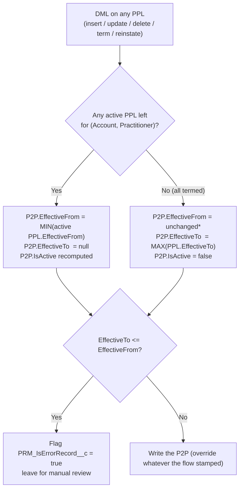

# P2P `EffectiveTo` + `EffectiveFrom` Override — Detailed Scenario Audit (every guided flow)

> **Purpose**: Extend the P2P auto-sync work to the **`EffectiveTo`** side of the date range, and to the three "bad date" classes the business hits in real life — **back-dating**, **future-dating**, and **range mismatch** (`EffectiveTo` not aligned with `EffectiveFrom`). The trigger helper must *override* whatever a flow stamps and re-derive both dates from the underlying active PPLs.
>
> **Companion docs**:
> - Dev story (EffectiveFrom helper + trigger wire-up) → [`P2P_EffectiveFrom_Fix_DevStory.md`](./P2P_EffectiveFrom_Fix_DevStory.md)
> - User stories (5-story epic) → [`P2P_EffectiveFrom_Fix_UserStories.md`](./P2P_EffectiveFrom_Fix_UserStories.md)
> - Flow inventory (which guided flows touch P2P) → [`P2P_EffectiveFrom_Fix_FlowInventory.md`](./P2P_EffectiveFrom_Fix_FlowInventory.md)
>
> **Style**: Every scenario uses the same worked-example format as `P2P_EffectiveFrom_Fix_DevStory.md` §2 — a **Setup** table, a **Trigger action**, an **Expected after** table, and a **Today, without the fix** note (❌ = current broken behavior).
>
> **Scope note**: This document is the requirements/behavior spec. The actual code change is a small extension to `buildP2PUpdateList` in `PRM_HCPFTriggerHelper.cls` (see §9) so that the helper computes **both** `EffectiveFrom` and `EffectiveTo` (and `IsActive` / `PRM_IsErrorRecord__c`) in a single pass. No new guided-flow changes.

---

## 1. The single-source-of-truth rule (both dates)

A **P2P** (`PRM_PractitionerPracticeAffiliation`) row represents one fact: *"this practitioner is affiliated with this group (Account)."* Its date range is **derived**, never authored. The unique key is `(AccountId, PractitionerId)`. The affiliation is the **union** of the practitioner's location affiliations (PPLs) in that group.

| P2P field | Derivation rule (the helper enforces this every DML) |
|---|---|
| **`EffectiveFrom`** | `MIN(EffectiveFrom)` of all **active** PPLs for the same `(AccountId, PractitionerId)`. Earliest date the practitioner was active at *any* location in the group. |
| **`EffectiveTo`** | **If ≥ 1 active PPL exists → `null`** (the affiliation is still open; the union has no end). **If all PPLs are termed → `MAX(EffectiveTo)`** of that pair's PPLs (the last location to close ends the affiliation). |
| **`IsActive`** | `EffectiveFrom <= TODAY` **AND** (`EffectiveTo == null` **OR** `EffectiveTo > TODAY`). |
| **`PRM_IsErrorRecord__c`** | `true` when the derived range is invalid (`EffectiveTo != null && EffectiveTo <= EffectiveFrom`). The row is then **left for manual review** and the helper does not keep overwriting it. |



\* When **no active PPL remains**, `MIN(active PPL.EffectiveFrom)` is undefined, so `EffectiveFrom` is left as-is — only `EffectiveTo` / `IsActive` move. This is the AC3 guard from the dev story.

---

## 2. Why "override" — the three bad-date classes the business hits

The business edits dates on the **PPL** (and sometimes directly on the P2P) through guided flows. Three recurring mistakes leave the P2P date range wrong. The helper must **override** the P2P value rather than trust whatever the flow wrote.

| # | Bad-date class | What the business does | What the P2P should become | Why today's behavior is wrong |
|---|---|---|---|---|
| **BD** | **Back-date** | Sets a PPL (or P2P) `EffectiveTo` / `EffectiveFrom` to a date in the **past** | Re-derive from active PPLs; if any PPL is still active the P2P `EffectiveTo` must snap back to `null` | A back-dated P2P `EffectiveTo` makes a still-active affiliation look terminated → drops the provider from networks/searches |
| **FD** | **Future-date** | Sets a PPL `EffectiveTo` / `EffectiveFrom` to a date in the **future** | `EffectiveTo` = future date is allowed (scheduled term), but P2P must equal `MAX` across PPLs and only when *all* are terming; `IsActive` stays `true` until the date arrives | Today the P2P keeps a stale `EffectiveTo` (or `null`) and the Future-Dated batch never re-derives the P2P when the date hits |
| **MM** | **Range mismatch** | `EffectiveTo` ends up **≤ `EffectiveFrom`** (e.g. term date earlier than the affiliation start) | Do **not** write an invalid range; flag `PRM_IsErrorRecord__c = true` and leave the existing value | The current single-PPL cascade *does* flag this, but only for the `size()==1` case (§3); the other cases write a bad range silently |

These map to the parameters the user called out: *"if business backdates **(BD)** or the effective to date falls into future **(FD)** or does not match with effective from **(MM)**, we have to override."*

---

## 3. Audit — what `EffectiveTo` handling exists today, and the gaps

Grounded in the live code (not assumptions):

### 3.1 The only existing P2P `EffectiveTo` derivation

`PRM_PracFacilityTriggerHandler.updatePrimaryFlagonExistingPPL` (lines ~397-405) is the **single** place a P2P `EffectiveTo` is derived from a PPL:

```399:404:force-app/main/default/classes/PRM_PracFacilityTriggerHandler.cls
                pplrecToUpdate.Id = pracToPractitioner.Id;
                pplrecToUpdate.EffectiveTo = idToEffectiveToMap.get(pracToPractitioner.AccountId) > pracToPractitioner.EffectiveFrom ? idToEffectiveToMap.get(pracToPractitioner.AccountId) : null ;
                pplrecToUpdate.IsActive = (pracToPractitioner.EffectiveFrom <= Date.today() && idToEffectiveToMap.get(pracToPractitioner.AccountId) > pracToPractitioner.EffectiveFrom && idToEffectiveToMap.get(pracToPractitioner.AccountId) > Date.today()) ? true : false;
                pplrecToUpdate.PRM_IsErrorRecord__c = idToEffectiveToMap.get(pracToPractitioner.AccountId) > pracToPractitioner.EffectiveFrom ? false : true;
                pplrecToUpdate.PRM_Pending__c = false;
```

And the only batch-side equivalent is `PRM_CrossReferencePracticeLocation` (lines ~289-292), which fires only when **all** PPLs for the pair terminate:

```289:292:force-app/main/default/classes/PRM_CrossReferencePracticeLocation.cls
        rec.put('EffectiveFrom',effectiveFrom );
        rec.put('IsError', effectiveFrom > effectiveTo ? true :  false);
        rec.put('EffectiveTo',effectiveFrom > effectiveTo ? null : effectiveTo );
        rec.put('Active',effectiveFrom > effectiveTo ? null : effectiveFrom <= system.today() && EffectiveTo > system.today() );
```

### 3.2 The five gaps these leave (this is the work)

| Gap | Current behavior | Consequence |
|---|---|---|
| **G1 — only the single-PPL case** | The trigger cascade only runs the P2P `EffectiveTo` update when the account has **exactly one** PPL (`accTopracLocAffMap.get(accId).size() == 1`, line 392). | When a practitioner has 2+ PPLs and one is termed, the P2P `EffectiveTo` is never re-evaluated. |
| **G2 — uses one PPL's date, not `MAX`** | `idToEffectiveToMap` stores the **first** changed PPL's `EffectiveTo` per account (`!containsKey`, lines 358-363). | With several PPLs terming at different dates, the P2P `EffectiveTo` reflects an arbitrary one, not the latest (`MAX`). |
| **G3 — no re-open on reinstate** | Nothing clears a P2P `EffectiveTo` back to `null` when an *additional* active PPL appears (reinstate / relink / retro add) and there are 2+ PPLs. | A reinstated provider keeps a stale `EffectiveTo` → still looks terminated. |
| **G4 — manual P2P edits not overridden** | A PDM Manual Update that back-dates / future-dates the P2P `EffectiveTo` directly is not reconciled against the PPLs. | The bad date sticks (BD/FD). |
| **G5 — Future-Dated batch doesn't re-derive P2P `EffectiveTo`** | The nightly batch flips PPL `IsActive` when a scheduled `EffectiveTo` arrives, but only the EffectiveFrom helper currently re-derives. | A scheduled term that closes the *last* PPL never stamps the P2P `EffectiveTo`. |

**The fix** (§9): the existing `buildP2PUpdateList` already computes `EffectiveFrom` from `MIN(active PPL)` and recomputes `IsActive`. Extend it to also compute `EffectiveTo` from the **union rule** in §1 (query `MAX(EffectiveTo)` for the all-termed case, set `null` when any PPL is active), with the `MM` guardrail. Because it runs from the central trigger on **every** DML, it closes G1-G5 for all flows at once.

---

## 4. Override decision matrix (the helper's truth table)

For a given `(Account, Practitioner)` pair after any DML:

| Active PPLs remain? | `MIN(active EffectiveFrom)` | `MAX(EffectiveTo)` across pair | P2P.EffectiveFrom → | P2P.EffectiveTo → | P2P.IsActive → | Error flag |
|---|---|---|---|---|---|---|
| **Yes** (≥1 active) | e.g. 11/1/2025 | n/a (ignored) | `MIN` (11/1/2025) | **`null`** (override any stale value) | recompute | — |
| **No** (all termed), valid range | unchanged | 6/30/2026 | unchanged | **6/30/2026** | `false` | — |
| **No** (all termed), `MAX(EffTo) ≤ EffFrom` | 7/1/2026 | 6/30/2026 | unchanged | **not written** | unchanged | **`true`** |
| **No** + future `MAX(EffTo)` | unchanged | 12/31/2026 (future) | unchanged | **12/31/2026** | **`true`** (date not yet reached) | — |

This matrix is applied **after** every flow writes — the flow's own value is treated as input, then overwritten.

---

# 5. Per-guided-flow scenarios — Termination flows (P2P `EffectiveTo` is *set*)

> Flow-inventory rows **6, 7, 8, 9**. These set a P2P `EffectiveTo` when locations close. Each gets a base case plus the back-date / future-date / mismatch variants.

## Scenario T1 — Practice Location Termination, last location closes (base case)

**Flow**: Practice Location Termination (`PRM_PracticeLocationTermination_English_*` → `PRM_PracticeLocationTerminationBatch` → `PRM_CrossReferencePracticeLocation`). Flow inventory row 6.

**Setup** (practitioner has only one active location in the group):

| Record | EffectiveFrom | EffectiveTo | IsActive | Notes |
|---|---|---|---|---|
| PPL #1 | 1/1/2025 | — | ✓ | only location |
| P2P | 1/1/2025 | — | ✓ | open affiliation |

**Trigger action**: Practice Location #1 is Termed with `EffectiveTo = 6/30/2026` → PPL #1 becomes `IsActive=false`, `EffectiveTo=6/30/2026`.

**Expected after**:

| Record | EffectiveFrom | EffectiveTo | IsActive | Notes |
|---|---|---|---|---|
| PPL #1 | 1/1/2025 | 6/30/2026 | ✗ | termed |
| P2P | 1/1/2025 | **6/30/2026** | ✗ | no active PPL left → `MAX(EffectiveTo)` |

**Today, without the fix**: works *only because* this is the `size()==1` path. ✅ (kept as the baseline — the helper must reproduce it.)

## Scenario T2 — Term one of several PPLs (G1 gap; affiliation stays open)

**Setup**:

| Record | EffectiveFrom | EffectiveTo | IsActive | Notes |
|---|---|---|---|---|
| PPL #1 | 1/1/2026 | — | ✓ | |
| PPL #2 | 12/1/2025 | — | ✓ | |
| PPL #3 | 11/1/2025 | — | ✓ | oldest |
| P2P | 11/1/2025 | — | ✓ | open |

**Trigger action**: Practice Location #3 termed with `EffectiveTo = 6/30/2026`.

**Expected after**:

| Record | EffectiveFrom | EffectiveTo | IsActive | Notes |
|---|---|---|---|---|
| PPL #3 | 11/1/2025 | 6/30/2026 | ✗ | termed |
| PPL #1, #2 | … | — | ✓ | still active |
| P2P | **12/1/2025** | **— (stays null)** | ✓ | EffectiveFrom advances (oldest now 12/1); EffectiveTo stays null because PPL #1/#2 still active |

**Today, without the fix**: the `size()==1` guard means the P2P `EffectiveTo` cascade never runs (G1), and the EffectiveFrom never advances (the original bug). ❌

## Scenario T3 — Term all PPLs at different dates (G2 gap; `MAX` wins)

**Setup**:

| Record | EffectiveFrom | EffectiveTo | IsActive | Notes |
|---|---|---|---|---|
| PPL #1 | 1/1/2025 | — | ✓ | |
| PPL #2 | 3/1/2025 | — | ✓ | |
| P2P | 1/1/2025 | — | ✓ | open |

**Trigger action** (one DML, two different term dates): PPL #1 termed `EffectiveTo = 5/31/2026`; PPL #2 termed `EffectiveTo = 8/31/2026`.

**Expected after**:

| Record | EffectiveFrom | EffectiveTo | IsActive | Notes |
|---|---|---|---|---|
| PPL #1 | 1/1/2025 | 5/31/2026 | ✗ | |
| PPL #2 | 3/1/2025 | 8/31/2026 | ✗ | latest close |
| P2P | 1/1/2025 | **8/31/2026** | depends on today | `MAX(EffectiveTo)` = 8/31/2026, not 5/31 |

**Today, without the fix**: even if the cascade fired, `idToEffectiveToMap` keeps the *first* PPL's date (5/31), so the P2P would close too early (G2). ❌

## Scenario T4 — Account Termination (whole group closes)

**Flow**: Account Termination (`PRM_AccountTerminationForm_English_*` → `PRM_AccountTerminationBatch`). Flow inventory row 7.

**Setup**: practitioner active at 2 locations in the group, plus the P2P.

**Trigger action**: Account termed effective `9/30/2026` → batch terms all PPLs (`EffectiveTo=9/30/2026`, `IsActive=false`) **and** stamps P2P `EffectiveTo=9/30/2026` directly.

**Expected after**:

| Record | EffectiveFrom | EffectiveTo | IsActive | Notes |
|---|---|---|---|---|
| all PPLs | … | 9/30/2026 | ✗ | termed |
| P2P | unchanged | **9/30/2026** | ✗ | flow stamped it; helper confirms it equals `MAX(EffectiveTo)` → no-op (idempotent) |

**Today, without the fix**: works because the batch stamps the P2P explicitly, but the value is **not validated** against the PPLs. If the batch and PPL dates ever diverge (e.g. partial failure), nothing reconciles. The helper makes the trigger the authority. ✅→✅ (now defended)

## Scenario T5 — Practitioner Termination across the group

**Flow**: Practitioner Termination (`PRM_PractitionerTerminationForm_*`, recred variants → `PRM_PractitionerTerminationBatch`, `PRM_FullPractitionerTerminationBatch`, `PRM_PractitionerTermRelateToVendorBatch`). Flow inventory row 8.

**Setup**: practitioner active at 3 locations.

**Trigger action**: Practitioner termed effective `7/31/2026` → all 3 PPLs `IsActive=false`, `EffectiveTo=7/31/2026`.

**Expected after**: P2P `EffectiveTo = 7/31/2026`, `IsActive=false` (no active PPL left → `MAX(EffectiveTo)`).

**Today, without the fix**: depends on which batch path runs; the recred/vendor variants don't all hit the `size()==1` cascade, so the P2P `EffectiveTo` can be left stale (G1). ❌

## Scenario T6 — Provider Change Request term-and-re-add

**Flow**: Provider Change Request (`PRM_ProviderChangeForm_*` → `PRM_ProvChangeTerminationBatch` + `PRM_ProviderChangePracLocTermUtil`). Flow inventory row 9. Note the existing cascade explicitly **excludes** `PRM_CaseManager__r.PRM_Stage__c == 'Provider Change Request Received'` (line 331), so the trigger cascade is deliberately skipped mid-PCR.

**Setup**:

| Record | EffectiveFrom | EffectiveTo | IsActive | Notes |
|---|---|---|---|---|
| PPL #old | 1/1/2025 | — | ✓ | location being changed |
| P2P | 1/1/2025 | — | ✓ | |

**Trigger action**: PCR terms PPL #old `EffectiveTo=6/30/2026` and adds PPL #new `EffectiveFrom=7/1/2026`.

**Expected after** (once the PCR stage completes and the suppression lifts):

| Record | EffectiveFrom | EffectiveTo | IsActive | Notes |
|---|---|---|---|---|
| PPL #old | 1/1/2025 | 6/30/2026 | ✗ | termed |
| PPL #new | 7/1/2026 | — | ✓ (when date hits) | |
| P2P | **1/1/2025** | **— (null)** | ✓ | a new active PPL exists → affiliation re-opens, EffectiveTo cleared |

**Today, without the fix**: the PCR-stage exclusion plus G1/G3 means the P2P can be left with a `6/30/2026` EffectiveTo even though PPL #new keeps the affiliation open. ❌ The helper must re-derive **after** the PCR suppression window.

---

### 5A. Back-date / future-date / mismatch variants for the termination flows

> Apply on top of T1-T6. Each is an "override" case.

## Scenario T-BD1 — Business **back-dates** a term while another PPL is active

**Setup**:

| Record | EffectiveFrom | EffectiveTo | IsActive | Notes |
|---|---|---|---|---|
| PPL #1 | 1/1/2025 | — | ✓ | |
| PPL #2 | 2/1/2025 | — | ✓ | |
| P2P | 1/1/2025 | — | ✓ | open |

**Trigger action**: PDM user **back-dates** PPL #1 `EffectiveTo = 12/31/2024` (before its own EffectiveFrom!) — a fat-finger term in the past.

**Expected after**:

| Record | EffectiveFrom | EffectiveTo | IsActive | Notes |
|---|---|---|---|---|
| PPL #1 | 1/1/2025 | 12/31/2024 | ✗ | back-dated term (bad on the PPL itself, handled by PPL logic) |
| PPL #2 | 2/1/2025 | — | ✓ | still active |
| P2P | **2/1/2025** | **— (null)** | ✓ | PPL #2 active → EffectiveTo overridden back to null; EffectiveFrom advances to 2/1 |

**Today, without the fix**: nothing re-opens the P2P; if the term had also touched the P2P, it would stay back-dated and the provider falls out of the network. ❌

## Scenario T-BD2 — Business back-dates the **last** PPL's term

**Setup**: single active PPL #1 `EffectiveFrom=1/1/2025`, P2P `EffectiveFrom=1/1/2025`.

**Trigger action**: PPL #1 termed with **back-dated** `EffectiveTo = 6/1/2025` (valid: after EffectiveFrom, in the past).

**Expected after**: P2P `EffectiveTo = 6/1/2025`, `IsActive=false` (no active PPL; `MAX=6/1/2025`; range valid because `6/1/2025 > 1/1/2025`).

**Today, without the fix**: the `size()==1` path handles this correctly. ✅ (helper must preserve it.)

## Scenario T-FD1 — **Future-dated** term on the last PPL (scheduled term)

**Setup**: single active PPL #1 `EffectiveFrom=1/1/2025`, P2P open.

**Trigger action**: PPL #1 termed with `EffectiveTo = 12/31/2026` (in the future). Today is 6/10/2026.

**Expected after**:

| Record | EffectiveFrom | EffectiveTo | IsActive | Notes |
|---|---|---|---|---|
| PPL #1 | 1/1/2025 | 12/31/2026 | ✓ | still active today (future term) |
| P2P | 1/1/2025 | **12/31/2026** | **✓** | EffectiveTo = future MAX; IsActive stays true until 12/31/2026 |

**Then** on **1/1/2027** the Future-Dated Processing batch flips PPL #1 `IsActive=false`:

| Record | EffectiveFrom | EffectiveTo | IsActive |
|---|---|---|---|
| PPL #1 | 1/1/2025 | 12/31/2026 | ✗ |
| P2P | 1/1/2025 | 12/31/2026 | **✗** (helper recomputes on the batch DML) |

**Today, without the fix (G5)**: the Future-Dated batch flips the PPL but the P2P `IsActive`/`EffectiveTo` is not re-derived, so the P2P can stay `IsActive=true` past its end date. ❌

## Scenario T-FD2 — Future-dated term, but another PPL stays active

**Setup**: PPL #1 active (`1/1/2025`), PPL #2 active (`3/1/2025`), P2P open.

**Trigger action**: PPL #1 future-termed `EffectiveTo=12/31/2026`. PPL #2 untouched.

**Expected after**: P2P `EffectiveTo = null`, `IsActive=true` — because PPL #2 is still open-ended active. The future term on PPL #1 does **not** close the union.

**Today, without the fix**: P2P could pick up `12/31/2026` from the changed PPL via the (mis)cascade, prematurely scheduling the whole affiliation to close. ❌

## Scenario T-MM1 — Term date **earlier than** affiliation start (range mismatch)

**Setup**: single active PPL #1 `EffectiveFrom=7/1/2026`, P2P `EffectiveFrom=7/1/2026` (a future-dated affiliation not yet active).

**Trigger action**: PPL #1 termed `EffectiveTo = 6/30/2026` (before EffectiveFrom).

**Expected after**:

| Record | EffectiveFrom | EffectiveTo | IsActive | PRM_IsErrorRecord__c |
|---|---|---|---|---|
| PPL #1 | 7/1/2026 | 6/30/2026 | ✗ | (PPL handled separately) |
| P2P | 7/1/2026 | **not written** | unchanged | **true** |

**Today, without the fix**: the `size()==1` cascade already flags `PRM_IsErrorRecord__c=true` here (line 402) — but only for `size()==1`. For multi-PPL or batch paths the invalid range is written silently. The helper applies the MM guard uniformly. ❌→✅

---

# 6. Reinstate / relink flows (P2P `EffectiveTo` must be *cleared* → re-open)

> Flow-inventory rows **3, 4, 10, 11, 12**. These re-open a previously closed affiliation. The recurring bug (G3) is that the P2P keeps a stale `EffectiveTo`.

## Scenario R1 — Practice Location Reinstate re-opens the affiliation

**Flow**: Practice Location Reinstate (`PRM_PracticeLocationReinstate_English_*` → `PRM_ReinstateUtils`). Flow inventory row 10.

**Setup** (continuing from a closed state):

| Record | EffectiveFrom | EffectiveTo | IsActive | Notes |
|---|---|---|---|---|
| PPL #1 | 1/1/2025 | 6/30/2026 | ✗ | termed |
| P2P | 1/1/2025 | 6/30/2026 | ✗ | closed |

**Trigger action**: PPL #1 reinstated → `IsActive=true`, `EffectiveTo=null`.

**Expected after**:

| Record | EffectiveFrom | EffectiveTo | IsActive | Notes |
|---|---|---|---|---|
| PPL #1 | 1/1/2025 | — | ✓ | reinstated |
| P2P | 1/1/2025 | **— (cleared)** | ✓ | active PPL exists → EffectiveTo overridden to null |

**Today, without the fix**: P2P `EffectiveTo` may stay `6/30/2026` (G3) → provider still looks terminated despite reinstatement. ❌

## Scenario R2 — Reinstate with a **retro (back-dated)** EffectiveFrom

**Setup**: same closed state as R1.

**Trigger action**: PPL #1 reinstated with a back-dated `EffectiveFrom = 11/20/2024` and `EffectiveTo=null`.

**Expected after**: P2P `EffectiveFrom = 11/20/2024`, `EffectiveTo = null`, `IsActive=true` — both dates re-derived (this is the mirror of dev-story Scenario 2, now also clearing `EffectiveTo`).

**Today, without the fix**: EffectiveFrom doesn't move backwards and EffectiveTo stays stale. ❌

## Scenario R3 — Practitioner Reinstate

**Flow**: Practitioner Reinstate (`PRM_PractitionerReinstateForm_English_*`, `PRM_ReinstateLinkExistingPractitioner_*` → `PRM_ReinstateUtils`). Flow inventory row 11. Same expected behavior as R1 across all the practitioner's locations in the group: any one active PPL → P2P `EffectiveTo=null`.

## Scenario R4 — Account Reinstate (legacy direct write)

**Flow**: Account Reinstate (`PRM_PractitionerReinstateVendorForm_English_*` → `PRM_ReinstateVendorAccountBatchHelper`). Flow inventory row 12. The helper **directly stamps** P2P `EffectiveTo = obj.EffectiveTo` and `EffectiveFrom = obj.EffectiveFrom` (lines 330-332).

**Setup**: closed P2P, all PPLs being reinstated effective `1/1/2026`.

**Trigger action**: Account Reinstate batch sets each PPL `IsActive=true`, `EffectiveTo=null`, `EffectiveFrom=1/1/2026`, and stamps the P2P with `EffectiveTo=null`, `EffectiveFrom=1/1/2026`.

**Expected after**: P2P `EffectiveFrom=1/1/2026` (= `MIN` active), `EffectiveTo=null`. The helper **overrides** the batch's stamped value with the derived value — they should match, so it's idempotent. Once the legacy direct write is removed (Phase 2 cleanup), the trigger is the sole author.

**Today, without the fix**: works only because the batch happens to stamp the right value; nothing reconciles if the PPL dates differ from `obj.EffectiveTo` (e.g. one PPL fails to reinstate). ❌ partial-failure drift.

## Scenario R5 — Unlink then Re-link a Practice Location

**Flow**: Unlink (`PRM_PDMUnlinkPractitioner`, row 3) then Link (`PRM_PDMLinkPracticeLocationHelper_Procedure_*` / `PRM_AddNewLocationUtilityHelper`, row 4).

**Setup**: practitioner linked to PPL #1 and PPL #2, P2P open.

**Trigger action A — Unlink PPL #1**: PPL #1 `IsActive=false`, `EffectiveTo=today`.
→ **Expected**: P2P `EffectiveFrom` advances to PPL #2's date, `EffectiveTo=null` (PPL #2 still active).

**Trigger action B — Re-link PPL #1** later with `EffectiveTo` cleared:
→ **Expected**: P2P `EffectiveTo=null` (already null), `EffectiveFrom` re-derived as `MIN`.

**Today, without the fix**: unlink with multiple PPLs hits G1 (cascade skipped); P2P dates drift. ❌

## Scenario R6 — Relink the **last** PPL (re-open a fully closed affiliation)

**Setup**:

| Record | EffectiveFrom | EffectiveTo | IsActive | Notes |
|---|---|---|---|---|
| PPL #1 | 1/1/2025 | 6/30/2026 | ✗ | only PPL, termed |
| P2P | 1/1/2025 | 6/30/2026 | ✗ | closed |

**Trigger action**: PPL #1 re-linked / reinstated with `EffectiveFrom=8/1/2026` (future), `EffectiveTo=null`, `IsActive=false` (future-dated).

**Expected after**:

| Record | EffectiveFrom | EffectiveTo | IsActive | Notes |
|---|---|---|---|---|
| PPL #1 | 8/1/2026 | — | ✗ (future) | will activate 8/1 |
| P2P | **8/1/2026** | **— (cleared)** | ✗ (until 8/1) | EffectiveFrom re-derived to the (future) MIN; EffectiveTo cleared; IsActive flips true when FDP batch runs on 8/1 |

**Today, without the fix**: P2P stays closed at `6/30/2026` forever. ❌ (and G5: even when 8/1 arrives, nothing re-derives.)

---

# 7. Creation, PDM Manual Update, and background scenarios

## Scenario C1 — Account Creation Cross-Reference (INSERT P2P)

**Flow**: Account Creation Cross-Reference (`PRM_AccountCreation_English_*` → `PRMDRCreateHCPFForPractitionerPracAffiliation_1` + `PRM_CrossRefBatch`). Flow inventory row 1.

**Setup**: new account, practitioner added at PPL #1 `EffectiveFrom=1/1/2026`, no `EffectiveTo`.

**Trigger action**: P2P inserted (DR stamps `EffectiveFrom`, no `EffectiveTo`).

**Expected after**: P2P `EffectiveFrom=1/1/2026` (= `MIN` active), `EffectiveTo=null`, `IsActive` per date. Helper confirms/overrides on insert (`afterInsert`).

**Today, without the fix**: correct at insert because the DR stamps the same value; the helper guards against the DR drifting. ✅ defended.

## Scenario C2 — Add Practitioner to Practice Location (INSERT additional PPL, retro)

**Flow**: Add Practitioner (`PRM_PractitionerCreation_*` → `PRM_AddNewLocationUtilityHelper`). Flow inventory row 5.

**Setup**: existing P2P `EffectiveFrom=12/1/2025`, `EffectiveTo=null`. Existing PPL #1 `12/1/2025`.

**Trigger action**: add PPL #2 with a **back-dated** `EffectiveFrom=11/20/2025`.

**Expected after**: P2P `EffectiveFrom=11/20/2025` (new `MIN`), `EffectiveTo=null`.

**Today, without the fix**: EffectiveFrom does not move backward. ❌ (the core dev-story bug; here confirmed for the To side staying null).

## Scenario C3 — Manual Updates QC (INSERT P2P at creation)

**Flow**: Manual Updates QC (`PRM_ManualUpdatesQC_English_*` → `PRM_ManualUpdatesCrossRefBatchHelper` line 175). Flow inventory row 13. P2P inserted with `EffectiveFrom = effectiveDate`. Expected: helper confirms `EffectiveFrom = MIN` active PPL and `EffectiveTo=null`. Idempotent at insert.

## Scenario PDM1 — PDM Manual Update **back-dates** the P2P `EffectiveTo` directly (G4)

**Flow**: PDM Manual Updates (`PRM_PDMManualUpdate*` → `PRMUpdatePracticeToPractitionerDelg_1`). Flow inventory row 2.

**Setup**: PPL #1 active `1/1/2026`, P2P `EffectiveFrom=1/1/2026`, `EffectiveTo=null`, active.

**Trigger action**: PDM user edits the **P2P** directly and sets `EffectiveTo = 1/1/2025` (a back-date) while PPL #1 is still active.

**Expected after**: P2P `EffectiveTo` **overridden back to null** (active PPL exists), `IsActive=true`. The manual back-date is discarded.

**Today, without the fix (G4)**: the manual P2P edit sticks → active provider looks terminated as of last year. ❌

## Scenario PDM2 — PDM Manual Update **future-dates** the P2P `EffectiveTo` directly

**Setup**: same as PDM1.

**Trigger action**: PDM user sets P2P `EffectiveTo = 12/31/2030` directly, but **no PPL** carries that term.

**Expected after**: P2P `EffectiveTo` overridden to `null` (PPL #1 active and open-ended; the union has no scheduled end). The orphan future date is discarded.

**Today, without the fix**: the future date sticks; the affiliation is scheduled to close on a date no location actually supports. ❌

## Scenario PDM3 — PDM Manual Update sets EffectiveFrom/To that **mismatch** (MM)

**Setup**: single active PPL #1, P2P `EffectiveFrom=1/1/2026`.

**Trigger action**: PDM user terms the last PPL and the resulting `MAX(EffectiveTo)` would be `12/31/2025` (earlier than `EffectiveFrom=1/1/2026`).

**Expected after**: P2P `EffectiveTo` **not written**; `PRM_IsErrorRecord__c=true`; row left for manual review.

**Today, without the fix**: only the `size()==1` path flags it; other paths write the inverted range. ❌→✅

## Scenario BG1 — Future-Dated Processing batch closes the last PPL (G5)

**Flow**: `PRM_FutureDatedProcessingBatch` (nightly). Flow inventory §4.

**Setup**: PPL #1 only location, future-termed `EffectiveTo=6/9/2026`, P2P `EffectiveTo=6/9/2026`, `IsActive=true` (yesterday relative to today 6/10/2026).

**Trigger action**: nightly batch detects the date passed → flips PPL #1 `IsActive=false`.

**Expected after**: the batch's PPL DML fires the trigger → helper recomputes P2P: no active PPL → `EffectiveTo = MAX = 6/9/2026`, `IsActive=false`.

**Today, without the fix (G5)**: the batch flips the PPL but the P2P `IsActive` is not re-derived → stale active P2P. ❌

## Scenario BG2 — Future-Dated batch **activates** a future-dated reinstated PPL

**Setup**: P2P closed `EffectiveTo=3/31/2026`, `IsActive=false`. PPL #1 reinstated earlier with future `EffectiveFrom=6/10/2026`, `IsActive=false`.

**Trigger action**: on 6/10/2026 the batch flips PPL #1 `IsActive=true`.

**Expected after**: P2P `EffectiveFrom=6/10/2026` (or earlier `MIN`), `EffectiveTo=null`, `IsActive=true` — affiliation re-opens.

**Today, without the fix**: P2P stays closed. ❌ (matches dev-story AC12, extended to clear `EffectiveTo`).

---

# 8. Cross-cutting edge-case scenarios

## Scenario E1 — `EffectiveTo` exactly equals `EffectiveFrom`

All termed, `MAX(EffectiveTo) == EffectiveFrom`. Rule: `EffectiveTo <= EffectiveFrom` is invalid → `PRM_IsErrorRecord__c=true`, no write. (Equal is treated as zero-length / invalid, consistent with the `>` comparisons in the existing code.)

## Scenario E2 — Mixed active + future-dated PPLs

PPL #1 active open-ended, PPL #2 future-termed `12/31/2026`. Any open-ended active PPL exists → P2P `EffectiveTo=null`. The future term on #2 is irrelevant until #1 also closes.

## Scenario E3 — All PPLs future-dated (not yet active)

PPL #1 `EffectiveFrom=8/1/2026` (future), `IsActive=false`, no `EffectiveTo`. No **active** PPL today. `MAX(EffectiveTo)` is null. Rule: leave P2P `EffectiveTo` as-is, `EffectiveFrom` left as-is (AC3 — no active PPL to derive from). When 8/1 arrives, FDP batch activates it and the helper re-derives.

## Scenario E4 — Idempotency on re-run

If the derived `EffectiveFrom`/`EffectiveTo` already match the P2P, `buildP2PUpdateList` skips the row (no DML), exactly as it does for `EffectiveFrom` today. Prevents spurious updates and trigger re-fires.

## Scenario E5 — Reparented PPL (AccountId or PractitionerId changes)

`collectImpactedKeys` already adds **both** the old and new `(Account, Practitioner)` key. Both P2Ps re-derive their `EffectiveFrom` **and** `EffectiveTo` (old pair may now have no active PPL → close it; new pair gains one → open it).

## Scenario E6 — Error-state P2P is never auto-overridden

A P2P with `PRM_IsErrorRecord__c=true` is skipped (AC10). Back-date/future-date overrides do not apply until a human clears the error flag.

---

# 9. Required helper change (extends the existing dev story)

The dev story's `buildP2PUpdateList` only computes `EffectiveFrom` + `IsActive`. Extend it to also compute `EffectiveTo` from the union rule. Two inputs are needed per key:

- `keyToOldestEffFrom` — `MIN(EffectiveFrom)` of **active** PPLs (already queried).
- `keyToHasActivePPL` — whether any active PPL exists for the key (derivable from the same aggregate: a key present in `keyToOldestEffFrom` has ≥1 active PPL).
- `keyToMaxEffTo` — **new** aggregate: `MAX(EffectiveTo)` across **all** PPLs (active + termed) for the key, used only when no active PPL remains.

```apex
/* ─── Step 2b (NEW): MAX(EffectiveTo) across ALL PPLs for the pair ──────
 *  Used only for the "all PPLs termed" branch.  Chunked like the others. */
private static Map<String, Date> queryMaxPPLEffectiveTo(
        Set<String> impactedKeys, Id pplRtId) {
    Map<String, Date> result = new Map<String, Date>();
    List<String> keyList = new List<String>(impactedKeys);
    for (Integer i = 0; i < keyList.size(); i += SOQL_CHUNK) {
        Integer end = Math.min(i + SOQL_CHUNK, keyList.size());
        Set<Id> acctIds = new Set<Id>();
        Set<Id> pracIds = new Set<Id>();
        for (Integer j = i; j < end; j++) {
            List<String> parts = keyList.get(j).split('\\|');
            acctIds.add(parts[0]); pracIds.add(parts[1]);
        }
        for (AggregateResult ar : [
            SELECT AccountId acc, PractitionerId prac, MAX(EffectiveTo) maxETo
            FROM   HealthcarePractitionerFacility
            WHERE  RecordTypeId         = :pplRtId
              AND  PRM_IsErrorRecord__c = false
              AND  AccountId           IN :acctIds
              AND  PractitionerId      IN :pracIds
            GROUP BY AccountId, PractitionerId
        ]) {
            String key = ((Id)ar.get('acc')) + '|' + ((Id)ar.get('prac'));
            if (impactedKeys.contains(key)) result.put(key, (Date)ar.get('maxETo'));
        }
    }
    return result;
}
```

```apex
/* ─── Step 4 (REPLACES the EffectiveFrom-only version) ─────────────────── */
private static List<HealthcarePractitionerFacility> buildP2PUpdateList(
        List<HealthcarePractitionerFacility> p2ps,
        Map<String, Date> keyToOldestEffFrom,   // MIN(active EffectiveFrom)
        Map<String, Date> keyToMaxEffTo) {       // MAX(EffectiveTo) all PPLs

    List<HealthcarePractitionerFacility> toUpdate = new List<HealthcarePractitionerFacility>();
    Date today = Date.today();
    for (HealthcarePractitionerFacility p2p : p2ps) {
        if (p2p.PRM_IsErrorRecord__c == true) continue;        // E6 / AC10
        String key = p2p.AccountId + '|' + p2p.PractitionerId;

        Boolean hasActivePPL = keyToOldestEffFrom.containsKey(key);
        Date    newEffFrom   = hasActivePPL ? keyToOldestEffFrom.get(key) : p2p.EffectiveFrom;
        Date    newEffTo     = hasActivePPL ? null : keyToMaxEffTo.get(key);

        // Range-mismatch guard (MM): never write EffectiveTo <= EffectiveFrom.
        if (newEffTo != null && newEffFrom != null && newEffTo <= newEffFrom) {
            // Flag for manual review instead of writing an inverted range.
            if (p2p.PRM_IsErrorRecord__c != true) {
                HealthcarePractitionerFacility err =
                    new HealthcarePractitionerFacility(Id = p2p.Id, PRM_IsErrorRecord__c = true);
                toUpdate.add(err);
            }
            continue;
        }

        Boolean fromChanged = (newEffFrom != p2p.EffectiveFrom);
        Boolean toChanged   = (newEffTo   != p2p.EffectiveTo);
        if (!fromChanged && !toChanged) continue;               // E4 idempotent

        HealthcarePractitionerFacility u = new HealthcarePractitionerFacility(Id = p2p.Id);
        u.EffectiveFrom = newEffFrom;
        u.EffectiveTo   = newEffTo;                              // null re-opens; MAX closes
        u.IsActive      = (newEffFrom != null && newEffFrom <= today)
                          && (newEffTo == null || newEffTo > today);
        toUpdate.add(u);
    }
    return toUpdate;
}
```

**Wire-up**: `syncP2PEffectiveFromOldestActivePPL` calls `queryMaxPPLEffectiveTo` alongside `queryOldestActivePPLEffectiveFrom` and passes both maps to `buildP2PUpdateList`. No trigger-handler changes beyond what the dev story already specifies (the same `afterInsert/afterUpdate/afterDelete` wiring and cascade short-circuit cover the To side for free).

> **Note on the legacy `updatePrimaryFlagonExistingPPL` cascade**: once the helper owns both dates, the narrow `size()==1` P2P `EffectiveTo` block (lines ~391-405) becomes redundant for P2P rows. Recommend leaving it in place for the initial rollout (it's idempotent — the helper writes the same value), then retiring the P2P branch as a Phase 2 cleanup once the helper is proven in production. The HFN branch (lines 407-416) is unrelated and must stay.

---

# 10. Acceptance criteria additions (To side)

Append these to Story 1 in `P2P_EffectiveFrom_Fix_UserStories.md`:

| # | Given | When | Then |
|---|---|---|---|
| AC-T1 | A practitioner has ≥1 active PPL and a P2P with a stale/back-dated `EffectiveTo` | Any PPL DML fires | P2P `EffectiveTo` is overridden to `null` and `IsActive` recomputed |
| AC-T2 | All PPLs for the pair are termed at different dates in one DML | The helper runs | P2P `EffectiveTo = MAX(EffectiveTo)` across the pair's PPLs (not the first/arbitrary one) |
| AC-T3 | The last PPL is termed with a **future** `EffectiveTo` | The helper runs | P2P `EffectiveTo` = that future date, `IsActive=true` until the date passes |
| AC-T4 | The Future-Dated Processing batch flips the last PPL `IsActive=false` on its term date | The batch DML fires the trigger | P2P `IsActive` flips to `false` and `EffectiveTo` reflects `MAX` |
| AC-T5 | A reinstate/relink makes any PPL active again | The helper runs | P2P `EffectiveTo` is cleared to `null`, `IsActive` recomputed |
| AC-T6 | The derived `EffectiveTo <= EffectiveFrom` (range mismatch) | The helper runs | P2P `EffectiveTo` is **not** written; `PRM_IsErrorRecord__c=true`; row left for manual review |
| AC-T7 | A PDM Manual Update writes a back-dated or future `EffectiveTo` directly on the P2P while an active PPL exists | The trigger fires | The manual value is overridden to `null` |
| AC-T8 | The derived `EffectiveFrom`/`EffectiveTo` already match the P2P | The helper runs | No DML on that row (idempotent) |

---

# 11. Coverage map — every P2P-writing guided flow vs. the date dimensions

| Flow (inventory row) | EffectiveFrom override | EffectiveTo set/clear | Back-date | Future-date | Mismatch | Scenarios |
|---|---|---|---|---|---|---|
| Account Creation Cross-Ref (1) | ✓ | clear/null | — | — | — | C1 |
| PDM Manual Updates (2) | ✓ | override | ✓ | ✓ | ✓ | PDM1, PDM2, PDM3 |
| Unlink PL (3) | ✓ | recompute | ✓ | — | — | R5 |
| Link PL (4) | ✓ | clear | ✓ | ✓ | — | R5, R6 |
| Add Practitioner (5) | ✓ | null | ✓ | — | — | C2 |
| Practice Location Term (6) | ✓ | set (MAX) | ✓ | ✓ | ✓ | T1, T2, T3, T-BD1/2, T-FD1/2, T-MM1 |
| Account Termination (7) | ✓ | set | ✓ | ✓ | ✓ | T4 |
| Practitioner Termination (8) | ✓ | set (MAX) | ✓ | ✓ | ✓ | T5 |
| Provider Change Request (9) | ✓ | clear/set | ✓ | ✓ | ✓ | T6 |
| Practice Location Reinstate (10) | ✓ | clear | ✓ | ✓ | — | R1, R2 |
| Practitioner Reinstate (11) | ✓ | clear | ✓ | — | — | R3 |
| Account Reinstate (12) | ✓ | clear | ✓ | — | — | R4 |
| Manual Updates QC (13) | ✓ | null | — | — | — | C3 |
| Future-Dated Processing batch (bg) | ✓ | set/clear | — | ✓ | — | BG1, BG2, T-FD1 |

Every flow that writes P2P is covered for both date dimensions and all three bad-date classes that apply to it.
