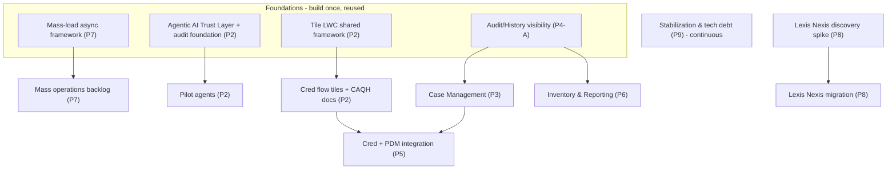

# High-Level Estimation (ROM): 2027 PIE (Salesforce) Priorities

> ⚠️ **SUPERSEDED (v1) — this pass reused FY2025 calibration anchors that were materially under-estimated.** A grounded, feature-by-feature re-estimation (audit → high-level TDD → estimate, in developer-days) lives in **`requirements/2027_ROM_TDD/`** — start with `00_ROM_TDD_Summary.md`. The grounded totals are ~1.6–2.7× higher on the big-ticket items. Keep this doc only for the story-point format/continuity.

**Document Version:** 1.0
**Date:** July 29, 2026
**Prepared for:** IBX Provider Data / Credentialing Product & Engineering Leadership
**Scope:** Rough-Order-of-Magnitude (ROM) effort estimation for the nine high-level 2027 priorities for the Provider Information Exchange (PIE) Salesforce platform.

---

## 1. Introduction

This document provides a **high-level, ROM effort estimation** for the nine 2027 priorities. It follows the same format the business accepted for the FY2025 ROM (*"High-Level Estimation: FHNatic, POMS, and Mass Grid Replacement in PIE"*, v1.0, Oct 8 2025): estimates are given in **story points** expressed as a **Low / High range**, one table per priority, with a grand-total summary.

Story points are an **abstract measure of effort and complexity, not a direct measure of time.** They will be refined during backlog grooming and sprint planning as requirements are detailed and technical discovery completes.

### 1.1 How to read this estimate

Each priority is presented with:

- **A points table** — Low / High story points, broken into workstreams where useful, with a sub-total.
- **A time lens (secondary)** — an indicative developer-day translation, both baseline and AI-assisted. See §1.3.
- **T-shirt size** — S / M / L / XL / XXL for quick relative scale.
- **Assumptions, dependencies, top risks, confidence (H/M/L), and a suggested quarter.**
- **Grounding** — links to the existing PIE design/estimation docs the numbers are anchored to, so nothing is invented.

### 1.2 Calibration (consistency with the FY2025 ROM)

To keep this ROM on the **same scale** business already accepted, the following FY2025 anchors are reused:

| FY2025 anchor | Points | Used here as the yardstick for |
|---|---|---|
| Expose one existing internal form to the portal (FHNatic, per form) | 8–13 | Portal form exposure / attestation enhancements |
| New bulk-submission workflow + supporting framework (POMS Replacement) | 80–120 | New multi-record submission workflows + frameworks |
| One distinct mass operation type (Mass Grid, per operation) | 13 | Each net-new mass data operation |
| FY2025 Grand Total (3 initiatives) | 242–302 | Order-of-magnitude sanity check |

### 1.3 Points → time bridge (ROM grain only)

At this coarse ROM grain, we use **~1 story point ≈ 1 baseline developer-day**. This is intentionally rougher than sprint-level pointing (where teams often point at ~1 SP = 0.5 day); it is only for order-of-magnitude planning.

Per the repo's AI-assisted estimation model (`Provider_Data_Versioning_Estimation.md`, `PRM_HighVolume_Processing_SK_Estimation.md`), a **senior team + Cursor AI runs at ~2× blended** on build-heavy work, but **testing, UAT, OmniStudio publishing, and business decisions do not compress.** So:

- **Baseline dev-days ≈ point value.**
- **AI-assisted dev-days ≈ 55–65% of the point value** (build accelerates; test/UAT does not).

> All day/week figures are **effort**, not calendar time. Calendar time depends on team size and parallelization (see §12).

---

## 2. Priority 1 — Streamline & Enhance Provider Data Management (Ancillary & Professional; PEAR Portal)

**Intent:** Enhance workflow so PDM teams maintain provider records more efficiently, with less manual processing and rework; add Ancillary & Professional enhancements to the PEAR external provider portal.

| Workstream | Low (pts) | High (pts) | Notes |
|---|---:|---:|---|
| PEAR portal enhancements — Ancillary & Professional (expose/extend attestation & maintenance surfaces, new fields, validations) | 30 | 55 | Builds on the existing `AttestationFlow` OmniScript family; FHNatic-style external exposure yardstick (8–13/form). |
| PDM workflow efficiency (reduce manual steps/rework — inline edits, guided maintenance, error prevention) | 20 | 35 | Targets the rework hot-spots in the PDM manual-update flows. |
| Data-quality guardrails (duplicate/address/error handling in PDM flows) | 5 | 10 | Extends known PDM address/error fixes. |
| **Sub-Total** | **55** | **100** | |

- **Time lens:** ~55–100 baseline dev-days (~30–60 AI-assisted). **T-shirt: L.**
- **Assumptions:** PEAR portal (`ProviderIE` Experience Cloud site) and `AttestationFlow` remain the delivery surface; enhancements, not a portal rebuild.
- **Dependencies:** Field History Tracking gaps from the PEAR audit; PDM flow stability (overlaps Priority 9).
- **Top risks:** Community-license security/FLS scope creep; OmniStudio publish friction (not AI-compressible).
- **Confidence:** Medium. **Suggested quarter:** Q1–Q2 2027.
- **Grounding:** [PEAR_Portal_Field_Audit_Report.md](requirements/PEAR/PEAR_Portal_Field_Audit_Report.md), [PEAR_WebsiteReadOnly_BugFix.md](requirements/PEAR/PEAR_WebsiteReadOnly_BugFix.md), [PDM Flows](requirements/PDM%20Flows), [PDM_Address_Error_Analysis.md](requirements/PDM%20Flows/PDM_Address_Error_Analysis.md); FY2025 FHNatic anchor.

---

## 3. Priority 2 — Credentialing Enhancements (Tile Redesign, CAQH Documents, Agentic AI)

**Intent:** Continue enhancing credentialing workflows for visibility, consistency, and compliance — via the tile-based flow redesign, pulling documents from CAQH, and Agentic AI capabilities.

| Workstream | Low (pts) | High (pts) | Notes |
|---|---:|---:|---|
| Tile-based LWC redesign of credentialing flows | 110 | 150 | Grounded at ~122 AI-assisted dev-days across 5 flows / 61 tiles + shared framework. |
| CAQH document retrieval & compare surface | 25 | 45 | Pull/attach CAQH documents; side-by-side compare in-flow. |
| Agentic AI — foundation + first pilot agents | 60 | 120 | Phase 0 platform (~6 wks) + 1–2 Tier-1 agents (PSV Copilot, Bulk Validation) in pilot/shadow. |
| **Sub-Total** | **195** | **315** | |

- **Time lens:** ~195–315 baseline dev-days (~110–190 AI-assisted). **T-shirt: XXL.**
- **Assumptions:** Tile redesign is the ratified direction (replaces adding edit capability to legacy OmniScripts); Agentic AI in 2027 = foundation + pilots, not fleet-wide autonomy.
- **Dependencies:** Agentic AI requires the Trust Layer + `PRM_AgentDecision__c` audit foundation before any decision-influencing agent; tile redesign shares the LWC framework built once and reused across flows.
- **Top risks:** Agentic AI shadow-mode gates (60-day minimum) extend calendar time; CAQH integration/testing needs live access (not AI-compressible); OmniStudio → LWC parity/cutover risk.
- **Confidence:** Medium (tile redesign High; Agentic AI Low–Medium). **Suggested quarter:** Q1–Q4 2027 (largest, phased program).
- **Grounding:** [MASTER_Development_Plan_Credentialing_LWC_Redesign.md](requirements/ReDesignCredFlows/MASTER_Development_Plan_Credentialing_LWC_Redesign.md), [PRM_CredFlows_EditCapability_Estimation.md](requirements/PRM_CredFlows_EditCapability_Estimation.md), [AgenticAI/00_Strategy_AgenticAI_for_Credentialing_PDM.md](requirements/AgenticAI/00_Strategy_AgenticAI_for_Credentialing_PDM.md), [AgenticAI/03_Roadmap_Sequencing.md](requirements/AgenticAI/03_Roadmap_Sequencing.md), [CAQH_Roster_Submission_Guide.md](requirements/CAQH_Roster_Submission_Guide.md), [CRED-7_CAQH_Compare_Surface.md](requirements/ReDesignCredFlows/UserStories/CRED-7_CAQH_Compare_Surface.md).

---

## 4. Priority 3 — Enhanced Case Management (Work Routing, Issue Tracking, Workflow Visibility)

**Intent:** Expand case management to improve work routing, issue tracking, and workflow visibility.

| Workstream | Low (pts) | High (pts) | Notes |
|---|---:|---:|---|
| Work routing rules & assignment (queues, ownership, QC routing) | 15 | 25 | Extends existing Case Manager routing / owner-change patterns. |
| Issue tracking & duplicate/QC hygiene | 10 | 20 | Grounded in duplicate-QC root-cause work. |
| Workflow visibility (stage tracking, worklists, status surfacing) | 15 | 25 | Mostly config + light LWC on `IndividualApplication` lifecycle. |
| **Sub-Total** | **40** | **70** | |

- **Time lens:** ~40–70 baseline dev-days (~25–45 AI-assisted). **T-shirt: M.**
- **Assumptions:** Built on the existing Case Manager (`IndividualApplication`) model and `PRM_Stage__c` lifecycle; largely declarative + light custom UI.
- **Dependencies:** Reporting overlaps Priority 6; some routing depends on PNC/PDA data-model fields.
- **Top risks:** Routing rule sprawl; overlap/double-counting with Priorities 5 and 6.
- **Confidence:** Medium. **Suggested quarter:** Q2 2027.
- **Grounding:** [Duplicate_QC_Cases_RootCause_Analysis.md](requirements/Duplicate_QC_Cases_RootCause_Analysis.md), [Permission_Set_Case_Manager_Owner_Change.md](requirements/Permission_Set_Case_Manager_Owner_Change.md), [PNC_Reports_Dashboard_UserStory.md](requirements/PNC_Reports_Dashboard_UserStory.md).

---

## 5. Priority 4 — Versioning: Record Change History & Audit Visibility

**Intent:** Comprehensive visibility into provider record changes, user actions, and historical activity.

This priority has **two very different scope options**. The ROM presents both; the recommended 2027 scope is Option A unless leadership commits to full effective-dated versioning.

| Scope option | Low (pts) | High (pts) | Notes |
|---|---:|---:|---|
| **Option A (recommended) — Audit & History Visibility** | 40 | 80 | Field History Tracking coverage + unified change-history LWC + audit/reporting views. Reuses the Case Manager unified-history work. |
| **Option B (alternative) — Full effective-dated versioning** | 220 | 270 | Full versioning across all provider objects; **HIGH risk**; large regression surface (501 Apex, 417 IPs, 1,338 DRs, 57 OS). |
| **Sub-Total (Option A used in Grand Total)** | **40** | **80** | Option B tracked separately in §11. |

- **Time lens (Option A):** ~40–80 baseline dev-days (~25–50 AI-assisted). **T-shirt: M–L** (Option B: **XXL**).
- **Assumptions:** "Visibility into changes/user actions/history" is satisfied by audit + history surfacing (Option A). Option B is a platform re-architecture, not a visibility feature.
- **Dependencies:** Option B requires refactoring the existing `PRM_FutureDatedProcessing__c` system first; must precede several other flows if chosen.
- **Top risks:** Scope confusion between "audit visibility" (A) and "true versioning" (B) — the single most important clarification for this priority; FHT 20-field-per-object limits.
- **Confidence:** Medium (A) / Low (B — HIGH risk, wide range). **Suggested quarter:** Q1–Q2 2027 (A).
- **Grounding:** [Provider_Data_Versioning_Estimation.md](requirements/Provider_Data_Versioning_Estimation.md) (44–54 AI-assisted dev-weeks for full versioning), [PRM_CaseManagerUnifiedHistoryLWC_UserStory.md](requirements/Enhancements/PRM_CaseManagerUnifiedHistoryLWC_UserStory.md), [2026-05-29_CaseManagerFieldHistory.md](requirements/SOQL/2026-05-29_CaseManagerFieldHistory.md).

---

## 6. Priority 5 — Credentialing & PDM Integration Enhancements

**Intent:** Seamless integration between Credentialing and PDM teams to increase collaboration.

| Workstream | Low (pts) | High (pts) | Notes |
|---|---:|---:|---|
| Cred → PDM handoff / direct-push automation | 20 | 40 | Extends the ReCred PSV → RCAT direct-push pattern. |
| Shared views & cross-team context (case linkage, status sharing) | 15 | 30 | Cross-team worklists / linked records. |
| Routing & data-model alignment between teams | 5 | 10 | PNC/RCAT routing glue. |
| **Sub-Total** | **40** | **80** | |

- **Time lens:** ~40–80 baseline dev-days (~25–50 AI-assisted). **T-shirt: M–L.**
- **Assumptions:** Integration is within PIE (both teams on the same platform); leverages existing RCAT/PNC routing.
- **Dependencies:** Overlaps Priority 3 (case management) and Priority 2 (cred flows); sequence after cred flow direction is set.
- **Top risks:** Cross-team process definition (business decision, not AI-compressible); double-counting with Priorities 2/3.
- **Confidence:** Medium. **Suggested quarter:** Q2–Q3 2027.
- **Grounding:** [ReCred_PSV_to_RCAT_DirectPush_Guide.md](requirements/ReCred_PSV_to_RCAT_DirectPush_Guide.md), [RCAT_RecredUpdates_PNC_LocationRepoint_UserStory.md](requirements/RCAT_RecredUpdates_PNC_LocationRepoint_UserStory.md), [PRM_PNC_Analysis.md](requirements/PRM_PNC_Analysis.md).

---

## 7. Priority 6 — Inventory Management & Reporting Enhancements

**Intent:** Enhanced reporting and inventory (work) management for actionable operational insight.

| Workstream | Low (pts) | High (pts) | Notes |
|---|---:|---:|---|
| Reporting & dashboards (OOTB Lightning report types + dashboards) | 10 | 20 | Much is OOTB config (no code) per the PNC reporting story. |
| Work-inventory views & queues (worklists, aging, backlog surfacing) | 15 | 30 | Light LWC/config on the Case Manager model. |
| Integrity/operational report automation (from Salesforce, replacing manual feeds) | 5 | 10 | Grounded in the Integrity Reporting mapping work. |
| **Sub-Total** | **30** | **60** | |

- **Time lens:** ~30–60 baseline dev-days (~20–40 AI-assisted). **T-shirt: M.**
- **Assumptions:** A meaningful share is OOTB reports/dashboards; net-new custom report types where needed.
- **Dependencies:** Some reports depend on fields from Priorities 3/5; Integrity report depends on field-history mapping.
- **Top risks:** Report-type/data-model gaps; large-volume report performance.
- **Confidence:** Medium-High (reporting portion is low-risk OOTB). **Suggested quarter:** Q2–Q3 2027.
- **Grounding:** [IntegrityReporting_InitialCredReview_BusinessOverview.md](requirements/Reporting/IntegrityReporting_InitialCredReview_BusinessOverview.md), [IntegrityReporting_InitialCredReview_Mapping.md](requirements/Reporting/IntegrityReporting_InitialCredReview_Mapping.md), [PNC_Reports_Dashboard_UserStory.md](requirements/PNC_Reports_Dashboard_UserStory.md).

---

## 8. Priority 7 — Continued Work on Mass Data Loads

**Intent:** Enhance the capability to load large volumes of data from large health systems without manual entry.

Estimated on the FY2025 **Mass Grid** per-operation baseline (~13 pts/operation) plus the shared high-volume async framework.

| Workstream | Low (pts) | High (pts) | Notes |
|---|---:|---:|---|
| Shared high-volume async framework (async job, staging, rollback, status UX) | 25 | 45 | Grounds the whole program; ~18–36 AI-assisted dev-days in the SK estimation. |
| Mass operations (per-operation @ ~13 pts) — target backlog ~5–8 net-new types | 55 | 90 | e.g. mass address update (full-stack precedent exists), network/taxonomy/owner mass ops. |
| Bulk practitioner/health-system ingest (large-system CSV/roster load) | 10 | 15 | Extends bulk practitioner creation work. |
| **Sub-Total** | **90** | **150** | |

- **Time lens:** ~90–150 baseline dev-days (~50–90 AI-assisted). **T-shirt: XL.**
- **Assumptions:** The org is OmniStudio-first with ~621 focused Apex classes; the aspirational `PRM_BaseService` framework does **not** exist — mass loads use a pragmatic orchestrator + existing batch primitives.
- **Dependencies:** Reuses `PRM_CaseManagerAssociation__c`, existing stateful batches, `PRM_ExceptionLogger`, `prmEnhancedDatatable`; final scope depends on the prioritized list of mass operations (as in FY2025).
- **Top risks:** Governor limits at volume; QC-after-the-fact routing model; scope scales directly with number of operations.
- **Confidence:** Medium. **Suggested quarter:** Q1–Q3 2027 (framework first).
- **Grounding:** [PRM_HighVolume_Processing_SK_Estimation.md](requirements/PRM_HighVolume_Processing_SK_Estimation.md), [PNM_MassAddressUpdate_FullStack_Architecture.md](requirements/Enhancements/PNM_MassAddressUpdate_FullStack_Architecture.md), [PractitionerCreationPerformance](requirements/PractitionerCreationPerformance); FY2025 Mass Grid anchor (13 pts/op).

---

## 9. Priority 8 — Lexis Nexis Migration (Bizagi → PIE) + Compliance Mandates (CBSA / Regulatory)

**Intent:** Migrate Lexis Nexis functionality/workflows from Bizagi into PIE; deliver required updates to remain compliant with governing bodies (e.g. CBSA and other mandates).

> **Low confidence.** There is **no existing PIE design doc** for the Lexis Nexis / Bizagi workflows. The range below is deliberately wide and **assumes a discovery spike first.** Compliance mandates are, by nature, reactive and are sized as a capacity envelope.

| Workstream | Low (pts) | High (pts) | Notes |
|---|---:|---:|---|
| Discovery spike — Lexis Nexis / Bizagi workflow reverse-engineering | 8 | 13 | **Prerequisite.** Firm up scope before committing the rest. |
| Lexis Nexis workflow migration into PIE (rebuild flows + integration) | 30 | 85 | Wide range pending discovery; treat as POMS-class if it includes a new workflow + framework. |
| Compliance mandates (CBSA + other regulatory updates) — annual envelope | 30 | 80 | Reactive; sized as capacity, not fixed scope. |
| **Sub-Total** | **68** | **178** | |

- **Time lens:** ~68–178 baseline dev-days (~40–110 AI-assisted). **T-shirt: L–XL (uncertain).**
- **Assumptions:** Lexis Nexis is a vendor screening/verification workflow (sanctions/identity/adverse-action adjacent); compliance work is unscheduled and must reserve capacity.
- **Dependencies:** Vendor integration contracts/credentials; regulatory timelines are externally driven (hard deadlines).
- **Top risks:** **Highest-uncertainty item in this ROM.** Bizagi behavior is undocumented in-repo; regulatory scope can arrive mid-year with fixed dates.
- **Confidence:** **Low.** **Suggested quarter:** Discovery Q1 2027; migration Q2–Q3; compliance ongoing.
- **Grounding:** No direct PIE doc — adjacent only: [NPDB_T180](requirements/NPDB_T180), [vendor](requirements/vendor) (sanctions / adverse-action verification). **Discovery spike required.**

---

## 10. Priority 9 — System Stabilization & Technical Debt

**Intent:** Address outstanding defects, performance concerns, and system issues to improve reliability and reduce operational risk.

Sized as a **recurring capacity envelope**, not a discrete scope — reserve a fixed slice of team capacity each quarter for defects, performance, and stabilization.

| Workstream | Low (pts) | High (pts) | Notes |
|---|---:|---:|---|
| Defect burn-down (outstanding bugs) | 25 | 40 | Continuous; sized from the active bug-fix backlog. |
| Performance hardening (PAR/Practitioner-creation batch & flow perf) | 20 | 35 | Grounded in the PAR/Practitioner performance workstreams. |
| Platform hygiene (trigger idempotency, exception logging, cleanup) | 15 | 25 | Reliability/observability improvements. |
| **Sub-Total (annual envelope)** | **60** | **100** | ≈ 15–20% of annual delivery capacity. |

- **Time lens:** ~60–100 baseline dev-days/year (~40–65 AI-assisted). **T-shirt: L (recurring).**
- **Assumptions:** Treated as a protected capacity reservation; not front-loaded.
- **Dependencies:** Competes with feature work — needs an explicit leadership allocation.
- **Top risks:** Under-funding stabilization inflates every other priority's risk (unstable base).
- **Confidence:** Medium (envelope, not scope). **Suggested quarter:** Continuous, Q1–Q4 2027.
- **Grounding:** [PARFormPerformance](requirements/PARFormPerformance), [PractitionerCreationPerformance](requirements/PractitionerCreationPerformance), various bug-fix/defect docs in `requirements/`.

---

## 11. Grand Total Estimation Summary

Combining all nine priorities (using **Option A** for Priority 4 versioning — audit/history visibility):

| # | Priority | Low (pts) | High (pts) | Confidence |
|---|---|---:|---:|:--:|
| 1 | Streamline PDM & PEAR (Ancillary & Professional) | 55 | 100 | M |
| 2 | Credentialing Enhancements (Tile, CAQH, Agentic AI) | 195 | 315 | M |
| 3 | Enhanced Case Management | 40 | 70 | M |
| 4 | Versioning — Audit & History Visibility (Option A) | 40 | 80 | M |
| 5 | Credentialing & PDM Integration | 40 | 80 | M |
| 6 | Inventory Management & Reporting | 30 | 60 | M-H |
| 7 | Continued Mass Data Loads | 90 | 150 | M |
| 8 | Lexis Nexis (Bizagi→PIE) + Compliance | 68 | 178 | **L** |
| 9 | System Stabilization & Technical Debt | 60 | 100 | M |
| | **Grand Total** | **618** | **1,133** | |

**Time lens for the total:** ≈ **618–1,133 baseline developer-days** (≈ **340–680 AI-assisted developer-days**). At a **4-developer** effective build capacity this is roughly a **full 2027 program year** (see §12 for calendar caveats).

> **Alternative — full effective-dated versioning (Priority 4, Option B):** replaces the 40–80 pt Option A line with **220–270 pts**, raising the Grand Total to **≈ 798–1,323 pts**. Only include if leadership commits to the platform-level versioning re-architecture (HIGH risk).

### 11.1 Scale check vs FY2025

FY2025 ROM covered 3 initiatives at **242–302 pts**. This 2027 ROM covers **9 priorities at ~618–1,133 pts** — a broader, full-year program, consistent in per-initiative grain with the accepted FY2025 scale (POMS-class ≈ 80–120, mass op ≈ 13, form exposure ≈ 8–13).

---

## 12. Suggested Sequencing & Dependencies

**Sequencing notes:**

- **Build shared frameworks first** — the mass-load async framework (P7), the tile LWC framework and Agentic AI foundation (P2) are reused downstream; funding them early lowers the cost of everything after.
- **P4 Option A (audit/history) is a useful early enabler** for P3 (case management) and P6 (reporting).
- **P8 Lexis Nexis needs a discovery spike in Q1** before its migration number can be trusted; compliance capacity must be reserved for mid-year regulatory arrivals.
- **P9 stabilization runs continuously** — protect ~15–20% capacity so the base stays stable under feature load.
- **Watch for double-counting** across P2/P3/P5 (credentialing, case management, integration overlap) and P3/P6 (worklists vs reporting); refine in grooming.

---

## 13. Assumptions & Disclaimer

**Key assumptions:**

1. Estimates are **story points** (abstract effort/complexity), given as Low/High ranges; **not** a commitment of time or cost.
2. Time-lens figures assume a **senior team + Cursor AI at ~2× blended** on build-heavy work; **testing, UAT, OmniStudio publishing, and business decisions do not compress.**
3. Points ≈ baseline dev-days is a **ROM-grain bridge only** (§1.3), coarser than sprint pointing.
4. Priority 4 Grand Total uses **Option A** (audit/history visibility). Full versioning (Option B) is tracked separately.
5. Priority 8 (Lexis Nexis) and compliance are **Low confidence** pending a discovery spike; compliance is a reserved capacity envelope.
6. Priority 9 is a **capacity reservation**, not fixed scope.
7. No new external framework is assumed to exist (`PRM_BaseService` et al. are aspirational and **not** in the codebase); designs reuse the concrete OmniStudio-first + focused-Apex primitives that ship today.

**Disclaimer.** These are high-level, preliminary ROM estimates based on information currently available and grounded in existing PIE design/estimation docs (linked per priority). Story point estimates will be refined during backlog grooming and sprint planning as requirements are detailed and technical discovery — especially the **Lexis Nexis/Bizagi discovery spike** and the **Priority 4 scope decision (Option A vs B)** — completes. Scope for Mass Data Loads (Priority 7) scales with the prioritized list of operations, exactly as in the FY2025 Mass Grid estimate.

---

*References (repo docs the numbers are anchored to):*
- *FY2025 ROM template — "High-Level Estimation: FHNatic, POMS, and Mass Grid Replacement in PIE" (Google Doc, Oct 8 2025)*
- *`requirements/PRM_HighVolume_Processing_SK_Estimation.md`*
- *`requirements/Provider_Data_Versioning_Estimation.md`*
- *`requirements/PRM_CredFlows_EditCapability_Estimation.md`*
- *`requirements/ReDesignCredFlows/MASTER_Development_Plan_Credentialing_LWC_Redesign.md`*
- *`requirements/AgenticAI/00_Strategy_AgenticAI_for_Credentialing_PDM.md`, `.../03_Roadmap_Sequencing.md`*
- *`requirements/Enhancements/PNM_MassAddressUpdate_FullStack_Architecture.md`*
- *`requirements/PEAR/PEAR_Portal_Field_Audit_Report.md`*
- *`requirements/Reporting/IntegrityReporting_InitialCredReview_BusinessOverview.md`*
- *`requirements/PNC_Reports_Dashboard_UserStory.md`*
