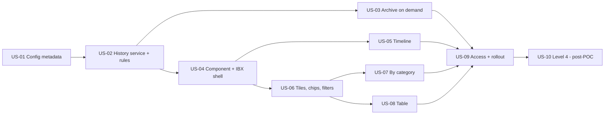

# Epic: Practice Location Change History

**Vertical:** Provider Network Management (PNM)
**Personas:** PDM Specialist (primary) · Network Management QC Specialist (secondary)
**Priority:** P1 (US-01 to US-09) · P2 post-POC (US-10)
**Status:** POC built and deployed in IBX QA (v0.4, 2026-09-24). Stories are written as the production spec; each is marked with its build status and remaining gaps.

**Problem:** The Practice Location History tab shows field changes on the location record only. The business can't tell whether a practitioner was added or removed, or whether a network or taxonomy was added or removed, or see any change to the records beneath the location.

**Outcome:** One Change History panel on the Practice Location page shows every change to the location and its associations in plain English, with who, when, effective dates, Case Manager and FHNatic case. It offers Timeline, By category and Table views, IBX styling, and archived history on demand.

**Source documents**
- [Design prompt](../PracticeLocation_ChangeHistory_LWC_DesignPrompt.md): problem, scope, decisions D1–D4, open questions
- [POC change log](../PracticeLocation_ChangeHistory_POC_ChangeLog.md): every component built, release history 0.1–0.4, verification, follow-ups F1–F11
- [Grounding SOQL](../SOQL/2026-09-24_PracticeLocationChangeHistory.md)
- IBX brand tokens: [`requirements/assets/brand-tokens.css`](../assets/brand-tokens.css)

---

## Stories

| # | Story | Persona | Priority | Build status | Effort (AI-estimated) | Depends on |
|---|-------|---------|----------|--------------|-----------------------|------------|
| US-01 | [Configurable history categories and integration-user list](US-01_HistoryConfigurationMetadata_UserStory.md) | PDM Specialist | P1 | ✅ Built (0.1) | M–L | — |
| US-02 | [History service and change rules](US-02_HistoryServiceAndChangeRules_UserStory.md) | PDM Specialist | P1 | ✅ Built (0.4) · gap: error-log context | XXL | US-01 |
| US-03 | [Load older (archived) changes on demand](US-03_ArchivedHistoryOnDemand_UserStory.md) | PDM Specialist | P1 | ✅ Built (0.2) · gap: retention policies | L–XL | US-02 |
| US-04 | [Change History component on the Practice Location page (IBX shell)](US-04_RecordPageComponentAndIBXHeader_UserStory.md) | PDM Specialist | P1 | ✅ Built (0.4) · gap: visual sign-off | XL | US-02 |
| US-05 | [Timeline view: who, when and what changed](US-05_TimelineView_UserStory.md) | PDM Specialist | P1 | ✅ Built (0.4) | XL | US-04 |
| US-06 | [Summary tiles, category chips and filters](US-06_SummaryTilesCategoryChipsAndFilters_UserStory.md) | Network Management QC Specialist | P1 | ✅ Built (0.4) | XL | US-04 |
| US-07 | [By category view](US-07_ByCategoryView_UserStory.md) | Network Management QC Specialist | P1 | ✅ Built (0.4) | L–XL | US-04, US-06 |
| US-08 | [Table view](US-08_TableView_UserStory.md) | Network Management QC Specialist | P1 | ✅ Built (0.4) | M–L | US-04, US-06 |
| US-09 | [Access, page placement and rollout](US-09_AccessAndRollout_UserStory.md) | PDM Specialist | P1 | ⏳ Not done | L | US-01 to US-08 |
| US-10 | [Practitioner-level network and taxonomy changes (Level 4)](US-10_Level4PractitionerNetworkTaxonomyHistory_UserStory.md) | Network Management QC Specialist | P2 | ⏸ Deferred (D1) | L–XL | US-01, US-02, US-09 |

**Total (AI-estimated, validate with team):** about 15–16 engineer-days for US-01 to US-09, plus about 1.5 days for US-10.

---

## Dependency order

---

## Business decisions carried into the stories

| # | Decision | Stories |
|---|----------|---------|
| D1 | Level 4 deferred until after the POC | US-01 (inactive row), US-10 |
| D2 | Field Audit Trail is licensed; read the archive on demand | US-03 |
| D3 | Removals are mostly end-dated; hard deletes are a disclosed limitation | US-02, US-04 (footnote) |
| D4 | Show integration users, badged and filterable | US-01, US-02, US-05, US-06 |
| 0.3 | Export CSV removed | US-04, US-08 |
| 0.4 feedback 1 | Show clearly who made each change and when | US-02, US-05, US-07, US-08 |
| 0.4 feedback 2 | Show the record's effective-from date | US-02, US-05, US-07, US-08 |
| 0.4 feedback 3 | Show the FHNatic case number from the Case Manager | US-02, US-05, US-07, US-08, US-09 |
| 0.4 feedback 4 | Show changes by category | US-06, US-07 |
| 0.4 UX | More lively UI, IBX styles | US-04, US-05, US-07 |

---

## Open items across the epic

| # | Item | Story | Owner |
|---|------|-------|-------|
| 1 | Grant controller class access and FHNatic field read in the business permission sets | US-09 | Salesforce Admin |
| 2 | Which roles may see FHNatic case numbers | US-09 | Compliance / Product |
| 3 | Error-log context: pass the Practice Location Id as Correlation ID and move context to Request Payload | US-02 AC-13 | Technical |
| 4 | Exclude noisy system fields (Count of Active Practitioners, Source System Identifier)? | US-01, US-02 | Product |
| 5 | Field Audit Trail retention policy per object | US-03 | Salesforce Admin |
| 6 | Replace or sit beside the standard History list and NPI FlexCard | US-04, US-09 | Product |
| 7 | Business visual review of the 0.4 redesign | US-04, US-05, US-07 | Product / UX |
| 8 | Confirm the integration-user list (incl. DFX/batch jobs that run as a person) | US-01 | Ops |

---

## Validation (User Story Solution Architect, STEP 5)

| Check | Result |
|---|---|
| Concrete persona in every "As a…" (PDM Specialist / Network Management QC Specialist) | ✅ all 10 |
| Behavioural ACs in Given / When / Then with no API, class or SOQL names | ✅ checked automatically across all stories |
| Pattern B for metadata (US-01), Pattern C for access (US-09), Pattern D for change rules (US-02 AC-2), Pattern E for the one record write (US-02 AC-13, exception log) | ✅ |
| Technical Implementation after the ACs in every story | ✅ |
| Definition of done, Clarification Questions and Estimated Effort in every story | ✅ |
| Components referenced exist (built and deployed in QA; see change log §3) | ✅ |
| Overlap with existing `requirements/` stories | None found |
