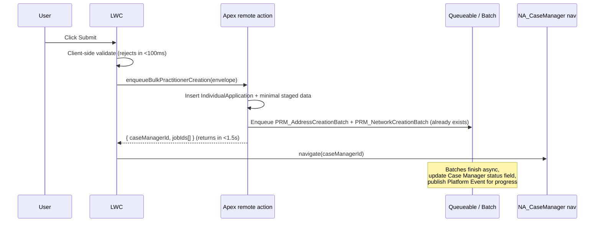

# Bulk Delegated Practitioner Creation — Design & LWC Mockup

> Companion HTML mockup: `mockups/BulkPractitionerCreation_Mockup.html` (open in a browser).

---

## 1. Why we are here

Business needs to onboard a single delegated practitioner across **50+ practice locations**, each with its own taxonomies, networks, info-codes, billing types, and assistive aids.

The current guided experience is built on three OmniScripts:

| OmniScript | Latest version | What it does |
|---|---|---|
| `PRM_PractitionerCreation` | `_English_23` | Master flow — NPI/Tax ID lookup, Practitioner, Group, Practitioner-Group, Provider Info, Networks/Roles, Review, Submit |
| `PRM_DelegatedPractitionerAddressForm` | `_English_9` | Embedded — primary office + N additional offices (one-by-one) |
| `PRM_DelegatedPractitionerReviewScreen` | `_English_5` | Embedded — read-only review |

OmniScripts re-render the **entire DOM tree** on every keystroke. The address form alone has **111 elements** and renders nested blocks per location. With 15 locations today the submit takes ~10s; at 50 locations the form itself becomes unusable (DOM thrash, JSON ballooning past the 1 MB OS data-JSON soft limit, browser tab freezes).

> **Verdict — OmniStudio is the wrong tool above ~15 locations.** A custom LWC is the right answer, but it has to be built around a few non-obvious patterns (virtualized grid, bulk-apply, paste-from-Excel, async submit). The rest of this document walks the OmniScript step by step, lists every field, and proposes the LWC architecture + mockup.

---

## 2. Step-by-step walkthrough of the existing OmniScript

Source: `force-app/main/default/omniScripts/PRM_PractitionerCreation_English_23.os-meta.xml` (8,934 lines, 222 elements).

The master OmniScript has **9 user-facing Steps + 3 embedded OmniScripts** plus ~36 server/util actions (DataRaptors, IPs, Set Values, Set Errors, Navigate). User-visible sequence:

```mermaid
flowchart LR
  A[1\. PractitionerCreationScreen<br/>Form type + Effective dates] --> B[2\. Practitioner<br/>NPI + demographics + license/edu/cert]
  B --> C[3\. Group<br/>Group Tax ID/NPI search]
  C --> D[4\. PractionerGroup<br/>Pick groups + practice locations]
  D --> E[Embedded: DelegatedPractitionerAddressForm<br/>Primary + N additional offices]
  E --> F[5\. ProviderInformation<br/>Race/Ethnicity/Cultural ID]
  F --> G[6\. ProviderInformationAffirmingCategory]
  G --> H[7\. ProviderInformationLanguageSpoken]
  H --> I[8\. ProviderInformationPersonalPronouns]
  I --> J[9\. AssignRolesAndNetworks<br/>Role + Network per Location×Taxonomy]
  J --> K[Embedded: FileUploadOS]
  K --> L[10\. ReviewSubmit + DelegatedPractitionerReviewScreen]
  L --> M[Submit → IP_RecordCreation → ExecuteAddressLogic<br/>→ NA_CaseManager]
```



### Step 1 — `PractitionerCreationScreen`
| Field | Type | Notes |
|---|---|---|
| `PractitionerCreation` | Radio | Form type: Delegated / Professional Staff / etc. |
| `PractitionerEffFromDate` | Date | Effective from |
| `PractitionerEffToDate` | Date | Effective to |
| `FormulaEffToBeforeEffeFrom` | Formula | Validates date range |

### Step 2 — `Practitioner` (65 elements)
| Group | Fields |
|---|---|
| **NPI + identity** | `PractitionerIndividualNPI`, `PractitionerFormType`, `PractitionerType` (type-ahead) |
| **Demographics** | `PractitionerFirstName`, `PractitionerMiddleName`, `PractitionerLastName`, `PractitionerSuffix`, `PractitionerDOB`, `PractitionerEmail`, `PractitionerGender(Kyruus / NonKyruus)`, `PractitionerCorpReceiptDate`, `PractitionerRequestBy`, `PractitionerFHNaticCaseNumber`, `MedicareNumber` |
| **Specialty / Role** | `PractitionerPrimarySpecialty` (type-ahead → IP `PRMIPGetSpecialtyData`), `AdditionalSpeciality` (LWC `prmAdditionalSpecialty`), `ProviderRole`, `TaxonomyCode`, `TaxonomySection` |
| **Info Codes (per practitioner)** | `PractitionerInfoCodes` (LWC), `DefaultInfoCode`, `IBCIdentifier` |
| **Edit blocks** | `AddBoardCertificationBlock` (Board cert name / expires / original / recert / type), `AddDEACDSBlock` (License #, state, type), `AddLicenseBlock` (License #, state, issued/expiration date), `AddEducation` (Degree, institution, start/end, completed flag, primary flag) |
| **IBC look-ups** | `IBCPractitionerFirstName / LastName / Specialty` (type-ahead with IP-driven autocomplete) |
| **Validation/Custom LWC** | `CustomLWC1` (form-state controller), `ExistingNPIAssociatedPractitioner`, `ExistingNPICredentialed` |

### Step 3 — `Group` (17 elements)
| Field | Type | Notes |
|---|---|---|
| `PracticeLocationName` (type-ahead → DR `GetActivePracticeLocation`) | Type Ahead Block | Returns `AddressLine1/2`, `City`, `State`, `Zip`, `Zip4`, `Phone`, `PhoneExtension`, `Fax`, `AddressType` |
| `FormulaGroupSpecialtyValdiation` | Formula | Validates group specialty completion |
| `Messaging1`, `Messaging5` | Validation | Inline error messages |

### Step 4 — `PractionerGroup` (20 elements, 2,929 lines of XML — the heaviest)
Houses the **GroupInformation block** which wires the practitioner to one or more existing groups:
- `GroupNPI`, `GroupTaxId` — Drives `GetUniqueGroupsForNPITaxId` remote action
- `GroupTypeAhead` — Picks a vendor account
- `PrimaryGroupSpecialty` — Type-ahead
- `prmTextElementOverrideForDelegatedCred` — **891-line LWC** that owns the multi-NPI lookup, group/location selection, and renders the "Add Practice Location" rows that fan out into the embedded address form.
- Formulas: `AccountSelected`, `ExistingGroupNPIId`, `FormulaAdditionalLocationsSelected`, `FormulaExistingaccountselected`, `FormulaExistingGroupSelected`, `FormulaIsPrimaryPracticeSelected`, `pnc`, `SelectedAccountName`

### Embedded — `DelegatedPractitionerAddressForm` (111 elements)

This is the **per-location form** rendered for the primary office and every "Add another address" the user clicks. For 50 locations the OmniScript renders 50 × 111 ≈ **5,550 nested DOM elements** plus their conditional show/hide formulas.

#### 4a. Primary office block (`PrimaryOfficeAddressBlock`)
| Field | Type |
|---|---|
| `GroupNPI` (formula) / `ExistingGroupNPIId` | Formula |
| `existingAccountSelectedFrml`, `existingroupselected` | Formula |
| `PrimaryOfficeAddressNPI` | Text (per-location billing NPI) |
| `isNPIValidated`, `primaryNPIValid` | Checkbox / Formula |
| `PriAddressIdentifier`, `PrimaryPracticeName`, `DoingBusinessAsName` | Text/Formula |
| `PrimaryOfficeAddressLine1/2`, `PrimaryOfficeAddressCity`, `PrimaryOfficeAddressState`, `PrimaryOfficeZip`, `PrimaryOfficeZipFour` | Text/Select |
| `PrimaryOfficePhone`, `PrimaryPhoneExtension`, `PrimaryOfficeFax`, `PrimaryOfficeEmail` | Telephone/Text/Email |
| `BillingType` | Multi-select |
| `PrimaryPatientMinAge`, `PrimaryPatientMaxAge`, `PrimaryValidAge`, `PrimaryAgeErrorMsg` | Number / Formula |
| `PrimaryAddressTaxonomy`, `AddPrimaryAddressTaxonomy`, `PrimaryPrimaryAddressTaxonomy` | Text Block (placeholders for LWC injection) |
| `PrimaryAddressNetwork`, `PrimaryAddressNetworkReqMsg` | Text Block / Validation |
| `PrimaryAddressInfoCode`, `AddInfoCodesDelegatedPractitioner`, `PrimaryAddressInfoCodeReqMsg` | Text Block / Validation |
| `PrimaryAddressAssitiveAid` | Text Block (LWC inject) |
| `Messaging1`, `Npierror`, `RestrictUserFromMovingAheadMessage1` | Validation |

#### 4b. Additional addresses (`AdditionalAddressesBlock → AdditionalAddress` repeating)
**Same field set repeated for every additional location** — and this is where it explodes:
- `AdditionalAddressLine1/2`, `City`, `State`, `Zip`, `ZipPlusFour`
- `AdditionalAddressPhone`, `PhoneExtension`, `Fax`, `OfficeEmail`
- `AdditionalAddressNPI`, `additionalNPIValid`, `isAddtnlNPIValidated`
- `AdditionalGroup`, `GroupNPIAdditional`, `AdditionalAddressVendorType`
- `BillingTypeAdditional` (Multi-select)
- `AdditionalPatientMinAge`, `AdditionalPatientMaxAge`, `AdditionalValidAge`, `AddAddressAgeErrorMsg`
- `AddAddressTaxonomy`, `AddAddressNetwork`, `AddAddressInfoCode`, `AddAddressAssitiveAid` (Text Block placeholders)
- `AddAddressInfoCodeReqMsg`, `AddAddressNetworkReqMsg`, `AccessibilityCapabilityWarning`, `AdditionalRequired` (Validation)
- `AddAddressIdentifier`, `IsAdditionalTelehealth` (Formula)
- `AddButton` (Radio that triggers the next add)
- `CheckClosedNetworkLogicForAddAddress`, `AddInfoCodesAddonDelegatedPractitioner`, `AddNetworksAddonDelegatedPractitioner` (Text Block — LWC bridges)

#### 4c. Billing Address (`BillingAddressBlock`, single instance)
`BillingAddressSameasPrimary` (IP action), `BillingOfficeAddressLine1`, `BillingAddressLine2`, `BillingCity`, `BillingState`, `BillingZip`, `BillingZipfour`, `BillingPhone`, `BillingPhoneExtension`, `BillingFax`

#### 4d. Mailing Address (`MailingAddressBlock`, single instance)
`MailingAddressSameasPrimary` (IP action), `MailingAddressLine1`, `MailingOfficeAddressLine2`, `MailingOfficeCity`, `MailingState`, `MailingZip`, `MailingZipFour`, `MailingPhone`, `MailingeExtension`, `MailingFax`

#### 4e. Address validation step (`AddressValidation`)
`AddressComparisonLWC` (LWC `prmAddressComparisonParForm`), `Messaging2`, `PreciselySkipMessage`. Triggered by `IPPreciselyAPICall` + `DuplicateAddressCheck` IPs and `PRMDRAddrTransform / PRMDRPriAddrTransform` DataRaptors.

### Steps 5–8 — Provider Information (single-instance per practitioner)
| Step | Fields | Source LWC |
|---|---|---|
| `ProviderInformation` | `RacialIdentity`, `CulturalIdentity`, `HispanicOrigin`, `IdentifyasHispanic`, plus 3 Confirmation radios | LWCs `prmRacialIdentity`, `prmCulturalIdentity`, `prmHispanicOrigin` |
| `ProviderInformationAffirmingCategory` | `AffirmingCareCategory` (LWC), `AffirmingConfirmQuestion` | `prmAffirmingCareCategory` |
| `ProviderInformationLanguageSpoken` | `LanguageSpoken` (LWC), `LanguageConfirmQuestion`, `LanguageAnswerDT` | `prmLanguageSpoken` |
| `ProviderInformationPersonalPronouns` | `PersonalPronouns` (LWC), `PronounConfirmQuestion`, `PronounNotListed`, `PronounPreferNotToShare` | `prmPersonalPronouns` |

### Step 9 — `AssignRolesAndNetworks` (the second high-volume area)
Edit block `CareTaxxonomies` repeats per `(Practice Location × Taxonomy)` combination. For 50 locations × 3 taxonomies that's **150 rows**.

Per row:
- `PractitionerNameReadOnly` (read-only)
- `HealthcareFacilityName`, `HCFCity`, `HCFState`, `County` (read-only)
- `CareTaxonomyName` (read-only)
- `Role` (Multi-select — Treating / Admitting / Covering / etc.)
- `AddPractitionerNetworks` (Text Block — LWC inject for network multi-select)
- `SelectedPLNetworksTest`, `ValidateNetwork`, `NtwkErrorMsg`

### Embedded — `FileUploadOS`
File upload step (delegation documents, attestations). No per-location fan-out.

### Step 10 — `ReviewSubmit` + `DelegatedPractitionerReviewScreen`
- Read-only review of every field above
- `ConfirmationToProceed` checkbox + validation
- `IP_RecordCreation`, `ExecuteAddressLogic`, `AssignPayerNetworksToHCF` IPs fire on submit
- `NA_CaseManager` Navigate Action takes the user to the Case Manager

---

## 3. Complete field inventory (the data the LWC must carry)

### 3.1 Single-instance practitioner-level fields
```
practitioner: {
  formType, effFrom, effTo,
  individualNpi, npiValidated,
  firstName, middleName, lastName, suffix,
  dob, email, gender, genderKyruus,
  corpReceiptDate, requestBy, fhnaticCaseNumber, medicareNumber,
  practitionerType, primarySpecialty, additionalSpecialties[],
  providerRole, taxonomyCodes[], infoCodes[],
  defaultInfoCode, ibcIdentifier,
  boardCertifications[],   // {name, type, original, expires, recert}
  licenses[],              // {number, state, type, issued, expiration}
  dea[],                   // {number, state, type}
  education[],             // {degree, institution, start, end, completed, primary}
  racialIdentity, culturalIdentity, hispanicOrigin, identifyAsHispanic,
  affirmingCareCategory[],
  languagesSpoken[],
  personalPronouns,
  pronounNotListed, preferNotToShare
}
```

### 3.2 Per-location fields (× 50+)
```
location[i]: {
  // Group association
  vendorAccountId, groupNpi, groupTaxId, vendorType,

  // Per-location billing NPI
  addressNpi, npiValidated, doingBusinessAsName,

  // Address
  line1, line2, city, state, zip, zip4, county,

  // Contact
  phone, phoneExt, fax, email,

  // Demographics / scope
  billingType[],              // multi-select
  patientMinAge, patientMaxAge,

  // Per-location classification
  taxonomies[]: [             // subset of practitioner.taxonomyCodes
    {
      code,
      role[],                  // Treating / Admitting / Covering
      networks[]: [networkCode, networkName, status, effFrom, effTo]
    }
  ],
  infoCodes[],
  assistiveAids[],            // accessibility capabilities
  affirmingCareScope,         // location-level scope subset
  closedNetworkFlag,
  telehealthFlag,

  // System / validation
  identifier, ageValid, addressValidated, preciselyResult
}
```

### 3.3 Single-instance address fields
```
billingAddress: { sameAsPrimary, line1, line2, city, state, zip, zip4, phone, phoneExt, fax }
mailingAddress: { sameAsPrimary, line1, line2, city, state, zip, zip4, phone, phoneExt, fax }
attachments[]:  { fileName, contentVersionId, type }
```

**Data envelope size estimate** (50 locations × ~35 fields + 150 taxonomy rows × ~6 fields): **~70 KB JSON** uncompressed — fine for HTTP, **disastrous for the OmniScript JSON state engine** which re-serializes on every field change.

---

## 4. Why a vanilla LWC built like the OmniScript also fails

The naive "rewrite the screens as LWCs" approach hits four walls at 50 locations:

| Wall | Why it breaks |
|---|---|
| **DOM cost** | 50 location cards × ~80 inputs = 4,000 inputs. Even SLDS-styled cards rendered in a single virtual DOM kill scroll performance and Aura page rendering. |
| **Reactive overhead** | LWC reactivity (`@track`) re-runs templates per change. Without `key=` discipline + virtualization, typing in field 1 re-renders 4,000 inputs. |
| **Network round-trips** | NPI validation, Precisely address validation, network look-up — 50 × 3 round-trips serialized = >2 minutes. |
| **Apex / async** | Submit creates HCF + HCPF + PFA + Address + PracticeToPractitioner + HFN per (location × taxonomy × network) — already moved partially to batch, but the UI must dispatch + navigate without waiting. |

The LWC therefore needs **four non-negotiable patterns**: virtualization, bulk-paste/import, bulk-apply, async-submit.

---

## 5. Proposed LWC architecture — `prmBulkPractitionerCreation`

### 5.1 Three-pane layout

```
┌─────────────────────────────────────────────────────────────────────────┐
│ HEADER (sticky)                                                          │
│  Practitioner: Dr. Jane Smith • NPI 1234567890 • Effective 06/01/2026   │
│  Status: 47 locations valid · 3 errors · 0 warnings    [Save Draft][Submit] │
├──────────────┬──────────────────────────────────────┬────────────────────┤
│ STEP TRAIL   │         BULK LOCATIONS GRID          │  DETAIL EDITOR     │
│              │                                       │  (slide-in panel)  │
│ ☑ Practitioner│  Wizard tabs (Locations | Tax/Net | │ Selected location:  │
│ ☑ Group(s)   │   Roles | Provider Info | Review)    │ "Center City Med"  │
│ ▶ Locations  │                                       │  • Address          │
│ • Tax/Net    │  Toolbar: [+ Add row] [📋 Paste]    │  • Contact          │
│ • Provider   │           [⬆ Import CSV] [⚙ Bulk    │  • Taxonomies       │
│ • Review     │           Apply ▾] [🗑 Bulk Delete]  │    + Networks       │
│              │                                       │    + Roles          │
│              │  Filter: [____ search ___] [Errors only]│  • Info codes       │
│              │                                       │  • Assistive aids   │
│              │  ┌────────────────────────────────┐  │  • Billing scope    │
│              │  │ ☐ # NPI Address City ST Zip … │  │  • Patient ages     │
│              │  ├────────────────────────────────┤  │                     │
│              │  │ ☑ 1 1234… 100 Main Phila PA…  │←─┤  [Validate Address] │
│              │  │ ☐ 2 2345… 200 Oak  King PA…   │  │  [Apply to ▾]       │
│              │  │ ☐ 3 …                          │  │                     │
│              │  │ ⚠ 4 (NPI invalid) …           │  │                     │
│              │  │     (virtualized — 50 rows)    │  │                     │
│              │  └────────────────────────────────┘  │                     │
└──────────────┴──────────────────────────────────────┴────────────────────┘
```

### 5.2 Component decomposition

```
prmBulkPractitionerCreation (container)
├── prmBpcHeader                      // sticky practitioner + submit
├── prmBpcWizardTrail                 // step indicator (5 tabs)
├── prmBpcLocationsGrid               // virtualized lightning-datatable
│   ├── prmBpcLocationsToolbar        // add / paste / import / bulk apply
│   └── prmBpcLocationRow             // (row template, lazy)
├── prmBpcLocationEditor              // slide-in panel (lightning-quick-action style)
│   ├── prmAddressFormCard            // re-use existing prmAddressGroupManager card
│   ├── prmTaxonomyNetworkPicker      // per-location taxonomy + network multi-select
│   ├── prmInfoCodesPicker            // reuse prmPractitionerInfoCodes
│   └── prmAssistiveAidsPicker        // reuse existing
├── prmBpcTaxonomyNetworkMatrix       // separate tab — pivot grid (loc × taxonomy)
├── prmBpcBulkApplyDialog             // "Apply value X to N selected rows"
├── prmBpcPasteImportDialog           // paste-from-Excel / CSV importer
├── prmBpcValidationSummary           // errors/warnings drawer
└── prmBpcSubmitProgress              // toast + nav to case manager
```

### 5.3 State management

- **Single store object** (plain JS, not `@track` arrays of objects) wrapped with a small immutable update helper. Mutations dispatch a `state-changed` custom event with the changed row index only.
- **Per-row dirty flag** — only dirty rows are re-validated / re-submitted.
- **Virtualization** — `lightning-datatable` with `enable-infinite-loading` + custom cell types, or hand-rolled with `<div role="row">` and visible-window rendering (rendered rows = visible viewport + 5 buffer).

### 5.4 Bulk operations that make 50 rows tractable

| Operation | UX | Implementation |
|---|---|---|
| **Paste from Excel** | "Paste rows" button opens a modal with a textarea. User pastes tab-separated rows (NPI, Address, City, State, Zip, Phone…). LWC parses with `split('\t')`, normalizes, runs NPI lookup batch IP. | Single `@AuraEnabled` Apex method `lookupNPIs(List<String> npis)` returning vendor account + address per NPI |
| **CSV import** | File picker → `lightning-input type="file"` → client-side parse → preview table → confirm | Same Apex batch |
| **Bulk apply** | Select rows → "Apply ▾" → choose attribute (Billing Type / Taxonomies / Networks / Info Codes / Patient ages / Closed network) → confirm | Pure client-side mutation, then per-row revalidation |
| **Inline edit** | `lightning-datatable` with editable cells for common fields (Address line1, City, State, Zip, Phone). Click a row → side editor for advanced fields. | Standard |
| **Errors-only filter** | Toggle hides clean rows so the user only sees what's failing | Client filter |
| **Per-row validation indicator** | Green check / amber dot / red ✕ icon at row start; clicking jumps to first error field | Computed property |

### 5.5 NPI / Address validation strategy

| Today | Proposed |
|---|---|
| Each address triggers `IPPreciselyAPICall` + `DuplicateAddressCheck` per location, synchronously. | **Batch validation** — `prmAddressValidationService.validateBatch(List<AddressInput>)` returning standardized address + duplicate flag in one round-trip. Run on row-blur (debounced 750 ms) or via "Validate All" button. |
| Each location's NPI triggers an individual validation. | **Batch NPI lookup** — `PRM_PARProviderSearch.lookupBatch(Set<String> npis)` returning vendor account + address per NPI. |
| Re-renders the whole form on each response. | Per-row update only. |

### 5.6 Submit flow (the part that makes us sub-3-seconds)



The LWC subscribes to the **Empire API platform event channel** (or polls `caseManager.status` every 5 s) to render progress in the Case Manager.

### 5.7 Performance budget

| Metric | Target | How |
|---|---|---|
| Initial render | < 800 ms | Virtualization, lazy editor panel |
| Typing latency | < 50 ms keystroke-to-paint | Per-row mutation, no global re-render |
| Add 50 locations via paste | < 3 s end-to-end (paste → grid populated) | Single batch NPI/address lookup |
| Submit → Case Manager visible | < 3 s | Async batch + immediate nav (already designed in `US_DelegatedPractitioner_AddressCreation_BatchRefactor.md`) |
| Memory footprint | < 30 MB heap | Drop OmniScript data-JSON entirely |

---

## 6. Alternative approaches (ranked)

### Option A — **Custom LWC `prmBulkPractitionerCreation`** ⭐ Recommended
**Pros:** Native Salesforce UX, reuses existing prm* LWCs, owns the data shape, side-steps OmniStudio re-render entirely, hosts the bulk-apply/paste paradigms.
**Cons:** Net-new component (estimate 8-10 sprints). Requires LWC engineers fluent in virtualization + accessibility. Need to re-validate WCAG.
**When it wins:** Any project where the data volume per submission can exceed ~25 rows of any repeating block. *This is our case.*

### Option B — **CSV / Excel "Bulk Upload" form + manual review**
A minimal LWC that:
1. Lets the user upload a structured Excel (with sheets: `Practitioner`, `Locations`, `Taxonomies`, `Networks`, `InfoCodes`).
2. Server parses → stages records in `PRM_StagedPractitioner__c` + child objects.
3. Renders a read-only review screen with inline error highlights.
4. Submit triggers the same batch chain.
**Pros:** Cheapest to build (~3-4 sprints). Operations teams already use Excel. Easy data import for migrations.
**Cons:** Loses the "guided" feel — non-technical users must learn the template. NPI/address validation happens only on upload, can't be iterated visually. Error correction round-trips back to Excel.
**When it wins:** If business actually receives delegation lists already in spreadsheet form, this is the *fastest* path to a working solution.

### Option C — **Hybrid: OmniScript stub + LWC custom block (Aura Bridge)**
Keep the OmniScript shell for the practitioner/group/provider-info steps (low volume, well-understood) and replace **only** `PractionerGroup` + `DelegatedPractitionerAddressForm` + `AssignRolesAndNetworks` with an embedded custom LWC (the bulk grid). Inputs flow via the OmniScript data JSON `customAttributes` (same pattern `prmTextElementOverrideForDelegatedCred` already uses).
**Pros:** Lower blast radius, reuses the rest of the flow (provider info, review, file upload, NA_CaseManager). Easier rollout — feature-flag at the OS level.
**Cons:** Still inherits the OmniScript JSON serialization tax for the **other** steps. Hand-off between OS state and LWC state is fiddly (we already see this with `prmTextElementOverrideForDelegatedCred` at 891 lines). UX feels stitched.
**When it wins:** If we need to ship a 50-location capability in **1 sprint** without rewriting the whole flow.

### Option D — **Flow Screen with `dataTable` + custom screen components**
Build the bulk grid as a Flow screen using Lightning Flow's screen components (`lightning-input` in a Flow `screenComponent`). Submit invokes an Apex invocable action.
**Pros:** Admin-modifiable, no Apex-controller dance, native versioning.
**Cons:** Flow screens **do not support virtualization** — same DOM cost as a vanilla LWC, just with worse styling control. Multi-select Picklists with thousands of options (networks) are slow. Not a real fit at 50 rows.
**Verdict:** ❌ Don't do this.

### Option E — **Salesforce Data Loader + back-office process**
Skip the UI entirely. Provide a documented Apex API + Data Loader template. Operations creates IndividualApplication and child records via Data Loader, then opens the Case Manager.
**Pros:** Zero UI work.
**Cons:** No guided experience, no validation feedback, no role-restricted screen, no audit trail of who entered what.
**When it wins:** Never for end-user UX, possibly for one-off historical loads.

### Option F — **External app (LWC OSS / SPA) embedded in Salesforce**
Ship the bulk-entry experience as a static-hosted React/Vue SPA inside a Visualforce iframe (or LWC OSS via Lightning Out).
**Pros:** Best tooling (react-window, ag-grid). Decouples UI from platform release cycles.
**Cons:** Loses native Salesforce features (record locking, CSP exceptions, sandbox rollouts, FLS auto-enforcement). Adds an auth proxy. Hard to justify when SLDS + LWC virtualization solves the problem.
**Verdict:** Only if option A genuinely can't hit performance targets.

---

## 7. Recommendation

Build **Option A (custom LWC `prmBulkPractitionerCreation`)** as the strategic answer, but ship it in two phases to de-risk:

| Phase | Scope | Effort |
|---|---|---|
| **Phase 1 — Hybrid (Option C) under feature flag** | Replace `PractionerGroup` + `DelegatedPractitionerAddressForm` + `AssignRolesAndNetworks` only. Reuse OmniScript shell. Targets the 50-location bottleneck immediately. | ~3 sprints |
| **Phase 2 — Full LWC (Option A)** | Replace the OmniScript end-to-end. Adds bulk import (Option B as a feature within the LWC), templates, draft autosave, async submit + Case Manager nav. Retire `PRM_PractitionerCreation_English_*` for the Delegated form. | ~6 sprints |

This sequencing buys business the volume relief in one quarter while we build the strategic LWC in parallel.

---

## 8. Open clarification questions for the team

1. **Volume distribution** — Of the next 12 months of delegated practitioner requests, what's the p50 / p90 / p99 location count per practitioner? (Drives whether 50 or 200 is the real ceiling.)
2. **Source-of-truth for locations** — Do delegation files arrive as CSV/Excel today? If yes, Option B becomes near-free as an LWC import feature.
3. **Per-location taxonomies** — Should every location inherit *all* practitioner taxonomies, or can the user pick a subset per location? (Today the OmniScript implicitly inherits.)
4. **Network catalog size** — How many distinct networks are selectable per (location × taxonomy)? If > 100 we need a server-side search picker, not a static multi-select.
5. **Address validation budget** — Precisely API rate limits at the org level — can we batch 50 in a single call?
6. **Permissions** — Is `Bulk Practitioner Creation` a separate permission set, or visible to anyone with delegated cred access?
7. **Auto-save cadence** — Acceptable to autosave the draft envelope to `PRM_DraftPractitionerCreation__c` every 30 s, or only on explicit "Save Draft"?
8. **Localization** — French / Spanish version required at launch?
9. **Mobile support** — Is the bulk grid usable on iPad (the only realistic mobile form factor) or desktop-only?

---

## 9. Companion artifact

The HTML mockup at `requirements/PractitionerCreationPerformance/mockups/BulkPractitionerCreation_Mockup.html` shows the proposed three-pane layout with all interactions stubbed. Open it directly in a browser; it's a single self-contained file using SLDS-like styling.
