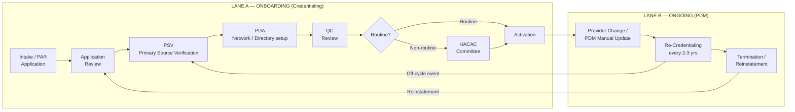
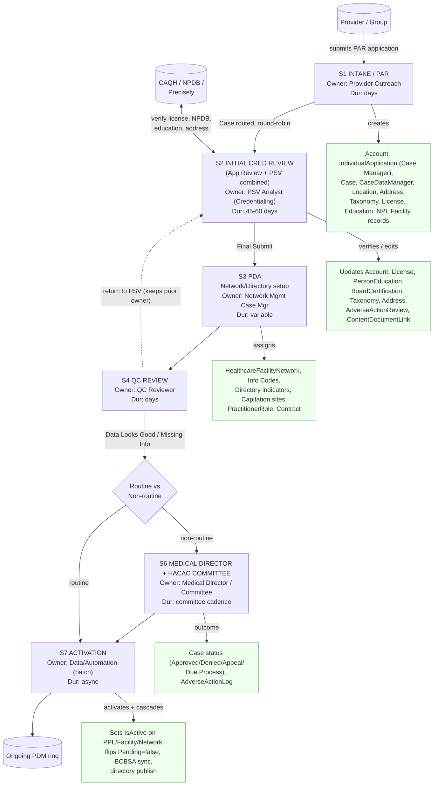
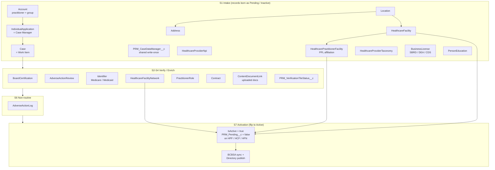
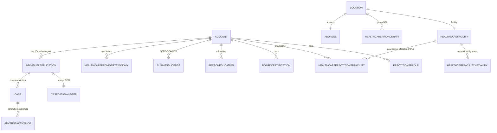
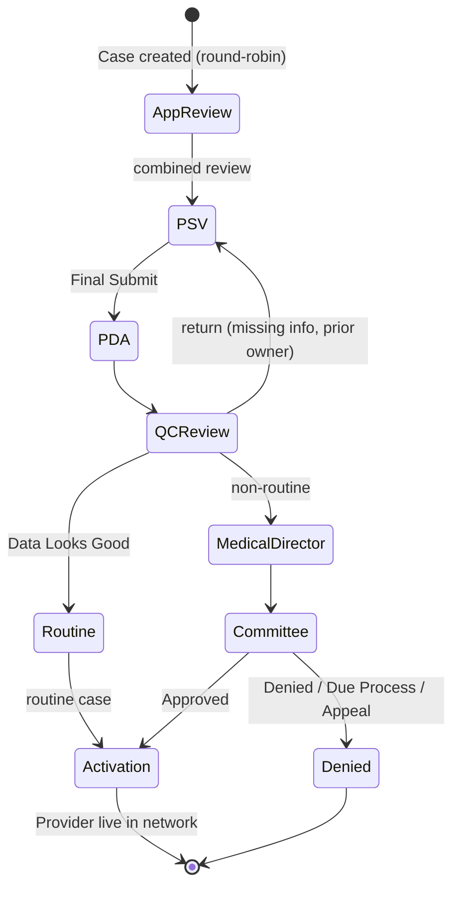

# IBX Provider Onboarding — Process Decomposition & Record Lifecycle

**Prepared for:** Salesforce Product Manager (journey maps & process-flow diagrams)
**Author:** Salesforce Architecture / IBX PNM
**Date:** 2026-06-30
**Scope:** End-to-end provider onboarding on the IBX Provider Network Management (PNM) platform — the **payer-side** join-the-network journey (credentialing → activation), plus the ongoing data-management lifecycle that follows.

---

## 0. How to read this document (and a note on terminology)

You asked for three things, grounded in the example *"Process Decomposition — BHMG Provider Onboarding"* deck:

1. **Detailed process for provider onboarding** → §2 (lifecycle overview), §3 (swimlane decomposition), §4 (stage-by-stage table).
2. **Lifecycle of records created** (opportunities, work items, cases, etc.) → §5 (record-lifecycle map), §6 (data model), §7 (record-by-stage matrix).
3. **Handoffs between departments / personas** → §3 (swimlanes), §8 (persona × stage handoff matrix).

> **Important context — this is a *payer*, not an *employer* onboarding.**
> The BHMG example is an **employer hiring physicians** (recruitment → offer → contract → HR onboarding → CVO credentialing). IBX is the **health plan enrolling a provider into its network**. So the motions look similar (recruit/intake → contract → credential → activate) but the **Salesforce objects differ**. Your generic terms map to our domain like this:

| Your generic term | IBX PNM equivalent | Notes |
|---|---|---|
| **Opportunity** | *No literal Opportunity object on the payer side.* The closest analog is the **PAR application intake** (the Practitioner/Provider Participation Form submission) that starts the journey. | If a sales/contracting "Opportunity" exists, it lives upstream in Provider Contracting, **not** in the credentialing platform documented here. Flag if you need that traced separately. |
| **Work Item** | **`Case`** (the credentialing work item) routed through stages, owned by an analyst, round-robin assigned. | The Case *is* the unit of work that moves App Review → PSV → QC → Committee. |
| **Case / Application** | **`IndividualApplication`** — known internally as the **"Case Manager"** record. | The IndividualApplication is the spine record the whole journey hangs off of; `Case` drives stage routing, `IndividualApplication` is the application/credential record. |
| **Account / Party** | **`Account`** (Practitioner = person account; Group/Practice = business account) | |

Everything below is grounded in the platform's actual flows, objects, and reference docs. Diagrams are **Mermaid** — paste any block into [mermaid.live](https://mermaid.live) and export PNG/SVG for Lucid/Slides/Miro.

---

## 1. The cast — departments & personas (swimlanes)

These are the "PP / departments" equivalent of the BHMG deck. They are the lanes your journey map should use.

| # | Persona / Department | Role in onboarding |
|---|---|---|
| P1 | **Provider / Practitioner (+ Group office)** | Submits application data; attests via CAQH; uploads documents. External actor. |
| P2 | **Provider Outreach / Intake** | Initiates/receives the PAR application; first-pass completeness; chases missing info. |
| P3 | **Network Management — Case Manager (Network Coordinator)** | Owns the `Case`; drives the application through the pipeline; handles PDA (network/info-code/directory) decisions. |
| P4 | **Credentialing — PSV Analyst** | Primary Source Verification: license, education, NPDB, board cert, malpractice against authoritative sources. |
| P5 | **Quality Control (QC) Reviewer** | Independent second-pass check of PSV/App-Review work; returns or advances. |
| P6 | **Medical Director** | Clinical review for flagged/non-routine cases (MDR step). |
| P7 | **HACAC Credentialing Committee** | Governance body for non-routine outcomes (approve/deny/appeal/due-process). |
| P8 | **Data / Activation (PDM + batch automation)** | Activates approved records; cascades to network/directory; syncs to BCBSA & downstream. |
| P9 | **External systems** | CAQH, NPDB, Precisely (address), NPPES/FSMB, BCBSA, NCPDP, RCAT, UPHS/UPenn rosters. |

---

## 2. End-to-end lifecycle at a glance

A single provider record flows through **ten major stages** across two lanes — **Onboarding (Credentialing)** and the **Ongoing (PDM)** ring it enters after activation.

> **Initial Credentialing Review is now ONE combined motion.** Business ratified that *Application Review* (A1) and *Initial-Cred PSV* (A2) are performed together — one dashboard, one session, one submit. They're shown separately above for clarity of the journey, but in tooling they're a single "Initial Credentialing Review."

---

## 3. Process decomposition — swimlane (the BHMG-style decomposition)

This is the closest analog to the example deck: each stage, who owns it, the handoff, and the artifacts produced.

**Handoff legend (who → who):**
Provider → Outreach → **Case routed** → PSV Analyst → (Final Submit) → Network Case Manager (PDA) → QC Reviewer → *(routine)* Activation **or** *(non-routine)* Medical Director → HACAC Committee → Activation → PDM Ops.

---

## 4. Stage-by-stage decomposition table

The "what gets produced and handed off" table — the heart of what you need for journey maps.

| Stage | Owner / Dept | Typical duration | Key inputs | Records CREATED | Records UPDATED | Exit criteria → next owner |
|---|---|---|---|---|---|---|
| **S1 — Intake / PAR Application** | Provider Outreach (P2); data from Provider (P1) | days | PAR form / CSV; CAQH pre-fill | `Account` (practitioner + group), `IndividualApplication` (**Case Manager**), `Case`, `PRM_CaseDataManager__c`, `Location`, `Address`, `HealthcareProviderNpi`, `HealthcareFacility`, `HealthcarePractitionerFacility`, `HealthcareProviderTaxonomy`, `BusinessLicense`, `PersonEducation` | — | Application complete & `Case` created → round-robin to **PSV Analyst** |
| **S2 — Initial Cred Review (App Review + PSV)** | PSV Analyst / Credentialing (P4) | **45–60 days** | CAQH data (read-only), Salesforce records, NPDB | `AdverseActionReview`, `ContentDocumentLink`, new `BusinessLicense`/`PersonEducation`/`BoardCertification` as found | `Case` (status/results), `IndividualApplication`, `HealthcareProviderTaxonomy`, `Address`, `HealthcarePractitionerFacility`, `Identifier` (Medicare/Medicaid) | Final Submit (via `PRM_ReviewPSVCaseRecordsUpdate`) → **Network Case Manager** (PDA) |
| **S3 — PDA (Network / Info-Code / Directory)** | Network Mgmt Case Manager (P3) | variable | Verified practitioner, available networks/info codes, capitation sites | `HealthcareFacilityNetwork`, info-code assignments, directory indicators, capitation site links, `PractitionerRole`, `Contract` | Practice-location ↔ network associations | PDA complete → **QC Reviewer** |
| **S4 — QC Review** | QC Reviewer (P5) | days | PSV + PDA output (read-only), QC checklist | QC verification records (`PRM_VerificationTileStatus__c`), `ContentNote` for missing info | `Case` (QC outcome), owner fields | *Data Looks Good* → routine path; *Missing info* → **return to PSV** (original owner preserved) |
| **S5 — Routing decision** | System / Case Manager | instant | Case flags (routine vs non-routine) | — | `Case.Status` | Routine → **Activation**; Non-routine → **Medical Director / Committee** |
| **S6 — Medical Director + HACAC Committee** | Medical Director (P6), HACAC Committee (P7) | committee cadence (weeks) | Non-routine case, MDR fields | `AdverseActionLog`, committee outcome records | `Case` (Approved / Denied / Appeal / Due Process / Outreach), recred due date | Outcome persisted (`IPNonroutineRecordsUpdate`) → **Activation** (if approved) |
| **S7 — Activation** | Data / Automation — batch (P8) | async (minutes–hours) | Approved case + all related records | network/directory publish records | `IsActive=true` & `PRM_Pending__c=false` on `HealthcarePractitionerFacility`, `HealthcareFacility`, `HealthcareFacilityNetwork`; BCBSA sync | Provider live in network & directory → **PDM ring** |

> Durations for S1/S2 are grounded in the platform's documented credentialing windows (PSV internal review ≈ 45–60 days, mirroring the CVO example). PDA/QC/Committee durations vary by case and committee calendar — confirm exact SLAs with Network Ops for the journey map.

---

## 5. Record lifecycle map (creation → activation)

This shows **when each record is born** and **when it flips from Pending → Active**. Most records are created **Pending/Inactive** at intake and only **activated** at S7.

**Key lifecycle rule (grounded in the PAR-form record-creation analysis):** adding a single practice location creates **5–9 records** (Location → Address → HealthcareProviderNpi → HealthcareFacility → HealthcarePractitionerFacility, plus conditional HealthcareFacilityNetwork / AffirmingCareCategory / ProviderFeature / PractitionerFacilityAffiliation). All are stamped `PRM_CaseManager__c` (the IndividualApplication Id) and created `Pending=true / Active=false` until activation.

---

## 6. Core data model (object relationships)

For the data-model panel of your process diagram.

---

## 7. Record × stage matrix (born / touched / activated)

`C` = created · `U` = updated · `A` = activated · blank = not touched.

| Record (object) | S1 Intake | S2 Review+PSV | S3 PDA | S4 QC | S6 Committee | S7 Activation |
|---|:--:|:--:|:--:|:--:|:--:|:--:|
| Account (practitioner/group) | C | U | | | | |
| IndividualApplication (**Case Manager**) | C | U | U | U | U | U |
| Case (**Work Item**) | C | U | U | U | U | U |
| PRM_CaseDataManager__c | C | U | | | | |
| Location / Address | C | U | | | | A |
| HealthcareProviderNpi | C | | | | | |
| HealthcareFacility | C | | | | | A |
| HealthcarePractitionerFacility (PPL) | C | U | | | | A |
| HealthcareProviderTaxonomy | C | U | | | | |
| BusinessLicense (SBRD/DEA/CDS) | C | C/U | | | | |
| PersonEducation | C | C/U | | | | |
| BoardCertification | | C/U | | | | |
| AdverseActionReview / AdverseActionLog | | C | | | C | |
| HealthcareFacilityNetwork | | | C | | | A |
| Info codes / Directory indicators | | | C/U | U | | A |
| Capitation site links | | | C | | | |
| PractitionerRole / Contract | | | C | | | |
| Identifier (Medicare/Medicaid) | | C | | | | |
| ContentDocumentLink (docs) | | C | | | | |
| PRM_VerificationTileStatus__c | | C | | C | | |

---

## 8. Persona × stage handoff matrix

The "who hands what to whom" table — drives the swimlane transitions in a journey map.

| From stage | Owner (gives) | Handoff trigger | To stage | Owner (receives) |
|---|---|---|---|---|
| Intake/PAR | Provider Outreach | Application complete → `Case` created → **round-robin** | Initial Cred Review | PSV Analyst |
| Initial Cred Review | PSV Analyst | **Final Submit** (`PRM_ReviewPSVCaseRecordsUpdate`) | PDA | Network Case Manager |
| PDA | Network Case Manager | Network/directory complete | QC Review | QC Reviewer |
| QC Review | QC Reviewer | *Missing info* → **return** (prior owner preserved) | back to PSV | original PSV Analyst |
| QC Review | QC Reviewer | *Data Looks Good* + non-routine | Medical Director / Committee | Medical Director → HACAC |
| QC Review | QC Reviewer | *Data Looks Good* + routine | Activation | Automation (batch) |
| Committee | HACAC Committee | Approved (`IPNonroutineRecordsUpdate`) | Activation | Automation (batch) |
| Activation | Automation | Cascade complete + BCBSA sync | Ongoing PDM | PDM Ops |

> **Owner-continuity rule (grounded):** when a case is returned to a previously-visited stage (e.g., QC → PSV → QC), the platform **restores the original stage owner** (`Previous_PSV_Owner__c`, `Previous_QC_Review_Owner__c`) instead of round-robin — important to show as a loop, not a fresh assignment, in the journey map.

---

## 9. Case-stage state machine (routing & loops)

The `Case` is the work item; this is its state model, including return loops and committee branches.

---

## 10. External integration touchpoints by stage

Credentialing is a **data-orchestration** problem — every stage calls out.

| Stage | External systems | Purpose |
|---|---|---|
| Intake | **CAQH** | Pre-fill demographics & attestation |
| Initial Cred Review / PSV | **NPDB**, **CAQH** (read-only), **NPPES/FSMB**, state boards | Adverse-action check, license/education verification |
| All address steps | **Precisely API** | Address standardization & validation |
| PDA / Activation | **BCBSA** | Inter-Blue practitioner/role sync |
| Activation / Ongoing | **NCPDP**, **RCAT**, **UPHS / UPenn rosters** | Pharmacy data, compliance attestation, roster reconciliation |

---

## 11. Ongoing lifecycle (after activation) — for completeness

Onboarding doesn't end at activation; the provider enters the PDM ring. Include this if the PM's "journey map" spans the full provider lifecycle.

- **Provider Change / PDM Manual Update** — demographic, taxonomy, NPI, practice-location, billing/mailing-address, network, capitation changes (5 PDM guided flows, each with a 5-step QC chain).
- **Re-Credentialing** — every 2–3 years; triggered by 4 scheduled batches (due-date check, CAQH access check, notification, letter); CAQH re-validation gate; re-enters at PSV with `IsRecredentialing=true`.
- **Off-Cycle Credentialing** — event-driven re-verification between cycles (abbreviated PSV + accelerated QC).
- **Termination / Reinstatement** — provider/PL leaves or returns; reinstatement re-enters at App Review.

---

## 12. Open items to confirm before you finalize the journey map

These are points I could **not** fully resolve from the codebase — worth a 15-min call with Network Ops / Contracting:

1. **"Opportunity" upstream of intake.** Is there a Provider Contracting "Opportunity"/deal object *before* the PAR application? Not present in the credentialing platform; likely a separate Contracting system. Confirm if it belongs on the map.
2. **Exact SLA durations** for PDA, QC, and Committee (S3/S4/S6) — I have orders of magnitude, not contractual SLAs.
3. **Routine vs non-routine criteria** — the rule set that routes a case to Committee (S5) lives in case flags/validation; confirm the business decision matrix.
4. **Delegated vs IBC branch.** The platform has two onboarding branches (IBC Professional Staff = lean, no async; Delegated Credentialing = full, with network async offload). The map above is the **full Delegated** path; the IBC path skips the group/network-heavy steps. Tell me if you want both branches drawn separately.
5. **Slack thread context.** I could not open the linked Slack message (it returned Slack's sign-in/unsupported-browser wall). If the PM added scope in that thread, share the text and I'll fold it in.

---

## 13. Source grounding (where this came from)

- `requirements/SVP_Cred_PDM_Overview_Deck_Outline.md` — lifecycle stages, integrations, scale.
- `requirements/Practitioner_Participation_Form_Complete_Record_Creation_Analysis.md` — record creation per location.
- `requirements/ReDesignCredFlows/MASTER_Development_Plan_Credentialing_LWC_Redesign.md` — combined Initial Cred Review, tiles, objects.
- `requirements/ReDesignCredFlows/Application_Review_LWC_Redesign_Detailed_Design.md` — App Review/PSV objects created & updated.
- `requirements/Case_Management_Enhancement_User_Stories.md` — Case stage routing & owner-continuity.
- `requirements/Recred_PSV_QC_Committee_Sequence_Lucid.md` — PSV/QC/Committee sequence & outcomes.
- `CLAUDE.md` — domain vocabulary (Case Manager = IndividualApplication; CDM; IBC vs Delegated branches).
