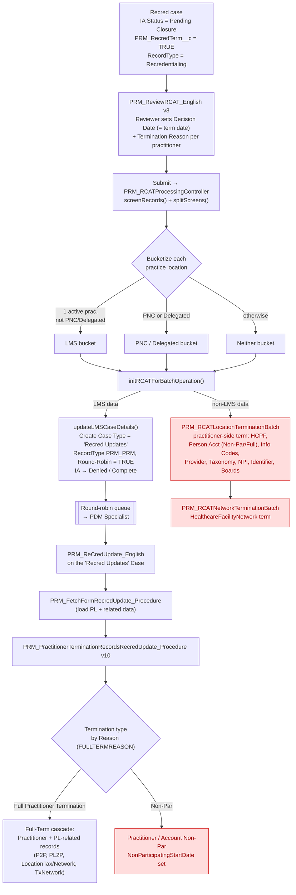

# USER STORY: RCAT Guided Flow — Add Non-Par & Full-Term Practice Location Termination to Batch Processing

**Persona:** Credentialing Specialist (runs the RCAT review and sets Decision Date + Termination Reason); the resulting **"Recred Updates" case is routed (round-robin) to a PDM Specialist** who completes the data termination
**Priority:** P1
**OmniScript (entry / review):** `PRM_ReviewRCAT_English` **v8 (active)**
**OmniScript (PDM "Recred Updates" case):** `PRM_ReCredUpdate_English` (v7 latest on file — confirm active)
**Integration Procedures (review):** `PRM_ReviewRCATLoadParent_Procedure`, `PRM_ReviewRCATLoad_Procedure`, `PRM_ReviewRCAT_Procedure`, `PRM_RCATFullTermination_Procedure`
**Integration Procedures (PDM Recred Update):** `PRM_FetchFormRecredUpdate_Procedure` (v5), `PRM_PractitionerTerminationRecordsRecredUpdate_Procedure` (v10)
**Apex (RCAT review/batch, current):** `PRM_RCATProcessingController`, `PRM_RCATProcessingService`, `PRM_RCATLocationTerminationBatch`, `PRM_RCATNetworkTerminationBatch`, `PRM_RCATTerminationBatchHelper`, `PRM_RCATTerminationEffectivityHelper`
**Apex (Practice-Location termination logic to reuse):** `PRM_PracticeLocationTerminationBatch`, `PRM_PracLocTermHelper`, `PRM_AccountTerminationBatchHelper`
**Key routing constants:** Case `Type = 'Recred Updates'` (`PRM_GlobalConstant.RCATCASETYPE`), `FULLTERMREASON = {Deceased, Retired, Administrative Decision - for Cause, CMS Preclusion}` (drives Full-Term vs Non-Par)
**Relevant Requirements:** `AccountTermination_PracticeLocationTaxonomy_Typeahead_UserStory.md`, `FutureDated_Termination_PushOut_*`, `PRM_PNC_Analysis.md`

---

## Story

**As a** Credentialing Specialist running the RCAT (Recredentialing Attestation) review — whose decision creates a **"Recred Updates"** case that is routed to a PDM Specialist,
**I want** the RCAT / Recred-Updates termination processing to terminate a **Practice Location** (both **Non-Participating** and **Full-Termination**) and cascade the correct effective-dating to every related location record,
**So that** a recred decision that ends a practice location's participation is fully applied in the provider data model — instead of only terminating the practitioner and network records and leaving the Practice Location and its children active.

**Why it matters:** RCAT terminates practitioner-side data (Person Account, practice-to-practice affiliations, providers, taxonomy, NPI, identifiers, boards) and network records, and the downstream PDM "Recred Updates" processing cascades practice-location records **only** for a **Full Practitioner Termination**. There is no **Non-Par Practice Location Termination** anywhere in the RCAT → Recred-Updates path. That leaves stale, still-active practice locations, addresses, taxonomies, program participation, and info codes after a recred non-par decision — a directory-accuracy and claims-integrity risk that PDM has to clean up by hand.

---

## Scope

| Flow | OmniScript | Affected Step | Data Source |
|------|------------|--------------|-------------|
| RCAT review (Credentialing) | `PRM_ReviewRCAT_English` v8 | RCAT review → "Process / Submit" (bucketize + kickoff) | `PRM_RCATProcessingController.initRCATForBatchOperation` → LMS creates `Type='Recred Updates'` case; non-LMS → `PRM_RCATLocationTerminationBatch` |
| Recred Updates termination (PDM) | `PRM_ReCredUpdate_English` (on the `Recred Updates` case) | Practitioner/Practice-Location termination submit | `PRM_FetchFormRecredUpdate_Procedure` → `PRM_PractitionerTerminationRecordsRecredUpdate_Procedure` (+ new Practice-Location Non-Par cascade) |

**In scope — four batch scenarios from the requirement:**

1. **Non-Par Practice Location Termination (NEW)** — a single practice location is converted to Non-Participating (account remains participating).
2. **Account + Practice Location Non-Par Termination (UPDATE)** — the vendor account and its practice location(s) are converted to Non-Participating together.
3. **Practice Location Full-Termination (UPDATE)** — a single practice location is fully termed (Non-Par flag cleared, Non-Par Start Date nulled).
4. **Account + Practice Location Full-Termination (UPDATE)** — the vendor account and its practice location(s) are fully termed together.
5. **Uniform effective-date / error-record rule** applied to every record updated by 1–4.

**Out of scope:** the non-RCAT termination entry points (Account Termination form, Provider Change, PDM Manual Update, Future-Dated push-out) — those already have their own Practice Location termination batches and are not being changed here. Practitioner-side and network termination in RCAT (already working) is not being re-implemented, only sequenced alongside the new step.

---

## Current State (from codebase) — grounded RCAT walkthrough

### How RCAT works today (end to end)

1. **Trigger / data load** — `PRM_ReviewRCAT_English` **v8** loads recred cases where the `IndividualApplication` has `Status = Pending Closure`, `PRM_RecredTerm__c = TRUE`, RecordType Recredentialing, and a Person Account. `PRM_RCATProcessingService.screenRecords()` builds one screen per practitioner and enriches each with its practice locations (`PracLoc`: facility, account, active-practitioner count, PNC & delegated flags, NPI).
2. **Term-date capture** — the reviewer sets, per practitioner, a **Decision Date** (`IndividualApplication.PRM_Decision_Date__c`) and a **Termination Reason** (`PRM_TerminationReason__c`). **The Decision Date is the termination date** used by every effective-date calculation downstream.
3. **Bucketize** — `splitScreens()` sorts each screen into three buckets by its locations:
   - **LMS (Last-Man-Standing):** a location with exactly **1 active practitioner** and **not** PNC and **not** delegated.
   - **PNC / Delegated:** any location flagged PNC or delegated.
   - **Neither.**
4. **Submit → `PRM_RCATProcessingController.initRCATForBatchOperation`** routes each bucket:
   - **LMS → PDA hand-off.** `PRM_RCATProcessingService.updateLMSCaseDetails` creates a **Case with `Type = 'Recred Updates'`** (RecordType `PRM_PRM`, `PRM_IsRoundRobinLogic__c = true`) and sets the `IndividualApplication` to `Status = Denied`, `Stage = Complete`, stamping Decision Date + Termination Reason. The round-robin case is picked up by a **PDM Specialist**.
   - **Non-LMS (PNC/Delegated + Neither) → auto-batch.** `PRM_RCATLocationTerminationBatch` (chunk 1) runs, then chains `PRM_RCATNetworkTerminationBatch` in `finish()`.
5. **Full-Term vs Non-Par** is derived from the **Termination Reason**: `FULLTERMREASON = {Deceased, Retired, Administrative Decision - for Cause, CMS Preclusion}` → **Full-Termination**; any other reason → **Non-Par**.
6. **PDM works the "Recred Updates" case** via `PRM_ReCredUpdate_English` → `PRM_FetchFormRecredUpdate_Procedure` (load) → `PRM_PractitionerTerminationRecordsRecredUpdate_Procedure` (v10) which upserts termination records. Its **practice-location cascade** (PracticeLocationToPractitioner, LocationTax, LocationNetwork, LocationTxNetwork, PracticeToPractitioner) is gated on `Type == 'Full Practitioner Termination' && SubType == 'FullTermination'`; the Non-Par branch only sets `NonParticipatingStartDate` on the practitioner/account, not the practice location.

### RCAT flow diagram

> **Gap (red nodes):** neither the auto-batch path (`J`/`K`) nor the PDM Recred-Updates Non-Par branch (`R`) performs a **Non-Par Practice Location Termination** (scenario 1) or the full PL-level cascade for scenarios 2–4. The PL cascade exists **only** under Full Practitioner Termination (`Q`), tied to the practitioner — not as a PL-level Non-Par/Full-Term action. `PRM_NonParLocation__c` / `PRM_NonParticipatingStartDate__c` on `HealthcareFacility` are never set from this path.

### The Practice-Location termination logic already exists elsewhere (reusable)
- **`PRM_PracticeLocationTerminationBatch` + `PRM_PracLocTermHelper` + `PRM_AccountTerminationBatchHelper`** (invoked from the **Account Termination** flow via `PRM_PracLocTermUtility`) already implement all four scenarios' location cascade: Non-Par convert (`PRM_NonParLocation__c=true`, `PRM_NonParticipatingStartDate__c`, primary-taxonomy **add/reuse** as `Specialist`), Full-Term of the facility + Location + Address + Identifier + Location NPI History + Provider Feature + Contact Method + Info Codes + Program Participation + Bundle/Facility Association + Vendor NPI, Account Non-Par / Full-Term via the account helper, and `PRM_CaseDataManager__c` flag stamping in `finish()`.
- **`PRM_RCATTerminationBatchHelper.resolveEffectivity`** already implements the requirement's rule #5 exactly (EffectiveFrom ≥ term date → error record; EffectiveTo null/after → term date; Active = From ≤ TODAY & To > TODAY).
- This story's core work is to **invoke the existing location cascade from the RCAT / Recred-Updates path** (driven by the Decision Date + Termination Reason), unify the effective-date rule, and **add the Non-Par Practice Location scenario** — not to rebuild the cascade.

---

## Acceptance Criteria

**AC-1 — RCAT terminates a Non-Par Practice Location (new)**

**Given** a Credentialing Specialist completes an RCAT review where a practice location is marked to convert to **Non-Participating** (the vendor account stays participating),
**When** RCAT processing runs,
**Then** that practice location is flagged Non-Participating with the recred Non-Participating Start Date,
**And** its dependent location records (info codes, practice-to-practitioner and location-to-practitioner links, practice location taxonomy, program participation, practice location network, practitioner-practice-location taxonomy-and-network, practice location association, and bundle association) are effective-dated closed per the rules in AC-6,
**And** each updated record is stamped with the case manager for the recred case,
**And** the Case Data Manager tracker for the case reflects every object type that was updated.

**AC-2 — RCAT converts Account + Practice Location to Non-Par together**

**Given** an RCAT decision converts both the vendor account and its practice location(s) to Non-Participating,
**When** RCAT processing runs,
**Then** the account is set to Non-Participating with a Non-Participating Start Date and Participating Code "Non-Participating",
**And** account-level info code assignments, program participation, and account contract entities are effective-dated closed,
**And** every in-scope practice location is processed exactly as in AC-1,
**And** no record whose effective end already precedes the termination date is altered (per AC-6).

**AC-3 — RCAT fully terminates a Practice Location**

**Given** an RCAT decision **fully terminates** a practice location,
**When** RCAT processing runs,
**Then** the practice location is effective-dated closed, its Non-Par flag is cleared and its Non-Participating Start Date is emptied,
**And** its Location, Address(es), Identifier(s), Location NPI History, Healthcare Provider NPI (only when this was the last remaining reference), Provider Features, Alternative Contact Methods, info codes, taxonomy, program participation, network, PPL-taxonomy-and-network, and association/bundle records are effective-dated closed,
**And** each updated record is stamped with the case manager and the Case Data Manager tracker reflects the objects updated.

**AC-4 — RCAT fully terminates Account + Practice Location together**

**Given** an RCAT decision **fully terminates** the vendor account and its practice location(s),
**When** RCAT processing runs,
**Then** the account is effective-dated closed with Participating Code cleared,
**And** account-level Healthcare Provider, Identifier, info code assignments, program participation, and account contract entities are effective-dated closed,
**And** every in-scope practice location is processed exactly as in AC-3.

**AC-5 — Practice Location Taxonomy add / reuse on Non-Par conversion**

**Given** a practice location is being converted to Non-Participating and a primary taxonomy applies,
**When** RCAT processing runs,
**Then** if a matching primary-taxonomy / "Specialist"-role record already exists it is **reused** (marked primary, stamped with the case manager) rather than duplicated,
**And** if none exists a new "Specialist"-role Practice Location Taxonomy is added named `{Care Taxonomy Name} - Specialist - {Practice Location Name}`, marked primary, used-for-claims, manually-added, not displayed in directory, effective from the effective date of change,
**And** if that new taxonomy is future dated it follows Future-Dated Processing rather than activating immediately.

**AC-6 — Effective-date & error-record rules for every updated record** *(Pattern D)*

**Given** any record touched by AC-1 through AC-5,
**When** RCAT termination processing calculates its dates,
**Then** the following rules are applied uniformly:

- **If the record's Effective From is on or after the Termination Date → it is an error record:**
  - Effective From = TODAY
  - Is Error Record = TRUE
  - Active = FALSE
  - Effective To = NULL
  - Pending = FALSE
- **Else, resolve Effective To by comparing the current Effective To to the Termination Date:**
  - Effective To is blank → set Effective To = Termination Date (normal scenario)
  - Effective To is **prior to** the Termination Date → leave the existing Effective To (no change)
  - Effective To is **after** the Termination Date → set Effective To = Termination Date
- **Active =** TRUE if Effective From ≤ TODAY and Effective To > TODAY; otherwise FALSE
- **Case Manager =** the recred case's case manager

**AC-7 — Practitioner-side and network termination still run (no regression)**

**Given** an RCAT decision that terminates a practitioner and network records in addition to a practice location,
**When** RCAT processing runs,
**Then** the existing practitioner-side termination (person account, affiliations, providers, taxonomy, NPI, identifiers, boards) and network termination still complete as they do today,
**And** the new practice-location termination completes in the same run without exceeding platform limits.

**AC-8 — Last-remaining scoping edge case**

**Given** a practice-to-practitioner link that is **not** the last remaining link for its practitioner-account (Non-Par, per AC-1/2) or practitioner–practice-location (Full-Term, per AC-3/4) combination,
**When** RCAT processing runs,
**Then** that link is left active,
**And** only when it is the last remaining link is it effective-dated closed. *(See Clarification #4 for where this scoping is computed.)*

**AC-9 — Partial-failure isolation**

**Given** one practice location in the batch scope fails to process,
**When** RCAT processing runs the remaining scope,
**Then** the failure is logged with the standard exception logger,
**And** the case is not marked complete on an errored run,
**And** the other practice locations in scope are unaffected.

---

## Technical Implementation (high-level)

> The change lands in **one of two homes** (see Clarification #9): **(A)** the auto-batch non-LMS path (`PRM_RCATLocationTerminationBatch`), and/or **(B)** the PDM "Recred Updates" path (`PRM_ReCredUpdate_English` → `PRM_PractitionerTerminationRecordsRecredUpdate_Procedure`). The table names both.

| Component | Type | Change | Notes |
|---|---|---|---|
| `PRM_PractitionerTerminationRecordsRecredUpdate_Procedure` (v10) | Modified IP | Add a **Non-Par Practice Location** branch (SubType ≠ FullTermination) that cascades PL-level records, mirroring the existing FullTermination PL cascade | Path B — the PDM "Recred Updates" case; Drives AC-1, AC-2, AC-5 |
| `PRM_ReCredUpdate_English` | Modified OmniScript | Surface / pass the Practice-Location termination type + date and facility/account context into the Recred-Update IP | Path B; Drives AC-1–AC-4; see Clarification #1 |
| `PRM_RCATProcessingController` | Modified Apex | For the non-LMS auto-batch path, sequence a **Practice Location termination** step for the facility/account IDs derived from RCAT screen data | Path A; Drives AC-1–AC-4, AC-7 |
| `PRM_RCATLocationTerminationBatch` / new `PRM_RCATPracticeLocTerminationBatch` | New/Modified Apex batch | Add a batch (or `finish()` chain) that resolves, per RCAT screen, the terminating `HealthcareFacility` set + termination type | Path A; prefer a dedicated batch chained after network term to preserve chunking; Drives AC-1–AC-4 |
| `PRM_PracLocTermHelper`, `PRM_AccountTerminationBatchHelper` | Reuse (possibly extract) | Reuse existing location-cascade queries/updaters (facility, Location, Address, Identifier, Location NPI History, Provider Feature, Contact Method, Info Codes, Program Participation, HFN taxonomy add/reuse, Bundle/Facility Association, account Non-Par/Full-Term) | Avoid re-implementing; Drives AC-1–AC-5 |
| Effective-date logic | Modified Apex | Route the location cascade through `PRM_RCATTerminationBatchHelper.resolveEffectivity` (already implements rule #5) so it is identical across practitioner, network, and location records | Single source of truth; Drives AC-6 |
| Practice Location Taxonomy add/reuse | Reuse Apex | Reuse the `HealthcareFacilityNetwork` primary-taxonomy add/reuse block (record type `PRM_FacilityTx`, role `Specialist`, primary, used-for-claims, manually-added, directory-print false) | Drives AC-5 |
| Future-Dated Processing | Verify | Confirm future-dated new taxonomy defers activation via the existing Future-Dated processing path | Drives AC-5; see Clarification #3 |
| `PRM_CaseDataManager__c` | Modified Apex | Stamp the object-updated flags for the location cascade on the recred case's Case Data Manager | Drives AC-1, AC-3 |
| Test classes (`PRM_RCATProcessingControllerTest`, new batch/IP test) | New/Modified test | Cover all 4 scenarios + rule #6 + last-remaining + partial-failure, bulk (200+) and single | Drives DoD ≥85% coverage |

> **Reuse-first principle:** the location termination cascade already exists in `PRM_PracticeLocationTerminationBatch` / `PRM_PracLocTermHelper` (Account Termination flow) and rule #5 already exists in `PRM_RCATTerminationBatchHelper.resolveEffectivity`. This story wires that logic into the chosen RCAT/Recred-Updates home and **adds the Non-Par Practice Location scenario**; it should not fork a second copy of the cascade.

---

## Definition of done

- [ ] RCAT processing terminates a Non-Par practice location and its dependents (AC-1) — verified in QA.
- [ ] RCAT processing handles Account+PL Non-Par (AC-2), PL Full-Term (AC-3), and Account+PL Full-Term (AC-4).
- [ ] Practice Location Taxonomy add/reuse behaves per AC-5, including the future-dated case.
- [ ] Effective-date / error-record rule (AC-6) is applied identically across practitioner, network, and location records.
- [ ] Existing RCAT practitioner-side and network termination show **no regression** (AC-7).
- [ ] Last-remaining links behave per AC-8; partial-failure isolation per AC-9.
- [ ] ≥85% Apex coverage incl. bulk (200+ locations), single, empty, and negative/error-record paths; real assertions on effective dates, `PRM_NonParLocation__c`, `PRM_Active__c`, and `PRM_CaseDataManager__c` flags.
- [ ] Batch stays within governor limits on a large recred run (one bulk DML per object type).
- [ ] Case Manager stamped on every updated record; Case Data Manager flags set.

---

## Clarification Questions (Before Implementation)

> **Resolved from the codebase during grounding:** (a) the **termination date** is the reviewer's **Decision Date** (`PRM_Decision_Date__c`); (b) **Full-Term vs Non-Par is derived from the Termination Reason** via `FULLTERMREASON = {Deceased, Retired, Administrative Decision - for Cause, CMS Preclusion}`; (c) LMS decisions **route to a `Type = 'Recred Updates'` round-robin case → PDM Specialist**; non-LMS auto-terminate in `PRM_RCATLocationTerminationBatch`.

| # | Question | Impact | Owner |
|---|----------|--------|-------|
| 9 | **Which home** should host the new PL termination — the **PDM "Recred Updates"** path (`PRM_ReCredUpdate_English` / `PRM_PractitionerTerminationRecordsRecredUpdate_Procedure`), the **auto-batch** non-LMS path (`PRM_RCATLocationTerminationBatch`), or both? | Biggest scope driver; determines whether the change is IP+OmniScript, Apex batch, or both | Technical / BA |
| 1 | Does `PRM_ReCredUpdate_English` (Recred Updates case) already let PDM choose/see a **Practice Location** termination type & date, or must new inputs be added? | OmniScript/IP change vs. Apex-only | BA / Technical |
| 2 | Is the **Non-Par vs Full-Term** decision meant to apply at the **practice-location** level independently, or does it inherit the practitioner-level reason bucket (`FULLTERMREASON`)? Scenario 1 (standalone Non-Par PL) implies a PL-level choice the current model doesn't capture. | Whether a new PL-level termination-type input is needed | BA |
| 3 | Should the future-dated **new** Practice Location Taxonomy on Non-Par conversion route through the existing Future-Dated Processing batch, and does that path already exist for Recred-Updates-originated records? | Correct activation timing for future-dated taxonomies (AC-5) | Technical |
| 4 | Where should the **last-remaining** practice-to-practitioner scoping live — computed inside the batch/IP, or passed in from the guided flow's pre-computed lists? (You indicated "either.") | Whether batch-only invocation works without pre-computed lists (AC-8) | Technical |
| 5 | Should this reuse `PRM_PracticeLocationTerminationBatch` directly, or extract the location cascade from `PRM_PracLocTermHelper` into a shared service consumed by both Account Termination and RCAT? | Refactor scope vs. duplication risk; effort | Technical |
| 6 | "Non-Par Location = TRUE, field updated **on** Non-Participating Start Date" and "Non-Par flag cleared **on** Effective To" — should the flag flip be effective-dated (applied when the date arrives) or immediately at processing time? | Timing of `PRM_NonParLocation__c` flips for future-dated terms | BA / Technical |
| 7 | For Account+PL scenarios, is the account always the **Vendor/Group** account, and can a single run include a mix of Non-Par and Full-Term locations under the same account? | Batch scoping and DML grouping | BA |
| 8 | Confirm the **active** version of `PRM_ReviewRCAT_English` (v8 is the latest file on disk) and the active RCAT IPs to ground the wiring. | Prevents building against an inactive version | Technical |

---

## Impact Analysis

| Component | Type | Impact Level | Description |
|-----------|------|-------------|-------------|
| `PRM_PractitionerTerminationRecordsRecredUpdate_Procedure` (v10) | IP | HIGH | Path B — add the Non-Par PL cascade branch on the "Recred Updates" case |
| `PRM_ReCredUpdate_English` / `PRM_FetchFormRecredUpdate_Procedure` | OmniScript / IP | MEDIUM | Path B — surface/pass PL termination type + date (Clarification #1) |
| `PRM_RCATProcessingController` | Apex | HIGH | Path A — orchestrates the new PL termination step into the auto-batch chain |
| `PRM_RCATLocationTerminationBatch` / new PL batch | Apex | HIGH | Path A — new location cascade + chaining |
| `PRM_PracLocTermHelper` / `PRM_AccountTerminationBatchHelper` | Apex | HIGH | Reused (and possibly extracted into a shared service) |
| `PRM_RCATTerminationBatchHelper` / `PRM_RCATTerminationEffectivityHelper` | Apex | MEDIUM | Effective-date rule (`resolveEffectivity`) unified across record types |
| `PRM_ReviewRCAT_English` v8 | OmniScript | LOW–MEDIUM | Only if the review step must capture a PL-level termination type (Clarification #2) |
| `HealthcareFacility`, `HealthcareFacilityNetwork`, `HealthcarePractitionerFacility`, `Account`, `Location`, `Address`, `Identifier`, `HealthcareProviderNpi`, `PRM_HealthcareFacilityNPI__c`, `PRM_InfoCodeAssignment__c`, `PRM_ProgramParticipation__c`, `PRM_AccountContractEntity__c`, `PRM_ProviderFeature__c`, `PRM_ContactMethod__c`, `PRM_HealthcareFacilityAssociation__c`, `PRM_HealthcareFacilityBundleAssociation__c`, `PRM_CaseDataManager__c`, `IndividualApplication` | Objects | HIGH | Records created/updated by the cascade |

---

## Estimated Effort

| Component | Change Type | Effort | Notes |
|-----------|-----------|--------|-------|
| Path B — Non-Par PL cascade branch in `PRM_PractitionerTerminationRecordsRecredUpdate_Procedure` + `PRM_ReCredUpdate_English` inputs | IP + OmniScript | L–XL | Mirror the existing FullTermination PL cascade for the Non-Par case |
| Path A — RCAT PL termination batch + controller wiring | Apex (batch + orchestration) | XL | New batch/chain; resolve facility set + type from screen data |
| Reuse/extract location cascade from `PRM_PracLocTermHelper` | Apex (refactor) | L–XL | L if reused as-is; XL if extracted into a shared service (Clarification #5) |
| Unify effective-date rule (#6) across record types | Apex | M | Route through `resolveEffectivity` |
| Practice Location Taxonomy add/reuse + future-dated handling | Apex | M | Reuse existing HFN block; verify future-dated path |
| Case Data Manager flag stamping | Apex | S | Reuse pattern |
| OmniScript / IP screen + context changes | OmniScript / IP | M | Only if Clarification #1 requires it |
| Test coverage (4 scenarios + rule #6 + last-remaining + partial-failure, bulk 200) | Apex test | L | ≥85% coverage gate |

**Total Estimated Effort:** **XXL** (AI-estimated — validate with team). Lands nearer the top of XXL if the location cascade is extracted into a shared service and the RCAT OmniScript needs new inputs; nearer the bottom if the existing `PRM_PracticeLocationTerminationBatch` is reused as-is and the review UI already captures termination type/date.
