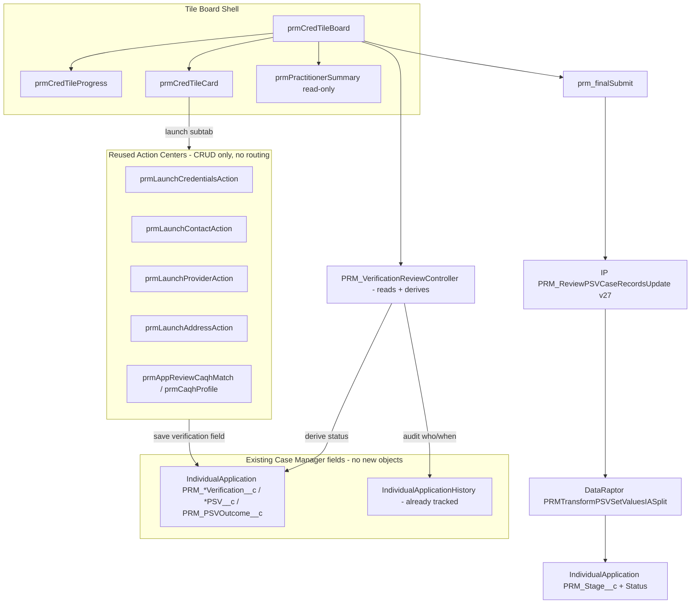
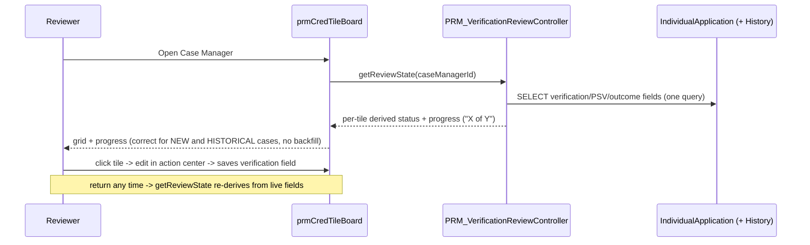
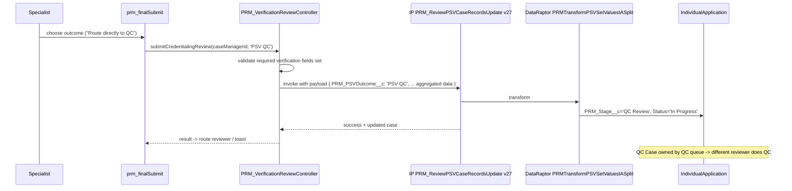
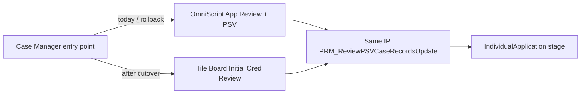

# Credentialing Tile Design — End-to-End Technical Design

> **Status:** v1.0 — DRAFT for review · **Date:** 2026-07-01
>
> **Purpose:** The single authoritative technical design for the credentialing tile-based LWC redesign. It consolidates the investigation, the two proof-of-concept builds, and the ratified merge of **Application Review + Initial Cred PSV** into one **Initial Credentialing Review** flow, and specifies the new submit-time **"route directly to QC"** handoff — all **without breaking the existing OmniScript flows**.
>
> **This document supersedes** the scattered plan/POC notes for architectural decisions. It links (does not duplicate) the detailed per-tile references.

---

## 0. Reading order & source-of-truth hierarchy

When two documents disagree, the higher one wins:

1. **Live org metadata** (`force-app/main/default/`) — grounding truth for object/field/IP API names.
2. **This document** — architecture, data model, routing, cutover.
3. [MASTER_Development_Plan_Credentialing_LWC_Redesign.md](requirements/ReDesignCredFlows/MASTER_Development_Plan_Credentialing_LWC_Redesign.md) — the ratified combined-flow plan (timeline, tile inventory).
4. [POC_Audit_And_Reuse_Map.md](requirements/ReDesignCredFlows/POC_Audit_And_Reuse_Map.md) — what already exists vs what is net-new.
5. Per-tile detailed designs — [Application_Review_LWC_Redesign_Detailed_Design.md](requirements/ReDesignCredFlows/Application_Review_LWC_Redesign_Detailed_Design.md), [PSV_Review_LWC_Redesign_Detailed_Design.md](requirements/ReDesignCredFlows/PSV_Review_LWC_Redesign_Detailed_Design.md), and the QC/PDA designs.
6. Routing audits — [Recred_GuidedFlow_to_ReCredPDA_Routing_Audit_2026-06-08.md](requirements/Recred_GuidedFlow_to_ReCredPDA_Routing_Audit_2026-06-08.md).

> **Grounding note:** API names below are verified against org metadata where marked. Items still to be confirmed against the live IP payload contract are flagged **[VERIFY]**.

---

## 1. Executive summary

### 1.1 The problem

Credentialing review runs today on monolithic OmniScripts (`PRM_InitialCredentialAppReview_English`, `PRM_PrimarySourceVerificationReview_English`, and the QC/PDA variants). These degrade the reviewer experience:

| # | Pain | Root cause |
|---|---|---|
| P1 | "Save for Later" fails on large cases | OmniScript persists the **entire** flow state as one JSON blob; hits the ~4 MB limit on cases with many licenses/addresses. |
| P2 | No pause/resume across sessions/devices | State lives in the running OmniScript instance, not durable per-tile records. |
| P3 | Linear, all-or-nothing navigation | Reviewers must walk steps in order; can't jump to the one section that needs attention. |
| P4 | No visual progress | No "X of Y verified" view; no per-section status at a glance. |
| P5 | App Review and PSV are two separate sittings | Business actually does them together for initial credentialing, forcing an artificial handoff. |

### 1.2 The solution

A **tile dashboard** on the Case Manager (`IndividualApplication`) record: a responsive grid of independent, clickable verification tiles. Each tile:

- saves **independently** (kills the 4 MB blob — P1),
- persists **status durably** in custom objects so the reviewer can pause/resume from any device (P2),
- is completable **in any order** with a live progress header (P3, P4),
- reuses the org's existing, production-grade **"action center"** editors for the heavy editing surfaces (~75-85% reuse).

Application Review and Initial Cred PSV are **merged into one 17-tile "Initial Credentialing Review" dashboard** (P5). On Final Submit, the reviewer picks an outcome — including a new **"Route directly to QC"** option that lets one specialist finish App Review + PSV in a single sitting and hand the case straight to the QC queue, skipping intermediate handoffs.

### 1.3 Goals / non-goals

**Goals**
- One combined dashboard for initial credentialing; per-tile status derived from the Case Manager's existing verification fields; automatic resume; visual progress — **no new custom objects, no backfill**.
- Maximum reuse of existing action centers and controllers; minimal net-new code.
- A submit-time routing outcome selector, including direct-to-QC handoff.
- Zero disruption to existing OmniScript flows during parallel run; clean, reversible cutover.

**Non-goals (this document / first delivery)**
- Building QC, Re-Cred, and PDA QC flows (they **wrap** the combined components — designed for later; §9).
- Replacing the submit **Integration Procedure** — the new flow calls the **same** IP the OmniScripts use.
- Self-service QC (the specialist does **not** QC their own work — §7.4).
- Data migration (this is a flow cutover, not a backfill).

---

## 2. Investigation & POC audit synthesis

### 2.1 Central finding

The redesign plans were originally written as a greenfield build of ~49 components, but **the org already contains a mature "action center" ecosystem** that implements the exact inline-edit + modal + notes + datatable + CAQH-read-only patterns the plan re-specifies. Reuse collapses the net-new scope dramatically.

### 2.2 What already exists (reuse layer — verified in `force-app/main/default`)

**Action centers (full editors, `isExposed=true`, `lightning__UrlAddressable`, read `c__recordId` from page state):**

| Action center | Editing surface it already owns | Backing Apex |
|---|---|---|
| `prmLaunchCredentialsAction` | Business License + Education + Board Cert datatables, inline create/edit/remove, duplicate detection, date validation, notes | `PRM_BusinessLicenseController` |
| `prmLaunchContactAction` | Primary/secondary contact edit, contact-picker, phone formatter, duplicate guard | `PRM_ContactInformationController` |
| `prmLaunchProviderAction` | 5 tabs: Provider Identity/diversity, Languages, Pronouns, Affirming Care, embedded Practitioner Info | `PRM_ProviderInformationController` |
| `prmLaunchAddressAction` | Active/Pending/Billing-Mailing locations + Add-New-Location wizard (Group -> Address -> Precisely -> Review -> Save), taxonomy/telehealth, NPI validation | `PRM_AddNewLocationUtility`, `PRM_PreciselyAddressService`, `PRM_GroupNpiValidationService` |
| `prmAppReviewCaqhMatch` | CAQH match/compare + scoring (read-only) | `PRM_AppReviewMatchController`, `PRM_CAQHMatchScoreService` |

**Shared building blocks (the de-facto framework):** `prmGenericButtonLauncher` (console subtab open/focus), `prmPractitionerSummary` (read-only snapshot), `prmNotesCapture`, `prmGenericInlineError`, `prmGenericConfirmModal`, `prmGenericPagination`, `prmEnhancedDatatable`, `prmMultiSelect`/`prmMultiSelectPicklist`/`prmCheckboxList`, address sub-flow bundles, `prmContentDocumentViewer`/`prmViewFileFromSDS`.

> **Key architectural fact:** the action centers do **record-level CRUD only** and commit their own data immediately on save. They **never** write stage/status/routing fields. This is what makes the tile board a thin orchestration layer and keeps routing centralized at submit (§7).

### 2.3 What does NOT exist yet (net-new)

- A tile-grid dashboard shell + progress header + tile card as **standalone reusable production** components (POC built a demo version — §2.4).
- A thin **read-model controller** that derives tile status/progress from the existing Case Manager verification fields (§6). *(No new custom objects — see §5.)*
- Final-submit orchestration with the routing outcome selector (§7).
- Read-only editors for tiles that have no existing action center (Education is covered by Credentials; Work History, Malpractice, Contract Status, Taxonomy-as-tile are net-new).
- `prm_qcWrapper` and QC/PDA summaries (§9, out of scope here).

### 2.4 POC results (two waves — both deployed to `qa-sandbox`, self-guarded to one QA user)

| Wave | Bundles / classes | What it proved | Evidence |
|---|---|---|---|
| **UI tile board** | `prmCredTileBoard` (container, `lightning__RecordPage`/`lightning__AppPage`), `prmCredTileCard`, `prmCredTileProgress` | Tile grid + progress + status badges renders on the Case Manager page; clicking an available tile launches the matching **existing** action center as a console subtab (off-console falls back to `NavigationMixin.Navigate`); focus-existing-subtab dedup; Coming-Soon toast for tiles with no editor | 26 Jest tests, ~95% line / 100% func coverage; deployed 2026-06-23 (Deploy ID `0AfVB00000HYY3u0AH`); `git diff` = new files only (zero edits to existing components) |
| **CAQH viewer** | `prmCaqhProfile` + `PRM_CaqhProfileController` | Live CAQH read-only profile (~20 sections) for the read-only compare surface | deployed to QA |

**Resolved open questions from the POC:**
- **Launch model** = **console subtab** (reuse `prmGenericButtonLauncher` logic), not dynamic modal injection. Subtab needs **zero edits** to the action centers; modal embedding would require editing them.
- **Persistence depth** = **none new** (superseded). Action centers already commit their own data *and* the verification picklists already live on the Case Manager, so tile status is **derived** from existing fields rather than stored (§5).
- **Placement** = dedicated demo FlexiPage; the self-guard (`ALLOWED_USER_ID` in `prmCredTileBoard.js`) is a **demo-only** gate that MUST be removed for GA (§10).

### 2.5 Reuse scorecard

| Layer | Reuse |
|---|---|
| Editing surface (Contact, Provider/diversity/languages, License/Education/Board Cert, Address, CAQH compare) | ~75-85% reuse |
| Shell (dashboard, progress, tile card) | Built once in the POC; productionize |
| Submit IP | 100% reuse (`PRM_ReviewPSVCaseRecordsUpdate`) |
| Net-new | 0 new objects; 1 thin read-model controller (`PRM_VerificationReviewController`), final-submit component, a handful of read-only tiles |

---

## 3. Target architecture

### 3.1 Layered model

```
L0  Tile Board (LWC shell)     prmCredTileBoard: reads session + tile statuses, renders grid + progress,
                               launches editors, hosts Final Submit. [productionized from POC]
L1  Verification Tiles         One tile per verification area. "Editor" tiles launch an existing action
                               center; "read-only" tiles render CAQH display; net-new tiles are thin LWCs.
L2  Action Centers (REUSE)     prmLaunch{Credentials,Contact,Provider,Address}Action, prmAppReviewCaqhMatch
                               — record-level CRUD, commit on save, NO stage/routing writes.
L3  Controllers / Selectors    PRM_BusinessLicenseController, PRM_ContactInformationController,
    (REUSE) + read ctrl        PRM_ProviderInformationController, PRM_AddNewLocationUtility, PRM_AppReviewMatchController,
                               PRM_AddressSelector  +  NEW PRM_VerificationReviewController (reads + derives status).
L4  Persistence (NO new obj)   EXISTING IndividualApplication verification fields (PRM_*Verification__c / *PSV__c /
                               PRM_PSVOutcome__c) + field history (already trackHistory=true). Tile status is DERIVED,
                               not stored. Domain data persists via the reused controllers into standard/PRM objects.
Submit  Integration Procedure  PRM_ReviewPSVCaseRecordsUpdate (active v27) -> DataRaptor
                               PRMTransformPSVSetValuesIASplit -> writes IndividualApplication.PRM_Stage__c/Status.
                               [SAME IP the OmniScripts call — unchanged]
```

### 3.2 Component diagram



### 3.3 Data-flow principles

- **Derived status, no parallel store.** Domain edits (including the verification picklists) go straight to `IndividualApplication` and child objects via the reused controllers (immediate commit). Tile status/progress are **derived at read time** from those live fields — never a stored session blob. This eliminates P1 *and* the backfill problem (§5).
- **Any-order completion.** The board loads the review state once (`getReviewState`); tiles are independent; progress is a runtime rollup.
- **Routing is centralized at submit.** No tile or action center changes stage. Only `prm_finalSubmit` -> the IP resolves `PRM_Stage__c` (§7). This keeps the merge and the QC option contained to one seam.

---

## 4. Combined "Initial Credentialing Review" flow (17 tiles)

Merges the former Application Review (10 tiles) and Initial Cred PSV (10 tiles) into **17 de-duplicated tiles** in one dashboard, one review, one Final Submit. The four overlapping areas — Practitioner Info, Taxonomy, File Upload, Final Submit — are built once.

### 4.1 Tile inventory + reuse mapping

| # | Tile | Component | Origin | Reuse target (L2) | Build |
|---|---|---|---|---|---|
| 1 | Practitioner Info | `prm_practitionerInfo` | Merged | `prmLaunchProviderAction` (embedded practitioner) + `prmPractitionerSummary` | Wire + thin |
| 2 | Taxonomy & Specialty | `prm_taxonomyVerification` | Merged | partial (`prmLaunchAddressAction` taxonomy logic) | Net-new tile |
| 3 | Verify Education | `prm_reviewEducation` | App Review | `prmLaunchCredentialsAction` (Education tab) | Reuse |
| 4 | Verify License (SBRD) | `prm_reviewLicense` | App Review | `prmLaunchCredentialsAction` (Business License) | Reuse |
| 5 | Verify DEA | `prm_reviewDEA` | App Review | `prmLaunchCredentialsAction` (BusinessLicense/DEA) | Reuse/config |
| 6 | Verify CDS | `prm_reviewCDS` | App Review | `prmLaunchCredentialsAction` (BusinessLicense/CDS) | Reuse/config |
| 7 | Verify Work History | `prm_reviewWorkHistory` | App Review | CAQH display only | Net-new (read-only) |
| 8 | Verify Malpractice | `prm_reviewMalpractice` | App Review | CAQH display only | Net-new (read-only) |
| 9 | Group/Practice | `prm_psvGroupPractice` | PSV | `prmLaunchAddressAction` (Group Info) | Reuse |
| 10 | Address Verification | `prm_psvAddressVerification` | PSV | `prmLaunchAddressAction` (locations + wizard) | Reuse — **HIGH** (100+ addr, async) |
| 11 | Demographics & Diversity | `prm_psvDemographicsDiversity` | PSV | `prmLaunchProviderAction` (identity/diversity) | Reuse |
| 12 | Languages Spoken | `prm_psvLanguagesSpoken` | PSV | `prmLaunchProviderAction` (languages) | Reuse |
| 13 | Contact Information | `prm_psvContactInformation` | PSV | `prmLaunchContactAction` | Reuse |
| 14 | Board Certification | `prm_psvBoardCertification` | PSV | `prmLaunchCredentialsAction` (Board Cert tab) | Reuse |
| 15 | Contract Status | `prm_psvContractStatus` | PSV | none (NPI + network) | Net-new |
| 16 | Upload Attachments | `prm_fileUpload` | Shared | `prmContentDocumentViewer`/`prmViewFileFromSDS` | Reuse + thin upload |
| 17 | Final Submit | `prm_finalSubmit` | Merged | none — calls the IP | Net-new (§7) |

Cross-cutting: **CAQH is always read-only** in every tile (reuse `prmAppReviewCaqhMatch`/`prmCaqhProfile` for the compare panel).

### 4.2 Required vs optional gating

- **Required** (block Final Submit until Completed): Practitioner Info, Taxonomy, Education, License, Malpractice, Final Submit — plus PSV-required (Group/Practice, Address, Contract Status) **[VERIFY against business rules]**.
- **Optional**: Work History, DEA, CDS, Languages, Board Cert (some conditional via `showWhen`).
- The board computes "all required tiles Completed" and only then enables the submit outcome selector.

---

## 5. Data model — derive from existing Case Manager fields (NO new objects)

> **Design decision (ratified 2026-07-01):** Do **not** add `PRM_VerificationSession__c` / `PRM_VerificationTileStatus__c`. Tile status, progress and audit are **derived at runtime** from the **verification fields that already exist on `IndividualApplication` (the Case Manager)**, plus the **field history already enabled on them**. Rationale: (1) no backfill — historical cases already carry these values; (2) single source of truth — no parallel store to drift; (3) audit is free — the fields already have `trackHistory=true`.

### 5.1 The fields already exist (grounded)

The verification picklists shown on the Case Manager layout (Application Review / PSV / PDA sections) are existing restricted picklists on `IndividualApplication`, already written by today's flows/DataRaptors and **already history-tracked**. Verified examples:

| Field (API) | Values | `trackHistory` |
|---|---|---|
| `PRM_LicenseVerification__c` | `Data Looks Good` / `Missing Information` / `Issue Found` | `true` |
| `PRM_SpecialtyVerification__c` | `Data Looks Good` / `Missing Information` / `Unable to Proceed` | `true` |
| `PRM_EducationVerification__c`, `PRM_DEAVerification__c`, `PRM_CDSVerification__c`, `PRM_WorkHistoryVerification__c`, `PRM_MalpracticeCoverageVerification__c`, `PRM_AttestationVerification__c` | similar verification picklists | `true` |
| `PRM_ContractStatus__c`, `PRM_SpecialtyPSV__c`, `PRM_WorkHistoryPSV__c`, `PRM_FSMBPSV__c`, `PRM_SAMReview__c`, `PRM_CMSPreclusionReview__c`, `PRM_AdmittingPrivilegesReview__c`, `PRM_CAQHAttestation__c` | PSV picklists | `true` |
| `PRM_PSVOutcome__c` | `PSV QC` / `Medical Director Review` / `Return to App Review` / `Re-Cred PSV QC` / `Provider Outreach Needed` / `Route to Final Development` | `true` |
| `PRM_ProfessionalStaffVerificationOutcome__c`, `PRM_ErrorReasons__c` | outcome fields | tracked |
| `PRM_NPDBVerified__c` + `PRM_NPDBVerifiedOn__c` (+ `PRM_NPDBErrorMessage__c`, `PRM_NPDBErrorCode__c`) | companion verified/verified-on/error fields | — |

Note the paired pattern (e.g. `PRM_NPDBVerified__c` + `PRM_NPDBVerifiedOn__c`): some areas already persist a companion "verified on" date, so per-area "when" is a live field, not just history.

### 5.2 Tile status is derived, not stored

Each tile maps to its verification field(s). The board derives the badge from the live value:

| Field value | Derived tile status (badge) |
|---|---|
| blank / null | **Pending** |
| positive (`Data Looks Good`, `Verified`, a completed outcome) | **Completed** |
| `Missing Information` / `Issue Found` / `Unable to Proceed` | **Needs Attention / Error** |

Illustrative tile -> field map (confirm the few `[VERIFY]` rows against the layout):

| # | Tile | Source field(s) on Case Manager |
|---|---|---|
| 1 | Practitioner Info | `PRM_AttestationVerification__c` / data presence **[VERIFY]** |
| 2 | Taxonomy & Specialty | `PRM_SpecialtyVerification__c` (+ `PRM_SpecialtyPSV__c`) |
| 3 | Verify Education | `PRM_EducationVerification__c` |
| 4 | Verify License | `PRM_LicenseVerification__c` |
| 5 | Verify DEA | `PRM_DEAVerification__c` |
| 6 | Verify CDS | `PRM_CDSVerification__c` |
| 7 | Verify Work History | `PRM_WorkHistoryVerification__c` (+ `PRM_WorkHistoryPSV__c`) |
| 8 | Verify Malpractice | `PRM_MalpracticeCoverageVerification__c` |
| 9 | Group/Practice | `PRM_ContractStatus__c` / Service Area **[VERIFY]** |
| 10 | Address Verification | Service Area PSV / data presence **[VERIFY]** |
| 11 | Demographics & Diversity | data presence **[VERIFY]** |
| 12 | Languages Spoken | data presence **[VERIFY]** |
| 13 | Contact Information | data presence **[VERIFY]** |
| 14 | Board Certification | Board Certification PSV field **[VERIFY]** |
| 15 | Contract Status | `PRM_ContractStatus__c` |
| 16 | Upload Attachments | `ContentDocumentLink` presence |
| 17 | Final Submit | `PRM_PSVOutcome__c` / `PRM_ProfessionalStaffVerificationOutcome__c` |

Progress ("X of Y") = count of tiles whose source field resolves to **Completed**, computed at runtime.

### 5.3 Audit & resume come for free

- **Who / when:** `trackHistory=true` is already set, so `IndividualApplicationHistory` records `OldValue` / `NewValue` / `CreatedById` / `CreatedDate` for each verification change — query it for the audit trail (e.g. who set `PRM_LicenseVerification__c` = `Data Looks Good`). Companion `*VerifiedOn` fields give a live "when" without a history query.
- **Pause / resume is automatic:** because status is derived from the live fields, a reviewer who leaves and returns (any device) sees the true current state — **no session record to maintain**.
- **"Modified after completion":** field history already captures a later change to a previously-verified field; no dedicated flag needed.

### 5.4 What we consciously give up (and the mitigation)

| Lost vs the object approach | Mitigation |
|---|---|
| A persisted **"In Progress"** state (reviewer opened but not finished) | Treat "In Progress" as a **client-side/transient** UI cue for the current session. The meaningful, durable states (Pending / Completed / Needs Attention) are all derived from live fields. |
| A generic per-tile **free-text notes** field | The action centers already persist **ContentNotes** on the IA for audit (reuse). If business wants structured per-tile notes, add a **small number** of Long Text fields on the Case Manager (still far less schema than two objects) — **[decision D-3]**. |
| Field-history **latency** (~minutes, async) and **retention** (~18-24 months) | For live display read the **field value**; use history only for the audit trail. |
| Field-history **20-fields-per-object cap** | These fields are **already** tracked (within the org's budget); do **not** add new tracked fields without checking the cap. **[VERIFY]** current tracked-field count. |

---

## 6. Read-model controller (no session store)

`PRM_VerificationReviewController` — `with sharing`, CRUD/FLS via `WITH USER_MODE` (or `Security.stripInaccessible`), bulk-safe (no SOQL/DML in loops). It **reads** the Case Manager and **derives** tile state; the only DML is at submit.

| Method | Purpose |
|---|---|
| `getReviewState(Id caseManagerId)` | one SOQL selecting all verification / PSV / outcome fields on `IndividualApplication`; returns per-tile derived status + progress (+ live `*VerifiedOn` dates where present). No writes. |
| `getVerificationHistory(Id caseManagerId)` | (optional) query `IndividualApplicationHistory` for the who/when audit trail per field. |
| `submitCredentialingReview(Id caseManagerId, String outcome, ...)` | validate required verifications are set, write the outcome field (`PRM_PSVOutcome__c` — §7), invoke the submit IP, return the routed case. Only DML path. |

> The tile config (the 17-tile list, order, required flags, tile->field map, tile->launch-component map) is a **single constant/metadata** shared by the board and the controller to avoid drift. Consider `Custom Metadata` for it so business can reorder/toggle without a deploy **[decision D-3]**.

### 6.1 Runtime flow (stateless)



---

## 7. Final Submit + "route directly to QC" (core new design)

### 7.1 How routing works today (grounded)

The single stage driver is **`IndividualApplication.PRM_Stage__c`** (with `Status`). It is **computed at Final Submit** inside the active IP **`PRM_ReviewPSVCaseRecordsUpdate` (v27)** via DataRaptor **`PRMTransformPSVSetValuesIASplit`**, keyed off the OmniScript summary radios:

| Reviewer outcome (OmniScript var) | DataRaptor result |
|---|---|
| `PSVSummary:ProceedTo = 'PSV QC'` | `PRM_Stage__c = 'QC Review'` **(this is the existing "send to QC")** |
| `PSVSummary:ProceedTo = 'Medical Director Review'` | `PRM_Stage__c = 'QC Review'` |
| `PSVSummary:ProceedTo = 'Return to App Review'` | `PRM_Stage__c = 'Application Review'` |
| (recred variants) `ReCredProceedTo`, `QCProceedTo` | recred/QC branches |

Committee and PDA transitions happen **downstream in separate OmniScripts** (`PRM_NonRoutineCommitteeReview_English`, `PRM_ReCredUpdate_English`, etc.) — they are **not** part of the App/PSV submit and are unaffected by this design.

### 7.2 The seam for the new flow

The outcome the reviewer picks maps to the existing **`IndividualApplication.PRM_PSVOutcome__c`** picklist — the same field the OmniScript summary writes today (its values are literally `PSV QC` / `Medical Director Review` / `Return to App Review` / `Provider Outreach Needed` / `Route to Final Development`). The combined LWC `prm_finalSubmit` replaces the OmniScript **summary step**, so it sets `PRM_PSVOutcome__c` and supplies the **equivalent outcome variable** into the IP payload so `PRMTransformPSVSetValuesIASplit` still resolves the stage. This is the exact plug-in point — **no DataRaptor change is required for the base cases**.

### 7.3 Submit outcome selector

After all required tiles are Completed, `prm_finalSubmit` presents an outcome radio bound to `PRM_PSVOutcome__c`:

| UI outcome | `PRM_PSVOutcome__c` value | Resulting `PRM_Stage__c` |
|---|---|---|
| **Approve / Proceed** | existing approve value | as today (next standard stage) |
| **Route directly to QC** *(new label over existing behavior)* | `PSV QC` | `QC Review` |
| **Return to Outreach** | `Provider Outreach Needed` | `PSV` / outreach |
| **Return to App Review** | `Return to App Review` | `Application Review` |

"Route directly to QC" is primarily a **workflow affordance**: because one specialist now completes App Review **and** PSV in one sitting, the submit lets them send the case straight to the QC queue instead of the historical intermediate handoff. Functionally it sets the already-existing `PRM_PSVOutcome__c = 'PSV QC'` -> `QC Review` mapping, so it is low-risk.

> **[decision D-1]** If the business wants direct-to-QC to be **distinguishable** in reporting from a normal PSV->QC transition, add an explicit `PRM_PSVOutcome__c` value (e.g. `Direct to QC`) and a one-line branch in `PRMTransformPSVSetValuesIASplit` mapping it to `PRM_Stage__c='QC Review'`. Otherwise reuse `'PSV QC'` and change nothing in the DataRaptor.

### 7.4 Handoff semantics (segregation of duties)

- Submit sets `PRM_Stage__c = 'QC Review'`, leaves `Status = 'In Progress'`, and the **QC Case is spawned/owned by the QC queue** exactly as today.
- The submitting specialist does **not** auto-continue into the QC tiles. QC is performed by a **different reviewer** (the QC flow, §9) — segregation of duties preserved.
- No session record to close: the case simply moves to `PRM_Stage__c='QC Review'`; when the QC reviewer opens it, the QC board derives its state from the same fields.

### 7.5 Submit sequence



---

## 8. Without breaking existing flows

### 8.1 Parallel run

- The new tile board is added to the Case Manager page **alongside** the existing OmniScript launch. Both write through the **same** `PRM_ReviewPSVCaseRecordsUpdate` IP, so records land identically regardless of path.
- The POC self-guard pattern (render only for pilot users) can gate the board to a **pilot reviewer group** during parallel run **[decision D-2]** — via a permission set + App Builder visibility filter rather than the hardcoded `ALLOWED_USER_ID` (which must be removed; §10).

### 8.2 Contract parity

- The LWC submit payload must match the fields the OmniScript summary produced for the IP (especially the `ProceedTo`/outcome variable and the aggregated record updates). **[VERIFY]** the exact payload contract against a captured OmniScript submit before cutover.
- **Shadow/field parity:** run both paths on the same cases in the pilot; diff resulting `IndividualApplication`/`Case`/child records field-by-field for both the standard and route-to-QC outcomes.

### 8.3 Cutover & rollback

- **Cutover:** re-point the entry (the launch button / remote action) from the OmniScript to the tile board once parity holds. Hard cutover (no long-lived feature flag), consistent with the program's cutover approach.
- **Rollback:** re-point the entry back to the OmniScript. Because the IP is unchanged and shared, no data migration or IP revert is needed.



---

## 9. QC / downstream flows (context — out of build scope here)

The downstream flows stay separate and **wrap** the combined flow's components (no rebuild):

- **`prm_qcWrapper` pattern:** a two-section tile = the combined-flow verification component rendered **read-only** (top, shows what the specialist saw incl. CAQH) + an **editable QC verification** section (bottom: QC radio, conditional notes, auto-populated reviewer/date). Each QC tile becomes a thin config (`prm_qc<TileName>`), ~0.25 day each.
- **Initial Cred QC (Flow 3):** wraps the 14 verification tiles + a `prm_credQCSummary` (QC outcome, error reasons). Depends on Flow 1.
- **Re-Cred PSV / Re-Cred PSV QC / PDA QC:** reuse the combined components + Re-Cred/PDA-specific tiles and the downstream routing OmniScripts (Committee -> PDA -> Network Mgmt QC), which this design does not touch.

The **route-directly-to-QC** handoff (§7) feeds straight into Flow 3: the case arrives at `PRM_Stage__c='QC Review'` and the QC reviewer opens the QC dashboard.

---

## 10. Security & governance

- **Remove the demo self-guard.** `prmCredTileBoard.js` currently hard-codes `ALLOWED_USER_ID`; GA visibility MUST come from a **permission set** (`PRM_CredTileDashboard_Access`) + App Builder component visibility, not user-Id checks in code.
- **Permission set** `PRM_CredTileDashboard_Access`: **no new-object grants needed** (none are created). Grants = FLS read on the `IndividualApplication` verification/PSV/outcome fields the board reads, edit on `PRM_PSVOutcome__c` for submit, plus access to the reused controllers/objects the tiles touch.
- **CRUD/FLS enforced** in `PRM_VerificationReviewController` (`WITH USER_MODE`); the reused action centers already enforce their own security.
- **Console vs app page:** the board launches editors as console subtabs when in a console app, and falls back to `NavigationMixin.Navigate` (`standard__component`) off-console — already proven in the POC.
- **CAQH read-only** everywhere (no writes to CAQH-sourced data).

---

## 11. Testing strategy

| Layer | Coverage |
|---|---|
| LWC (Jest) | >=85%; assert rendered DOM + emitted events (not internal props). Board: grid renders N tiles, progress rollup from derived statuses, subtab launch + dedup, off-console nav, coming-soon, submit outcome selector gating. Tiles: derived status badges per field value, required-tile gate. |
| Apex | >=85%; `PRM_VerificationReviewController` — `getReviewState` derives correct per-tile status from field values (all-blank -> all Pending; mixed values -> correct badges; bulk 200), submit validation (blocks when required verification fields unset), submit sets `PRM_PSVOutcome__c` + invokes IP with correct payload. Factory data, no `SeeAllData`, assert outcomes. |
| Derived-status/audit | Assert status mapping (blank->Pending, `Data Looks Good`->Completed, `Issue Found`/`Missing Information`->Needs Attention). Verify audit reads from `IndividualApplicationHistory` (note async history creation — use `Test`-created field changes or mock). |
| Routing/parity | For each outcome (Approve, Route-to-QC, Return-to-Outreach, Return-to-App-Review): assert resulting `PRM_Stage__c`/`Status` matches the OmniScript path on the same fixture. |
| Integration | Full flow: load -> verify each tile via its action center (writes the verification field) -> reopen (status re-derived) -> Final Submit -> stage transition. Realistic data (50+ licenses, 100+ addresses, CAQH payloads). Include a **historical case** with no prior tile store to prove no-backfill. |
| Demo script | Open Case Manager -> board -> complete tiles -> route-to-QC -> confirm case at QC Review owned by QC queue. |

---

## 12. Build sequence & re-baselined estimates

Reuse-adjusted (the master plan's ~10.5-week Flow-1 shrinks because ~75-85% of editing is reused):

1. **Permission set** (`PRM_CredTileDashboard_Access`) — FLS on the verification/PSV/outcome fields. **No new objects to deploy.**
2. **`PRM_VerificationReviewController`** + tests (`getReviewState` derivation + progress; no session store).
3. **Productionize the shell** (`prmCredTileBoard`/`Card`/`Progress` from POC): remove self-guard, wire to the read-model controller, derive real statuses from the Case Manager fields, drive the 17-tile config.
4. **Wire reuse tiles** (Credentials/Education/License/DEA/CDS/Board Cert, Contact, Provider/Demographics/Languages, Address/Group) to the action centers — launch + mark-complete-on-return.
5. **Net-new read-only tiles** (Work History, Malpractice) + **Taxonomy** + **Contract Status** + **File Upload** wiring.
6. **`prm_finalSubmit` + routing** (outcome selector, IP payload assembly, parity to OmniScript summary variables) — the core new work.
7. **Parity validation** (shadow run both paths) -> **cutover** (re-point entry) -> monitor -> rollback path ready.

> **[decision D-4]** Confirm re-baselined day estimates after step 3 (the shell is the shared cost paid once). The reuse tiles are wiring, not builds; the true net-new is the 4-5 net-new tiles + final-submit/routing.

---

## 13. Open items, risks & decisions log

### 13.1 Decisions to confirm

| ID | Decision | Recommendation |
|---|---|---|
| D-1 | Distinguish "direct to QC" from normal PSV->QC in reporting? | Reuse `PRM_PSVOutcome__c='PSV QC'` (no DataRaptor change) unless reporting needs a distinct value. |
| D-2 | Pilot gating during parallel run | Permission set + App Builder visibility (not hardcoded user Id). |
| D-3 | Tile config home + per-tile notes | Custom Metadata for the tile->field/component map. For per-tile notes, reuse the action centers' ContentNotes; add a **few** Long Text fields on the Case Manager only if business needs structured notes (still no new objects). |
| D-4 | Re-baseline estimates | After shell productionization. |
| D-5 | Required-tile set + tile->field map | Confirm required vs optional list and the exact source field per tile (the `[VERIFY]` rows in §5.2) with business. |
| D-6 | **No new custom objects (ratified 2026-07-01)** | Derive tile status/progress/audit from existing Case Manager verification fields + field history; avoids backfill and drift. |

### 13.2 Risks

| ID | Risk | Likelihood | Impact | Mitigation |
|---|---|---|---|---|
| R1 | IP payload contract from LWC differs from OmniScript summary | Med | High | **[VERIFY]** capture a real OmniScript submit payload; parity-test each outcome before cutover |
| R2 | Action centers are console-coupled (`platformWorkspaceApi`) | Med | Med | proven off-console `NavigationMixin` fallback; consider `@api recordId` embed later |
| R3 | Route-to-QC used to bypass QC (self-QC) | Low | High | handoff-only (§7.4); segregation of duties enforced by queue ownership + separate QC flow |
| R4 | Net-new editors (Work History, Malpractice, Contract Status, Taxonomy) | Med | Med | scope as read-only/thin first; phase-2 for full editors if needed |
| R5 | Demo self-guard leaks to GA | Low | High | GA gate = permission set; remove `ALLOWED_USER_ID` (§10) |
| R6 | `apiVersion` drift across reused bundles (64/65) | Low | Low | normalize on deploy |
| R7 | Field-history 20-field-per-object cap / async latency / ~18-24mo retention | Low | Med | fields already tracked (within budget) — don't add more without checking; read live field for display, history only for audit **[VERIFY]** tracked-field count |
| R8 | A tile has no clean 1:1 verification field (some map to data presence) | Med | Med | resolve the `[VERIFY]` tile->field rows (§5.2, D-5); fall back to data-presence derivation where no picklist exists |

### 13.3 To verify against org before build

- Exact `PRM_ReviewPSVCaseRecordsUpdate` submit payload contract (outcome field + aggregated record structure). **[VERIFY]**
- The full `PRMTransformPSVSetValuesIASplit` stage formula and how it reads `PRM_PSVOutcome__c`. **[VERIFY]**
- The **tile -> source verification field** map (§5.2 `[VERIFY]` rows) and which tiles derive from data presence. **[VERIFY]**
- Current **history-tracked field count** on `IndividualApplication` (20-field cap headroom). **[VERIFY]**
- Which action-center tabs cover DEA/CDS vs a separate editor. **[VERIFY]**
- The required-tile business rules (D-5).

---

*End of v1.0. Companion references: MASTER plan, POC audit/execution plans, POC UI build notes, and the per-tile detailed designs listed in §0.*
