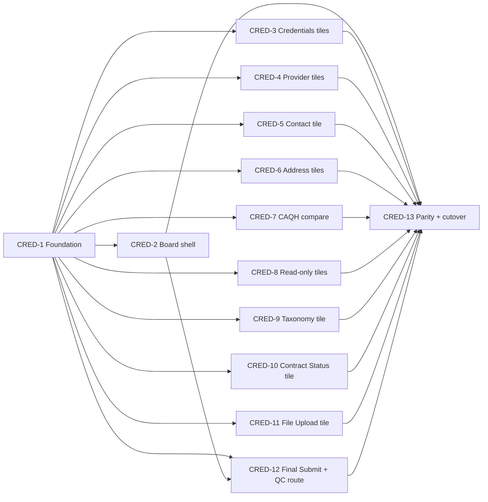

# EPIC: Initial Credentialing Review — Tile Dashboard (Combined App Review + PSV)

> **Source design:** [Credentialing_Tile_Design_Technical_Design.md](../Credentialing_Tile_Design_Technical_Design.md) (v1.0)
> **USA session:** `20260701_145408_f93a1ad2` · **Vertical:** PNM · **Generated:** 2026-07-01
> **Dependency graph id:** `b4cb98e29447`

Replace the two monolithic OmniScripts (Application Review + Initial Cred PSV) with **one tile dashboard** on the Case Manager (`IndividualApplication`). Tile status is **derived from existing Case Manager verification fields** (no new custom objects, no backfill), and Final Submit adds a **route-directly-to-QC** handoff via the same `PRM_ReviewPSVCaseRecordsUpdate` IP the OmniScripts already use.

---

## 1. Execution order, dependencies & parallel waves

| Wave | Stories (run in parallel) | Blocked by |
|---|---|---|
| **Wave 0 (foundation)** | **CRED-1** | — |
| **Wave 1 (shell)** | **CRED-2** | CRED-1 |
| **Wave 1 (tiles — all parallel with CRED-2 and each other)** | **CRED-3, CRED-4, CRED-5, CRED-6, CRED-7, CRED-8, CRED-9, CRED-10, CRED-11** | CRED-1 |
| **Wave 2 (submit)** | **CRED-12** | CRED-1, CRED-2 |
| **Wave 3 (harden + cutover)** | **CRED-13** | all above |

**How many devs?** After CRED-1 merges, up to **~10 developers** can work concurrently (CRED-2 + the nine tile stories + CRED-12), because each owns disjoint files (see §3).

| Story | Title | Priority | Effort (AI-est.) | Owns (primary files) |
|---|---|---|---|---|
| CRED-1 | Foundation: CMDT + read-model controller + permission set | Critical | 3d | `PRM_CredTile_Config__mdt` (type), `PRM_VerificationReviewController`, `PRM_CredTileDashboard_Access` |
| CRED-2 | Tile board shell productionization | Critical | 4d | `prmCredTileBoard`, `prmCredTileCard`, `prmCredTileProgress` |
| CRED-3 | Credentials cluster tiles | High | 2d | CMDT records: education, license, dea, cds, boardCert |
| CRED-4 | Provider cluster tiles | High | 2d | CMDT records: practitionerInfo, demographics, languages |
| CRED-5 | Contact tile | Medium | 1d | CMDT record: contact |
| CRED-6 | Address cluster tiles | High | 4d | CMDT records: groupPractice, address |
| CRED-7 | CAQH compare surface | Medium | 1.5d | CMDT record: caqh |
| CRED-8 | Read-only CAQH-display tiles | Medium | 2d | `prmCredTileWorkHistory`, `prmCredTileMalpractice` + 2 CMDT records |
| CRED-9 | Taxonomy & Specialty tile | High | 2d | `prmCredTileTaxonomy` + 1 CMDT record |
| CRED-10 | Contract Status tile | Medium | 1.5d | `prmCredTileContractStatus` + 1 CMDT record |
| CRED-11 | File Upload tile | Low | 1d | `prmCredTileFileUpload` + 1 CMDT record |
| CRED-12 | Final Submit + route-to-QC | Critical | 3d | `prmCredFinalSubmit` + `submitCredentialingReview` method |
| CRED-13 | Parity validation + cutover | High | 3d | test/config only |

---

## 2. Shared foundation contract (delivered by CRED-1)

**`PRM_CredTile_Config__mdt`** — one metadata record per tile (this is what makes tiles parallelizable). Fields:

| Field | Type | Meaning |
|---|---|---|
| `Label` (DeveloperName + MasterLabel) | — | stable tile id + display label |
| `PRM_Sequence__c` | Number | render order |
| `PRM_Icon__c` | Text | SLDS icon (e.g. `standard:record`) |
| `PRM_Required__c` | Checkbox | blocks Final Submit until Completed |
| `PRM_SourceField__c` | Text(255) | API name of the `IndividualApplication` field that drives status (blank = derive from data presence / net-new tile) |
| `PRM_CompletedValues__c` | Text | comma-sep values meaning **Completed** (e.g. `Data Looks Good`) |
| `PRM_AttentionValues__c` | Text | comma-sep values meaning **Needs Attention** (e.g. `Missing Information,Issue Found,Unable to Proceed`) |
| `PRM_LaunchTarget__c` | Text | `c__`-prefixed component to launch as a subtab (blank = read-only/net-new) |
| `PRM_TileComponent__c` | Text | net-new LWC to render inline (optional) |
| `PRM_Available__c` | Checkbox | false = "Coming Soon" |

**`PRM_VerificationReviewController.getReviewState(Id caseManagerId)`** reads all active CMDT records, builds **one dynamic SOQL** over the distinct `PRM_SourceField__c` values on `IndividualApplication` (`WITH USER_MODE`), and returns per-tile derived status + a progress rollup. Tiles never edit the controller.

### Tile -> source field map (target; `[VERIFY]` rows to confirm on the layout)

| Tile (CMDT record) | `PRM_SourceField__c` | Story |
|---|---|---|
| license | `PRM_LicenseVerification__c` | CRED-3 |
| education | `PRM_EducationVerification__c` | CRED-3 |
| dea | `PRM_DEAVerification__c` | CRED-3 |
| cds | `PRM_CDSVerification__c` | CRED-3 |
| boardCert | Board Certification PSV field `[VERIFY]` | CRED-3 |
| practitionerInfo | `PRM_AttestationVerification__c` / data presence `[VERIFY]` | CRED-4 |
| demographics | data presence `[VERIFY]` | CRED-4 |
| languages | data presence `[VERIFY]` | CRED-4 |
| contact | data presence `[VERIFY]` | CRED-5 |
| groupPractice | `PRM_ContractStatus__c` / Service Area `[VERIFY]` | CRED-6 |
| address | Service Area PSV / data presence `[VERIFY]` | CRED-6 |
| caqh | n/a (read-only compare) | CRED-7 |
| workHistory | `PRM_WorkHistoryVerification__c` | CRED-8 |
| malpractice | `PRM_MalpracticeCoverageVerification__c` | CRED-8 |
| taxonomy | `PRM_SpecialtyVerification__c` (+ `PRM_SpecialtyPSV__c`) | CRED-9 |
| contractStatus | `PRM_ContractStatus__c` | CRED-10 |
| fileUpload | ContentDocumentLink presence | CRED-11 |
| finalSubmit | `PRM_PSVOutcome__c` | CRED-12 |

---

## 3. Parallel-safety contract (every story MUST follow)

1. **CMDT records, not shared files.** Each tile story adds **its own** `force-app/main/default/customMetadata/PRM_CredTile_Config.<tileId>.md-meta.xml` file(s). No story edits another story's record file. (The graph flags a shared `PRM_CredTile_Config__mdt` *type* — but the *type* is delivered once by CRED-1; records are per-story files, so there is no write collision.)
2. **No edits to existing action centers** (`prmLaunch*Action`, `prmAppReviewCaqhMatch`, `prmCaqhProfile`, controllers). Reuse is by **launch/reference** only.
3. **No edits to the board** (`prmCredTileBoard`) from tile stories — the board renders generically from CMDT.
4. **No edits to `PRM_VerificationReviewController`** from tile stories — it reads source fields dynamically from CMDT. (Only CRED-12 adds the `submitCredentialingReview` method.)
5. **Net-new tile LWCs** live in their own `prmCredTile<Name>` bundle — disjoint folders.
6. **FlexiPage:** do not edit the existing Case Manager record page; CRED-2 owns placement via its own component/region.

---

## 4. Definition of Done (all stories)

- Follows `.cursor/skills/salesforce-development/SKILL.md` + LWC best-practices (SLDS, ARIA, `@wire` error handling).
- Apex `with sharing` + CRUD/FLS (`WITH USER_MODE`); no SOQL/DML in loops; bulk-safe.
- Jest + Apex **>=85%** coverage (bulk + negative paths; assert DOM/events, not internal props).
- No hardcoded Ids; config via CMDT/Custom Labels.
- Parallel-safety contract (§3) honored — PR `git diff` touches only the story's own files.
- Grounded API names (no invented `*__c`); `[VERIFY]` items confirmed before that story's tests.
