# ReCredentialing: PSV → QC → Committee — Flowchart for Lucidchart

**Source:** OmniStudio exports in this repo (`PRM_RecredQC_English`, `PRM_NonRoutineCommitteeReview_English`).

**Lucidchart:**  
1. **Option A:** Copy the **Mermaid** block below → [mermaid.live](https://mermaid.live) → Export PNG/SVG → **Insert → Image** in Lucidchart.  
2. **Option B:** Lucidchart **Mermaid** import (if your plan supports it): *Import → Mermaid*.  
3. **Option C:** Use this doc as a **swimlane checklist** — create 4 swimlanes (*System*, *Reviewer*, *Case / CM*, *Committee / MD*) and add shapes per the numbered sections.

---

## High-level process (business)

| Phase | OmniScript / artifact | Typical trigger |
|--------|------------------------|-----------------|
| **Recred PSV + QC** | `PRM / RecredQC / English` | Case record — **Recred PSV QC Review** button |
| **Non-routine committee** | `PRM / NonRoutineCommitteeReview / English` | Committee / SVNR case flow (includes **CaseStatusRecred**, **RecredDueDate**) |
| **Routine committee (initial cred context)** | `PRM / ReviewInitialCredApplicants / English` (RoutineCredCommitteeTable) | Different record type; listed for comparison |

---

## Detailed flow — `PRM_RecredQC_English` (single guided flow: App review + PSV + QC + MDR handoff)

### 1. Bootstrap & validation
- **SetFlowVariables** → **IPFetchParInformation** → **DRTransformGroupData**
- **Invalid case?** → **InvalidCase** → **InvalidCaseError** (stop path)

### 2. Review Submit (pre-step)
- **SetValuesReviewSubmit** → **ReviewSubmit**

### 3. **Application review** — step `ReviewPractitioner` (demographics & directory-style data)
- Provider identifiers: NPI, CAQH ID, name, DOB, email, gender  
- Role, primary & additional specialty, degrees (read-only license block), telehealth  
- Group: NPI, Tax ID, name, practice type  
- **Addresses:** primary office (full), mailing, billing, additional locations + capabilities  
- DE&I: racial/cultural, Hispanic/Latino, racial identity, cultural identity  
- Languages, personal pronouns, affirming care  
- Primary & secondary contact blocks, company website  
- **ConfirmationToProceed** → **SetPractitionerSpecialtyFields**

### 4. **Primary Source Verification (PSV)** — transforms & blocks
- **DRTransformPSVScreenData**, **DRTransformReCredData**
- **PSV practitioner / CAQH**
  - **PSVPractitionerBlock**: name, NPI, group name/Tax ID  
  - **IPValidateNPI** → on error **SetErrorIndividualNPI**  
  - **IPValidateCAQHAppReviewParent** → **ErrorScreen** / **CAQHAPIError** path  
  - **IPGetPracticeLocationForAdmittingCAQH** → **DRTransformCAQHPSVResponse**  
  - **CAQHSignatureAttestionStep**: signature, **prmViewFileFromSDS**, attestation fields  
- **Service area / practice location** — **ServiceAreaVerificationStep**  
  - Manual PSV practice address fields; **CAQHPracticeAddressBlk** (CAQH mirror)  
  - **ReCredServiceAreaVerification** (Recred-specific verification)  
- **Licenses** — **VerifyLicense** (read-only + CAQH business license + **LicenseVerifcationRD**)  
- **Specialty** — **VerifySpecialty**, FRML fields, **VerifyCareTaxonomyRD**, **IPToCountPrimaryTaxonomy** (multiple primary → error)  
- **Practitioner role** — **VerifyPractitionerRole** (HFN PL taxonomy / role)  
- **Admitting privileges** — **AdmittingPrivileges** (hospital block, **FetchHospital**)  
- **Insurance (COI)** — **CertificateofInsuranceVerification** + CAQH insurance block  
- **Specialty verification outcome** — **SetRecordSpecialtyVerification** → **IPUpdateSpecailtyReviewResult**; failures → **UpdateFailedPSVReview** / **ResultAppReviewError** / **NavigateCaseManagerPSV**  
- **Work history** — **WorkHistoryVerification** + CAQH work history  
- **Education** — **EducationVerification** + **CAQHPersonEducation** + outcomes  
- **Patient status** — **PatientStatus** / practice location context  
- **DEA** — **DEAVerification** + CAQH DEA + radio outcome  
- **CDS** — **CDSVerification** + CAQH CDS + radio outcome  
- **Disclosures** — **DisclosureQuestionsStep** + **CAQHDisclosureQuestions**  
- **Sanctions / NPDB** — **IPFetchSanctionLogs**, **NPDBResults**, **LWCNPDBResult**, verify checkbox & dates  
- **Board certification** — **BoardCertificationsStep** + **ReCredBoardCert** fields + radio  
- **Medicare opt-out** — **VerifyMedicareOptOut**  
- **External checks** — **VerifyLinks**: **QCFSMB**, **QCSAM**, **QCCMSPreclusion**  
- **UploadFiles** (supporting docs)

### 5. **PSV summary & routing**
- **PSVSummary** + formula blocks (contract, attestation, SAV, license, specialty, admitting, insurance, WH, education, DEA, CDS, disclosure, board, FSMB, Medicare, CMS, SAM, NPDB…)  
- **ProceedTo** / **ProceedToNote**  
- **ReCredPSVSummary** + **ReCredProceedTo** / **ReCredQCNote** (Recred read-only summary columns: CAQH sig, SAV, license, specialty, admitting, insurance, WH, DEA, CDS, disclosure, board, FSMB, Medicare, CMS, SAM, NPDB, etc.)

### 6. **QC review**
- **QCReviewSummary**  
- **QCProceedTo** vs **QCReturnTo** (return toward PSV)  
- **QCProceedToNote**  
- Optional **ContentNote** path: **SetCreateMissingInfoNote**, **SetMissingContentNote**, **SetContentNoteTemplate**, **SetContentNoteForReCred**

### 7. **Medical Director Review (MDR) form** — step **MDRFormStep**
- **ReCredMDRHeading**  
- Sub-fields: submitted date, corporate status, practitioner, specialty, sanction review, dates settled, amounts, other concerns, ReCred reviewed/approved by & date, NPDB action/second date/NPDB date  

### 8. **Persist & case manager routing**
- **SetRecordPSVQC**, **SetRecordRecredQC_CR**, **SetRecordRecredQC_MDR**, **SetRecordRecredQC_FD**  
- **SetRecordRecredQCReturnToPSV**, **SetRecordReCredPSV**, **SetRecordQCReturnTo**  
- **SetReCredProviderOutreachFinal**  
- Flags: **SetQCReadyForCommittee**, **SetQCReadyForMedicalReview**, **SetQCReadyForCommitteeFalse**  
- **IPUpdateRecredReviewUpdate** (Integration Procedure)  
- Success: **NavigateToCaseManager**  
- Failures: **UpdateFailed**, **ResultPSVReviewError**, etc.

---

## Committee flow — `PRM_NonRoutineCommitteeReview_English` (separate OmniScript)

1. **SetFlowType** → **IPToFetchRoutineCaseDetails**  
2. Invalid case → **InvalidCase** → **TBInvalidCase**  
3. **UpdateCaseStatus**  
4. **CaseStatus** / **CaseStatusRecred** (Recred-specific branch in UI)  
5. **DenialReason**, **DecisionDate**, **TerminationType**, messages, **Notes**  
6. **NCApprovedDate**, **RecredDueDate** (Recred)  
7. **SetForMDApproved**  
8. **Conditional branches (examples):**
   - **SVNRSentToCommittee**  
   - **SVNRCommitteeApproved**  
   - **SVForNCApprovedCredTrue**  
   - **SVNRCommitteeDeniedAppealOpen**  
   - **SVNRCommitteeAppealed**  
   - **SVNRCommitteeDeniedClosed** / **NRCommitteeDeniedClosed**  
   - **SVMedicalDirecPendAddnInfo**  
   - **SVNRCommitteePenProviderOutreach**  
   - **SVNRCommitteeSpecialistReview**  
   - **NonCommiteeDueProcessHearing**  
9. **IPNonroutineRecordsUpdate**  
10. **ErrorStep** / **NavigateCaseManager**

---

## Mermaid — paste into mermaid.live or compatible Lucid import

```mermaid
flowchart TB
  subgraph BOOT["RecredQC — Bootstrap"]
    A[Start: Case page — Recred PSV QC Review] --> B[SetFlowVariables]
    B --> C[IPFetchParInformation]
    C --> D[DRTransformGroupData]
    D --> E{Valid case?}
    E -->|No| F[InvalidCase → InvalidCaseError]
    E -->|Yes| G[SetValuesReviewSubmit → ReviewSubmit]
  end

  subgraph AR["Application review — ReviewPractitioner"]
    G --> H[Demographics: NPI, CAQH, name, DOB, gender, role]
    H --> I[Specialties & degrees; telehealth; group NPI/TIN/name]
    I --> J[Primary / mailing / billing / additional addresses]
    J --> K[DE&I, languages, pronouns, contacts]
    K --> L[ConfirmationToProceed → SetPractitionerSpecialtyFields]
  end

  subgraph PSV["PSV — Primary Source Verification"]
    L --> M[DRTransformPSVScreenData + DRTransformReCredData]
    M --> N[PSV block: NPI + IPValidateNPI]
    N --> O[IPValidateCAQHAppReviewParent]
    O --> P[CAQH attestation + Signature + SDS]
    P --> Q[ServiceAreaVerificationStep + ReCredServiceAreaVerification]
    Q --> R[Licenses + Specialty + Role + Admitting + COI]
    R --> S{Specialty OK?}
    S -->|No| S1[IPUpdateSpecailtyReviewResult / NavigateCaseManagerPSV]
    S -->|Yes| T[Work history + Education + Patient status]
    T --> U[DEA + CDS + Disclosures]
    U --> V[NPDB / Sanctions + Board cert]
    V --> W[Medicare opt-out + FSMB/SAM/CMS + Upload]
  end

  subgraph SUM["PSV / Recred summaries"]
    W --> X[PSVSummary + formulas]
    X --> Y[ReCredPSVSummary + ReCredProceedTo]
  end

  subgraph QC["QC review"]
    Y --> Z[QCReviewSummary]
    Z --> AA{QCProceedTo vs QCReturnTo}
    AA -->|Return to PSV| M
    AA -->|Proceed| AB[QCProceedToNote + optional ContentNote path]
  end

  subgraph MDR["Medical Director Review"]
    AB --> AC[MDRFormStep: sanctions, NPDB, approval, amounts…]
  end

  subgraph OUT["Save & navigate"]
    AC --> AD[SetRecord* + QCReadyForCommittee / MedicalReview flags]
    AD --> AE[IPUpdateRecredReviewUpdate]
    AE --> AF[NavigateToCaseManager]
    AE -->|Error| AG[UpdateFailed / ResultPSVReviewError]
  end

  subgraph COMM["NonRoutineCommitteeReview — separate flow"]
    C1[Start: Committee case / SVNR] --> C2[IPToFetchRoutineCaseDetails]
    C2 --> C3[CaseStatus / CaseStatusRecred]
    C3 --> C4[Denial / decision / termination / Notes]
    C4 --> C5[RecredDueDate / NCApprovedDate]
    C5 --> C6{Outcome branches}
    C6 --> C7[Sent to committee / Approved / Denied / Appeal / MD pending / Outreach / Specialist / Due process]
    C7 --> C8[IPNonroutineRecordsUpdate]
    C8 --> C9[NavigateCaseManager]
  end

  AF -.->|Case opens committee work| C1
```

---

## Lucidchart shape legend (manual build)

| Shape | Use for |
|--------|---------|
| Rounded rectangle | Start / End |
| Rectangle | Step, Integration Procedure, Set Values |
| Diamond | Decision (valid case, QC proceed, committee outcome)  
| Swimlane rows | PSV reviewer, QC, MD, Committee, System |

---

## File references (repo)

| Flow | DataPack |
|------|-----------|
| Recred PSV + QC + MDR | `vlocity_export/OmniScript/PRM_RecredQC_English/PRM_RecredQC_English_DataPack.json` |
| Non-routine committee | `vlocity_export/OmniScript/PRM_NonRoutineCommitteeReview_English/PRM_NonRoutineCommitteeReview_English_DataPack.json` |

---

*Generated from IBXQA vlocity_export OmniScript metadata. Adjust swimlanes and decision labels to match your org’s Case Types and stage picklists.*
