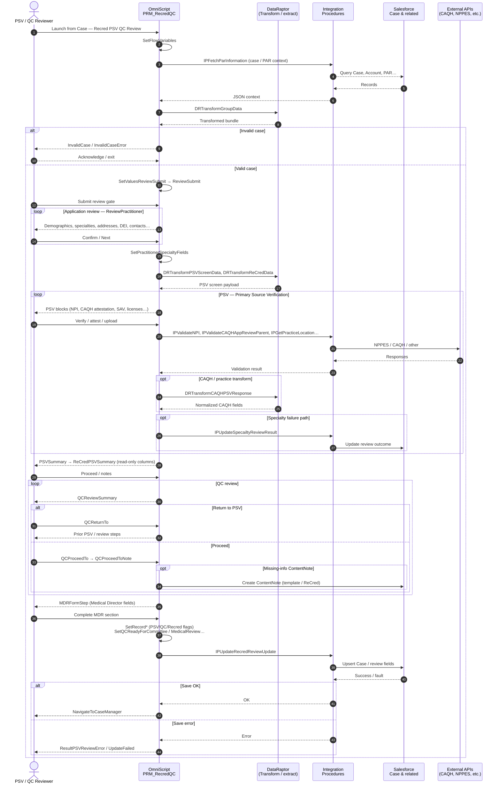
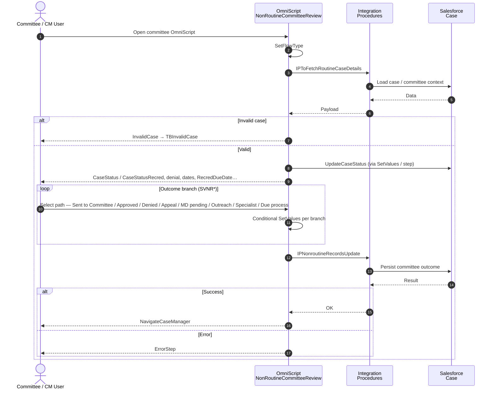

# ReCredentialing — Sequence diagram for Lucidchart

Lucidchart cannot be generated as a binary file from this repo. Use one of these:

| Method | Steps |
|--------|--------|
| **Mermaid → image** | Copy the code block below → [mermaid.live](https://mermaid.live) → **Actions → PNG/SVG** → In Lucid: **Insert → Image**. |
| **Mermaid import** | Lucidchart **Import** (Enterprise / add-on): choose **Mermaid** and paste the same block. |
| **Manual** | Lucid **Template → Sequence diagram**; add lifelines matching the `participant` names below; mirror messages left-to-right. |

**Source metadata:** `PRM_RecredQC_English`, `PRM_NonRoutineCommitteeReview_English` DataPacks in `vlocity_export/OmniScript/`.

---

## Diagram 1 — Recred PSV + QC + save (main OmniScript)

Shows reviewer ↔ OmniScript ↔ Integration Procedures / DataRaptor ↔ Salesforce. External systems (CAQH, NPPES, FSMB, etc.) are collapsed as **External APIs** where the script calls validation/fetch IPs.

---

## Diagram 2 — Non-routine committee (separate OmniScript)

Use when the case moves to committee / SVNR outcomes after QC (or parallel track).

---

## Lucidchart manual checklist (if not using Mermaid)

**Lifelines (left → right):** Reviewer | OmniScript RecredQC | DataRaptor | Integration Procedures | Salesforce | External APIs  

**Fragment boxes:** `alt` Invalid case | `loop` Application review | `loop` PSV | `alt` QC return vs proceed | `opt` ContentNote | `alt` Save OK vs error  

**Second page:** Committee user | NonRoutine OmniScript | IP | Salesforce | same `alt`/`loop` pattern for SVNR branches.

---

## See also

- `requirements/Recred_PSV_QC_Committee_Lucid_Flowchart.md` — detailed flowchart + step list.
